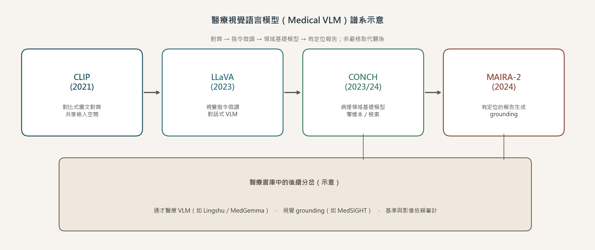

**導覽：** [Home](../) · [AI Basics](./)

# 醫療視覺語言模型：從 CLIP 對齊到有定位報告

## 來源

- **定位**：常青概念文（非單篇論文筆記），說明 **醫療視覺語言模型（medical vision-language model, medical VLM）** 如何從通用圖文對齊，走到領域基礎模型與「有定位」的報告生成。
- **觸發論文**：[CONCH](../ai-papers/2026-09-15-conch-pathology-vlm.md)、[Lingshu](../ai-papers/2026-09-15-lingshu-medical-vlm.md)、[MAIRA-2](../ai-papers/2026-09-15-maira-2-grounded-reporting.md) 等書庫筆記都假設讀者已大致理解 VLM；本篇補譜系語言。
- **核心 landmark**
  - [CLIP](https://arxiv.org/abs/2103.00020)（Radford et al.；對比式自然語言監督視覺模型）
  - [LLaVA](https://arxiv.org/abs/2304.08485)（Liu et al.；視覺指令微調）
  - [CONCH](https://arxiv.org/abs/2307.12914)（Lu et al.；病理視覺語言基礎模型；期刊版見 [Nature Medicine 作者手稿](https://pmc.ncbi.nlm.nih.gov/articles/PMC11384335/)）
  - [MAIRA-2](https://arxiv.org/abs/2406.04449)（Bannur et al.；有定位的放射報告生成）

**編輯：** Curitis

醫療影像要跟報告、標籤或臨床問題對上話，先要有共享的圖文表示，再能做成可問答、可生成、甚至可指出「這句話對應影像哪裡」的系統——這條線就是 medical VLM 的核心譜系。

## 流程

*圖：從 CLIP 對比對齊、LLaVA 視覺指令微調、CONCH 病理領域基礎模型，到 MAIRA-2 有定位（grounding）報告生成；下方示意書庫中的通才醫療 VLM、視覺 grounding 與基準／影像依賴審計分岔。EFAI-RD 自製，非原文圖重製。*

## 為何需要

純影像分類模型輸出的是類別分數；純語言模型看不到像素。臨床工作流卻同時需要「看圖」與「寫／讀文字」：零樣本辨識、檢索相似病例、回答多模態問題、起草報告，以及檢查句子是否真的對應到影像區域。

CLIP 展示：用大量圖文對，以對比學習把影像與自然語言拉進同一嵌入空間，就能做 zero-shot 分類與跨模態檢索，而不必為每個下游任務重新標一大套封閉類別 [(ref: clip)](https://arxiv.org/abs/2103.00020)。LLaVA 再把視覺編碼接到大型語言模型，並用視覺指令資料做微調，讓模型能以對話形式回答圖像相關問題 [(ref: llava)](https://arxiv.org/abs/2304.08485)。醫療場景接著要面對：領域詞彙、染色／模態差異、以及「文字正確但指錯位置」的風險——於是出現病理基礎模型與 grounded reporting 等分支。

## 核心概念

1. **圖文對齊（alignment）**：影像編碼與文字編碼對到同一空間；相似度可用於分類、檢索或作為後續模組的輸入 [(ref: clip)](https://arxiv.org/abs/2103.00020)。
2. **視覺指令微調（visual instruction tuning）**：在對齊之上，讓模型學會遵循「看這張圖，回答／生成……」這類指令，輸出開放式自然語言 [(ref: llava)](https://arxiv.org/abs/2304.08485)。
3. **領域基礎模型（domain foundation model）**：在特定醫學子域（如病理全切片）用領域圖文資料預訓練，使零樣本與轉移任務更貼近該域的視覺—語言分佈 [(ref: conch)](https://arxiv.org/abs/2307.12914) [(ref: conch_nm)](https://pmc.ncbi.nlm.nih.gov/articles/PMC11384335/)。
4. **有定位的生成（grounded generation）**：報告或描述不只「寫得出來」，還要能把語句對應到影像區域（bounding box／localization），以便人工核對與評估「指對地方」[(ref: maira2)](https://arxiv.org/abs/2406.04449)。

## 發展譜系與 landmark

| 階段 | 代表 | 貢獻（據原文主張） |
|------|------|-------------------|
| 對比式圖文對齊 | [CLIP](https://arxiv.org/abs/2103.00020) | 以自然語言監督學習可遷移視覺模型；在未見類別上展現 zero-shot 轉移能力 [(ref: clip)](https://arxiv.org/abs/2103.00020)。 |
| 對話式 VLM | [LLaVA](https://arxiv.org/abs/2304.08485) | 提出視覺指令微調，把視覺編碼與 LLM 接成可多輪視覺對話的助手，並開源模型與資料管線 [(ref: llava)](https://arxiv.org/abs/2304.08485)。 |
| 病理領域基礎 | [CONCH](https://arxiv.org/abs/2307.12914) | 病理視覺語言基礎模型；期刊版報告大規模圖文預訓練與多套下游評估（含零樣本分類等）[(ref: conch)](https://arxiv.org/abs/2307.12914) [(ref: conch_nm)](https://pmc.ncbi.nlm.nih.gov/articles/PMC11384335/)。 |
| 有定位報告 | [MAIRA-2](https://arxiv.org/abs/2406.04449) | 針對胸腔 X 光提出 grounded radiology report generation，並搭配可分開評估文字正確與定位的評測思路 [(ref: maira2)](https://arxiv.org/abs/2406.04449)。 |

譜系不是「後者刪除前者」：通才醫療 VLM 仍常建立在對齊＋指令微調之上；grounding 則是在生成正確性之外，多問一句「指到哪裡」。書庫裡的 [Lingshu](../ai-papers/2026-09-15-lingshu-medical-vlm.md)、[MedGemma](../ai-papers/2026-09-16-medgemma-1-5.md)、[MedSIGHT](../ai-papers/2026-09-17-medsight-grounded-medical-vlm.md) 等，可視為通才路線與 grounding 路線的後續分岔，而非另一套互斥教義。

## 與醫療 AI 的連結

讀醫療 VLM 論文時，可用三個問題對齊本篇譜系：（1）它主要做對齊、指令跟隨、還是領域專精預訓練？（2）輸出是類別／嵌入、開放回答，還是帶定位的報告？（3）評估有沒有把「文字分」與「是否看圖／指對位置」分開？例如 CONCH 強調病理圖文基礎與零樣本轉移邊界 [(ref: conch_nm)](https://pmc.ncbi.nlm.nih.gov/articles/PMC11384335/)；MAIRA-2 把 grounding 當成報告生成的一等公民 [(ref: maira2)](https://arxiv.org/abs/2406.04449)；後續基準與影像依賴審計（書庫中的 medical VLM benchmark、ModaLens 等）則在追問模型是否真的用到影像。

## 常見誤解

- **「有 VLM 就等於會看片」**：對齊或指令微調只保證模態接得上；臨床可用性仍取決於資料域、預期用途與外部驗證，不能從通用對話能力直接外推。
- **「報告流暢 = 看對影像」**：流利文字可能來自語言先驗；沒有 grounding 或影像依賴審計時，難區分「背報告」與「讀這張圖」[(ref: maira2)](https://arxiv.org/abs/2406.04449)。
- **「領域基礎模型取代通用 VLM」**：CONCH 等解決的是病理等子域分佈；通才醫療 VLM 與 grounding 方法仍在並行發展，選型應看任務與模態，而不是只比參數量。

## 與書庫其他文章的關係

把譜系中的 CLIP 式圖文對齊從整卷影像下推到單一器官的 3D 實例，並附多中心真實世界與讀者研究證據: [RADAR：把腹部 CT 拆成 18 個器官再對齊報告，通才模型能到專家水準嗎？](../ai-papers/2026-09-21-radar-abdominal-ct-generalist.md)

一句話敘述關係: [CONCH：病理圖文預訓練如何轉成零樣本分類，評估又有哪些邊界？](../ai-papers/2026-09-15-conch-pathology-vlm.md) 是本譜系「領域基礎模型」階段的病理實例與評估邊界筆記。

一句話敘述關係: [MAIRA-2：胸腔 X 光報告的文字正確，定位也正確嗎？](../ai-papers/2026-09-15-maira-2-grounded-reporting.md) 對應「有定位報告」階段，示範如何把 grounding 與文字正確性分開看。

一句話敘述關係: [Lingshu：醫療 VLM 如何整合影像、文字與合成資料，RL 又帶來多少改變？](../ai-papers/2026-09-15-lingshu-medical-vlm.md) 屬通才醫療 VLM 分岔，可對照本篇對齊→指令微調→領域專精的上游語言。

一句話敘述關係: [MedGemma 1.5：4B 模型如何讀取 3D 影像、全切片與縱向胸片？](../ai-papers/2026-09-16-medgemma-1-5.md) 提供另一條通才多模態基礎模型路線，與 Lingshu 同屬後續分岔而非 CLIP 替代品。

一句話敘述關係: [MedSIGHT：醫療 VLM 能否一邊診斷、一邊把病灶分割出來？](../ai-papers/2026-09-17-medsight-grounded-medical-vlm.md) 延伸 grounding 問題：不只報告生成，也要求診斷文字對回像素級區域。

一句話敘述關係: [醫療 VLM 走了多遠？七套基準下的模型規模、領域微調與推理落差](../ai-papers/2026-09-15-medical-vlm-benchmark.md) 用基準地圖檢驗「模型宣稱的能力」與跨任務表現是否對得上。

## 實務的啟發

1. 先寫清任務輸出：嵌入／分類、開放問答，還是必須附定位的報告——再決定要對齊模型、指令 VLM，還是 grounded 系統。
2. 評估至少拆兩層：語言指標（流暢、事實句）與視覺依據（是否看圖、指對區域）；不要只用單一 BLEU／ROUGE 下結論。
3. 領域基礎模型與通才醫療 VLM 可並存：病理切片、胸腔 X 光、多模態 EHR 各有資料與風險輪廓，選型看模態與 intended use，而非品牌敘事。

## References

- **clip** — Radford et al. *Learning Transferable Visual Models From Natural Language Supervision*. [arXiv:2103.00020](https://arxiv.org/abs/2103.00020)
- **llava** — Liu et al. *Visual Instruction Tuning*. [arXiv:2304.08485](https://arxiv.org/abs/2304.08485)
- **conch** — Lu et al. *Towards a Visual-Language Foundation Model for Computational Pathology*. [arXiv:2307.12914](https://arxiv.org/abs/2307.12914) · [Nature Medicine 作者手稿](https://pmc.ncbi.nlm.nih.gov/articles/PMC11384335/)
- **maira2** — Bannur et al. *MAIRA-2: Grounded Radiology Report Generation*. [arXiv:2406.04449](https://arxiv.org/abs/2406.04449) · [HTML](https://arxiv.org/html/2406.04449v2)
- **lingshu** — *Lingshu…*. [arXiv:2506.07044](https://arxiv.org/abs/2506.07044)
- **medsight** — *MedSIGHT…*. [arXiv:2606.06760](https://arxiv.org/abs/2606.06760)

**導覽：** [Home](../) · [AI Basics](./)
