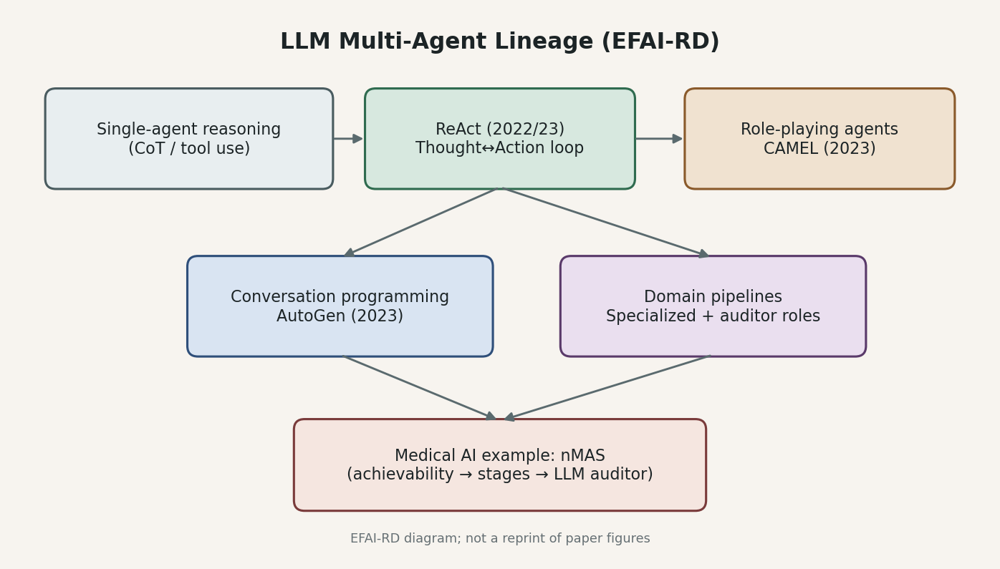

**導覽：** [Home](../) · [AI Basics](./)

# LLM 多代理系統：從 ReAct 到可對話協作

## 來源

- **定位**：常青概念文（非單篇論文筆記），說明 LLM **multi-agent（多代理）** 如何從單代理推理／行動，演進到可對話、可角色分工的協作。
- **觸發論文**：[Tracing the Heart（nMAS）](../ai-papers/2026-09-15-tracing-the-heart.md)（arXiv:2608.06366）以多代理管線做心衰竭特徵工程。
- **核心 landmark**
  - [ReAct](https://arxiv.org/abs/2210.03629)（Yao et al.；ICLR 2023）
  - [CAMEL](https://arxiv.org/abs/2303.17760)（Li et al.，2023）
  - [AutoGen](https://arxiv.org/abs/2308.08155)（Wu et al.，2023）

**編輯：** Curitis

單代理 LLM 會「想一步、做一步」；多代理則把任務拆成可對話、可稽核的角色協作——醫療場景常需要後者才能把工具呼叫、規則與人工審核接起來。

## 流程

*圖：從單代理推理／工具使用，經 ReAct 與角色扮演（CAMEL），到對話編程框架（AutoGen）與領域管線中的專責＋稽核角色；底層示意連到醫療 nMAS 例。EFAI-RD 自製，非原文圖重製。*

## 為何需要

純對話或單次生成，很難穩定完成「查資料 → 改狀態 → 再推理」的長程任務。ReAct 把 **reasoning traces** 與 **task-specific actions** 交錯產生，讓模型能在計畫與外部觀察之間來回更新 [(ref: react)](https://arxiv.org/abs/2210.03629)。

當任務需要多種專長（例如規劃、寫碼、查表、審核），把能力拆成多個 **communicative agents**，再用對話協調，比把所有規則塞進單一 prompt 更可維護 [(ref: camel)](https://arxiv.org/abs/2303.17760) [(ref: autogen)](https://arxiv.org/abs/2308.08155)。

## 核心概念

1. **單代理 ReAct 迴圈**：Thought → Action → Observation；推理用來調整行動，行動從環境／工具取證再餵回推理 [(ref: react)](https://arxiv.org/abs/2210.03629)。
2. **角色扮演多代理**：以 inception prompting 等機制固定角色與目標，讓代理之間自主對話合作，減少每一步都靠人類帶話 [(ref: camel)](https://arxiv.org/abs/2303.17760)。
3. **對話編程（conversation programming）**：先定義可對話代理（可接 LLM／工具／人類），再定義互動模式（雙人聊、群聊、巢狀對話等），用對話驅動控制流 [(ref: autogen)](https://arxiv.org/abs/2308.08155)。
4. **領域管線中的專責＋稽核**：實務系統常不是「大家閒聊」，而是固定階段＋有界 LLM（例如只改白名單欄位）；這是多代理思想在產品／研究管線上的收斂，而非另一套通用框架名稱。

## 發展譜系與 landmark

| 階段 | 代表 | 貢獻（據原文主張） |
|------|------|-------------------|
| 交錯推理與行動 | [ReAct](https://arxiv.org/abs/2210.03629) | 在 QA／事實驗證與互動決策基準上，展示 Reason+Act 優於只推理或只行動的提示範式；並強調可解釋軌跡 [(ref: react)](https://arxiv.org/abs/2210.03629)。 |
| 可溝通代理社會 | [CAMEL](https://arxiv.org/abs/2303.17760) | 提出 role-playing 溝通代理框架，研究多代理指令遵循合作，並開源函式庫 [(ref: camel)](https://arxiv.org/abs/2303.17760)。 |
| 工程化多代理應用 | [AutoGen](https://arxiv.org/abs/2308.08155) | 以可自訂、可對話代理與彈性對話模式，作為建構多代理 LLM 應用的通用框架，並展示數學、寫碼、QA 等試點 [(ref: autogen)](https://arxiv.org/abs/2308.08155)。 |

譜系不是嚴格「誰取代誰」：ReAct 仍常嵌在單一代理或某個角色內；CAMEL／AutoGen 則把「多個角色如何說話」提升成一等公民。

## 與醫療 AI 的連結

心衰竭特徵工程管線 **nMAS** 把流程拆成可行性檢查、多階段表處理、rubric 複合特徵，以及有界 **LLM auditor**——這是「專責代理＋稽核角色」在 EHR 場景的具體化，而不是通用聊天室 [(ref: nmas §4)](https://arxiv.org/html/2608.06366#S4)。閱讀該文時，可把多代理 basics 當成架構語言：誰負責确定性步驟、誰允許有界生成、證據如何回溯。

## 常見誤解

- **「多代理 = 比較聰明」**：多角色若不界定工具邊界與停止條件，只會放大幻覺與成本；landmark 強調的是可組合的互動模式，不是自動變強 [(ref: autogen)](https://arxiv.org/abs/2308.08155)。
- **「有 ReAct 就不需要多代理」**：ReAct 解決單代理的推理—行動交錯；多代理解決角色分工與對話協調，兩者常疊加 [(ref: react)](https://arxiv.org/abs/2210.03629) [(ref: camel)](https://arxiv.org/abs/2303.17760)。
- **「醫療多代理已等於臨床可用」**：領域管線論文的離線／dummy 評估，不能外推成已驗證的臨床效益；需看該文限制與外部驗證設計 [(ref: nmas §6)](https://arxiv.org/html/2608.06366#S6)。

## 與書庫其他文章的關係

一句話敘述關係: [Tracing the Heart：證據可追溯的心衰竭特徵工程管線（nMAS）](../ai-papers/2026-09-15-tracing-the-heart.md) 是多代理「專責＋有界稽核」在心衰竭 EHR 特徵工程上的實例。

一句話敘述關係: [CareConnect：把 LLM 擋在診斷之外，醫療掛號代理的安全如何驗證？](../ai-papers/2026-09-16-careconnect-healthcare-agent.md) 以單一 LLM router、確定性安全閘門與結構化工具，提供「代理不一定是多代理」的醫療行政對照案例。

一句話敘述關係: [arXiv 收緊 AI 生成內容政策：幻覺引用等可致一年禁投](../industry-watch/2026-09-15-arxiv-ai-content-policy.md) 從預印本平台端說明未核對 LLM 生成內容（含幻覺引用）的投稿後果。

一句話敘述關係: [AI 龍頭罕見同調：Amodei 發表〈We Must Pace the Frontier〉，OpenAI、DeepMind、xAI 表態支持](../industry-watch/2026-09-15-amodei-pace-the-frontier.md) 記錄多代理群體失控的真實事件（OpenAI–Hugging Face）如何促成產業層級的調速倡議。

## 實務的啟發

1. 先畫角色與資料邊界，再選框架；不要先堆代理數。
2. 能確定性完成的步驟（清洗、規則評分）優先非 LLM；LLM 放在起草、有界校正或解釋。
3. 對話軌跡與工具觀測要能稽核，否則多代理只是更難除錯的單代理。

## References

- **react** — Yao et al. *ReAct: Synergizing Reasoning and Acting in Language Models*. [arXiv:2210.03629](https://arxiv.org/abs/2210.03629) · [HTML](https://arxiv.org/html/2210.03629)
- **camel** — Li et al. *CAMEL: Communicative Agents for "Mind" Exploration of Large Language Model Society*. [arXiv:2303.17760](https://arxiv.org/abs/2303.17760)
- **autogen** — Wu et al. *AutoGen: Enabling Next-Gen LLM Applications via Multi-Agent Conversation*. [arXiv:2308.08155](https://arxiv.org/abs/2308.08155)
- **nmas** — Shimgekar et al. *Tracing the Heart…*. [HTML](https://arxiv.org/html/2608.06366) · [`#S4`](https://arxiv.org/html/2608.06366#S4) · [`#S6`](https://arxiv.org/html/2608.06366#S6)

**導覽：** [Home](../) · [AI Basics](./)
