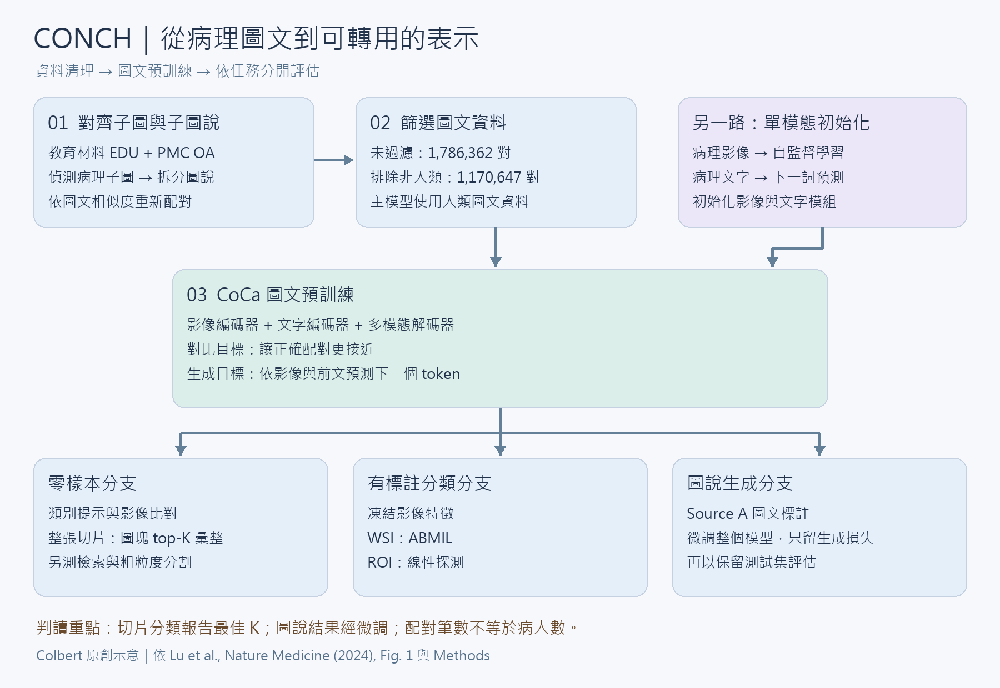

[Home](../) · [AI Papers](./)

# CONCH：病理圖文預訓練如何轉成零樣本分類，評估又有哪些邊界？

## 來源

- **單位／團隊**：Faisal Mahmood 團隊；作者單位包括 Brigham and Women’s Hospital 與 Massachusetts General Hospital 的 Harvard Medical School 病理部門、Broad Institute、Dana-Farber Cancer Institute、MIT、Harvard University，以及 Ohio State University Wexner Medical Center。[(ref: main 作者與單位)](https://pmc.ncbi.nlm.nih.gov/articles/PMC11384335/)
- **作者**：Ming Y. Lu、Bowen Chen、Drew F. K. Williamson、Richard J. Chen、Ivy Liang、Tong Ding、Guillaume Jaume、Igor Odintsov、Long Phi Le、Georg Gerber、Anil V. Parwani、Andrew Zhang、Faisal Mahmood；前三位共同貢獻。[(ref: main 作者與單位)](https://pmc.ncbi.nlm.nih.gov/articles/PMC11384335/)
- **完整篇名與出版**：*A visual-language foundation model for computational pathology*，Nature Medicine 30, 863–874，2024-03-19 出版。[(ref: main 書目)](https://pmc.ncbi.nlm.nih.gov/articles/PMC11384335/)
- **原文**：[DOI:10.1038/s41591-024-02856-4](https://doi.org/10.1038/s41591-024-02856-4) · [期刊頁](https://www.nature.com/articles/s41591-024-02856-4) · [PMC 作者手稿全文](https://pmc.ncbi.nlm.nih.gov/articles/PMC11384335/) · [官方補充表格](https://media.springernature.com/original/springer-static/esm/art%3A10.1038%2Fs41591-024-02856-4/MediaObjects/41591_2024_2856_MOESM1_ESM.pdf) · [官方程式庫](https://github.com/mahmoodlab/CONCH)。
- **版本範圍**：本文依 2024 年論文的完整作者手稿與期刊補充資料；同源 [arXiv:2307.12914v2](https://arxiv.org/abs/2307.12914v2) 是 2023-07-25 的 *Towards a Visual-Language Foundation Model for Computational Pathology*。早期摘要列 13 套基準，2024 年摘要列 14 套，本文實驗數字均取後者及其補充表。[(ref: preprint 版本與摘要)](https://arxiv.org/abs/2307.12914) [(ref: main 摘要)](https://pmc.ncbi.nlm.nih.gov/articles/PMC11384335/#ABS1)

**編輯：** Colbert

CONCH 把病理圖像與描述學成可比較的表示，在指定癌別的零樣本分類中表現突出，但多類腦瘤辨識與圖說生成仍顯示明確的能力邊界。[(ref: main 分類與罕見疾病)](https://pmc.ncbi.nlm.nih.gov/articles/PMC11384335/#S2) [(ref: main 腦瘤分類)](https://pmc.ncbi.nlm.nih.gov/articles/PMC11384335/#S4) [(ref: main 圖說生成)](https://pmc.ncbi.nlm.nih.gov/articles/PMC11384335/#F14)

## 流程

*圖 1：Colbert 依原文重新繪製的流程示意。圖中的資料量為圖文配對筆數；圖文預訓練前另有影像與文字各自的預訓練，下游有標籤學習與零樣本評估分開進行。[(ref: main Fig. 1)](https://pmc.ncbi.nlm.nih.gov/articles/PMC11384335/#F1) [(ref: main 單模態預訓練)](https://pmc.ncbi.nlm.nih.gov/articles/PMC11384335/#S11) [(ref: main 監督式分類)](https://pmc.ncbi.nlm.nih.gov/articles/PMC11384335/#S14) [(ref: main 圖說微調)](https://pmc.ncbi.nlm.nih.gov/articles/PMC11384335/#S16)*

## 背景／問題

作者要解決的是病理標註難以為每一種疾病、每一項任務持續擴充的問題：除了圖像，教學材料與研究文章也包含組織形態的文字描述，因此研究改以圖文配對建立可轉用的視覺語言模型（Vision-Language Model, VLM）。[(ref: main 摘要與研究背景)](https://pmc.ncbi.nlm.nih.gov/articles/PMC11384335/#ABS1) [(ref: main Discussion)](https://pmc.ncbi.nlm.nih.gov/articles/PMC11384335/#S7)

本書庫關注三個問題：文字描述如何變成分類器？小圖塊的比對如何推到整張切片？當可選類別變多時，模型是否還能維持表現？這些問題決定模型適合拿來做哪一種原型，也決定下一步應該蒐集何種標註。

## 方法摘要

CONCH 的名稱來自 CONtrastive learning from Captions for Histopathology。模型採用對比式圖說學習（Contrastive Captioners, CoCa）圖文預訓練框架，包含影像編碼器、文字編碼器及多模態文字解碼器，同時學習圖文配對與依圖生成描述；兩項損失等權重結合。[(ref: main Fig. 1)](https://pmc.ncbi.nlm.nih.gov/articles/PMC11384335/#F1) [(ref: main Visual-language pretraining)](https://pmc.ncbi.nlm.nih.gov/articles/PMC11384335/#S10)

推論時，先將候選類別寫成提示句，把影像與提示句轉成向量，再比較餘弦相似度；整張切片影像（Whole-Slide Image, WSI）則先拆成圖塊，再彙整圖塊分數。另有兩條使用標註的實驗：凍結影像編碼器後訓練分類器，以及微調模型生成圖說。[(ref: main 零樣本轉移)](https://pmc.ncbi.nlm.nih.gov/articles/PMC11384335/#S12) [(ref: main WSI 彙整)](https://pmc.ncbi.nlm.nih.gov/articles/PMC11384335/#S13) [(ref: main 監督式分類)](https://pmc.ncbi.nlm.nih.gov/articles/PMC11384335/#S14) [(ref: main 圖說微調)](https://pmc.ncbi.nlm.nih.gov/articles/PMC11384335/#S16)

## 方法詳解

### 1. 資料清理先處理「哪張圖對應哪段文字」

原始來源分為教育材料 EDU 與 PubMed Central 開放取用文章集 PMC OA。作者先用 YOLOv5 偵測病理子圖，再用經微調的生成式文字模型拆分多圖圖說，最後以對比式語言影像預訓練（Contrastive Language–Image Pre-training, CLIP）模型的圖文相似度將子圖配給最接近的子圖說；之後依圖說排除非人類樣本。[(ref: main Dataset curation)](https://pmc.ncbi.nlm.nih.gov/articles/PMC11384335/#S9)

本書庫的解讀是，這裡的資料品質問題發生在模型訓練之前：一張病理圖即使清楚，若配到同一面板中另一張圖的說明，也會教給模型錯誤的圖文關係。實作時可保存原始面板、裁切座標與子圖說，讓抽查能回到配對步驟。

### 2. 對比學習與生成學習共用影像骨幹

影像端採視覺 Transformer（Vision Transformer, ViT）base 架構，經兩個注意力彙整模組分別產生一個全局影像 token 與 256 個供圖說解碼使用的影像 tokens；前者負責圖文對齊，後者保留生成描述需要的局部訊息。[(ref: main Visual-language pretraining)](https://pmc.ncbi.nlm.nih.gov/articles/PMC11384335/#S10)

對比損失讓同一批資料中正確配對的圖文比錯配圖文更接近；圖說損失則根據影像及前面的文字預測下一個 token。圖文訓練前，影像骨幹先做病理影像自監督學習，文字模型先讀病理相關文本；這表示「117 萬圖文對」並未涵蓋模型接觸過的全部預訓練資料。[(ref: main 訓練目標)](https://pmc.ncbi.nlm.nih.gov/articles/PMC11384335/#S10) [(ref: main 單模態初始化)](https://pmc.ncbi.nlm.nih.gov/articles/PMC11384335/#S11)

### 3. 零樣本分類仍有提示與彙整設定

每類可有多種名稱及句型，提示集成使用同類提示的平均向量。WSI 的 MI-Zero 流程則對每一類取相似度最高的 K 個圖塊，平均成切片分數，再選最高分類。作者測試 K∈{1, 5, 10, 50, 100}，並報告主要指標最佳的 K。[(ref: main 提示集成)](https://pmc.ncbi.nlm.nih.gov/articles/PMC11384335/#S12) [(ref: main top-K pooling)](https://pmc.ncbi.nlm.nih.gov/articles/PMC11384335/#S13)

**本書庫的判讀**：這些切片結果包含依表現選擇 K 的步驟。該段沒有明示一個獨立驗證集用於這項選擇，因此不宜把表列成績當成「K 已預先固定後的一次盲測」。若在自己的資料上比較，應先用獨立驗證集決定 K，再鎖定測試流程。[(ref: main K 的選擇規則)](https://pmc.ncbi.nlm.nih.gov/articles/PMC11384335/#S13)

### 4. 三種下游使用方式要分開評估

零樣本檢索沿用圖文相似度排序；粗粒度分割把圖塊分類分數放回原位置，重疊區域取平均。監督式 WSI 分類另以注意力式多實例學習（Attention-Based Multiple-Instance Learning, ABMIL）整合凍結的影像特徵；感興趣區域（Region of Interest, ROI）分類則使用線性探測。圖說實驗進一步微調整個模型，僅保留生成損失。[(ref: main 檢索)](https://pmc.ncbi.nlm.nih.gov/articles/PMC11384335/#S12) [(ref: main 分割)](https://pmc.ncbi.nlm.nih.gov/articles/PMC11384335/#S13) [(ref: main ABMIL 與線性探測)](https://pmc.ncbi.nlm.nih.gov/articles/PMC11384335/#S14) [(ref: main 圖說微調)](https://pmc.ncbi.nlm.nih.gov/articles/PMC11384335/#S16)

這些設定回答不同問題：本書庫建議把「無任務標註能做多少」與「加入標註後能改善多少」分列，讓讀者看清資料成本與效能的關係。

## 資料與實驗

### 預訓練資料

以下數量依原文記錄，圖塊、圖文對與報告不能相加當成獨立病人數。[(ref: main 資料清理)](https://pmc.ncbi.nlm.nih.gov/articles/PMC11384335/#S9) [(ref: main 單模態資料)](https://pmc.ncbi.nlm.nih.gov/articles/PMC11384335/#S11)

| 用途 | 資料與規模 | 單位／範圍 |
|---|---|---|
| 影像單模態初始化 | 21,442 張 WSI 擷取 1,600 萬個圖塊 | 院內病理影像；與圖文對分開計算 |
| 文字單模態初始化 | 超過 550,000 份手術病理報告的最終診斷段落、超過 400,000 篇病理相關 PubMed 摘要及教育文本 | 報告來自 Massachusetts General Hospital |
| 圖文清理後、未過濾 | 1,786,362 對 | EDU 與 PMC-Path |
| 主模型採用的人類圖文資料 | 1,170,647 對 | 排除圖說提到非人類動物的樣本 |
| 僅 H&E 的消融資料 | 457,372 對 | 從人類資料再篩選蘇木精－伊紅染色（hematoxylin and eosin, H&E） |

圖文預訓練共 40 epochs，輸入為 448×448 pixels；使用 8 張 80 GB A100，總 batch size 384、梯度累積 4 次，故有效 batch size 為 1,536。[(ref: main 圖文預訓練)](https://pmc.ncbi.nlm.nih.gov/articles/PMC11384335/#S10) [(ref: supp Table 32，PDF 第 8 頁)](https://media.springernature.com/original/springer-static/esm/art%3A10.1038%2Fs41591-024-02856-4/MediaObjects/41591_2024_2856_MOESM1_ESM.pdf#page=8)

### 本文重點評估資料

TCGA 指癌症基因體圖譜（The Cancer Genome Atlas）。論文還評估其他組織分類、跨模態檢索、分割與 Gleason 分級；下表聚焦本導讀重現的分類與圖說實驗。[(ref: main 完整評估資料)](https://pmc.ncbi.nlm.nih.gov/articles/PMC11384335/#S18)

| 資料集／任務 | 評估資料量與類別 | 有標註實驗的切分 |
|---|---|---|
| TCGA BRCA／乳癌亞型 | 150 張 WSI，浸潤性導管癌與浸潤性小葉癌各 75 張 | 881 張訓練；排除測試病人的其他切片 |
| TCGA RCC／腎細胞癌亞型 | 225 張 WSI，透明細胞型、乳突型與嫌色細胞型各 75 張 | 693 張訓練；排除測試病人的其他切片 |
| TCGA NSCLC／非小細胞肺癌亞型 | 150 張 WSI，肺腺癌與肺鱗狀細胞癌各 75 張 | 846 張訓練；排除測試病人的其他切片 |
| EBRAINS／腦瘤亞型 | 573 張測試 WSI，30 類 | 1,151 張訓練、595 張驗證；以切片數記錄 |
| Source A／圖說生成 | 797 組圖文對；圖說經病理醫師清理 | 558 訓練、77 驗證、162 測試；按原始 figure 分組切分 |

資料表依作者手稿 Methods 與補充 Table 30。手稿的 BRCA、NSCLC 段落將抽樣母集寫成「TCGA RCC」，與各段疾病名稱不一致；本文依段落標題、類別及補充表 1–3 呈現任務，不據此推論不同癌別共用腎癌資料。[(ref: main Downstream evaluation datasets)](https://pmc.ncbi.nlm.nih.gov/articles/PMC11384335/#S18) [(ref: supp Tables 1–3)](https://media.springernature.com/original/springer-static/esm/art%3A10.1038%2Fs41591-024-02856-4/MediaObjects/41591_2024_2856_MOESM1_ESM.pdf#page=2) [(ref: supp Table 30)](https://media.springernature.com/original/springer-static/esm/art%3A10.1038%2Fs41591-024-02856-4/MediaObjects/41591_2024_2856_MOESM1_ESM.pdf#page=7)

### 三個切片分類任務：補充 Tables 1–3 全表

以下保留原表 0–1 尺度與括號內 95% 信賴區間（Confidence Interval, CI），各指標越高越好。Balanced accuracy 是各類召回率的平均；Weighted F1 依各類樣本數加權；接收者操作特徵曲線下面積（Area Under the Receiver Operating Characteristic Curve, ROC AUC）衡量分數排序，不能解讀成正確分類比例。這組實驗使用提示集成及前述最佳 K 規則。[(ref: main 指標定義)](https://pmc.ncbi.nlm.nih.gov/articles/PMC11384335/#S17) [(ref: main K 選擇)](https://pmc.ncbi.nlm.nih.gov/articles/PMC11384335/#S13)

**TCGA BRCA（n=150）：Supplementary Data Table 1。** [(ref: supp Table 1)](https://media.springernature.com/original/springer-static/esm/art%3A10.1038%2Fs41591-024-02856-4/MediaObjects/41591_2024_2856_MOESM1_ESM.pdf#page=2)

| Model name | Balanced accuracy | Weighted F1 | ROC AUC |
|---|---:|---:|---:|
| CONCH | 0.913 (0.866, 0.960) | 0.913 (0.867, 0.960) | 0.943 (0.897, 0.979) |
| PLIP | 0.507 (0.500, 0.523) | 0.348 (0.263, 0.438) | 0.688 (0.600, 0.771) |
| BiomedCLIP | 0.553 (0.510, 0.600) | 0.465 (0.358, 0.557) | 0.852 (0.784, 0.912) |
| OpenAICLIP | 0.500 (0.500, 0.500) | 0.333 (0.255, 0.418) | 0.643 (0.544, 0.726) |

**TCGA RCC（n=225）：Supplementary Data Table 2。** [(ref: supp Table 2)](https://media.springernature.com/original/springer-static/esm/art%3A10.1038%2Fs41591-024-02856-4/MediaObjects/41591_2024_2856_MOESM1_ESM.pdf#page=2)

| Model name | Balanced accuracy | Weighted F1 | ROC AUC |
|---|---:|---:|---:|
| CONCH | 0.902 (0.860, 0.938) | 0.903 (0.863, 0.938) | 0.975 (0.955, 0.992) |
| PLIP | 0.804 (0.755, 0.850) | 0.797 (0.740, 0.850) | 0.956 (0.932, 0.975) |
| BiomedCLIP | 0.791 (0.737, 0.840) | 0.789 (0.733, 0.842) | 0.924 (0.893, 0.950) |
| OpenAICLIP | 0.347 (0.333, 0.363) | 0.194 (0.141, 0.252) | 0.673 (0.626, 0.719) |

**TCGA NSCLC（n=150）：Supplementary Data Table 3。** [(ref: supp Table 3)](https://media.springernature.com/original/springer-static/esm/art%3A10.1038%2Fs41591-024-02856-4/MediaObjects/41591_2024_2856_MOESM1_ESM.pdf#page=2)

| Model name | Balanced accuracy | Weighted F1 | ROC AUC |
|---|---:|---:|---:|
| CONCH | 0.907 (0.859, 0.948) | 0.907 (0.860, 0.947) | 0.962 (0.933, 0.984) |
| PLIP | 0.787 (0.720, 0.849) | 0.786 (0.720, 0.847) | 0.838 (0.768, 0.899) |
| BiomedCLIP | 0.780 (0.713, 0.843) | 0.776 (0.704, 0.840) | 0.877 (0.819, 0.922) |
| OpenAICLIP | 0.553 (0.503, 0.604) | 0.478 (0.382, 0.570) | 0.603 (0.514, 0.689) |

### 更細的分類：補充 Table 21 全表

EBRAINS 的 30 類零樣本分類，n=573；同為 0–1 尺度及 95% CI。此處依官方補充 PDF 的表號：零樣本為 **Table 21**，監督式為 **Table 20**。[(ref: supp Table 21)](https://media.springernature.com/original/springer-static/esm/art%3A10.1038%2Fs41591-024-02856-4/MediaObjects/41591_2024_2856_MOESM1_ESM.pdf#page=6) [(ref: supp Table 20)](https://media.springernature.com/original/springer-static/esm/art%3A10.1038%2Fs41591-024-02856-4/MediaObjects/41591_2024_2856_MOESM1_ESM.pdf#page=5)

| Model name | Balanced accuracy | Weighted F1 | ROC AUC |
|---|---:|---:|---:|
| CONCH | 0.371 (0.331, 0.409) | 0.359 (0.320, 0.399) | 0.941 (0.934, 0.948) |
| PLIP | 0.121 (0.088, 0.154) | 0.087 (0.063, 0.113) | 0.796 (0.778, 0.812) |
| BiomedCLIP | 0.201 (0.176, 0.232) | 0.124 (0.096, 0.152) | 0.866 (0.851, 0.880) |
| OpenAICLIP | 0.064 (0.054, 0.073) | 0.029 (0.016, 0.045) | 0.623 (0.604, 0.642) |

### 圖說生成：補充 Table 30 全表

Source A 的測試集為 162 組圖文；所有比較模型均經微調。原表欄位為 METEOR、ROUGE（方法節指定 ROUGE-1），數值為原始尺度與 95% CI，越高越好。這些文字相似度分數不是醫師判定的診斷正確率。[(ref: supp Table 30)](https://media.springernature.com/original/springer-static/esm/art%3A10.1038%2Fs41591-024-02856-4/MediaObjects/41591_2024_2856_MOESM1_ESM.pdf#page=7) [(ref: main captioning 與解碼)](https://pmc.ncbi.nlm.nih.gov/articles/PMC11384335/#S16) [(ref: main METEOR／ROUGE 定義)](https://pmc.ncbi.nlm.nih.gov/articles/PMC11384335/#S17)

| Model name | METEOR | ROUGE |
|---|---:|---:|
| CONCH | 0.195 (0.182, 0.211) | 0.214 (0.199, 0.230) |
| GIT-base | 0.122 (0.115, 0.130) | 0.135 (0.125, 0.145) |
| GIT-large | 0.125 (0.117, 0.134) | 0.153 (0.143, 0.163) |

作者以 1,000 次非參數 bootstrap 建立 95% CI，以 1,000 次雙尾配對置換檢定比較模型。CI 描述這套評估下的抽樣不確定性，並未涵蓋新醫院、不同掃描器或整套重新訓練的變異；後半句是本書庫對推論範圍的提醒。[(ref: main Statistical analysis)](https://pmc.ncbi.nlm.nih.gov/articles/PMC11384335/#S21) [(ref: main 跨資料條件限制)](https://pmc.ncbi.nlm.nih.gov/articles/PMC11384335/#S7)

## 結果

- **指定癌別內的分類表現強，但有選模條件。** CONCH 在 BRCA、RCC、NSCLC 的 balanced accuracy 分別為 0.913、0.902、0.907；這些是提示集成及最佳 K 下的結果，不能省略該設定。[(ref: supp Tables 1–3)](https://media.springernature.com/original/springer-static/esm/art%3A10.1038%2Fs41591-024-02856-4/MediaObjects/41591_2024_2856_MOESM1_ESM.pdf#page=2) [(ref: main top-K 規則)](https://pmc.ncbi.nlm.nih.gov/articles/PMC11384335/#S13)
- **類別擴大後，排序分數與最終分類會呈現不同面貌。** EBRAINS 的 CONCH ROC AUC 為 0.941，balanced accuracy 則為 0.371。兩者衡量不同事物，本書庫不把高 AUC 解讀成「九成腦瘤診斷正確」。[(ref: supp Table 21)](https://media.springernature.com/original/springer-static/esm/art%3A10.1038%2Fs41591-024-02856-4/MediaObjects/41591_2024_2856_MOESM1_ESM.pdf#page=6) [(ref: main 指標定義)](https://pmc.ncbi.nlm.nih.gov/articles/PMC11384335/#S17)
- **EBRAINS 監督式數字有來源差異。** 作者手稿正文寫 CONCH+ABMIL 為 68.2%，並把監督式結果指向 Table 21；官方補充 Table 20 卻列 0.687（95% CI 0.646–0.729），Table 21 才是零樣本結果。本文保留這個不一致，不將兩者合成單一精確數值。[(ref: main Application to classification of rare diseases)](https://pmc.ncbi.nlm.nih.gov/articles/PMC11384335/#S4) [(ref: supp Table 20)](https://media.springernature.com/original/springer-static/esm/art%3A10.1038%2Fs41591-024-02856-4/MediaObjects/41591_2024_2856_MOESM1_ESM.pdf#page=5) [(ref: supp Table 21)](https://media.springernature.com/original/springer-static/esm/art%3A10.1038%2Fs41591-024-02856-4/MediaObjects/41591_2024_2856_MOESM1_ESM.pdf#page=6)
- **生成能力需要另看錯誤內容。** 微調後 CONCH 的 METEOR／ROUGE 高於表列 GIT 基線，但作者亦觀察到生成圖說逐字重複訓練資料的情形。這支持進一步檢查生成內容的依據與記憶化問題。[(ref: supp Table 30)](https://media.springernature.com/original/springer-static/esm/art%3A10.1038%2Fs41591-024-02856-4/MediaObjects/41591_2024_2856_MOESM1_ESM.pdf#page=7) [(ref: main Extended Data Fig. 9)](https://pmc.ncbi.nlm.nih.gov/articles/PMC11384335/#F14)

## 限制

作者明列尚未系統檢驗染色、組織製備與掃描器差異下的穩健性；資料以來源層級留出，雖可降低重疊，仍未解決近重複影像偵測問題。部分院內資料也無法公開取得，重現預訓練流程會受限。[(ref: main Discussion)](https://pmc.ncbi.nlm.nih.gov/articles/PMC11384335/#S7) [(ref: main Data availability)](https://pmc.ncbi.nlm.nih.gov/articles/PMC11384335/#S28)

MI-Zero 的 top-K 平均較適合不同類別形態互斥的任務。作者指出，Gleason 評分需要同時考慮主要與次要形態，而腫瘤篩查可能只要一個陽性區域就應判陽性；這些情境不能直接假設相同彙整規則合用。[(ref: main Discussion：pooling 適用範圍)](https://pmc.ncbi.nlm.nih.gov/articles/PMC11384335/#S7)

本書庫另提醒：零樣本不代表沒有提示選擇，類別預先指定也不等於能辨認未知疾病；本研究的離線任務與圖說例子沒有建立病人效益或臨床漏診風險的估計。規劃應用時，應把這些需求轉成獨立評估，而非由平均分數外推。[(ref: main 零樣本設定)](https://pmc.ncbi.nlm.nih.gov/articles/PMC11384335/#S12) [(ref: main 罕見疾病與開放辨識)](https://pmc.ncbi.nlm.nih.gov/articles/PMC11384335/#S4) [(ref: main Discussion)](https://pmc.ncbi.nlm.nih.gov/articles/PMC11384335/#S7)

## 與書庫其他文章的關係

CONCH 的病理圖文配對與對比／生成目標，可對照 Lingshu 的醫療資料整理、分階段對齊與指令訓練，兩篇的任務與分數應各自解讀: [Lingshu：醫療 VLM 如何整合影像、文字與合成資料，RL 又帶來多少改變？](2026-09-15-lingshu-medical-vlm.md)

上述比較依兩篇各自的訓練設計。[(ref: main 圖文預訓練)](https://pmc.ncbi.nlm.nih.gov/articles/PMC11384335/#S10) [(ref: lingshu §2–3)](https://arxiv.org/html/2506.07044v4#S2) [(ref: lingshu §3)](https://arxiv.org/html/2506.07044v4#S3)

## 實務的啟發

以下是本書庫提出的實驗建議：

1. **先把任務寫成可驗證的選擇。** 以固定類別的切片分類或病理教學圖像檢索起步，先定義什麼算找對、漏掉與誤配，讓模型輸出能逐筆檢查。
2. **把資料配對視為需要測量的步驟。** 抽查裁切子圖與拆分圖說的對應率，保留出處；擴大資料量前，先確認錯配率有沒有上升。
3. **固定提示與 K，再打開測試集。** 將 prompt、影像前處理與 pooling 設定一起版本化，同時報告各類召回率與錯誤案例，避免調參選擇被藏進單一成績。
4. **分開估算標註與複核成本。** 比較零樣本、少量標註 ABMIL、完整監督式分類各自的改善；若轉向圖說生成，另請病理醫師核對形態描述、否定句及缺漏，文字相似度只作輔助。

## References

- **main** — Lu MY, Chen B, Williamson DFK, et al. *A visual-language foundation model for computational pathology*. Nature Medicine 30, 863–874 (2024)。[完整作者手稿](https://pmc.ncbi.nlm.nih.gov/articles/PMC11384335/) · [DOI](https://doi.org/10.1038/s41591-024-02856-4) · [期刊頁](https://www.nature.com/articles/s41591-024-02856-4) · [官方程式庫](https://github.com/mahmoodlab/CONCH)。
  - 研究與結果：[摘要](https://pmc.ncbi.nlm.nih.gov/articles/PMC11384335/#ABS1) · [Fig. 1](https://pmc.ncbi.nlm.nih.gov/articles/PMC11384335/#F1) · [分類](https://pmc.ncbi.nlm.nih.gov/articles/PMC11384335/#S2) · [腦瘤分類](https://pmc.ncbi.nlm.nih.gov/articles/PMC11384335/#S4) · [Discussion](https://pmc.ncbi.nlm.nih.gov/articles/PMC11384335/#S7) · [生成例子與限制](https://pmc.ncbi.nlm.nih.gov/articles/PMC11384335/#F14)。
  - 方法與資料：[資料清理](https://pmc.ncbi.nlm.nih.gov/articles/PMC11384335/#S9) · [圖文預訓練](https://pmc.ncbi.nlm.nih.gov/articles/PMC11384335/#S10) · [單模態初始化](https://pmc.ncbi.nlm.nih.gov/articles/PMC11384335/#S11) · [提示與檢索](https://pmc.ncbi.nlm.nih.gov/articles/PMC11384335/#S12) · [WSI／top-K](https://pmc.ncbi.nlm.nih.gov/articles/PMC11384335/#S13) · [監督式分類](https://pmc.ncbi.nlm.nih.gov/articles/PMC11384335/#S14) · [圖說微調](https://pmc.ncbi.nlm.nih.gov/articles/PMC11384335/#S16) · [指標](https://pmc.ncbi.nlm.nih.gov/articles/PMC11384335/#S17) · [評估資料](https://pmc.ncbi.nlm.nih.gov/articles/PMC11384335/#S18) · [統計分析](https://pmc.ncbi.nlm.nih.gov/articles/PMC11384335/#S21) · [資料取得](https://pmc.ncbi.nlm.nih.gov/articles/PMC11384335/#S28)。
- **supp** — 同篇官方 *Supplementary Information*，Supplementary Tables 1–44。[完整 PDF](https://media.springernature.com/original/springer-static/esm/art%3A10.1038%2Fs41591-024-02856-4/MediaObjects/41591_2024_2856_MOESM1_ESM.pdf)；[Tables 1–3，PDF 第 2 頁](https://media.springernature.com/original/springer-static/esm/art%3A10.1038%2Fs41591-024-02856-4/MediaObjects/41591_2024_2856_MOESM1_ESM.pdf#page=2) · [Table 20，第 5 頁](https://media.springernature.com/original/springer-static/esm/art%3A10.1038%2Fs41591-024-02856-4/MediaObjects/41591_2024_2856_MOESM1_ESM.pdf#page=5) · [Table 21，第 6 頁](https://media.springernature.com/original/springer-static/esm/art%3A10.1038%2Fs41591-024-02856-4/MediaObjects/41591_2024_2856_MOESM1_ESM.pdf#page=6) · [Table 30，第 7 頁](https://media.springernature.com/original/springer-static/esm/art%3A10.1038%2Fs41591-024-02856-4/MediaObjects/41591_2024_2856_MOESM1_ESM.pdf#page=7) · [Table 32，第 8 頁](https://media.springernature.com/original/springer-static/esm/art%3A10.1038%2Fs41591-024-02856-4/MediaObjects/41591_2024_2856_MOESM1_ESM.pdf#page=8)。表格保留官方補充資料的數值、欄名與信賴區間。
- **preprint** — Lu MY et al. *Towards a Visual-Language Foundation Model for Computational Pathology*，arXiv:2307.12914。[書目與版本紀錄](https://arxiv.org/abs/2307.12914) · [2023 年 v2](https://arxiv.org/abs/2307.12914v2)。僅用於識別同源版本。
- **lingshu** — LASA Team et al. *Lingshu: A Generalist Foundation Model for Unified Multimodal Medical Understanding and Reasoning*，arXiv:2506.07044v4 (2025)。[全文](https://arxiv.org/html/2506.07044v4) · [§2 資料](https://arxiv.org/html/2506.07044v4#S2) · [§3 訓練](https://arxiv.org/html/2506.07044v4#S3)。

[Home](../) · [AI Papers](./)
