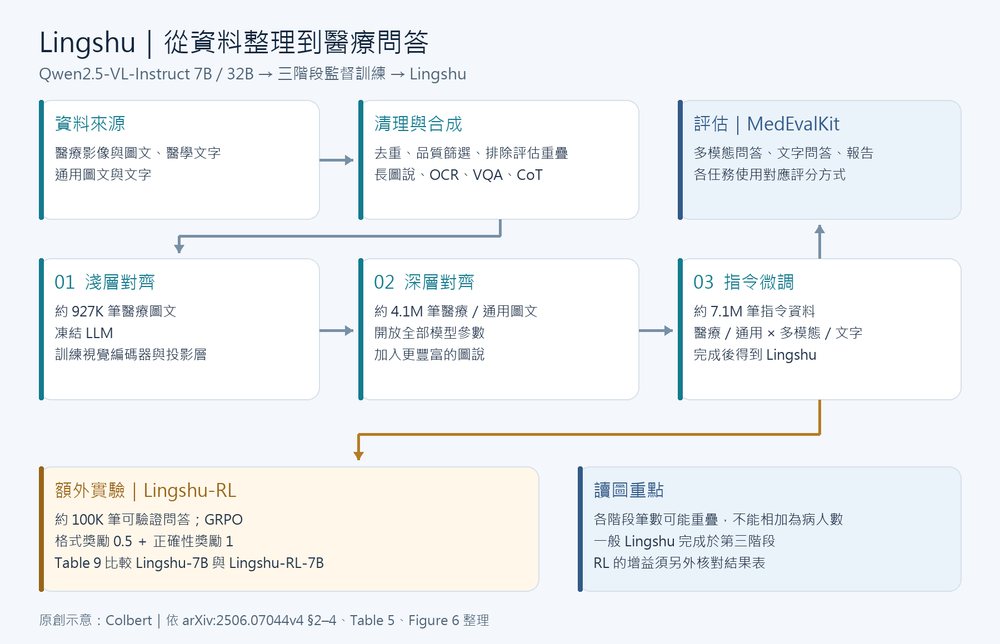

[Home](../) · [AI Papers](./)

# Lingshu：醫療 VLM 如何整合影像、文字與合成資料，RL 又帶來多少改變？

## 來源

- **單位／團隊**：Alibaba Group 的 DAMO Academy，LASA Team。[(ref: main 作者欄)](https://arxiv.org/html/2506.07044v4)
- **作者**：LASA Team、Weiwen Xu、Hou Pong Chan、Long Li、Mahani Aljunied、Ruifeng Yuan、Jianyu Wang、Chenghao Xiao、Guizhen Chen、Chaoqun Liu、Zhaodonghui Li、Yu Sun、Junao Shen、Chaojun Wang、Jie Tan、Deli Zhao、Tingyang Xu、Hao Zhang、Yu Rong。[(ref: main 書目)](https://arxiv.org/abs/2506.07044)
- **完整篇名**：*Lingshu: A Generalist Foundation Model for Unified Multimodal Medical Understanding and Reasoning*。
- **年份與版本**：2025 年技術報告；首次提交 2025-06-08，本文依 2025-06-13 的 v4。[(ref: main 版本紀錄)](https://arxiv.org/abs/2506.07044)
- **原文**：[arXiv:2506.07044](https://arxiv.org/abs/2506.07044) · [v4 全文](https://arxiv.org/html/2506.07044v4) · [DOI:10.48550/arXiv.2506.07044](https://doi.org/10.48550/arXiv.2506.07044) · [官方專案](https://alibaba-damo-academy.github.io/lingshu/)。

**編輯：** Colbert

Lingshu 以醫療影像、醫學文字及通用資料持續訓練 Qwen2.5-VL，在作者的醫療多模態問答評估中取得較高平均分數，但額外強化學習未提升七套基準的平均成績。[(ref: main §3)](https://arxiv.org/html/2506.07044v4#S3) [(ref: main Table 6)](https://arxiv.org/html/2506.07044v4#S5.T6) [(ref: main Table 9)](https://arxiv.org/html/2506.07044v4#S5.T9)

## 流程

*圖 1：Colbert 依原文 §2–4、Table 5 與 Figure 6 重新繪製的流程示意；前三階段產生 Lingshu，額外的強化學習產生 Lingshu-RL。數量表示各階段資料筆數，不能加總為不重複病人數。[(ref: main Table 5)](https://arxiv.org/html/2506.07044v4#S3.T5) [(ref: main Fig. 6)](https://arxiv.org/html/2506.07044v4#S3.F6) [(ref: main §4)](https://arxiv.org/html/2506.07044v4#S4)*

## 背景／問題

作者把醫療視覺語言模型（Vision-Language Model, VLM）的資料瓶頸分成知識覆蓋、合成標註錯誤及複雜推理三部分，因而同時處理資料整理、訓練配方與統一評估。[(ref: main §1)](https://arxiv.org/html/2506.07044v4#S1)

本書庫關注的是這個設計能回答哪些工程問題：專科影像之外的文字是否有用？合成資料應依據哪些標註？增加推理訓練後，哪些題型實際受益？這些問題需要分開驗證，才能決定下一筆資料整理與訓練預算。

## 方法摘要

模型以 Qwen2.5-VL-Instruct 的 7B／32B 版本為基底，保留視覺編碼器、投影層與大型語言模型（Large Language Model, LLM）的架構，經淺層對齊、深層對齊及指令微調得到 Lingshu；之後另做可驗證獎勵強化學習（Reinforcement Learning with Verifiable Rewards, RLVR）。[(ref: main §3–3.2)](https://arxiv.org/html/2506.07044v4#S3)

資料端將既有醫療多模態資料、純文字與通用資料混合，再加入長圖說、光學文字辨識（Optical Character Recognition, OCR）題目、視覺問答（Visual Question Answering, VQA）及思維鏈（Chain-of-Thought, CoT）資料；評估端用 MedEvalKit 分別衡量多模態問答、文字問答與報告生成。[(ref: main §2)](https://arxiv.org/html/2506.07044v4#S2) [(ref: main §4)](https://arxiv.org/html/2506.07044v4#S4)

## 方法詳解

### 1. 從標註建立合成資料

長圖說的製作先準備 metadata 與感興趣區域（Region of Interest, RoI），再用 GPT-4o 分別產生依據既有標註的描述，以及依醫師關注項目產生的描述，最後合併；衝突時優先採用前者。3D 資料在這條合成流程中先沿 z 軸取 2D 切片。[(ref: main §2.2.1)](https://arxiv.org/html/2506.07044v4#S2.SS2.SSS1)

推理資料的生成則會把正確答案交給 GPT-4o，要求生成解題過程，再由模型檢查結論與標準答案的一致性。[(ref: main §2.2.4)](https://arxiv.org/html/2506.07044v4#S2.SS2.SSS4) [(ref: main Tables 13–15)](https://arxiv.org/html/2506.07044v4#A1.T13) 本書庫認為，這種答案條件式生成值得另做盲審：答案一致只能排除部分錯誤，仍須檢查每個影像描述及推論步驟。

### 2. 逐步開放模型參數

第一階段凍結 LLM，只訓練視覺編碼器與投影層；第二、三階段開放全部參數，依序加入較豐富的圖文與指令資料。前三階段分別訓練 1、1、2 個 epoch，最大序列長度為 8,192 tokens。[(ref: main §3.2)](https://arxiv.org/html/2506.07044v4#S3.SS2)

本書庫的解讀是，這把「影像能否接上既有語言表示」與「能否依任務回答」拆成不同訓練目標。重現時應先保留各階段 checkpoint，才能追蹤改善來自何處。

### 3. 強化學習與評分的邊界

RL 階段使用群組相對策略最佳化（Group Relative Policy Optimization, GRPO），格式獎勵與正確性獎勵的權重分別為 0.5、1；資料約 100K 筆，二元回答題下採樣至約 5%。[(ref: main §3.1.4)](https://arxiv.org/html/2506.07044v4#S3.SS1.SSS4)

評估以 accuracy 為問答指標；選擇題先做規則比對，必要時使用 MMMU 的答案處理程式，開放題由 GPT-4.1 判斷答案語意是否一致。報告生成另使用文字、模型及綜合指標。[(ref: main §4.2)](https://arxiv.org/html/2506.07044v4#S4.SS2) 因此本書庫建議同時保存原始回答、解析結果及裁判判定，讓分數能追溯到實際輸出。

## 資料與實驗

### 訓練資料

以下節錄各階段的來源與用量；K 為千筆、M 為百萬筆，「約」保留原文的近似意義。[(ref: main Table 5)](https://arxiv.org/html/2506.07044v4#S3.T5)

| 階段 | 資料組成摘要 | Amount（資料筆數） |
|---|---|---:|
| Medical Shallow Alignment | PMC-OA、ROCO | 約 927K |
| Medical Deep Alignment | 醫療圖說與合成長圖說；通用圖說 | 約 4.1M |
| Medical Instruction Tuning | 醫療／通用 × 多模態／文字，含問答、報告、OCR、CoT | 約 7.1M |
| Medical-oriented RL | 醫療問答與合成問答經後處理 | 約 100K |

這些是不同階段使用的資料集合；本文不將各列相加解讀為獨立個案數。作者另報告已排除與 MedEvalKit 評估基準重疊的影像及樣本。[(ref: main §2.3)](https://arxiv.org/html/2506.07044v4#S2.SS3) 本書庫建議重現時留下資料來源、病人或影像識別碼及去重紀錄，以便獨立查核此宣稱。

### 多模態問答：原文 Table 6 節錄

下表保留三個閉源比較模型、兩個 Qwen 基底、兩個 InternVL3 比較模型及 Lingshu；欄位為 accuracy（%，越高越好），`Avg.` 保留原文數值。`OMVQA` 指 OmniMedVQA，`MedXQA` 指 MedXpertQA-Multimodal。原文的 `Qwen2.5V-32B` 列名照錄，§3 的基底名稱為 Qwen2.5-VL。[(ref: main Table 6)](https://arxiv.org/html/2506.07044v4#S5.T6)

| Models | MMMU-Med | VQA-RAD | SLAKE | PathVQA | PMC-VQA | OMVQA | MedXQA | Avg. |
|---|---:|---:|---:|---:|---:|---:|---:|---:|
| GPT-4.1 | 75.2 | 65.0 | 72.2 | 55.5 | 55.2 | 75.5 | 45.2 | 63.4 |
| Claude Sonnet 4 | 74.6 | 67.6 | 70.6 | 54.2 | 54.4 | 65.5 | 43.3 | 61.5 |
| Gemini-2.5-Flash | 76.9 | 68.5 | 75.8 | 55.4 | 55.4 | 71.0 | 52.8 | 65.1 |
| Qwen2.5VL-7B | 50.6 | 64.5 | 67.2 | 44.1 | 51.9 | 63.6 | 22.3 | 52.0 |
| InternVL3-8B | 59.2 | 65.4 | 72.8 | 48.6 | 53.8 | 79.1 | 22.4 | 57.3 |
| Lingshu-7B | 54.0 | 67.9 | 83.1 | 61.9 | 56.3 | 82.9 | 26.7 | 61.8 |
| Qwen2.5V-32B | 59.6 | 71.8 | 71.2 | 41.9 | 54.5 | 68.2 | 25.2 | 56.1 |
| InternVL3-38B | 65.2 | 65.4 | 72.7 | 51.0 | 56.6 | 79.8 | 25.2 | 59.4 |
| Lingshu-32B | 62.3 | 76.5 | 89.2 | 65.9 | 57.9 | 83.4 | 30.9 | 66.6 |

這是該次實驗的版本與條件：GPT-4.1 為 2025-04-14 版本，Gemini-2.5-Flash 為 Preview 05-20；資料使用 MMMU 的 Health & Medical 子集、MedXpertQA 多模態部分及 OmniMedVQA 開放存取部分。[(ref: main §5.1)](https://arxiv.org/html/2506.07044v4#S5.SS1) [(ref: main §4.1)](https://arxiv.org/html/2506.07044v4#S4.SS1)

### RL 前後：原文 Table 9 全表

單位同為 accuracy（%），模型列與七個資料集均保留。[(ref: main Table 9)](https://arxiv.org/html/2506.07044v4#S5.T9)

| Models | MMMU-Med | VQA-RAD | SLAKE | PathVQA | PMC-VQA | OMVQA | MedXQA | Avg. |
|---|---:|---:|---:|---:|---:|---:|---:|---:|
| Lingshu-7B | 54.0 | 67.9 | 83.1 | 61.9 | 56.3 | 82.9 | 26.7 | 61.8 |
| Lingshu-RL-7B | 54.7 | 68.3 | 82.5 | 61.1 | 57.0 | 81.3 | 26.7 | 61.5 |

### 資料組成消融：原文 Table 10 節錄

`-` 開頭的列表示從 Lingshu-7B 訓練中移除該類資料；`Δ—Data—` 是減少的資料筆數，其他欄位為 accuracy（%）。保留原文下降標記 `↓`／`↓↓`，但它們只是作者的差距標示；表內未附 p 值或信賴區間，本文不將其視為統計顯著性的證明。[(ref: main Table 10)](https://arxiv.org/html/2506.07044v4#S5.T10)

| Models | Δ—Data— | MMMU-Med | VQA-RAD | SLAKE | PathVQA | PMC-VQA | OMVQA | MedXQA |
|---|---:|---:|---:|---:|---:|---:|---:|---:|
| Lingshu-7B | - | 54.0 | 67.9 | 83.1 | 61.9 | 56.3 | 82.9 | 26.7 |
| - Medical Multimodal | 2.7M | 54.1 | 66.5↓ | 69.0↓↓ | 45.2↓↓ | 56.2 | 78.0↓↓ | 25.6↓ |
| - General Multimodal | 1.2M | 51.4↓↓ | 66.7↓ | 83.6 | 62.1 | 54.5↓ | 81.3↓ | 26.0 |
| - General Text | 1M | 53.3↓ | 65.2↓ | 83.6 | 61.4 | 55.5↓ | 81.3↓ | 25.9↓ |
| - Medical Text | 173K | 50.9↓↓ | 66.7↓ | 82.4 | 60.2↓ | 54.8↓ | 82.0 | 24.0↓↓ |

## 結果

- **平均分數與困難子集要一起讀。** Table 6 中 Lingshu-32B 的 `Avg.` 為 66.6，高於 Gemini-2.5-Flash 的 65.1；但 MedXQA 為 30.9，低於後者的 52.8。這表示平均排序不足以代表每個任務的能力。[(ref: main Table 6)](https://arxiv.org/html/2506.07044v4#S5.T6)
- **本次 RL 沒有帶來整體增益。** `Avg.` 從 61.8 變為 61.5，依表列值相減為 −0.3 個百分點；七個基準中三升、三降、一平。這只能支持對此配方的判斷，不能推論所有醫療 RL 都無效。[(ref: main Table 9、§5.5)](https://arxiv.org/html/2506.07044v4#S5.T9)
- **純文字也影響影像問答。** 移除 173K 筆醫療文字後，MMMU-Med 由 54.0 降為 50.9，MedXQA 由 26.7 降為 24.0；資料類別與減少的總量同時改變，因此不宜把這次消融當成固定資料預算下的最佳比例。[(ref: main Table 10)](https://arxiv.org/html/2506.07044v4#S5.T10)

本文主要討論多模態問答與訓練選擇；完整文字問答與報告生成結果另見原文 [Table 7](https://arxiv.org/html/2506.07044v4#S5.T7) 及 [Table 8](https://arxiv.org/html/2506.07044v4#S5.T8)。跨表比較前應先核對單位：Table 8 將報告指標乘以 100，並將 RadCliQ-v1 取倒數，這些分數不能當成問答 accuracy。[(ref: main Table 8)](https://arxiv.org/html/2506.07044v4#S5.T8)

## 限制

作者承認合成標註仍有幻覺與事實錯誤、資料模態分布不均、跨任務泛化尚未充分探索，RLVR 也只是初步嘗試。[(ref: main §8.2)](https://arxiv.org/html/2506.07044v4#S8.SS2)

本書庫另提出三個判讀邊界：第一，Table 6、9、10 沒有提供逐項信賴區間，細小分差需要重複實驗；第二，開放題採模型裁判，應抽查裁判與醫師判斷是否一致；第三，§6 的示例不足以估計臨床漏診率或病人效益，仍需依預定用途另設評估。[(ref: main Table 6)](https://arxiv.org/html/2506.07044v4#S5.T6) [(ref: main Table 9)](https://arxiv.org/html/2506.07044v4#S5.T9) [(ref: main Table 10)](https://arxiv.org/html/2506.07044v4#S5.T10) [(ref: main §4.2)](https://arxiv.org/html/2506.07044v4#S4.SS2) [(ref: main §6)](https://arxiv.org/html/2506.07044v4#S6)

## 與書庫其他文章的關係

本文說明 Lingshu 的資料與訓練來源，另一篇則將同系列模型放入不同評估流程比較，兩篇分數應各自依其提示、題型與計分條件解讀: [醫療 VLM 走了多遠？七套基準下的模型規模、領域微調與推理落差](2026-09-15-medical-vlm-benchmark.md)

兩份研究的評分流程可分別核對 Lingshu 的 MedEvalKit 與基準研究的固定提示及方框答案擷取。[(ref: main §4.2)](https://arxiv.org/html/2506.07044v4#S4.SS2) [(ref: benchmark §2.3)](https://arxiv.org/html/2507.11200v2#S2.SS3)

## 實務的啟發

以下是本書庫依上述結果提出的工程建議：

1. **先做資料來源消融。** 在同一模型、題集及訓練預算下，比較醫療文字、原始圖說與合成問答的增量效果，再決定擴充方向。
2. **保留合成證據。** 每筆生成圖說附上原始影像、標註、教師模型及版本，並將「答案正確」和「推理有依據」分開抽查。
3. **將 RL 納入對照實驗。** 固定推論預算與評分流程，保存 RL 前後 checkpoint；改善若只出現在少數題型，就針對那些題型檢驗獎勵設計。
4. **讓評估貼近用途。** 若目標是胸部影像報告，應另記重大遺漏、錯誤陽性、左右側與否定詞等錯誤，再評估醫師複核工作量。

## References

- **main** — LASA Team et al. *Lingshu: A Generalist Foundation Model for Unified Multimodal Medical Understanding and Reasoning*. arXiv:2506.07044v4 (2025)。[全文](https://arxiv.org/html/2506.07044v4) · [書目與版本紀錄](https://arxiv.org/abs/2506.07044) · [DOI](https://doi.org/10.48550/arXiv.2506.07044) · [官方專案](https://alibaba-damo-academy.github.io/lingshu/)。
  - 背景與資料：[§1](https://arxiv.org/html/2506.07044v4#S1) · [§2](https://arxiv.org/html/2506.07044v4#S2) · [§2.2.1](https://arxiv.org/html/2506.07044v4#S2.SS2.SSS1) · [§2.2.4](https://arxiv.org/html/2506.07044v4#S2.SS2.SSS4) · [§2.3](https://arxiv.org/html/2506.07044v4#S2.SS3) · [Table 13](https://arxiv.org/html/2506.07044v4#A1.T13) · [Table 14](https://arxiv.org/html/2506.07044v4#A1.T14) · [Table 15](https://arxiv.org/html/2506.07044v4#A1.T15)。
  - 訓練與評估：[§3](https://arxiv.org/html/2506.07044v4#S3) · [§3.1.4](https://arxiv.org/html/2506.07044v4#S3.SS1.SSS4) · [§3.2](https://arxiv.org/html/2506.07044v4#S3.SS2) · [Table 5](https://arxiv.org/html/2506.07044v4#S3.T5) · [Figure 6](https://arxiv.org/html/2506.07044v4#S3.F6) · [§4](https://arxiv.org/html/2506.07044v4#S4) · [§4.1](https://arxiv.org/html/2506.07044v4#S4.SS1) · [§4.2](https://arxiv.org/html/2506.07044v4#S4.SS2)。
  - 實驗與限制：[§5.1](https://arxiv.org/html/2506.07044v4#S5.SS1) · [Table 6](https://arxiv.org/html/2506.07044v4#S5.T6) · [Table 7](https://arxiv.org/html/2506.07044v4#S5.T7) · [Table 8](https://arxiv.org/html/2506.07044v4#S5.T8) · [Table 9／§5.5](https://arxiv.org/html/2506.07044v4#S5.T9) · [Table 10](https://arxiv.org/html/2506.07044v4#S5.T10) · [§6](https://arxiv.org/html/2506.07044v4#S6) · [§8.2](https://arxiv.org/html/2506.07044v4#S8.SS2)。
- **benchmark** — Che Liu et al. *How Far Have Medical Vision-Language Models Come? A Comprehensive Benchmarking Study*. arXiv:2507.11200v2 (2025)。[全文](https://arxiv.org/html/2507.11200v2) · [§2.3：提示與評分](https://arxiv.org/html/2507.11200v2#S2.SS3)。

[Home](../) · [AI Papers](./)
