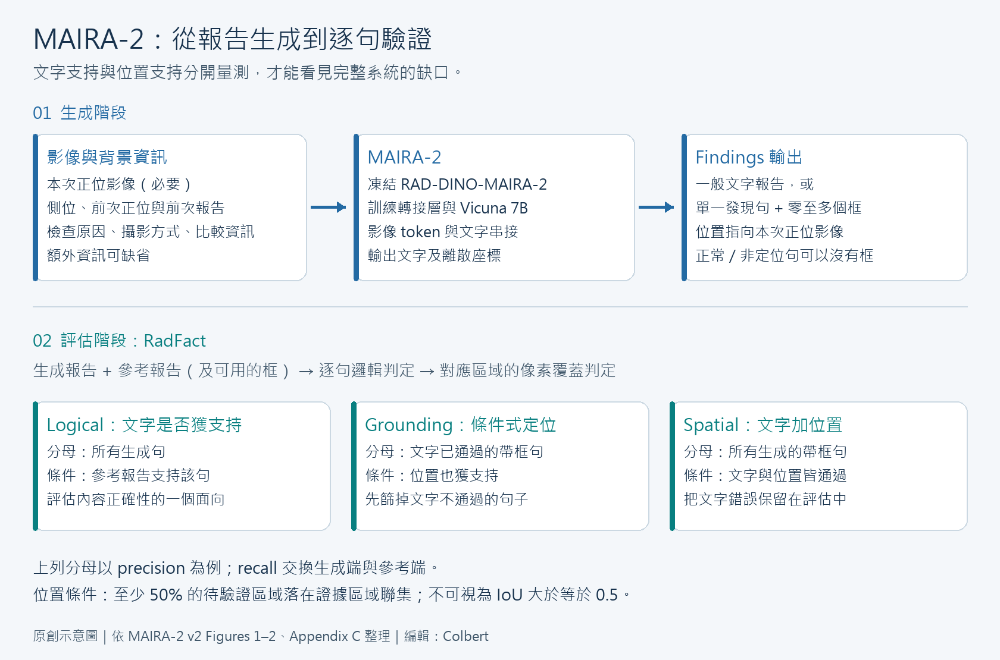

[Home](../) · [AI Papers](./)

# MAIRA-2：胸腔 X 光報告的文字正確，定位也正確嗎？

## 來源

- **單位／團隊**：Microsoft Research Health Futures、Microsoft Research India、Microsoft Azure AI、Microsoft Health and Life Sciences，以及 Cambridge University Hospitals 的 Addenbrooke’s Hospital 放射科。[(ref: main 作者與單位)](https://arxiv.org/pdf/2406.04449v2#page=1)
- **作者**：Shruthi Bannur、Kenza Bouzid 為共同第一作者；Javier Alvarez-Valle、Stephanie L. Hyland 為共同資深作者，其餘作者見完整名單。[(ref: main 作者名單)](https://arxiv.org/abs/2406.04449) [(ref: main 作者註記)](https://arxiv.org/pdf/2406.04449v2#page=1)
- **完整篇名**：*MAIRA-2: Grounded Radiology Report Generation*。
- **年份與版本**：2024 年；首次提交於 2024-06-06，本文依 2024-09-20 的 v2。[(ref: main 版本紀錄)](https://arxiv.org/abs/2406.04449)
- **原文**：[arXiv:2406.04449](https://arxiv.org/abs/2406.04449) · [DOI:10.48550/arXiv.2406.04449](https://doi.org/10.48550/arXiv.2406.04449) · [HTML 正文](https://arxiv.org/html/2406.04449v2) · [含附錄的 PDF 全文](https://arxiv.org/pdf/2406.04449v2) · [Microsoft 官方模型卡](https://huggingface.co/microsoft/maira-2)。

**編輯：** Colbert

MAIRA-2 將胸腔 X 光報告中的發現連到影像位置，而它的評估結果提醒我們：文字吻合、條件式定位成功與完整報告的可靠性，必須分開判讀。[(ref: main Figures 1–3)](https://arxiv.org/html/2406.04449v2#Sx3.F3)

## 流程

圖 1．依論文 Figures 1–2 與 Appendix C 整理的原創示意圖。上半部是報告生成；下半部是評估，參考報告僅在評估階段出現。Grounding 的分母先限縮到文字已獲支持的帶框句子，spatial 則保留所有帶框句子。[(ref: main Figure 1)](https://arxiv.org/html/2406.04449v2#Sx1.F1) [(ref: main Figure 2)](https://arxiv.org/html/2406.04449v2#Sx2.F2) [(ref: main Appendix C)](https://arxiv.org/pdf/2406.04449v2#page=26)

## 背景／問題

一份報告可以寫得通順，卻漏掉影像中的發現；也可以寫對發現，卻把框放到不合適的位置。MAIRA-2 將任務定義為產生 Findings 段落的句子，每句至多描述一個觀察，必要時附上一個或多個邊界框。否定發現、正常描述或無法指定位置的觀察，可以沒有框。[(ref: main Grounded reporting)](https://arxiv.org/html/2406.04449v2#Sx2.SSx1)

這與「先給一個病灶短語，再要求模型定位」不同：grounded report generation 必須自行決定要描述哪些發現；phrase grounding 的短語則由外部提供。只測後者，無法回答模型會不會漏寫重要內容。[(ref: main Appendix A.1)](https://arxiv.org/pdf/2406.04449v2#page=18)

## 方法摘要

MAIRA-2 是針對胸腔 X 光（chest X-ray, CXR）的視覺語言模型（vision-language model, VLM）：影像編碼器把影像轉為特徵，轉接層將特徵送入大型語言模型（large language model, LLM），再自回歸產生文字與座標。模型也接收本次側位影像、前次正位影像與報告，以及檢查原因、攝影方式和比較資訊；這些額外輸入可缺省。[(ref: main Architecture)](https://arxiv.org/html/2406.04449v2#Sx2.SSx3) [(ref: main Additional context)](https://arxiv.org/html/2406.04449v2#Sx2.SSx4)

RadFact 則是另一個評估流程：比較生成報告與參考報告中的句子是否互相支持，若有定位標註，再比較相應區域。它評的是與參考內容的一致性，沒有直接把 X 光交給文字裁判重新診斷。[(ref: main RadFact)](https://arxiv.org/html/2406.04449v2#Sx2.SSx6)

## 方法詳解

### 影像、文字與位置如何接在一起

影像端使用凍結的 RAD-DINO-MAIRA-2，為 87M 參數的 ViT-B；語言端以 Vicuna 7B v1.5 初始化，中間是四層多層感知器（multilayer perceptron, MLP）。每張 518 × 518 影像分成 14 × 14 的 patch，形成 1,369 個影像 token，與文字依提示順序串接。[(ref: main Architecture)](https://arxiv.org/html/2406.04449v2#Sx2.SSx3) [(ref: main Figure 1)](https://arxiv.org/html/2406.04449v2#Sx1.F1)

邊界框用左上角、右下角座標表示；水平與垂直各有 100 個座標 token，形成 100 × 100 的離散網格。每個句子可以接多個框，輸出定位在本次正位影像上。這種輸出是模型生成的座標，不是注意力圖。[(ref: main Grounding tokens)](https://arxiv.org/html/2406.04449v2#Sx2.SSx5) [(ref: main Table B.1)](https://arxiv.org/pdf/2406.04449v2#page=21)

### 訓練目標與標註處理

作者使用多任務的自回歸交叉熵訓練，凍結影像編碼器、更新轉接層與全部 LLM 參數；訓練三個 epoch，使用最後一個 checkpoint。資料包含一般 Findings 生成、帶位置的報告生成，以及短語定位。[(ref: main Appendix B.2)](https://arxiv.org/pdf/2406.04449v2#page=21) [(ref: main Table 1)](https://arxiv.org/html/2406.04449v2#Sx2.T1)

帶位置資料先以 GPT-4 將 Findings 拆成單一發現句，再取得專家空間標註。拆句也會排除臨床推測、建議等內容，因此它改變了評估對象。原文在 MIMIC-CXR 驗證集比較轉換前後文本時，Pneumonia 標籤的 recall 僅 3.4 [1.2, 6.7]；這是**拆句後保留原有標籤的比例**，不能當成 MAIRA-2 偵測肺炎的敏感度。[(ref: main Appendix B.5.1)](https://arxiv.org/pdf/2406.04449v2#page=23) [(ref: main Table B.3)](https://arxiv.org/pdf/2406.04449v2#page=25)

### RadFact：先問分母，再看分數

論文的 RadFact-Llama3 使用 Llama3-70B-Instruct 與十個提示範例，逐句判斷邏輯蘊涵（entailment）：給定參考句子，能否支持待驗證句子。Precision 從生成句出發，recall 交換兩份報告的角色。[(ref: main RadFact)](https://arxiv.org/html/2406.04449v2#Sx2.SSx6)

| 指標組 | Precision 的分母 | 通過條件 | Recall 的方向 |
|---|---|---|---|
| Logical | 所有生成句 | 參考報告支持該句 | 參考句能否被生成報告支持 |
| Grounding | 文字已獲支持、且帶框的生成句 | 位置也被對應證據區域支持 | 對參考側符合條件的帶框句檢查位置 |
| Spatial | 所有帶框的生成句 | 文字與位置都通過 | 對所有參考側帶框句檢查文字與位置 |

上表整理自 Figure 2 與 Appendix C。位置判定要求待驗證區域至少 50% 的像素落在證據區域聯集內；這是有方向性的覆蓋條件，不能替換成「交集除以聯集」（intersection over union, IoU）大於 0.5。[(ref: main Figure 2)](https://arxiv.org/html/2406.04449v2#Sx2.F2) [(ref: main Appendix C.1)](https://arxiv.org/pdf/2406.04449v2#page=26)

本書庫的判讀是：grounding 可以在只剩少量文字正確的句子時仍然很高。要評估完整系統，應並列 logical 與 spatial，並另外檢查未被參考報告涵蓋的影像發現。

## 資料與實驗

### 資料：原文 Table 1 欄位節錄

以下保留各資料子集的任務與樣本數；FindGen 指 Findings 生成，GroundRep 指帶位置報告生成，PhraseGround 指短語定位。報告任務的 sample 含至少一張影像與 Findings；短語定位的 sample 則是一張影像、一個短語及其框，兩者不能都稱作「一份病人報告」。[(ref: main Table 1)](https://arxiv.org/html/2406.04449v2#Sx2.T1)

| Data source / Subset | Task | Train samples | Test samples |
|---|---|---:|---:|
| MIMIC-CXR / All | FindGen | 158,555 | 2,461 |
| MIMIC-CXR / MS-CXR | PhraseGround | 817 | 176 |
| PadChest / All | FindGen | 85,598 | 2,925 |
| PadChest / PadChest-GR | GroundRep | 3,183 | 915 |
| USMix / All | FindGen | 193,652 | – |
| USMix / GR-1 | GroundRep | 60,463 | – |
| USMix / GR-Bench | GroundRep | 8,580 | 1,231 |
| IU-Xray / All | FindGen | – | 3,306 |
| Total | Multi-task | 510,848 | – |

訓練樣本對應 226,077 名成人；72,226 筆為 GroundRep。USMix 是私人資料，IU-Xray 完全保留作外部測試。PadChest 的西班牙文報告經 GPT-4 翻譯；MS-CXR 另建病人層級切分，排除其驗證／測試 study 進入訓練。資料來源、語言處理與切分方式都是比較結果時的必要條件。[(ref: main Data)](https://arxiv.org/html/2406.04449v2#Sx2.SSx2) [(ref: main Appendix B.1)](https://arxiv.org/pdf/2406.04449v2#page=20)

### 一般報告生成：原文 Table D.1 節錄

MIMIC-CXR Findings 任務，保留五個模型與下列八項指標。方括號為原文 500 次 bootstrap 的 95% 信賴區間，中心值為中位數；`–` 表示原表未提供。BLEU-4、F1 與 RadFact 採原表的 0–100 尺度，error-free 為百分比；RadCliQ 為原始分數，mean errors 為每份報告的平均錯誤數。箭頭標示較佳方向。[(ref: main Table D.1)](https://arxiv.org/pdf/2406.04449v2#page=31)

| Metric | MAIRA-1 | Med-PaLM M† | LLaVA-Rad† | MedVersa† | MAIRA-2 |
|---|---:|---:|---:|---:|---:|
| BLEU-4 ↑ | 14.2 [13.7, 14.7] | 11.31 | 15.4 | 17.8 [17.2, 18.4] | 23.1 [22.6, 23.7] |
| RadFact Logical precision ↑ | 48.3 [47.3, 49.4] | – | – | – | 52.9 [51.8, 54.2] |
| RadFact Logical recall ↑ | 47.2 [46.3, 48.2] | – | – | – | 48.2 [47.3, 49.4] |
| RadGraph-F1 ↑ | 24.3 [23.7, 24.8] | 26.71 | – | 28.0 [27.3, 28.7] | 34.6 [33.9, 35.3] |
| RadCliQ (↓) | 3.10 [3.07, 3.14] | – | – | 2.71 [2.66, 2.75] | 2.64 [2.61, 2.67] |
| CheXprompt Mean significant errors (↓) | 2.41 [2.35, 2.46] | – | 2.25 | – | 2.21 [2.16, 2.26] |
| CheXprompt % Significant error free ↑ | 4.65 [3.88, 5.55] | – | 6.79 | – | 6.50 [5.53, 7.52] |
| CheXpert Macro-F1-14 ↑ | 38.6 [37.1, 40.1] | 39.83 | 39.5 | – | 41.6 [40.1, 43.5] |

† 作者引用既有研究的數值，並非全部模型在相同流程下重新執行；MAIRA-1 的 RadFact 與 CheXprompt 則另以既有生成結果計算。Med-PaLM M 的測試集處理也不同，將側位算作個別樣本。CheXpert F1 由 CheXbert 產生標籤，uncertain 視為 negative；CheXprompt 則由 GPT-4 估計錯誤，不能當成醫師直接觀察的錯誤率。[(ref: main Table D.1)](https://arxiv.org/pdf/2406.04449v2#page=31) [(ref: main Figure 3)](https://arxiv.org/html/2406.04449v2#Sx3.F3) [(ref: main Appendix D.1)](https://arxiv.org/pdf/2406.04449v2#page=30)

### 帶位置報告：原文 Tables D.4–D.5 的完整 RadFact 區塊

以下為 MAIRA-2 的兩個資料集結果，單位為 %，全部越高越好；保留原文中位數與 95% 信賴區間（500 次 bootstrap）。[(ref: main Tables D.4–D.5)](https://arxiv.org/pdf/2406.04449v2#page=33)

| RadFact metric | GR-Bench | PadChest-GR |
|---|---:|---:|
| Logical precision | 74.1 [72.9, 75.6] | 56.0 [53.1, 58.8] |
| Logical recall | 72.8 [71.4, 74.0] | 51.4 [48.7, 53.8] |
| Spatial precision | 33.5 [30.9, 36.4] | 37.1 [33.4, 40.7] |
| Spatial recall | 34.2 [31.6, 36.7] | 23.8 [21.3, 26.6] |
| Grounding precision | 68.8 [65.5, 72.2] | 80.2 [75.9, 83.5] |
| Grounding recall | 90.6 [88.1, 93.0] | 76.6 [72.4, 80.8] |

### 前次檢查資訊：原文 Table D.9 節錄

此消融針對 MIMIC-CXR 有前次檢查的 2,181 個測試案例，使用**未加入 PadChest-GR 的較早模型版本**。`No Prior` 同時移除前次正位影像及前次報告，`No Comp` 移除 Comparison；`Infer` 只在推論時移除，`Train` 在訓練與推論都移除。以下保留基線與同時移除兩類資訊的列。[(ref: main Appendix B.2)](https://arxiv.org/pdf/2406.04449v2#page=22) [(ref: main Table D.9)](https://arxiv.org/pdf/2406.04449v2#page=37)

| Experiment | ROUGE-L ↑ | CheXbert Macro F1-14 ↑ | RadCliQ ↓ | RadFact Logical precision ↑ | RadFact Logical recall ↑ | % Mentions comparison |
|---|---:|---:|---:|---:|---:|---:|
| MAIRA-2 | 38.4 [37.7, 39.0] | 43.7 [41.9, 45.6] | 2.64 [2.61, 2.68] | 52.6 [51.4, 53.6] | 48.6 [47.4, 49.7] | 85.6 [84.2, 87.0] |
| Infer:No Prior No Comp | 27.3 [26.7, 28.0] | 35.8 [34.2, 37.5] | 3.18 [3.15, 3.22] | 45.5 [44.4, 46.5] | 40.5 [39.6, 41.4] | 38.6 [36.7, 40.5] |
| Train:No Prior No Comp | 33.9 [33.2, 34.5] | 39.3 [37.5, 41.1] | 2.89 [2.86, 2.93] | 50.6 [49.5, 51.5] | 44.7 [43.7, 45.7] | 75.8 [73.9, 77.4] |

除 RadCliQ 外採原文 0–100 尺度；方括號同為 500 次 bootstrap 的 95% 信賴區間。最後一欄是「提到時間比較的報告百分比」，不是比較描述的準確率，也沒有跨所有情境一致的較佳方向。原本有 prior 的基線可以合理提到比較；移除 prior 後仍出現的比較文字，才是這項消融要追查的風險。[(ref: main Appendix D.6)](https://arxiv.org/pdf/2406.04449v2#page=36) [(ref: main Table D.9)](https://arxiv.org/pdf/2406.04449v2#page=37)

## 結果

- **較好的文字分數仍伴隨遺漏。** MIMIC-CXR 上，MAIRA-2 的 RadFact logical precision 為 52.9%，logical recall 為 48.2%；後者與 MAIRA-1 的 47.2% 信賴區間重疊。本書庫因此不把 BLEU-4 的提升等同於完整涵蓋所有發現。[(ref: main Table D.1)](https://arxiv.org/pdf/2406.04449v2#page=31)
- **90.6% 的 grounding recall 不能單獨代表端到端能力。** GR-Bench 的 spatial recall 為 34.2%，因為它還要求文字被支持，且分母納入所有參考側帶框句；兩個數值回答不同問題。[(ref: main Tables D.4–D.5)](https://arxiv.org/pdf/2406.04449v2#page=33) [(ref: main Appendix C)](https://arxiv.org/pdf/2406.04449v2#page=26)
- **有無背景資訊，應在訓練與推論分別檢驗。** 同樣不提供 prior 與 Comparison，曾看過完整資訊的模型仍有 38.6% 比較提及，從訓練起就不使用的模型為 75.8%。前者較低，但沒有降為零；而其 logical recall 也降到 40.5%。這呈現資訊缺失的代價，不能只挑幻覺提及較少這一項宣稱成功。[(ref: main Table D.9)](https://arxiv.org/pdf/2406.04449v2#page=37)
- **人工審查的單位要分清楚。** 一名胸腔放射科醫師審查 20 例時，123/135 個生成句可保留，但只有 6/20 份報告完全不用修改；25 項修正中有 15 項屬遺漏，包含兩項被判為可能有重大臨床影響的遺漏。這些是小樣本文字審查的觀察。[(ref: main Appendix F.1)](https://arxiv.org/pdf/2406.04449v2#page=54) [(ref: main Appendix F.2)](https://arxiv.org/pdf/2406.04449v2#page=57)

## 限制

**參考文本與裁判都有盲點。** 作者指出 RadFact 不按錯誤的臨床嚴重度加權，逐句判定也無法偵測整份報告的內部矛盾；拆句會移除部分推測性診斷。分數更接近「經處理後的文本支持程度」，不是病人的診斷正確率。[(ref: main Discussion)](https://arxiv.org/html/2406.04449v2#Sx4) [(ref: main Appendix B.5.1)](https://arxiv.org/pdf/2406.04449v2#page=23)

**輸入與資料覆蓋不完整。** GR-Bench 沒有 prior，PadChest-GR 沒有 Findings 以外的段落；因此不能完整檢驗所有背景資訊如何影響定位。作者也承認模型可能依賴文字段落的捷徑，未充分使用額外影像。USMix 的私人性質則限制完整重現。[(ref: main Discussion)](https://arxiv.org/html/2406.04449v2#Sx4) [(ref: main Appendix B.1)](https://arxiv.org/pdf/2406.04449v2#page=20)

**小規模人工審查尚不足以推論臨床效益。** Appendix F 聚焦文字，不評估定位框；作者說明這 20 例較不複雜，且單一醫師的觀察無法泛化。Microsoft 官方模型卡也將模型限定為研究用途，成人 CXR、英文報告之外的用途不在其預期範圍。[(ref: main Appendix F.1)](https://arxiv.org/pdf/2406.04449v2#page=54) [(ref: main Appendix F.3)](https://arxiv.org/pdf/2406.04449v2#page=58) [(ref: model Uses)](https://huggingface.co/microsoft/maira-2#uses)

## 與書庫其他文章的關係

Lingshu 導讀著重通用醫療 VLM 的資料與訓練，本篇則可接續閱讀胸腔報告的輸入條件、逐句評估與位置標註: [Lingshu：醫療 VLM 如何整合影像、文字與合成資料，RL 又帶來多少改變？](2026-09-15-lingshu-medical-vlm.md)

兩篇可比較方法設計，但跨論文的報告分數需先對齊版本、輸入與計分；例如 Lingshu Table 8 使用 RadCliQ-v1 的倒數，MAIRA-2 此處使用 RadCliQ version 0。[(ref: lingshu Table 8)](https://arxiv.org/html/2506.07044v4#S5.T8) [(ref: main Appendix D.1)](https://arxiv.org/pdf/2406.04449v2#page=30)

## 實務的啟發

以下是本書庫提出的研究與工程建議：

1. **先定義要生成的內容。** Findings、診斷推測與後續建議應各自列出保留規則；拆句前後抽查重要資訊，避免評分前就把困難內容刪掉。
2. **把影像缺失與文字線索分開測。** 固定病例與模型，分別移除 prior 影像、prior 報告與 Comparison，記錄漏寫、無依據的時間比較和側別錯誤。
3. **報表保留三組分母。** 同時提供 logical、grounding、spatial，以及有效句數；不要只展示最好看的條件式定位百分比。
4. **讓人工審查留下可分析的修訂。** 記錄新增、刪除、改寫及嚴重程度，再評估醫師修訂時間與重大遺漏；另安排定位框的人工審查，避免文字合格掩蓋位置問題。

## References

- **main** — Bannur, Bouzid et al. *MAIRA-2: Grounded Radiology Report Generation*. arXiv:2406.04449v2 (2024)。[書目與版本](https://arxiv.org/abs/2406.04449) · [DOI](https://doi.org/10.48550/arXiv.2406.04449) · [HTML](https://arxiv.org/html/2406.04449v2) · [PDF 全文](https://arxiv.org/pdf/2406.04449v2)。
  - 作者：[PDF p.1](https://arxiv.org/pdf/2406.04449v2#page=1)。
  - 任務與模型：[Grounded reporting](https://arxiv.org/html/2406.04449v2#Sx2.SSx1) · [Data](https://arxiv.org/html/2406.04449v2#Sx2.SSx2) · [Architecture](https://arxiv.org/html/2406.04449v2#Sx2.SSx3) · [Additional context](https://arxiv.org/html/2406.04449v2#Sx2.SSx4) · [Grounding tokens](https://arxiv.org/html/2406.04449v2#Sx2.SSx5) · [Figure 1](https://arxiv.org/html/2406.04449v2#Sx1.F1)。
  - 評估與結果：[RadFact](https://arxiv.org/html/2406.04449v2#Sx2.SSx6) · [Figure 2](https://arxiv.org/html/2406.04449v2#Sx2.F2) · [Figure 3](https://arxiv.org/html/2406.04449v2#Sx3.F3) · [Table 1](https://arxiv.org/html/2406.04449v2#Sx2.T1) · [Discussion](https://arxiv.org/html/2406.04449v2#Sx4)。
  - 附錄方法：[A.1 p.18](https://arxiv.org/pdf/2406.04449v2#page=18) · [B.1 p.20](https://arxiv.org/pdf/2406.04449v2#page=20) · [B.2／Table B.1 p.21](https://arxiv.org/pdf/2406.04449v2#page=21) · [模型變體 p.22](https://arxiv.org/pdf/2406.04449v2#page=22) · [B.5.1 p.23](https://arxiv.org/pdf/2406.04449v2#page=23) · [Table B.3 p.25](https://arxiv.org/pdf/2406.04449v2#page=25) · [C pp.26–27](https://arxiv.org/pdf/2406.04449v2#page=26)。
  - 附錄實驗：[D.1 p.30](https://arxiv.org/pdf/2406.04449v2#page=30) · [Table D.1 p.31](https://arxiv.org/pdf/2406.04449v2#page=31) · [Tables D.4–D.5 p.33](https://arxiv.org/pdf/2406.04449v2#page=33) · [D.6 p.36](https://arxiv.org/pdf/2406.04449v2#page=36) · [Table D.9 p.37](https://arxiv.org/pdf/2406.04449v2#page=37) · [F.1 p.54](https://arxiv.org/pdf/2406.04449v2#page=54) · [F.2 p.57](https://arxiv.org/pdf/2406.04449v2#page=57) · [F.3 p.58](https://arxiv.org/pdf/2406.04449v2#page=58)。
- **model** — Microsoft. *MAIRA-2 model card*。[官方頁](https://huggingface.co/microsoft/maira-2) · [Uses](https://huggingface.co/microsoft/maira-2#uses)。
- **lingshu** — LASA Team et al. *Lingshu: A Generalist Foundation Model for Unified Multimodal Medical Understanding and Reasoning*. arXiv:2506.07044v4 (2025)。[全文](https://arxiv.org/html/2506.07044v4) · [Table 8](https://arxiv.org/html/2506.07044v4#S5.T8)。

[Home](../) · [AI Papers](./)
