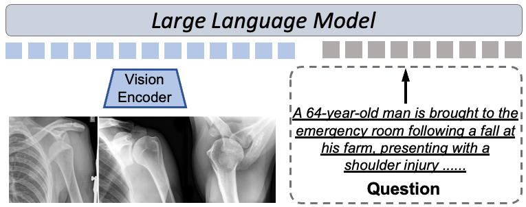

[Home](../) · [AI Papers](./)

# 醫療 VLM 走了多遠？七套基準下的模型規模、領域微調與推理落差

## 來源

- **單位／團隊**：Imperial College London、Technical University of Munich、Ludwig Maximilian University of Munich [(ref: main metadata)](https://arxiv.org/html/2507.11200)
- **作者**：Che Liu、Jiazhen Pan、Weixiang Shen、Wenjia Bai、Daniel Rueckert、Rossella Arcucci [(ref: main metadata)](https://arxiv.org/abs/2507.11200)
- **論文**：*How Far Have Medical Vision-Language Models Come? A Comprehensive Benchmarking Study*
- **識別**：[arXiv:2507.11200（v2）](https://arxiv.org/abs/2507.11200) · [HTML 全文](https://arxiv.org/html/2507.11200) · [DOI: 10.48550/arXiv.2507.11200](https://doi.org/10.48550/arXiv.2507.11200)
- **年份**：2025；arXiv v1 於 2025-07-15 提交，v2 於 2025-07-18 修訂 [(ref: main metadata)](https://arxiv.org/abs/2507.11200)

**編輯：** Colbert

這篇技術報告把 10 個開源通用型與醫療專用視覺語言模型（Vision-Language Model, VLM）放到七套醫療基準上，以一致提示與 accuracy 比較整體、推理及理解表現；結果顯示沒有單一模型通吃所有資料集，但原文對「理解優於推理」的敘述與表中數值存在值得警覺的不一致 [(ref: main §2.3)](https://arxiv.org/html/2507.11200#S2.SS3) [(ref: main Tables 1–3)](https://arxiv.org/html/2507.11200#S3.T1)。

## 流程

*圖 1：標準 VLM 將醫療影像經視覺編碼器，連同文字問題交給大型語言模型的示意。原圖取自論文 Figure 1（CC BY 4.0）[(ref: main Fig. 1)](https://arxiv.org/html/2507.11200#S1.F1)。*

本文的評估流程可濃縮成四步：選定七套醫療視覺問答／多模態基準；用 MedXpert 的既有標籤訓練二元分類器，將其他資料集題目分成「理解」或「推理」；以同一提示執行 10 個模型；擷取 `\boxed{}` 內答案並與正確選項比對，以 accuracy 彙整結果 [(ref: main §2)](https://arxiv.org/html/2507.11200#S2)。

## 背景／問題

通用 VLM 從大規模網路資料學到視覺理解與文字生成能力，但醫療場景面臨成對影像—文字資料有限、標註資源不足，以及需要領域知識才能正確解讀臨床語言與影像等問題 [(ref: main §1)](https://arxiv.org/html/2507.11200#S1)。已有 Lingshu、Huatuo-GPT-Vision 等醫療專用模型，卻缺少跨多資料集、同條件的比較；這篇研究因此同時納入通用與醫療專用模型，並把題目拆成理解與推理兩類 [(ref: main §1)](https://arxiv.org/html/2507.11200#S1)。

值得先說明一項原文內部不一致：摘要寫「eight benchmarks」，但摘要列名、方法正文與三張結果表都只有七套；本文依可核對的七套資料集呈現，不推測不存在於正文的第八套基準 [(ref: main Abstract)](https://arxiv.org/html/2507.11200#abstract1) [(ref: main §2.1)](https://arxiv.org/html/2507.11200#S2.SS1)。

## 方法摘要

研究比較兩類共 10 個開源 VLM：通用型包括 Qwen2.5-VL 的 3B、7B、32B、72B，以及 MiMo-VL-7B 的監督微調（SFT）與強化學習（RL）版本；醫療專用型包括 Lingshu 7B／32B 與 Huatuo-GPT-Vision 7B／32B。所有模型使用官方推論程式碼與同一提示格式 [(ref: main §2.3)](https://arxiv.org/html/2507.11200#S2.SS3)。

題目能力拆分不是由人工逐套重標：作者先用 `gme-Qwen2-VL-2B-Instruct` 取得影像—文字聯合嵌入，再以具有理解／推理標籤的 MedXpert 樣本訓練二元分類器；除 MedXpert 外，其餘資料集皆由該分類器推定題型 [(ref: main §2.2)](https://arxiv.org/html/2507.11200#S2.SS2)。

## 方法詳解

### 1. 基準覆蓋

七套基準橫跨放射、病理、眼科、皮膚科與超音波等醫療領域；VQA-RAD 與 SLAKE 被作者列為單影像問答例子，MedXpert 則包含多影像或多視角推理 [(ref: main §2.1)](https://arxiv.org/html/2507.11200#S2.SS1)。這種組合的目的，是觀察同一模型是否能跨任務、影像模態與標註格式維持表現。

### 2. 理解／推理拆分

作者把偏向辨識解剖位置、影像模態或事實檢索的題目歸為理解；需要結合醫學知識並整合視覺與文字線索的題目歸為推理 [(ref: main §2.1–2.2)](https://arxiv.org/html/2507.11200#S2.SS1)。實作上，MedXpert 提供監督標籤，其他六套資料集的分類結果由嵌入分類器外推，因此 Tables 2、3 同時反映被評模型能力與這個題型分類器的品質。

### 3. 一致推論與評分

所有模型收到相同的英文提示：「逐步推理，並把最終答案放進 `\boxed{}`」；系統抽取方框答案，與 ground-truth option 比對後計算 accuracy [(ref: main §2.3)](https://arxiv.org/html/2507.11200#S2.SS3)。研究未在方法段落交代解碼參數、重複抽樣、無法解析答案的處理方式，或 accuracy 的信賴區間；這些缺口限制了可重現性與差異大小的判讀 [(ref: main §2.3)](https://arxiv.org/html/2507.11200#S2.SS3)。

## 資料與實驗

### Data

原文沒有提供各基準的樣本數、切分、排除條件或本次實際評估題數；可確認的是七套資料集名稱，以及作者對部分任務型態和整體醫療領域覆蓋的描述 [(ref: main §2.1)](https://arxiv.org/html/2507.11200#S2.SS1)。

| 基準 | 原文可確認的角色／範圍 | 本文不額外推定的資訊 |
|---|---|---|
| MedXpert | 多影像／多視角題目例子；提供理解／推理標籤 | 樣本數與本次切分 |
| OmniMedVQA | 七套醫療基準之一 | 個別模態、樣本數與切分 |
| PMC-VQA | 七套醫療基準之一 | 個別模態、樣本數與切分 |
| PathVQA | 七套醫療基準之一 | 樣本數與切分 |
| MMMU | 使用 medical subset | 樣本數與切分 |
| SLAKE | 單影像問答例子 | 樣本數與切分 |
| VQA-RAD | 單影像問答例子 | 樣本數與切分 |

*表 A：依原文 §2.1 整理；七套基準共同涵蓋放射、病理、眼科、皮膚科與超音波，但原文沒有把每一領域逐一映射到各資料集 [(ref: main §2.1)](https://arxiv.org/html/2507.11200#S2.SS1)。*

### Experiments

以下三表保留原論文的模型名稱、資料集欄位與四位小數；依方法段落，數值是從最終選項答案計算的 accuracy [(ref: main §2.3)](https://arxiv.org/html/2507.11200#S2.SS3)。

**表 1 — 全部題目的平均表現（accuracy）** [(ref: main Table 1)](https://arxiv.org/html/2507.11200#S3.T1)

| Model | MedXpert | OmniMedVQA | PMC-VQA | PathVQA | MMMU | SLAKE | VQA-RAD |
|---|---:|---:|---:|---:|---:|---:|---:|
| Qwen2.5-VL-3B | 0.2217 | 0.5710 | 0.4014 | 0.6190 | 0.4690 | 0.5874 | 0.5458 |
| Qwen2.5-VL-7B | 0.2305 | 0.6072 | 0.4420 | 0.6205 | 0.5379 | 0.6068 | 0.6255 |
| Qwen2.5-VL-32B | 0.2890 | 0.6383 | 0.5331 | 0.6573 | 0.7075 | 0.7326 | 0.7041 |
| Qwen2.5-VL-72B | 0.2995 | 0.6656 | 0.5577 | 0.6597 | 0.7078 | 0.7799 | 0.6835 |
| MiMo-VL-7B-RL | 0.2446 | 0.6206 | 0.4585 | 0.6255 | 0.6000 | 0.7233 | 0.6135 |
| MiMo-VL-7B-SFT | 0.2455 | 0.6323 | 0.4985 | 0.6398 | 0.6276 | 0.7257 | 0.6374 |
| Lingshu-7B | 0.2505 | 0.6436 | 0.5213 | 0.7192 | 0.6389 | 0.8034 | 0.6574 |
| Lingshu-32B | 0.3107 | 0.7662 | 0.5365 | 0.7609 | 0.6345 | 0.7718 | 0.6295 |
| Huatuo-GPT-Vision-7B | 0.2215 | 0.7429 | 0.5490 | 0.5791 | 0.5448 | 0.7644 | 0.6056 |
| Huatuo-GPT-Vision-32B | 0.2415 | 0.7619 | 0.5785 | 0.6291 | 0.5862 | 0.7764 | 0.6892 |

**表 2 — 推理題表現（accuracy）** [(ref: main Table 2)](https://arxiv.org/html/2507.11200#S3.T2)

| Model | MedXpert | OmniMedVQA | PMC-VQA | PathVQA | MMMU | SLAKE | VQA-RAD |
|---|---:|---:|---:|---:|---:|---:|---:|
| Qwen2.5-VL-3B | 0.2151 | 0.5809 | 0.4251 | 0.5945 | 0.4865 | 0.5882 | 0.5340 |
| Qwen2.5-VL-7B | 0.2254 | 0.6285 | 0.4738 | 0.6644 | 0.5495 | 0.6106 | 0.6456 |
| Qwen2.5-VL-32B | 0.2718 | 0.6579 | 0.5507 | 0.6763 | 0.7170 | 0.7293 | 0.7487 |
| Qwen2.5-VL-72B | 0.2953 | 0.6805 | 0.5757 | 0.6898 | 0.7264 | 0.7863 | 0.7236 |
| MiMo-VL-7B-RL | 0.2350 | 0.6155 | 0.4886 | 0.6525 | 0.5946 | 0.7395 | 0.6262 |
| MiMo-VL-7B-SFT | 0.2414 | 0.6284 | 0.5173 | 0.6746 | 0.6306 | 0.7311 | 0.6650 |
| Lingshu-7B | 0.2427 | 0.6213 | 0.5380 | 0.7445 | 0.6455 | 0.8039 | 0.6748 |
| Lingshu-32B | 0.2997 | 0.7526 | 0.5609 | 0.7462 | 0.6577 | 0.7815 | 0.6505 |
| Huatuo-GPT-Vision-7B | 0.2033 | 0.7174 | 0.5720 | 0.5060 | 0.5225 | 0.7701 | 0.5720 |
| Huatuo-GPT-Vision-32B | 0.2144 | 0.7473 | 0.6133 | 0.5894 | 0.5856 | 0.7922 | 0.7184 |

**表 3 — 理解題表現（accuracy）** [(ref: main Table 3)](https://arxiv.org/html/2507.11200#S3.T3)

| Model | MedXpert | OmniMedVQA | PMC-VQA | PathVQA | MMMU | SLAKE | VQA-RAD |
|---|---:|---:|---:|---:|---:|---:|---:|
| Qwen2.5-VL-3B | 0.1802 | 0.5500 | 0.3604 | 0.5851 | 0.4522 | 0.5552 | 0.5089 |
| Qwen2.5-VL-7B | 0.2024 | 0.5801 | 0.3955 | 0.5984 | 0.4873 | 0.5706 | 0.5890 |
| Qwen2.5-VL-32B | 0.2489 | 0.6210 | 0.4710 | 0.6403 | 0.5990 | 0.6841 | 0.6451 |
| Qwen2.5-VL-72B | 0.2622 | 0.6395 | 0.5052 | 0.6611 | 0.6084 | 0.7013 | 0.6390 |
| MiMo-VL-7B-RL | 0.2150 | 0.5999 | 0.4088 | 0.6040 | 0.5200 | 0.6722 | 0.5712 |
| MiMo-VL-7B-SFT | 0.2257 | 0.6102 | 0.4399 | 0.6204 | 0.5622 | 0.6800 | 0.5984 |
| Lingshu-7B | 0.2305 | 0.6253 | 0.4582 | 0.6681 | 0.5755 | 0.7102 | 0.6112 |
| Lingshu-32B | 0.2751 | 0.7120 | 0.4895 | 0.7011 | 0.5827 | 0.6991 | 0.6221 |
| Huatuo-GPT-Vision-7B | 0.1901 | 0.6812 | 0.4997 | 0.5722 | 0.4990 | 0.6902 | 0.5850 |
| Huatuo-GPT-Vision-32B | 0.2104 | 0.6995 | 0.5208 | 0.6153 | 0.5452 | 0.7204 | 0.6301 |

## 結果

整體表現沒有單一贏家：Table 1 的七欄最佳值分散在 Lingshu-32B、Huatuo-GPT-Vision-32B、Qwen2.5-VL-72B、Lingshu-7B 與 Qwen2.5-VL-32B；這支持作者「沒有單一模型在所有基準一致勝出」的判讀 [(ref: main Table 1)](https://arxiv.org/html/2507.11200#S3.T1) [(ref: main §3.1)](https://arxiv.org/html/2507.11200#S3.SS1)。通用 Qwen2.5-VL 從 3B 擴到 32B／72B 時多數欄位上升，但較大模型之間並非每欄都繼續改善；醫療專用模型則在部分資料集以較小規模取得最佳值 [(ref: main §3.1)](https://arxiv.org/html/2507.11200#S3.SS1)。

原文摘要與 §3.2 宣稱推理表現一致低於理解，但 Tables 2、3 的數值不支持這個廣泛敘述。以 Qwen2.5-VL-72B 為例，七套資料集的「推理」accuracy 都高於同欄「理解」accuracy；因此不能只依作者文字把兩表解讀成已證實的推理落差 [(ref: main Tables 2–3)](https://arxiv.org/html/2507.11200#S3.T2) [(ref: main §3.2)](https://arxiv.org/html/2507.11200#S3.SS2)。在沒有題數、類別比例、分類器效度與誤差範圍的情況下，更穩妥的結論是：這項拆分提出了可檢驗的分析方向，但目前報告不足以量化「推理比理解更弱」。

## 限制

- 原文未報告各資料集本次評估題數、切分、題型比例、分類器訓練／驗證細節、重複試驗或信賴區間，難以判斷小幅 accuracy 差距是否穩定 [(ref: main §2)](https://arxiv.org/html/2507.11200#S2)。
- 除 MedXpert 外，理解／推理標籤由另一個模型嵌入加二元分類器產生；分類誤差可能影響分組後結果，但原文未提供該分類器的效度指標 [(ref: main §2.2)](https://arxiv.org/html/2507.11200#S2.SS2)。
- 摘要的八套基準與正文、表格的七套不一致；「推理較差」的敘述也與表中多個逐格比較方向相反 [(ref: main Abstract)](https://arxiv.org/html/2507.11200#abstract1) [(ref: main Tables 2–3)](https://arxiv.org/html/2507.11200#S3.T2)。
- 評估採選項 accuracy 與固定提示，沒有前瞻臨床流程、安全事件、校準、公平性或病人結果驗證；離線基準表現不能直接外推為臨床可部署性 [(ref: main §2.3)](https://arxiv.org/html/2507.11200#S2.SS3)。

## 與書庫其他文章的關係

一句話敘述關係: [醫療視覺語言模型：從 CLIP 對齊到有定位報告](../ai-basics/medical-vlm.md) 提供讀基準前的譜系語言；本篇用七套基準檢驗醫療 VLM 的規模、領域微調與推理落差。

本篇比較 Lingshu 與其他醫療 VLM 的表現，模型原始報告則補充其資料整理、分階段訓練與 RL 消融結果: [Lingshu：醫療 VLM 如何整合影像、文字與合成資料，RL 又帶來多少改變？](2026-09-15-lingshu-medical-vlm.md)

## 實務的啟發

1. **採購或選型應看任務矩陣，不只看模型大小。** 本書庫建議先用院內影像模態、問題型態與可接受錯誤定義評估欄位，再選模型；Table 1 顯示沒有跨資料集的單一冠軍 [(ref: main Table 1)](https://arxiv.org/html/2507.11200#S3.T1)。
2. **把題型分類器納入驗證鏈。** 若要報告「理解／推理」分層績效，應公開人工抽查、一致性、混淆矩陣與各組分母，否則分層標籤本身會成為未量化的不確定來源。
3. **同時稽核敘述與表格。** 摘要結論應以可重算表格為準；發現方向相反時，應暫停臨床含義的延伸，先要求作者釐清標籤或表格是否對調。
4. **補上部署前證據。** 在真實使用前仍需外部資料、校準、失敗案例、亞群公平性、人機協作流程與前瞻性安全評估；這些不是單一多選題 accuracy 可以替代的。

## References

- **main** — Liu, C., Pan, J., Shen, W., Bai, W., Rueckert, D., & Arcucci, R. *How Far Have Medical Vision-Language Models Come? A Comprehensive Benchmarking Study*. arXiv:2507.11200v2 (2025). [HTML 全文](https://arxiv.org/html/2507.11200) · [摘要頁](https://arxiv.org/abs/2507.11200) · [DOI](https://doi.org/10.48550/arXiv.2507.11200)
- 本文使用的深鏈：[§1](https://arxiv.org/html/2507.11200#S1) · [§2.1](https://arxiv.org/html/2507.11200#S2.SS1) · [§2.2](https://arxiv.org/html/2507.11200#S2.SS2) · [§2.3](https://arxiv.org/html/2507.11200#S2.SS3) · [Table 1](https://arxiv.org/html/2507.11200#S3.T1) · [Table 2](https://arxiv.org/html/2507.11200#S3.T2) · [Table 3](https://arxiv.org/html/2507.11200#S3.T3) · [§3.1](https://arxiv.org/html/2507.11200#S3.SS1) · [§3.2](https://arxiv.org/html/2507.11200#S3.SS2) · [§4](https://arxiv.org/html/2507.11200#S4)

[Home](../) · [AI Papers](./)
