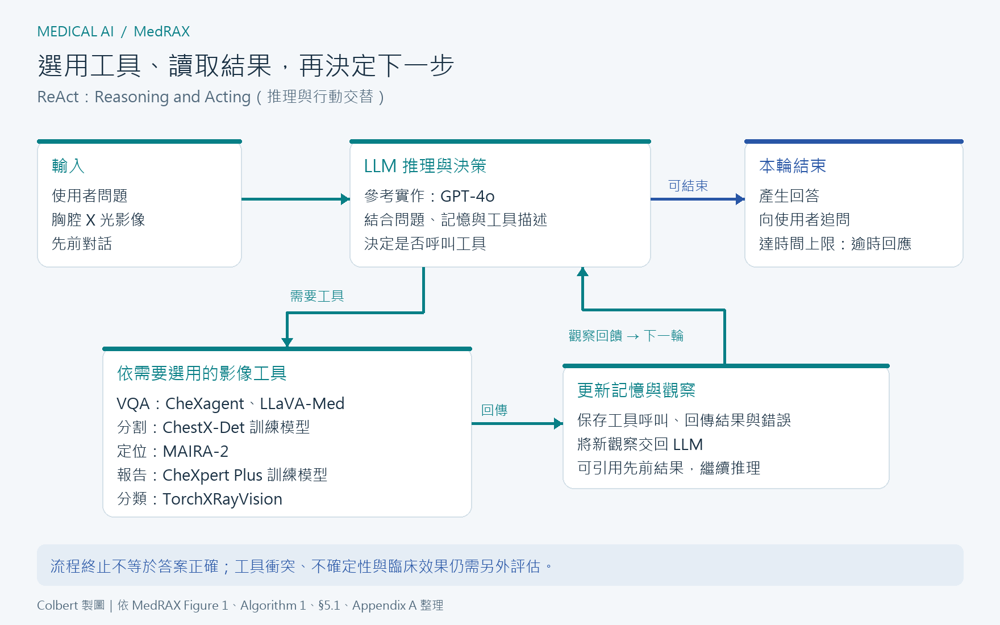

[Home](../) · [AI Papers](./)

# MedRAX：工具代理如何改善胸腔 X 光問答？

## 來源

- **單位／團隊**：University of Toronto 的 Department of Computer Science 與 Department of Laboratory Medicine and Pathobiology、Vector Institute、University Health Network、Cohere、Cohere Labs；以上依論文 v2 首頁列示。[(ref: main 作者與單位)](https://arxiv.org/pdf/2502.02673v2#page=1)
- **完整篇名與作者**：*MedRAX: Medical Reasoning Agent for Chest X-ray*；Adibvafa Fallahpour、Jun Ma、Alif Munim、Hongwei Lyu、Bo Wang，前三位共同第一作者。[(ref: main p.1)](https://arxiv.org/pdf/2502.02673v2#page=1)
- **年份／發表**：2025，International Conference on Machine Learning（ICML）；PMLR 267，15661–15676。[(ref: proceedings)](https://proceedings.mlr.press/v267/fallahpour25a.html)
- **識別與版本**：[arXiv:2502.02673](https://arxiv.org/abs/2502.02673)；[DOI:10.48550/arXiv.2502.02673](https://doi.org/10.48550/arXiv.2502.02673)。本文依 2025-05-29 的 v2 全文與附錄：[HTML](https://arxiv.org/html/2502.02673v2) · [PDF](https://arxiv.org/pdf/2502.02673v2)。

**編輯：** Colbert

MedRAX 讓大型語言模型選用胸腔影像工具並整合結果，在論文的複合問答基準取得較高分數，但細粒度影像推理與報告的各類別表現仍有落差。[(ref: main Tables 1–3)](https://arxiv.org/html/2502.02673v2#S5.T1) [(ref: main Table 2)](https://arxiv.org/html/2502.02673v2#S5.T2) [(ref: main Table 3)](https://arxiv.org/html/2502.02673v2#S5.T3)

## 流程

*圖：Colbert 依原文 Figure 1、Algorithm 1 與 Appendix A 繪製的流程示意；工具欄列出 §5.1 用於實驗的工具組件。工具結果與錯誤回到記憶，供下一輪判斷；圖中的停止條件是程式流程，並不表示系統已驗證答案正確。[(ref: main Figure 1)](https://arxiv.org/html/2502.02673v2#S3.F1) [(ref: main Algorithm 1)](https://arxiv.org/html/2502.02673v2#alg1) [(ref: main §5.1)](https://arxiv.org/html/2502.02673v2#S5.SS1) [(ref: main Appendix A)](https://arxiv.org/html/2502.02673v2#A1)*

## 背景／問題

論文針對的問題，是胸腔 X 光（chest X-ray，CXR）的分類、分割、報告生成等模型各自運作，使用者遇到需要多步驟分析的問題時，仍須決定先用哪個工具、如何接續，以及如何處理不同工具的矛盾。作者提出以大型語言模型（large language model，LLM）擔任協調者，把視覺語言模型（vision-language model，VLM）和專用影像模型接在同一流程中。[(ref: main §§1、3)](https://arxiv.org/html/2502.02673v2#S1) [(ref: main §3)](https://arxiv.org/html/2502.02673v2#S3)

本書庫關注的核心是：工具提供額外觀察後，最終答案是否更可靠？因此閱讀結果時，需要同時看複合問答、細粒度推理及報告指標，並區分「能呼叫工具」與「能判斷工具何時出錯」。

## 方法摘要

MedRAX 以 GPT-4o 作為參考實作的推理核心，採用推理與行動交替（Reasoning and Acting，ReAct）迴圈：讀取問題、影像與歷史訊息，決定直接回答、追問或呼叫工具，接收結果後再做下一輪判斷。它把既有模型包裝成可呼叫的工具，新增工具時提供能力描述與輸入格式，無須為此重新訓練代理；這不表示底層模型從未經過訓練。[(ref: main §§3.1、3.3)](https://arxiv.org/html/2502.02673v2#S3.SS1) [(ref: main §3.3)](https://arxiv.org/html/2502.02673v2#S3.SS3)

## 方法詳解

### 1. 代理決定步驟，工具提供不同形式的觀察

原文工具庫包含視覺問答（visual question answering，VQA）、分割、文字對應影像定位（grounding）、報告生成、疾病分類、影像生成與通用處理工具。正式實驗設定列出的組件如下；這是論文的整合方式，並非對各底層模型能力的獨立驗證。[(ref: main §3.2)](https://arxiv.org/html/2502.02673v2#S3.SS2) [(ref: main §5.1)](https://arxiv.org/html/2502.02673v2#S5.SS1)

| 功能 | 實驗使用的工具／模型 | 提供給代理的觀察 |
|---|---|---|
| 視覺問答 | CheXagent、LLaVA-Med | 針對影像問題的文字回答 |
| 分割 | 在 ChestX-Det 訓練的模型 | 影像區域的分割結果 |
| Grounding | MAIRA-2 | 指定文字發現對應的影像位置 |
| 報告生成 | 在 CheXpert Plus 訓練的模型 | 影像發現與報告文字 |
| 分類 | TorchXRayVision | 病理類別的預測輸出 |

### 2. 工具描述是選擇工具的入口

每個工具包裝介面包含名稱、能力描述、輸入結構與執行邏輯。LLM 取得這些定義後，產生帶參數的工具請求；流程控制器核對輸入格式、執行工具，再把結果與對應呼叫 ID 包成訊息。彼此獨立的工具可平行執行，後續步驟則可使用前一步的結果。[(ref: main Appendix A.2.2)](https://arxiv.org/html/2502.02673v2#A1.SS2.SSS2) [(ref: main Appendix A.3.4)](https://arxiv.org/html/2502.02673v2#A1.SS3.SSS4)

這個設計把「模型能做什麼」和「此刻應該做什麼」分成兩層：前者由工具提供，後者由 LLM 根據問題、描述與歷史輸出判斷。本書庫因此認為，工具描述本身也應是評估對象；同一個工具換一種說明，可能改變呼叫時機，不能只測單獨模型的準確率。

### 3. 記憶保存結果，停止條件控制流程

記憶保存使用者輸入、代理訊息、工具呼叫與結果，讓下一輪能引用先前觀察，並重用工具輸出。若工具失敗，錯誤訊息也會回到 LLM，由它決定改用其他工具、追問或說明限制；Algorithm 1 另設最長執行時間，逾時則產生逾時回應。[(ref: main Appendix A.2.4)](https://arxiv.org/html/2502.02673v2#A1.SS2.SSS4) [(ref: main Appendix A.3.5)](https://arxiv.org/html/2502.02673v2#A1.SS3.SSS5) [(ref: main Appendix A.4)](https://arxiv.org/html/2502.02673v2#A1.SS4)

作者在系統提示中要求代理批判工具輸出，但也承認系統缺乏穩健的不確定性量化。本書庫的解讀是，保留完整工具紀錄有助追查失誤，卻不能直接把一段合理的說明當成正確性證明。[(ref: main Appendix A.2.1)](https://arxiv.org/html/2502.02673v2#A1.SS2.SSS1) [(ref: main §6)](https://arxiv.org/html/2502.02673v2#S6)

## 資料與實驗

### 評估資料與分母

以下數量均為 MedRAX 論文描述的評估範圍。兩個 SLAKE 設定分屬不同基準，不能把其分數直接視為同一測試的前後改善。[(ref: main §§4.1、5.2)](https://arxiv.org/html/2502.02673v2#S4.SS1) [(ref: main §5.2)](https://arxiv.org/html/2502.02673v2#S5.SS2)

| 資料／任務 | 納入範圍與數量 | 輸出與計分 |
|---|---|---|
| ChestAgentBench | 675 個 Eurorad 胸腔影像病例，產生並篩選為 2,500 道題目 | 六選一；答案正確率，另依七種能力列分數 |
| CheXbench 的 VQA 子集 | Rad-Restruct 與 SLAKE 合計 238 題 | 視覺問答正確率 |
| CheXbench 的 image-text reasoning 子集 | OpenI 的 380 題 | 細粒度影像文字推理正確率 |
| MIMIC-CXR 報告生成 | 測試集 3,858 張影像；每次輸入單張影像 | 生成 findings，以 CheXbert 標籤的 micro／macro F1 評估 |
| 獨立 SLAKE VQA 設定 | 從原測試集 2,094 個樣本篩出 114 個胸腔 X 光、英文封閉式問答樣本 | 完全匹配的 accuracy，以及回答涵蓋參考答案詞彙的 recall |

ChestAgentBench 的病例來源有專家審閱，但**題目由 GPT-4o 生成，並由 GPT-4o 自動檢查**六選一格式、病例依據與答案可驗證性；不能把病例的專家審閱寫成每道生成題目都經獨立醫師判讀。§4.2 將七種能力與 reasoning 組合為五種出題類型，Table 1 則按七種能力報告結果。[(ref: main §4.2)](https://arxiv.org/html/2502.02673v2#S4.SS2)

附錄列出的病例場域為急診 133 例（19.7%）、加護病房 33 例（4.9%）、其他院內場域 509 例（75.4%）。這描述的是選入的 675 個病例，本書庫不據此推論實際部署醫院的疾病盛行率。[(ref: main Appendix B.1)](https://arxiv.org/html/2502.02673v2#A2.SS1)

### 執行與比較方式

作者以正規表示式擷取選項字母；對不清楚的回應、錯誤或逾時最多重試三次，仍無效或未選出單一答案則計錯。Tables 3–4 的其他模型數值取自 M4CXR 論文，並非全數在本研究流程下重新執行。以下完整轉列原文四張實驗表，保留模型標籤、單位與小數位；原表未提供信賴區間或重複實驗的變異。[(ref: main §5.1)](https://arxiv.org/html/2502.02673v2#S5.SS1) [(ref: main Tables 3–4)](https://arxiv.org/html/2502.02673v2#S5.T3) [(ref: main Table 4)](https://arxiv.org/html/2502.02673v2#S5.T4)

### Table 1：ChestAgentBench

Accuracy（%），越高越好；Overall 是原表報告值。[(ref: main Table 1)](https://arxiv.org/html/2502.02673v2#S5.T1)

| Categories | LLaVA-Med | CheXagent | Llama-3.2-90B | GPT-4o | MedRAX |
|---|---:|---:|---:|---:|---:|
| Detection | 32.4 | 38.7 | 58.1 | 58.7 | 64.1 |
| Classification | 30.8 | 34.7 | 56.5 | 54.6 | 62.9 |
| Localization | 30.2 | 42.5 | 59.9 | 59.0 | 63.6 |
| Comparison | 30.6 | 38.5 | 57.5 | 55.5 | 61.8 |
| Relationship | 31.8 | 39.8 | 59.3 | 59.0 | 63.1 |
| Diagnosis | 29.3 | 33.5 | 55.9 | 52.6 | 62.5 |
| Characterization | 28.8 | 34.2 | 58.0 | 56.1 | 64.0 |
| Overall | 28.7 | 39.5 | 57.9 | 56.4 | 63.1 |

**原表有一處需保留的疑點**：LLaVA-Med 的 Overall 為 28.7%，低於表內所有分類值（最低 28.8%）；原文未附每類題數與足以重建此差異的彙整說明。本文忠實保留數值，不自行修正，也不從分類值重算 Overall。[(ref: main Table 1)](https://arxiv.org/html/2502.02673v2#S5.T1)

### Table 2：CheXbench 的問答與細粒度推理

Accuracy（%），越高越好；Visual QA 是分組標題，Rad-Restruct 與 SLAKE 為其子項，空格不代表零。Overall 依原表保留，不另假設它是全部題目按題數加權的正確率。[(ref: main Table 2)](https://arxiv.org/html/2502.02673v2#S5.T2)

| Categories | LLaVA-Med | CheXagent | Llama-3.2-90B | GPT-4o | MedRAX |
|---|---:|---:|---:|---:|---:|
| Visual QA | | | | | |
| Rad-Restruct | 34.9 | 57.1 | 62.6 | 53.9 | 68.7 |
| SLAKE | 55.5 | 78.1 | 74.0 | 85.4 | 82.9 |
| Fine-Grained Reasoning | 45.8 | 59.0 | 49.2 | 51.1 | 52.6 |
| Overall | 45.4 | 64.7 | 61.9 | 63.5 | 68.1 |

### Table 3：MIMIC-CXR 單張影像 findings 生成

CheXbert F1（%），越高越好。`mF1` 為 micro-averaged F1，`MF1` 為 macro-averaged F1；`14` 表示全部 14 個觀察標籤，`5` 表示 cardiomegaly、edema、consolidation、atelectasis、pleural effusion。這些是自動標籤比對分數，不能解讀為同百分比的完整報告通過醫師審查。[(ref: main §5.2)](https://arxiv.org/html/2502.02673v2#S5.SS2) [(ref: main Table 3)](https://arxiv.org/html/2502.02673v2#S5.T3)

| Model | mF1-14 | mF1-5 | MF1-14 | MF1-5 |
|---|---:|---:|---:|---:|
| Med-PaLM M 84B | 53.6 | 57.9 | 39.8 | 51.6 |
| CheXagent | 39.3 | 41.2 | 24.7 | 34.5 |
| MAIRA-1 | 55.7 | 56.0 | 38.6 | 47.7 |
| LLaVA-Rad | 57.3 | 57.4 | 39.5 | 47.7 |
| M4CXR | 60.6 | 61.8 | 40.0 | 49.5 |
| MedRAX | 79.1 | 64.9 | 34.2 | 48.2 |

### Table 4：獨立 SLAKE 胸腔 X 光問答設定

Accuracy 與 Recall 單位均為 %，越高越好，評估範圍為上述 114 個樣本；Recall 衡量參考答案詞彙被回答涵蓋的程度，並非疾病偵測敏感度。[(ref: main §5.2)](https://arxiv.org/html/2502.02673v2#S5.SS2) [(ref: main Table 4)](https://arxiv.org/html/2502.02673v2#S5.T4)

| Model | Accuracy | Recall |
|---|---:|---:|
| RadFM | 68.4 | 69.7 |
| CheXagent | 71.1 | 73.2 |
| M4CXR | 85.1 | 86.0 |
| MedRAX | 90.35 | 91.23 |

## 結果

1. **複合問答的整體分數較高。** ChestAgentBench 的 MedRAX 為 63.1%，GPT-4o 為 56.4%，Llama-3.2-90B 為 57.9%；依表值相減，分別高 6.7 與 5.2 個百分點。這是同表的描述性比較，原表未提供可支持統計顯著性判定的區間或檢定。[(ref: main Table 1)](https://arxiv.org/html/2502.02673v2#S5.T1)
2. **工具代理並非每個細項都領先。** CheXbench 中，MedRAX 的 SLAKE 為 82.9%，低於 GPT-4o 的 85.4%；Fine-Grained Reasoning 為 52.6%，也低於 CheXagent 的 59.0%。因此原文敘述中的廣泛優勢，需要以表內任務分別檢視。[(ref: main Table 2)](https://arxiv.org/html/2502.02673v2#S5.T2)
3. **報告分數的提升不均衡。** MedRAX 的 mF1-14 為 79.1%，高於 M4CXR 的 60.6%，但 MF1-14 為 34.2%，低於 M4CXR 的 40.0%。作者據此認為收益較偏向常見狀況；本書庫會再要求每個標籤的結果，才評估哪些類別被改善或犧牲。[(ref: main Table 3)](https://arxiv.org/html/2502.02673v2#S5.T3) [(ref: main §5.3)](https://arxiv.org/html/2502.02673v2#S5.SS3)
4. **案例展示能說明流程，不能估計失敗率。** Figure 4 展示整合矛盾工具輸出後辨認胸管，以及多步驟判斷左側氣胸的兩個案例；§6 同時承認系統仍會無法解決工具衝突。本書庫將這些案例視為可追查的流程示例，不視為普遍可靠性的驗證。[(ref: main Figure 4)](https://arxiv.org/html/2502.02673v2#S5.F4) [(ref: main §6)](https://arxiv.org/html/2502.02673v2#S6)

## 限制

**工具衝突、延遲與不確定性仍待處理。** 作者明確指出，分類與分割輸出矛盾時可能難以判斷，多工具運算會增加回應時間，且目前缺少穩健的不確定性量化。正文沒有提供逐一移除工具的完整消融表或延遲分布，因此無法從現有表格分離每個工具、額外推理與呼叫次數各自的貢獻。[(ref: main §6)](https://arxiv.org/html/2502.02673v2#S6) [(ref: main §5)](https://arxiv.org/html/2502.02673v2#S5)

**出題與作答共享模型家族。** GPT-4o 參與 ChestAgentBench 出題與自動品質檢查，也擔任 MedRAX 的推理核心。本書庫認為這需要獨立醫師抽查、其他出題者與外部題庫的驗證；現有設計本身並不證明已發生偏差或資料洩漏。[(ref: main §4.2)](https://arxiv.org/html/2502.02673v2#S4.SS2) [(ref: main §5.1)](https://arxiv.org/html/2502.02673v2#S5.SS1)

**比較與重現仍有資訊缺口。** 部分基線借用其他論文，原表沒有不確定性範圍；Table 1 的 Overall 疑點也限制重新彙整。本文保留論文對工具及基線的名稱，但不混用 §3.2 與 §5.2 對 LLaVA-Med 模型規模的不同描述來宣稱規模效益。[(ref: main §3.2)](https://arxiv.org/html/2502.02673v2#S3.SS2) [(ref: main §5.2)](https://arxiv.org/html/2502.02673v2#S5.SS2) [(ref: main Table 1)](https://arxiv.org/html/2502.02673v2#S5.T1)

**離線問答不能直接外推臨床效益。** 本研究報告的是既有資料集測試與案例分析；作者也把完整臨床驗證列為必要後續工作。因此這些分數尚未建立實際診療中的安全性、醫師工作量改變或病人結果改善。[(ref: main §§5–6)](https://arxiv.org/html/2502.02673v2#S5) [(ref: main §6)](https://arxiv.org/html/2502.02673v2#S6)

## 與書庫其他文章的關係

MAIRA-2 在 MedRAX 中提供文字發現的影像定位，兩篇可接續比較定位模型本身的評估與代理如何選用其輸出: [MAIRA-2：胸腔 X 光報告的文字正確，定位也正確嗎？](2026-09-15-maira-2-grounded-reporting.md)

上述工具關係由 MedRAX §3.2 與 §5.1 記載；本書庫建議先對齊輸入與指標設定，再比較兩篇的報告生成表格。[(ref: main §3.2)](https://arxiv.org/html/2502.02673v2#S3.SS2) [(ref: main §5.1)](https://arxiv.org/html/2502.02673v2#S5.SS1)

## 實務的啟發

以下是本書庫提出的研究與工程建議：

1. **記錄每次工具呼叫的理由與結果。** 保留工具版本、輸入、輸出、錯誤與最終答案的對應關係，讓審查者能定位哪一步引入錯誤。
2. **把衝突設成專門測項。** 固定病例，提供互相矛盾或部分失敗的工具輸出，觀察代理是否察覺、追問、停止，或直接採信其中一個。
3. **同時報告整體與細項。** 固定模型版本、題目與計分，列出每類分母、micro／macro 指標、各標籤結果，以及重試前後分數；避免整體改善掩蓋局部退步。
4. **在增加工具前，量測它的增益與成本。** 用移除單一工具、固定呼叫順序及限制呼叫次數的對照，檢查額外成本是否換來穩定的準確度收益，再安排臨床工作流程中的人工評估。

## References

- **main** — Fallahpour, Ma, Munim, Lyu & Wang. *MedRAX: Medical Reasoning Agent for Chest X-ray*. arXiv:2502.02673v2 (2025)。[書目／版本](https://arxiv.org/abs/2502.02673) · [DOI](https://doi.org/10.48550/arXiv.2502.02673) · [HTML](https://arxiv.org/html/2502.02673v2) · [PDF 全文](https://arxiv.org/pdf/2502.02673v2)。原論文為 [CC BY 4.0](https://creativecommons.org/licenses/by/4.0/) 授權；本文以繁體中文轉述，Tables 1–4 轉排為 Markdown，流程圖另行繪製。
  - 作者與背景：[p.1](https://arxiv.org/pdf/2502.02673v2#page=1) · [§1](https://arxiv.org/html/2502.02673v2#S1)。
  - 方法：[§3](https://arxiv.org/html/2502.02673v2#S3) · [§3.1](https://arxiv.org/html/2502.02673v2#S3.SS1) · [§3.2](https://arxiv.org/html/2502.02673v2#S3.SS2) · [§3.3](https://arxiv.org/html/2502.02673v2#S3.SS3) · [Figure 1](https://arxiv.org/html/2502.02673v2#S3.F1) · [Algorithm 1](https://arxiv.org/html/2502.02673v2#alg1)。
  - 資料：[§4.1](https://arxiv.org/html/2502.02673v2#S4.SS1) · [§4.2](https://arxiv.org/html/2502.02673v2#S4.SS2) · [Appendix B.1](https://arxiv.org/html/2502.02673v2#A2.SS1)。
  - 實驗與限制：[§5](https://arxiv.org/html/2502.02673v2#S5) · [§5.1](https://arxiv.org/html/2502.02673v2#S5.SS1) · [§5.2](https://arxiv.org/html/2502.02673v2#S5.SS2) · [§5.3](https://arxiv.org/html/2502.02673v2#S5.SS3) · [Table 1](https://arxiv.org/html/2502.02673v2#S5.T1) · [Table 2](https://arxiv.org/html/2502.02673v2#S5.T2) · [Table 3](https://arxiv.org/html/2502.02673v2#S5.T3) · [Table 4](https://arxiv.org/html/2502.02673v2#S5.T4) · [Figure 4](https://arxiv.org/html/2502.02673v2#S5.F4) · [§6](https://arxiv.org/html/2502.02673v2#S6)。
  - 附錄方法：[Appendix A](https://arxiv.org/html/2502.02673v2#A1) · [A.2.1](https://arxiv.org/html/2502.02673v2#A1.SS2.SSS1) · [A.2.2](https://arxiv.org/html/2502.02673v2#A1.SS2.SSS2) · [A.2.4](https://arxiv.org/html/2502.02673v2#A1.SS2.SSS4) · [A.3.4](https://arxiv.org/html/2502.02673v2#A1.SS3.SSS4) · [A.3.5](https://arxiv.org/html/2502.02673v2#A1.SS3.SSS5) · [A.4](https://arxiv.org/html/2502.02673v2#A1.SS4)。
- **proceedings** — *Proceedings of the 42nd International Conference on Machine Learning*, PMLR 267:15661–15676 (2025)。[正式發表頁](https://proceedings.mlr.press/v267/fallahpour25a.html)。

[Home](../) · [AI Papers](./)
