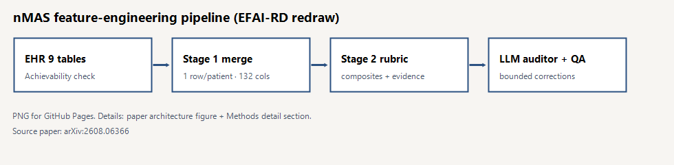
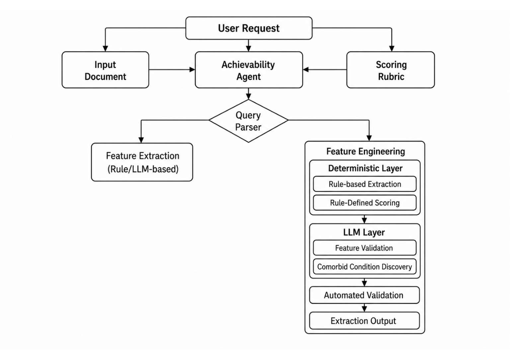

# Tracing the Heart：證據可追溯的心衰竭特徵工程管線（nMAS）

## 來源

- **單位／團隊**：**Nimblemind** 主導，並與 Singapore University of Technology and Design、UIUC、FIU、UCLA、Rutgers 等機構合作
- **論文**：*Tracing the Heart: An Evidence-Linked Pipeline for Heart-Failure Feature Engineering*
- **識別**：[arXiv:2608.06366](https://arxiv.org/abs/2608.06366) · [HTML 全文](https://arxiv.org/html/2608.06366) · 投稿 ML4H 2026

一句話：作者提出 **nMAS**（Nimblemind Multi-Agent System），用「臨床 rubric + 可追溯證據鏈」自動做心衰竭（heart failure, HF）EHR 特徵工程，並在 500 筆 dummy 資料上示範可審計、可提升表型分型預測。

## 流程

*圖 1：nMAS 特徵工程流程摘要（EFAI-RD 重繪）。*

*圖 2：原文架構圖，取自 arXiv HTML [`architecture.png`](https://arxiv.org/html/2608.06366v1/architecture.png)；方法見 [(ref: main §4)](https://arxiv.org/html/2608.06366#S4)。*

## 背景／問題

臨床機器學習前，常要把異質 EHR 清成病人層級變數；作者引用資料科學家約有 **39–45%** 工時花在載入與清理，而非分析 [(ref: main §1)](https://arxiv.org/html/2608.06366#S1)。心衰竭尤其棘手：診斷、用藥、檢驗、影像與行為史分散在多表，且表型依賴指引中的射血分率（ejection fraction, EF）門檻等明確定義 [(ref: main §1)](https://arxiv.org/html/2608.06366#S1) [(ref: main §2)](https://arxiv.org/html/2608.06366#S2)。既有規則式或 LLM 管線多半只能部分自動化，**可維護性與證據可追溯性**不足 [(ref: main Abstract)](https://arxiv.org/html/2608.06366#abstract1)。

## 方法摘要

nMAS 是 **evidence-linked、rubric-grounded** 的多代理管線 [(ref: main §4)](https://arxiv.org/html/2608.06366#S4)：

1. **Achievability Agent**：檢查來源是否撐得起目標特徵；缺輸入則標 unsupported [(ref: main §4)](https://arxiv.org/html/2608.06366#S4)。
2. **Stage 1**：九表標準化 → 去重 → 時間彙總 → 一病人一列 [(ref: main §4)](https://arxiv.org/html/2608.06366#S4)。
3. **Stage 2**：版本化臨床 rubric 產出複合特徵 + structured evidence trace [(ref: main §4)](https://arxiv.org/html/2608.06366#S4)。
4. **LLM auditor**（Qwen 2.5-1.5B-Instruct）：白名單內有界校正 [(ref: main §4)](https://arxiv.org/html/2608.06366#S4)。
5. Rubric 由小型 LLM 草案 + **心臟專科醫師全份審核**（2023 年起 22 篇文獻）[(ref: main §4)](https://arxiv.org/html/2608.06366#S4)。

## 方法詳解

以下對照圖 1／圖 2，展開 [(ref: main §4)](https://arxiv.org/html/2608.06366#S4) 的特徵**工程**管線（本文焦點；另有特徵擷取管線僅作對照）。

### 請求進入與可行性

流程以「EHR 匯出 + 版本化 rubric 目標特徵」為請求。**Achievability Agent** 先對每個目標特徵檢查必要輸入是否存在；撐不起來的特徵標成 unsupported，而不是用模型臆測補值 [(ref: main §4)](https://arxiv.org/html/2608.06366#S4)。通過後，Query Parser 路由到對應 nMAS 管線。

### Stage 1：從九表到病人層級寬表

1. **標準化**：空白壓縮、空字串／`"nan"`→ null、病人 ID 大寫、EHR 時間轉 ISO，以便排序與 first/latest 統計 [(ref: main §4)](https://arxiv.org/html/2608.06366#S4)。  
2. **去重**：各表用臨床有意義的事件鍵去重，避免重送用藥／重傳檢驗灌水計數 [(ref: main §4)](https://arxiv.org/html/2608.06366#S4)。  
3. **時間彙總**：每張來源表先壓到病人層（計數、首末時間戳、臨床旗標），再 merge 成唯一病人列 [(ref: main §4)](https://arxiv.org/html/2608.06366#S4)。  
4. **EF 解析**：區間字串（如 `20–25%`）拆成低／高／中點，再算最低、最高、最近 EF，並標記衝突 [(ref: main §4)](https://arxiv.org/html/2608.06366#S4)。  
5. **缺失策略**：連續測量保留 missing、**不填 0**（避免「EF=0」被讀成極重度收縮功能障礙而灌高嚴重度分數）[(ref: main §4)](https://arxiv.org/html/2608.06366#S4)。

臨床推理層會把文字／代碼轉成可解釋旗標；菸酒等暴露保留有序類別而非單純二元；HF 表型以 ICD 衍生值為主，並在與診斷名衝突時掛 conflict flag [(ref: main §4)](https://arxiv.org/html/2608.06366#S4)。

### Stage 2：Rubric 複合特徵與證據軌跡

Rubric 定義條件、給分與證據階層，把 Stage 1 變數收成可解釋分數／計數／指數，並保留貢獻證據 [(ref: main §4)](https://arxiv.org/html/2608.06366#S4)。權重區分：直接 vs 支持證據、當前 vs 歷史、獨立 vs 重疊測量等；分數是「文獻知情的工程設計」，不是直接從某篇論文抄一個係數 [(ref: main §4)](https://arxiv.org/html/2608.06366#S4)。

七類（疾病嚴重度、心血管風險、五系統共病負擔、人口脆弱性等）採相同邏輯：成分加總、**上限 100**，再映到 high（≥55）／medium（25–54）／low（&lt;25），並回傳成分、分數、白話說明、來源欄、輸入是否存在 [(ref: main §4)](https://arxiv.org/html/2608.06366#S4)。

**HF 表型**另走門檻邏輯：有數值 EF 時，中點 ≤40 → HFrEF、&lt;50 → HFmrEF、否則 HFpEF；無數值 EF 則用 ICD／診斷路徑，**不插補 EF**，且同一病人不會同時被標成 reduced 與 preserved [(ref: main §4)](https://arxiv.org/html/2608.06366#S4)。此邏輯也約束 HFrEF 相關 care-gap 檢查的適用對象 [(ref: main §4)](https://arxiv.org/html/2608.06366#S4)。

### LLM Auditor 與品管

每個候選列由本機 Qwen 2.5-1.5B-Instruct 稽核：只允許改白名單數值／類別欄；`_json`／`_explanation` 等證據軌跡欄受保護；無法解析的回應記 audit failure 並保留原分數 [(ref: main §4)](https://arxiv.org/html/2608.06366#S4)。另有自動化 harness 查唯一 ID、表型互斥、缺失保留、rubric 合規、單調性（如現吸菸分數應高於既往）、成分可追溯與 provenance [(ref: main §4)](https://arxiv.org/html/2608.06366#S4)。

共病「發現」階段並不發明新病名：候選條件固定在 rubric（13 項），模型只在既有欄位中指出可當證據的欄，並經校驗／deterministic fallback [(ref: main §4)](https://arxiv.org/html/2608.06366#S4)。

## 資料與實驗

- **500** 筆 dummy HF 病人、九張結構化 EHR 表 [(ref: main §3)](https://arxiv.org/html/2608.06366#S3)。
- 數值 EF 僅 **3.0%**（15/500）有紀錄 [(ref: main §5)](https://arxiv.org/html/2608.06366#S5)。
- 次要評估：XGBoost，HFrEF／HFpEF 各自 vs phenotype-unknown；baseline（清洗合併變數）vs 加複合特徵；5-fold × 10 shuffle [(ref: main §4)](https://arxiv.org/html/2608.06366#S4) [(ref: main §5)](https://arxiv.org/html/2608.06366#S5)。

## 結果

- Stage 1：**500** 列、**132** 結構化欄 [(ref: main §5)](https://arxiv.org/html/2608.06366#S5)。
- Stage 2：**70** 個 rubric 欄，列皆經 auditor [(ref: main §5)](https://arxiv.org/html/2608.06366#S5)。
- AUROC：HFrEF **0.895 → 0.963**；HFpEF **0.870 → 0.910** [(ref: main Abstract)](https://arxiv.org/html/2608.06366#abstract1) [(ref: main §5)](https://arxiv.org/html/2608.06366#S5)。
- LLM 建構效度約 **81.5%** 滿分 [(ref: main Abstract)](https://arxiv.org/html/2608.06366#abstract1) [(ref: main §5)](https://arxiv.org/html/2608.06366#S5)。
- 等權／隨機權重 ablation 變差，支持 rubric 權重 [(ref: main §5)](https://arxiv.org/html/2608.06366#S5)。

## 限制

單機構、**dummy**、n=500；任務是 HF 表型分型（非 vs 非 HF 對照）；可能有特徵—標籤證據重疊；未做前瞻臨床效益等 [(ref: main §6)](https://arxiv.org/html/2608.06366#S6)。

## 與書庫其他文章的關係

目前書庫尚無直接相關文章。

## 實務的啟發

1. 特徵輸出應能指回來源欄與評分規則，方便稽核與複現。
2. LLM 宜框在 rubric 起草／有界稽核；執行評分可偏 deterministic。
3. 誠實標示 dummy／單中心；落地仍需外部驗證。

## References

- **main** — Shimgekar et al. *Tracing the Heart: An Evidence-Linked Pipeline for Heart-Failure Feature Engineering*.  
  [HTML](https://arxiv.org/html/2608.06366) · [abs](https://arxiv.org/abs/2608.06366)  
  [`#abstract1`](https://arxiv.org/html/2608.06366#abstract1) · [`#S1`](https://arxiv.org/html/2608.06366#S1) · [`#S3`](https://arxiv.org/html/2608.06366#S3) · [`#S4`](https://arxiv.org/html/2608.06366#S4) · [`#S4.fig1`](https://arxiv.org/html/2608.06366#S4.fig1) · [`#S5`](https://arxiv.org/html/2608.06366#S5) · [`#S6`](https://arxiv.org/html/2608.06366#S6)
