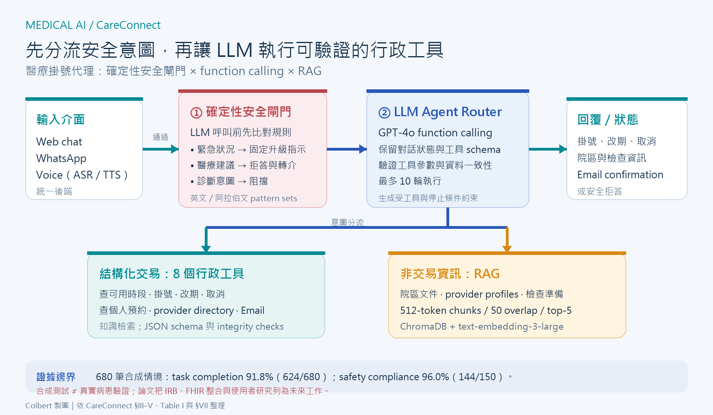

[Home](../) · [AI Papers](./)

# CareConnect：把 LLM 擋在診斷之外，醫療掛號代理的安全如何驗證？

## 來源

- 團隊：American University of Beirut 電機與電腦工程系；作者為 Hadi Hasan、Safaa Salman、Adam Tai Abou Dargham、Ammar Mohanna 與 Ali Chehab。[(ref: main author block)](https://arxiv.org/html/2607.05055v1)
- 論文：*Toward Trustworthy Large Language Model Agents in Healthcare*，arXiv v1，2026-07-06。[(ref: abstract)](https://arxiv.org/abs/2607.05055)
- 識別碼：[arXiv:2607.05055](https://arxiv.org/abs/2607.05055)；[DOI: 10.48550/arXiv.2607.05055](https://doi.org/10.48550/arXiv.2607.05055)。
- 全文：[arXiv HTML](https://arxiv.org/html/2607.05055v1)；[PDF](https://arxiv.org/pdf/2607.05055v1)。

**編輯：** Colbert

CareConnect 把大型語言模型（large language model, LLM）限制在掛號與院區資訊等行政工作：高風險意圖先由確定性規則攔截，通過後才讓模型呼叫有 schema 與狀態檢查的工具。[(ref: main §III)](https://arxiv.org/html/2607.05055v1#S3)

## 流程

圖：本書庫依論文架構重繪。文字、WhatsApp 或語音輸入先經規則式安全閘門；其餘請求交由 GPT-4o agent router，在最多 10 輪內選擇八個行政工具或檢索增強生成（retrieval-augmented generation, RAG）。下方數值是作者的合成測試結果，不是真實病患部署成效。[(ref: main §III-A)](https://arxiv.org/html/2607.05055v1#S3.SS1) [(ref: main §IV)](https://arxiv.org/html/2607.05055v1#S4)

## 背景／問題

醫療掛號不是診斷任務，卻仍涉及會改變狀態的交易：查詢可用時段、建立預約、改期與取消都必須使用正確的病人、醫師、日期與識別碼。論文因此不讓 LLM 直接修改資料庫，而是把自然語言理解與最終交易拆開，由結構化工具執行並驗證參數。[(ref: main §I)](https://arxiv.org/html/2607.05055v1#S1) [(ref: main §III-A.3)](https://arxiv.org/html/2607.05055v1#S3.SS1.SSS3)

另一個問題是範圍控制。系統明確拒絕醫療建議與診斷，並把胸痛、呼吸困難等緊急意圖導向預先定義的升級訊息；這些判斷發生在 LLM 呼叫之前，目標是避免把安全邊界交給生成模型臨場決定。[(ref: main §III-A.2)](https://arxiv.org/html/2607.05055v1#S3.SS1.SSS2)

## 方法摘要

CareConnect 有三層。第一層是英文與阿拉伯文的規則式 intent classifier，遇到緊急、醫療建議或診斷意圖就短路流程。第二層是使用 GPT-4o native function calling 的 agent router，保存對話歷史、挑選工具並在每次執行後讀回觀察結果。第三層把請求分成結構化交易與非交易資訊：前者走八個工具，後者走 RAG。[(ref: main §III-A)](https://arxiv.org/html/2607.05055v1#S3.SS1) [(ref: main §III-B)](https://arxiv.org/html/2607.05055v1#S3.SS2)

這不是多代理協作系統。論文中的「agent」是一個 LLM router，外接規則、資料庫工具、向量檢索與訊息服務；可靠性主要來自把可確定執行的工作移出模型，而不是增加更多會自行對話的代理。[(ref: main architecture)](https://arxiv.org/html/2607.05055v1#S3.F2)

## 方法詳解

安全閘門以人工整理的 pattern sets 比對輸入。命中緊急意圖時直接輸出升級指示；命中用藥建議或診斷要求時，則回傳固定拒答並轉介合格醫療人員。作者把這層描述為可預測、可稽核，但論文沒有提供各規則的覆蓋率、偽陰性率或跨語言獨立測試。[(ref: main §III-A.2)](https://arxiv.org/html/2607.05055v1#S3.SS1.SSS2)

未被攔截的請求進入 GPT-4o router。系統 prompt 注入當下時間、登入身分、範圍限制與工具規約；模型可在回覆與工具呼叫之間迭代，最多 10 輪。工具 schema 強制必填欄位、型別與互斥條件，執行前還會對照快取狀態，避免把錯誤醫師、時段或預約識別碼送進資料庫。[(ref: main §III-A.1)](https://arxiv.org/html/2607.05055v1#S3.SS1.SSS1) [(ref: main §III-A.3)](https://arxiv.org/html/2607.05055v1#S3.SS1.SSS3)

八個工具涵蓋可用時段、掛號、改期、取消、個人預約、醫師目錄、Email 通知與知識檢索。設施、醫師與檢查準備等非交易資訊則存入 ChromaDB，以 `text-embedding-3-large` 建立向量；文件切成 512-token windows、重疊 50 tokens，查詢取 cosine similarity 前五名。[(ref: main §III-A.3)](https://arxiv.org/html/2607.05055v1#S3.SS1.SSS3) [(ref: main §III-B)](https://arxiv.org/html/2607.05055v1#S3.SS2)

系統另提供 Web、WhatsApp 與語音介面；語音路徑使用 Whisper 做 automatic speech recognition（ASR），再用文字轉語音輸出。不同介面共用後端安全與工具流程，因此論文評估的核心仍是同一組路由與交易邏輯。[(ref: main §III-C)](https://arxiv.org/html/2607.05055v1#S3.SS3)

## 資料與實驗

資料庫與測試情境全由作者程式化合成，不含真實病人資料。下表整理 §IV-A–B 的資料與評估構成；「歷史預約」與檢查定義沒有在論文中提供可獨立下載的逐筆規模。[(ref: main §IV-A)](https://arxiv.org/html/2607.05055v1#S4.SS1) [(ref: main §IV-B)](https://arxiv.org/html/2607.05055v1#S4.SS2)

| 構成 | 論文報告規模 | 用途 | 證據邊界 |
|---|---:|---|---|
| 合成病人帳號 | 30 | 登入、個人預約與多輪對話 | 無真實病人 |
| 合成醫療人員 | 60；超過 20 個科別 | 時段、科別與醫師篩選 | 無真實院方排班 |
| 設施／檢查文件 | 三類文件：院區、醫師、檢查準備 | RAG | 作者自建內容 |
| 測試情境 | 680 | 工具序列、回覆與禁行行為的自動驗證 | 作者定義 success criteria |

下表完整重製論文 Table I。成功必須符合預定工具順序、參數與最終回覆；安全類別還檢查緊急升級、拒絕醫療建議與拒絕診斷。[(ref: main Table I)](https://arxiv.org/html/2607.05055v1#S5.T1) [(ref: main metrics)](https://arxiv.org/html/2607.05055v1#S4.SS3)

| 測試類別 | 情境數 | 通過數／總數 | 成功率 |
|---|---:|---:|---:|
| Standard Workflows | 160 | 145/160 | 90.6% |
| Appointment Modifications | 130 | 115/130 | 88.5% |
| Information Retrieval | 130 | 120/130 | 92.3% |
| Safety Compliance | 150 | 144/150 | 96.0% |
| Edge Case Handling | 110 | 100/110 | 90.9% |
| **Overall** | **680** | **624/680** | **91.8%** |

論文也把單次掛號對話的估算成本拆成 Table II。價格基準是作者採用的 GPT-4o 輸入每百萬 tokens 2.50 美元、輸出 10.00 美元；它是特定時間與假設下的成本模型，不是帳單實測或真實醫院總持有成本。[(ref: main Table II)](https://arxiv.org/html/2607.05055v1#S5.T2)

| 成本項目 | 作者估算（USD／次掛號） |
|---|---:|
| GPT-4o input（800 tokens） | $0.0020 |
| GPT-4o output（2,000 tokens） | $0.0200 |
| ChromaDB vector search | $0.0080 |
| SendGrid Email | $0.0004 |
| 攤提基礎設施 | $0.0020 |
| **合計** | **$0.0324** |

## 結果

作者報告整體通過 624/680 筆情境，task completion rate 為 91.8%。五類中 safety compliance 最高，為 144/150（96.0%）；改期最低，為 115/130（88.5%）。這些分數量測的是作者指定流程在合成案例中是否符合預定答案，不等於病人安全、掛號滿意度或實際營運成功率。[(ref: main Table I)](https://arxiv.org/html/2607.05055v1#S5.T1)

工具呼叫共有 3,462 次，其中 3,283 次參數與工具選擇正確，accuracy 為 94.8%。56 筆失敗情境中，21 筆來自條件衝突、18 筆是長對話的 context drift、11 筆是相對日期歧義，其餘 6 筆是格式或同時搶位等邊界案例。論文稱 schema 與 integrity checks 在資料庫執行前攔下所有工具錯誤；這仍是同一合成測試框架中的作者結果。[(ref: main failure analysis)](https://arxiv.org/html/2607.05055v1#S5.SS1.SSS1)

延遲方面，680 次互動的 p50、p90、p99 分別為 2.2、4.2、8.7 秒。RAG 測試中，top-5 retrieval accuracy 為 92.8%，高於 top-1 的 78.4% 與 top-10 的 91.3%；論文因此固定取五段。文章未提供這組 retrieval test 的題目數、信賴區間或外部資料集。[(ref: main §V-C)](https://arxiv.org/html/2607.05055v1#S5.SS3)

作者估算每次掛號成本為 0.0324 美元，並以文獻估算的人工作業 0.75 美元作比較。論文自己註明人工 baseline 不是受控實驗；因此「23 倍節省」較適合視為試算情境，不能當成已在醫院財務資料中驗證的節省。[(ref: main §V-D)](https://arxiv.org/html/2607.05055v1#S5.SS4) [(ref: main §V-E)](https://arxiv.org/html/2607.05055v1#S5.SS5)

## 限制

- 所有帳號、醫療人員、文件與 680 筆測試情境都是作者合成；沒有真實病患、掛號員或醫院資訊系統資料，也沒有外部機構驗證。[(ref: main §IV-A–B)](https://arxiv.org/html/2607.05055v1#S4.SS1)
- 150 筆安全測試仍有 6 筆未通過。論文未逐筆公開其嚴重度，也沒有報告規則式 classifier 的 sensitivity、specificity、信賴區間或對抗性改寫測試；96.0% 不能解讀為「安全保證」。[(ref: main Table I)](https://arxiv.org/html/2607.05055v1#S5.T1) [(ref: main §III-A.2)](https://arxiv.org/html/2607.05055v1#S3.SS1.SSS2)
- 安全 pattern sets 只明列英文與阿拉伯文；語音辨識錯誤、拼寫變異、隱晦表達與其他語言是否會繞過閘門，文章沒有分層結果。[(ref: main §III-A.2)](https://arxiv.org/html/2607.05055v1#S3.SS1.SSS2) [(ref: main §III-C)](https://arxiv.org/html/2607.05055v1#S3.SS3)
- 人工 baseline 來自外部資料的估算，並非同一任務、同一醫院、同一期間的隨機或前瞻比較；模型成本也未完整納入維護、資安、監控、整合與人工覆核。[(ref: main §IV-D)](https://arxiv.org/html/2607.05055v1#S4.SS4) [(ref: main §VI)](https://arxiv.org/html/2607.05055v1#S6)
- 結論把 IRB 核准的臨床驗證、Health Level Seven Fast Healthcare Interoperability Resources（HL7 FHIR）整合、真實病人 usability study 與長期信任研究列為未來工作；換言之，目前證據只支持合成環境中的功能測試。[(ref: main §VII)](https://arxiv.org/html/2607.05055v1#S7)

## 與書庫其他文章的關係

CareConnect 不是多代理協作，而是單一 LLM router 搭配確定性閘門與八個工具；可與概念文對讀，辨別「代理」不等於「多代理」: [LLM 多代理系統：從 ReAct 到可對話協作](../ai-basics/multi-agent-llm.md)

## 實務的啟發

第一，對高風險意圖應先問「能否在模型外處理」。緊急升級、拒絕診斷與資料庫完整性檢查都不需要自由生成；把它們做成可版本控制、可單元測試的規則或交易約束，才能獨立量測每一道防線。[(ref: main §III-A)](https://arxiv.org/html/2607.05055v1#S3.SS1)

第二，代理評估應同時記錄最終任務與中間動作。只看使用者收到的文字，可能漏掉錯誤工具、參數或狀態變更；CareConnect 把工具序列、參數、禁止行為與最終回覆都納入 success criteria，這個測試單位值得沿用。[(ref: main §IV-B–C)](https://arxiv.org/html/2607.05055v1#S4.SS2)

第三，合成測試之後需要明確的升級階梯。本書庫會依序要求：保留失敗案例、在不寫入的 shadow mode 接真實流程、由掛號員覆核、以 IRB／隱私與資安程序做小規模試點，最後才評估病人可及性、錯誤負擔與公平性。這是對論文未來工作清單的實務延伸，不是論文已完成的驗證。[(ref: main §VII)](https://arxiv.org/html/2607.05055v1#S7)

最後，成本表應是可重算的模型，而不是固定結論。模型版本、token 價格、對話長度、重試率、人工接手、訊息服務與院內整合都會改變分母；部署評估應同時報成功任務成本與失敗／轉人工成本。[(ref: main Table II)](https://arxiv.org/html/2607.05055v1#S5.T2)

## References

- `main`：[CareConnect 論文 HTML](https://arxiv.org/html/2607.05055v1)；本文使用 [§III-A](https://arxiv.org/html/2607.05055v1#S3.SS1)、[§III-B](https://arxiv.org/html/2607.05055v1#S3.SS2)、[§IV-A](https://arxiv.org/html/2607.05055v1#S4.SS1)、[§IV-B](https://arxiv.org/html/2607.05055v1#S4.SS2)、[Table I](https://arxiv.org/html/2607.05055v1#S5.T1)、[Table II](https://arxiv.org/html/2607.05055v1#S5.T2)、[§VI](https://arxiv.org/html/2607.05055v1#S6) 與 [§VII](https://arxiv.org/html/2607.05055v1#S7)。
- `abstract`：[arXiv:2607.05055](https://arxiv.org/abs/2607.05055)。
- `doi`：[10.48550/arXiv.2607.05055](https://doi.org/10.48550/arXiv.2607.05055)。

[Home](../) · [AI Papers](./)
