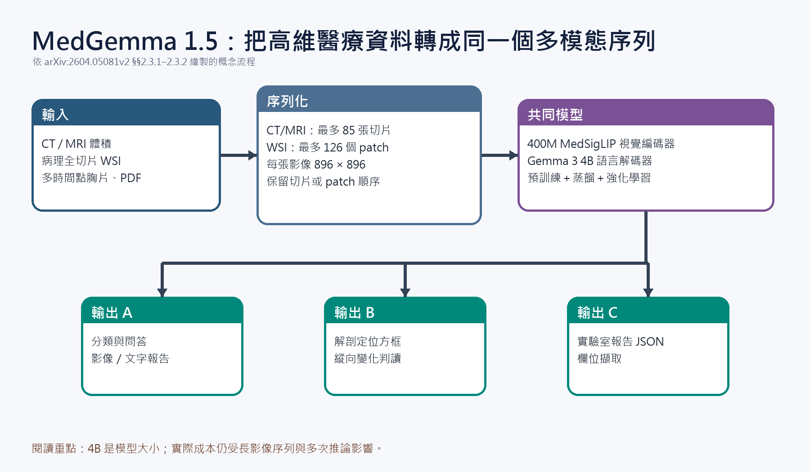

[Home](../) · [AI Papers](./)

# MedGemma 1.5：4B 模型如何讀取 3D 影像、全切片與縱向胸片？

## 來源

- 團隊：Google Research、Google DeepMind；完整作者名單見論文貢獻段。[(ref: main §7)](https://arxiv.org/html/2604.05081v2#S7)
- 論文：*MedGemma 1.5 Technical Report*，arXiv v2，2026-05-01。[(ref: main abstract)](https://arxiv.org/abs/2604.05081)
- 識別碼：[arXiv:2604.05081](https://arxiv.org/abs/2604.05081)；[DOI: 10.48550/arXiv.2604.05081](https://doi.org/10.48550/arXiv.2604.05081)。
- 全文：[arXiv HTML](https://arxiv.org/html/2604.05081v2)；[PDF](https://arxiv.org/pdf/2604.05081v2)。

**編輯：** Colbert

MedGemma 1.5 的重點不是把 4B 模型變成臨床決策者，而是把 3D CT/MRI、病理全切片、縱向胸片、定位與醫療文件解析納入同一個可再微調的基礎模型，並公開展示能力擴張伴隨的代價。

## 流程

圖：本書庫依論文方法繪製的概念流程。CT/MRI 最多取 85 張軸向切片；病理全切片最多取 126 個組織 patch；兩者都轉成 896×896 影像序列後送入 MedSigLIP 與 Gemma 3 4B 架構。[(ref: main §2.3.1)](https://arxiv.org/html/2604.05081v2#S2.SS3.SSS1) [(ref: main §2.3.2)](https://arxiv.org/html/2604.05081v2#S2.SS3.SSS2)

## 背景／問題

傳統醫療 VLM 多半處理單張 2D 影像；CT、MRI、病理全切片與多時間點胸片則要求模型同時保留跨切片、跨區域或跨時間的關係。論文把問題設成「能否在同一個 4B 架構中加入這些高維能力，同時保留既有文字與 2D 影像能力」。[(ref: main §1)](https://arxiv.org/html/2604.05081v2#S1)

這是技術報告與離線基準研究。作者明確說明模型不應在缺乏必要臨床微調時直接部署；文章中的分數不能推導為診斷安全性或病人效益。[(ref: main Fig. 2 note)](https://arxiv.org/html/2604.05081v2#S1.F2)

## 方法摘要

MedGemma 1.5 沿用 Gemma 3 4B 與 400M 參數 MedSigLIP 視覺編碼器，凍結視覺編碼器，對語言解碼器做額外預訓練，再以教師蒸餾與強化學習加入多模態醫療能力。[(ref: main §2)](https://arxiv.org/html/2604.05081v2#S2) [(ref: main §2.1–2.2)](https://arxiv.org/html/2604.05081v2#S2.SS1)

輸入端以「多張 2D 影像序列」統一不同高維資料：CT/MRI 沿軸向取樣，病理全切片先找組織區再抽 patch；胸片定位要求模型輸出正規化方框座標；實驗室報告則輸出包含檢驗名稱、結果、單位、檢體、方法與採樣時間的 JSON。[(ref: main §2.3)](https://arxiv.org/html/2604.05081v2#S2.SS3) [(ref: main §3.2.4–3.2.5)](https://arxiv.org/html/2604.05081v2#S3.SS2.SSS4)

## 方法詳解

CT/MRI 每張軸向切片縮放至 896×896，單次最多 85 張，約占 21,760 個視覺 token；超過上限時沿 z 軸等距取樣。CT 將 Hounsfield Unit 分別映射到寬窗、軟組織窗與窄窗三個 RGB channel；MRI 因強度是相對值，改為每個 volume 做 min-max 正規化。[(ref: main §2.3.1)](https://arxiv.org/html/2604.05081v2#S2.SS3.SSS1)

病理全切片先在 5× 低倍率產生組織 mask，再以 5×、10×、20× 三種倍率抽取不重疊的 896×896 patch。每張切片最多保留 126 個 patch、共 32,256 個視覺 token，抽樣後保留原始空間順序。[(ref: main §2.3.2)](https://arxiv.org/html/2604.05081v2#S2.SS3.SSS2)

訓練資料混合公開與內部資料，使用 continued pretraining、教師蒸餾與強化學習的不同組合。蒸餾每個 token 抽取 256 個教師 logits，學生以交叉熵學習該分布；3D CT、MRI 與內部病理資料另訓練領域教師。[(ref: main §2.2)](https://arxiv.org/html/2604.05081v2#S2.SS2)

## 資料與實驗

新增訓練資料以內部資料為主，這會直接限制外部重現性。下表保留論文 Table 1 的主要資料量與訓練階段。[(ref: main Table 1)](https://arxiv.org/html/2604.05081v2#S2.T1)

| 模態／資料集 | 訓練樣本 | 階段 | 公開性說明 |
|---|---:|---|---|
| CXR-IND1 | 605,732 | PT、Distill、RL | 內部醫院資料 |
| CT Dataset 1 | 282,963 | PT、Distill、RL | 內部資料 |
| MRI Dataset 1 | 167,674 | PT、Distill、RL | 內部資料 |
| Chest ImaGenome | 39,968 | RL | 公開資料 |
| Internal WSI Histopathology | 335,825 | PT、RL | 內部資料 |
| EHRQA | 9,809 組 QA | Distill | 合成 FHIR 記錄 |

新任務涵蓋文件解析、定位、縱向胸片、3D CT/MRI 與 WSI 報告生成。下表重製論文 Table 4 中最能顯示能力邊界的 MedGemma 1 與 1.5 比較；數值皆為百分比，IoU 與 ROUGE-L 亦按原表刻度呈現。[(ref: main Table 4)](https://arxiv.org/html/2604.05081v2#S3.T4)

| 任務 | 指標 | MedGemma 1 4B | MedGemma 1.5 4B |
|---|---|---:|---:|
| EHR Dataset 2 | Macro F1 | 78 | 91 |
| EHR Dataset 3 | Macro F1 | 50 | 71 |
| EHR Dataset 4 | Macro F1 | 25 | 64 |
| Chest ImaGenome 定位 | Mean IoU | 3.1 | 38.0 |
| MS-CXR-T 縱向分析 | Macro-Accuracy | 61.1 | 65.7 |
| CT Dataset 1（3D CT） | Accuracy | 58.2 | 61.1 |
| MRI Dataset 1（3D MRI） | Accuracy | 51.3 | 64.7 |
| WSI Histopath | ROUGE-L | 2.2 | 49.4 |

論文多數評估每個樣本只推論一次；MedGemma 1.5 使用 temperature 0.0，其他基線沿用各自預設 temperature 與 top-k。作者也指出提示修改有時會顯著影響分數，因此跨模型欄位不等於完全同條件比較。[(ref: main evaluation protocol)](https://arxiv.org/html/2604.05081v2#S3)

## 結果

相較 MedGemma 1 4B，1.5 在新增任務中最明顯的變化是 Chest ImaGenome Mean IoU 從 3.1 升至 38.0、MRI accuracy 從 51.3 升至 64.7、WSI ROUGE-L 從 2.2 升至 49.4；CT accuracy 則由 58.2 升至 61.1。這些結果支持「新增模態能力」的主張，但不能跨資料集直接比較增幅大小。[(ref: main Table 4)](https://arxiv.org/html/2604.05081v2#S3.T4)

能力擴張並非全面進步。既有表格中 PubMedQA accuracy 由 73.4 降至 67.6、SLAKE tokenized F1 由 72.3 降至 59.8、VQA-RAD 由 49.9 降至 48.1；一般知識 MMLU Pro 也由 39.1 降至 33.8。[(ref: main Table 3)](https://arxiv.org/html/2604.05081v2#S3.T3) [(ref: main Table 6)](https://arxiv.org/html/2604.05081v2#A1.T6)

在公開、未進入訓練的 CT-RATE 子集，MedGemma 1.5 4B 的 Macro F1 為 26.9，MedGemma 1 4B 為 23.5，Gemini 3.0 Flash 為 8.5；但此流程每個 condition 要查詢模型 18 次，帶來顯著計算瓶頸。[(ref: main Appendix A)](https://arxiv.org/html/2604.05081v2#A1)

## 限制

- 許多訓練與評估資料是內部資料，外部研究者無法完整重現資料組成、切分與標註流程。[(ref: main Tables 1–2)](https://arxiv.org/html/2604.05081v2#S2.T1)
- 新舊模型與外部基線使用的解碼預設不同，提示亦經調整；細小分差不宜視為穩定排名。[(ref: main §3)](https://arxiv.org/html/2604.05081v2#S3)
- 作者只明列部分舊基準退步，且指出 token-overlap 類評估本身有品質限制；模型變得更通用，不代表每個任務都更好。[(ref: main limitations)](https://arxiv.org/html/2604.05081v2#S4.SS2)
- 技術報告沒有提供前瞻性臨床驗證、校準、公平性、錯誤嚴重度或工作流程效益證據；因此不能由離線分數推論可直接臨床部署。

## 與書庫其他文章的關係

Lingshu 同樣追求單一醫療 VLM 的跨模態通用能力，可用來比較資料混合、強化學習與評估設計如何影響「通用」的定義: [Lingshu：醫療 VLM 如何整合影像、文字與合成資料，RL 又帶來多少改變？](2026-09-15-lingshu-medical-vlm.md)

## 實務的啟發

若要把這類模型作為研發起點，第一步應按實際 intended use（預定用途）拆開評估：3D volume 的切片取樣、WSI patch 覆蓋率、縱向胸片的時間順序與文件 JSON 的欄位正確率都需要各自的失敗分析。單一平均分數無法回答漏掉哪一種病灶、哪個解剖區或哪類文件欄位。

本書庫認為第二個重點是成本。將 3D volume 攤成最多 85 張影像、WSI 攤成 126 個 patch，或在 CT-RATE 對每個 condition 查詢 18 次，都把「4B 模型」轉成長序列與多次推論系統；部署評估應同時報告延遲、記憶體、吞吐量與人工覆核負擔。

第三，這份報告最適合被視為可微調基線。模型卡、在地資料切分、外部驗證與臨床風險控制仍需依產品情境另行建立，不能由作者釋出權重或 benchmark 優勢代替。

## References

- `main`：[MedGemma 1.5 Technical Report（HTML）](https://arxiv.org/html/2604.05081v2)；本文使用 [§1](https://arxiv.org/html/2604.05081v2#S1)、[§2](https://arxiv.org/html/2604.05081v2#S2)、[Table 1](https://arxiv.org/html/2604.05081v2#S2.T1)、[Table 4](https://arxiv.org/html/2604.05081v2#S3.T4)、[limitations](https://arxiv.org/html/2604.05081v2#S4.SS2) 與 [Appendix A](https://arxiv.org/html/2604.05081v2#A1)。
- `abstract`：[arXiv:2604.05081](https://arxiv.org/abs/2604.05081)。
- `doi`：[10.48550/arXiv.2604.05081](https://doi.org/10.48550/arXiv.2604.05081)。

[Home](../) · [AI Papers](./)
