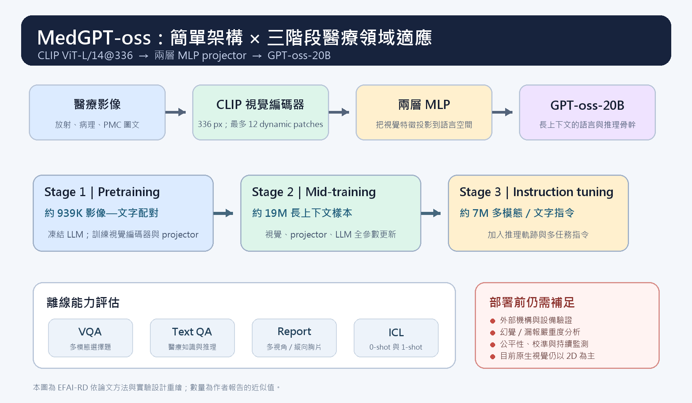

[Home](../) · [AI Papers](./)

# MedGPT-oss：20B 模型能靠簡單架構與三階段資料配方追上更大的醫療 VLM 嗎？

## 來源

- 團隊：Lehigh University、University of Notre Dame、University of Florida、Mayo Clinic 與 NVIDIA；論文列有 13 位作者。[(ref: main author block)](https://arxiv.org/html/2603.00842v1)
- 論文：*MedGPT-oss: Training a General-Purpose Vision-Language Model for Biomedicine*，技術報告 v1，2026-03-01。[(ref: abstract)](https://arxiv.org/abs/2603.00842)
- 識別碼：[arXiv:2603.00842](https://arxiv.org/abs/2603.00842)；[DOI: 10.48550/arXiv.2603.00842](https://doi.org/10.48550/arXiv.2603.00842)。
- 全文：[arXiv HTML](https://arxiv.org/html/2603.00842v1)；[PDF](https://arxiv.org/pdf/2603.00842v1)。

**編輯：** Colbert

MedGPT-oss 的重點不是提出更複雜的醫療專用架構，而是測試標準 CLIP 視覺編碼器、兩層投影器與 GPT-oss-20B，能否靠分階段資料配方在多種醫療任務上形成可稽核的開放研究基線。[(ref: main §3.1–3.2)](https://arxiv.org/html/2603.00842v1#S3)

## 流程

圖：本書庫依論文方法與實驗設計重繪。架構由 CLIP ViT-L/14@336、兩層多層感知器（MLP）投影器與 GPT-oss-20B 組成；三階段依序使用約 939K、19M 與 7M 筆資料。[(ref: main §3.1)](https://arxiv.org/html/2603.00842v1#S3.SS1) [(ref: main §3.2)](https://arxiv.org/html/2603.00842v1#S3.SS2)

## 背景／問題

放射影像、病理切片與臨床文字原本常由不同專用模型處理；作者把問題設成：能否用同一個開放權重的多模態模型，跨越影像理解、醫療文字推理、報告生成與 in-context learning（情境學習），同時維持可在機構內部驗證的可能性。[(ref: main §1)](https://arxiv.org/html/2603.00842v1#S1)

論文特別強調「效能、透明度與部署成本」之間的取捨，但它仍把 MedGPT-oss 定位為研究基礎，而不是可直接使用的臨床工具。本文因此把離線分數當成模型與資料配方的比較，不把它解讀為診斷安全性或病人效益。[(ref: main positioning)](https://arxiv.org/html/2603.00842v1#S2.SS0.SSS0.Px4) [(ref: main §5)](https://arxiv.org/html/2603.00842v1#S5)

## 方法摘要

模型採用三段式模組：CLIP ViT-L/14@336 把放射、病理等 2D 影像轉成視覺特徵；兩層 MLP 把特徵投影到語言 embedding 空間；GPT-oss-20B 負責文字理解與生成。作者沒有使用醫療專用視覺編碼器作為主幹，並以初步消融結果支持一般 CLIP 的選擇。[(ref: main §3.1)](https://arxiv.org/html/2603.00842v1#S3.SS1) [(ref: main Fig. 1)](https://arxiv.org/html/2603.00842v1#S3.F1)

訓練分成三階段：先以短影像—文字配對建立對齊，再用長上下文資料做全參數 mid-training，最後混合多模態與純文字指令資料做 instruction tuning。第一階段凍結語言模型；後兩階段則更新視覺編碼器、投影器與語言模型。[(ref: main §3.2)](https://arxiv.org/html/2603.00842v1#S3.SS2)

## 方法詳解

預訓練資料來自 PMC-OA、Quilt-1M、ROCOv2 與 BIOMEDICA 的部分子集。作者只保留單 panel 影像，並過濾介面截圖、疊字、無臨床意義的配對與誤導性數字，最後得到約 939K 組影像—文字配對。[(ref: main pretraining)](https://arxiv.org/html/2603.00842v1#S3.SS2.SSS0.Px1)

Mid-training 加入 MIMIC-CXR、MedTrinity 開放子集與 PubMedVision Alignment；MIMIC-CXR 同時包含單張、multi-view 與 longitudinal study，總資料量約 19M。Instruction tuning 再混合醫療視覺指令、一般與醫療文字指令，以及經 rejection sampling 與 refinement 處理的推理軌跡，總量約 7M。[(ref: main mid-training)](https://arxiv.org/html/2603.00842v1#S3.SS2.SSS0.Px2) [(ref: main instruction tuning)](https://arxiv.org/html/2603.00842v1#S3.SS2.SSS0.Px3)

訓練使用 8 張 NVIDIA B200、DeepSpeed ZeRO-3、bfloat16 與 gradient checkpointing。論文設定最大序列長度 32,768，並用 YaRN RoPE scaling 把原始 4,096 positions 延長到 131,072；三階段各訓練 1 epoch，作者報告的 wall-clock time 分別為 8 小時 27 分、240 小時 24 分與 86 小時 26 分。[(ref: main §3.3)](https://arxiv.org/html/2603.00842v1#S3.SS3) [(ref: main Table 2)](https://arxiv.org/html/2603.00842v1#S3.T2)

## 資料與實驗

下表整理論文 Table 1 的主要訓練資料；「約 7M」是作者對 instruction-tuning 混合資料的總結，個別來源與筆數可回原表核對。[(ref: main Table 1)](https://arxiv.org/html/2603.00842v1#S3.T1)

| 階段 | 主要資料來源 | 論文報告規模 | 更新範圍 |
|---|---|---:|---|
| Pretraining | PMC-OA、Quilt-1M、ROCOv2、BIOMEDICA 部分子集 | 約 939K pairs | 視覺編碼器、MLP；LLM 凍結 |
| Mid-training | MIMIC-CXR、MedTrinity 開放子集、PubMedVision Alignment | 約 19M samples | 全參數 |
| Instruction tuning | 醫療 VQA、病理 VQA、醫療／一般文字指令、推理資料 | 約 7M pairs | 全參數 |

評估涵蓋六組 VQA 設定、六組文字問答、MIMIC-CXR 多視角／縱向報告生成，以及 patient–trial matching 與胸片 impression generation 的 0-shot／1-shot 測試。除 SLAKE 與標準文字資料集外，作者把多個新任務標成 out-of-distribution；其中 Impression 任務刻意排除於訓練資料。[(ref: main Table 3)](https://arxiv.org/html/2603.00842v1#S4.T3) [(ref: main §4.1)](https://arxiv.org/html/2603.00842v1#S4.SS1)

下表完整重製論文 Table 4；所有數值都是 accuracy（%）。粗體僅標示該列最高值。Lingshu 曾使用 MMMU-Med dev 訓練，因此該列不是完全獨立的外部測試。[(ref: main Table 4)](https://arxiv.org/html/2603.00842v1#S4.T4)

| Dataset | MedGPT-oss | OctoMed | Hulu-Med | Lingshu | MedGemma | QoQ-Med |
|---|---:|---:|---:|---:|---:|---:|
| MedXQA（multimodal） | **49.23** | 25.60 | 34.35 | 31.43 | 30.90 | 29.64 |
| SLAKE | 71.53 | 65.07 | 69.14 | **72.24** | 55.98 | 46.53 |
| MedFrameQA | **63.01** | 42.82 | 62.82 | 61.01 | 47.63 | 55.73 |
| MMMU-Med（dev） | **61.49** | 47.65 | 57.71 | 59.43 | 47.43 | 51.84 |
| MMMU-Med-Pro（4 options） | 52.34 | 44.62 | 52.45 | **52.67** | 45.80 | 46.93 |
| MMMU-Med-Pro（10 options） | 39.94 | 23.07 | 37.41 | **43.45** | 36.71 | 38.12 |

下表完整重製論文 Table 6。Patient–trial 使用 accuracy（%）；Impression 使用 RaTEScore。[(ref: main Table 6)](https://arxiv.org/html/2603.00842v1#S4.T6)

| Dataset | MedGPT-oss | OctoMed | Hulu-Med | Lingshu | MedGemma | QoQ-Med |
|---|---:|---:|---:|---:|---:|---:|
| Patient–trial（0-shot） | 48.81 | 40.96 | 51.01 | **52.07** | 31.03 | 45.20 |
| Patient–trial（1-shot） | **55.60** | 40.02 | 47.00 | 48.91 | 52.24 | 47.41 |
| Impression（0-shot） | **47.22** | 31.04 | 43.14 | 43.80 | 38.42 | 41.44 |
| Impression（1-shot） | **47.25** | 30.91 | 41.52 | 40.27 | 38.29 | 40.71 |

所有基線都由作者自己的 inference harness 與公開 checkpoint 重跑；多選題採 deterministic decoding、結構化答案與 exact-match，格式不符直接算錯。這提高了同一套流程內的可比性，但也意味結果不等於各基線原論文所報分數。[(ref: main §4.3)](https://arxiv.org/html/2603.00842v1#S4.SS3)

## 結果

在多模態選擇題中，MedGPT-oss 於 MedXQA、MedFrameQA 與 MMMU-Med dev 取得表中最高 accuracy；但 SLAKE、MMMU-Med-Pro 4-option 與 10-option 皆由 Lingshu 較高。最突出的差距出現在 MedXQA：49.23%，相較次高 Hulu-Med 的 34.35% 高 14.88 個百分點。[(ref: main Table 4)](https://arxiv.org/html/2603.00842v1#S4.T4)

文字問答並非全面領先。MedGPT-oss 在 MedXQA text（25.38%）與 Medbullets（68.71%）為表中最高；但在 MMLU-Med 為 72.59%，低於 Hulu-Med 的 87.10%、Lingshu 的 82.68% 與 MedGemma 的 80.65%。這組結果較適合解讀成任務間能力分布不同，而不是單一總排名。[(ref: main Table 5)](https://arxiv.org/html/2603.00842v1#S4.T5)

MIMIC-CXR 多視角與縱向報告生成中，MedGPT-oss 的 RadGraph-F1、RaTEScore 與 1/RadCliQ-v1 分別為 0.189、0.522 與 0.803，三項都位於兩個 32B 模型之後。這支持它能生成具一定臨床實體一致性的報告，但自動指標不能直接等同於放射科醫師判讀或臨床可用性。[(ref: main report results)](https://arxiv.org/html/2603.00842v1#S4.SS4.SSS0.Px3)

一個 patient–trial demonstration 把 MedGPT-oss accuracy 從 48.81% 提高到 55.60%，增加 6.79 個百分點；Impression 的 RaTEScore 則只從 47.22 增到 47.25。這說明 one-shot 幫助具有任務依賴性，不能只用 patient–trial 的增幅概括所有情境學習能力。[(ref: main Table 6)](https://arxiv.org/html/2603.00842v1#S4.T6)

## 限制

- arXiv 將這份 v1 標為「technical report, work in progress」；目前結果應視為可更新的研究報告，而非已定案的臨床證據。[(ref: abstract)](https://arxiv.org/abs/2603.00842)
- 作者說明訓練資料會避開評估資料，但文章沒有提供每一來源的逐筆去重稽核結果；跨資料集、衍生資料與合成推理軌跡仍需獨立檢查。[(ref: main §3.2)](https://arxiv.org/html/2603.00842v1#S3.SS2)
- 多選題 exact-match 有利於可重現評分，卻無法衡量校準、錯誤嚴重度、拒答品質或自由文本中的臨床推理可靠性。[(ref: main scoring)](https://arxiv.org/html/2603.00842v1#S4.SS3.SSS0.Px2)
- 報告生成只報自動化指標；論文也承認長篇臨床文字仍可能出現細微幻覺或漏掉複雜 findings，並要求跨機構與不同影像設備做外部驗證。[(ref: main §5)](https://arxiv.org/html/2603.00842v1#S5)
- 模型目前原生視覺處理仍以 2D 為主，3D CT／MRI 被列為未來工作；論文也未提供推論 VRAM、延遲、吞吐量或在一般硬體上的實測表，因此「commodity GPU」仍是作者的部署主張，不是本文已核實的效能結論。[(ref: main §3.3)](https://arxiv.org/html/2603.00842v1#S3.SS3) [(ref: main §5)](https://arxiv.org/html/2603.00842v1#S5)

## 與書庫其他文章的關係

MedGemma 1.5 與 MedGPT-oss 都追求可再微調的通用醫療 VLM，但前者原生處理 3D／全切片等高維輸入，後者則把焦點放在開放 20B 語言骨幹、三階段資料配方與情境學習: [MedGemma 1.5：4B 模型如何讀取 3D 影像、全切片與縱向胸片？](2026-09-16-medgemma-1-5.md)

Lingshu 是 MedGPT-oss 實驗中的 32B 基線之一；兩篇合讀可比較 shallow-to-deep 醫療適應、強化學習與本研究三階段 curriculum 對不同 benchmark 的影響: [Lingshu：醫療 VLM 如何整合影像、文字與合成資料，RL 又帶來多少改變？](2026-09-15-lingshu-medical-vlm.md)

## 實務的啟發

若把 MedGPT-oss 當成研發起點，本書庫認為第一個檢查點應是資料譜系，而非只重跑總分。約 19M 的 mid-training 混合資料與約 7M 的指令資料可能包含公開資料的衍生版本；實務上需要建立樣本層級的來源、授權、病人去識別與 train–test overlap 報告。[(ref: main Table 1)](https://arxiv.org/html/2603.00842v1#S3.T1)

第二，one-shot improvement 應拆成每個任務驗證。Patient–trial 明顯上升，但 Impression 幾乎不變；機構內驗證還應測試 demonstration 的選擇、順序、格式與錯誤示例，確認模型沒有把偶然提示敏感性誤當成穩健的情境學習。[(ref: main Table 6)](https://arxiv.org/html/2603.00842v1#S4.T6)

第三，部署評估要補上論文沒有回答的系統問題：20B 權重在目標硬體上的 VRAM、輸入影像數增加後的延遲、長上下文吞吐量、報告漏報與錯誤否定的人工覆核成本。完成這些量測之前，開放權重與離線領先都只能支持研究可用性，不能替代臨床治理。[(ref: main §3.3 and §5)](https://arxiv.org/html/2603.00842v1#S5)

## References

- `main`：[MedGPT-oss 論文 HTML](https://arxiv.org/html/2603.00842v1)；本文使用 [§1](https://arxiv.org/html/2603.00842v1#S1)、[§3.1](https://arxiv.org/html/2603.00842v1#S3.SS1)、[§3.2](https://arxiv.org/html/2603.00842v1#S3.SS2)、[Table 1](https://arxiv.org/html/2603.00842v1#S3.T1)、[Table 4](https://arxiv.org/html/2603.00842v1#S4.T4)、[Table 5](https://arxiv.org/html/2603.00842v1#S4.T5)、[Table 6](https://arxiv.org/html/2603.00842v1#S4.T6) 與 [§5](https://arxiv.org/html/2603.00842v1#S5)。
- `abstract`：[arXiv:2603.00842](https://arxiv.org/abs/2603.00842)。
- `doi`：[10.48550/arXiv.2603.00842](https://doi.org/10.48550/arXiv.2603.00842)。

[Home](../) · [AI Papers](./)
