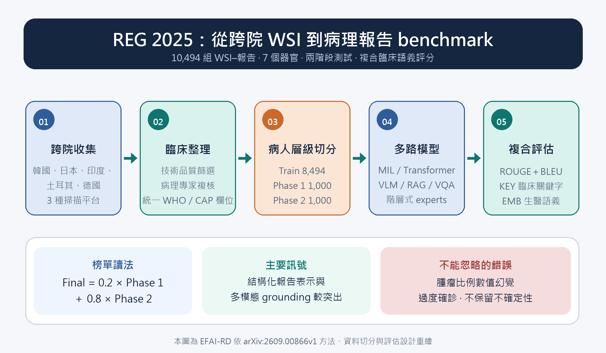

[Home](../) · [AI Papers](./)

# REG 2025：病理全切片到報告生成，榜單分數抓得到數值幻覺嗎？

## 來源

- 團隊：由 Ewha Womans University、Korea University Anam Hospital／College of Medicine 等團隊協作，作者群亦涵蓋日本 Kameda Medical Center、印度 AIIMS Delhi、土耳其 Memorial Healthcare Group、德國 University Hospital Cologne 等病理與 AI 機構；論文列有 55 位作者。[(ref: main author block)](https://arxiv.org/html/2609.00866v1)
- 論文：*Benchmarking Vision-Language Models for Automated Pathology Diagnosis and Report Generation*，v1，2026-09-01。[(ref: abstract)](https://arxiv.org/abs/2609.00866)
- 識別碼：[arXiv:2609.00866](https://arxiv.org/abs/2609.00866)；[DOI: 10.48550/arXiv.2609.00866](https://doi.org/10.48550/arXiv.2609.00866)。
- 全文：[arXiv HTML](https://arxiv.org/html/2609.00866v1)；[PDF](https://arxiv.org/pdf/2609.00866v1)。

**編輯：** Colbert

REG 2025 把 10,494 組病理全切片影像與標準化報告做成跨機構挑戰，顯示結構化生成與多模態 grounding 能提高離線分數，但腫瘤比例、分級與不確定性仍會在流暢文字裡失真。[(ref: main §2.1)](https://arxiv.org/html/2609.00866v1#S2.SS1) [(ref: main §3.2)](https://arxiv.org/html/2609.00866v1#S3.SS2)

## 流程

圖：本書庫依論文資料流程、挑戰設計與評分方式重繪。訓練集為 8,494 例，Phase 1 與 Phase 2 各 1,000 例；Phase 2 由 500 例泛亞洲資料與 500 例德國資料組成。[(ref: main Table 2)](https://arxiv.org/html/2609.00866v1#S1.T2) [(ref: main §2.2)](https://arxiv.org/html/2609.00866v1#S2.SS2)

## 背景／問題

全切片影像（whole-slide image, WSI）可達十億像素級，模型通常要先切成許多 tile 再彙整；病理報告卻不是對局部影像的逐句描述，而是把分散的形態線索整合成器官、處置、組織型態、分級與其他診斷屬性。這使 WSI 到報告同時面臨稀疏病灶、弱影像—文字對齊與一張切片可有多種合理表述的問題。[(ref: main §1)](https://arxiv.org/html/2609.00866v1#S1)

既有公開 WSI 資源多聚焦分類、分割或存活預測；TCGA 報告格式異質，HISTAI 側重表徵學習，HANCOCK 則集中於特定癌別。作者因此建立跨機構、跨器官的 WSI—報告資料，並用競賽方式比較多重實例學習（multiple-instance learning, MIL）、Transformer、視覺語言模型（vision-language model, VLM）、檢索增強生成（retrieval-augmented generation, RAG）與視覺問答（visual question answering, VQA）等路線。[(ref: main §1 dataset gap)](https://arxiv.org/html/2609.00866v1#S1.p5) [(ref: main §4)](https://arxiv.org/html/2609.00866v1#S4)

## 方法摘要

資料來自韓國、日本、印度、土耳其與德國五個機構，涵蓋乳房、膀胱、子宮頸、大腸、肺、前列腺與胃。原始報告先被轉成統一模板：至少保留器官、處置、組織型態，適用時加入分級；不直接從病理影像觀察到的臨床資訊則排除。四位病理受訓醫師先篩查，再由三位專科病理醫師複核。[(ref: main §2.1)](https://arxiv.org/html/2609.00866v1#S2.SS1)

挑戰在病人層級切分資料，避免同一病人的資料跨越訓練與測試。Phase 1 使用與訓練集相同四個亞洲醫院的 1,000 例；Phase 2 混合 500 例泛亞洲資料與 500 例德國資料，並在最終分數中給 Phase 2 八成權重。每隊每階段最多提交兩次，生成報告在統一的 Docker 環境中評分。[(ref: main §2.2)](https://arxiv.org/html/2609.00866v1#S2.SS2)

## 方法詳解

資料整理先做兩層排除：技術層面剔除組織不足、病灶過少、失焦、染色不良與其他掃描缺陷；再由專家排除診斷仍有歧義的病例。這使最終 cohort 比初始收集少 15.4%。切片統一取 20× pyramid level，移除標籤、macro 與 thumbnail；同張 WSI 有多個標本時，人工裁成各自對應診斷的區域。[(ref: main §2.1 curation)](https://arxiv.org/html/2609.00866v1#S2.SS1.p4)

評分不是只看句子像不像。Ranking Score 組合 ROUGE-L、BLEU-4、臨床關鍵字集合的 Jaccard 相似度（KEY）與生醫語言模型句向量的 cosine similarity（EMB）：`0.15 × (ROUGE + BLEU) + 0.4 × KEY + 0.3 × EMB`。作者指出，KEY 與 EMB 用來補足詞面指標無法辨認同義表述與臨床否定的問題。[(ref: main §2.3)](https://arxiv.org/html/2609.00866v1#S2.SS3)

11 個回覆方法調查的團隊大致分成六類：ABMIL 彙整 tile、Tree-of-Experts 依器官→診斷→亞型分層、跨模態 Transformer、以 BioGPT／BioBART 為語言骨幹的 VLM、以相似歷史病例輔助的 RAG，以及先逐欄回答再組裝報告的 VQA。共同差異不只在視覺 encoder，而在是否把病理報告當作有階層的臨床結構，而非一般 caption。[(ref: main Table 6)](https://arxiv.org/html/2609.00866v1#S3.T6) [(ref: main §4.2)](https://arxiv.org/html/2609.00866v1#S4.SS2)

## 資料與實驗

下表重製論文 Table 2 的資料切分。單位是 WSI–報告 pair；作者說明各 split 依器官與機構維持分布，且在病人層級隔離。[(ref: main Table 2)](https://arxiv.org/html/2609.00866v1#S1.T2)

| 器官 | Train | Phase 1 | Phase 2 |
|---|---:|---:|---:|
| Breast | 1,916 | 112 | 112 |
| Cervix | 621 | 37 | 37 |
| Colorectum | 944 | 328 | 298 |
| Lung | 898 | 50 | 50 |
| Prostate | 1,770 | 331 | 361 |
| Stomach | 1,477 | 87 | 87 |
| Bladder | 868 | 55 | 55 |
| **Total** | **8,494** | **1,000** | **1,000** |

下表完整重製論文 Table 5。Phase 1／Phase 2 欄是該階段的 Ranking Score；ROUGE、BLEU、KEY、EMB 皆為 0–1 尺度，越高越好。ICGI 與 IMAGINE Lab 是各階段領先隊伍，MI-Gen 與 HistGen 是公開 benchmark models。[(ref: main Table 5)](https://arxiv.org/html/2609.00866v1#S3.T5)

| Model | Phase 1 | ROUGE | BLEU | KEY | EMB | Phase 2 | ROUGE | BLEU | KEY | EMB |
|---|---:|---:|---:|---:|---:|---:|---:|---:|---:|---:|
| ICGI | 0.8098 | 0.8188 | 0.6372 | 0.7514 | 0.9696 | 0.8472 | 0.8564 | 0.6852 | 0.8080 | 0.9759 |
| IMAGINE Lab | 0.6258 | 0.7485 | 0.0895 | 0.5620 | 0.9177 | 0.8494 | 0.8572 | 0.6928 | 0.8094 | 0.9770 |
| MI-Gen | 0.6928 | 0.6870 | 0.4480 | 0.6003 | 0.9414 | 0.7055 | 0.6981 | 0.4562 | 0.6223 | 0.9447 |
| HistGen | 0.4576 | 0.5429 | 0.4182 | 0.3555 | 0.5708 | 0.4647 | 0.5500 | 0.4233 | 0.3664 | 0.5739 |

最終榜單以 `0.2 × Phase 1 + 0.8 × Phase 2` 計算。前三名 ICGI、ICL_PathReport、IMAGINE Lab 的 Final Score 分別為 0.8397、0.8202、0.8047；這些是複合自動指標，不是診斷準確率。[(ref: main Table 3)](https://arxiv.org/html/2609.00866v1#S2.T3) [(ref: main final-score formula)](https://arxiv.org/html/2609.00866v1#S2.Ex1)

## 結果

Phase 1 最高分是 ICGI 的 0.8098，該階段平均 0.5915；Phase 2 最高分是 IMAGINE Lab 的 0.8494，平均 0.6523。作者據 Phase 2 的歐洲 cohort 與排名大致維持，主張模型具跨區域泛化潛力；但也提醒泛亞洲與德國子集的組成與變異不同，不能把差異解讀成族群本身的難易。[(ref: main §3.1)](https://arxiv.org/html/2609.00866v1#S3.SS1)

前三名都先把報告資訊分成器官、診斷等類別：ICGI 以標籤對齊 tile 特徵，ICL_PathReport 建立階層標註樹，IMAGINE Lab 用 GPT 產生概念 prompts。論文報告這三隊在 Phase 2 的平均 ROUGE 為 0.8572、BLEU 為 0.6853；採 category-aware 方法的隊伍，從 Phase 1 到 Phase 2 平均增加 0.09 BLEU 與 0.13 KEY，而一般 tokenization 路線約增加 0.01 與 0.02。這是競賽內觀察，不能單獨證明結構化表示造成泛化提升。[(ref: main §4.1)](https://arxiv.org/html/2609.00866v1#S4.SS1)

質化案例揭露榜單不易看見的錯誤。前列腺病例的 ground truth 腫瘤量為 5%，多個模型雖抓到腺癌、Gleason score 與 grade group，卻生成 15% 到 90% 的腫瘤量；有些模型也把應保留較寬泛分類的病灶，過度指定成確定亞型。作者把這些問題分別歸為數值不穩定與未保留診斷不確定性。[(ref: main Table 4)](https://arxiv.org/html/2609.00866v1#S3.T4) [(ref: main §3.2.2)](https://arxiv.org/html/2609.00866v1#S3.SS2.SSS2)

## 限制

- **離線複合分數不是臨床正確性。** 作者自己顯示 ROUGE／BLEU 可能與關鍵診斷概念不一致；KEY 與 EMB 也仍是自動 surrogate，研究沒有前瞻性臨床使用或病人結果驗證。前半為來源結論，後半是本文依研究設計界定的外推邊界。[(ref: main §5)](https://arxiv.org/html/2609.00866v1#S5)
- **外部測試的廣度有限。** Phase 2 的 500 例歐洲資料來自單一德國中心；穩定排名支持跨域潛力，但尚不能代表不同國家、掃描器、染色流程或疾病盛行率下都穩健。[(ref: main §2.2)](https://arxiv.org/html/2609.00866v1#S2.SS2)
- **資料是經過選擇的乾淨 cohort。** 技術不良與診斷歧義病例被排除，使最終資料量減少 15.4%；真實流程恰會遇到這些邊界病例，因此部署測試需要另設拒答、重掃與人工覆核條件。來源支持前句，後句是本書庫建議。[(ref: main §2.1 curation)](https://arxiv.org/html/2609.00866v1#S2.SS1.p4)
- **方法盤點不是所有參賽隊的完整重現。** 作者向 Final Score 至少 0.6000 的前 13 隊索取程式與說明，詳析其中 11 個回覆；附錄 B 另說得獎隊原始碼供主辦方內部驗證，並未全部公開。[(ref: main §4)](https://arxiv.org/html/2609.00866v1#S4) [(ref: main Appendix B.4)](https://arxiv.org/html/2609.00866v1#A2.SS4)
- **資料授權限制使用情境。** REG2025 資料採 CC BY-NC-SA 4.0，明定非商業研究、教育與 benchmark 用途，禁止商業、重新識別與臨床使用。[(ref: main Appendix B.5)](https://arxiv.org/html/2609.00866v1#A2.SS5)

## 與書庫其他文章的關係

CONCH 提供病理圖文表徵並被多個 REG 2025 團隊用作 encoder；REG 2025 則把問題推進到跨院 WSI 的完整結構化報告生成與錯誤評估: [CONCH：病理圖文預訓練如何轉成零樣本分類，評估又有哪些邊界？](2026-09-15-conch-pathology-vlm.md)

REG 2025 顯示病理報告生成的榜單分數抓不到數值幻覺，該研究則用規則式報告與「語言模型讀不到影像」把這類幻覺的來源直接移除，代價是文字表達力: [不讓報告看見影像：乳癌病理的區域級歸因能撐起一份可稽核的報告嗎？](2026-09-23-gralis-report-histology-attribution.md)

## 實務的啟發

第一，病理報告生成的驗收表不應只列整體文字分數。本書庫建議把器官、處置、組織型態、分級、腫瘤比例、否定與不確定性拆成 slots，逐欄量測正確、漏報、過度確診與數值誤差；這延伸了作者對 ontology-aware 與 slot-level 指標的建議。[(ref: main §5 metrics)](https://arxiv.org/html/2609.00866v1#S5.p2)

第二，應把「上游 routing 錯誤」當成獨立故障模式。Tree-of-Experts 能讓輸出符合器官→診斷→亞型的結構，但一旦器官層走錯，後續 expert 可能在錯誤分支內生成看似合理的診斷；介面上需要保留每層信心與退回較寬泛分類的出口。[(ref: main §4.2.2)](https://arxiv.org/html/2609.00866v1#S4.SS2.SSS2)

第三，跨院驗證要保留 site、scanner 與資料整理步驟。這篇的 Phase 2 設計比隨機切分更接近部署問題，但實務評估仍應逐院報告分布與錯誤、測試低品質切片，並把模型拒答與病理醫師覆核所需時間列入結果；在這些證據完成前，榜單只支持研究比較，不支持自動簽發病理報告。[(ref: main §2.1–2.2)](https://arxiv.org/html/2609.00866v1#S2)

## References

- `main`：[論文 HTML](https://arxiv.org/html/2609.00866v1)；本文使用 [§1](https://arxiv.org/html/2609.00866v1#S1)、[§2.1](https://arxiv.org/html/2609.00866v1#S2.SS1)、[§2.2](https://arxiv.org/html/2609.00866v1#S2.SS2)、[§2.3](https://arxiv.org/html/2609.00866v1#S2.SS3)、[Table 2](https://arxiv.org/html/2609.00866v1#S1.T2)、[Table 3](https://arxiv.org/html/2609.00866v1#S2.T3)、[Table 4](https://arxiv.org/html/2609.00866v1#S3.T4)、[Table 5](https://arxiv.org/html/2609.00866v1#S3.T5)、[Table 6](https://arxiv.org/html/2609.00866v1#S3.T6)、[§4](https://arxiv.org/html/2609.00866v1#S4)、[§5](https://arxiv.org/html/2609.00866v1#S5) 與 [Appendix B](https://arxiv.org/html/2609.00866v1#A2)。
- `abstract`：[arXiv:2609.00866](https://arxiv.org/abs/2609.00866)。
- `doi`：[10.48550/arXiv.2609.00866](https://doi.org/10.48550/arXiv.2609.00866)。

[Home](../) · [AI Papers](./)
