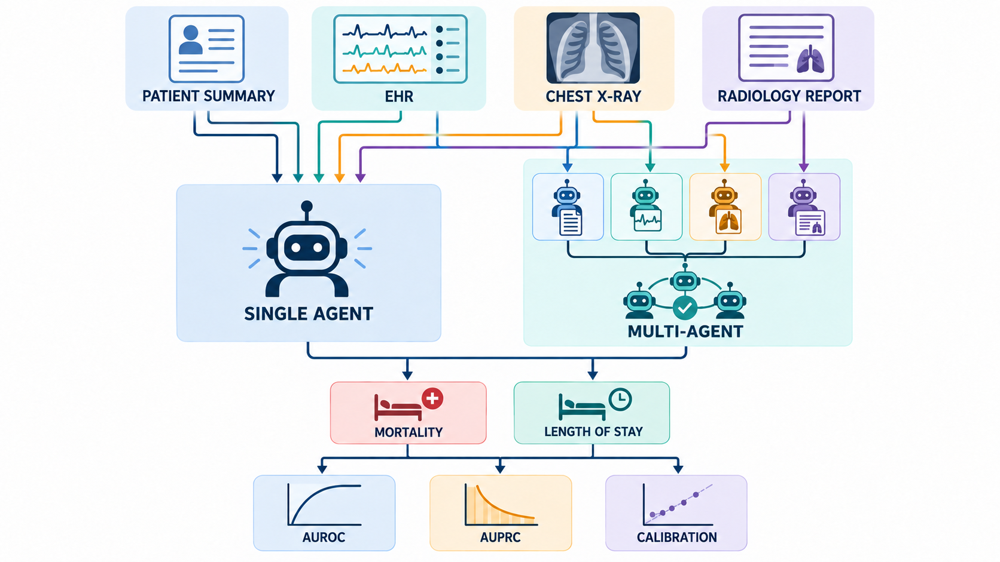

[Home](../) · [AI Papers](./)

# AgentRx：多模態 ICU 預測裡，多代理真的比單一代理好嗎？

## 來源

- **單位／團隊**：New York University Abu Dhabi。[(ref: main author block)](https://arxiv.org/html/2605.10286v1)
- **作者**：Baraa Al Jorf、Farah E. Shamout。[(ref: abstract metadata)](https://arxiv.org/abs/2605.10286)
- **完整篇名**：*AgentRx: A Benchmark Study of LLM Agents for Multimodal Clinical Prediction Tasks*。
- **年份與版本**：arXiv v1 於 2026-05-11 提交；作者註明論文獲 Conference on Health, Inference, and Learning（CHIL）2026 接受。[(ref: abstract version and comments)](https://arxiv.org/abs/2605.10286)
- **原文**：[arXiv:2605.10286](https://arxiv.org/abs/2605.10286) · [HTML 全文](https://arxiv.org/html/2605.10286v1) · [PDF](https://arxiv.org/pdf/2605.10286v1) · [DOI:10.48550/arXiv.2605.10286](https://doi.org/10.48550/arXiv.2605.10286) · [官方程式庫](https://github.com/nyuad-cai/AgentRX)。

**編輯：** Colbert

AgentRx 在同一批 MIMIC ICU 個案上比較「一個代理一次讀完四種模態」與「每種模態各自判斷、再投票或協作」，結果顯示增加模態常幫助單一代理，但樸素的多代理協作未穩定勝出，且可能犧牲機率校準；這是離線基準結果，不是臨床部署證據。[(ref: main §1)](https://arxiv.org/html/2605.10286v1#S1) [(ref: main §4)](https://arxiv.org/html/2605.10286v1#S4)

## 流程

*圖 1：Colbert 依原文 Figure 1 與 §3.2–3.3 重繪的概念圖。上方四種輸入都送往單一通才代理；多代理路徑則先由模態專責代理各自處理，再進行投票、辯論或其他協作。圖中沒有病人資料或績效數值。[(ref: main Fig. 1)](https://arxiv.org/html/2605.10286v1#S3.F1) [(ref: main §3.3)](https://arxiv.org/html/2605.10286v1#S3.SS3)*

## 背景／問題

ICU 風險預測通常同時面對結構化生命徵象、文字病史、胸腔 X 光與放射報告。專用融合模型可以直接學習這些模態的聯合表徵，但模型輸入與架構往往固定；LLM／VLM 代理雖能接受較彈性的上下文，是否真的能把異質資料融合成可靠風險機率，仍需要和監督式模型比較。[(ref: main §1)](https://arxiv.org/html/2605.10286v1#S1)

多代理還多一層假設：若資料分散在不同系統，可以讓每個代理只看一種模態，再彙整判斷。這個設計可能減少原始資料搬移，卻也可能在代理各自壓縮資訊、只交換硬標籤或互相說服時丟失跨模態關係。AgentRx 因此不只比較模型，也比較資料如何被交給代理、代理如何聚合，以及最後機率是否校準。[(ref: main §2.4)](https://arxiv.org/html/2605.10286v1#S2.SS4) [(ref: main §3.3)](https://arxiv.org/html/2605.10286v1#S3.SS3)

## 方法摘要

作者建立三層設定：只有 patient summary（PS）的單模態單一代理；把 PS、電子健康紀錄（electronic health record, EHR）、胸腔 X 光（chest X-ray, CXR）與放射報告（radiology report, RR）放進同一 context window 的多模態單一代理；以及由各模態專責代理先獨立輸出機率，再以多數決、辯論、meta-prompting、Traj-CoA、MDAgents 或 MedAgents 組合的多代理設定。[(ref: main §3.3–3.4)](https://arxiv.org/html/2605.10286v1#S3.SS3) [(ref: main §3.4)](https://arxiv.org/html/2605.10286v1#S3.SS4)

兩個主要任務都是二元預測：用入 ICU 後前 48 小時資料預測住院內死亡，以及預測住院是否超過 7 天。作者同時報告 AUROC、AUPRC 與 Expected Calibration Error（ECE）；前兩者越高越好，ECE 越低代表模型報出的機率與實際發生率更接近。[(ref: main §3.2.2)](https://arxiv.org/html/2605.10286v1#S3.SS2.SSS2)

## 方法詳解

### 1. 先把四種資料對到同一次住院

資料來自 MIMIC-IV、MIMIC-CXR 與 MIMIC-IV-Note，作者用 subject、stay 與 admission identifiers 對齊。每個樣本必須有 PS，其他模態則有就配對；因此四模態樣本數明顯少於 PS／EHR 樣本數。[(ref: main §3.2.1)](https://arxiv.org/html/2605.10286v1#S3.SS2.SSS1) [(ref: main Table 2)](https://arxiv.org/html/2605.10286v1#S3.T2)

PS 由 discharge notes 處理而來，但作者聲稱只抽取 ICU 入院前已知的病史、家族史、手術史、年齡與性別，以避免把結果資訊洩漏進輸入。EHR 包含 5 個類別變數與 12 個連續變數，觀察窗限制在前 48 小時；若時間序列超過 500 steps，只保留最前 100 與最後 400 steps。[(ref: main §3.2.3)](https://arxiv.org/html/2605.10286v1#S3.SS2.SSS3)

CXR 只取前 48 小時內的 AP view；同一病人若有多張，取最後一張。RR 則把前 48 小時內各種影像檢查的報告合併，原文特別指出來源可包含 CT、MRI 與 ultrasound，而不只對應被選中的那張 CXR。[(ref: main §3.2.3)](https://arxiv.org/html/2605.10286v1#S3.SS2.SSS3)

### 2. 單一代理：同一個 context 內做融合

多模態單一代理把可用模態依序串接到同一個 prompt，直接輸出預測機率。作者以 zero-shot、各一個正負訓練例的 few-shot、chain-of-thought（CoT）、三條推理路徑投票的 CoT self-consistency，以及 self-refinement 作為推理策略。[(ref: main §3.4.2)](https://arxiv.org/html/2605.10286v1#S3.SS4.SSS2) [(ref: Appendix A)](https://arxiv.org/html/2605.10286v1#A1)

這一路徑的優勢是模型可在同一上下文直接比較生命徵象、文字與影像訊號；代價則是 EHR 序列很長。InternVL2.5 因 context 限制無法納入 EHR，只能在 PS、CXR、RR 三模態附錄實驗中另外報告。[(ref: main §3.5.2)](https://arxiv.org/html/2605.10286v1#S3.SS5.SSS2) [(ref: Appendix B.1)](https://arxiv.org/html/2605.10286v1#A2.SS1)

### 3. 多代理：專責判斷不等於共同理解

最簡單的多代理設定讓每個模態代理獨立輸出機率，再平均後以 0.5 為門檻。其他設定包括硬標籤多數決、代理辯論、由 meta-agent 決定是否召集專家、把 EHR 切段後交由多個 worker 建立記憶再交給 multimodal judge 的 Traj-CoA，以及原為醫療問答設計的 MDAgents／MedAgents。[(ref: main §3.3–3.4.3)](https://arxiv.org/html/2605.10286v1#S3.SS3) [(ref: main §3.4.3)](https://arxiv.org/html/2605.10286v1#S3.SS4.SSS3)

這些方法交換的資訊量不同。Traj-CoA 的最後 judge 仍直接看到原始多模態資料，較接近單一代理；多數決只彙整類別或機率，辯論還可能讓代理過早同意。因此「代理數增加」與「資訊融合增加」不能視為同一件事。[(ref: main §4.2–4.3)](https://arxiv.org/html/2605.10286v1#S4.SS2) [(ref: main Table 6)](https://arxiv.org/html/2605.10286v1#S4.T6)

### 4. 比較對象與模型規模

監督式 baseline 是 PS-only BioBERT 與四模態 MedPatch。代理骨幹則包括 Qwen2.5-VL-7B-Instruct、InternVL2.5-8B-MPO、HuatuoGPT-Vision-7B-Qwen2.5VL 與 LLaVA-Med-v1.5-Mistral-7B，刻意控制在約 7–8B 參數；附錄另測 MedGemma 4B。[(ref: main §3.4.1)](https://arxiv.org/html/2605.10286v1#S3.SS4.SSS1) [(ref: main §3.5.1)](https://arxiv.org/html/2605.10286v1#S3.SS5.SSS1) [(ref: Appendix C.6)](https://arxiv.org/html/2605.10286v1#A3.SS6)

## 資料與實驗

### 資料規模：原文 Table 2

原文說明資料切成 70% training、10% validation、20% testing，但 Table 2 只列 Training 與 Test 欄。下表完整保留原文依模態與任務列出的樣本數；同一列不是獨立病人總數，也不能跨模態相加。[(ref: main §3.2.2)](https://arxiv.org/html/2605.10286v1#S3.SS2.SSS2) [(ref: main Table 2)](https://arxiv.org/html/2605.10286v1#S3.T2)

| Modality | Mortality Training | Mortality Test | Length of Stay Training | Length of Stay Test |
|---|---:|---:|---:|---:|
| PS | 17,773 | 4,925 | 17,476 | 4,845 |
| EHR | 17,773 | 4,925 | 17,476 | 4,845 |
| RR | 16,128 | 4,454 | 15,865 | 4,380 |
| CXR | 4,259 | 1,174 | 4,171 | 1,153 |

### 核心比較：原文 Table 4 的 MedPatch 與 Qwen rows

下表保留四模態設定中 MedPatch 與全部 Qwen 方法。AUROC／AUPRC 越高越好，ECE 越低越好；括號為論文報告的 95% confidence interval，ECE 未附區間。[(ref: main Table 4)](https://arxiv.org/html/2605.10286v1#S3.T4)

| Architecture / method | Mortality AUROC (95% CI) | Mortality AUPRC (95% CI) | Mortality ECE | LoS AUROC (95% CI) | LoS AUPRC (95% CI) | LoS ECE |
|---|---:|---:|---:|---:|---:|---:|
| Supervised MedPatch | 0.877 (0.864–0.888) | 0.546 (0.504–0.585) | 0.019 | 0.844 (0.830–0.857) | 0.551 (0.517–0.587) | 0.025 |
| Qwen single zero-shot | 0.756 (0.737–0.776) | 0.330 (0.297–0.368) | 0.023 | 0.714 (0.694–0.731) | 0.345 (0.320–0.373) | 0.411 |
| Qwen single few-shot | 0.763 (0.744–0.783) | 0.325 (0.292–0.361) | 0.032 | 0.682 (0.662–0.699) | 0.318 (0.294–0.346) | 0.479 |
| Qwen single CoT | 0.733 (0.713–0.752) | 0.274 (0.244–0.308) | 0.049 | 0.683 (0.663–0.702) | 0.311 (0.288–0.336) | 0.676 |
| Qwen single CoT-SC | 0.762 (0.742–0.782) | 0.337 (0.300–0.379) | 0.039 | 0.698 (0.678–0.715) | 0.340 (0.313–0.370) | 0.661 |
| Qwen multi majority vote | 0.748 (0.727–0.768) | 0.315 (0.282–0.355) | 0.111 | 0.710 (0.690–0.728) | 0.352 (0.324–0.383) | 0.046 |
| Qwen multi debate | 0.631 (0.607–0.656) | 0.210 (0.185–0.243) | 0.091 | 0.644 (0.623–0.664) | 0.281 (0.259–0.307) | 0.121 |
| Qwen multi meta-prompt | 0.599 (0.573–0.625) | 0.179 (0.160–0.204) | 0.051 | 0.537 (0.514–0.558) | 0.226 (0.208–0.249) | 0.086 |
| Qwen multi Traj-CoA | 0.762 (0.743–0.780) | 0.318 (0.283–0.355) | 0.039 | 0.708 (0.688–0.726) | 0.336 (0.310–0.365) | 0.190 |
| Qwen multi MDAgents | 0.624 (0.601–0.647) | 0.192 (0.169–0.221) | 0.110 | 0.584 (0.563–0.603) | 0.240 (0.222–0.262) | 0.138 |
| Qwen multi MedAgents | 0.662 (0.641–0.686) | 0.206 (0.185–0.235) | 0.034 | 0.634 (0.613–0.654) | 0.285 (0.261–0.310) | 0.019 |

### 模態增加與校準：原文 Table 5 的 Qwen rows

這組消融固定在住院內死亡任務，直接比較同一 Qwen 骨幹隨模態增加的變化。[(ref: main Table 5)](https://arxiv.org/html/2605.10286v1#S4.T5)

| Architecture | Modalities | AUROC (95% CI) | AUPRC (95% CI) | ECE |
|---|---|---:|---:|---:|
| Single zero-shot | PS | 0.667 (0.645–0.690) | 0.234 (0.208–0.267) | 0.025 |
| Single zero-shot | PS + CXR | 0.671 (0.649–0.695) | 0.236 (0.209–0.267) | 0.027 |
| Single zero-shot | PS + CXR + RR | 0.732 (0.712–0.753) | 0.273 (0.244–0.305) | 0.027 |
| Single zero-shot | PS + EHR + CXR + RR | 0.756 (0.737–0.776) | 0.330 (0.297–0.368) | 0.023 |
| Multi majority vote | PS + CXR | 0.666 (0.643–0.689) | 0.221 (0.197–0.252) | 0.068 |
| Multi majority vote | PS + CXR + RR | 0.725 (0.704–0.745) | 0.266 (0.237–0.301) | 0.089 |
| Multi majority vote | PS + EHR + CXR + RR | 0.748 (0.727–0.768) | 0.315 (0.282–0.355) | 0.111 |

## 結果

- **監督式融合仍是主要上限。** MedPatch 在死亡與 LoS 的 AUROC 分別為 0.877、0.844；Qwen 最佳對應值為死亡 few-shot 0.763、LoS zero-shot 0.714。這個差距支持專用融合網路在本資料設定中較強，不能解讀成所有 LLM 代理都不適合預測。[(ref: main Table 4)](https://arxiv.org/html/2605.10286v1#S3.T4)
- **把四模態放進同一代理，通常比只看 PS 更有辨識力。** Qwen zero-shot 死亡 AUROC 從 0.667 升到 0.756，AUPRC 從 0.234 升到 0.330；LoS AUROC 則從 0.603 升到 0.714。[(ref: main Table 3)](https://arxiv.org/html/2605.10286v1#S3.T3) [(ref: main Table 4)](https://arxiv.org/html/2605.10286v1#S3.T4)
- **多代理不是每一格都較差，但樸素協作沒有穩定優勢。** Qwen Traj-CoA 的死亡 AUROC 0.762 接近 single few-shot 0.763，LoS majority vote 的 AUPRC 0.352 也高於 single zero-shot 0.345；然而 debate、meta-prompt、MDAgents 與 MedAgents 多數指標落後，顯示結論應是「協作設計不可靠」，不是「多代理必然較差」。[(ref: main Table 4)](https://arxiv.org/html/2605.10286v1#S3.T4)
- **校準揭露了分類分數看不到的代價。** Qwen 單一 zero-shot 在四模態死亡預測的 ECE 為 0.023，多數決則為 0.111；而多數決在加入模態時 ECE 從 0.068 升至 0.111。代理投票可以增加 AUROC，卻同時讓風險機率更過度自信。[(ref: main Table 5)](https://arxiv.org/html/2605.10286v1#S4.T5)
- **辯論常變成過早同意或無法收斂。** Qwen 在 4,925 個樣本全都於第一輪達成共識，死亡 AUROC 為 0.631；LLaVA-Med 有 52.6% 樣本到最大輪數仍未共識，AUROC 為 0.495。附錄的 trace analysis 也把 Qwen 描述為 premature agreement。[(ref: main Table 6)](https://arxiv.org/html/2605.10286v1#S4.T6) [(ref: Appendix Table C3)](https://arxiv.org/html/2605.10286v1#A3.T3)

## 限制

- 全部主要資料來自 Beth Israel Deaconess Medical Center 的 MIMIC 單中心回溯 cohort；論文沒有外部醫院驗證、前瞻部署、臨床使用者研究或病人結果評估。[(ref: main §3.2.1)](https://arxiv.org/html/2605.10286v1#S3.SS2.SSS1) [(ref: main §5)](https://arxiv.org/html/2605.10286v1#S5)
- PS 是從 discharge notes 衍生，再由作者規則抽取入 ICU 前資訊。原文說此舉避免 leakage，但沒有提供獨立 chart review 來證明所有結果後資訊都被排除；重現時應把欄位白名單與洩漏稽核列為必要步驟。[(ref: main §3.2.3)](https://arxiv.org/html/2605.10286v1#S3.SS2.SSS3)
- 超過 500 steps 的 EHR 只保留最前 100 與最後 400，會捨棄中段事件；不同 serialization 的附錄消融只報單一 Qwen 結果，尚不足以確認所有病程型態都能安全壓縮。[(ref: main §3.2.3)](https://arxiv.org/html/2605.10286v1#S3.SS2.SSS3) [(ref: Appendix C.7)](https://arxiv.org/html/2605.10286v1#A3.SS7)
- 評估只涵蓋兩個 ICU 二元 endpoint 與約 7–8B 模型；沒有年齡、性別、族群或照護單位的 subgroup performance，也沒有 false-negative 嚴重度與 decision-curve utility。[(ref: main §3.2.2)](https://arxiv.org/html/2605.10286v1#S3.SS2.SSS2) [(ref: main §5)](https://arxiv.org/html/2605.10286v1#S5)
- RR 聚合可含 CT、MRI、ultrasound 等檢查報告，但影像輸入只放一張最新 AP CXR；這使「四模態融合」同時包含不完全對應的影像—報告資訊，不能把增益全歸因於胸片理解。[(ref: main §3.2.3)](https://arxiv.org/html/2605.10286v1#S3.SS2.SSS3)
- 附錄至少有兩組內部不可能的信賴區間：Table B1 的 Intern CoT-SC mortality AUPRC 點估計 0.270，區間卻列 0.707–0.748；Table C6 的 MedGemma few-shot mortality AUROC 點估計 0.691，區間卻列 0.207–0.714。本文不使用這兩格支撐結論，也不自行更正原值。[(ref: Appendix Table B1)](https://arxiv.org/html/2605.10286v1#A2.T1) [(ref: Appendix Table C6)](https://arxiv.org/html/2605.10286v1#A3.T6)
- 程式庫公開了資料準備、推論與評估入口，但 MIMIC 原始資料需依 PhysioNet 規範取得；本文也未見外部團隊在相同版本與硬體設定下重現全部主表。[(ref: data and code availability)](https://arxiv.org/html/2605.10286v1) [(ref: official code)](https://github.com/nyuad-cai/AgentRX)

## 與書庫其他文章的關係

一句話敘述關係: [LLM 多代理系統：從 ReAct 到可對話協作](../ai-basics/multi-agent-llm.md) 提供角色分工、通訊與驗收的通用框架；AgentRx 則用 ICU 多模態預測顯示，若代理只交換壓縮後判斷，增加角色與對話不會自動改善辨識或校準。

一句話敘述關係: [醫療 LLM 評估落差：研究更嚴謹，為何證據反而更舊？](2026-09-17-medical-llm-evaluation-gap.md) 把 AgentRx 這類 retrospective agent benchmark 放回整體證據版圖，顯示 agentic／multi-agent 醫療文獻成長很快，但 prospective／controlled evidence 的相對供給仍低。

## 實務的啟發

1. **先比較同資料、同模型的單一代理 baseline。** 多代理若沒有在同一骨幹、同一模態與同一 test split 上勝過 single-agent，就不應以「可協作」取代實際增益。
2. **把校準列為一級驗收指標。** AUROC 上升不代表 0.8 就真的等於 80% 風險；需要同時報 ECE、reliability diagram、Brier score 與部署場域的再校準結果。
3. **明確定義代理交換的是什麼。** 硬標籤、機率、文字理由、原始資料或 latent representation 的資訊量不同；系統設計文件應標出每一步可能的資訊損失與隱私邊界。
4. **對 EHR 壓縮做時間窗敏感度測試。** 不只比較 token 數，還要測最前／最後／事件導向摘要是否漏掉中段惡化，並對不同住院長度與採樣密度分層。
5. **在重現清單加入 leakage 與 source consistency。** discharge-note 衍生特徵、跨模態時間對齊、病人層級切分與原文 CI 異常都應先稽核，再決定哪些數值可以進入臨床風險討論。

## References

- **main** — Baraa Al Jorf、Farah E. Shamout。*AgentRx: A Benchmark Study of LLM Agents for Multimodal Clinical Prediction Tasks*. arXiv:2605.10286v1 (2026)，CHIL 2026。[全文](https://arxiv.org/html/2605.10286v1) · [PDF](https://arxiv.org/pdf/2605.10286v1) · [書目與版本](https://arxiv.org/abs/2605.10286) · [DOI](https://doi.org/10.48550/arXiv.2605.10286)。
  - 方法與資料：[§3.2](https://arxiv.org/html/2605.10286v1#S3.SS2) · [§3.3](https://arxiv.org/html/2605.10286v1#S3.SS3) · [§3.4](https://arxiv.org/html/2605.10286v1#S3.SS4) · [Figure 1](https://arxiv.org/html/2605.10286v1#S3.F1) · [Table 2](https://arxiv.org/html/2605.10286v1#S3.T2)。
  - 結果與消融：[Table 3](https://arxiv.org/html/2605.10286v1#S3.T3) · [Table 4](https://arxiv.org/html/2605.10286v1#S3.T4) · [Table 5](https://arxiv.org/html/2605.10286v1#S4.T5) · [Table 6](https://arxiv.org/html/2605.10286v1#S4.T6) · [§5](https://arxiv.org/html/2605.10286v1#S5) · [Appendix C](https://arxiv.org/html/2605.10286v1#A3)。
- **code** — 作者官方程式庫：[nyuad-cai/AgentRX](https://github.com/nyuad-cai/AgentRX)，含 MIMIC 資料準備、代理架構、推論與評估程式入口。

[Home](../) · [AI Papers](./)
