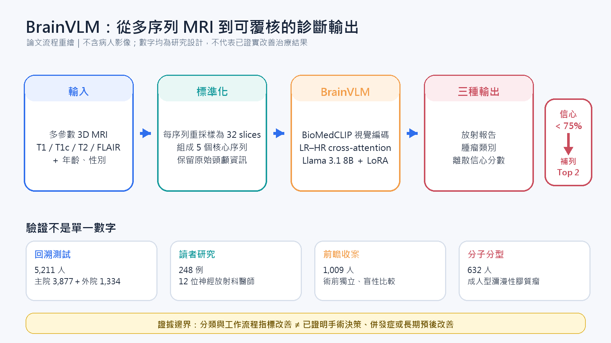

[Home](../) · [AI Papers](./)

# BrainVLM：從多序列 MRI 到前瞻收案，信心分數能讓腦瘤診斷更可靠嗎？

## 來源

- 團隊：Yinong Wang、Jianwen Chen、Zhou Chen、Shuwen Kuang、Haoning Jiang、Yanzhao Shi、Huichun Yuan、Yan-ran (Joyce) Wang、Bing Wang、Lei Wu、Bin Tang、Li Meng、Baihua Luo、Bin Zhou、Wei Ding、Weiming Zhong、Wei Hou、Yuanbing Chen、Zhiping Wan、Wei Wang、Zhenkun Xiao、Wenwu Wan、Allen He、Yuyin Zhou、Longbo Zhang、Feifei Wang、Zhixiong Liu、Michael Iv、Xuan Gong、Liangqiong Qu；主要單位涵蓋香港大學、中南大學湘雅醫院與多家合作醫院、史丹佛大學及加州大學聖塔克魯茲分校，完整 24 個 affiliation 見原文首頁。[(ref: paper p.1)](https://arxiv.org/pdf/2609.16597v1#page=1)
- 完整篇名：*A Vision-Language Foundation Model for Precise and Comprehensive Brain Tumor Diagnosis from Preoperative Multimodal Data*。
- 版本：arXiv:2609.16597v1，2026-09-15 提交；[canonical abstract](https://arxiv.org/abs/2609.16597)、[官方 PDF](https://arxiv.org/pdf/2609.16597v1)、[DOI](https://doi.org/10.48550/arXiv.2609.16597)。arXiv HTML 轉換不可用，本文頁碼皆指向 94 頁官方 PDF。
- 程式與權重：[HKU-HealthAI/BrainVLM](https://github.com/HKU-HealthAI/BrainVLM)。目前 repository 提供診斷／報告生成的評估程式與 checkpoint，但 reliable model 的程式仍標示為 coming soon。[(ref: official code README)](https://github.com/HKU-HealthAI/BrainVLM#prepare-model-weights)

**編輯：** Colbert

BrainVLM 的價值不只在 12 類腦腫瘤分類，而在於把多參數 3D MRI、報告生成、離散信心分數、跨院回溯驗證、讀者研究與前瞻收案串成同一條證據鏈；但這條鏈仍停在診斷與工作流程指標，尚未證明治療或長期預後改善。

## 流程

*圖：本書庫依論文方法重繪。每個 MRI 序列先重採樣為 32 slices，再組成五個核心序列輸入；模型一次產生報告、腫瘤類別與信心分數，研究設定在 Top-1 信心低於 75% 時補列 Top-2。圖中不含病人影像或論文原圖。[(ref: appendix pp.10–21)](https://arxiv.org/pdf/2609.16597v1#page=31)*

## 背景／問題

世界衛生組織 2021 年中樞神經系統腫瘤分類（WHO CNS5）把腦腫瘤分成 12 個主要類別、逾百個亞型；術前判讀通常要同時查看 T1、對比增強 T1（T1c）、T2 與 T2-FLAIR 等多參數磁振造影（MRI），而不同腫瘤的影像表現可能重疊。論文因此把問題定義成：模型能否在不先做 skull stripping 或腫瘤分割的情況下，直接讀取異質的 3D MRI，輸出分類、放射報告與可供覆核的信心分數。[(ref: paper pp.3–5)](https://arxiv.org/pdf/2609.16597v1#page=3)

這和一般「單張影像問答」不同。單一病例可能包含不同切面、序列與層厚；模型既要保留小病灶與腫瘤邊界，又不能把數百張切片全部當成長序列送入語言模型。更重要的是，高分辨率分類分數不等於臨床可用：錯誤預測若仍給出高信心，或生成報告只是重述訓練標籤，就可能讓人誤判證據強度。

## 方法摘要

BrainVLM 以 BioMedCLIP 的視覺 Transformer 為起點，同時建立低解析全局表示與四個高解析區塊，再用 LR–HR cross-attention 把細節注入全局 token；投影器把視覺表示送入 Llama 3.1 8B Instruct，語言骨幹以 LoRA 微調。影像 token 使用 full attention，文字序列維持 causal attention。[(ref: appendix pp.8–10)](https://arxiv.org/pdf/2609.16597v1#page=29)

輸入端把每個 3D MRI 序列以 cubic-spline interpolation 重採樣為 32 slices。標準組合包含同切面的 T1／T1c、T2、T2-FLAIR，以及另一切面的 T1c；如果序列缺失，就從可用序列與切面組合替代。多個有效組合各自推論後，以多數決定 Top-1 類別，並聚合相同類別的信心與結構化報告段落。[(ref: appendix pp.10–20)](https://arxiv.org/pdf/2609.16597v1#page=31)

模型的「可靠性」不是從單次 softmax 直接讀出。作者從接近收斂的多個 checkpoint 取得診斷共識與錯誤比例，製作 reliability supervision，再微調投影器、cross-attention 與 LoRA 參數；輸出的信心只落在 50%、60%、70%、80%、90%、95% 六個離散層級。[(ref: appendix pp.16–18)](https://arxiv.org/pdf/2609.16597v1#page=37)

## 方法詳解

### 三階段訓練

1. 第一階段做 2D MRI slice–text 表徵學習。來源包含公開切片、從 3D volume 擷取的腫瘤切片，以及由 RAG／GPT-4o 整理的文字描述；論文報告最後形成 10,996,702 組 slice–text pairs。[(ref: appendix pp.13–14)](https://arxiv.org/pdf/2609.16597v1#page=34)
2. 第二階段以 30% 的 2D 任務與 70% 的 3D 任務交錯訓練，讓模型從切片表徵轉向體積脈絡。
3. 第三階段只用較高品質的 3D 資料做 volumetric instruction tuning；視覺骨幹與語言骨幹主體保持凍結，更新投影器、LR–HR cross-attention 與 LoRA。

### 資料文字並非全都由臨床醫師原寫

BrainTumor48K 的 23,231 個 3D MRI cases 中，18,113 個有報告與病理標籤；其中 13,762 個報告來自機構或專業公開來源，另 4,351 個是由 LLM 將既有腫瘤類型、位置與訊號等 metadata 轉成結構化報告。作者強調沒有加入新臨床資訊，但這仍代表部分文字 supervision 是「標籤／metadata 的語言化」，不能和獨立臨床報告視為相同證據。[(ref: appendix pp.2–6)](https://arxiv.org/pdf/2609.16597v1#page=23)

機構中文報告則先移除非核心序列內容，再以臨床詞彙表、RAG 與多個 LLM 交叉修訂翻成英文，最後由神經放射科醫師覆核。抽樣 200 份中，195 份被五位讀者一致評為 Level 5，5 份至少有一個 Level 4；這支持翻譯品質，但仍是報告轉換抽樣，不是對所有訓練文字逐筆查核。[(ref: appendix pp.4–5)](https://arxiv.org/pdf/2609.16597v1#page=25)

### 報告、分類與信心一次生成

模型用 `<Report>`、`<Diagnosis>`、`<Uncertainty>` 三組分隔 token 依序生成自由文字報告、類別 token 與數值 token。類別端實際使用 14 個 token：11 個 WHO CNS5 主要類別，加上把 GGN 拆成 glioma、glioneuronal tumor、ependymal tumor 三個亞類；對外主要結果仍彙整成 12 大類。[(ref: appendix pp.12–15)](https://arxiv.org/pdf/2609.16597v1#page=33)

## 資料與實驗

### Data

| 資料／研究 | 人數或病例數 | 用途 | 重要邊界 |
|---|---:|---|---|
| BrainTumor48K | 47,947 人 | 39 個公開來源＋12 家醫療機構的開發資料 | 公開 web figure 的 subject 數以「每張 composite figure 一人」估算，且部分資料沒有 patient ID |
| 回溯測試 | 5,211 人 | 主院 3,877；11 家外院 1,334 | 全為病理確認腦腫瘤；不是一般疑似腦病灶篩檢族群 |
| 前瞻收案 | 1,009 人 | 手術組 886；非手術組 123 | 術前獨立、盲性比較診斷；未隨機分派，也未評估治療結果 |
| 多讀者 crossover study | 248 例 | 12 位神經放射科醫師，無 AI／有 AI 間隔一個月 | 只提供 MRI、年齡、性別，未提供完整臨床史 |
| 成人型瀰漫性膠質瘤分型 | 632 人 | 主院三折驗證 494；外部驗證 138 | 另行微調的分子亞型任務 |

資料規模與切分來自主文 Methods、Table 1 與 Supplementary Tables 1–4。[(ref: paper pp.5–6 and Table 1)](https://arxiv.org/pdf/2609.16597v1#page=5) 前瞻流程最初收案 1,511 人，經 MRI／病史完整性與非腫瘤病理等排除後留下 1,009 人；手術組以病理為 gold standard，非手術組以多專科出院共識診斷為參考。[(ref: paper Fig.2)](https://arxiv.org/pdf/2609.16597v1#page=19)

### Experiments：回溯分類

| 測試集 | n | BrainVLM macro-AUC (95% CI) | BrainVLM weighted F1 (95% CI) | 神經放射科醫師 F1 | RadFM / Merlin / VST / GPT-4o F1 |
|---|---:|---:|---:|---:|---:|
| 主院 | 3,877 | 0.85 (0.84–0.86) | 0.82 (0.81–0.83) | 0.80 (0.79–0.81) | 0.62 / 0.54 / 0.59 / 0.37 |
| 11 家外院 | 1,334 | 0.80 (0.79–0.82) | 0.75 (0.73–0.78) | 0.71 | 0.43 / 0.52 / 0.42 / 0.30 |

表中 F1 按論文主文與 Supplementary Table 11 重排；各 baseline 都在 BrainTumor48K 上微調，但 GPT-4o 是由臨床人員先挑出代表性 2D slices 的 zero-shot 比較，不能把模型間差距解讀成純架構效果。[(ref: paper Results pp.7–8)](https://arxiv.org/pdf/2609.16597v1#page=7) [(ref: appendix Table 11)](https://arxiv.org/pdf/2609.16597v1#page=77)

### Experiments：248 例多讀者研究

| 讀者／系統 | Frequency-weighted F1 (95% CI) | 平均判讀時間（秒，mean ± SD） |
|---|---:|---:|
| BrainVLM 單獨 | 0.78 (0.73–0.83) | 51 ± 3 |
| Junior | 0.52 (0.48–0.55) | 189 ± 41 |
| Junior + AI | 0.67 (0.63–0.71) | 112 ± 13 |
| Senior | 0.55 (0.51–0.58) | 161 ± 43 |
| Senior + AI | 0.74 (0.70–0.77) | 104 ± 21 |
| Expert | 0.78 (0.74–0.82) | 100 ± 5 |
| Expert + AI | 0.85 (0.81–0.89) | 75 ± 15 |

數值完整抄自主文 Table 2。[(ref: paper Table 2)](https://arxiv.org/pdf/2609.16597v1#page=17) 該表另列 accuracy，但 Senior + AI 的 point estimate 0.75 與標示的 95% CI 0.76–0.87 不相容；本文不擅自修正，因此不搬錄該列。

## 結果

回溯測試中，BrainVLM 從主院到外院的 weighted F1 由 0.82 降至 0.75，顯示跨院泛化仍有落差；外院仍高於作者建立的 RadFM、Merlin、VST 與 GPT-4o baselines。低盛行率類別並非都穩定：外院 melanocytic tumor 僅 5 人、pineal region tumor 與 choroid plexus tumor 各 6 人，單類 F1 很容易受少數個案影響。[(ref: paper Table 1)](https://arxiv.org/pdf/2609.16597v1#page=16)

前瞻研究的四個小組都由作者報告 BrainVLM F1 高於醫師：主院／外院手術組為 0.78 vs 0.75、0.80 vs 0.77，主院／外院非手術組為 0.85 vs 0.79、0.75 vs 0.72。這是有價值的時間順序驗證，但仍是同一收案內的獨立比較，不是把病人隨機分成 AI 與非 AI 照護路徑。[(ref: paper Fig.3a)](https://arxiv.org/pdf/2609.16597v1#page=20)

在 248 例讀者研究中，加入 AI 後三個資歷層級的 F1 都提高、判讀時間都下降；作者彙整為 mean F1 相對增加 27.6%（absolute +0.16）與時間相對減少 34.7%（absolute −55.8 秒），兩者皆 p<0.0001。當 BrainVLM 本身判錯時，論文主文寫 52/248 例、附錄分析則寫 57 例，兩處樣本數不一致；附錄報告整體判讀 accuracy 從 50.0% 到 50.9%，但 junior 約下降 6%，因此不能只看全體平均就排除 automation bias。[(ref: paper pp.9–10)](https://arxiv.org/pdf/2609.16597v1#page=9) [(ref: appendix pp.34–35)](https://arxiv.org/pdf/2609.16597v1#page=55)

信心校準方面，5,211 個回溯病例中，正確診斷有 72% 落在 >90% 信心，錯誤診斷有 70% 落在 50–85%；作者報告 expected calibration error（ECE）0.036、Brier score 0.1448。Top-1 信心低於 75% 時補列 Top-2，使主院 F1 由 0.82 升到 0.86、外院由 0.75 升到 0.78。這表示離散信心可用來排序疑難程度，但不是保證：附錄仍展示 80% 與 90% 信心的錯誤個案。[(ref: paper p.8)](https://arxiv.org/pdf/2609.16597v1#page=8) [(ref: appendix Fig.15)](https://arxiv.org/pdf/2609.16597v1#page=91)

報告生成在主院／外院的 RaTEScore 為 0.75／0.69、F1RadGraph-XL 為 0.57／0.52；另以 100 個主院病例做盲性專家評分，三位神經放射科醫師給 BrainVLM 的平均分數為 4.77、4.73、4.83（0–5 分）。這證明生成內容較接近參考報告，尚不能證明它能安全取代正式臨床報告。[(ref: paper pp.8–9)](https://arxiv.org/pdf/2609.16597v1#page=8) [(ref: appendix pp.27–28)](https://arxiv.org/pdf/2609.16597v1#page=48)

## 限制

- 真實世界回溯與前瞻應用主要來自中國醫院；作者另測三個歐美公開資料集，但那是單一腫瘤類別的外部測試，不能替代跨族群、跨醫療流程的前瞻驗證。[(ref: paper Limitations pp.11–12)](https://arxiv.org/pdf/2609.16597v1#page=11)
- 多讀者研究刻意只給 MRI、年齡與性別，以匹配模型輸入；臨床醫師平常可取得病史、神經學檢查與檢驗，因此比較可能低估真實世界的人類表現。
- 39 個公開來源存在重複個案或同一患者跨資料集出現的殘餘風險；去識別後無法跨中心直接 patient matching。web-crawled composite figures 的人數也是估算值。[(ref: appendix p.7)](https://arxiv.org/pdf/2609.16597v1#page=28)
- 訓練 supervision 混合專業報告、翻譯報告與 4,351 份 metadata-derived reports；模型可能學到標籤語言化或資料來源捷徑。研究沒有提供獨立的 leakage audit。
- confidence supervision 來自同一模型不同 checkpoint 的共識，且輸出只有六個離散值；ECE／Brier score 是回溯測試的整體校準，不能保證新醫院、罕見腫瘤或 protocol shift 下仍可靠。
- baseline 並非完全同條件：RadFM／Merlin 讀完整 3D volume，GPT-4o 則由醫師先挑 lesion-containing 2D slices；這些比較適合看「實作方案」而非推論單一架構優越性。[(ref: appendix pp.21–23)](https://arxiv.org/pdf/2609.16597v1#page=42)
- 模型適用範圍是「已知有腦腫瘤後的類型鑑別」，不是先從所有腦病灶篩出腫瘤；研究也未驗證後續治療決策、切除範圍、併發症或長期預後。[(ref: appendix regulatory notes p.37)](https://arxiv.org/pdf/2609.16597v1#page=58)
- 可重現性仍未完整：官方 repository 雖有評估程式與診斷／報告 checkpoint，reliable model code 仍未釋出，機構訓練資料也受隱私限制。

## 與書庫其他文章的關係

MedGemma 1.5 展示通用醫療 VLM 處理 3D volume 的廣度，BrainVLM 則把多序列腦部 MRI 收斂成專科分類、報告、信心校準與讀者研究，可用來比較通用模型與專科工作流程證據的差異: [MedGemma 1.5：4B 模型如何讀取 3D 影像、全切片與縱向胸片？](2026-09-16-medgemma-1-5.md)

## 實務的啟發

若要把 BrainVLM 類系統帶進醫院，最值得複製的不是單一 F1，而是分層驗證：先把主院、外院、前瞻、讀者研究、低信心病例與 AI 錯誤病例分開報告，再看不同層級的人類讀者如何使用輸出。這比只拿模型對模型排行榜更接近真正的 intended use（預定用途）。

信心分數也應被設計成工作流程控制，而不是「安全章」。可操作的做法是預先定義轉介門檻、保存 Top-1／Top-2 與人工覆核軌跡、按腫瘤類別與院區監測校準漂移，並特別稽核高信心錯誤；只有低信心轉人工，無法處理 80–90% 信心仍判錯的病例。

最後，報告生成與分類標籤要分開驗證。文字相似度與專家一致性可以支持「報告較像參考」，但不能代替影像證據完整性、關鍵陰性所見、後續處置是否正確等終點。臨床上應把生成報告保留為可編輯草稿，並要求讀者能回到原始 MRI 與每個判斷的影像依據。

## References

- **paper** — Wang Y, Chen J, Chen Z, et al. *A Vision-Language Foundation Model for Precise and Comprehensive Brain Tumor Diagnosis from Preoperative Multimodal Data*. arXiv:2609.16597v1. [Abstract](https://arxiv.org/abs/2609.16597) · [PDF](https://arxiv.org/pdf/2609.16597v1) · [DOI](https://doi.org/10.48550/arXiv.2609.16597).
- **paper locators used** — [pp.1–6：作者、資料與研究設計](https://arxiv.org/pdf/2609.16597v1#page=1) · [pp.7–12：主要結果、討論與限制](https://arxiv.org/pdf/2609.16597v1#page=7) · [Table 1](https://arxiv.org/pdf/2609.16597v1#page=16) · [Table 2](https://arxiv.org/pdf/2609.16597v1#page=17) · [Figures 1–4](https://arxiv.org/pdf/2609.16597v1#page=18) · [Appendix pp.2–24：資料與模型](https://arxiv.org/pdf/2609.16597v1#page=23) · [Appendix pp.25–37：分析、失敗模式、可用性](https://arxiv.org/pdf/2609.16597v1#page=46) · [Supplementary Tables](https://arxiv.org/pdf/2609.16597v1#page=67) · [Supplementary Figures](https://arxiv.org/pdf/2609.16597v1#page=79).
- **official code** — HKU HealthAI. [BrainVLM repository](https://github.com/HKU-HealthAI/BrainVLM).
- **study record** — [ClinicalTrials.gov NCT07126821](https://clinicaltrials.gov/study/NCT07126821).

[Home](../) · [AI Papers](./)
