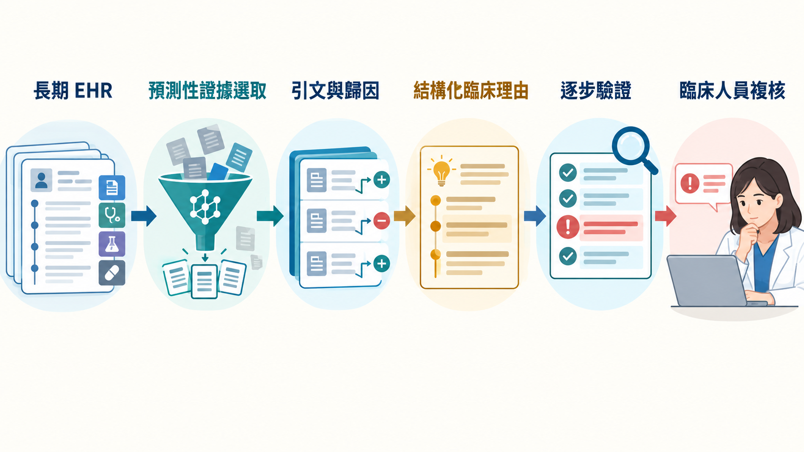

[Home](../) · [AI Papers](./)

# EviGen：從長期病歷挑證據、寫理由，再逐步驗證，能讓臨床 LLM 更可稽核嗎？

## 來源

- 團隊：Duke University；作者為 Fengnan Li、Heman Burre、Liwen Sun、Roshni Varma 與 Matthew M. Engelhard。[(ref: main author block)](https://arxiv.org/html/2609.18852v1)
- 論文：*EviGen: Predictive Evidence Scaffolding for Verifiable Clinical Rationale Generation*，arXiv v1，2026-09-16；作者註明已接受 Findings of EMNLP 2026。[(ref: abstract)](https://arxiv.org/abs/2609.18852)
- 識別碼：[arXiv:2609.18852](https://arxiv.org/abs/2609.18852)。
- 全文：[arXiv HTML](https://arxiv.org/html/2609.18852v1)；[PDF](https://arxiv.org/pdf/2609.18852v1)；程式碼：[engelhard-lab/EviGen](https://github.com/engelhard-lab/EviGen)。

**編輯：** Colbert

EviGen 把長期電子健康紀錄（electronic health record, EHR）的預測、證據選取、理由生成與逐步驗證串成一條管線，重點不是讓大型語言模型（large language model, LLM）讀得更多，而是先縮成可追溯的預測性證據，再讓臨床人員看得到每一步可能出錯的位置。[(ref: main §1)](https://arxiv.org/html/2609.18852v1#S1)

## 流程

圖：本書庫依論文方法重繪。流程由病歷筆記與 ICD 診斷碼出發，經病人條件化的查詢選取證據、建立含來源 ID 與歸因分數的 evidence pack，再生成有引文的結構化理由；驗證器標記可疑推理步驟，最後仍由臨床人員判讀。圖示呈現可稽核介面，不代表自動診斷或臨床安全已獲驗證。[(ref: main Figure 2)](https://arxiv.org/html/2609.18852v1#S3.F2) [(ref: main ethics)](https://arxiv.org/html/2609.18852v1#Sx2)

## 背景／問題

長期 EHR 可能跨越多年，包含筆記、診斷碼、檢驗與處置。把整份病歷直接塞進 LLM，不只推論成本隨長度增加，重要訊號也可能被埋在大量內容裡；一般 retrieval-augmented generation（RAG）又多以文字相似度找片段，未必能抓到與預測結果真正相關、但表面措辭不相似的證據。[(ref: main §1)](https://arxiv.org/html/2609.18852v1#S1)

即使模型產生流暢理由，也可能加入病歷沒有的診斷、事件或建議。EviGen 因此把「預測性證據」與「文字相關證據」分開：先用 outcome label 訓練查詢向量，找出對目標預測有貢獻的片段；生成器只能依這些片段寫理由；驗證器再逐步檢查理由是否超出引文。[(ref: main §2)](https://arxiv.org/html/2609.18852v1#S2) [(ref: main §3)](https://arxiv.org/html/2609.18852v1#S3)

## 方法摘要

EviGen 有三層。Evidence Selection Layer 對病歷筆記與 ICD code description 各自建立可學習查詢；病人條件化的 dynamic gate 只啟用與該病人相關的查詢，每個啟用查詢以 cosine similarity 取回 top-K 片段，經 attention pooling 與 query-specific expert 組成病人表示，輸出風險機率與證據排序。推論時再以 Integrated Gradients 為每個片段計算帶正負號的歸因分數。[(ref: main §3.2)](https://arxiv.org/html/2609.18852v1#S3.SS2)

Rationale Generation Layer 接收風險機率與 evidence pack。每個 factor 固定包含摘要、逐字引文與 citation ID、只針對引文的推理，以及 attribution score；最後另有 reasoning lens 綜合各 factor。作者還用字串比對檢查逐字引文是否真的出現在對應病歷片段中。[(ref: main §3.3)](https://arxiv.org/html/2609.18852v1#S3.SS3)

Process Verification Layer 以 QLoRA 微調 Llama-3.1-8B-Instruct，對每個推理步驟判斷是否正確，或屬於 hallucination、factual inaccuracy、unhelpfulness、attribution distortion、provenance break 等錯誤；經 Platt scaling 校準後，低於門檻的步驟會連同錯誤類型一起標記。[(ref: main §3.4)](https://arxiv.org/html/2609.18852v1#S3.SS4) [(ref: main Appendix A.3)](https://arxiv.org/html/2609.18852v1#A1.SS3)

## 方法詳解

輸入分為臨床筆記與結構化診斷碼兩種模態，皆由 Qwen3-Embedding-8B 轉為 4096 維向量。筆記切成 200-token chunks 並帶入病人年齡；ICD code 則使用官方長描述。死亡任務各有四個 note queries 與 code queries，自閉症與注意力不足過動症（attention-deficit/hyperactivity disorder, ADHD）各有六個；每個啟用查詢取回最多四個片段。[(ref: main Appendix A.1)](https://arxiv.org/html/2609.18852v1#A1.SS1)

Query 不是只用固定關鍵字。模型先把病人所有 chunk 平均成模態摘要，再用查詢與摘要的相似度和可學習門檻決定開關；hard gate 的反向傳播採 straight-through estimator。查詢、門檻、query-specific multilayer perceptron 與 prediction head 一起以 outcome label 訓練，因此檢索目標是預測效用，而不是一般語意相似。[(ref: main §3.2)](https://arxiv.org/html/2609.18852v1#S3.SS2) [(ref: main Appendix A.1.2)](https://arxiv.org/html/2609.18852v1#A1.SS1.SSS2)

驗證器的 gold rationale 由論文的固定格式產生；每份 gold rationale 再由 GPT-4o-mini 建立 30 個負例，每個負例隨機破壞 3 至 7 個步驟。訓練集因此是 `1,800 patients × 3 gold rationales × (1 + 30 negatives) = 167,400` 筆。這個設計讓錯誤類型可控，但也表示 verifier 的核心監督多來自合成破壞，不等同真實模型錯誤分布。[(ref: main Appendix A.3 synthetic data)](https://arxiv.org/html/2609.18852v1#A1.SS3.SSS0.Px3)

Faithfulness 評估分兩關。Stage 1 用 citation ID 與 longest-common-subsequence-based string matching 檢查逐字引文是否存在；Stage 2 只把 rationale、而不是 EHR，交給 GPT-4o 判斷 factor reasoning 與 reasoning lens 是否只使用已陳述的證據。每份五-factor rationale 共 22 個 checks，全部通過才算 joint pass。[(ref: main §4.3)](https://arxiv.org/html/2609.18852v1#S4.SS3) [(ref: main Appendix G)](https://arxiv.org/html/2609.18852v1#A7)

## 資料與實驗

研究包含三個二元預測任務，皆以 8:1:1 切成訓練、驗證與測試集。MIMIC-IV 任務用最後一次住院以前的出院摘要與 ICD codes 預測一年全因死亡；自閉症與 ADHD 則來自單一機構兒科 EHR，在 1.5 歲或 3 歲截點以前預測之後是否出現臨床診斷。後兩個資料集含受保護的長期臨床筆記，無法公開。[(ref: main §4.1)](https://arxiv.org/html/2609.18852v1#S4.SS1) [(ref: main Appendix F)](https://arxiv.org/html/2609.18852v1#A6)

論文 Table 16 的 cohort 規模與 class balance 如下。這些是離線病例數，不是部署期間的病人流量。[(ref: main Table 16)](https://arxiv.org/html/2609.18852v1#A6.T16)

| Dataset | Total | Pos. | Neg. | Prevalence |
|---|---:|---:|---:|---:|
| Mortality (MIMIC-IV) | 13,394 | 5,445 | 7,949 | 40.7% |
| Autism | 9,597 | 1,602 | 7,995 | 16.7% |
| ADHD | 9,756 | 1,767 | 7,989 | 18.1% |

Autism 與 ADHD 的 raw histories 平均長度分別為 100,964 與 108,465 tokens；其 p99 超過 139 萬 tokens，測試集中分別有 9.5% 與 12.7% 病人超過 baseline 的 122,880-token budget 而被 left-truncate。EviGen 的檢索設計會處理所有片段，但這不代表所有訊息都會被取回。[(ref: main Table 17)](https://arxiv.org/html/2609.18852v1#A6.T17)

論文 Table 1 比較四個 LLM backbone 的 full-context 與 RAG baseline；EviGen 的預測來自 Evidence Selection Layer，不依賴生成 backbone。死亡任務同時報 accuracy 與 area under the receiver operating characteristic curve（AUC），自閉症與 ADHD 因 class imbalance 只報 AUC。[(ref: main Table 1)](https://arxiv.org/html/2609.18852v1#S5.T1)

| Method | Input | Mortality Acc. | Mortality AUC | Autism AUC | ADHD AUC |
|---|---|---:|---:|---:|---:|
| Llama-3.1-8B | Full context | 0.446 | 0.694 | 0.526 | 0.558 |
| Llama-3.1-8B | RAG | 0.448 | 0.782 | 0.635 | 0.583 |
| Llama-3.1-70B | Full context | 0.419 | 0.799 | 0.657 | 0.612 |
| Llama-3.1-70B | RAG | 0.414 | 0.799 | 0.667 | 0.598 |
| Qwen3-32B | Full context | 0.690 | 0.831 | 0.687 | 0.607 |
| Qwen3-32B | RAG | 0.696 | 0.811 | 0.691 | 0.588 |
| GPT-4o-mini | Full context | 0.407 | 0.710 | 0.679 | 0.615 |
| GPT-4o-mini | RAG | 0.478 | 0.772 | 0.654 | 0.594 |
| EviGen (ours) | Evidence Selection Layer | **0.800** | **0.871** | **0.730** | **0.704** |

下表重排論文 Table 2 的 headline metric：`S1 & S2` 是 22 個 source-grounding 與 reasoning-consistency checks 全部通過的比例（%）。`Ours` 是同一 backbone 在 EviGen evidence scaffold 上產生的理由，不應與 Evidence Selection Layer 的預測 AUC 混為一談。[(ref: main Table 2)](https://arxiv.org/html/2609.18852v1#S5.T2)

| Backbone | Setup | Mortality joint pass (%) | Autism joint pass (%) | ADHD joint pass (%) |
|---|---|---:|---:|---:|
| Llama-3.1-8B | Full context | 6.1 | 1.0 | 0.4 |
| Llama-3.1-8B | RAG | 13.7 | 12.5 | 14.2 |
| Llama-3.1-8B | Ours | **58.8** | **41.9** | **26.7** |
| Llama-3.1-70B | Full context | 32.0 | 33.4 | 21.9 |
| Llama-3.1-70B | RAG | 53.7 | 64.0 | 53.0 |
| Llama-3.1-70B | Ours | **56.3** | **64.6** | **65.4** |
| Qwen3-32B | Full context | 26.8 | 6.0 | 3.3 |
| Qwen3-32B | RAG | 43.2 | 46.0 | 47.4 |
| Qwen3-32B | Ours | **52.5** | **48.1** | **59.6** |
| GPT-4o-mini | Full context | 23.1 | 17.8 | 8.2 |
| GPT-4o-mini | RAG | 32.0 | 55.8 | **68.7** |
| GPT-4o-mini | Ours | **64.6** | **68.3** | 60.8 |

## 結果

EviGen 的 mortality accuracy 為 0.800，最高 baseline 是 Qwen3-32B RAG 的 0.696，相差 10.4 個百分點；mortality、autism 與 ADHD AUC 分別為 0.871、0.730、0.704，也都高於 Table 1 所列 baseline。這是同一批離線資料與切分上的結果，不能外推為臨床效益或跨機構準確率。[(ref: main §5.1)](https://arxiv.org/html/2609.18852v1#S5.SS1)

在理由 faithfulness 上，EviGen 在 12 個 backbone-dataset 組合中的 11 個拿到最高 joint pass；唯一例外是 GPT-4o-mini 的 ADHD，RAG 為 68.7%，EviGen 為 60.8%。這個指標要求所有 22 checks 同時通過，因此比單看某一段引文是否存在更嚴格；但 Stage 2 仍由 GPT-4o 作 judge，且只看到 rationale，不看到完整 EHR。[(ref: main §5.2)](https://arxiv.org/html/2609.18852v1#S5.SS2) [(ref: main Appendix G.2)](https://arxiv.org/html/2609.18852v1#A7.SS2)

臨床 reviewer pilot 由 7 名醫學生各評 20 位病人的三種輸出。EviGen 的 30-item Likert overall mean 為 3.49，free-form explanation 為 3.34，raw evidence pack 為 2.71；7 人中有 6 人把 EviGen 排為偏好方法。不過 free-form explanation 的 usability 是 4.13，高於 EviGen 的 3.85，顯示更多 attribution 與 verification 資訊也會增加閱讀負擔。[(ref: main §5.3)](https://arxiv.org/html/2609.18852v1#S5.SS3) [(ref: main Table 18)](https://arxiv.org/html/2609.18852v1#A8.T18)

驗證器在合成 step-level error detection 上報告 AUROC 0.978、F1 0.947、expected calibration error 0.028，對已標記步驟的錯誤類型判斷率為 88.2%。作者另用自然生成理由做 judge-based ranking，最高 verifier score 的 rollout pass rate 為 56.67%，最低為 42.33%；論文明確說這不是人工逐步標註，也沒有證明顯示 verifier flags 能改善人類審查品質或效率。[(ref: main Appendix A.3)](https://arxiv.org/html/2609.18852v1#A1.SS3) [(ref: main Table 5)](https://arxiv.org/html/2609.18852v1#A1.T5)

## 限制

- Reviewer pilot 只有 7 名醫學生，不是執業臨床醫師，也沒有統計檢力；行政流程使較大型、由持照臨床人員進行的研究仍在進行中。[(ref: main limitations)](https://arxiv.org/html/2609.18852v1#Sx1)
- Reviewers 看不到原始 EHR，也被要求假設預測正確、引文沒有幻覺；因此偏好分數隔離的是呈現與解釋品質，不能驗證 EviGen 在真實審查情境的 correctness、trust 或節省時間。[(ref: main Appendix H design)](https://arxiv.org/html/2609.18852v1#A8)
- Autism 與 ADHD 資料來自單一機構且無法公開，外部讀者無法完整重現；MIMIC-IV 只使用資訊密集的出院摘要，也比真實長期病歷容易檢索。[(ref: main §4.1)](https://arxiv.org/html/2609.18852v1#S4.SS1) [(ref: main limitations)](https://arxiv.org/html/2609.18852v1#Sx1)
- Predictive query 需要 outcome labels；罕見疾病正例可能少到不足以學出穩定 query vectors，EviGen 相對 zero-shot baseline 的優勢可能縮小。[(ref: main limitations)](https://arxiv.org/html/2609.18852v1#Sx1)
- Stage 1 的引文存在不代表推理正確；Stage 2 又由 GPT-4o judge 評估 rationale 內部一致性，沒有直接比對完整病歷，也可能繼承 judge model 的偏差。[(ref: main Appendix G)](https://arxiv.org/html/2609.18852v1#A7)
- Verifier 主要用 GPT-4o-mini 合成的五類錯誤訓練，沒有涵蓋所有真實生成錯誤；步驟標記是篩查訊號，不是 correctness 保證。[(ref: main Appendix A.3)](https://arxiv.org/html/2609.18852v1#A1.SS3)
- 研究沒有前瞻性部署、病人結果、跨機構公平性或 human-in-the-loop 效率驗證；作者把 EviGen 定位為臨床決策支援與 rationale auditing，而不是自主診斷系統。[(ref: main ethics)](https://arxiv.org/html/2609.18852v1#Sx2)

## 與書庫其他文章的關係

一句話敘述關係: [MedicalBench：讓 LLM 指出病歷證據，隱性概念抽取真的更準嗎？](2026-09-17-medicalbench-concept-extraction.md) 評估模型能否找回支撐醫療概念的句子，EviGen 則把預測性證據選取、帶引文理由與逐步驗證接成一條可稽核管線。

## 實務的啟發

第一，將 prediction、evidence selection、rationale generation 與 verification 分開記錄，才能知道錯誤發生在哪一層。只留下最終文字，無法區分是預測器挑錯證據、生成器超出證據，還是 verifier 漏報。

第二，引用可回到原始病歷只是最低門檻。正式審查還要檢查時間、否定、主體、數值與因果方向；EviGen 的 Stage 1 能抓 misquote，Stage 2 嘗試抓超出引文的推理，但兩者都不能替代臨床 correctness review。

第三，應把「完整病歷被截斷多少」與「檢索後真正覆蓋多少」一起報。EviGen 避免 baseline 的固定 context window 截斷，卻仍只把少量 top-K 片段送給生成器；若重要訊號未被任何 query 取回，後續引文再完整也無法補救。

第四，使用者研究需把準確性與介面負擔一起測。EviGen 在 informativeness、actionability 與 trust 構面領先，但較簡單的 free-form explanation 在 usability 更高；可稽核資訊若沒有適當分層呈現，也可能把審查成本轉嫁給臨床人員。[(ref: main Appendix H.1)](https://arxiv.org/html/2609.18852v1#A8.SS1)

最後，若把這類系統帶進試點，較安全的順序是先凍結資料切點與 outcome definition，再保存每次取回的 observation IDs、歸因、prompt／model version、verifier flags 與人工覆核結果；如此才能把離線分數轉成可追查的錯誤分析，而不是把一個漂亮理由當成部署證據。

## References

- `main`：[EviGen 論文 HTML](https://arxiv.org/html/2609.18852v1)；本文使用 [§1](https://arxiv.org/html/2609.18852v1#S1)、[§3.2](https://arxiv.org/html/2609.18852v1#S3.SS2)、[§3.3](https://arxiv.org/html/2609.18852v1#S3.SS3)、[§3.4](https://arxiv.org/html/2609.18852v1#S3.SS4)、[§4](https://arxiv.org/html/2609.18852v1#S4)、[Table 1](https://arxiv.org/html/2609.18852v1#S5.T1)、[Table 2](https://arxiv.org/html/2609.18852v1#S5.T2)、[§5](https://arxiv.org/html/2609.18852v1#S5)、[§6](https://arxiv.org/html/2609.18852v1#S6)、[Limitations](https://arxiv.org/html/2609.18852v1#Sx1)、[Ethical Considerations](https://arxiv.org/html/2609.18852v1#Sx2) 與 [Appendices A、F、G、H](https://arxiv.org/html/2609.18852v1#Ax1)。
- `abstract`：[arXiv:2609.18852](https://arxiv.org/abs/2609.18852)。
- `pdf`：[EviGen v1 PDF](https://arxiv.org/pdf/2609.18852v1)。
- `code`：[engelhard-lab/EviGen](https://github.com/engelhard-lab/EviGen)。

[Home](../) · [AI Papers](./)
