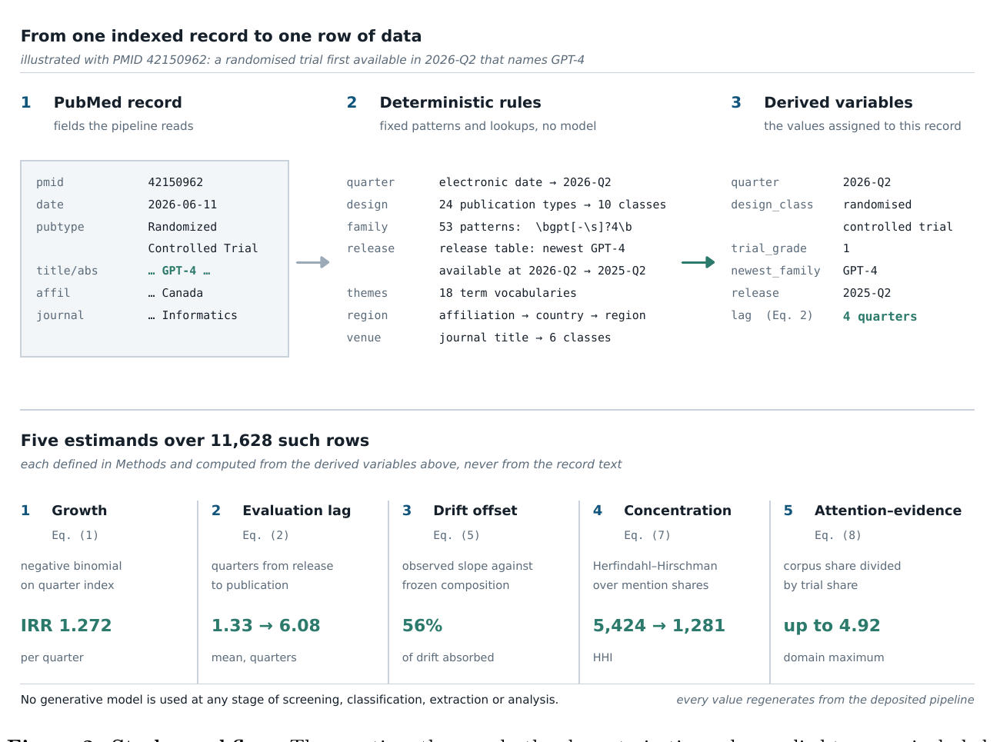

[Home](../) · [AI Papers](./)

# 醫療 LLM 評估落差：研究更嚴謹，為何證據反而更舊？

## 來源

- **單位／團隊**：XU Exponential University of Applied Sciences、Abu Dhabi University、Zayed University。[(ref: main author block)](https://arxiv.org/html/2609.11770v1)
- **作者**：Raad Bin Tareaf、Murad Al-Rajab、Samia Loucif。[(ref: abstract metadata)](https://arxiv.org/abs/2609.11770)
- **完整篇名**：*The widening evaluation gap in medical large language model research 2023 to 2026*。
- **年份與版本**：arXiv v1 於 2026-09-10 提交；全文採 Creative Commons Attribution 4.0（CC BY 4.0）。[(ref: abstract version)](https://arxiv.org/abs/2609.11770)
- **原文**：[arXiv:2609.11770](https://arxiv.org/abs/2609.11770) · [HTML 全文](https://arxiv.org/html/2609.11770v1) · [PDF](https://arxiv.org/pdf/2609.11770v1) · [DOI:10.48550/arXiv.2609.11770](https://doi.org/10.48550/arXiv.2609.11770) · [資料與封存程式](https://doi.org/10.5281/zenodo.21671630) · [開發程式庫](https://github.com/raadbintareaf/evaluation-gap-npj)。

**編輯：** Colbert

這份涵蓋 2023-Q1 至 2026-Q2 的醫療生成式語言模型證據地圖指出：文獻數量快速增加，但研究發表時所評估的模型平均離最新版本愈來愈遠；這描述的是研究選模與報告方式，不等於受評模型不安全或無效。[(ref: main §2)](https://arxiv.org/html/2609.11770v1#S2) [(ref: main §3)](https://arxiv.org/html/2609.11770v1#S3)

## 流程

圖 1。研究先讀取 PubMed 紀錄，再以固定規則判定季度、研究設計、模型家族、主題、地區與期刊類別，最後計算五類估計量；原研究說明篩選、分類、萃取與分析均未使用生成式模型。圖裁自論文 Figure 2，依 CC BY 4.0 使用。[(ref: main Fig. 2)](https://arxiv.org/html/2609.11770v1#Sx9.F2)

## 背景／問題

醫療大型語言模型（large language model, LLM）研究面臨兩個不同速度：模型家族可能每數季更新一次，但臨床試驗從設計到發表往往耗時更久。若最嚴謹的研究總在評估已停止更新的系統，臨床與監管決策就可能拿「高品質、但對象已過時」的證據推論目前正在使用的模型。作者因此把問題改寫成可量測的時間差：一篇研究發表時，它明確點名的最新模型家族距離發布已經幾季？[(ref: main §1)](https://arxiv.org/html/2609.11770v1#S1)

這不是另一份「哪個模型分數最高」的 benchmark。研究單位是公開報告，不是病人；它不合併治療效果，也不對單篇研究做風險偏差評分，而是量測整體證據庫的規模、時效、模型版本可追溯性與不同主題的 prospective evidence 密度。[(ref: main §4.1)](https://arxiv.org/html/2609.11770v1#S4.SSx1)

## 方法摘要

作者用 NCBI E-utilities 搜尋 PubMed/MEDLINE，把一個涵蓋通用與具名模型的技術 query，分別與 14 個臨床領域 query 組合，再以 DOI、其次以 PMID 去重。納入窗為 2023-01-01 至 2026-06-30；review 與 commentary 不被排除，因為「研究設計」本身就是分析變數。[(ref: main §4.2)](https://arxiv.org/html/2609.11770v1#S4.SSx2)

每筆紀錄只使用索引 metadata、標題與摘要，以固定優先序把 PubMed publication type 映射成 10 類研究設計；另用 53 組 regular expressions 找模型家族、18 組詞彙找技術／風險主題，並以 lookup 對應地區與期刊類別。作者把 randomized、controlled 或 prospective designs 合稱「trial-grade」，這是本研究的操作性定義，不表示每篇都等同隨機對照試驗。[(ref: main §4.3)](https://arxiv.org/html/2609.11770v1#S4.SSx3)

## 方法詳解

### 1. 評估時差不是「論文做了多久」

對每篇有點名模型家族的研究，作者以發表季度減去當時該家族最新版本的發布季度，得到 evaluation lag。若一篇文章點名多個家族，取其中最新者；這會把時差估得較小，因此對「落差很大」的假說較保守。研究另以最早版本重算作敏感度分析。[(ref: main Eq. 2)](https://arxiv.org/html/2609.11770v1#S4.SSx5)

### 2. 用「停滯基準」而不是零斜率

一個停止更新的模型即使研究行為完全不變，也會每過一季就自動老一季；因此拿觀察到的 lag 斜率與零比較沒有意義。作者固定 2023 年的模型家族組成，只讓各家族自然老化，建立 counterfactual slope，再計算研究社群改用新模型抵銷了多少機械式漂移。[(ref: main Eqs. 3–5)](https://arxiv.org/html/2609.11770v1#S4.SSx5)

### 3. 分開看研究設計與選模

lag 分布右偏，主要比較使用以發表季度調整的 median regression，並以 ordinary least squares 與 Holm correction 作對照。關鍵的分層分析只保留仍在持續發布新版本的家族，用來區分「嚴謹研究必然比較慢」與「嚴謹研究較常選到停止更新的模型」兩種解釋。[(ref: main §4.5 design differences)](https://arxiv.org/html/2609.11770v1#S4.SSx5)

### 4. 注意力—證據落差

每個臨床領域或主題的 attention–evidence gap，定義為它占全部文獻的比例，除以它占 trial-grade 文獻的比例；大於 1 表示討論熱度高於 prospective／controlled evidence 的相對供給。這是文獻結構指標，不是效能或風險分數。[(ref: main Eq. 8)](https://arxiv.org/html/2609.11770v1#S4.SSx5)

## 資料與實驗

### 資料流程

| 階段 | 紀錄數 | 定義／處理 |
|---|---:|---|
| 初始檢索 | 19,406 | 15 個 query blocks 的合併結果 |
| DOI／PMID 去重後 | 11,851 | DOI 優先，缺 DOI 時以 PMID 去重 |
| 排除 | 223 | 87 筆日期在分析窗外；136 筆無法指派季度 |
| 證據地圖 | 11,628 | 2023-Q1 至 2026-Q2；review 與 commentary 保留 |
| trial-grade | 296（2.5%） | randomized、controlled 或 prospective designs |
| 可計算 evaluation lag | 5,775 | 標題或摘要明確點名可定年的模型家族；另有 4 筆負 lag 被排除 |

資料流與分母來自主結果與方法；作者公開衍生表、controlled vocabulary、人工整理的模型發布表、註冊紀錄及 11,628 筆紀錄索引，但因 PubMed 與出版社權利限制，不重新散布完整標題與摘要。[(ref: main §2.1)](https://arxiv.org/html/2609.11770v1#S2.SSx1) [(ref: main data availability)](https://arxiv.org/html/2609.11770v1#Sx1)

### Table 1：主要估計量

下表重排論文 Table 1；lag 與 slope 的單位都是「季」，研究設計列是相對於 other empirical designs 的差值。[(ref: main Table 1)](https://arxiv.org/html/2609.11770v1#Sx8.T1)

| 類別 | 指標 | 估計 | 95% CI |
|---|---|---:|---:|
| 規模 | 分析紀錄 | 11,628 | — |
| 規模 | 每季成長 incidence rate ratio | 1.272 | 1.257–1.289 |
| 規模 | 2023-Q1 → 2026-Q2 每季紀錄 | 52 → 2,346（45×） | — |
| 規模 | trial-grade designs | 296（2.5%） | — |
| lag | 平均 lag，2023-Q1 → 2026-Q2 | 1.33 → 6.08 | — |
| lag | 觀察斜率／季 | 0.329 | — |
| lag | 固定 2023 組成的 counterfactual slope／季 | 0.753 | — |
| lag | 改用新模型所抵銷的漂移 | 56.2% | 49.9–65.2 |
| lag | 僅持續更新家族的斜率／季 | 0.237 | 0.222–0.252 |
| lag | 停止更新家族的斜率／季 | 1.062 | 1.013–1.110 |
| 設計 | 隨機試驗 median regression 差值 | +4.62 | 3.62–5.63 |
| 設計 | 隨機試驗、僅持續更新家族 | +0.02 | −0.50–0.55 |
| 設計 | preprint、僅持續更新家族 | −0.09 | −0.31–0.13 |
| 設計 | 隨機試驗評估停止更新家族 | 62.1% | — |
| 設計 | preprint 評估停止更新家族 | 15.6% | — |
| 報告 | 隨機試驗有指定版本 | 50.0% | — |
| 報告 | comparative evaluation 有指定版本 | 83.4% | — |
| 集中度 | Herfindahl–Hirschman index，2023-Q1 → 2026-Q2 | 5,424 → 1,281 | — |
| 集中度 | 每季具名模型家族數 | 5 → 37 | — |
| 集中度 | 專用 biomedical model 最高占比 | 2.5% | — |

## 結果

文獻量從 2023-Q1 的 52 筆增至 2026-Q2 的 2,346 筆，負二項迴歸估計每季 IRR 為 1.272；但 trial-grade share 在最後五季沒有上升，2026-Q2 為 2.5%。平均 evaluation lag 同期由 1.33 季升至 6.08 季，約由 4 個月變成 18 個月。[(ref: main §2.1)](https://arxiv.org/html/2609.11770v1#S2.SSx1) [(ref: main §2.2)](https://arxiv.org/html/2609.11770v1#S2.SSx2)

若完全不換模型，固定 2023 組成的 lag 斜率會是每季 0.753；實際斜率是 0.329，表示改用新模型抵銷了 56.2%（95% CI 49.9–65.2）的機械式漂移，但仍不足以讓落差停止擴大。排除 encoder-era 家族或只看 2024 年後仍有發布的家族，斜率仍為正。[(ref: main §2.2)](https://arxiv.org/html/2609.11770v1#S2.SSx2)

表面上，隨機試驗比其他 empirical designs 評估的模型舊 4.62 季；但只看持續更新的模型家族後，差值縮為 +0.02 季（95% CI −0.50–0.55，n=22）。作者據此主張設計梯度主要來自選模：62.1% 的隨機試驗評估停止更新的家族，preprint 則為 15.6%。這個 n=22 子群只能排除大型殘餘差異，不能證明研究時程完全沒有影響。[(ref: main §2.2)](https://arxiv.org/html/2609.11770v1#S2.SSx2) [(ref: main limitations)](https://arxiv.org/html/2609.11770v1#S3)

版本可追溯性也有落差：有點名模型的紀錄中，67.8% 至少提供版本、access date、decoding parameter 或等效識別資訊；隨機試驗為 50.0%，comparative evaluations 為 83.4%。若 proprietary model 沒有版本或存取日期，日後即使知道家族名稱，也無法重建當時受測系統。[(ref: main §2.3)](https://arxiv.org/html/2609.11770v1#S2.SSx3)

agentic／multi-agent clinical systems 是成長最快的領域（每季 IRR 1.504），卻只有 678 篇中的 7 篇屬 trial-grade，attention–evidence gap 為 2.40；benchmark validity 與 safety guardrails 的主題 gap 分別為 2.73 與 2.69。這只能說 prospective evidence 的相對供給偏低，不能推出這些系統本身較危險。[(ref: main §2.5)](https://arxiv.org/html/2609.11770v1#S2.SSx5)

專用 biomedical models 在 2026-Q2 占模型 mentions 的 2.21%，正文說任何季度不超過 2.6%，Table 1 則列最高 2.5%；本文保留兩種呈現，不自行把來源的精度差異改成同一數字。[(ref: main §2.4)](https://arxiv.org/html/2609.11770v1#S2.SSx4) [(ref: main Table 1)](https://arxiv.org/html/2609.11770v1#Sx8.T1)

## 限制

1. **資料庫範圍不等於整個 AI 研究生態。** 研究只搜 PubMed；臨床與生醫期刊涵蓋較好，但 machine-learning conference 不完整，因此不能把「computer science venue 沒有 trial-grade 紀錄」泛化成整個電腦科學社群沒有臨床研究。[(ref: main §3)](https://arxiv.org/html/2609.11770v1#S3)
2. **lag 只對明確具名模型的子集成立。** 模型若只寫在 methods、沒出現在標題或摘要，就不會被偵測；lag 覆蓋率又因設計而異，preprint 與 review 的結果代表其中較完整報告的少數。[(ref: main §3)](https://arxiv.org/html/2609.11770v1#S3)
3. **regular expression 有碰撞。** 11 個較易混淆的家族中，2,347 次命中有 232 次（9.9%）被 audit flag；這相當於全 corpus 的 2.0%。主導 corpus 的 GPT-4、GPT-3.5、DeepSeek 與 OpenAI o-series 不受常見臨床詞碰撞，但其他家族仍可能有殘餘誤差。[(ref: main §4.5 detection precision)](https://arxiv.org/html/2609.11770v1#S4.SSx5)
4. **模型發布表含人工判斷。** 「仍在開發」與 release quarter 依人工整理表決定，作者也承認這是最可受挑戰的分析元件；完整表雖已公開，仍需要外部重跑與版本更新。[(ref: main §3)](https://arxiv.org/html/2609.11770v1#S3)
5. **研究設計分類依賴 PubMed metadata。** publication type 可能延遲或缺漏，最可能低估 trial-grade 紀錄；地區又以第一作者單位判定，19.0% 無法歸類。最後一季有 indexing lag，趨勢雖同時報含／不含最後一季，近期數量仍不完整。[(ref: main §3)](https://arxiv.org/html/2609.11770v1#S3)
6. **bibliometric gap 不是臨床效果。** 研究沒有測量任何模型的診斷準確度、病人結果、安全性或公平性；attention–evidence gap 高，也不代表傷害已被證實。[(ref: main §3)](https://arxiv.org/html/2609.11770v1#S3)

## 與書庫其他文章的關係

一句話敘述關係: [PrecepTron：把醫師評分學成 LLM 評審，能讓醫療 AI 評估更可重現嗎？](2026-09-17-preceptron-clinical-ai-evaluation.md) 把本文指出的評估設計缺口具體化為 physician-calibrated judge；它能提高同一量表下的評分可重現性，但不解決模型新鮮度、臨床效益或跨 panel 外推。

一句話敘述關係: [AgentRx：多模態 ICU 預測裡，多代理真的比單一代理好嗎？](2026-09-17-agentrx-multimodal-clinical-prediction.md) 提供單中心 retrospective benchmark 的具體案例；本篇則顯示 agentic／multi-agent 醫療文獻雖成長最快，trial-grade evidence 的相對供給仍低。

一句話敘述關係: [LLM 多代理系統：從 ReAct 到可對話協作](../ai-basics/multi-agent-llm.md) 解釋角色分工與協作機制；本篇補上研究治理視角，提醒 capability、safety 與 prospective evaluation 經常分屬不同文獻群。

一句話敘述關係: [FDA 徵求 GenAI 醫材監管意見：討論文件≠指引](../industry-watch/2026-09-17-fda-genai-devices-discussion-paper.md) 對應監管端把代理式 GenAI 賦能裝置與上市後監測寫進討論框架；本篇則顯示 agentic／multi-agent 醫療文獻成長快、trial-grade 證據相對稀少。

一句話敘述關係: [報告讀起來很順，就代表寫對了嗎？RadVLM 的分節評估](2026-09-22-radvlm-section-based-report-evaluation.md) 把評估落差縮到指標層級——自動指標彼此高度相關，卻不必然指向同一個臨床事實。

## 實務的啟發

1. **把模型當可替換元件。** protocol 可以預先定義替換條件、版本鎖定點與等效性檢查，避免一個停止更新的 model endpoint 把整個臨床問題一起凍結。
2. **最低限度報告版本、存取日期與 decoding parameters。** 家族名不夠；對持續更新的 proprietary service，沒有這三項就很難重現，更無法判斷證據是否仍適用。
3. **同時管理嚴謹度與新鮮度。** benchmark、retrospective validation 與 prospective study 回答不同問題；決策表應同列 study design、模型 age、version specificity 與外部驗證，而不是只按證據階層排序。
4. **讓 evidence synthesis 可重跑。** 搜尋式、controlled vocabulary、release table、分類規則與圖表生成都應版本化；當新模型或新試驗出現時，更新整張 evidence map，而不是再做一次不可重現的截面回顧。
5. **不要把「文獻缺口」寫成「已知風險」。** agentic systems 的 attention–evidence gap 值得優先安排 prospective evaluation，但部署決策仍需任務特定的安全、效能、公平性與 human-AI workflow 證據。

## References

- **main** — Raad Bin Tareaf、Murad Al-Rajab、Samia Loucif，*The widening evaluation gap in medical large language model research 2023 to 2026*：[abstract](https://arxiv.org/abs/2609.11770) · [HTML](https://arxiv.org/html/2609.11770v1) · [PDF](https://arxiv.org/pdf/2609.11770v1) · [Methods](https://arxiv.org/html/2609.11770v1#S4) · [Table 1](https://arxiv.org/html/2609.11770v1#Sx8.T1) · [Figure 2](https://arxiv.org/html/2609.11770v1#Sx9.F2)。
- **data** — 作者公開的 derived data、controlled vocabulary、model release table、註冊與封存 pipeline：[Zenodo DOI 10.5281/zenodo.21671630](https://doi.org/10.5281/zenodo.21671630)。
- **code** — 可重建 PubMed corpus 並重產分析與圖表的開發程式庫：[raadbintareaf/evaluation-gap-npj](https://github.com/raadbintareaf/evaluation-gap-npj)。

[Home](../) · [AI Papers](./)
