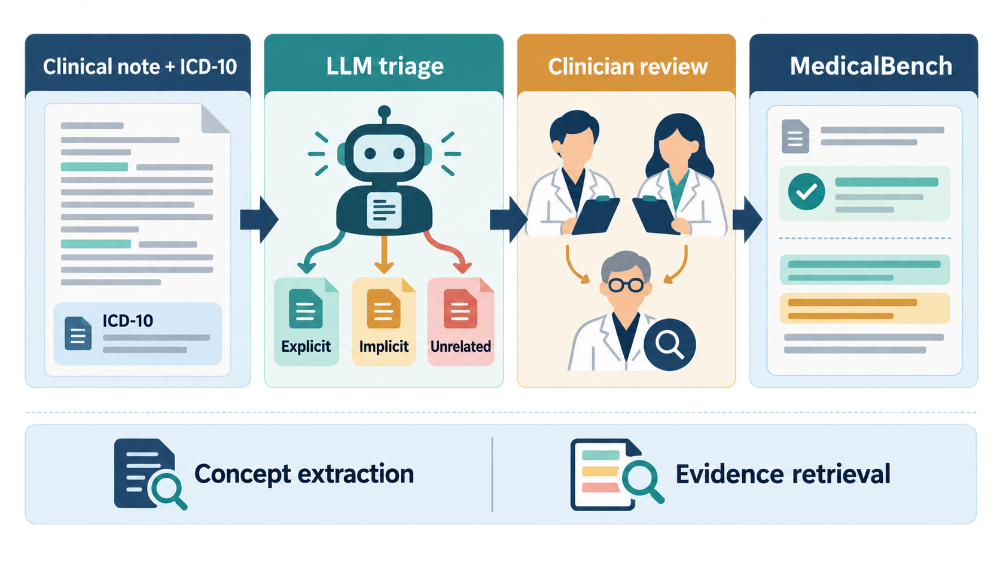

[Home](../) · [AI Papers](./)

# MedicalBench：讓 LLM 指出病歷證據，隱性概念抽取真的更準嗎？

## 來源

- 團隊：Optum AI；作者為 Zhichao Yang、Gregory D. Lyng、Sanjit Singh Batra 與 Robert E. Tillman。[(ref: main author block)](https://arxiv.org/html/2605.20197v1)
- 論文：*MedicalBench: Evaluating Large Language Models Toward Improved Medical Concept Extraction*，arXiv v1，2026-04-05。[(ref: abstract)](https://arxiv.org/abs/2605.20197)
- 識別碼：[arXiv:2605.20197](https://arxiv.org/abs/2605.20197)；[DOI: 10.48550/arXiv.2605.20197](https://doi.org/10.48550/arXiv.2605.20197)。
- 全文：[arXiv HTML](https://arxiv.org/html/2605.20197v1)；[PDF](https://arxiv.org/pdf/2605.20197v1)；資料集頁：[PhysioNet v1.0.0](https://physionet.org/content/mimic-iv-ext-medicalbench/1.0.0/)。

**編輯：** Colbert

MedicalBench 不只問大型語言模型（large language model, LLM）能否從出院摘要判斷一個 ICD-10 概念是否成立，也要求它指出支撐判斷的句子，專門測試隱性、易混淆與分散在長文中的證據。[(ref: main §1)](https://arxiv.org/html/2605.20197v1#S1)

## 流程

圖：本書庫依論文方法重繪。研究先用 LLM 找出值得人工檢查的困難 note-concept pairs，再由兩位具醫療訓練的標註者與 subject matter expert（SME）審查，最後評估概念判定與句級證據檢索。圖示是方法摘要，不代表病歷可直接交給生成模型作臨床或申報決策。[(ref: main §2)](https://arxiv.org/html/2605.20197v1#S2) [(ref: data intended use)](https://physionet.org/content/mimic-iv-ext-medicalbench/1.0.0/#usage-notes)

## 背景／問題

病歷中的診斷不一定直接寫出名稱：低血紅素可能暗示貧血，BMI 37 可能暗示肥胖；同一概念的證據也可能散落在用藥、處置與病程段落。若系統只做關鍵字對齊，就會漏掉隱性概念，也可能把「排除心肌梗塞」誤判成已確診的心肌梗塞。[(ref: main §1)](https://arxiv.org/html/2605.20197v1#S1) [(ref: main case studies)](https://arxiv.org/html/2605.20197v1#S4.SS6)

MedicalBench 因此把概念抽取改寫為「驗證加定位」：輸入一份出院摘要與一個候選醫療概念，模型必須判斷病歷是否支持它；若支持，還要找出相應句子。這使評估能分開觀察最終判斷與證據回溯，而不是只看一個代碼有沒有猜中。[(ref: main §1)](https://arxiv.org/html/2605.20197v1#S1) [(ref: main §3)](https://arxiv.org/html/2605.20197v1#S3)

## 方法摘要

資料來自去識別化的 MIMIC-IV 與 MIMIC-IV-Note 出院摘要。每次住院對應的 ICD-10 診斷與處置碼先成為候選概念；GPT-4o-mini 對每個 note-concept pair 重複判斷三次，以多數決分成 Explicit、Implicit 或 Unrelated，再由 o3 重查前一階段與既有代碼不一致的案例。[(ref: main §2.1)](https://arxiv.org/html/2605.20197v1#S2.SS1) [(ref: main §2.2)](https://arxiv.org/html/2605.20197v1#S2.SS2)

正例候選刻意保留兩個模型都判為 Unrelated、但該次住院已有相應 ICD-10 code 的困難案例；負例則從依盛行率抽樣與語意相近但不相關的概念產生。這不是隨機抽取的臨床概念分布，而是一個以模型失敗與語意混淆為核心的壓力測試。[(ref: main §2.2)](https://arxiv.org/html/2605.20197v1#S2.SS2) [(ref: main §2.3)](https://arxiv.org/html/2605.20197v1#S2.SS3)

## 方法詳解

第一階段把每份出院摘要映射到該住院的 `diagnoses_icd` 與 `procedures_icd`，並保留 ICD chapter、parent hierarchy 與文字描述。作者把經專業編碼人員處理的 billing codes 當成待驗證概念，但最終 Related／Unrelated 標籤仍由人工審查，不直接把 billing code 當 gold label。[(ref: main §2.1)](https://arxiv.org/html/2605.20197v1#S2.SS1) [(ref: main §2.4)](https://arxiv.org/html/2605.20197v1#S2.SS4)

第二階段以 LLM 做 triage。GPT-4o-mini 每個 pair 跑三次，保存分類、解釋與 evidence spans；o3 再檢查疑似正例。負例一組按概念盛行率抽樣，另一組則用概念名稱 embedding 找語意最近、實際不相關的概念，使模型不能只靠詞面相似度。[(ref: main §2.2)](https://arxiv.org/html/2605.20197v1#S2.SS2) [(ref: main §2.3)](https://arxiv.org/html/2605.20197v1#S2.SS3)

第三階段共有九位具醫療訓練的獨立標註者；每個 pair 由兩人判斷 Related 或 Unrelated。Related 案例還需標出字元位置並寫短理由，兩人歧異要經處理，無法形成明確單一標籤者排除；之後再由 SME 驗證正確性、完整性與一致性。[(ref: main §2.4)](https://arxiv.org/html/2605.20197v1#S2.SS4)

評估分兩項。Medical Concept Extraction 對全部案例計算 micro-averaged precision、recall 與 F1；Sentence-Level Evidence Retrieval 只在有人工證據的案例上，以每案 gold evidence sentences 的召回率再做 macro average。它量的是證據是否被找回，不是模型解釋是否具因果忠實性。[(ref: main §3)](https://arxiv.org/html/2605.20197v1#S3)

## 資料與實驗

下表整理論文報告的資料構成。論文 final dataset 為 823 筆，但 PhysioNet v1.0.0 頁面只列 405 筆（167 positives、238 negatives）；兩個一手來源不一致，不能把公開 release 直接當成論文全部 823 筆。[(ref: main §2.4)](https://arxiv.org/html/2605.20197v1#S2.SS4) [(ref: data methods)](https://physionet.org/content/mimic-iv-ext-medicalbench/1.0.0/#methods)

| 構成 | 論文報告 | 用途 | 證據邊界 |
|---|---:|---|---|
| 資料來源 | MIMIC-IV 與 MIMIC-IV-Note 的出院摘要 | note-concept verification | 單一醫療體系的去識別資料 |
| 論文 final dataset | 823 | 論文實驗 | 與 PhysioNet v1.0.0 筆數不一致 |
| Gold positives | 352 | Related（explicit／implicit） | 困難例被過度抽樣 |
| Gold negatives | 471 | Unrelated | 盛行率加權或語意相近負例 |
| 人工標註 | 9 位；每案 2 位加 SME review | gold label、evidence span、理由 | 未報跨標註者一致性係數 |
| PhysioNet v1.0.0 | 405（167 positive、238 negative） | credentialed release | 不宜假設等同論文完整資料 |

論文 Table 1 只比較 GPT-5 在同一資料上的兩種輸入條件。Reasoning cues 是由 retrieved evidence 改寫後放回 prompt；因此它測的是「額外提供證據提示」的條件差異，不是獨立端到端系統的臨床效果。[(ref: main Table 1)](https://arxiv.org/html/2605.20197v1#S4.T1)

| Condition | Precision | Recall | F1 | TP | TN | FP | FN |
|---|---:|---:|---:|---:|---:|---:|---:|
| GPT-5 Without Reasoning Cues | 0.6317 | 0.4971 | 0.5564 | 175 | 369 | 102 | 177 |
| GPT-5 With Reasoning Cues | 0.7578 | 0.6845 | 0.7194 | 241 | 394 | 77 | 111 |

論文 Table 2 則拿掉 prompt 中 Explicit／Implicit／Unrelated 的分類定義，觀察是否明示「也要找隱性證據」的影響。[(ref: main Table 2)](https://arxiv.org/html/2605.20197v1#S4.T2)

| Condition | Precision | Recall | F1 | TP | TN | FP | FN |
|---|---:|---:|---:|---:|---:|---:|---:|
| GPT-5 With Implicit Evidence | 0.6317 | 0.4971 | 0.5564 | 175 | 369 | 102 | 177 |
| GPT-5 Without Implicit Evidence | 0.4970 | 0.2414 | 0.3250 | 85 | 385 | 86 | 267 |

## 結果

在沒有額外 reasoning cues 的主比較中，Gemini-3-pro-preview 的 concept extraction F1 為 0.59，Claude-opus-4.5、GPT-5、Gemini-2.5-pro 分別為 0.55、0.54、0.53；o3 與 GPT-4.1 為 0.48 與 0.46。論文測到的所有模型 F1 都低於 0.60，說明這組刻意挑選的隱性與易混淆案例很難，但不能外推為一般臨床概念抽取的平均表現。[(ref: main §4.1)](https://arxiv.org/html/2605.20197v1#S4.SS1)

把 reasoning cues 加回 GPT-5 prompt 後，F1 從 0.5564 升到 0.7194，TP 從 175 增至 241，FP 從 102 降至 77；明示要處理隱性證據時，F1 為 0.5564，拿掉該指示後則降至 0.3250。這兩個 ablation 支持「任務定義與證據提示會大幅改變分數」，但尚未回答提示如何在無人工 gold span 的真實流程中可靠取得。[(ref: main Table 1)](https://arxiv.org/html/2605.20197v1#S4.T1) [(ref: main Table 2)](https://arxiv.org/html/2605.20197v1#S4.T2)

作者也以 Two One-Sided Tests（TOST）檢查 note length 與 GPT-5 accuracy 的相關性，設定等效界值 0.1，得到 `r = 0.02`、90% CI `[-0.03, 0.07]`、p = 0.0109。這表示在本 benchmark 與預先界值內沒有觀察到實質長度相關，不表示任何 EHR 長文本任務都沒有 long-context 問題。[(ref: main §4.5)](https://arxiv.org/html/2605.20197v1#S4.SS5)

## 限制

- 資料來自 Beth Israel Deaconess Medical Center 的 MIMIC-IV 出院摘要，沒有跨醫院、跨語言或前瞻性驗證；PhysioNet 也明確限定研究與評估用途，不適合直接用於臨床或 billing。[(ref: main §2.1)](https://arxiv.org/html/2605.20197v1#S2.SS1) [(ref: data intended use)](https://physionet.org/content/mimic-iv-ext-medicalbench/1.0.0/#usage-notes)
- 論文以 LLM disagreement 與 hard negatives 建構壓力測試，並非按臨床盛行率抽出的代表性樣本；模型 F1 不能解讀為日常病例的預期準確率。[(ref: main §2.2-2.3)](https://arxiv.org/html/2605.20197v1#S2.SS2)
- 論文報 823 筆，PhysioNet v1.0.0 報 405 筆，且公開資料需 credentialed access 與 Data Use Agreement；目前無法由 landing page 解釋兩者差額。[(ref: main §2.4)](https://arxiv.org/html/2605.20197v1#S2.SS4) [(ref: data landing)](https://physionet.org/content/mimic-iv-ext-medicalbench/1.0.0/)
- 九位標註者雖具 medical training，論文未細分專業資格，也未報 Cohen's kappa 等一致性統計；「expert-verified」不等於沒有標註不確定性。[(ref: main §2.4)](https://arxiv.org/html/2605.20197v1#S2.SS4)
- reasoning-cue 與 implicit-instruction ablation 都只在 GPT-5 上展示；Table 1 也沒有充分描述 cue 產生如何與 gold evidence 隔離，0.7194 不應視為可直接部署的端到端成績。[(ref: main §4.3)](https://arxiv.org/html/2605.20197v1#S4.SS3)
- 研究沒有測量病人結果、醫師負擔、申報正確性、公平性、延遲或部署安全；證據只支持離線 benchmark。[(ref: main §5)](https://arxiv.org/html/2605.20197v1#S5)

## 與書庫其他文章的關係

一句話敘述關係: [Tracing the Heart：證據可追溯的心衰竭特徵工程管線（nMAS）](2026-09-15-tracing-the-heart.md) 以規則與來源欄維持特徵 provenance，可與 MedicalBench「模型指出病歷證據」的可追溯性對讀。

一句話敘述關係: [EviGen：從長期病歷挑證據、寫理由，再逐步驗證，能讓臨床 LLM 更可稽核嗎？](2026-09-17-evigen-clinical-rationale.md) 從 MedicalBench 的句級證據定位再往前一步，把預測性檢索、帶引文理由與逐步錯誤標記串成可稽核流程。

## 實務的啟發

第一，評估單位應從「答對代碼」擴成「答對、找對證據、保留時間與否定語境」。MedicalBench 的舊心肌梗塞案例顯示，詞面命中若忽略「未確診」與新舊時間狀態，可能把看似合理的答案變成錯誤標記。[(ref: main case 2)](https://arxiv.org/html/2605.20197v1#S4.SS6.SSS2)

第二，benchmark 應同時公布採樣母體與困難例富集方式。若 production validation 只重跑 MedicalBench，會高估日常錯誤中「隱性推理」的比例，也無法知道常見直接概念是否退步；較完整的測試集應把自然盛行率 cohort 與 hard-case challenge set 分開報告。

第三，證據檢索不能直接當成忠實解釋。本書庫會把 decision、retrieved spans、prompt／model version、人工覆核與最終寫入分開記錄；只有證據存在還不夠，還要檢查否定、時間、主體與概念層級是否一致。

最後，來源版本差異本身就是治理訊號。論文 823 筆與 PhysioNet release 405 筆應在資料卡、程式版本與實驗 manifest 中明確對齊；否則即使表格分數可重算，也無法確認重現的是哪一個 benchmark slice。

## References

- `main`：[MedicalBench 論文 HTML](https://arxiv.org/html/2605.20197v1)；本文使用 [§1](https://arxiv.org/html/2605.20197v1#S1)、[§2.1](https://arxiv.org/html/2605.20197v1#S2.SS1)、[§2.2](https://arxiv.org/html/2605.20197v1#S2.SS2)、[§2.4](https://arxiv.org/html/2605.20197v1#S2.SS4)、[§3](https://arxiv.org/html/2605.20197v1#S3)、[Table 1](https://arxiv.org/html/2605.20197v1#S4.T1)、[Table 2](https://arxiv.org/html/2605.20197v1#S4.T2)、[§4.5](https://arxiv.org/html/2605.20197v1#S4.SS5) 與 [§5](https://arxiv.org/html/2605.20197v1#S5)。
- `abstract`：[arXiv:2605.20197](https://arxiv.org/abs/2605.20197)。
- `doi`：[10.48550/arXiv.2605.20197](https://doi.org/10.48550/arXiv.2605.20197)。
- `data`：[MIMIC-IV-Ext-MedicalBench v1.0.0](https://physionet.org/content/mimic-iv-ext-medicalbench/1.0.0/)；[DOI: 10.13026/j98m-g356](https://doi.org/10.13026/j98m-g356)。

[Home](../) · [AI Papers](./)
