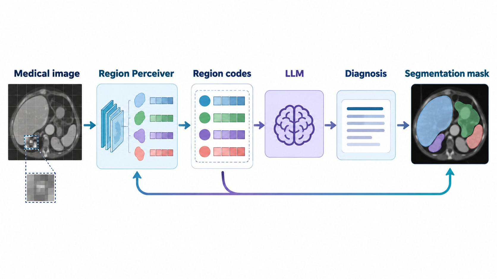

[Home](../) · [AI Papers](./)

# MedSIGHT：醫療 VLM 能否一邊診斷、一邊把病灶分割出來？

## 來源

- **單位／團隊**：Pennsylvania State University 的 College of Information Sciences and Technology，以及 GE Healthcare。[(ref: main author block)](https://arxiv.org/html/2606.06760v1)
- **作者**：Aofei Chang、Le Huang、Alex James Boyd、Parminder Bhatia、Taha Kass-Hout、Fenglong Ma、Cao Xiao。[(ref: abstract metadata)](https://arxiv.org/abs/2606.06760)
- **完整篇名**：*MedSIGHT: Towards Grounded Visual Comprehension in Medical Large Vision-Language Models*。
- **年份與版本**：arXiv v1 於 2026-06-04 提交；論文註明獲 ICML 2026 接受。[(ref: abstract version and comments)](https://arxiv.org/abs/2606.06760)
- **原文**：[arXiv:2606.06760](https://arxiv.org/abs/2606.06760) · [HTML 全文](https://arxiv.org/html/2606.06760v1) · [PDF](https://arxiv.org/pdf/2606.06760v1) · [DOI:10.48550/arXiv.2606.06760](https://doi.org/10.48550/arXiv.2606.06760) · [官方程式庫](https://github.com/Aofei-Chang/MedSIGHT)。

**編輯：** Colbert

MedSIGHT 把區域感知器與可由大型語言模型輸出的離散區域代碼接在一起，讓同一個醫療視覺語言模型既產生診斷文字，也能把文字中的區域代碼解碼成像素級分割 mask；證據來自離線 benchmark，而不是臨床部署。[(ref: main §1)](https://arxiv.org/html/2606.06760v1#S1) [(ref: main §3)](https://arxiv.org/html/2606.06760v1#S3)

## 流程

*圖 1：Colbert 依原文 Figure 2 與 Algorithm 1 重繪的概念圖。影像與 mask 為抽象示意，不是病人資料；圖中也不呈現任何績效數值。模型先把 patch 與 region-level 表徵送入 LLM，LLM 產生的 region codes 再投影回視覺空間，由 Region Perceiver 解碼成 mask。[(ref: main Fig. 2)](https://arxiv.org/html/2606.06760v1#S1.F2) [(ref: main Algorithm 1)](https://arxiv.org/html/2606.06760v1#alg1)*

## 背景／問題

多數醫療大型視覺語言模型（medical large vision-language model, Med-LVLM）把影像切成 patch，再由語言模型回答問題；這有助於高階語意理解，卻不保證回答能對回精確的器官或病灶邊界。作者把問題拆成兩端：輸入端的 patch features 可能流失細節，輸出端若只用一個通用的 [SEG] token，又難以區分不同解剖與病理區域。[(ref: main §1)](https://arxiv.org/html/2606.06760v1#S1)

MedSIGHT 的研究問題不是「模型能否看懂影像」而已，而是「診斷文字與空間位置能否在同一生成流程中對齊」。為了測這件事，作者另建 Grounded Diagnostic Segmentation（DiagSeg）：模型必須先判斷異常，再輸出與該判斷一致的分割 mask。[(ref: main §3)](https://arxiv.org/html/2606.06760v1#S3)

## 方法摘要

MedSIGHT 以 Qwen3-8B 為語言骨幹、UniMed-CLIP ViT-L/14 為影像編碼器。影像的 patch features 先進入 Region Perceiver，經可學習的 region queries 與雙向 cross-attention 形成兼具語意及空間細節的 region embeddings；patch 與 region embeddings 一起投影到語言空間。[(ref: main §2.1–2.2)](https://arxiv.org/html/2606.06760v1#S2.SS1) [(ref: implementation)](https://arxiv.org/html/2606.06760v1#A4)

另一個核心是 modality-aware region codebook。每種影像模態擁有一組離散 region codes，並把這些 codes 加入 LLM vocabulary。LLM 回答時若產生 region code，其 hidden state 會經 text-to-vision projector 映回視覺空間，再由 Region Perceiver 的 segmentation head 產生 mask。[(ref: main §2.3)](https://arxiv.org/html/2606.06760v1#S2.SS3)

## 方法詳解

### 1. Region Perceiver：把 patch 補成 region-level 表徵

Region Perceiver 使用一組 learnable region queries，逐層放大視覺 feature map，並在「region query 查詢 image features」與「image features 回看 region queries」兩個方向做 cross-attention。作者用 segmentation 的 Binary Cross-Entropy、Dice loss 與 region classification loss 預訓練它，並以 Hungarian matching 對齊預測與真值區域。[(ref: main §2.2)](https://arxiv.org/html/2606.06760v1#S2.SS2) [(ref: Appendix A.1)](https://arxiv.org/html/2606.06760v1#A1.SS1)

正式設定包含 3 層 Region Perceiver、20 個 region query tokens；它先在 BiomedParse training set 訓練 20 epochs。這些設定是架構與訓練選擇，不代表 20 個 token 足以覆蓋任意臨床影像中的所有異常。[(ref: implementation)](https://arxiv.org/html/2606.06760v1#A4)

### 2. Region codebook：讓語言模型可以「說出區域」

連續的 region embeddings 先以 vector quantization 映射到離散 code。正式設定依 BiomedParse 的細分方式使用 18 種 modalities，每種 32 個 codes，每個 code 向量維度為 64；codebook loss 同時包含 vector-quantization、reconstruction 與 spatial-grounding preservation。[(ref: main §2.3)](https://arxiv.org/html/2606.06760v1#S2.SS3) [(ref: Appendix A.2)](https://arxiv.org/html/2606.06760v1#A1.SS2) [(ref: implementation)](https://arxiv.org/html/2606.06760v1#A4)

Codes 被加入 LLM vocabulary 後，模型可以在文字回答裡產生像 [C1_16] 這類 token。作者在 100 張腹部 CT 的 liver／kidney 分析中看到 codes 集中到少數 ID，但這只支持特定資料與器官上的一致性，不能把每個 code 一律當成跨資料集、跨模態都穩定的臨床概念。[(ref: codebook analysis)](https://arxiv.org/html/2606.06760v1#A6.SS2)

### 3. 五段式訓練：先學區域，再接回語言

作者的訓練流程可拆成五段：Region Perceiver 預訓練、codebook 學習、vision-to-text alignment、text-to-vision alignment，以及 unified grounded instruction tuning。前兩段學習像素與區域表徵；中間兩段把視覺與語言空間雙向對齊；最後才讓 LLM、兩個 projectors 與 codebook 共同微調，影像編碼器與 Region Perceiver 維持凍結。[(ref: main Algorithm 1)](https://arxiv.org/html/2606.06760v1#alg1) [(ref: main §2.4)](https://arxiv.org/html/2606.06760v1#S2.SS4)

因此「72K instruction pairs」只描述最後 instruction-tuning 的 60K 一般樣本加 12K grounded 樣本；整條管線還使用 BiomedParse、647K PubMedVision image-text pairs 與 60K grounding samples。比較資料效率時，不能只把 Table 2 的 # Data 欄當成全部訓練資料。[(ref: main §4.1)](https://arxiv.org/html/2606.06760v1#S4.SS1) [(ref: training data settings)](https://arxiv.org/html/2606.06760v1#A3)

### 4. DiagSeg：先診斷，再定位

DiagSeg 從多個公開 segmentation datasets 的 test sets 取得 image–mask–description triplets，再由 GPT-5 依 mask 與描述生成診斷問答，共形成 1,655 組 VQA pair，每組都有 pixel-level mask，覆蓋 CT、MRI、X-ray、pathology、ultrasound、endoscopy、dermatoscopy 與 OCT 八種 modalities。[(ref: main §3)](https://arxiv.org/html/2606.06760v1#S3) [(ref: source datasets)](https://arxiv.org/html/2606.06760v1#A2.SS1)

作者先由一位 licensed physician 檢查 100 組；之後另做每種 modality 30 組、合計 240 組的雙專家驗證。後者兩位專家的平均 consistency score 分別為 4.77 與 4.79（滿分 5），但這仍是對生成 QA 與既有 mask／描述一致性的抽樣檢查，不是前瞻性診斷試驗。[(ref: human validation)](https://arxiv.org/html/2606.06760v1#A2.SS3)

## 資料與實驗

### 資料構成

下表把模型訓練、instruction tuning 與評估資料分開；「未於本文給出單一總數」表示不能從其他階段的 sample count 反推唯一影像或病人數。[(ref: main §4.1)](https://arxiv.org/html/2606.06760v1#S4.SS1) [(ref: Appendices C–E)](https://arxiv.org/html/2606.06760v1#A3)

| 階段／資料 | 論文報告規模 | 用途 | 證據邊界 |
|---|---:|---|---|
| BiomedParse training set | 未於本文給出單一總數 | Region Perceiver、codebook 預訓練 | 與部分評估來源有資料集層級重疊 |
| PubMedVision alignment | 647K image-text pairs | vision-to-text alignment | 不包含在 Table 2 的 72K instruction count |
| Grounding alignment set | 60K | text-to-vision alignment | 由 region codes 提供 mask grounding supervision |
| 一般 instruction tuning | 60K | comprehension／instruction following | 從 PubMedVision 隨機抽樣 |
| Grounded instruction tuning | 12K | 生成 region codes 與 masks | 從超過 250K 張 BiomedParse pool 抽樣後，由 GPT-5-mini 生成對話 |
| DiagSeg | 1,655 VQA pairs；8 modalities | 診斷 Recall＋segmentation mean Dice | GPT-5 生成 QA；來自既有 segmentation datasets 的 test splits |
| MeCoVQA-G | 原始 4,142；清理後 4,126 | text-prompted segmentation mean Dice | 移除缺失或錯誤 mask 後才評估 |

MeCoVQA-G 的 4,142 與 4,126 不是兩個互斥版本：前者是原始 samples，後者是作者清理後實際評估的規模。[(ref: evaluation benchmarks)](https://arxiv.org/html/2606.06760v1#A5.T7) [(ref: Appendix E.3)](https://arxiv.org/html/2606.06760v1#A5.SS3)

### DiagSeg：原文 Table 3 的平均欄

下表節錄每個模型跨八種 modalities 的平均欄。Diagnosis 使用 Recall，Segmentation 使用 mean Dice，皆為越高越好；只節錄平均值，不把不同欄位當成同一種指標。[(ref: main Table 3)](https://arxiv.org/html/2606.06760v1#S4.T3)

| Model | # Params | DiagSeg-Diagnosis Recall Avg. | DiagSeg-Segmentation mean Dice Avg. |
|---|---:|---:|---:|
| LISA | 7B | 14.1 | 31.8 |
| LISA++ | 7B | 15.1 | 13.8 |
| LaSagnA | 7B | 4.4 | 18.2 |
| GLaMM | 7B | 16.9 | 11.0 |
| OMG-LLaVA | 7B | 18.3 | 11.1 |
| MedPLIB | 14B／7B active | 13.1 | 31.8 |
| MedSIGHT | 8B | 58.9 | 69.9 |

### 元件消融：原文 Table 5 節錄

下表保留三個代表性輸出。符號只表示拿掉哪個元件；沒有提供信賴區間或多次 seed 的變異，因此差值不能直接解讀為統計顯著。[(ref: main Table 5)](https://arxiv.org/html/2606.06760v1#S4.T5)

| Setting | VQA-RAD all | DiagSeg-VQA | DiagSeg-Seg |
|---|---:|---:|---:|
| Full MedSIGHT | 61.4 | 58.9 | 69.9 |
| 移除 region embeddings Qᵣ | 59.4 | 54.4 | 59.2 |
| 以單一 [SEG] 取代 codebook，且不做 text→vision alignment | 61.0 | 56.4 | 60.4 |
| 移除 vision→text alignment | 56.4 | 56.6 | 63.2 |
| 移除 text→vision alignment | 60.3 | 58.7 | 59.4 |
| 移除 unified tuning | 41.6 | 45.1 | — |

## 結果

- **同時做診斷與分割時，差距主要出現在 DiagSeg。** MedSIGHT 的平均 diagnosis Recall 為 58.9、mean Dice 為 69.9；Table 3 中次高的 diagnosis average 是 OMG-LLaVA 18.3，次高 segmentation average 是 LISA／MedPLIB 的 31.8。這是作者建立的離線 benchmark 結果，不等於臨床敏感度或真實工作流程效益。[(ref: main Table 3)](https://arxiv.org/html/2606.06760v1#S4.T3)
- **一般醫療視覺問答的 raw average 需要看訓練重疊。** Table 2 中 MedSIGHT 的平均為 62.3，高於作者視為可公平比較的 HuatuoGPT-Vision 58.3；但表中部分用評估資料訓練的模型有更高 raw average，例如 Lingshu-7B 為 69.5。原文以灰字標出這類 partial overlap，不能略過後再宣稱所有 baseline 都較低。[(ref: main Table 2)](https://arxiv.org/html/2606.06760v1#S2.T2)
- **文字提示分割的優勢較小且跨 modality 不一致。** MeCoVQA-G 平均 mean Dice 為 42.8，MedPLIB 為 40.1；MedSIGHT 在 dermatoscopy、CT、PET、MR 與 ultrasound 等欄位低於 MedPLIB，平均領先不能取代逐模態檢查。[(ref: main Table 4)](https://arxiv.org/html/2606.06760v1#S4.T4)
- **消融支持架構元件有貢獻，但不能給出因果大小的精確區間。** 拿掉 region embeddings 後 DiagSeg-Seg 從 69.9 降到 59.2；用 supervision-matched 的簡化 decoder 時為 63.8，作者因此把一部分增益歸於雙向 cross-attention 與 iterative refinement，而不只額外 segmentation supervision。[(ref: architectural ablation)](https://arxiv.org/html/2606.06760v1#A6.SS7)

## 限制

- DiagSeg 來自公開 segmentation datasets 的 test splits，而 BiomedParse 又整合其中多個資料集；作者明確指出 MedSIGHT 與 MedPLIB 的訓練資料都與部分評估來源重疊。這會限制 zero-shot 與跨資料集泛化的解讀。[(ref: source datasets)](https://arxiv.org/html/2606.06760v1#A2.SS1)
- DiagSeg 的問題由 GPT-5 根據既有 mask 與描述生成。100 組單醫師抽查與 240 組雙專家抽查支持的是題目—答案—mask 的一致性，尚未驗證自然臨床問題分布、漏診代價或醫師採用後的表現。[(ref: human validation)](https://arxiv.org/html/2606.06760v1#A2.SS3)
- Table 2 的 # Data 只計 LLM module fine-tuning，不包含 BiomedParse 預訓練、647K alignment pairs 與 60K grounding alignment samples；以 72K 對 647K 宣稱整體資料效率會漏掉前置訓練成本。[(ref: main Table 2)](https://arxiv.org/html/2606.06760v1#S2.T2) [(ref: main §4.1)](https://arxiv.org/html/2606.06760v1#S4.SS1)
- 實驗未報主要表格的信賴區間、重複 seed 或逐病例錯誤嚴重度；Recall 與 Dice 也不等於臨床可接受的 false-negative rate、安全性或病人效益。[(ref: main Tables 2–5)](https://arxiv.org/html/2606.06760v1#S4.T3)
- 正式訓練使用 4×H100 GPUs；論文提供程式與 checkpoints，但本文未見外部團隊在相同資料版本上重現所有表格。[(ref: implementation)](https://arxiv.org/html/2606.06760v1#A4) [(ref: official code)](https://github.com/Aofei-Chang/MedSIGHT)
- 作者在 Impact Statement 中也保留 errors、hallucinations、biases 與 unseen modalities 泛化失敗的風險，並明言模型不能取代專業醫療判斷。[(ref: impact statement)](https://arxiv.org/html/2606.06760v1#Sx2)

## 與書庫其他文章的關係

一句話敘述關係: [醫療視覺語言模型：從 CLIP 對齊到有定位報告](../ai-basics/medical-vlm.md) 把 grounding 標成報告／理解路線的後續分岔；本篇進一步要求診斷文字對回像素級分割。

一句話敘述關係: [Lingshu：醫療 VLM 如何整合影像、文字與合成資料，RL 又帶來多少改變？](2026-09-15-lingshu-medical-vlm.md) 是 MedSIGHT Table 2 的醫療 VLM baseline，可用來對照通用多模態問答與像素級 grounding 兩種訓練目標，但跨研究分數仍須依資料重疊與評分設定分開解讀。

模型內生 grounding 與外部分割器輔助生成的對照: [CORAL：先找病灶、再說臨床概念，能讓醫療影像報告更可檢視嗎？](2026-09-17-coral-concept-grounded-report-generation.md) 以外部分割器提供 mask，再用概念瓶頸引導結構化報告，可與 MedSIGHT 的聯合文字及像素輸出比較。

MedSIGHT 讓同一個模型同時輸出診斷文字與像素級分割，該研究則刻意不做跨模態融合，改由超像素層級的歸因單獨支撐文字端的依據: [不讓報告看見影像：乳癌病理的區域級歸因能撐起一份可稽核的報告嗎？](2026-09-23-gralis-report-histology-attribution.md)

## 實務的啟發

1. **把答案與位置拆成兩個驗收欄位。** 對需定位的用途，同時保存 diagnosis text、region codes、decoded mask 與人工修正；答對病名但定位錯誤，不能算成同一種成功。
2. **建立 patient-level、dataset-level 與語意層級的去重清單。** DiagSeg 顯示只說 zero-shot 不夠，還要逐一揭露預訓練 corpus 是否包含同源影像、同一資料集或由相同標註衍生的樣本。
3. **把 synthetic QA 的驗證做成獨立抽樣。** 生成模型、prompt、來源 description、mask、醫師評分與排除規則都應版本化；一致性分數與臨床診斷效度分開報告。
4. **先按 modality 和錯誤嚴重度看結果。** 平均 Dice 42.8 或 69.9 可能掩蓋 ultrasound、PET 等子群落差；部署前應依預定用途設門檻，另記漏掉關鍵病灶、錯誤器官與邊界偏移。
5. **資料效率要算整條管線。** 除了最後 instruction pairs，還要列出視覺預訓練、alignment、合成資料、GPU 時數與人工驗證，才能做公平的成本比較。

## References

- **main** — Aofei Chang et al. *MedSIGHT: Towards Grounded Visual Comprehension in Medical Large Vision-Language Models*. arXiv:2606.06760v1 (2026)，ICML 2026。[全文](https://arxiv.org/html/2606.06760v1) · [PDF](https://arxiv.org/pdf/2606.06760v1) · [書目與版本](https://arxiv.org/abs/2606.06760) · [DOI](https://doi.org/10.48550/arXiv.2606.06760)。
  - 架構與方法：[§1](https://arxiv.org/html/2606.06760v1#S1) · [Figure 2](https://arxiv.org/html/2606.06760v1#S1.F2) · [§2](https://arxiv.org/html/2606.06760v1#S2) · [Algorithm 1](https://arxiv.org/html/2606.06760v1#alg1) · [Appendix A](https://arxiv.org/html/2606.06760v1#A1)。
  - 資料與驗證：[§3](https://arxiv.org/html/2606.06760v1#S3) · [Appendix B](https://arxiv.org/html/2606.06760v1#A2) · [Appendix C](https://arxiv.org/html/2606.06760v1#A3) · [Appendix D](https://arxiv.org/html/2606.06760v1#A4) · [Appendix E](https://arxiv.org/html/2606.06760v1#A5)。
  - 實驗與限制：[Table 2](https://arxiv.org/html/2606.06760v1#S2.T2) · [Table 3](https://arxiv.org/html/2606.06760v1#S4.T3) · [Table 4](https://arxiv.org/html/2606.06760v1#S4.T4) · [Table 5](https://arxiv.org/html/2606.06760v1#S4.T5) · [Appendix F](https://arxiv.org/html/2606.06760v1#A6) · [Impact Statement](https://arxiv.org/html/2606.06760v1#Sx2)。
- **code** — 作者官方程式庫：[Aofei-Chang/MedSIGHT](https://github.com/Aofei-Chang/MedSIGHT)，含訓練流程、evaluation scripts 與 checkpoints 入口。

[Home](../) · [AI Papers](./)
