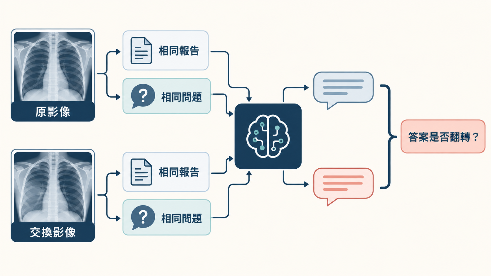

[Home](../) · [AI Papers](./)

# ModaLens：有報告可讀時，醫療 VLM 還會看影像嗎？

## 來源

- 團隊：MIT Critical Data、King’s College London、American International School Vienna、Substrate Labs、University of North Florida、University of North Carolina at Chapel Hill、Motork、Collingwood School 與 Beth Israel Deaconess Medical Center；作者為 Sebastián Andrés Cajas Ordóñez、Maximin Lange、Quang Bui、Anqi Peter Li、Felipe Ocampo Osorio、Rafi Al Attrach、Kushul Reddy Palakala、Sahil Kapadia、Zakaria Laouabdia Sellami、Xinyue Zhang、Ashley Zhang 與 Leo Anthony Celi。[(ref: main author block)](https://arxiv.org/html/2609.15635v1)
- 論文：*ModaLens: Measuring Image Sensitivity in Report-Conditioned Medical VLMs*，arXiv v1，2026-09-14。[(ref: abstract)](https://arxiv.org/abs/2609.15635)
- 識別碼：[arXiv:2609.15635](https://arxiv.org/abs/2609.15635)；[DOI: 10.48550/arXiv.2609.15635](https://doi.org/10.48550/arXiv.2609.15635)。
- 全文：[arXiv HTML](https://arxiv.org/html/2609.15635v1)；[PDF](https://arxiv.org/pdf/2609.15635v1)。

**編輯：** Colbert

ModaLens 不直接問醫療視覺語言模型（vision-language model, VLM）答得多準，而是固定報告與問題、只交換影像，量測答案究竟會不會跟著影像改變。[(ref: main §2)](https://arxiv.org/html/2609.15635v1#S2)

## 流程

圖：本書庫依論文方法繪製的編輯示意圖；圖中的胸片為合成圖像，不含病患資料，也不承載論文數值。每個 case 以原影像與交換影像各跑一次，報告和問題保持不變，再比較兩次輸出是否翻轉。[(ref: main §2)](https://arxiv.org/html/2609.15635v1#S2)

## 背景／問題

胸腔 X 光的文字報告往往已經包含問題的答案。當 VLM 同時收到影像、報告與問題，即使最後答對，也不能由正確率判斷它是否真的使用影像；模型可能只沿著報告作答。ModaLens 因此把「影像敏感度」和「答案正確性」分開：前者問影像改變時輸出是否改變，後者才問輸出是否符合視覺真值。[(ref: main §1)](https://arxiv.org/html/2609.15635v1#S1)

這個區分尤其重要，因為報告可能屬於先前檢查、可能出錯，也可能描述已經消退的 finding；反過來，若報告正確，模型依賴專業報告也不必然是錯誤。論文要稽核的是模態依賴，不是直接宣告哪一個模態「應該」獲勝。[(ref: main §1)](https://arxiv.org/html/2609.15635v1#S1) [(ref: main §5)](https://arxiv.org/html/2609.15635v1#S5)

## 方法摘要

主實驗從 MIMIC-CXR test split 形成 3,199 個 case。每個 case 保留原研究的正面胸片、報告與 14 個問題，再把影像替換成另一個研究的正面胸片；3,180 組交換發生在同一病人的不同研究，另有 19 組跨病人。原影像與交換影像共享完全相同的文字輸入。[(ref: main Table 1)](https://arxiv.org/html/2609.15635v1#S2.T1)

主要模型是 MedGemma-27B。每次交換前後，研究者比較 yes/no 輸出是否翻轉，並另外計算 `log p(yes) - log p(no)` 的連續 margin 變化。這個設計能回答「輸出對影像介入有多敏感」，但整張影像被替換，不能定位模型是否 grounding 到被詢問的 finding。[(ref: main §2)](https://arxiv.org/html/2609.15635v1#S2)

論文同時保留兩套讀出：最初的 headline prompt 沒有要求固定格式，以第一個生成位置的小寫 `yes`／`no` token 做 proxy；後續驗證則明確要求只回答 Yes 或 No，並比較小寫 token、token family 與實際生成答案。本文以後者的 generated-answer 結果作主要解讀，並把原始 headline 數值保留作敏感度分析。[(ref: main §4.1)](https://arxiv.org/html/2609.15635v1#S4.SS1) [(ref: main Appendix I)](https://arxiv.org/html/2609.15635v1#A9)

## 方法詳解

替換影像先從同一病人的其他正面 test-split 研究中抽取，優先選擇 CheXpert positive set 不同的研究；若沒有，再取同一病人的其他研究。只有 19 位只有單一研究的病人會跨病人抽取不同標籤影像。視角與拍攝時間沒有配對，因此作者另外做同視角、排除跨病人、等權重與替換 seed 的敏感度分析。[(ref: main §2)](https://arxiv.org/html/2609.15635v1#S2) [(ref: main Appendix G)](https://arxiv.org/html/2609.15635v1#A7)

14 個問題中，13 個逐一詢問 CheXpert 影像徵象（findings），另 1 個 composite question 問是否有任何 acute cardiopulmonary finding。標籤全部由報告文字衍生；uncertain 與 absent 在主分析都視為 negative。這些標籤不是獨立影像真值，連人工標註的敏感度分析也是由放射科醫師讀報告，而不是重新讀影像。[(ref: main Table 8)](https://arxiv.org/html/2609.15635v1#A1.T8) [(ref: main Appendix E)](https://arxiv.org/html/2609.15635v1#A5)

統計單位是 trial，信賴區間則以 293 位病人為 cluster 做 percentile bootstrap。all-14 主分析使用 10,000 次抽樣，其他多數比較使用 2,000 次；差值在同一個 bootstrap draw 內成對計算。[(ref: main §2)](https://arxiv.org/html/2609.15635v1#S2)

機制分析把 MedGemma-27B 的 62 層 decoder 逐層投影 yes/no margin，並對 report-token attention 做累積遮罩。作者特別限制解讀：projection 到第 46 層才可靠追上模型最終答案；attention knockout 只能界定「直接讀取報告 token 的路徑何時重要」，不能定位報告資訊在網路中的唯一儲存層。[(ref: main §4.4)](https://arxiv.org/html/2609.15635v1#S4.SS4) [(ref: main §4.5)](https://arxiv.org/html/2609.15635v1#S4.SS5) [(ref: main Appendix N)](https://arxiv.org/html/2609.15635v1#A14)

## 資料與實驗

下表完整重製論文 Table 1 的 cohort accounting。case 是一張原研究正面影像與一張替換影像；paired trial 則是 case × question。[(ref: main Table 1)](https://arxiv.org/html/2609.15635v1#S2.T1)

| 層級 | 數量 | 論文註記 |
|---|---:|---|
| Patients | 293 | 信賴區間的 resampling unit |
| Source studies | 2,816 | 其中 344 個 study 貢獻超過一個 case |
| Cases | 3,199 | 3,180 組同病人；19 組跨病人 |
| Substitute studies / images | 1,953 / 2,093 | study 最多重用 8 次；image 最多重用 6 次；376 組互為反向 pair |
| Questions per case | 14 | 13 個 finding-specific，加 1 個 composite |
| Paired trials | 44,786 | 9,347 次 asked-finding label 隨交換改變 |

下表完整重製論文 Table 3。前 3 列都使用「只回答 Yes 或 No」的明確 instruction；最後一列是沒有該 instruction 的原始 headline prompt。翻轉率與 95% CI 單位都是百分比，paired difference 是「無報告 − 有報告」的百分點。[(ref: main Table 3)](https://arxiv.org/html/2609.15635v1#S4.T3)

| Readout | 有報告 flip rate | 無報告 flip rate | Paired difference（百分點） | Ratio |
|---|---:|---:|---:|---:|
| Lowercase first token | 4.64% [4.29, 5.01] | 20.72% [19.46, 21.93] | +16.1 [14.9, 17.2] | 4.5 |
| Token families | 4.30% [3.99, 4.64] | 21.03% [19.79, 22.27] | +16.7 [15.7, 17.8] | 4.9 |
| Generated answer | 4.26% [3.95, 4.60] | 20.94% [19.70, 22.13] | +16.7 [15.6, 17.7] | 4.9 |
| Lowercase first token, headline prompt | 4.70% [4.35, 5.06] | 17.07% [15.78, 18.39] | +12.4 [11.2, 13.6] | 3.6 |

pooled 數值並不代表每個 finding 都同方向。下表完整重製論文 Table 22 的 generated-answer flip rate；前 14 列各有 3,199 cases，末列另列排除 composite 的 pooled 結果。[(ref: main Table 22)](https://arxiv.org/html/2609.15635v1#A10.T22)

| Finding | 有報告 | 無報告 | 無報告 − 有報告（百分點） |
|---|---:|---:|---:|
| Atelectasis | 6.81% | 4.63% | −2.2 |
| Cardiomegaly | 6.06% | 26.23% | +20.2 |
| Consolidation | 3.84% | 30.73% | +26.9 |
| Edema | 2.50% | 28.63% | +26.1 |
| Enlarged cardiomediastinum | 4.78% | 24.29% | +19.5 |
| Fracture | 0.78% | 7.00% | +6.2 |
| Lung lesion | 6.19% | 26.95% | +20.8 |
| Lung opacity | 5.10% | 12.38% | +7.3 |
| Pleural effusion | 5.22% | 29.60% | +24.4 |
| Pleural other | 2.31% | 21.76% | +19.5 |
| Pneumonia | 2.50% | 33.17% | +30.7 |
| Pneumothorax | 0.31% | 12.32% | +12.0 |
| Support devices | 11.03% | 1.44% | −9.6 |
| Any finding (composite) | 2.13% | 34.10% | +32.0 |
| **Pooled, 14 questions** | **4.26%** | **20.94%** | **+16.7 [15.6, 17.7]** |
| **Pooled, 13 finding-specific** | **4.42%** | **19.93%** | **+15.5 [14.5, 16.5]** |

跨模型比較使用預先依 prevalence 選出的 6 個 finding-specific questions，對每個 case 都提問，避免 one-question 設計的 label shortcut。下表完整重製論文 Table 13；每個模型有 19,194 trials，都是明確 instruction 下的 generated answer。balanced accuracy 以各影像自身研究的報告衍生標籤計算。[(ref: main Table 13)](https://arxiv.org/html/2609.15635v1#A6.T13)

| 模型 | 有報告 flip rate | 無報告 flip rate | Report effect（百分點） | 原影像 image-only balanced accuracy | 替換影像 image-only balanced accuracy | 無報告時跟隨替換標籤 |
|---|---:|---:|---:|---:|---:|---:|
| Qwen3.5-9B | 6.04% [5.5, 6.6] | 19.09% [17.1, 21.4] | +13.1 [11.2, 15.1] | 0.635 [0.620, 0.651] | 0.532 [0.519, 0.545] | 52.69% |
| Qwen3.5-27B | 6.39% [5.9, 6.9] | 23.90% [22.0, 25.9] | +17.5 [15.8, 19.3] | 0.664 [0.650, 0.678] | 0.537 [0.524, 0.551] | 49.69% |
| LLaVA-NeXT-Mistral-7B | 4.33% [3.9, 4.8] | 25.24% [24.1, 26.3] | +20.9 [19.9, 21.9] | 0.538 [0.524, 0.553] | 0.497 [0.489, 0.505] | 44.85% |

## 結果

在明確要求 Yes／No 的 all-14 實驗中，MedGemma-27B 的 generated-answer flip rate 由有報告時的 4.26% 升到無報告時的 20.94%，成對增加 16.7 個百分點，95% CI 為 [15.6, 17.7]。這支持「報告可用時，輸出對影像交換較不敏感」，但不支持「模型完全不看影像」。[(ref: main §4.1)](https://arxiv.org/html/2609.15635v1#S4.SS1)

二元答案沒有翻轉，不代表內部分數沒動。headline prompt 下，有報告時 yes/no margin 的平均絕對變化為 0.690，無報告時為 2.307；82.9% 的 trials 在無報告條件下變化更大。這顯示報告同時壓低了離散翻轉與連續分數移動。[(ref: main §4.1)](https://arxiv.org/html/2609.15635v1#S4.SS1) [(ref: main Table 17)](https://arxiv.org/html/2609.15635v1#A7.T17)

模態消融的 pooled balanced accuracy 為：影像＋報告＋問題 0.717、影像＋問題 0.665、報告＋問題 0.770、只有問題 0.500。報告 alone 在 14 個 findings 中有 9 個是最佳 cell；然而 ground truth 本身來自報告，因此加入影像後分數下降只表示偏離報告標籤，不能推論影像誤導模型。[(ref: main §4.2)](https://arxiv.org/html/2609.15635v1#S4.SS2) [(ref: main Table 20)](https://arxiv.org/html/2609.15635v1#A10.T20)

方向可在 MedGemma-4B、Qwen3.5-9B／27B 與 LLaVA-NeXT-Mistral-7B 重現，但「報告 anchoring」的重現不等於「影像能力」的重現。特別是在 label-conditioned one-question set，作者測試的模型在替換影像上都沒有呈現 above-chance reading；換成每個 case 都問同一組預先選定 questions 後，Qwen 模型在原影像的 image-only balanced accuracy 高於 0.5，替換影像仍只在 0.532–0.537。[(ref: main Appendix F)](https://arxiv.org/html/2609.15635v1#A6)

attention knockout 從 layer 0 開始時，flip rate 由 report-present baseline 1.50% 升到 7.75%，仍低於 no-report 的 12.00%；從 layer 32 開始則回到 baseline。作者把 report-specific 比較限制在 layers 0–20，並明確否定「找到唯一決策層」的解讀；steering 與跨 cohort probe transfer 也都是 negative results。[(ref: main §4.5)](https://arxiv.org/html/2609.15635v1#S4.SS5) [(ref: main §4.6)](https://arxiv.org/html/2609.15635v1#S4.SS6) [(ref: main Appendix N)](https://arxiv.org/html/2609.15635v1#A14)

## 限制

- 標籤由報告文字衍生，沒有獨立影像標註；人工敏感度分析也只是人工讀報告。研究能量測模態敏感度，不能判定何時遵循報告造成視覺錯誤。[(ref: main §5)](https://arxiv.org/html/2609.15635v1#S5)
- flip rate 是「答案是否改變」，不是 grounding、診斷正確率或臨床效益；整張影像交換也不能定位是哪個 finding 驅動變化。[(ref: main §2)](https://arxiv.org/html/2609.15635v1#S2)
- 報告可用性的核心比較只在單一機構 MIMIC-CXR test split、293 位病人、正面胸片與英文報告上完成；其他資料集沒有成對報告，無法直接檢驗同一 manipulation。[(ref: main §5)](https://arxiv.org/html/2609.15635v1#S5)
- 影像與文字的先後順序會改變 effect size：image-first headline 是 +12.4 個百分點，text-first 是 +7.8；因此不能把單一 flip rate 當成與 prompt 無關的模型屬性。[(ref: main Table 2)](https://arxiv.org/html/2609.15635v1#S2.T2)
- composite question 的 wording 與 target 不完全一致；排除後方向仍在，但 pooled 結果也掩蓋 atelectasis 與 support devices 兩個反向 findings。[(ref: main §4.1)](https://arxiv.org/html/2609.15635v1#S4.SS1) [(ref: main Table 22)](https://arxiv.org/html/2609.15635v1#A10.T22)
- 原始 headline readout 使用機率極低的小寫 first-token logits，且 prompt 沒要求 yes/no；明確 instruction 與 generated answer 驗證保留方向，卻也改變無報告條件的數值。[(ref: main Appendix I)](https://arxiv.org/html/2609.15635v1#A9)
- arXiv 摘要宣稱程式碼、提示與逐次執行紀錄位於 companion repository，但該連結在 2026-09-17 evidence review 時回傳 404；因此本文不能用該 repository 獨立核對重現材料。[(ref: abstract)](https://arxiv.org/abs/2609.15635)
- 研究是離線反事實稽核，沒有前瞻臨床流程、病人結局、公平性或錯誤嚴重度驗證；不能由本結果推論模型可安全部署。

## 與書庫其他文章的關係

MedGemma 1.5 技術報告展示同一基礎模型擴充到多種醫療模態，ModaLens 則直接稽核其 27B／4B 版本在胸片加報告時是否仍對影像交換敏感: [MedGemma 1.5：4B 模型如何讀取 3D 影像、全切片與縱向胸片？](2026-09-16-medgemma-1-5.md)

## 實務的啟發

第一，多模態系統不能只報 joint-input accuracy。至少應加入單模態消融、影像交換、文字交換與矛盾案例，分別量測輸出對每一模態的敏感度；如果 ground truth 來自其中一個模態，還要另外取得不依附該模態的標註。

第二，稽核單位應保留配對結構與臨床時間。ModaLens 的同病人交換降低了個體差異，但沒有在輸入中提供可靠 chronology；真正要測「舊報告是否壓過新影像」，應預先定義先後關係、由影像專家標註變化，並把 resolved、new、stable findings 分開報告。

第三，平均效應必須拆到 finding、prompt、readout 與模型家族。pooled +16.7 個百分點很醒目，但 atelectasis 與 support devices 反向，文字順序也改變 effect size；部署前的 failure analysis 應把這些異質性視為主要結果，而不是附錄細節。

最後，影像敏感度與影像能力要分開驗證。輸出隨影像改變可能是有效讀圖，也可能只是被不相關視覺特徵擾動；輸出不變則可能是合理依賴正確報告，也可能是忽略關鍵影像。只有配合獨立影像真值、校準與錯誤嚴重度，才能把模態稽核轉成臨床風險控制。

## References

- `main`：[ModaLens 論文 HTML](https://arxiv.org/html/2609.15635v1)；本文使用 [§2／Table 1](https://arxiv.org/html/2609.15635v1#S2.T1)、[Table 2](https://arxiv.org/html/2609.15635v1#S2.T2)、[§4.1／Table 3](https://arxiv.org/html/2609.15635v1#S4.T3)、[§5](https://arxiv.org/html/2609.15635v1#S5)、[Table 13](https://arxiv.org/html/2609.15635v1#A6.T13)、[Table 17](https://arxiv.org/html/2609.15635v1#A7.T17)、[Table 20](https://arxiv.org/html/2609.15635v1#A10.T20)、[Table 22](https://arxiv.org/html/2609.15635v1#A10.T22) 與 [Appendix N](https://arxiv.org/html/2609.15635v1#A14)。
- `abstract`：[arXiv:2609.15635](https://arxiv.org/abs/2609.15635)。
- `doi`：[10.48550/arXiv.2609.15635](https://doi.org/10.48550/arXiv.2609.15635)。

[Home](../) · [AI Papers](./)
