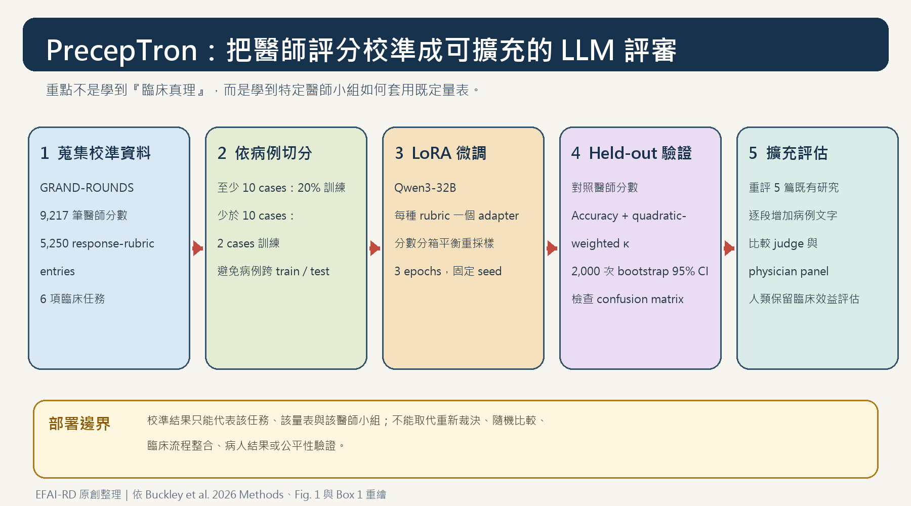

[Home](../) · [AI Papers](./)

# PrecepTron：把醫師評分學成 LLM 評審，能讓醫療 AI 評估更可重現嗎？

## 來源

- **團隊：** Harvard Medical School、Beth Israel Deaconess Medical Center、Stanford University、University of Alberta、MIT、Massachusetts General Hospital、Erasmus Medical Center、University of Maryland、VA Maryland Healthcare System、Brigham and Women’s Hospital 等 14 個單位的 17 位作者。[(ref: main p.1)](https://arxiv.org/pdf/2609.12822v1#page=1)
- **論文：** Thomas A. Buckley et al., *Scaling Clinical Judgment to Evaluate Medical AI*，arXiv:2609.12822v1，2026-09-11。[(ref: arXiv abstract)](https://arxiv.org/abs/2609.12822)
- **識別碼：** [arXiv:2609.12822](https://arxiv.org/abs/2609.12822)；[DOI: 10.48550/arXiv.2609.12822](https://doi.org/10.48550/arXiv.2609.12822)（arXiv 標示為待註冊）。
- **原文與資源：** [完整 PDF](https://arxiv.org/pdf/2609.12822v1)、[GRAND-ROUNDS 資料集](https://huggingface.co/datasets/tbuckley/GRAND-ROUNDS)、[PrecepTron 模型集合](https://huggingface.co/collections/tbuckley/preceptron)、[專案頁](https://preceptron.net/)。

**編輯：** Colbert

這篇研究的核心不是宣稱 LLM 能取代醫師判斷，而是測試：能否用少量醫師評分，把一個可在院內運行的開源模型校準成特定量表與評分小組的「可重現評審」。

## 流程

*圖：EFAI-RD 依論文的 Methods、Figure 1 與 Box 1 原創重繪。流程先收集醫師評分、以病例切分訓練與測試資料，再以 LoRA 校準 Qwen3-32B；最後必須在 held-out 病例上與醫師分數及醫師間一致度比較。[(ref: main Fig. 1)](https://arxiv.org/pdf/2609.12822v1#page=26) [(ref: main Box 1)](https://arxiv.org/pdf/2609.12822v1#page=31)*

## 背景／問題

開放式臨床推理沒有單一選項答案。過去研究常請少數醫師依量表評分模型回答，但這種流程昂貴、慢，而且換一組專科、地區或年資不同的評審，結論可能改變。直接用通用 LLM 當評審雖然容易擴充，卻可能與醫師、甚至與其他 LLM 評審彼此不一致。[(ref: main pp.3–4)](https://arxiv.org/pdf/2609.12822v1#page=3)

作者因此提出兩項資源：GRAND-ROUNDS 匯集七篇研究的醫師評分；PrecepTron 則以 Qwen3-32B 為底座，針對各量表做低秩適應（Low-Rank Adaptation, LoRA），學習特定醫師小組如何套用評分規則。模型有 320 億參數，論文稱推論可在一張 80 GB GPU 上執行，目標是讓含受保護資料的研究不必把內容送到外部 API。[(ref: main pp.4–5)](https://arxiv.org/pdf/2609.12822v1#page=4)

## 方法摘要

研究先把醫師評過的開放式回答整理成同一基準，再依「病例」而不是單筆回答切分訓練與測試集。每種量表各訓練一個 LoRA adapter；NEJM CPC 與 BIDMC ER 因共用 Bond score 而共用 adapter。至少 10 個病例的任務取 20% 病例訓練，較小任務則取 2 個病例訓練。[(ref: main pp.16–18)](https://arxiv.org/pdf/2609.12822v1#page=16)

held-out 評估同時看兩個指標：一是落在允許誤差內的 accuracy，二是校正偶然一致的 quadratic-weighted Cohen’s κ；醫師間一致度是比較基準。這使問題從「模型分數高不高」改成「評審模型能否重現該醫師小組在同一量表下的評分」。[(ref: main p.20)](https://arxiv.org/pdf/2609.12822v1#page=20)

## 方法詳解

### 1. GRAND-ROUNDS 如何組成

基準共含 9,217 筆醫師分數、5,250 筆獨特 response–rubric entries，涵蓋 160 位臨床人員與 9 個 AI 模型的回答，由 11 位醫師評分，來源跨七篇已發表研究。六項任務涵蓋診斷、處置與臨床文件；其中 CPC testing-plan 因高分嚴重偏斜，只收入資料釋出而不納入主要 judge 實驗。[(ref: main pp.16–17)](https://arxiv.org/pdf/2609.12822v1#page=16)

| 任務 | 評分尺度／用途 | 釋出 records |
|---|---|---:|
| Grey Matters management | 個別病例、多準則處置評分 | 2,765 |
| BIDMC ER | 0–5 Bond score；急診不同時間點的鑑別診斷 | 911 |
| NEJM CPC diagnosis | 0–5 Bond score；鑑別診斷 | 853 |
| NEJM Healer | 0–10 R-IDEA；臨床推理文件 | 312 |
| Landmark diagnostic | 19 點結構化診斷推理量表 | 278 |
| NEJM CPC testing plan | 0–2；檢查計畫，未進主要 judge 實驗 | 131 |

*資料表依官方資料卡與 Methods 重整；records 合計 5,250。部分病例文字受出版社著作權或受保護健康資訊限制而未釋出。[(ref: dataset card)](https://huggingface.co/datasets/tbuckley/GRAND-ROUNDS#benchmarks) [(ref: main p.21)](https://arxiv.org/pdf/2609.12822v1#page=21)*

### 2. 校準配方

LoRA 套在 Qwen3-32B 每個 transformer block 的 query、key、value、output、gate、up 與 down projection；rank 16、scaling factor 32、dropout 0.05。訓練用 AdamW、峰值 learning rate `2 × 10⁻⁴`、3% warm-up、effective batch size 4、最大序列 4,096 tokens 與 bfloat16。主要版本訓練 3 epochs，並固定 seed。[(ref: main p.19)](https://arxiv.org/pdf/2609.12822v1#page=19)

資料分數常偏向高分，作者把正規化醫師分數分為低、中、高三箱，重複抽樣較小分箱，最多放大到原大小五倍。NEJM Healer 的消融顯示，移除平衡重採樣後 accuracy 相近，但 κ 由 0.72 降到 0.51，反映預測向多數分數塌縮。[(ref: main pp.8, 19)](https://arxiv.org/pdf/2609.12822v1#page=8)

### 3. 驗證與對照

作者比較五個開源與三個 proprietary LLM judge，也測試五-shot prompting 與 GEPA prompt optimizer。主要 accuracy 對 Bond score 任務容許原始 0–5 分內差 1 分，其他任務容許正規化分數差 10%；κ 先把分數取最近整數。95% 信賴區間以 2,000 次非參數 bootstrap 估計。[(ref: main pp.18–20)](https://arxiv.org/pdf/2609.12822v1#page=18)

## 資料與實驗

主實驗在 held-out test set 比較各 judge 與醫師分數的一致度。下表完整重排論文 Table 1；每格為 **accuracy（quadratic-weighted κ）**，accuracy 的容許範圍依前述任務定義不同，不能直接視為診斷正確率。[(ref: main Table 1)](https://arxiv.org/pdf/2609.12822v1#page=32)

| Judge | NEJM CPC n=669 | Landmark n=185 | Grey Matters n=258 | NEJM Healer n=248 | BIDMC ER n=719 |
|---|---:|---:|---:|---:|---:|
| Gemma-3-12B | 87% (κ=0.61) | 55% (κ=0.66) | 17% (κ=0.60) | 69% (κ=0.42) | 89% (κ=0.59) |
| Llama-3.1-8B | 75% (κ=0.32) | 43% (κ=0.38) | 44% (κ=0.62) | 46% (κ=0.12) | 75% (κ=0.45) |
| Mistral-3-8B | 53% (κ=0.38) | 54% (κ=0.72) | 62% (κ=0.72) | 63% (κ=0.54) | 75% (κ=0.53) |
| Qwen3.5-9B | 87% (κ=0.62) | 49% (κ=0.43) | 74% (κ=0.83) | 65% (κ=0.47) | 90% (κ=0.65) |
| Qwen3-32B | 82% (κ=0.55) | 46% (κ=0.62) | 72% (κ=0.75) | 76% (κ=0.54) | 87% (κ=0.68) |
| Claude Opus 4.6 | 74% (κ=0.56) | 28% (κ=0.48) | 84% (κ=0.88) | 82% (κ=0.81) | 91% (κ=0.77) |
| Gemini 3.1 Pro | 83% (κ=0.62) | 68% (κ=0.80) | 80% (κ=0.88) | 78% (κ=0.71) | 86% (κ=0.73) |
| GPT-5 | 87% (κ=0.65) | 30% (κ=0.54) | 71% (κ=0.86) | 75% (κ=0.58) | 87% (κ=0.72) |
| **PrecepTron-32B** | **92% (κ=0.71)** | **61% (κ=0.80)** | **80% (κ=0.78)** | **81% (κ=0.80)** | **91% (κ=0.60)** |
| 醫師間基準 | 92% (κ=0.68; n=481) | 67% (κ=0.92; n=115) | 95% (κ=0.90; n=216) | 77% (κ=0.83; n=241) | 88% (κ=0.66; n=719) |

研究另以相同醫師校準資料比較 prompting：five-shot 在 NEJM Healer 由 76% 降至 67%，GEPA 在 Grey Matters 由 72% 降至 63%；兩者都沒有像 LoRA 一樣跨任務穩定改善。[(ref: main p.8)](https://arxiv.org/pdf/2609.12822v1#page=8)

為測試可擴充性，作者用 PrecepTron 重評五篇既有研究，報告稱重現了各篇的主要群組排序或趨勢；但這是重現原評分標準，不是重新執行原本的隨機比較或人機互動實驗。[(ref: main Fig. 4)](https://arxiv.org/pdf/2609.12822v1#page=29)

最後，GPT-5 與 Gemma-4-31B 只看到逐步增加的病例前綴。GPT-5 在 50 tokens 內，NEJM CPC 的 top-10 differential 已涵蓋正確診斷者為 42%，top-3 為 14%，top-1 為 12%；四個 Landmark 病例在 50 tokens 內都達到量表上限的至少 80%。作者把這解讀為現有量表可能獎勵早期 pattern matching，未必測到後續資訊整合與修正。[(ref: main pp.9–10)](https://arxiv.org/pdf/2609.12822v1#page=9)

## 結果

1. **未校準 judge 沒有跨任務穩定勝出。** 三個 proprietary judge 在部分任務達到或超過醫師間 accuracy，卻在別的任務明顯落後；Landmark task 上 Gemini 為 68%，GPT-5 與 Claude 分別只有 30% 與 28%。[(ref: main pp.6–7)](https://arxiv.org/pdf/2609.12822v1#page=6)
2. **少量任務內醫師標註能顯著改變 judge。** PrecepTron 每個任務只用 2–46 個病例訓練，五項任務相較 Qwen3-32B 提升 4–15 個百分點；其中 NEJM CPC 由 82% 到 92%，Landmark 由 46% 到 61%。[(ref: main p.7)](https://arxiv.org/pdf/2609.12822v1#page=7)
3. **accuracy 與 κ 必須一起看。** BIDMC ER 經微調後 accuracy 由 87% 升到 91%，κ 卻由 0.68 降到 0.60；只報容許誤差 accuracy 會漏掉分數分布層面的退步。[(ref: main pp.7–8)](https://arxiv.org/pdf/2609.12822v1#page=7)
4. **它重現的是評分小組，不是獨立真值。** 對先前五篇研究的重評維持主要結論，說明 panel-specific judge 可以降低換評審造成的變異；但結論能否跨醫師小組、地區或專科外推，仍需另行驗證。[(ref: main pp.12–14)](https://arxiv.org/pdf/2609.12822v1#page=12)

## 限制

1. **上限本身並不穩。** 部分 GRAND-ROUNDS 任務的醫師間一致度有限；judge 對醫師的可達一致度因而受到評分者彼此分歧限制。[(ref: main p.14)](https://arxiv.org/pdf/2609.12822v1#page=14)
2. **會繼承評審偏好與偏誤。** PrecepTron 被明確校準到每篇來源研究的醫師小組，因此重現的是那組人的評分標準，並沒有獨立重判臨床內容。[(ref: main p.14)](https://arxiv.org/pdf/2609.12822v1#page=14)
3. **小樣本校準可能漏掉 edge cases。** 2–46 個訓練病例方便部署，但稀有量表情境可能沒有出現在校準集；跨任務驗證也不能取代新任務的本地 held-out test。[(ref: main pp.14, 31)](https://arxiv.org/pdf/2609.12822v1#page=14)
4. **重評不等於重做試驗。** 研究沒有重建原論文的隨機比較、人機互動、臨床流程或病人結果，也沒有證明 judge 對安全性、公平性與臨床效益足夠。[(ref: main p.14)](https://arxiv.org/pdf/2609.12822v1#page=14)
5. **資料不是全部開放。** NEJM CPC／Healer 病例受著作權限制，BIDMC 急診病例含受保護健康資訊；官方資料卡雖提供回答、醫師分數與參考診斷，但不提供這些完整病例文字。[(ref: dataset card)](https://huggingface.co/datasets/tbuckley/GRAND-ROUNDS#case-text-availability)

## 與書庫其他文章的關係

一句話敘述關係: [醫療 LLM 評估落差：研究更嚴謹，為何證據反而更舊？](2026-09-17-medical-llm-evaluation-gap.md) 從文獻層級指出評估設計與模型新鮮度的落差；本篇則在單一研究內展示如何用醫師校準 judge 提高評分可重現性，同時保留 panel bias 與臨床效益未驗證的邊界。

## 實務的啟發

1. **先固定量表，再選 judge。** 量表、模型版本、prompt、校準資料、judge–physician 一致度與 physician–physician 一致度應同時寫進方法；只報「用了某個強模型評分」不足以重現。[(ref: main Box 1)](https://arxiv.org/pdf/2609.12822v1#page=31)
2. **資料切分單位應是病例。** 同一病例的多個回答若跨 train/test，可能讓 judge 記住病例或評分模式；這篇的 by-case split 是值得保留的最低防線。
3. **accuracy 與 κ、confusion matrix 缺一不可。** 容許誤差 accuracy 可能上升，但分數分布仍向多數類別塌縮；必須用 κ 與混淆矩陣檢查。
4. **把「可在院內跑」視為資料治理選項，不是臨床效益證明。** 單張 80 GB GPU 的本地部署可以降低把受保護資料送到外部 API 的需求，但不會自動解決評審偏誤、資安、操作治理或病人結果驗證。
5. **定期換 panel 做敏感度分析。** 若結論只在一組醫師偏好下成立，應明示；不同專科、機構或地區的小型重標註，可以檢查研究結論對評審組成有多敏感。

## References

- **main:** Buckley et al. (2026), *Scaling Clinical Judgment to Evaluate Medical AI*. [arXiv abstract](https://arxiv.org/abs/2609.12822) · [PDF](https://arxiv.org/pdf/2609.12822v1). 文內使用 pp.1、3–21、26、29、31–32。
- **dataset card:** Buckley et al., [GRAND-ROUNDS](https://huggingface.co/datasets/tbuckley/GRAND-ROUNDS)，使用 `#benchmarks` 與 `#case-text-availability`。
- **models:** Buckley et al., [PrecepTron model collection](https://huggingface.co/collections/tbuckley/preceptron)。
- **project:** Buckley et al., [PrecepTron project](https://preceptron.net/)。

[Home](../) · [AI Papers](./)
