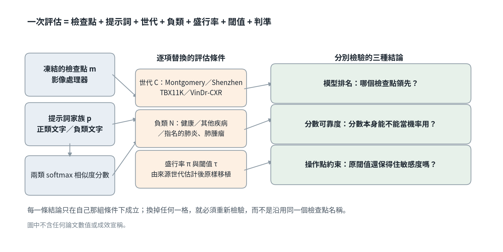

[Home](../) · [AI Papers](./)

# 稽核胸片結核篩檢的醫療 VLM：換一個評估條件，哪一種結論還站得住？

## 來源

- 團隊：Indian Institute of Technology Indore, Department of Mathematics；作者為 Mushir Akhtar、M. Tanveer 與 Mohd. Arshad。[(ref: main author block)](https://arxiv.org/html/2609.21763v1)
- 論文：*Beyond Benchmark Scores: Auditing Medical Vision-Language Models for Chest X-Ray Tuberculosis Screening*，arXiv v1，2026-09-18；27 頁、7 張圖、21 張表。[(ref: abstract)](https://arxiv.org/abs/2609.21763)
- 識別碼：[arXiv:2609.21763](https://arxiv.org/abs/2609.21763)；[DOI: 10.48550/arXiv.2609.21763](https://doi.org/10.48550/arXiv.2609.21763)。
- 全文：[arXiv HTML](https://arxiv.org/html/2609.21763v1)；[PDF](https://arxiv.org/pdf/2609.21763v1)。

**編輯：** Clare

這份稽核把「一次評估」拆成檢查點、提示詞、世代、負類、盛行率、閾值與判準七個條件，再逐格替換，看看原本的結論有哪幾條還撐得住。[(ref: main §1)](https://arxiv.org/html/2609.21763v1#S1.E1)

## 流程

圖：本書庫依論文 §1 的 evaluation specification 與 §2 的稽核順序繪製的編輯示意圖，不含論文數值或成效宣稱。檢查點與提示詞共同決定分數，世代、負類、盛行率與閾值則是被逐項替換的評估條件；三種結論分開檢驗。[(ref: main §1)](https://arxiv.org/html/2609.21763v1#S1.E1) [(ref: main §2.1)](https://arxiv.org/html/2609.21763v1#S2.SS1)

## 背景／問題

醫療 vision-language model（VLM）讓人可以不訓練本地分類器就直接重用：影像編碼器與文字編碼器把胸片和一句診斷描述投到同一個表示空間，兩者的相似度就是該任務的分數。方便之處也帶來問題——被評估的對象不再只是權重檔。提示詞、影像前處理與計分規則都直接參與預測，只報一個 checkpoint 名稱等於漏掉了分類器的一部分。[(ref: main §1)](https://arxiv.org/html/2609.21763v1#S1)

作者把一次評估寫成 `ℰ = (m, p, C, N, π, τ, r)`：`m` 是檢查點與影像處理器，`p` 是文字與聚合規則，`C` 是抽樣世代，`N` 是負類定義，`π` 是指定盛行率，`τ` 是決策閾值，`r` 是成效判準。這是一套記錄條件的標記法，不是新的預測模型；此處的 portability 指「在某個指定的變動下，原本那句結論是否保留」，而不是每個數值都不變。[(ref: main §1)](https://arxiv.org/html/2609.21763v1#S1.E1)

研究因此問四件事：領先的模型會不會隨世代與判準而換人；在影像與陽性樣本固定時，提示詞與負類光譜各自改變多少鑑別力；分數可靠度與來源端估計的操作閾值能否撐過新的盛行率假設與新的目標世代；以及一個在來源端近乎完美的監督式模型，是否就解決了轉移問題。[(ref: main §1)](https://arxiv.org/html/2609.21763v1#S1)

## 方法摘要

這是一項回溯性的 benchmark audit，端點是影像層級的 tuberculosis（TB）標籤。研究共用 12,200 筆影像紀錄：9,200 筆來自 Montgomery、Shenzhen 與 TBX11K 有標註的 training／validation split，另外 3,000 筆是 VinDr-CXR 測試延伸。四個模型乘五個提示詞家族共產生 244,000 筆分數。分析單位是影像紀錄，不是跨資料集確認過的唯一病人。[(ref: main §2.1)](https://arxiv.org/html/2609.21763v1#S2.SS1)

受測的三個醫療 VLM 是 BioMedCLIP、CheXficient 與 MedSigLIP，另加一個通用領域的 OpenCLIP 作對照。分析分區塊依序進行，每一區塊在產出結果表之前就先固定世代規則、提示詞、計分實作與分析設定；作者明說這能避免在已報告的比較裡做目標端的提示詞或閾值調校，但不等於全研究的前瞻性 preregistration。[(ref: main §2.1)](https://arxiv.org/html/2609.21763v1#S2.SS1) [(ref: main Table 2)](https://arxiv.org/html/2609.21763v1#S2.T2)

## 方法詳解

分數的定義是兩類 softmax：把每個類別的文字嵌入平均後再正規化成 prototype，用檢查點自己學到的 scale `α` 取影像與兩個 prototype 的相似度，再做二類正規化。作者強調這不是校準過的疾病機率；MedSigLIP 共用的 logit bias 在這個正規化中會被消掉，因此文中的 MedSigLIP 分數是相對的兩類 softmax，而不是它原生的獨立 sigmoid 機率。[(ref: main §2.4)](https://arxiv.org/html/2609.21763v1#S2.SS4)

五個提示詞家族的文字全部列在論文 Table 3。主家族 clinical 有四句 TB 描述與四句非 TB 描述，其餘四家族各只有一組正負句，彼此在語法、負類概念與 ensemble 大小上都不同。作者因此把這一段稱為 prompt-family sensitivity analysis，而不是把所有效果都歸給「換個說法」——「正常胸片」與「這張異常胸片上沒有 TB」在語意上本來就不是同一件事。[(ref: main Table 3)](https://arxiv.org/html/2609.21763v1#S2.T3)

負類光譜的對照設計在 TBX11K validation 上最乾淨：同一批 200 張 TB 影像，分別對 800 張 healthy 與 800 張 sick non-TB 控制計分，兩組的 TB 盛行率都是 20%，因此改變的只有負類組成。VinDr-CXR 則把替代診斷指名出來，用同一批 164 張 TB 影像分別對 no-finding、pneumonia 與 lung tumor 控制比較。[(ref: main §2.5)](https://arxiv.org/html/2609.21763v1#S2.SS5)

閾值移植的規則是：在來源世代取「敏感度至少 0.95 的最高觀察閾值」，原樣搬到目標世代，四個模型乘四個目標共 16 次移植。retention 只看目標端的點估計是否達到 0.95，不要求信賴區間下界；作者同時提醒目標端的 specificity 對解讀是必要的，因為把幾乎所有影像都判成 TB 也能保住敏感度。[(ref: main §2.8)](https://arxiv.org/html/2609.21763v1#S2.SS8)

監督式對照是以 ImageNet-1K V2 初始化的 ResNet-50，在 TBX11K training 的 80%／20% 固定切分上以五個 seed 訓練，官方 validation 完全不參與 checkpoint 選擇。跨資料集的重疊篩檢則用 SHA256 位元雜湊加 64-bit perceptual hash，Hamming distance ≤ 4 視為候選；作者明確說 perceptual similarity 只是篩檢訊號，沒有放射科醫師或獨立影像身分裁定，因此保守排除所有被牽連的影像，但不宣告任何一對是確認的重複。[(ref: main §2.9)](https://arxiv.org/html/2609.21763v1#S2.SS9) [(ref: main §2.10)](https://arxiv.org/html/2609.21763v1#S2.SS10)

暴露問題被單獨處理。CheXficient 的模型報告明列 VinDr-CXR 為訓練來源，因此它在 VinDr 上的結果被標記為 documented dataset exposure，只能當同資料集的壓力測試，不能當獨立外部驗證；其他檢查點沒有記載直接使用這些評估資料，但大型網頁、科學插圖與非公開語料讓成員資格無法完整稽核，而「沒有記載」不等於「已證明獨立」。[(ref: main §2.12)](https://arxiv.org/html/2609.21763v1#S2.SS12)

## 資料與實驗

下表完整重製論文 Table 1 的世代組成。百分比是該世代的 TB 比例；計數單位是影像紀錄而非跨世代確認的唯一病人。[(ref: main Table 1)](https://arxiv.org/html/2609.21763v1#S2.T1)

| 世代 | 非 TB 組成 | TB | 非 TB | TB (%) | 角色 |
|---|---|---:|---:|---:|---|
| Montgomery | Normal | 58 | 80 | 42.0 | 外部比較 |
| Shenzhen | Normal | 336 | 326 | 50.8 | 外部比較 |
| TBX11K validation | 800 healthy；800 sick | 200 | 1,600 | 11.1 | 主要基準 |
| TBX11K training | 3,000 healthy；3,000 sick | 600 | 6,000 | 9.1 | 來源與複製 |
| VinDr-CXR test | No finding；其他 findings | 164 | 2,836 | 5.5 | 指名疾病延伸 |

VinDr-CXR 用的是 version 1.0.0 測試集的 global image-level 標註，來自兩家越南醫院、由五位放射科醫師共識標註。下載到的標籤有 164 筆 TB、2,051 筆 no finding、246 筆 pneumonia、80 筆 lung tumor 與 2 筆 COPD，彼此並不互斥；只保留 TB 陰性者之後，得到 210 筆 pneumonia 與 73 筆 lung-tumor 控制，COPD 因樣本過小只作描述。[(ref: main §2.2)](https://arxiv.org/html/2609.21763v1#S2.SS2)

下表完整重製論文 Table 4 的主要 clinical-prompt 結果。Brier、ECE15 與 AURC 都是愈低愈好；AUPRC 隨盛行率變動，不能跨世代直接比較。[(ref: main Table 4)](https://arxiv.org/html/2609.21763v1#S3.T4)

| 世代 | 模型 | AUROC [95% CI] | AUPRC | Brier | ECE15 | AURC |
|---|---|---|---:|---:|---:|---:|
| Montgomery | CheXficient | 0.969 [0.925, 0.998] | 0.976 | 0.133 | 0.183 | 0.081 |
| Montgomery | MedSigLIP | 0.976 [0.945, 0.998] | 0.979 | 0.101 | 0.181 | 0.039 |
| Montgomery | BioMedCLIP | 0.890 [0.826, 0.947] | 0.905 | 0.173 | 0.200 | 0.108 |
| Montgomery | OpenCLIP | 0.610 [0.515, 0.706] | 0.522 | 0.293 | 0.232 | 0.501 |
| Shenzhen | CheXficient | 0.950 [0.932, 0.965] | 0.959 | 0.197 | 0.247 | 0.120 |
| Shenzhen | MedSigLIP | 0.907 [0.884, 0.928] | 0.921 | 0.157 | 0.148 | 0.104 |
| Shenzhen | BioMedCLIP | 0.813 [0.778, 0.843] | 0.846 | 0.299 | 0.315 | 0.224 |
| Shenzhen | OpenCLIP | 0.623 [0.579, 0.664] | 0.599 | 0.271 | 0.164 | 0.411 |
| TBX11K val. | CheXficient | 0.795 [0.755, 0.834] | 0.436 | 0.099 | 0.089 | 0.068 |
| TBX11K val. | MedSigLIP | 0.800 [0.771, 0.829] | 0.318 | 0.171 | 0.257 | 0.204 |
| TBX11K val. | BioMedCLIP | 0.742 [0.706, 0.778] | 0.307 | 0.148 | 0.131 | 0.141 |
| TBX11K val. | OpenCLIP | 0.564 [0.523, 0.606] | 0.131 | 0.413 | 0.561 | 0.874 |
| VinDr-CXR | CheXficient（有暴露） | 0.878 [0.853, 0.902] | 0.286 | 0.075 | 0.106 | 0.030 |
| VinDr-CXR | MedSigLIP | 0.829 [0.799, 0.856] | 0.207 | 0.146 | 0.282 | 0.169 |
| VinDr-CXR | BioMedCLIP | 0.713 [0.669, 0.752] | 0.149 | 0.120 | 0.138 | 0.118 |
| VinDr-CXR | OpenCLIP | 0.528 [0.486, 0.571] | 0.059 | 0.432 | 0.615 | 0.942 |

下表完整重製論文 Table 9 的成對負類光譜推論。四組都用同一批 200 張 TB 影像與 800 張控制，loss 是 healthy-control AUROC 減 sick-control AUROC，Holm 校正涵蓋四個模型。[(ref: main Table 9)](https://arxiv.org/html/2609.21763v1#S3.T9)

| 模型 | Healthy | Sick non-TB | AUROC loss [95% CI] | Holm p |
|---|---:|---:|---|---:|
| CheXficient | 0.865 | 0.725 | 0.140 [0.117, 0.163] | 0.0004 |
| MedSigLIP | 0.953 | 0.647 | 0.306 [0.271, 0.344] | 0.0004 |
| BioMedCLIP | 0.872 | 0.611 | 0.261 [0.231, 0.292] | 0.0004 |
| OpenCLIP | 0.602 | 0.527 | 0.075 [0.048, 0.103] | 0.0004 |

下表完整重製論文 Table 10 的 VinDr-CXR 指名負類結果。三組共用同一批 164 張 TB 影像，控制數分別是 2,051、210 與 73。[(ref: main Table 10)](https://arxiv.org/html/2609.21763v1#S3.T10)

| 模型 | No finding [95% CI] | Pneumonia [95% CI] | Lung tumor [95% CI] |
|---|---|---|---|
| CheXficient（有暴露） | 0.945 [0.924, 0.964] | 0.466 [0.404, 0.524] | 0.372 [0.302, 0.444] |
| MedSigLIP | 0.918 [0.893, 0.942] | 0.331 [0.277, 0.388] | 0.380 [0.311, 0.451] |
| BioMedCLIP | 0.780 [0.741, 0.819] | 0.334 [0.275, 0.392] | 0.306 [0.237, 0.380] |
| OpenCLIP | 0.525 [0.481, 0.571] | 0.535 [0.474, 0.590] | 0.550 [0.468, 0.628] |

下表完整重製論文 Table 15 的閾值移植結果。閾值取自 6,600 張 TBX11K training 影像、以 95% 敏感度為約束，搬到目標端後不再調整；Retains 只看目標端敏感度的點估計是否 ≥ 0.95。[(ref: main Table 15)](https://arxiv.org/html/2609.21763v1#S3.T15)

| 目標 | 模型 | Sensitivity [95% CI] | Specificity [95% CI] | Retains |
|---|---|---|---|---|
| Montgomery | CheXficient | 0.966 [0.914, 1.000] | 0.863 [0.787, 0.963] | Yes |
| Montgomery | MedSigLIP | 0.914 [0.845, 0.983] | 0.938 [0.863, 1.000] | No |
| Montgomery | BioMedCLIP | 0.879 [0.776, 0.948] | 0.738 [0.613, 0.838] | No |
| Montgomery | OpenCLIP | 0.931 [0.828, 1.000] | 0.075 [0.025, 0.188] | No |
| Shenzhen | CheXficient | 0.932 [0.884, 0.958] | 0.764 [0.690, 0.853] | No |
| Shenzhen | MedSigLIP | 0.872 [0.830, 0.926] | 0.745 [0.641, 0.816] | No |
| Shenzhen | BioMedCLIP | 0.854 [0.804, 0.899] | 0.534 [0.445, 0.595] | No |
| Shenzhen | OpenCLIP | 0.976 [0.952, 0.997] | 0.043 [0.015, 0.083] | Yes |
| TBX11K val. | CheXficient | 0.930 [0.890, 0.965] | 0.159 [0.104, 0.268] | No |
| TBX11K val. | MedSigLIP | 0.920 [0.875, 0.955] | 0.484 [0.393, 0.535] | No |
| TBX11K val. | BioMedCLIP | 0.940 [0.895, 0.970] | 0.268 [0.200, 0.321] | No |
| TBX11K val. | OpenCLIP | 0.960 [0.930, 0.995] | 0.026 [0.012, 0.050] | Yes |
| VinDr-CXR | CheXficient（有暴露） | 0.976 [0.951, 0.994] | 0.354 [0.336, 0.372] | Yes |
| VinDr-CXR | MedSigLIP | 0.939 [0.902, 0.976] | 0.419 [0.401, 0.437] | No |
| VinDr-CXR | BioMedCLIP | 0.909 [0.866, 0.951] | 0.281 [0.265, 0.298] | No |
| VinDr-CXR | OpenCLIP | 0.933 [0.890, 0.970] | 0.099 [0.088, 0.110] | No |

下表完整重製論文 Table 18 的監督式 ResNet-50 結果。SD 描述五個 seed 在同一切分上的訓練變異，不是抽樣信賴區間；其餘欄位描述平均分數 ensemble。[(ref: main Table 18)](https://arxiv.org/html/2609.21763v1#S3.T18)

| 世代 | Seed AUROC mean ± SD | Ensemble AUROC | AUPRC | Brier | AURC |
|---|---|---:|---:|---:|---:|
| TBX11K val. | 0.997 ± 0.001 | 0.999 | 0.993 | 0.008 | 0.000 |
| Shenzhen | 0.630 ± 0.075 | 0.629 | 0.691 | 0.402 | 0.346 |
| Montgomery | 0.615 ± 0.035 | 0.629 | 0.583 | 0.269 | 0.323 |

## 結果

沒有一個模型在所有世代與所有判準上都領先。MedSigLIP 在 Montgomery（0.976 對 0.969）與 TBX11K validation（0.800 對 0.795）的 AUROC 點估計較高，但成對差的 95% CI 分別是 −0.007 到 0.027 與 −0.023 到 0.032，既沒有解出差異，也不構成等價；在 Shenzhen 則換成 CheXficient 領先 0.043（0.025 到 0.061）。[(ref: main §3.1)](https://arxiv.org/html/2609.21763v1#S3.SS1)

排名之外的分數品質又是另一回事。MedSigLIP 在 Montgomery 與 Shenzhen 的 Brier 較低（0.101 對 0.133、0.157 對 0.197），CheXficient 則在 TBX11K validation 較低（0.099 對 0.171），AURC 也是 0.068 對 0.204。也就是說，那個未解出的微小 AUROC 差距，和相當可觀的分數誤差與 confidence-based deferral 差距是同時存在的。[(ref: main §3.1)](https://arxiv.org/html/2609.21763v1#S3.SS1) [(ref: main Table 5)](https://arxiv.org/html/2609.21763v1#S3.T5)

提示詞的效果依模型與世代而異。48 組主要 AUROC 對照中，21 組通過 Benjamini-Hochberg 校正（未校正則是 24 組）。BioMedCLIP 的 report-style 家族在 Montgomery 拿到 0.903（clinical 為 0.890），到 Shenzhen 卻掉到 0.728（clinical 為 0.813）；CheXficient 在 TBX11K validation 的 report-style 由 0.795 升到 0.835，presence/absence 家族卻掉到 0.622，而 OpenCLIP 在同一世代剛好相反，由 0.564 升到 0.692。把五個家族的分數等權平均也不是解方：在 12 個原始主要 model-cohort cell 中，AUROC 只有 5 格上升，Brier 有 8 格下降。[(ref: main §3.2)](https://arxiv.org/html/2609.21763v1#S3.SS2) [(ref: main Table 6)](https://arxiv.org/html/2609.21763v1#S3.T6) [(ref: main Table 7)](https://arxiv.org/html/2609.21763v1#S3.T7)

一個描述性的平方和分解說明了為什麼「提示詞影響很小」是誤讀：AUROC 的變異有 76.6% 歸於模型主效果、10.9% 歸於世代、只有 0.8% 歸於提示詞主效果，但 Brier 的 model×prompt 交互作用佔 24.4%、ECE15 佔 30.0%。提示詞的主效果小，是因為不同模型與世代的方向彼此相消。作者標明這個分解每格只有一個觀測值、沒有獨立殘差，只是總結這個有限矩陣。[(ref: main Table 8)](https://arxiv.org/html/2609.21763v1#S3.T8)

負類換人之後，難度整個改變。固定同一批 TB 影像、把 healthy 控制換成 sick non-TB 控制，四個模型的 AUROC 全部下降，幅度 0.075 至 0.306，四個成對區間都不含 0，Holm 校正後的 permutation p 值都約 0.0004。deferral 也跟著惡化：MedSigLIP 的 AURC 由 0.017 升到 0.447，BioMedCLIP 由 0.046 升到 0.315，CheXficient 由 0.071 升到 0.154。[(ref: main §3.3)](https://arxiv.org/html/2609.21763v1#S3.SS3)

VinDr-CXR 把替代診斷指名出來後落差更明顯。CheXficient 對 no-finding 控制是 0.945，對 pneumonia 是 0.466、對 lung tumor 是 0.372；MedSigLIP 由 0.918 掉到 0.331 與 0.380；BioMedCLIP 由 0.780 掉到 0.334 與 0.306。六個醫療模型的指名疾病點估計都低於 0.5，不過 CheXficient 的 pneumonia 區間（0.404–0.524）含 0.5。分數方向在評估前就固定，事後反轉會定義出一個新的、未驗證的分類器。[(ref: main §3.3)](https://arxiv.org/html/2609.21763v1#S3.SS3) [(ref: main Table 11)](https://arxiv.org/html/2609.21763v1#S3.T11)

指定盛行率會改變分數可靠度的比較，而完全不動分數本身。在 50% 指定 TB 盛行率下，CheXficient 的 Brier 高於 MedSigLIP：Montgomery 高 0.042（95% CI 0.013–0.074）、Shenzhen 高 0.038（0.027–0.050）、TBX11K validation 高 0.024（0.006–0.041）；把盛行率改成 10%，三個世代的點估計排序全部反轉。盛行率也救不了負類問題：CheXficient 在 VinDr-CXR、10% 盛行率下對 no-finding 的 Brier 是 0.039，對 pneumonia 是 0.419，對 lung tumor 是 0.525。[(ref: main §3.4)](https://arxiv.org/html/2609.21763v1#S3.SS4) [(ref: main Table 12)](https://arxiv.org/html/2609.21763v1#S3.T12)

來源端的敏感度約束很少原樣存活：16 次移植只有 4 次在目標端保住 0.95。而且「保住」本身可能是假象——OpenCLIP 在 Shenzhen 與 TBX11K validation 保住約束時，specificity 分別只有約 0.043 與 0.026，等於把幾乎所有非 TB 影像都判成陽性。CheXficient 在 VinDr-CXR 的敏感度 0.976、對全部非 TB 控制的 specificity 0.354，但對 pneumonia 只有 0.005、對 lung tumor 是 0.000，也就是 210 張肺炎控制只正確排除 1 張、73 張腫瘤控制一張都沒有。改用 Shenzhen 當來源時，8 次移植有 4 次保住，這說明來源族群本身就是宣稱的一部分。反過來用 95% specificity 當來源約束，16 個目標點估計有 11 個保住該約束，但敏感度落在 0.000 到 0.451 之間。[(ref: main §3.5)](https://arxiv.org/html/2609.21763v1#S3.SS5) [(ref: main Table 14)](https://arxiv.org/html/2609.21763v1#S3.T14) [(ref: main Table 16)](https://arxiv.org/html/2609.21763v1#S3.T16) [(ref: main Table 17)](https://arxiv.org/html/2609.21763v1#S3.T17)

監督式路線也沒有繞過這個問題。ResNet-50 在 TBX11K validation 的五 seed 平均 AUROC 是 0.997（SD 約 0.001），ensemble 為 0.999，同一個 ensemble 到 Shenzhen 與 Montgomery 都只有 0.629。重疊篩檢在被檢材料中找不到位元完全相同的影像對，但找到 249 組 perceptual 候選、牽涉 313 張評估影像；保守排除後重訓，ensemble 在保留的 Shenzhen 與 Montgomery 分別是 0.7335 與 0.6779，對照同一批保留影像上的原 ensemble（0.6329、0.6266），成對差為 0.1006（0.0732–0.1282）與 0.0513（0.0024–0.1041）。不過 seed 層級的變化平均只有 0.075（SD 0.130）與 0.033（SD 0.077），五個 seed 中各有兩個在外部世代下降，剩餘的來源對外部落差仍有約 0.266 與 0.321 AUROC。[(ref: main §3.6)](https://arxiv.org/html/2609.21763v1#S3.SS6) [(ref: main Table 19)](https://arxiv.org/html/2609.21763v1#S3.T19) [(ref: main Table 20)](https://arxiv.org/html/2609.21763v1#S3.T20)

## 限制

- 全部實驗都只針對胸片的 TB 標籤，是單一任務的示範；其他疾病、模態或臨床行動是否有相同效果，本研究不能證明。Montgomery 樣本小，VinDr 的指名控制組樣本也有限。[(ref: main §4.7)](https://arxiv.org/html/2609.21763v1#S4.SS7)
- 各資料集沒有統一到共同的微生物學 TB 參考標準，VinDr-CXR 的標籤描述的是放射影像印象。低於 0.5 的指名疾病估計刻畫的是固定分類器下的相對排序，不是臨床誤診率。[(ref: main §2.2)](https://arxiv.org/html/2609.21763v1#S2.SS2) [(ref: main §4.7)](https://arxiv.org/html/2609.21763v1#S4.SS7)
- 預訓練獨立性無法完整觀察。CheXficient 有記載的 VinDr-CXR 暴露，其他檢查點的語料成員資格無法重建；雜湊篩檢不涵蓋 VinDr-CXR、沒有裁定程序，位元不相同也不排除重新編碼的副本。[(ref: main §2.12)](https://arxiv.org/html/2609.21763v1#S2.SS12) [(ref: main §4.7)](https://arxiv.org/html/2609.21763v1#S4.SS7)
- 不確定性有多層。影像層級 bootstrap 沒有捕捉未知的病人叢集、機構抽樣或重複部署；前後區塊採用不同的重抽樣設計；VinDr 的閾值區間固定來源閾值，因此不含其估計不確定性；五個 seed 只量到監督式變異的一部分。[(ref: main §2.11)](https://arxiv.org/html/2609.21763v1#S2.SS11) [(ref: main §4.7)](https://arxiv.org/html/2609.21763v1#S4.SS7)
- 實作細節限制可重現性。MedSigLIP 的分數是共用的相對兩類 softmax，不是它原生的 sigmoid 輸出，resize 也採 Hugging Face AutoProcessor 而非 model card 參考結果使用的 TensorFlow/Big Vision resize；部分檢查點缺少不可變的 repository revision 紀錄。[(ref: main §2.3)](https://arxiv.org/html/2609.21763v1#S2.SS3)
- 研究沒有評估在地重新校準或調適後的系統，也沒有測量族群公平性或人機互動；候選排除實驗無法估計「確認的 leakage 被移除」的因果效果。[(ref: main §4.4)](https://arxiv.org/html/2609.21763v1#S4.SS4) [(ref: main §4.5)](https://arxiv.org/html/2609.21763v1#S4.SS5)
- 這是回溯性的離線稽核，不含前瞻篩檢流程、病人結局或效益與傷害評估；高回溯性鑑別力不會自動帶來這些結論。[(ref: main §4.6)](https://arxiv.org/html/2609.21763v1#S4.SS6)

## 與書庫其他文章的關係

本研究稽核的 MedSigLIP 正是該技術報告所屬模型家族的醫療影像文字編碼器，兩篇一篇報能力擴充、一篇問這些能力在換條件後還剩多少: [MedGemma 1.5：4B 模型如何讀取 3D 影像、全切片與縱向胸片？](2026-09-16-medgemma-1-5.md)

ModaLens 固定文字、只換影像來量測模態依賴，本研究則固定影像、改換提示詞與負類，兩者從不同方向拆解「一個分數到底在測什麼」: [ModaLens：有報告可讀時，醫療 VLM 還會看影像嗎？](2026-09-17-modalens-image-sensitivity.md)

跨基準的能力盤點回答醫療 VLM 目前走到哪裡，本研究則指出同一批分數換個評估條件後排名與操作點都可能改寫: [醫療 VLM 走了多遠？七套基準下的模型規模、領域微調與推理落差](2026-09-15-medical-vlm-benchmark.md)

膀胱鏡研究把同一組關注點（提示詞、校準、操作門檻）移到通用多模態 LLM 與內視鏡影像上，並加入棄答層來交換覆蓋率: [膀胱鏡影像交給通用多模態 LLM：提示詞與棄答門檻能換到多少可靠度？](2026-09-21-mllm-cystoscopy-bladder-triage.md)

## 實務的啟發

第一，把「可攜性宣稱」寫成一句可檢查的句子。論文 Table 21 把失效模式翻成六個必答問題：哪一組權重、處理器、計分映射與文字構成分類器；哪個場域與參考標籤支持結果；控制組是健康人、廣義異常還是指名的競爭疾病；用哪個盛行率與可靠度指標；原樣移植的閾值是否同時保住敏感度與可用的 specificity；以及什麼被重抽樣、什麼被固定、已知的資料暴露是什麼。作者說明這不是驗證過的 checklist，也不能取代前瞻臨床評估。[(ref: main Table 21)](https://arxiv.org/html/2609.21763v1#S4.T21)

第二，院內驗證要先設計負類，再談分數。拿醫療 VLM 做院內試評時，若對照組只有健康影像，得到的數字幾乎必然高估；把院內真實會進到同一條流程的其他疾病放進控制組，才會看到模型是否只是在偵測「general abnormality」。本書庫建議把「TB 對正常」與「TB 對其他胸腔疾病」當成兩個不同任務分別報告，而不是只報一個彙總 AUROC。

第三，閾值不能跟著模型一起搬。來源端估出來的 cutoff 在目標端可能既保不住敏感度、又把 specificity 壓到近乎零。採購或導入時，操作點應視為需要在地估計與在地驗證的獨立物件；若打算在地重新校準，那是一個新的規格，需要自己的開發集、選擇政策與驗證集。

最後，近乎完美的內部驗證分數應該被當成警訊而非里程碑。同一個 ResNet-50 在來源 split 上的 ensemble AUROC 是 0.999、到兩個外部世代都只有 0.629，而保守排除疑似重疊影像後落差也只縮小、沒有消失。內部分數愈高，愈需要交代外部世代、負類光譜與資料暴露；否則那個數字描述的只是資料切分本身。

## References

- `main`：[Beyond Benchmark Scores 論文 HTML](https://arxiv.org/html/2609.21763v1)；本文使用 [§1／Eq. 1](https://arxiv.org/html/2609.21763v1#S1.E1)、[§2.1](https://arxiv.org/html/2609.21763v1#S2.SS1)、[§2.2](https://arxiv.org/html/2609.21763v1#S2.SS2)、[§2.3](https://arxiv.org/html/2609.21763v1#S2.SS3)、[§2.4](https://arxiv.org/html/2609.21763v1#S2.SS4)、[§2.5](https://arxiv.org/html/2609.21763v1#S2.SS5)、[§2.8](https://arxiv.org/html/2609.21763v1#S2.SS8)、[§2.9](https://arxiv.org/html/2609.21763v1#S2.SS9)、[§2.10](https://arxiv.org/html/2609.21763v1#S2.SS10)、[§2.11](https://arxiv.org/html/2609.21763v1#S2.SS11)、[§2.12](https://arxiv.org/html/2609.21763v1#S2.SS12)、[Table 1](https://arxiv.org/html/2609.21763v1#S2.T1)、[Table 2](https://arxiv.org/html/2609.21763v1#S2.T2)、[Table 3](https://arxiv.org/html/2609.21763v1#S2.T3)、[§3.1](https://arxiv.org/html/2609.21763v1#S3.SS1)、[Table 4](https://arxiv.org/html/2609.21763v1#S3.T4)、[Table 5](https://arxiv.org/html/2609.21763v1#S3.T5)、[§3.2](https://arxiv.org/html/2609.21763v1#S3.SS2)、[Table 6](https://arxiv.org/html/2609.21763v1#S3.T6)、[Table 7](https://arxiv.org/html/2609.21763v1#S3.T7)、[Table 8](https://arxiv.org/html/2609.21763v1#S3.T8)、[§3.3](https://arxiv.org/html/2609.21763v1#S3.SS3)、[Table 9](https://arxiv.org/html/2609.21763v1#S3.T9)、[Table 10](https://arxiv.org/html/2609.21763v1#S3.T10)、[Table 11](https://arxiv.org/html/2609.21763v1#S3.T11)、[§3.4](https://arxiv.org/html/2609.21763v1#S3.SS4)、[Table 12](https://arxiv.org/html/2609.21763v1#S3.T12)、[§3.5](https://arxiv.org/html/2609.21763v1#S3.SS5)、[Table 14](https://arxiv.org/html/2609.21763v1#S3.T14)、[Table 15](https://arxiv.org/html/2609.21763v1#S3.T15)、[Table 16](https://arxiv.org/html/2609.21763v1#S3.T16)、[Table 17](https://arxiv.org/html/2609.21763v1#S3.T17)、[§3.6](https://arxiv.org/html/2609.21763v1#S3.SS6)、[Table 18](https://arxiv.org/html/2609.21763v1#S3.T18)、[Table 19](https://arxiv.org/html/2609.21763v1#S3.T19)、[Table 20](https://arxiv.org/html/2609.21763v1#S3.T20)、[§4.4](https://arxiv.org/html/2609.21763v1#S4.SS4)、[§4.5](https://arxiv.org/html/2609.21763v1#S4.SS5)、[§4.6](https://arxiv.org/html/2609.21763v1#S4.SS6)、[Table 21](https://arxiv.org/html/2609.21763v1#S4.T21) 與 [§4.7](https://arxiv.org/html/2609.21763v1#S4.SS7)。
- `abstract`：[arXiv:2609.21763](https://arxiv.org/abs/2609.21763)。
- `doi`：[10.48550/arXiv.2609.21763](https://doi.org/10.48550/arXiv.2609.21763)。

[Home](../) · [AI Papers](./)
