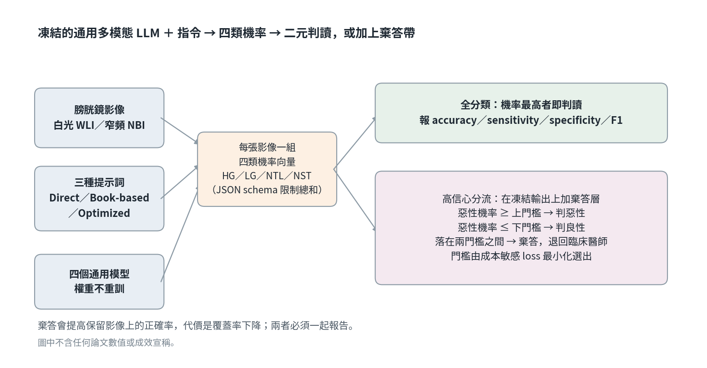

[Home](../) · [AI Papers](./)

# 膀胱鏡影像交給通用多模態 LLM：提示詞與棄答門檻能換到多少可靠度？

## 來源

- 團隊：Sheba Medical Center 泌尿科與 ARC Innovation Center、Tel-Aviv University Gray Faculty of Medical and Health Sciences、Reichman University The Dina Recanati School of Medicine（以色列）；作者為 Yonatan Prat、Husny Mahmud、Abraham Tsur、Menachem Laufer、Dina Orkin、Zohar A. Dotan 與 Barak Rosenzweig。[(ref: main author block)](https://pmc.ncbi.nlm.nih.gov/articles/PMC13585802/)
- 論文：*Multimodal large language models for bladder tumor detection in cystoscopy: a retrospective benchmarking study*，*World Journal of Urology* 44(1): 670；2026-06-12 收稿、2026-09-01 接受、2026-09-17 線上刊出；CC BY 4.0。[(ref: main front matter)](https://pmc.ncbi.nlm.nih.gov/articles/PMC13585802/)
- 識別碼：[DOI: 10.1007/s00345-026-06761-y](https://doi.org/10.1007/s00345-026-06761-y)；PMID 42752986；PMCID PMC13585802。
- 全文：[PMC 開放取用全文](https://pmc.ncbi.nlm.nih.gov/articles/PMC13585802/)；[Europe PMC 條目](https://europepmc.org/article/MED/42752986)。

**編輯：** Clare

這篇研究不訓練新模型，只換提示詞與加一層棄答規則，再問通用多模態大型語言模型分類膀胱鏡影像時，正確率、信心校準與可保留的覆蓋率各自變成什麼樣子。[(ref: main §Study design)](https://pmc.ncbi.nlm.nih.gov/articles/PMC13585802/#Sec3)

## 流程

圖：本書庫依論文 Methods 章節繪製的編輯示意圖，不含論文數值、病患影像或成效宣稱。模型權重全程凍結，變動的只有提示詞與後置的棄答門檻；全分類與高信心分流是同一批輸出的兩種讀法。[(ref: main §Study design)](https://pmc.ncbi.nlm.nih.gov/articles/PMC13585802/#Sec3) [(ref: main §High-confidence triage)](https://pmc.ncbi.nlm.nih.gov/articles/PMC13585802/#Sec12)

## 背景／問題

膀胱癌是全球第十常見的惡性腫瘤，也是男性第六常見的癌症；約 75% 的病例屬於非肌肉侵犯型膀胱癌（non–muscle-invasive bladder cancer, NMIBC），復發率高，需要長期且密集的內視鏡追蹤。膀胱鏡因此同時承擔初次診斷、治療處置與後續追蹤三種角色。[(ref: main §Introduction)](https://pmc.ncbi.nlm.nih.gov/articles/PMC13585802/#Sec1)

判讀本身卻不穩定。窄頻影像（narrow-band imaging, NBI）能改善部分病灶的偵測，但實務障礙讓它無法普及；多數診間仍以白光影像（white-light imaging, WLI）為預設，而 WLI 對膀胱腫瘤已知有 10% 到 30% 的漏檢率，直接連到切除不完全與早期復發。作者因此認為，能把 WLI 與 NBI 的判斷標準拉齊的系統特別有價值。[(ref: main §Introduction)](https://pmc.ncbi.nlm.nih.gov/articles/PMC13585802/#Sec1)

過去十年的電腦視覺系統在多中心研究中已達到相當高的準確度，但都依賴大量且經過整理的標註資料與可觀的工程投入，形成快速迭代、跨域轉移與標準化的門檻。多模態大型語言模型（multimodal large language model, MLLM）提供另一條路：只靠指令就能調整行為。缺口在於，混合 WLI／NBI 的實際條件下，MLLM 用於膀胱鏡影像分類的可靠度證據有限；而提示詞工程（prompt engineering, PE）雖已知會影響 LLM 表現，它對膀胱鏡任務的影響、尤其是對校準的影響，尚未被系統性評估。[(ref: main §Introduction)](https://pmc.ncbi.nlm.nih.gov/articles/PMC13585802/#Sec1)

## 方法摘要

這是一項回溯性的 head-to-head 評估：四個通用 MLLM（GPT-5.2、GPT-5、GPT-5-Mini、GPT-5-Nano）搭配三種提示詞策略（P-1 Direct、P-2 Book-based、P-3 Optimized），共 12 種推論條件，套用在 1,754 張公開膀胱鏡影像上，產生 21,048 次影像分類。[(ref: main §Study design)](https://pmc.ncbi.nlm.nih.gov/articles/PMC13585802/#Sec3) [(ref: main §AI model and prompting strategies)](https://pmc.ncbi.nlm.nih.gov/articles/PMC13585802/#Sec5)

每張影像輸出一組四類機率向量（HG、LG、NTL、NST），以明確的 JSON output schema 限制總和為 100%。主要結果是二元分類：malignant = HG ∪ LG，benign = NST ∪ NTL；次要結果為信心校準、高信心分流與依影像模態分層的表現。[(ref: main §AI model and prompting strategies)](https://pmc.ncbi.nlm.nih.gov/articles/PMC13585802/#Sec5) [(ref: main §Primary outcome)](https://pmc.ncbi.nlm.nih.gov/articles/PMC13585802/#Sec7)

## 方法詳解

資料來自公開的 Endoscopic Bladder Tissue Classification Dataset：23 位接受經尿道膀胱腫瘤切除術（transurethral resection of bladder tumor, TURBT）病人的 1,754 張標註影像，由泌尿科專家檢視後，再以切除病灶的病理資訊標註，標籤遵循膀胱癌文獻慣用的 WHO/ISUP 分類。影像同時含 WLI 與 NBI 兩種模態。[(ref: main §Dataset)](https://pmc.ncbi.nlm.nih.gov/articles/PMC13585802/#Sec4)

三種提示詞是遞增的複雜度。P-1 是 zero-shot 基準：要模型扮演泌尿科醫師並回傳四類機率分布，不給推理指引也不給範例。P-2 在 P-1 之上附加各類別的教科書式診斷描述，改寫自 *Campbell-Walsh-Wein Urology* 第 13 版。P-3 再加上明確決策規則、允許內部 self-reflection／backtracking、對近乎平手的輸出給 tiebreaker，並指示模型忽略內視鏡器械等非組織 artifact、聚焦最可疑的組織，以及採取偏保守的判斷以降低偽陰性。作者說明 P-3 的目的不只是提高準確度，更重要的是改善信心與校準。[(ref: main §AI model and prompting strategies)](https://pmc.ncbi.nlm.nih.gov/articles/PMC13585802/#Sec5)

分析以影像為單位。二元任務的惡性機率是 HG 與 LG 機率之和，良性機率是 NST 與 NTL 之和，預測標籤取機率最高的類別；比例的 95% 信賴區間用 Wilson score。信心評估報兩個指標：Brier score（BRS，信心與二元正確與否之間的均方誤差）與 expected calibration error（ECE，分箱後信心與正確率的加權平均差距）。兩者都算在未經校準的機率輸出上。[(ref: main §Diagnostic performance)](https://pmc.ncbi.nlm.nih.gov/articles/PMC13585802/#Sec10) [(ref: main §Model confidence assessment)](https://pmc.ncbi.nlm.nih.gov/articles/PMC13585802/#Sec11)

高信心分流不重訓也不改動分類器，而是在凍結輸出之上加一層 post-hoc selective classification（reject option）：惡性機率高於上門檻判惡性、低於下門檻判良性，落在兩者之間則棄答，交回標準照護的人工判讀。覆蓋率（coverage, CVG）定義為 100% 減去棄答比例。[(ref: main §High-confidence triage)](https://pmc.ncbi.nlm.nih.gov/articles/PMC13585802/#Sec12)

門檻由成本敏感的 loss function 最小化決定，明確讓偽陰性比偽陽性更貴：`L = 2.00·FN + 1.00·FP + 0.15·Abstain + 0·TN + 0·TP`；棄答的小額罰則是為了避免退化成「全部棄答」。搜尋在佔 20%、287／1,433 張影像的保留驗證集上進行，上門檻自 0.50 起、下門檻自 0.20 起，以 0.01 為步長掃描 `[0.50, 1.00]` 與 `[0.00, 0.20]`。這產生每個「模型 × 提示詞」各自的操作點，例如 GPT-5 搭 P-3 得到上門檻 85%、下門檻 5%。[(ref: main §Threshold selection)](https://pmc.ncbi.nlm.nih.gov/articles/PMC13585802/#Sec13)

## 資料與實驗

下表整理論文 Methods 敘述的資料與實驗規模。論文的編號表格（SI1–SI6、S4、S5）全部放在補充檔，主文本身沒有表格，因此以下數字取自 Methods 與 Results 正文。[(ref: main §Dataset)](https://pmc.ncbi.nlm.nih.gov/articles/PMC13585802/#Sec4) [(ref: main §AI model and prompting strategies)](https://pmc.ncbi.nlm.nih.gov/articles/PMC13585802/#Sec5)

| 項目 | 數量 | 說明 |
|---|---:|---|
| 影像總數 | 1,754 | 公開資料集，經泌尿科專家檢視並以病理標註 |
| 病人數 | 23 | 全部接受 TURBT |
| WLI 影像 | 1,433 | 主要分析所用的模態 |
| NBI 影像 | 321 | 模態分層分析所用 |
| 惡性類別 | 2 | High Grade、Low Grade |
| 良性類別 | 2 | No-Tumor-Lesion、Non-Suspicious Tissue |
| 模型 × 提示詞 | 4 × 3 = 12 | 權重全程凍結 |
| 影像分類次數 | 21,048 | 12 × 1,754 |
| 門檻搜尋用保留驗證集 | 287 / 1,433 | 佔 WLI 影像 20% |

下表依 Results 正文整理 WLI 全分類的兩個最佳配置。括號內為 Wilson 95% 信賴區間。[(ref: main §Overall model performance WLI)](https://pmc.ncbi.nlm.nih.gov/articles/PMC13585802/#Sec15)

| 配置 | Accuracy | Specificity | Sensitivity | F1 |
|---|---|---|---|---:|
| GPT-5 + P-3 | 86.7% [84.9, 88.4] | 94.1% [91.8, 95.8] | 82.5% [79.9, 84.8] | 88.7% |
| GPT-5-Mini + P-3 | 89.2% [87.5, 90.7] | 88.4% [85.4, 90.9] | 89.6% [87.5, 91.5] | 91.3% |

下表依 Results 正文整理提示詞帶來的 accuracy 變化與顯著性。百分點為 P-3 相對 P-1 的差。[(ref: main §Overall model performance WLI)](https://pmc.ncbi.nlm.nih.gov/articles/PMC13585802/#Sec15)

| 模型 | P-3 − P-1（百分點） | P-3 vs P-1 | P-3 vs P-2 |
|---|---:|---|---|
| GPT-5.2 | 1.0 | 未達顯著 | *P* = 0.006 |
| GPT-5 | 1.2 | 未達顯著 | 未達顯著 |
| GPT-5-Mini | 0.4 | 未達顯著 | 未達顯著 |
| GPT-5-Nano | 5.0 | *P* < 0.001 | 未達顯著 |

下表依 Results 正文整理信心指標。BRS 欄位記的是 P-3 相對其他提示詞的比較結論；ECE 欄位是 P-3 的實際數值。[(ref: main §Model confidence assessment)](https://pmc.ncbi.nlm.nih.gov/articles/PMC13585802/#Sec11)

| 模型 | P-3 相對 P-2 的 BRS | P-3 相對 P-1 的 BRS | P-3 的 ECE |
|---|---|---|---:|
| GPT-5.2 | 顯著較低（*P* ≤ 0.005） | 顯著較低（*P* < 0.001） | 0.194 |
| GPT-5 | 顯著較低（*P* ≤ 0.005） | 顯著較低（*P* < 0.001） | 0.092 |
| GPT-5-Mini | 顯著較低（*P* ≤ 0.005） | 未達顯著（*P* = 0.077） | 0.053 |
| GPT-5-Nano | 顯著較低（*P* ≤ 0.005） | 未達顯著（*P* = 0.572） | 正文未給 |

下表依 Results 正文整理高信心分流的兩個代表配置，以及模態分層的最佳配置。CVG 為保留下來的影像比例。[(ref: main §Overall model performance WLI)](https://pmc.ncbi.nlm.nih.gov/articles/PMC13585802/#Sec15) [(ref: main Fig. 2)](https://pmc.ncbi.nlm.nih.gov/articles/PMC13585802/#Fig2)

| 配置 | 影像 | Accuracy | Specificity | Sensitivity | F1 | CVG |
|---|---|---|---|---|---:|---|
| GPT-5 + P-3（高信心分流） | WLI | 98.1% [97.0, 98.8] | 94.6% [90.5, 96.9] | 99.1% [98.1, 99.6] | 98.8% | 62.0%（889/1,433） |
| GPT-5-Mini + P-1（高信心分流） | WLI | 94.5% [93.1, 95.7] | 88.5% [85.0, 91.2] | 97.6% [96.3, 98.5] | 96.0% | 84.3%（1,208/1,433） |
| GPT-5-Mini + P-1（全分類） | NBI | 84.4% [80.1, 88.0] | 77.7% [69.1, 84.4] | 88.0% [82.9, 91.8] | 88.0% | 100% |

## 結果

在 WLI 全分類上，GPT-5 搭 P-3 是 specificity 最高的配置（94.1%），sensitivity 為 82.5%；GPT-5-Mini 的 accuracy 與 sensitivity 較高（89.2%、89.6%），specificity 則降到 88.4%。兩者是不同的取捨，不是同一條曲線上的優劣。[(ref: main §Overall model performance WLI)](https://pmc.ncbi.nlm.nih.gov/articles/PMC13585802/#Sec15)

提示詞對準確度的效果小而不一致。P-3 相對 P-1 的 accuracy 只增加 1.0、1.2、0.4 與 5.0 個百分點，其中僅 GPT-5-Nano 的改善達統計顯著（*P* < 0.001）；相對 P-2 則只有 GPT-5.2 顯著（*P* = 0.006）。換句話說，提示詞工程在這個任務上最大的收益出現在最小的模型身上。[(ref: main §Overall model performance WLI)](https://pmc.ncbi.nlm.nih.gov/articles/PMC13585802/#Sec15)

校準的改善比準確度明顯。P-3 在四個模型上都給出最低的 BRS，相對 P-2 全部顯著（*P* ≤ 0.005），相對 P-1 則只在 GPT-5.2 與 GPT-5 顯著。P-3 同時給出最低的 ECE：GPT-5.2 為 0.194、GPT-5 為 0.092、GPT-5-Mini 為 0.053；GPT-5-Mini 在三種提示詞下 ECE 都低於 0.10。這支持作者的主要論點——結構化的任務框定改變的主要是機率輸出的可靠度，而不是分類正確率。[(ref: main §Model confidence assessment)](https://pmc.ncbi.nlm.nih.gov/articles/PMC13585802/#Sec11)

加上棄答層之後，保留影像上的表現大幅提升。GPT-5 搭 P-3 在 62.0% 覆蓋率下達到 98.1% accuracy、99.1% sensitivity 與 94.6% specificity；若偏好覆蓋率，GPT-5-Mini 搭 P-1 保留 84.3% 的影像，仍有 94.5% accuracy 與 97.6% sensitivity。論文 Fig. 2 說明在高信心分類下所有模型的 WLI accuracy 落在 94.5% 到 98.1% 之間，而 GPT-5-Nano 在圖中缺席，因為 loss function 對它偏好「全部棄答」這個退化解。[(ref: main §Overall model performance WLI)](https://pmc.ncbi.nlm.nih.gov/articles/PMC13585802/#Sec15) [(ref: main Fig. 2)](https://pmc.ncbi.nlm.nih.gov/articles/PMC13585802/#Fig2)

模態分層沒有出現 NBI 優於 WLI 的結果。NBI 上最佳是 GPT-5-Mini 搭 P-1 的 84.4% accuracy；Pearson χ² 檢定在四個模型上都找不到三種提示詞間的顯著差異（*P* = 0.90、0.74、0.15、0.83）。以 GPT-5-Mini 而言，WLI 在三種提示詞下都勝過 NBI，差距為 4.4%（*P* = 0.097）、10.1%（*P* < 0.001）與 7.3%（*P* = 0.002）。作者明確要求謹慎解讀：這不代表模型辨識不出人類觀察者使用的血管或微紋理特徵，也可能反映 NBI 影像在訓練語料中代表性不足、影像品質或病例難度差異，因此不能推論 AI 可以取代 NBI。[(ref: main §Overall model performance WLI)](https://pmc.ncbi.nlm.nih.gov/articles/PMC13585802/#Sec15) [(ref: main §Discussion)](https://pmc.ncbi.nlm.nih.gov/articles/PMC13585802/#Sec16)

作者把整體定位放在「臨床上可行的第二讀者」，能標示可疑畫面、結構化視覺注意力並在檢查或訓練時提供一致回饋，而不是取代泌尿科醫師。[(ref: main §Discussion)](https://pmc.ncbi.nlm.nih.gov/articles/PMC13585802/#Sec16)

## 限制

- 研究是回溯性、以單張影像為單位的評估，實際膀胱鏡則是有時間脈絡的影片；資料只有單一公開資料集、23 位病人，作者明說需要跨族群外部驗證才能量化可推廣性。[(ref: main §Limitations)](https://pmc.ncbi.nlm.nih.gov/articles/PMC13585802/#Sec17)
- 主要的全分類與高信心分流結果都建立在 1,433 張 WLI 影像上；NBI 只有 321 張，分層結論的樣本基礎明顯較弱。[(ref: main §Dataset)](https://pmc.ncbi.nlm.nih.gov/articles/PMC13585802/#Sec4)
- 棄答門檻在 287 張影像的保留集上以成本敏感 loss 選出，成本權重（FN 2.00、FP 1.00、棄答 0.15）由作者設定，不是從臨床結果推導；換一組權重就會得到不同的操作點與覆蓋率。[(ref: main §Threshold selection)](https://pmc.ncbi.nlm.nih.gov/articles/PMC13585802/#Sec13)
- GPT-5-Nano 在任何門檻組合下都被 loss function 導向「全部棄答」，作者以此說明不能不加選擇地導入 MLLM。[(ref: main Fig. 2)](https://pmc.ncbi.nlm.nih.gov/articles/PMC13585802/#Fig2) [(ref: main §Discussion)](https://pmc.ncbi.nlm.nih.gov/articles/PMC13585802/#Sec16)
- 論文內部有三處數值或歸屬不一致，讀者引用前需回查原文：摘要、Results 與 Fig. 2 圖說都把 98.1%／62.0% 覆蓋率的分流結果歸給 GPT-5 搭 P-3，Discussion 卻寫成 GPT-5-Mini 搭 P-3；摘要給 GPT-5-Mini 的 sensitivity 是 89.2%，Results 則是 89.6% [87.5, 91.5]；摘要稱提示詞帶來的增益「未達統計顯著」，Results 卻報告 GPT-5-Nano 的 P-3 對 P-1 為 *P* < 0.001、GPT-5.2 的 P-3 對 P-2 為 *P* = 0.006。[(ref: main abstract)](https://pmc.ncbi.nlm.nih.gov/articles/PMC13585802/) [(ref: main §Overall model performance WLI)](https://pmc.ncbi.nlm.nih.gov/articles/PMC13585802/#Sec15) [(ref: main §Discussion)](https://pmc.ncbi.nlm.nih.gov/articles/PMC13585802/#Sec16)
- 所有編號表格（SI1–SI6、S4、S5）都在補充檔，主文沒有表格；本文的表格是依正文敘述整理，逐模型、逐提示詞的完整矩陣未經核對。論文的 data availability 聲明寫「本研究未產生或分析資料集」，與 Methods 使用公開資料集的敘述不一致，程式與提示詞則僅在合理要求時由通訊作者提供。[(ref: main §Supplementary Information)](https://pmc.ncbi.nlm.nih.gov/articles/PMC13585802/#Sec19)
- 研究沒有前瞻收案、沒有病人結局、沒有與泌尿科醫師的讀者對照，也沒有納入風險因子、病史或前次膀胱鏡與切除結果等臨床變項；作者把這些列為後續工作。[(ref: main §Limitations)](https://pmc.ncbi.nlm.nih.gov/articles/PMC13585802/#Sec17)

## 與書庫其他文章的關係

兩篇都把提示詞、校準與操作門檻當成醫療影像判讀系統的一部分來檢驗，一篇用凍結的醫療 VLM 做胸片結核篩檢，一篇用通用 MLLM 做膀胱鏡分類: [稽核胸片結核篩檢的醫療 VLM：換一個評估條件，哪一種結論還站得住？](2026-09-21-cxr-tb-vlm-portability-audit.md)

前者盤點專門訓練的醫療 VLM 在多套基準上的能力，本篇則測試完全不做醫療訓練的通用 MLLM 在單一內視鏡任務上能走到哪裡: [醫療 VLM 走了多遠？七套基準下的模型規模、領域微調與推理落差](2026-09-15-medical-vlm-benchmark.md)

概念文整理醫療視覺語言模型的譜系與對齊方法，本篇提供一個對照點：不經醫療對齊的通用模型，靠指令與棄答層也能在特定任務上取得可用的操作點: [醫療視覺語言模型：從 CLIP 對齊到有定位報告](../ai-basics/medical-vlm.md)

## 實務的啟發

第一，把「覆蓋率」寫進任何分流系統的驗收條件。98.1% 的正確率是在棄掉 38% 影像之後得到的，而 94.5% 的正確率保留了 84.3% 的影像；缺了覆蓋率，兩個數字無法比較，也無法估算會有多少病例仍需人工判讀。導入評估時，正確率與覆蓋率應該一起寫進規格，並換算成每次檢查大約新增多少人工複閱量。

第二，棄答門檻是一組成本假設，不是模型屬性。本研究的門檻來自 FN 權重 2.00、FP 權重 1.00、棄答 0.15 的 loss，這組權重反映的是作者對臨床風險的判斷。院內導入時，這些權重應該由臨床團隊明確議定並記錄，並在本地資料上重新求解；直接沿用論文的門檻，等於沿用別人的風險偏好。

第三，提示詞工程的收益可能主要在校準而不在準確度。四個模型的 accuracy 只動了 0.4 到 5.0 個百分點，但 BRS 與 ECE 的改善一致且多數顯著。如果系統要以機率輸出驅動後續動作（排程、優先順序、是否轉介），校準的價值可能高於再擠出一點正確率；反過來說，只報 accuracy 的評估會完全看不到這一層。

最後，小模型不必然是次等選擇，但要逐一驗證。GPT-5-Mini 在本任務的 accuracy、sensitivity 與 ECE 都不輸較大的模型，GPT-5-Nano 卻在棄答設定下退化成全部不答。模型規模與任務適配之間沒有穩定的單調關係，選型應該在自家資料與自家成本函數上實測，而不是依參數量或榜單排序推定。

## References

- `main`：[PMC 開放取用全文](https://pmc.ncbi.nlm.nih.gov/articles/PMC13585802/)；本文使用 [Introduction](https://pmc.ncbi.nlm.nih.gov/articles/PMC13585802/#Sec1)、[Study design and overview](https://pmc.ncbi.nlm.nih.gov/articles/PMC13585802/#Sec3)、[Dataset](https://pmc.ncbi.nlm.nih.gov/articles/PMC13585802/#Sec4)、[AI model and prompting strategies](https://pmc.ncbi.nlm.nih.gov/articles/PMC13585802/#Sec5)、[Primary outcome](https://pmc.ncbi.nlm.nih.gov/articles/PMC13585802/#Sec7)、[Diagnostic performance](https://pmc.ncbi.nlm.nih.gov/articles/PMC13585802/#Sec10)、[Model confidence assessment](https://pmc.ncbi.nlm.nih.gov/articles/PMC13585802/#Sec11)、[High-confidence triage](https://pmc.ncbi.nlm.nih.gov/articles/PMC13585802/#Sec12)、[Threshold selection](https://pmc.ncbi.nlm.nih.gov/articles/PMC13585802/#Sec13)、[Overall model performance WLI](https://pmc.ncbi.nlm.nih.gov/articles/PMC13585802/#Sec15)、[Fig. 2](https://pmc.ncbi.nlm.nih.gov/articles/PMC13585802/#Fig2)、[Discussion](https://pmc.ncbi.nlm.nih.gov/articles/PMC13585802/#Sec16)、[Limitations and future perspectives](https://pmc.ncbi.nlm.nih.gov/articles/PMC13585802/#Sec17) 與 [Supplementary Information](https://pmc.ncbi.nlm.nih.gov/articles/PMC13585802/#Sec19)。
- `doi`：[10.1007/s00345-026-06761-y](https://doi.org/10.1007/s00345-026-06761-y)。
- `europepmc`：[Europe PMC 條目 MED/42752986](https://europepmc.org/article/MED/42752986)。
- `dataset`：[Endoscopic Bladder Tissue Classification Dataset（Zenodo）](https://doi.org/10.5281/ZENODO.7741475)；方法論文 [Semi-Supervised Bladder Tissue Classification in Multi-Domain Endoscopic Images](https://doi.org/10.1109/TBME.2023.3265679)。

[Home](../) · [AI Papers](./)
