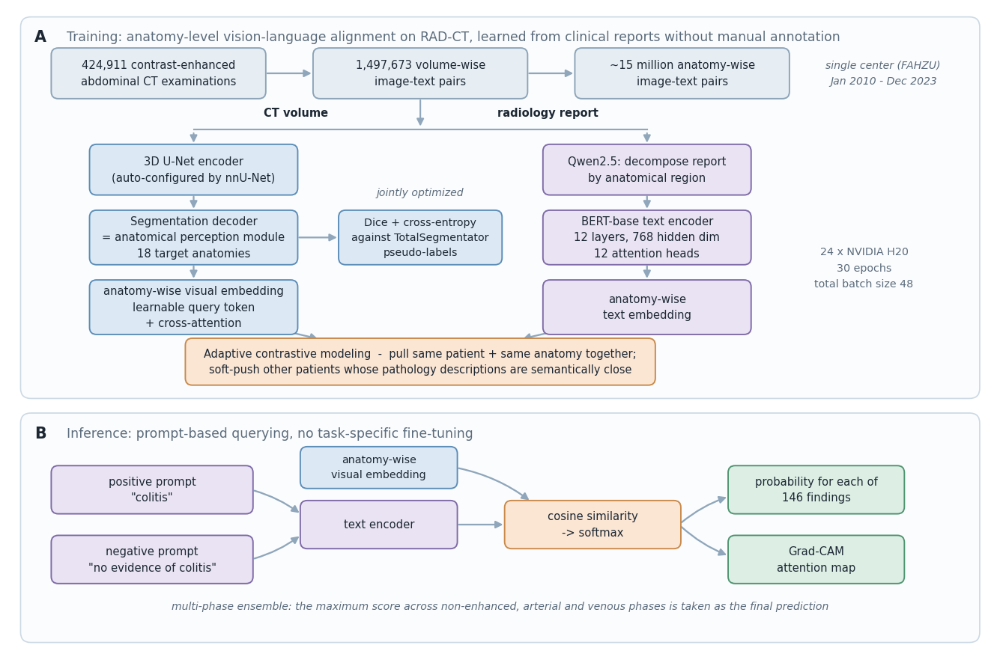

[Home](../) · [AI Papers](./)

# RADAR：把腹部 CT 拆成 18 個器官再對齊報告，通才模型能到專家水準嗎？

## 來源

- **單位／團隊**：浙江大學醫學院附屬第一醫院（肝膽胰外科、放射科、放射腫瘤科、急診、消化內科）與阿里巴巴達摩院（Alibaba DAMO Academy）為主，並含浙江大學電腦科學與技術學院、湖畔實驗室、Adelaide University 的 Australian Institute for Machine Learning、Mohamed bin Zayed University of Artificial Intelligence、東南大學中大醫院，以及八家外部醫院。全文共 40 位作者、26 個單位。[(ref: main author block and affiliations)](https://doi.org/10.1126/science.aec6129)
- **作者**：Qi Zhang、Jianpeng Zhang、Weiwei Cao、Zilin Lu、Wanxing Chang、Haonan Ding 等（前六位為共同第一作者）；通訊作者為 Tingbo Liang、Ling Zhang、Qi Zhang、Jianpeng Zhang、Wenbo Xiao。[(ref: main author block)](https://doi.org/10.1126/science.aec6129)
- **完整篇名**：*An expert-level generalist AI for abdominal CT diagnosis*。
- **出處與年份**：*Science* 393, eaec6129，2026 年 9 月 17 日。
- **原文**：[DOI:10.1126/science.aec6129](https://doi.org/10.1126/science.aec6129) · [程式與模型 checkpoint（Zenodo v3，CC BY 4.0）](https://doi.org/10.5281/zenodo.21504519)。
- **來源取得方式**：*Science* 全文採訂閱制，DOI 頁面對未訂閱讀者只顯示摘要。本文依出版社提供的正文 PDF、Supplementary Materials 與 Tables S1–S13 撰寫；文中 ref 一律指回 DOI 入口頁，並在括號內標出該事實在論文中的章節、圖號或表號。

**編輯：** Clare

RADAR 不是再訓練一個看整份 CT 的模型，而是先把每筆檢查切成 18 個解剖結構、把報告也按器官拆開，再讓兩邊在器官層級做對比學習；代價是它只能診斷有分割模型的器官，收益是 146 種徵象與疾病可以用提示詞直接查詢，不必為每種病各訓練一個模型。[(ref: main Results "Development of RADAR")](https://doi.org/10.1126/science.aec6129) [(ref: main Materials and methods "Findings inclusion")](https://doi.org/10.1126/science.aec6129)

## 流程

*圖 1：Clare 依原文 Fig. 1A、Materials and methods 與補充材料 “Network architecture” 重繪的概念圖。方框內的數字與元件名稱取自論文，圖中不呈現任何績效數值，也不是原文圖檔的重製。[(ref: main Fig. 1A)](https://doi.org/10.1126/science.aec6129) [(ref: main SM "Network architecture")](https://doi.org/10.1126/science.aec6129)*

## 背景／問題

放射科的通才 AI 目標是「一套模型應付多數臨床情境」，但既有路線幾乎都靠監督式學習：每種疾病要有人工標註，覆蓋範圍因此被標註成本鎖住。作者指出這使模型難以擴展到開放式臨床場景。[(ref: main Introduction)](https://doi.org/10.1126/science.aec6129)

視覺語言學習提供另一條路，讓模型直接從影像與報告的配對中學習。但作者強調這套做法從自然影像遷移到腹部 CT 並不順利：腹部的解剖脈絡遠比胸部複雜，而診斷訊號相對於整個三維體積又極度稀疏 —— 一顆小結節可能只占全體積的極小比例，整卷對整份報告的對齊會被大量正常組織稀釋。CT-CLIP、Merlin 與 BIUD 是此前在 CT 上的嘗試；作者自己先前的 fVLM 已能辨識 54 種腹部 CT 疾病類別，但準確度與覆蓋範圍都還不足。[(ref: main Introduction)](https://doi.org/10.1126/science.aec6129)

RADAR（Rapid Abdominal Diagnosis with AI and Radiology）要回答的問題因此很具體：如果把對齊的粒度從「整卷影像對整份報告」降到「單一器官對該器官的報告段落」，能不能同時拿到覆蓋廣度與準確度？[(ref: main Introduction)](https://doi.org/10.1126/science.aec6129)

## 方法摘要

RADAR 由視覺分支與文字分支組成。視覺端用 3D U-Net encoder 抽取體積特徵，再接一個 segmentation decoder 作為 anatomical perception module，把 18 個目標解剖結構定位出來；每個結構的前景特徵經一個 learnable query token 與 cross-attention 聚合成該器官的視覺嵌入。文字端先用 Qwen 把報告按解剖區域拆成片段，再由 BERT-base encoder（12 層、768 維、12 個 attention head）產生對應的文字嵌入。[(ref: main Materials and methods "Design and training of RADAR")](https://doi.org/10.1126/science.aec6129)

兩側嵌入以 adaptive contrastive modeling 對齊：同一病人同一器官的圖文互為正例，不同病人則依狀態區分 —— 被標為正常的器官彼此視為額外正例，異常描述之間則由 momentum-updated text encoder 估計語意相似度，做部分對齊而非一律推開。推論時不需微調，對每個 finding 各給一組正、負提示詞，比較餘弦相似度後取較高者。[(ref: main Materials and methods "Adaptive contrastive modeling")](https://doi.org/10.1126/science.aec6129) [(ref: main Results "Development of RADAR")](https://doi.org/10.1126/science.aec6129)

## 方法詳解

### 1. 從 104 個子結構收斂到 18 個目標器官

解剖切分用的是 TotalSegmentator，原本可切 104 個子結構；作者先合併成 36 個主要解剖類別（例如各肺葉併為單一 lung），再排除腹部 CT 看不到的部位（如 brain、face）與極低盛行率者（如 gluteus、iliopsoas），最後留下 18 個目標器官，訓練與評估一致使用。[(ref: main Materials and methods "Anatomy parsing")](https://doi.org/10.1126/science.aec6129) [(ref: main table S10)](https://doi.org/10.1126/science.aec6129)

anatomical perception module 先在 TotalSegmentator v1 訓練集上依 nnU-Net 流程預訓練，在 TotalSegmentator 測試集的 18 個目標結構上取得 mean Dice 0.917（95% CI，0.894–0.937），與公開版 TotalSegmentator 模型的 0.928（0.909–0.947）無統計顯著差異（P = 0.17）。作者另用公開 TotalSegmentator 對整個訓練集產生 pseudo-labels，在後續訓練以 Dice 加 cross-entropy 持續約束分割目標。[(ref: main SM "Evaluation of anatomical perception module")](https://doi.org/10.1126/science.aec6129)

這一步同時決定了模型的能力邊界：因為 TotalSegmentator 對腹膜、輸尿管、卵巢與子宮沒有可用分割，涉及這些器官的疾病在建立 finding 清單時就被排除。[(ref: main Materials and methods "Findings inclusion")](https://doi.org/10.1126/science.aec6129)

### 2. 報告拆解與「未提及即正常」的預設

每份報告由 Qwen 拆成器官層級片段，findings 與 impression 兩段分別處理後再整合；若某器官只出現在其中一段，缺的一側以 “null” 佔位再串接。關鍵的一條規則是：報告中未提及的器官，會被自動賦予 “no significant abnormalities”。作者說明這符合臨床報告慣例，但這代表訓練訊號中的「正常」有一部分來自沉默，而非明確陳述。[(ref: main Materials and methods "Report decomposition")](https://doi.org/10.1126/science.aec6129)

### 3. Adaptive contrastive modeling：處理假陰性

標準 InfoNCE 把同一批次中其他樣本一律當負例。在臨床資料上這會製造大量假陰性 —— 兩個不同病人的正常肝臟本來就該相似。RADAR 因此加入兩種額外監督：正常器官跨病人互為正例；異常描述之間依 momentum-updated text encoder 估計的語意相似度做軟性對齊。作者報告，直接使用 vanilla InfoNCE 在此資料上無法收斂，出現數值不穩與 NaN。[(ref: main Materials and methods "Adaptive contrastive modeling")](https://doi.org/10.1126/science.aec6129) [(ref: main SM "Ablation study")](https://doi.org/10.1126/science.aec6129)

### 4. 元件消融：哪一步真的關鍵

以下為補充材料的消融結果，基準設定的 AUC 為 0.903（95% CI，0.898–0.907），在內部 validation set 上量測。此基準與正文頭條的 0.913 不是同一個數字：後者來自內部 testing cohort 的完整模型。[(ref: main SM "Ablation study")](https://doi.org/10.1126/science.aec6129) [(ref: main fig. S12)](https://doi.org/10.1126/science.aec6129)

| 變更 | AUC（95% CI） | 相對基準 |
|---|---|---|
| 完整 RADAR（CNN encoder） | 0.903（0.898–0.907） | — |
| 視覺骨幹換成 ViT | 0.755（0.749–0.761） | −0.148（P < 0.001） |
| 移除 anatomical perception module | 0.883（0.876–0.891） | −0.020（P < 0.001） |
| 改為 whole-image image–text alignment | 0.673（0.665–0.687） | −0.230（P < 0.001） |
| 改用 vanilla InfoNCE loss | 未收斂（NaN） | 無法比較 |
| 特徵聚合改為 average pooling | 論文以差值報告 | −0.009（P < 0.01） |
| 移除 momentum-text similarity weighting | 0.891（0.885–0.897） | −0.012（P < 0.001） |

跌幅最大的是 whole-image alignment（−0.230），其次才是視覺骨幹。換句話說，這篇論文的主要貢獻不在換了什麼 backbone，而在對齊的粒度。

### 5. 推論設定與成本

CT 體積統一重取樣為 1 × 1 × 5 mm，HU 值截在 [−300, 400] 後正規化到 [0, 1]；訓練時隨機裁切成 96 × 256 × 384 的 patch，只有在裁切後仍完整的器官才納入對齊。訓練用 24 張 NVIDIA H20、30 epochs、總 batch size 48。推論採 sliding-window，步長為視窗的一半；若某器官跨越視窗邊界則在該視窗排除，若所有視窗都無法涵蓋完整器官，才改以 center-crop 單獨取出。多期別檢查（非增強、動脈期、靜脈期）取三者預測分數的最大值作為最終分數。[(ref: main Materials and methods "Implementation details")](https://doi.org/10.1126/science.aec6129)

補充材料比較了兩種推論方式，顯示 sliding-window 換到的不只是準確度，更是記憶體：

| 推論方式 | AUC（95% CI） | 每次檢查平均秒數 | 尖峰 GPU 記憶體 |
|---|---|---:|---:|
| Global-window | 0.909（0.907–0.912） | 0.6 | 70 GB |
| Sliding-window | 0.913（0.911–0.915） | 1.3 | 21 GB |

[(ref: main table S13)](https://doi.org/10.1126/science.aec6129)

## 資料與實驗

### 資料構成

RAD-CT 訓練資料全部來自單一中心（浙大一院，FAHZU），時間跨度 2010 年 1 月至 2023 年 12 月，且**排除急診案例**。內部測試集在時間上與訓練集完全分離。下表把各個 cohort 分開列，避免把訓練規模與驗證規模混為一談。[(ref: main Materials and methods "Internal testing cohort" and "External testing cohorts")](https://doi.org/10.1126/science.aec6129)

| Cohort | 規模 | 來源與期間 | 評估範圍 |
|---|---:|---|---|
| RAD-CT 訓練集 | 424,911 examinations／1,497,673 volume-wise pairs／> 15M anatomy-wise pairs | FAHZU，2010-01 至 2023-12，排除急診 | 訓練 |
| 內部 validation set | 3,080 examinations | FAHZU，與訓練集依病人分離 | 超參數調整；finding 須有 ≥ 5 個陽性檢查才納入 |
| 內部 testing cohort | 39,160 examinations | FAHZU，2024-01 至 2024-06，連續收案 | 146 findings |
| Emergency testing cohort | 27,267 examinations | FAHZU，2024-01 之前，與訓練／測試集互斥 | 17 種常見急腹症 |
| 外部真實世界 cohort | 24,239 examinations，8 家中心 | 安吉、北侖、海寧、景寧、績溪、餘杭、嵊州、新疆兵團第一師 | 各中心 68–136 findings |
| 病理確診 cohort | 4,333 examinations，2 家中心 | 嘉興學院附屬醫院（2,001）、嵊州市人民醫院（2,332） | 4 種癌症；648 大腸癌、388 胰臟癌、537 胃癌、383 肝細胞癌、2,377 正常對照 |
| 跨族群 cohort | 5,137 CT scans | 公開 Merlin-CT-Test，Stanford Hospital，以西方病人為主 | 30 findings（其中 21 項在 RADAR 器官範圍內） |
| Reader study | 300 cases | 取自內部 testing cohort | 61 findings；26 位放射科醫師、14 家機構 |

### 內部測試：146 個 finding 的模型比較

三個比較模型（CT-CLIP、Merlin、fVLM）都在 RAD-CT 上重新預訓練後再比較。下表的平均值為 146 個 finding 的 AUC 平均。[(ref: main Results "Internal real-world evaluation")](https://doi.org/10.1126/science.aec6129) [(ref: main table S2)](https://doi.org/10.1126/science.aec6129)

| 模型 | 內部 testing cohort 平均 AUC | 146 個 finding 的最低／最高 AUC |
|---|---:|---|
| CT-CLIP | 0.634 | 0.049 ／ 0.925 |
| Merlin | 0.697 | 0.364 ／ 0.978 |
| fVLM | 0.776（95% CI，0.773–0.779） | 0.491 ／ 0.998 |
| RADAR | 0.913（95% CI，0.911–0.915） | 0.713 ／ 0.997 |

平均值取自論文正文，逐 finding 的最低與最高值由表 S2 的 146 列彙整。值得注意的是最低值而非平均值：RADAR 最差的那個 finding 仍有 0.713，而 fVLM 為 0.491 —— 通才模型的實際風險通常落在尾端，不在平均。

其餘分層結果：依 18 個解剖結構分組，AUC 介於 0.838 至 0.982；七個功能系統介於 0.896 至 0.964；實質器官 0.918（0.915–0.920）對空腔器官 0.907（0.904–0.911）；疾病類 0.914（0.911–0.918）對徵象類 0.911（0.909–0.913）；良性 0.910（0.906–0.914）對惡性 0.929（0.921–0.936）。[(ref: main Results "Internal real-world evaluation")](https://doi.org/10.1126/science.aec6129)

與監督式模型相比，RADAR 勝過 ViT 的 0.787（0.784–0.791）與 nnU-Net+ 的 0.867（0.865–0.870），差距分別為 0.126 與 0.045（皆 P < 0.001）。從內部到外部，AUC 下降幅度為 RADAR 0.018、ViT 0.032、nnU-Net+ 0.050。[(ref: main Results "Internal real-world evaluation" and "External evaluation")](https://doi.org/10.1126/science.aec6129) [(ref: main fig. S3)](https://doi.org/10.1126/science.aec6129)

### 跨族群評估：原文 Table 1

下表照搬論文 Table 1，保留其兩欄的分母定義。「in-scope」指 30 個 finding 中 RADAR 能做器官層級對應的 21 項；其餘 9 項因缺乏明確器官關聯或 RADAR 尚無該器官分割能力而排除。「／」表示原文該格未填。[(ref: main Table 1)](https://doi.org/10.1126/science.aec6129)

| 方法 | 訓練資料 | Anatomy-specific findings（in-scope, n = 21）AUC（95% CI） | All findings（n = 30）AUC（95% CI） |
|---|---|---|---|
| BiomedCLIP | Medical multimodal datasets | 0.574（0.563–0.586） | 0.602（0.592–0.612） |
| MedGemma1.5 | Medical multimodal datasets | 0.555（0.547–0.563） | 0.558（0.551–0.566） |
| Lingshu | Medical multimodal datasets | 0.581（0.570–0.592） | 0.608（0.598–0.617） |
| RADAR | RAD-CT | 0.883（0.871–0.891） | ／ |
| Merlin | Merlin-CT-Train | 0.812（0.801–0.824） | 0.816（0.806–0.826） |
| RADAR | Merlin-CT-Train | 0.888（0.879–0.897） | ／ |
| RADAR+ | RAD-CT 預訓練 + Merlin-CT-Train 微調 | 0.918（0.911–0.925） | 0.876（0.868–0.884） |

前四列未使用 Merlin-CT-Train 訓練，後三列有；兩段不可直接跨段比較。RADAR 未經任何微調的 0.883 高於 Merlin 在自家資料上訓練後的 0.812（+0.071，P < 0.05）。[(ref: main Results "Generalization to a cross-population cohort")](https://doi.org/10.1126/science.aec6129)

### 標籤本身的品質

146 個 finding 的評估標籤並非人工逐例標註，而是由微調過的 Qwen2.5-7B 從報告中擷取（3,080 份報告由一位資深放射科醫師人工標註後，以 80／20 切分訓練與驗證；146 個 finding 分成六組、每組 20–30 項，各訓一個模型）。補充材料同時給出擷取品質：[(ref: main Materials and methods "Extraction of findings")](https://doi.org/10.1126/science.aec6129) [(ref: main tables S11 and S12)](https://doi.org/10.1126/science.aec6129)

| 擷取方式 | Precision（平均） | Recall（平均） | F1（平均） | 單一 finding 最低 F1 |
|---|---:|---:|---:|---:|
| 微調後的 Qwen 模型（表 S11） | 0.938 | 0.920 | 0.924 | 0.571 |
| 直接查詢 Qwen2.5-max（表 S12） | 0.877 | 0.960 | 0.903 | 0.396 |

平均值取自兩表自帶的 Mean 列；最低 F1 由該表 146 列彙整。這代表模型的參考標準本身帶有雜訊，且雜訊在不同 finding 之間分布不均。

## 結果

- **內部與外部的落差小。** 內部 testing cohort 平均 AUC 0.913（0.911–0.915）；八家外部中心平均 0.895（0.889–0.900），各中心介於 0.874 至 0.912，且在每一家中心都優於三個比較模型。外部相對 fVLM 領先 0.176（P < 0.001），比內部的 0.137 更大。[(ref: main Results "External evaluation")](https://doi.org/10.1126/science.aec6129)
- **急診場景是未見過的分布，但沒有崩掉。** 訓練資料明確排除急診，RADAR 在 27,267 筆急診檢查、17 種常見急腹症上仍達 0.904（0.900–0.909）。這是分布外泛化的證據，不是急診部署的效益證據。[(ref: main Results "Internal real-world evaluation")](https://doi.org/10.1126/science.aec6129)
- **病理確診標準下的表現與報告標準相當。** 兩家病理確診中心的四種癌症 AUC 分別落在 0.922–0.984 與 0.891–0.972；同樣四種癌症在八家外部中心以報告為標準時為 0.863–0.989。作者據此主張「從報告學到的能力可延伸到病理金標準」。[(ref: main Results "Generalization to pathology-confirmed cohorts")](https://doi.org/10.1126/science.aec6129)
- **Reader study：敏感度上升，特異度略降。** 26 位醫師在無輔助時特異度 98.8%（98.6–98.9%），敏感度則隨年資與醫院層級明顯分散；多數人的操作點落在 RADAR 的 ROC 曲線下方，只有三位資深醫師略優於 RADAR。經至少一個月的 washout 後再讀，敏感度提升 10.0%（P < 0.001），特異度由 98.8% 降至 98.2%，每例閱片時間減少 30.7%（P < 0.001）。[(ref: main Results "Reader studies")](https://doi.org/10.1126/science.aec6129)
- **增益集中在資淺醫師與高風險情境。** 其他醫院的資淺醫師（G4）敏感度提升 10.1%（P < 0.001）；三甲醫院資淺醫師（G2）在輔助下比未輔助的資深醫師（G1）高 3.4%，但未達顯著（P = 0.24），G4 對 G3 的 7.0% 亦然（P = 0.12）。分層來看，惡性病灶 +7.3%、急診情境 +8.5%、空腔器官疾病 +9.4%（皆 P < 0.001）。[(ref: main Results "Reader studies")](https://doi.org/10.1126/science.aec6129)
- **提示詞與微調還能再推一段。** data-driven prompt ensemble 讓內部 AUC 從 0.913 升到 0.928（0.926–0.929，P < 0.001）；以 findings prompt alignment 微調後，內部升至 0.940（0.937–0.944）、外部升至 0.927（0.925–0.928），皆 P < 0.001。[(ref: main Results "Performance improvements with prompt ensemble and fine-tuning strategies")](https://doi.org/10.1126/science.aec6129)

統計方法為：95% CI 取自 1,000 次 bootstrap；敏感度與特異度以 10,000 次 permutation test 取雙尾 P 值；AUC 比較用 DeLong's test，顯著門檻 P < 0.05。[(ref: main Materials and methods "Statistical analysis")](https://doi.org/10.1126/science.aec6129)

## 限制

- **作者自陳的兩項限制。** 其一，缺乏全面的病理金標準，只在部分關鍵 finding 上做了針對性病理驗證；其二，跨族群驗證尚不完整，需要更多族群與臨床場景的測試。[(ref: main Discussion)](https://doi.org/10.1126/science.aec6129)
- **訓練資料來自單一高量中心。** RAD-CT 全部取自 FAHZU，八家外部中心也集中在浙江與新疆。作者把「單一三甲醫院的多期別語料」列為泛化能力的來源之一，但這同時意味著造影協定、報告書寫慣例與疾病組成的多樣性有其上限。[(ref: main Discussion)](https://doi.org/10.1126/science.aec6129) [(ref: main Materials and methods "External testing cohorts")](https://doi.org/10.1126/science.aec6129)
- **多數評估的參考標準是報告，不是真實診斷。** 146 個 finding 的標籤由微調 Qwen 從報告擷取，平均 F1 0.924，但最低的單一 finding 只有 0.571；報告未提及的器官還會被預設為正常。這使「AUC 0.913」應理解為「與報告一致的程度」，而非與病理或臨床結局一致的程度。病理確診 cohort 只涵蓋四種癌症、4,333 例。[(ref: main Materials and methods "Report decomposition" and "Extraction of findings")](https://doi.org/10.1126/science.aec6129) [(ref: main table S11)](https://doi.org/10.1126/science.aec6129)
- **能力範圍由分割器決定。** 腹膜、輸尿管、卵巢與子宮相關疾病因 TotalSegmentator 無對應分割而被排除在 146 個 finding 之外；跨族群評估中也有 9 個 finding 因同樣理由落在 in-scope 之外。這是架構層面的邊界，不會因為增加資料而自動消失。[(ref: main Materials and methods "Findings inclusion")](https://doi.org/10.1126/science.aec6129) [(ref: main Results "Generalization to a cross-population cohort")](https://doi.org/10.1126/science.aec6129)
- **Reader study 是回溯性、以報告為真值的實驗室設計。** 300 例取自內部 testing cohort，真值同樣來自原始報告擷取後人工複核；閱片在專用平台上進行，與實際 PACS 工作流程不同。特異度從 98.8% 降到 98.2% 雖小，但在大量正常檢查的篩檢情境下，偽陽性的絕對數量仍需另行估計，論文未提供。[(ref: main Materials and methods "Reader studies")](https://doi.org/10.1126/science.aec6129)
- **本書庫的補充判讀：沒有前瞻性或部署後證據。** 全篇為回溯性研究（FAHZU 倫理審查核准編號 0992，免除受試者同意），未包含前瞻收案、臨床結局或上市法規路徑。論文也揭露作者已就本研究申請專利（CN121526964A），且多位作者為阿里巴巴達摩院員工並持有阿里巴巴股票。[(ref: main Materials and methods "Ethics")](https://doi.org/10.1126/science.aec6129) [(ref: main Competing interests)](https://doi.org/10.1126/science.aec6129)
- **可重現性部分開放。** 程式與模型 checkpoint 已存放於 Zenodo（v3，CC BY 4.0）供公開取用；但病人影像資料須經機構審查委員會核准後個案提供，因此外部團隊無法在相同資料上重跑主要表格。[(ref: main Data, code, and materials availability)](https://doi.org/10.1126/science.aec6129) [(ref: code)](https://doi.org/10.5281/zenodo.21504519)

## 與書庫其他文章的關係

Lingshu 在本篇 Table 1 中以未微調狀態評估，in-scope 21 項 AUC 為 0.581，可用來對照「通用醫療多模態模型」與「單一模態專精對齊」兩種路線在 3D 腹部 CT 上的落差: [Lingshu：醫療 VLM 如何整合影像、文字與合成資料，RL 又帶來多少改變？](2026-09-15-lingshu-medical-vlm.md)

MedGemma 1.5 同樣被列為 Table 1 的零樣本比較對象（in-scope 0.555），兩篇可對照「原生支援 3D 體積的通用模型」與「以器官分割為前提的專用對齊」各自的評估邊界: [MedGemma 1.5：4B 模型如何讀取 3D 影像、全切片與縱向胸片？](2026-09-16-medgemma-1-5.md)

該譜系把 CLIP 式圖文對齊列為起點，本篇是同一路線把對齊粒度從整卷影像下推到器官層級後的 3D 實例: [醫療視覺語言模型：從 CLIP 對齊到有定位報告](../ai-basics/medical-vlm.md)

## 實務的啟發

1. **對齊粒度可能比骨幹選擇更值得先試。** 消融中換掉 ViT 損失 0.148，改回 whole-image alignment 損失 0.230。若手上有影像與結構化報告，先檢查「一段文字對應到哪一塊影像」能不能拆得更細，往往比換模型划算。
2. **「未提及即正常」要當成明確的設計決策記錄下來。** 這條規則決定了大量訓練訊號的來源。導入自家資料前，先量測報告的書寫完整度：若某器官在報告中經常被略過，這個預設會直接寫進模型的先驗。
3. **把標籤擷取器的品質當成獨立驗收項。** 本研究把 146 個 finding 分六組各訓一個擷取模型，並逐 finding 報告 precision／recall／F1。任何以 LLM 從報告產生標籤的專案都應該比照辦理，並公布最差的那幾項，而不只是平均。
4. **驗收看尾端，不看平均。** RADAR 的價值主張是覆蓋廣度，因此真正該追問的是 146 個 finding 中最低的 0.713 落在哪一項、屬不屬於漏診代價高的類別。上線前建議依「漏診後果」分層設不同門檻，而非全域單一閾值。
5. **敏感度提升與特異度下降要一起估算絕對量。** 敏感度 +10.0%、特異度 −0.6 個百分點，在 reader study 的病例組成下看似划算；換到正常比例更高的健檢或篩檢情境，同樣的特異度變動會轉成可觀的追加檢查量。部署評估應以預期病例組成重算，而不是沿用研究中的比例。
6. **推論成本的差異值得在選型時一併看。** 同一模型改用 sliding-window 推論，尖峰 GPU 記憶體從 70 GB 降到 21 GB、AUC 反而略升，代價是每例多約 0.7 秒。這類設定常決定一套模型能不能放進既有機房。

## References

- **main** — Qi Zhang, Jianpeng Zhang, Weiwei Cao, Zilin Lu, Wanxing Chang, Haonan Ding, et al. *An expert-level generalist AI for abdominal CT diagnosis*. **Science 393, eaec6129 (2026)**，2026-09-17 出版。[DOI:10.1126/science.aec6129](https://doi.org/10.1126/science.aec6129)。
  - 正文章節：Introduction · Results（Development of RADAR／Internal real-world evaluation／External evaluation／Generalization to pathology-confirmed cohorts／Generalization to a cross-population cohort／Reader studies／Performance improvements with prompt ensemble and fine-tuning strategies）· Discussion。
  - 主圖與主表：Fig. 1（架構與 cohort 概覽）· Fig. 2（內部評估分層）· Fig. 3（外部評估）· Fig. 4（reader study）· Table 1（跨族群評估）。
  - Materials and methods：Anatomy parsing · Report decomposition · Design and training of RADAR · Adaptive contrastive modeling · Implementation details · Internal/Emergency/External/Pathology-confirmed testing cohorts · Findings inclusion · Extraction of findings · Reader studies · Statistical analysis。
  - Supplementary Materials：Evaluation of anatomical perception module · Ablation study · Network architecture · figs. S1–S13 · tables S1–S13（本文引用 S2、S10、S11、S12、S13）。
  - 揭露事項：Ethics（FAHZU 核准編號 0992）· Competing interests（專利 CN121526964A；部分作者為阿里巴巴達摩院員工）· Data, code, and materials availability。
- **code** — Jianpeng Zhang, Weiwei Cao, Wanxing Chang. *An Expert-Level Generalist AI for Abdominal CT Diagnosis*, version v3, Zenodo (2026)。含 `damo-radar.zip`（原始碼與模型實作），授權 CC BY 4.0，公開可取用。[DOI:10.5281/zenodo.21504519](https://doi.org/10.5281/zenodo.21504519)。

[Home](../) · [AI Papers](./)
