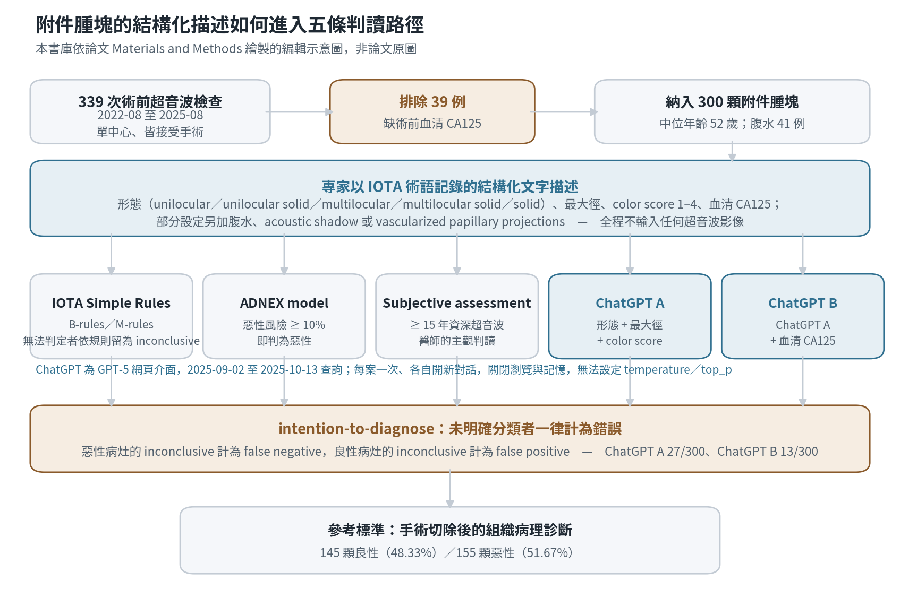

[Home](../) · [AI Papers](./)

# 把超音波描述交給 ChatGPT 判良惡性：300 顆附件腫塊，和 IOTA 規則、ADNEX 與專家差多少？

## 來源

- 團隊：University of Bari「Aldo Moro」Department of Interdisciplinary Medicine 與 IRCCS Istituto Tumori「Giovanni Paolo II」Gynecologic Oncology Unit；作者為 Giulia Soccio、Stefania Di Napoli、Paolo Trerotoli、Vera Loizzi、Laura Grazia Zompì、Giuseppe Colonna、Daniele La Forgia、Gennaro Cormio 與 Francesca Arezzo。[(ref: main)](https://www.mdpi.com/2313-433X/12/9/462)
- 論文：*Large Language Models Meet Gynecologic Ultrasound: Advancing the Characterization of ADNEXal Masses*，Journal of Imaging 12(9):462；2026-07-25 投稿、2026-09-15 接受、2026-09-21 刊出；原創研究，CC BY 授權。[(ref: main)](https://www.mdpi.com/2313-433X/12/9/462)
- 識別碼：[DOI: 10.3390/jimaging12090462](https://doi.org/10.3390/jimaging12090462)。本篇無 arXiv 預印本。
- 全文：[MDPI 全文](https://www.mdpi.com/2313-433X/12/9/462)；[PDF](https://www.mdpi.com/2313-433X/12/9/462/pdf)；[補充材料 S1](https://www.mdpi.com/article/10.3390/jimaging12090462/s1)。

**編輯：** Clare

這項研究把 300 顆附件腫塊的超音波「文字描述」——不含任何影像——交給 GPT-5，再和 IOTA Simple Rules、ADNEX model 與資深醫師的 subjective assessment 放在同一批手術病理答案上比較。[(ref: main)](https://www.mdpi.com/2313-433X/12/9/462)

## 流程

圖：本書庫依論文 Materials and Methods 繪製的編輯示意圖，非論文原圖。圖中數值皆取自論文本文與 Table 5、Table 7A。要注意的是進入五條路徑的都是同一份由專家寫成的結構化描述，模型端沒有看到影像。[(ref: main)](https://www.mdpi.com/2313-433X/12/9/462) [(ref: main Table 5)](https://www.mdpi.com/2313-433X/12/9/462#jimaging-12-00462-t005)

## 背景／問題

附件腫塊（adnexal mass）的術前良惡性判斷決定了後續該做什麼手術、由誰來做。International Ovarian Tumor Analysis（IOTA）團隊為此建立了一套標準化的超音波描述詞彙，並在其上發展兩套決策工具：Simple Rules 以五條 B-rules 與五條 M-rules 判讀，兩者同時成立或同時不成立時規則本身即判定為 inconclusive；ADNEX model 則輸出一個連續的惡性風險機率，臨床上常以 10% 為切點。[(ref: main)](https://www.mdpi.com/2313-433X/12/9/462)

實務上表現最好的往往是第三條路：資深醫師的 subjective assessment。問題在於它高度依賴個人經驗，難以標準化，也難以在缺乏次專科人力的機構複製。這正是研究者想測試 large language model（LLM）的動機——如果 LLM 能從同一份結構化描述裡讀出接近專家的判斷，它或許能成為經驗較淺操作者的輔助。

研究因此問兩件事：在同一批腫塊、同一個組織病理參考標準下，GPT-5 讀結構化描述的良惡性判別力，和 Simple Rules、ADNEX 與專家相比落在哪裡；以及當要求它進一步猜測組織學診斷時，它的分布會往哪些類別偏移。

## 方法摘要

這是一項單中心回溯性研究，材料取自 2022 年 8 月至 2025 年 8 月間在 Bari 兩家機構接受術前骨盆超音波並隨後手術的病人。339 次檢查中有 39 例因缺少術前血清 CA125 被排除，最終納入 300 顆附件腫塊；參考標準是手術切除後的組織病理診斷，其中 145 顆良性（48.33%）、155 顆惡性（51.67%）。[(ref: main)](https://www.mdpi.com/2313-433X/12/9/462) [(ref: main Table 5)](https://www.mdpi.com/2313-433X/12/9/462#jimaging-12-00462-t005)

一位具 15 年以上婦科超音波經驗的操作者以 IOTA 術語描述每顆腫塊，並同時給出 Simple Rules、ADNEX model 與 subjective assessment 三組判讀。同一份描述另外以純文字送進 ChatGPT（GPT-5）的網頁介面，查詢期間為 2025 年 9 月 2 日至 10 月 13 日。所有方法的敏感度、特異度、PPV、NPV 與正確率都以 Clopper–Pearson 法計算 95% 信賴區間；跨方法的比例差異以 Cochran's Q 檢定，事後兩兩比較用 Sheskin 的配對比例檢定。[(ref: main)](https://www.mdpi.com/2313-433X/12/9/462)

關鍵的計分約定是 intention-to-diagnose：任何未明確給出良性或惡性的輸出一律計為錯誤分類——惡性病灶算 false negative，良性病灶算 false positive。

## 方法詳解

超音波檢查以 3.5–5.0 MHz 凸陣探頭做經腹掃描、9.0–5.0 MHz 寬頻探頭做經陰道掃描。雙側病灶時取超音波形態較複雜的一顆；若複雜度相當，則取較大或較易掃查的一顆。記錄內容依 IOTA 術語涵蓋形態（unilocular、unilocular solid、multilocular、multilocular solid、solid）、最大徑、echogenicity 與 color score（1–4 的血流分級）。[(ref: main)](https://www.mdpi.com/2313-433X/12/9/462)

送進模型的是去識別化的結構化描述加上血清 CA125 數值，不含影像、個資或臨床病歷文字。研究設計了五組參數組合：ChatGPT A 只給形態、最大徑與 color score；ChatGPT B 在 A 之上加血清 CA125；ChatGPT C 另加腹水資訊，只在 solid 與 multilocular solid 的 135 顆子群評估；ChatGPT D 另加 acoustic shadow，只在 solid 與 unilocular solid 的 253 顆子群評估；ChatGPT E 另加 vascularized papillary projections。提問一律以英文、依 IOTA 術語構句，論文給的範例是「is a unilocular solid ovarian cyst of 14 mm with a color score 2 and a vascularized papilla more likely benign or malignant?」。[(ref: main)](https://www.mdpi.com/2313-433X/12/9/462)

執行條件被寫得相當明確，也構成本研究可重現性的邊界。每個案例只在一個全新開啟的獨立對話中提交一次；瀏覽、記憶與所有附加工具都關閉；由於使用的是網頁介面（plus 訂閱），temperature 與 top_p 等取樣參數無法自訂。換句話說，每一格結果都是單次抽樣的結果，run-to-run 的變異沒有被量測。[(ref: main)](https://www.mdpi.com/2313-433X/12/9/462)

三個對照方法的規則也固定在事前：Simple Rules 依 B-rules／M-rules 判讀，兩組規則同時適用或同時不適用時留為 inconclusive；ADNEX model 以 10% 惡性風險為切點；subjective assessment 由該位資深操作者給出。三者與 ChatGPT 讀到的是同一份描述，差別只在判讀機制。

第二項任務是組織學診斷預測。此時提供的資訊包含形態、大小、color score 與術前 CA125；unilocular 腫塊另加囊內容物描述，multilocular 腫塊另加囊內容物與腔室數目。輸出與組織病理報告、以及專家的推定診斷並列比較。[(ref: main Table 8)](https://www.mdpi.com/2313-433X/12/9/462#jimaging-12-00462-t008)

論文另註明對僅限「明確分類」案例的敏感度分析也有執行，用以檢查 intention-to-diagnose 對結論的影響。

## 資料與實驗

下表為 300 顆腫塊的世代組成。形態分類的五項加總為 300；良惡性比例來自組織病理。[(ref: main Table 5)](https://www.mdpi.com/2313-433X/12/9/462#jimaging-12-00462-t005)

| 項目 | 分層 | 顆數 | 佔 300 的比例 |
|---|---|---:|---:|
| 形態 | Unilocular | 23 | 7.7% |
| 形態 | Unilocular solid | 126 | 42.0% |
| 形態 | Multilocular | 16 | 5.3% |
| 形態 | Multilocular solid | 8 | 2.7% |
| 形態 | Solid | 127 | 42.3% |
| 組織病理 | 良性 | 145 | 48.33% |
| 組織病理 | 惡性 | 155 | 51.67% |
| 腹水 | 有 | 41 | 13.7% |

下表重製論文 Table 6 與 Table 7B 的良惡性判別結果。所有百分比依 intention-to-diagnose 計算，括號內為 Clopper–Pearson 95% 信賴區間。惡性為陽性類別，盛行率固定為 51.67%。[(ref: main Table 6)](https://www.mdpi.com/2313-433X/12/9/462#jimaging-12-00462-t006) [(ref: main Table 7B)](https://www.mdpi.com/2313-433X/12/9/462#jimaging-12-00462-t007)

| 方法 | 正確率 | 敏感度 | 特異度 | PPV | NPV |
|---|---|---|---|---|---|
| Subjective assessment | 87.3% (83.0–90.9) | 93.5% (88.5–96.9) | 80.7% (73.3–86.8) | 83.8% (77.5–89.0) | 92.1% (86.0–96.2) |
| ADNEX model（10% 切點） | 74.7% (69.3–79.5) | 98.1% (94.4–99.6) | 49.7% (41.3–58.1) | 67.6% (61.0–73.6) | 96.0% (88.8–99.2) |
| ChatGPT B | 74.7% (69.3–79.5) | 73.5% (65.9–80.3) | 75.9% (68.1–82.6) | 76.5% (68.9–83.1) | 72.8% (65.0–79.8) |
| ChatGPT A | 73.3% (67.9–78.3) | 72.3% (64.5–79.1) | 74.5% (66.6–81.4) | 75.2% (67.4–81.9) | 71.5% (63.6–78.6) |
| IOTA Simple Rules | 66.7% (61.0–72.0) | 53.5% (45.4–61.6) | 80.7% (73.3–86.8) | 74.8% (65.6–82.5) | 61.9% (54.6–68.9) |

下表重製論文 Table 7A 的分類計數。每一列的四格加總皆為 300。論文說明 inconclusive 依 intention-to-diagnose 併入 false negative 或 false positive，因此 inconclusive 欄記的是被重新歸類的件數，而不是四格之外的第五群。[(ref: main Table 7A)](https://www.mdpi.com/2313-433X/12/9/462#jimaging-12-00462-t007)

| 方法 | TP | FP | TN | FN | 其中 inconclusive |
|---|---:|---:|---:|---:|---:|
| Subjective assessment | 145 | 28 | 117 | 10 | 0 |
| ADNEX model | 152 | 73 | 72 | 3 | 0 |
| ChatGPT B | 114 | 35 | 110 | 41 | 13 |
| ChatGPT A | 112 | 37 | 108 | 43 | 27 |
| IOTA Simple Rules | 83 | 28 | 117 | 72 | 74 |

下表重製論文 Table 8 的組織學診斷分布，三欄分別是病理報告、ChatGPT 的推定診斷與專家的推定診斷；三欄各自加總為 300。[(ref: main Table 8)](https://www.mdpi.com/2313-433X/12/9/462#jimaging-12-00462-t008)

| 診斷 | 組織病理 | ChatGPT | Subjective assessment |
|---|---:|---:|---:|
| Cystadenoma | 32 | 72 | 23 |
| Cystadenofibroma | 22 | 0 | 20 |
| Teratoma | 20 | 23 | 14 |
| Endometrioma | 16 | 11 | 15 |
| Fibroid | 48 | 29 | 51 |
| Functional cyst | 3 | 3 | 0 |
| Paraovarian cyst | 0 | 0 | 2 |
| Brenner tumor | 4 | 0 | 0 |
| Borderline tumor | 36 | 56 | 48 |
| Invasive carcinoma | 103 | 95 | 114 |
| Metastatic cancer | 12 | 0 | 9 |
| Rare | 3 | 0 | 2 |
| Inconclusive | 0 | 11 | 0 |
| Missing | 1 | 0 | 2 |

## 結果

在同一批 300 顆腫塊上，資深醫師的 subjective assessment 仍是整體正確率最高的方法（87.3%），其 93.5% 敏感度與 80.7% 特異度沒有明顯的取捨失衡。跨方法的比例差異在 Cochran's Q 檢定下顯著：惡性類別 Q = 108.04、良性類別 Q = 263.25，兩者 p < 0.001；Sheskin 事後檢定給出的最小顯著差異為惡性 10.1%、良性 9.5%。[(ref: main Table 6)](https://www.mdpi.com/2313-433X/12/9/462#jimaging-12-00462-t006)

兩個 ChatGPT 設定落在 73.3%（A）與 74.7%（B），介於 Simple Rules 的 66.7% 與專家的 87.3% 之間。值得注意的是它們的敏感度與特異度相當對稱（A 為 72.3%／74.5%，B 為 73.5%／75.9%），沒有像 ADNEX 那樣把判別力集中在單一方向。[(ref: main Table 7B)](https://www.mdpi.com/2313-433X/12/9/462#jimaging-12-00462-t007)

ADNEX model 與 ChatGPT B 的整體正確率剛好同為 74.7%，但兩者的行為完全不同。ADNEX 在 10% 切點下把 300 顆中的 225 顆判為惡性，換得 98.1% 敏感度與僅 96.0% 的 NPV 高位，代價是特異度只有 49.7%——145 顆良性腫塊有 73 顆被判為惡性。這是切點選擇的直接後果，不是模型判別力的全貌。[(ref: main Table 7A)](https://www.mdpi.com/2313-433X/12/9/462#jimaging-12-00462-t007)

Simple Rules 在 intention-to-diagnose 之下表現最低（66.7%），主因是 300 顆中有 74 顆落入規則本身定義的 inconclusive，依約定全部計為錯誤。它的特異度（80.7%）其實與專家相同，掉下來的是敏感度（53.5%）。

未明確分類的比例在兩個 ChatGPT 設定間差距明顯：A 有 27/300（9%），B 有 13/300（4.33%）。加入 CA125 主要是讓模型比較願意給出明確答案，而整體正確率只從 73.3% 升到 74.7%。

組織學診斷預測顯示出系統性的分布偏移。ChatGPT 大幅高估 cystadenoma（72 對病理的 32）與 borderline tumor（56 對 36），同時完全沒有給出 cystadenofibroma（0 對 22）、metastatic cancer（0 對 12）與 Brenner tumor（0 對 4），另有 11 例 inconclusive。專家的推定診斷分布則貼近病理實際值得多，主要偏差是高估 invasive carcinoma（114 對 103）與 borderline tumor（48 對 36）。[(ref: main Table 8)](https://www.mdpi.com/2313-433X/12/9/462#jimaging-12-00462-t008)

ChatGPT C、D、E 三個加入腹水、acoustic shadow 與 vascularized papillary projections 的設定只在子群中做描述性評估，論文未提供與主要設定並列的判別力指標；其中 E 產生了偏高比例的 inconclusive 輸出。[(ref: main)](https://www.mdpi.com/2313-433X/12/9/462)

## 限制

作者自述的限制如下：

- 模型無法直接判讀超音波影像，整條路徑依賴專家事先寫好的標準化描述；描述品質本身就是結果的一部分。[(ref: main)](https://www.mdpi.com/2313-433X/12/9/462)
- 相較於以影像為輸入的 AI 系統，本研究的判別力較低。
- 每案只用單一提示詞提交一次，未評估輸出變異（output variability）。
- 單中心回溯性設計，需要多中心前瞻驗證。

以下是本書庫在核對過程中記下的觀察，屬於解讀而非論文結論：

- ChatGPT A 與 B 的正確率差 1.4 個百分點，換算約為 4 顆腫塊，遠低於論文自己算出的 Sheskin 最小顯著差異（良性 9.5%、惡性 10.1%）。因此「加入 CA125 改善了判別力」在本研究的統計解析度下並未被支持；能看到的改變是 inconclusive 由 27 降到 13。
- 網頁介面無法固定取樣參數、每案又只跑一次，等於把 run-to-run 變異折進了點估計。論文已在限制中承認未評估輸出變異，但所有區間仍是以單次結果計算的抽樣區間，不含模型本身的隨機性。
- 盛行率是關鍵的解讀邊界。本世代是手術病例序列，惡性比例高達 51.67%，遠高於任何篩檢或一般門診族群；正確率、PPV 與 NPV 都會隨盛行率移動，不能直接搬到未經篩選的族群。
- 時間差也值得記錄。模型查詢期間為 2025 年 9 月至 10 月，論文 2026 年 9 月刊出，中間約有 11 個月；被稽核的是該時點的 GPT-5 行為，商用模型的後續更新不在本研究觀察範圍內。
- Simple Rules 的 74 筆 inconclusive 與其 2×2 計數的關係，本文依論文的 intention-to-diagnose 說明理解為「已併入四格」；主文未逐格說明這 74 筆如何分配，因此該欄無法用來重建規則本身的原始判讀分布。

## 與書庫其他文章的關係

同樣把通用商用多模態模型放在臨床參考標準前稽核，並以棄答／未明確分類作為獨立觀察對象，差別在於該研究輸入的是內視鏡影像、本篇輸入的是文字描述: [膀胱鏡影像交給通用多模態 LLM：提示詞與棄答門檻能換到多少可靠度？](2026-09-21-mllm-cystoscopy-bladder-triage.md)

該研究指出來源端估出的操作點搬到別處常同時失去敏感度與可用特異度，本篇的 ADNEX 10% 切點正是同一現象的臨床版本——98.1% 敏感度換來 49.7% 特異度: [稽核胸片結核篩檢的醫療 VLM：換一個評估條件，哪一種結論還站得住？](2026-09-21-cxr-tb-vlm-portability-audit.md)

兩篇都以網頁介面單次提交的方式稽核商用 LLM 的結構化文字判斷，也都碰到取樣參數不可控、單次抽樣把變異折進點估計的同一個可重現性邊界: [臨床條件一模一樣時，LLM 先給誰？30,618 次強制二選一的分配稽核](2026-09-22-llm-social-status-resource-allocation.md)

## 實務的啟發

第一，把「LLM 讀什麼」寫進方法，而不是只寫模型名稱。本研究真正的輸入是一位 15 年資歷醫師依 IOTA 術語寫出的結構化描述。這意味著結果衡量的是「標準化描述 + LLM」這條組合路徑，而不是 LLM 單獨的能力；換一位描述者，整條路徑的表現就可能改變。院內若要複製這類設計，描述者的資歷與術語一致性應該和模型版本一樣被記錄。

第二，把未明確分類當成一個需要管理的輸出類別，而不是雜訊。本研究的 intention-to-diagnose 把 inconclusive 一律計為錯誤，這是保守且誠實的做法，也讓 Simple Rules 的 74 筆 inconclusive 直接壓低了它的數字。實務上更有用的報告方式是把「覆蓋率」與「已作答案例的正確率」分開呈現，讓讀者自己決定要用哪一個。

第三，正確率相同不代表可以互換。ADNEX model 與 ChatGPT B 在本世代同為 74.7%，但前者漏掉 3 顆惡性、誤判 73 顆良性，後者漏掉 41 顆、誤判 35 顆。這兩種錯誤在臨床上的代價完全不同——一個帶來過度手術，一個帶來延遲診斷。採購或導入評估時，單一彙總指標不足以支持決策，至少要看敏感度與特異度的配對，以及在地盛行率下的預期陽性預測值。

最後，組織學診斷這類多類別任務要另外驗證，不能從良惡性二分的表現推論。同一個模型在二分任務上接近 75% 正確率，在多類別診斷上卻系統性地把 cystadenofibroma、metastatic cancer 與 Brenner tumor 的機率壓到零，並把 cystadenoma 高估一倍以上。這種「只往常見類別聚集」的分布偏移不會出現在二分指標裡，卻會直接影響術式規劃與轉診判斷。

## References

- `main`：[Large Language Models Meet Gynecologic Ultrasound: Advancing the Characterization of ADNEXal Masses（MDPI 全文）](https://www.mdpi.com/2313-433X/12/9/462)；本文使用 [Table 5](https://www.mdpi.com/2313-433X/12/9/462#jimaging-12-00462-t005)、[Table 6](https://www.mdpi.com/2313-433X/12/9/462#jimaging-12-00462-t006)、[Table 7A／7B](https://www.mdpi.com/2313-433X/12/9/462#jimaging-12-00462-t007) 與 [Table 8](https://www.mdpi.com/2313-433X/12/9/462#jimaging-12-00462-t008)。MDPI 頁面提供逐表與逐圖錨點，但無逐章節錨點，因此章節層級的引用一律指向全文頁。
- `pdf`：[Journal of Imaging 12(9):462 PDF](https://www.mdpi.com/2313-433X/12/9/462/pdf)。
- `doi`：[10.3390/jimaging12090462](https://doi.org/10.3390/jimaging12090462)。
- `suppl`：[補充材料 S1](https://www.mdpi.com/article/10.3390/jimaging12090462/s1)。

[Home](../) · [AI Papers](./)
