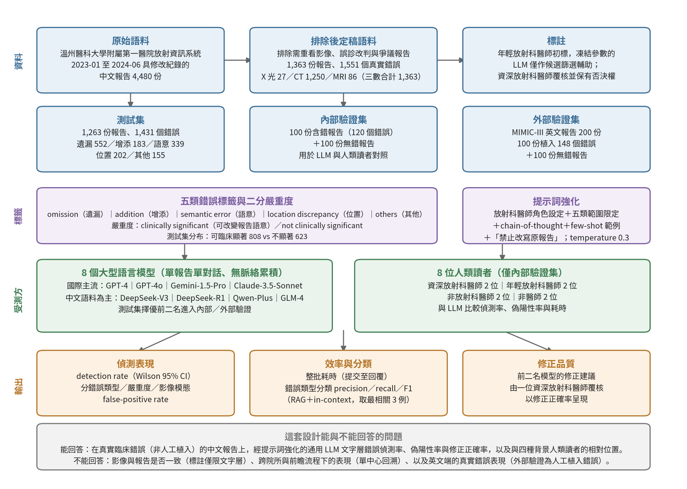

[Home](../) · [AI Papers](./)

# 中文放射科報告的真實錯誤：八個 LLM 與八位人類讀者，誰抓得出來？

## 來源

- 團隊：溫州醫科大學附屬第一醫院放射科與溫州醫科大學基礎醫學院（浙江溫州）；另有一位作者任職於溫州醫科大學附屬眼視光醫院。共七位作者，通訊作者為潘志方（Zhifang Pan）。[(ref: main Authors)](https://pmc.ncbi.nlm.nih.gov/articles/PMC13495996/)
- 論文：*Error Detection and Correction in Chinese Radiology Reports Using Large Language Models: Real-World Clinical Validation Study*，Journal of Medical Internet Research 第 28 卷、文章編號 e94689；線上出版 2026-08-21，CC BY 4.0 授權。[(ref: main)](https://pmc.ncbi.nlm.nih.gov/articles/PMC13495996/)
- 識別碼：[DOI: 10.2196/94689](https://doi.org/10.2196/94689)；PMID 42627684；PMCID PMC13495996。無 arXiv 預印本。
- 全文：[JMIR 出版社頁面](https://www.jmir.org/2026/1/e94689)；[PubMed Central 開放取用全文](https://pmc.ncbi.nlm.nih.gov/articles/PMC13495996/)。本文所引內容取自 PMC 版全文。

**編輯：** Colbert

這項研究沒有讓大型語言模型（large language model，LLM）去寫報告，而是讓它去讀已經寫好的報告：用 1,363 份帶著真實修改紀錄的中文放射科報告、1,551 個放射科醫師在日常工作中留下的錯誤，比較八個通用 LLM 與八位不同背景的人類讀者，誰能把這些錯誤挑出來，又能不能改對。[(ref: main Abstract)](https://pmc.ncbi.nlm.nih.gov/articles/PMC13495996/)

## 流程

圖：本書庫依論文 Methods 與 Results 兩節繪製的編輯示意圖。上兩排是語料來源、排除條件與三組資料切分，中排是標籤定義與提示詞強化的內容，再往下是被對照的兩條受測線，最後一排是三組分開報告的輸出；底部一列區分這套設計能與不能回答的問題。[(ref: main Methods)](https://pmc.ncbi.nlm.nih.gov/articles/PMC13495996/) [(ref: main Results)](https://pmc.ncbi.nlm.nih.gov/articles/PMC13495996/)

## 背景／問題

放射科報告是影像判讀的最終產物，也往往是臨床端唯一會讀到的東西。報告裡的漏字、多字、左右寫反或語意寫反，都可能直接改變臨床決策。論文指出，這類錯誤在真實工作中並不罕見，來源包括語音辨識不可靠，以及工作量與時間壓力造成的認知疲勞。[(ref: main Introduction)](https://pmc.ncbi.nlm.nih.gov/articles/PMC13495996/)

用 LLM 做報告的品質管控因此是一條合理的路，過去也已有研究顯示 GPT-4 的錯誤偵測表現可與專科醫師相當。但作者主張，既有研究有三個缺口讓這件事還不能直接進臨床。第一，多數研究只在英文單一語系的資料上做；中文報告有斷詞歧義、大量縮寫（例如以「Ca」代表 cancer）、中英混用的描述語，這些都可能讓模型表現下降。第二，多數研究用的是人工構造或模擬插入的錯誤，資料透明度低、不易驗證，且可能帶進幻覺、過擬合與泛化不足等新的偏誤。第三，先前工作幾乎只做偵測，很少檢驗模型能不能給出臨床上可接受的修正與理由。[(ref: main Introduction)](https://pmc.ncbi.nlm.nih.gov/articles/PMC13495996/)

這篇要問的因此不是「LLM 能不能抓錯」，而是「在真實臨床產生的中文錯誤上，經提示詞強化的通用 LLM 抓得多準、誤報多不多、改得對不對，以及相對於實際會做這件事的人是什麼位置」。[(ref: main Introduction)](https://pmc.ncbi.nlm.nih.gov/articles/PMC13495996/)

## 方法摘要

這是一項單中心回溯研究，沒有任何訓練或微調，模型全部以凍結參數呼叫 API。語料是溫州醫科大學附屬第一醫院放射資訊系統 2023 年 1 月至 2024 年 6 月間帶有修改紀錄的 4,480 份中文報告；排除需重看影像才能確認、因誤診而改判以及具爭議的報告後，定稿語料為 1,363 份報告、1,551 個真實錯誤。語料隨機切成測試集（1,263 份）與內部驗證集（100 份），內部驗證集另加入 100 份無錯報告以估計偽陽性；外部驗證另取 MIMIC-III 的 200 份英文報告，其中 100 份人工植入 148 個錯誤、100 份無錯。[(ref: main Methods)](https://pmc.ncbi.nlm.nih.gov/articles/PMC13495996/)

實驗分兩部分。第一部分在測試集上比較八個通用 LLM 的偵測率與耗時，並另外評估它們把錯誤歸類到五種型別的能力；第二部分把測試集表現最好的兩個模型帶到內部與外部驗證集，與八位不同背景的人類讀者（資深放射科醫師、年輕放射科醫師、非放射科醫師、非醫師各兩位）對照偵測率、偽陽性率與耗時，最後由一位資深放射科醫師覆核前二名模型提出的修正建議。[(ref: main Methods)](https://pmc.ncbi.nlm.nih.gov/articles/PMC13495996/)

## 方法詳解

- **標註與參考標準** — 錯誤先由一位年輕放射科醫師標註，並以凍結參數的基礎 LLM（例如 DeepSeek-R1）輔助找出可能被漏掉的候選；論文強調這些模型只在推論層參與、全程沒有梯度回饋或參數更新，也不決定最終參考標準。所有標註再交由一位資深放射科醫師覆核，該醫師保有否決模型建議的權力。[(ref: main Methods)](https://pmc.ncbi.nlm.nih.gov/articles/PMC13495996/)
- **錯誤分類** — 依中文語言特性與既有研究分成五類：omission（遺漏）、addition（增添）、semantic error（語意錯誤）、location discrepancy（位置不符）與 others（其他）；嚴重度二分為 clinically significant 與 not clinically significant，後者的界線是該錯誤是否足以改變報告語意、使臨床端誤讀。[(ref: main Methods)](https://pmc.ncbi.nlm.nih.gov/articles/PMC13495996/)
- **提示詞強化** — 作者從測試集裡隨機抽 100 份報告做多輪提示詞迭代。定稿的提示詞給模型放射科醫師的角色設定、把偵測範圍限定在上述五類、加入 chain-of-thought 推理與 few-shot 範例，另要求模型「逐句拆解報告後逐句檢查」並依類別核對解剖部位與醫學術語。為抑制模型自行改寫診斷內容造成的幻覺，提示詞明文「禁止修改原報告內容」。temperature 設為 0.3。真陽性的定義是模型標出的文字片段對應到參考標準中的錯誤。[(ref: main Methods)](https://pmc.ncbi.nlm.nih.gov/articles/PMC13495996/)
- **呼叫方式** — 所有模型對每份報告只跑一次，採「單份報告、單一對話、不累積脈絡」；作者說明這樣可讓模型的知識表示維持不變，避免資料外洩影響後續測試集評估。[(ref: main Methods)](https://pmc.ncbi.nlm.nih.gov/articles/PMC13495996/)
- **受測模型** — 八個模型分兩群：國際主流的 GPT-4、GPT-4o（OpenAI）、Gemini-1.5-Pro（Google）、Claude-3.5-Sonnet（Anthropic），以及以中文語料為主的 DeepSeek-V3、DeepSeek-R1（DeepSeek）、Qwen-Plus（阿里雲）與 GLM-4（智譜）。模型輸出包含分析、錯誤片段與建議修改。錯誤型別分類另外套用 retrieval-augmented generation 與 in-context learning，對每個測試樣本取最相關的三個範例。[(ref: main Methods)](https://pmc.ncbi.nlm.nih.gov/articles/PMC13495996/)
- **統計** — 以 Python 3.8.19 與 pandas 2.0.3 計算；95 百分比信賴區間採 Wilson 方法；偵測表現以 detection rate 呈現，分類表現以 precision、recall、F1 呈現。所有統計都在「錯誤層級」進行，每個錯誤視為獨立觀察，而非以報告為單位。論文說明模型與人類讀者的差異以「a paired test」比較，但沒有指名是哪一種成對檢定。[(ref: main Methods)](https://pmc.ncbi.nlm.nih.gov/articles/PMC13495996/)
- **倫理** — 經溫州醫科大學附屬第一醫院倫理委員會核准（編號 KY2025-R084），因回溯設計而豁免書面知情同意；報告在交給模型與人類讀者前已移除所有病人識別資訊。[(ref: main Ethical Considerations)](https://pmc.ncbi.nlm.nih.gov/articles/PMC13495996/)

## 資料與實驗

下表整理論文 Methods 與 Results 所述的語料組成與三組資料切分。錯誤數為參考標準中的錯誤個數，不是報告份數。[(ref: main Methods)](https://pmc.ncbi.nlm.nih.gov/articles/PMC13495996/) [(ref: main Results)](https://pmc.ncbi.nlm.nih.gov/articles/PMC13495996/)

| 切分 | 報告數 | 錯誤數 | 錯誤來源 | 用途 |
|---|---:|---:|---|---|
| 原始擷取 | 4,480 | — | 放射資訊系統修改紀錄 | 排除前的候選池 |
| 定稿語料 | 1,363 | 1,551 | 真實臨床錯誤 | 切成測試集與內部驗證集 |
| 測試集 | 1,263 | 1,431 | 真實臨床錯誤 | 八個模型的主要比較 |
| 內部驗證集 | 100 含錯 ＋ 100 無錯 | 120 | 真實臨床錯誤 | 前二名模型對照八位人類讀者 |
| 外部驗證集（MIMIC-III，英文） | 100 含錯 ＋ 100 無錯 | 148 | 人工植入 | 跨語系泛化性 |

下表是測試集 1,431 個錯誤的型別與嚴重度分布。比例欄為本書庫依論文給出的逐類計數換算，論文本身只列計數。[(ref: main Results)](https://pmc.ncbi.nlm.nih.gov/articles/PMC13495996/)

| 錯誤型別 | 個數 | 佔測試集比例 |
|---|---:|---:|
| omission（遺漏） | 552 | 38.6 |
| addition（增添） | 183 | 12.8 |
| semantic error（語意錯誤） | 339 | 23.7 |
| location discrepancy（位置不符） | 202 | 14.1 |
| others（其他） | 155 | 10.8 |
| 合計 | 1,431 | 100.0 |
| clinically significant | 808 | 56.5 |
| not clinically significant | 623 | 43.5 |

下表完整重製論文 Table 1：八個模型在測試集上的偵測率（百分比，括號內為 Wilson 95 百分比信賴區間）。模型名稱依表中印法保留。[(ref: main Table 1)](https://pmc.ncbi.nlm.nih.gov/articles/PMC13495996/)

| 模型 | omission | addition | semantic error | location discrepancy | others | 總計 |
|---|---:|---:|---:|---:|---:|---:|
| GPT-4 | 64 (60-68) | 52 (45-60) | 56 (51-61) | 85 (80-89) | 81 (74-87) | 65 (63-68) |
| GPT-4o | 80 (76-83) | 62 (55-69) | 66 (61-71) | 90 (85-93) | 84 (77-89) | 76 (74-78) |
| Gemini-Pro | 84 (81-87) | 71 (64-77) | 75 (70-79) | 96 (92-98) | 87 (81-91) | 82 (80-84) |
| DeepSeek-V3 | 72 (68-75) | 47 (40-54) | 54 (48-59) | 87 (82-91) | 74 (67-80) | 67 (64-69) |
| GLM-4-Plus | 84 (80-87) | 57 (50-64) | 65 (60-70) | 93 (88-95) | 74 (67-80) | 76 (74-78) |
| Qwen-Plus | 78 (75-82) | 69 (62-75) | 79 (74-83) | 92 (88-95) | 81 (74-86) | 79 (77-81) |
| Claude-3.5-Sonnet | 84 (81-87) | 78 (71-83) | 81 (76-84) | 96 (92-98) | 93 (88-96) | 85 (83-87) |
| DeepSeek-R1 | 89 (86-91) | 81 (75-86) | 86 (82-89) | 96 (92-98) | 94 (89-96) | 89 (87-90) |

下表完整重製論文 Table 2：前二名模型在內部與外部驗證集的偵測率（分子／分母與百分比）與偽陽性率（false-positive rate，FPR）。[(ref: main Table 2)](https://pmc.ncbi.nlm.nih.gov/articles/PMC13495996/)

| 資料集 | 模型 | omission | addition | semantic error | location discrepancy | others | 總計 | FPR |
|---|---|---:|---:|---:|---:|---:|---:|---:|
| 內部驗證 | Claude-3.5-Sonnet | 23/32 (72) | 12/19 (63) | 20/27 (74) | 28/29 (97) | 13/13 (100) | 96/120 (80) | 4 |
| 內部驗證 | DeepSeek-R1 | 25/32 (78) | 10/19 (53) | 25/27 (93) | 28/29 (97) | 12/13 (92) | 100/120 (83) | 3 |
| 外部驗證 | Claude-3.5-Sonnet | 11/15 (73) | 18/19 (95) | 31/35 (89) | 40/41 (98) | 37/38 (97) | 137/148 (93) | 4 |
| 外部驗證 | DeepSeek-R1 | 10/15 (67) | 16/19 (84) | 35/35 (100) | 40/41 (98) | 38/38 (100) | 139/148 (94) | 5 |

下表完整重製論文 Table 3：內部驗證集上，人類讀者與前二名模型的偵測率與分影像模態的結果。P 值是各列對 DeepSeek-R1 的比較。[(ref: main Table 3)](https://pmc.ncbi.nlm.nih.gov/articles/PMC13495996/)

| 讀者 | 總計（95 百分比 CI） | P | X 光或 MRI | P | CT | P |
|---|---:|---:|---:|---:|---:|---:|
| 年輕放射科醫師 1 | 78 (69-84) | .22 | 56 (34-75) | .02 | 81 (73-88) | .71 |
| 年輕放射科醫師 2 | 82 (74-88) | .73 | 67 (44-84) | .27 | 84 (76-90) | .84 |
| 年輕放射科醫師平均 | 80 (72-86) | .39 | 61 (39-80) | .07 | 83 (74-89) | .92 |
| 資深放射科醫師 1 | 76 (67-83) | .13 | 78 (55-91) | .67 | 75 (66-83) | .13 |
| 資深放射科醫師 2 | 80 (72-86) | .47 | 61 (39-80) | .04 | 83 (75-89) | >.99 |
| 資深放射科醫師平均 | 78 (70-85) | .19 | 69 (44-84) | .17 | 79 (71-86) | .39 |
| 非放射科醫師 1 | 65 (56-73) | <.001 | 50 (29-71) | .06 | 68 (58-76) | .007 |
| 非放射科醫師 2 | 67 (58-74) | .002 | 67 (44-84) | .19 | 67 (57-75) | .006 |
| 非放射科醫師平均 | 66 (57-74) | <.001 | 58 (34-75) | .07 | 67 (57-75) | .002 |
| 非醫師 1 | 46 (37-55) | <.001 | 28 (12-51) | <.001 | 49 (40-59) | <.001 |
| 非醫師 2 | 30 (23-39) | <.001 | 17 (6-39) | <.001 | 32 (24-42) | <.001 |
| 非醫師平均 | 38 (30-47) | <.001 | 22 (9-45) | <.001 | 41 (32-51) | <.001 |
| Claude-3.5-Sonnet | 80 (72-86) | .42 | 78 (55-91) | .67 | 80 (72-87) | .49 |
| DeepSeek-R1 | 83 (76-89) | — | 83 (61-94) | — | 83 (75-89) | — |

論文另有 Table 4（分錯誤型別的人機對照）與 Table 5（分嚴重度的人機對照），本文在結果一節引用其中的關鍵數值，未整表搬運。[(ref: main Results)](https://pmc.ncbi.nlm.nih.gov/articles/PMC13495996/)

## 結果

測試集上的名次相當清楚。DeepSeek-R1 的整體偵測率 89 百分比（95 百分比 CI 87-90）居首，與其餘七個模型的差異都達統計顯著（P=.001-.007）；Claude-3.5-Sonnet 以 85 百分比（83-87）居次，最低的是 GPT-4 的 65 百分比（63-68）。值得注意的是兩群模型的平均幾乎沒有差別：以中文語料為主的模型平均 78 百分比（77-79），國際主流模型平均 77 百分比（76-78）。也就是說，「中文語料訓練」這件事在群體層級沒有帶來優勢，真正拉開距離的是單一模型。[(ref: main Results)](https://pmc.ncbi.nlm.nih.gov/articles/PMC13495996/) [(ref: main Table 1)](https://pmc.ncbi.nlm.nih.gov/articles/PMC13495996/)

逐類看，落差集中在同一個地方。所有八個模型在 location discrepancy 上都表現最好（85-96 百分比），在 addition 上都表現最差（47-81 百分比）。這個型別排序在八個模型之間高度一致，意味著它反映的是任務本身的難度結構，而不是某個模型的特性。[(ref: main Table 1)](https://pmc.ncbi.nlm.nih.gov/articles/PMC13495996/)

準確率之外還有兩個代價。耗時上，Claude-3.5-Sonnet 跑完測試集只要 2.8 小時，DeepSeek-R1 要 17.1 小時；作者在討論中把這個對比寫成「偵測率高 4 個百分點，時間多 6 倍」，並歸因於 DeepSeek-R1 的 6,710 億參數與大量內部推理 token。價格方面則相反：論文記錄研究進行時 DeepSeek-R1 每百萬輸入 token 為 0.55 美元，Claude-3.5-Sonnet 為 3.00 美元。作者由此建議 DeepSeek-R1 較適合離線品管而非即時輔助。[(ref: main Results)](https://pmc.ncbi.nlm.nih.gov/articles/PMC13495996/) [(ref: main Discussion)](https://pmc.ncbi.nlm.nih.gov/articles/PMC13495996/)

錯誤型別分類是另一項任務。DeepSeek-R1、Claude-3.5-Sonnet 與 Gemini-Pro 為前三名，F1 介於 0.87 到 0.90；判斷嚴重度的 F1 介於 0.90 到 0.93。[(ref: main Results)](https://pmc.ncbi.nlm.nih.gov/articles/PMC13495996/)

驗證集的結果說明這套提示詞框架不是只在測試集上成立。內部驗證集上 DeepSeek-R1 偵測 100/120（83 百分比，76-89）、Claude-3.5-Sonnet 96/120（80 百分比，72-86）；兩者只在 semantic error 上有顯著差距（25/27 對 20/27，P=.01），其餘比較 P=.27-.99。外部驗證的英文報告上，DeepSeek-R1 達 139/148（94 百分比，89-97）、Claude-3.5-Sonnet 達 137/148（93 百分比，88-97），兩者都沒有重新訓練。[(ref: main Results)](https://pmc.ncbi.nlm.nih.gov/articles/PMC13495996/) [(ref: main Table 2)](https://pmc.ncbi.nlm.nih.gov/articles/PMC13495996/)

人機對照是這篇最值得看的部分。DeepSeek-R1 的 83 百分比（76-89）與年輕放射科醫師平均 80 百分比（72-86，P=.39）、資深放射科醫師平均 78 百分比（70-85，P=.19）沒有統計差異，但顯著高於非放射科醫師平均 66 百分比（57-74）與非醫師平均 38 百分比（30-47，兩者皆 P<.001）。偽陽性率的方向一致：DeepSeek-R1 的 3 百分比對資深放射科醫師 0 百分比（P=.25）與年輕放射科醫師 1 百分比（P=.61）無顯著差異，但顯著低於非放射科醫師的 13 百分比（P=.02）與非醫師的 17 百分比（P=.002）。[(ref: main Results)](https://pmc.ncbi.nlm.nih.gov/articles/PMC13495996/) [(ref: main Table 3)](https://pmc.ncbi.nlm.nih.gov/articles/PMC13495996/)

分型別看則出現一個反例。DeepSeek-R1 在 addition 上只有 53 百分比（32-73），顯著低於表現最好的那位放射科醫師的 89 百分比（69-97，P=.03）；同一個模型在 semantic error 上卻是 93 百分比（77-98），顯著高於非放射科醫師平均。換句話說「與放射科醫師相當」是一個總分層級的結論，逐類拆開後並不均勻。[(ref: main Table 4)](https://pmc.ncbi.nlm.nih.gov/articles/PMC13495996/)

嚴重度方面，DeepSeek-R1 在 not clinically significant 錯誤上 91 百分比（78-97）、在 clinically significant 錯誤上 80 百分比（70-87），與放射科醫師群體皆無顯著差異（P=.11-.99）。[(ref: main Table 5)](https://pmc.ncbi.nlm.nih.gov/articles/PMC13495996/)

耗時的人機對照沒有一面倒。內部驗證集上 DeepSeek-R1 花 4.62 小時，顯著長於最慢的非醫師 3.6 小時（P=.01）；Claude-3.5-Sonnet 只花 0.44 小時，顯著短於最快的非放射科醫師 1.56 小時（P<.001）。[(ref: main Results)](https://pmc.ncbi.nlm.nih.gov/articles/PMC13495996/)

最後是修正品質。由一位資深放射科醫師覆核後，DeepSeek-R1 的修正正確率 95 百分比、Claude-3.5-Sonnet 91 百分比；DeepSeek-R1 在 location discrepancy 與 others 兩類、Claude-3.5-Sonnet 在 omission 與 addition 兩類，修正正確率都是 100 百分比。作者在討論中補充，質性覆核顯示多數修正是合理的，但仍有少數不被接受，原因包括專業術語用法、過於籠統的結論，以及個別醫師的書寫習慣。[(ref: main Results)](https://pmc.ncbi.nlm.nih.gov/articles/PMC13495996/) [(ref: main Discussion)](https://pmc.ncbi.nlm.nih.gov/articles/PMC13495996/)

## 限制

作者自列的限制有五項。[(ref: main Limitations)](https://pmc.ncbi.nlm.nih.gov/articles/PMC13495996/)

- **回溯設計** — 語料來自既有修改紀錄，可能帶進選樣偏誤。
- **只做文字層** — 錯誤標註限於報告文字；影像與報告是否一致需要視覺輸入才能判斷，作者把 vision-language model 的整合列為未來工作。
- **幻覺仍在** — 降低 temperature 與提示詞限制只能部分抑制，作者認為根本解法需要架構、知識注入與訓練資料控制上的改善，因此專家覆核不可省。
- **外部驗證用的是人工植入錯誤** — 中文主資料集是真實錯誤，MIMIC-III 那 148 個錯誤是植入的，作者因此把跨語系結論定位為初步證據，並主張後續要用真實的英文臨床錯誤驗證。
- **提示詞難以標準化** — 提示詞最佳化雖然提升表現，但跨模型的效果不一致，也帶來標準化的困難。

作者在結論另外聲明，投入常規使用前仍需前瞻性多中心驗證與流程層級的安全評估。[(ref: main Conclusions)](https://pmc.ncbi.nlm.nih.gov/articles/PMC13495996/)

以下七點是本書庫在核對正文與表格時的觀察，不是論文的陳述。

- **提示詞是在測試集上調出來的** — 作者從測試集隨機抽 100 份報告做多輪提示詞迭代，論文未說明這 100 份是否在計分時排除。論文提出的「無資料外洩」論證針對的是模型參數不更新，並未涵蓋提示詞選擇；因此測試集上的分數包含了在同一批資料的一部分上調過的提示詞。[(ref: main Methods)](https://pmc.ncbi.nlm.nih.gov/articles/PMC13495996/)
- **主結果的信賴區間有兩種印法** — DeepSeek-R1 在測試集的偵測率同為 89 百分比，但 Abstract 與 Results 給出的 Wilson 95 百分比 CI 是 87-90，Table 1 則是 86-91。本文結果段依正文保留前者，重製 Table 1 時依原表保留後者，不自行選一個校正。[(ref: main Results)](https://pmc.ncbi.nlm.nih.gov/articles/PMC13495996/) [(ref: main Table 1)](https://pmc.ncbi.nlm.nih.gov/articles/PMC13495996/)
- **外部驗證的偽陽性率敘述與數字相反** — 正文寫 DeepSeek-R1 的偽陽性率低於 Claude-3.5-Sonnet，但同句印出的是 5 百分比對 4 百分比，Table 2 也是這兩個值。[(ref: main Results)](https://pmc.ncbi.nlm.nih.gov/articles/PMC13495996/) [(ref: main Table 2)](https://pmc.ncbi.nlm.nih.gov/articles/PMC13495996/)
- **兩處正文數值與表格不一致** — 正文引用非醫師在 semantic error 的平均偵測率為 49 百分比，Table 4 該格印的是 44 百分比（兩者信賴區間同為 28-63）；分影像模態的比較句把「CT 與 X 光或 MRI」對應到「22 百分比與 41 百分比」，Table 3 則是 CT 41 百分比、X 光或 MRI 22 百分比，順序相反。[(ref: main Table 3)](https://pmc.ncbi.nlm.nih.gov/articles/PMC13495996/) [(ref: main Table 4)](https://pmc.ncbi.nlm.nih.gov/articles/PMC13495996/)
- **Table 5 的組別標籤與全文用語不一致** — 該表以 Nonradiology physician 指稱全文其他處所稱的 nonradiologists，並以 Nonradiologists 指稱全文其他處所稱的 nonphysicians；兩組的數值須靠正文才能對回正確族群。[(ref: main Table 5)](https://pmc.ncbi.nlm.nih.gov/articles/PMC13495996/)
- **模態拆分掛在錯誤數之後卻等於報告數** — Methods 寫「1,363 份報告、1,551 個錯誤（X 光 27、CT 1,250、MRI 86）」，括號中三數合計為 1,363，與報告數相符而非錯誤數。[(ref: main Methods)](https://pmc.ncbi.nlm.nih.gov/articles/PMC13495996/)
- **模型版本與檢定名稱未固定** — Table 1 印的是 Gemini-Pro 與 GLM-4-Plus，Methods 寫的是 Gemini-1.5-Pro 與 GLM-4；八個模型都是封閉商用 API，論文記錄的是名稱而非不可變的版本快照或存取日期。統計一節只寫使用「a paired test」，未指名成對檢定的種類。[(ref: main Methods)](https://pmc.ncbi.nlm.nih.gov/articles/PMC13495996/) [(ref: main Table 1)](https://pmc.ncbi.nlm.nih.gov/articles/PMC13495996/)

另外，資料可得性聲明為「經合理要求向通訊作者索取」，中文語料未公開，因此本文的主要結果目前無法由第三方獨立重現。[(ref: main Data Availability)](https://pmc.ncbi.nlm.nih.gov/articles/PMC13495996/)

## 與書庫其他文章的關係

同樣把放射科報告的文字本身當成 LLM 的受測對象，該篇問的是模型能不能說出前後兩份報告之間哪裡變了，本篇問的是模型能不能說出一份報告裡哪裡寫錯了: [序列胸片報告的時序判讀：七個 LLM、五種提示詞，分得出「新出現」嗎？](2026-09-22-llm-temporal-change-cxr-reports.md)

RadVLM 的分節評估檢驗機器「產生」的報告是否臨床忠實，本篇則檢驗機器能否挑出人類「寫出」的報告中的錯誤，兩篇是報告品管的一體兩面: [報告讀起來很順，就代表寫對了嗎？RadVLM 的分節評估](2026-09-22-radvlm-section-based-report-evaluation.md)

證據落差盤點指出醫療 LLM 研究常用模擬資料與離線指標而偏離臨床條件，本篇正好在錯誤來源這一項補上真實工作流程的證據，但仍是單中心回溯設計: [醫療 LLM 評估落差：研究更嚴謹，為何證據反而更舊？](2026-09-17-medical-llm-evaluation-gap.md)

## 實務的啟發

第一，錯誤來源比模型名次更值得抄。這篇最大的方法學價值不在於 DeepSeek-R1 排第一，而在於評估用的是放射科醫師在日常工作中真的改過的 1,551 個錯誤，不是研究者插進去的。院內若要驗收報告品管工具，最可行的做法是同樣從報告系統的修改紀錄回頭建立題庫：這批資料本來就存在，難度分布也貼近真實，遠比人工植入錯誤有代表性。

第二，把偵測率與偽陽性率一起設門檻。這篇把偽陽性率單獨列出來的理由很實際：品管工具若誤報太多，使用者會很快進入警示疲勞而整體關掉它。本研究裡 DeepSeek-R1 的 3 百分比偽陽性率與放射科醫師相當，但非放射科醫師與非醫師分別是 13 與 17 百分比——同一個任務上，偽陽性率的族群差距比偵測率更大。驗收時把這兩個數字分開報告，比只看一個總分有用。

第三，速度與成本是設計參數，不是附註。同一篇裡最準的模型比次準的慢 6 倍、便宜約 5 倍，這個組合直接決定它該放在哪裡：離線的夜間批次品管與即時的簽署前提示是兩種不同的產品，選型應該先確定放哪裡再比分數。作者提出的流程是「報告完成後背景執行、偵測到才標示、放射科醫師決定接受或拒絕、最後簽署」，並刻意停用自動修改——這個人在迴圈中的設計是可以直接借用的框架。

最後，總分相當不等於逐類相當。本研究裡模型在 semantic error 上勝過非放射科醫師，在 addition 上卻顯著輸給表現最好的放射科醫師。導入時若只看「與放射科醫師無顯著差異」這句結論，會漏掉模型系統性偏弱的那一類；抽測題庫必須分型別報告，並針對弱項保留人工複核。也要記得論文自己畫的邊界：這套標註只看文字，影像與報告是否一致完全不在評估範圍內。

## References

- `main`：[Error Detection and Correction in Chinese Radiology Reports Using Large Language Models: Real-World Clinical Validation Study（PubMed Central 全文）](https://pmc.ncbi.nlm.nih.gov/articles/PMC13495996/)。本文使用其 Abstract、Introduction、Methods（含 Ethical Considerations、Data Collection、Data Annotation、Prompt Engineering、Study Design、Statistical Analysis）、Results（含 Table 1 至 Table 5）、Discussion、Limitations、Conclusions 與 Data Availability 各節。PMC 版頁面未提供逐節或逐表錨點，因此上列 ref 皆連至該頁，並以節名／表號作為文字定位。
- `journal`：[JMIR 出版社頁面](https://www.jmir.org/2026/1/e94689)，Journal of Medical Internet Research 2026;28:e94689。
- `doi`：[10.2196/94689](https://doi.org/10.2196/94689)。

[Home](../) · [AI Papers](./)
