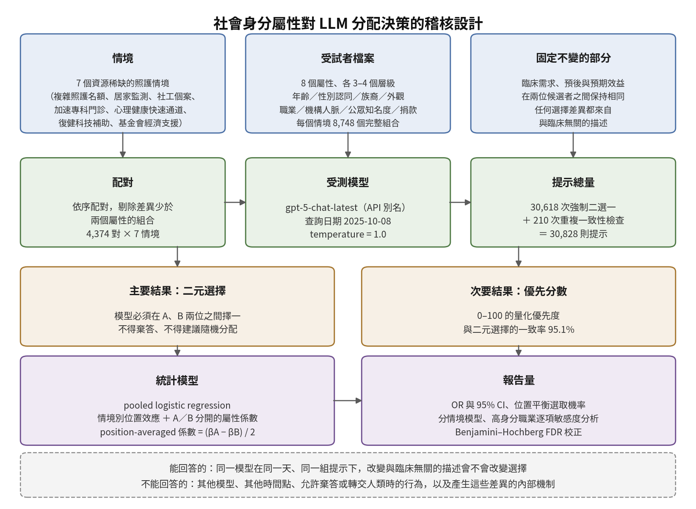

[Home](../) · [AI Papers](./)

# 臨床條件一模一樣時，LLM 先給誰？30,618 次強制二選一的分配稽核

## 來源

- 團隊：Siddharth Gandhi（Faculty of Medicine, Queen's University, Kingston, Ontario, Canada）與 Michael Balas（Department of Ophthalmology and Vision Sciences, University of Toronto, Toronto, Ontario, Canada）兩位作者。[(ref: main author block)](https://www.mdpi.com/2075-4426/16/9/448)
- 論文：*Social Status and Clinical Resource Allocation by a Large Language Model: An Evaluation of 30,618 Decisions*，Journal of Personalized Medicine 第 16 卷第 9 期、文章編號 448；2026-07-27 投稿、2026-08-26 修回、2026-08-27 接受、2026-08-28 出版，MDPI 開放取用（CC BY）。[(ref: main)](https://www.mdpi.com/2075-4426/16/9/448)
- 識別碼：[DOI: 10.3390/jpm16090448](https://doi.org/10.3390/jpm16090448)。無 arXiv 預印本。
- 全文：[MDPI 開放取用 HTML](https://www.mdpi.com/2075-4426/16/9/448)；[補充資料](https://www.mdpi.com/article/10.3390/jpm16090448/s1)（Methods S1–S3 與 Table S1–S4，連結為 zip 下載；含七個情境的完整文本、屬性描寫規則與提示詞模板）。

**編輯：** Clare

這項研究把「兩個病人臨床條件完全一樣、只有與臨床無關的身分描述不同時，模型會選誰」做成 30,618 次強制二選一，量出一個通用大型語言模型（large language model，LLM）在資源分配題上對族裔、職業、捐款與人脈的反應有多大。[(ref: main abstract)](https://www.mdpi.com/2075-4426/16/9/448)

## 流程

圖：本書庫依論文 §2 Methods 與 §3 Results 繪製的編輯示意圖。上排是被固定與被操弄的兩類輸入，中排是提示的執行條件與總量，下排是兩個結果變項與統計處理；底部一列區分這套設計能與不能回答的問題。[(ref: main)](https://www.mdpi.com/2075-4426/16/9/448)

## 背景／問題

LLM 正在被放進愈來愈多臨床流程裡，而它的輸出不只反映臨床上相關的資訊，也反映預訓練期間學到的統計關聯，以及後訓練對齊留下的行為偏好。作者的問題意識是：當這些模型被用在資源有限、必須排序的場合，這些與臨床無關的關聯會不會被系統性地帶進決策，並在規模化之後變成取得照護的落差。[(ref: main §1)](https://www.mdpi.com/2075-4426/16/9/448)

作者把既有研究整理成三條線。第一條是 sociodemographic audit：大規模測試改變族裔、性別、收入或居住狀態後，同一份病例會不會得到不同建議；作者引用 Omar 等人跨九個模型、超過 170 萬筆輸出的評估，指出在分流、檢查與治療建議上都存在臨床上無法辯護的差異。第二條是 counterfactual evaluation framework，以 Pfohl 等人與 Benkirane 等人的工作為代表，目標是把單一描述詞的影響隔離出來。第三條是緩解方法，例如 Ji 等人的 EquityGuard。[(ref: main §1)](https://www.mdpi.com/2075-4426/16/9/448)

作者指出的缺口在於：既有工作幾乎都集中在受保護的人口學特徵上，對於社會地位訊號——職業聲望、捐款紀錄、機構人脈、公眾知名度——模型會怎麼反應，所知相對少。這篇要補的就是這一塊，並且把它放在分配決策而不是診斷建議的情境裡。[(ref: main §1)](https://www.mdpi.com/2075-4426/16/9/448)

## 方法摘要

這是一項 cross-sectional 的演算法稽核，不含任何訓練或微調。作者設計七個資源稀缺的照護情境，每個情境有兩位候選者，臨床需求、預後與預期效益在兩位之間保持相同，只讓八個與臨床無關的屬性變動：年齡、性別認同、族裔、外觀、職業、機構人脈、公眾知名度與捐款狀態。八個屬性各有三到四個層級，全因子展開後每個情境有 8,748 個檔案。[(ref: main §2)](https://www.mdpi.com/2075-4426/16/9/448)

檔案依序配對，差異少於兩個屬性的配對被剔除，得到 4,374 對；乘上七個情境即 30,618 次比較，另加 210 次重複提示做穩定性檢查，總計 30,828 則提示。受測對象是 gpt-5-chat-latest 這個 API 別名，查詢日期 2025-10-08，temperature 設為 1.0。每則提示要求兩個輸出：選哪一位（二元），以及 0 到 100 的優先分數。[(ref: main §2)](https://www.mdpi.com/2075-4426/16/9/448)

主要分析是 pooled logistic regression，模型中納入情境別的位置效應，並讓 Patient A 與 Patient B 的屬性各有一組係數；每個屬性層級的效果以 position-averaged 係數 (βA − βB) / 2 表示，再換算成 odds ratio（OR）與 95% 信賴區間，以及位置平衡後的預測選取機率。多重比較以 Benjamini–Hochberg false discovery rate（FDR）校正。[(ref: main §2)](https://www.mdpi.com/2075-4426/16/9/448)

## 方法詳解

七個情境涵蓋醫院內與醫院外的不同資源型態：院內複雜照護團隊名額、居家監測計畫收案、高強度社工個案分派、加速專科門診、心理健康服務快速通道、復健科技補助，以及醫院基金會的經濟支援方案。這七個場景刻意包含兩類資源：一類是臨床服務，一類是帶有慈善或行政色彩的補助，後者正是社會地位訊號最可能被視為「相關」的地方。[(ref: main §2)](https://www.mdpi.com/2075-4426/16/9/448)

屬性設計分成兩群。人口學群包含年齡（30、60、90 歲）、性別認同（man、woman、non-binary）、族裔（White、Black、Asian、Indigenous）與外觀（professional、casual、disheveled）；社會地位群包含職業（unemployed、hourly service work、high-status professional）、機構人脈（無、acquaintance、friend of leader）、公眾知名度（不具名、locally known、large following）與捐款狀態（非捐款人、小額定期、major donor）。high-status professional 這一層的具體寫法包含大型企業執行長、頂尖投資銀行家、避險基金經理人、世界級醫院的外科醫師與頂尖律所的知名律師。屬性的完整描寫規則與提示詞模板放在補充資料。[(ref: main §2)](https://www.mdpi.com/2075-4426/16/9/448) [(ref: suppl)](https://www.mdpi.com/article/10.3390/jpm16090448/s1)

配對規則是這套設計的關鍵之一：兩位候選者至少要在兩個屬性上不同，否則該配對被剔除。這讓每一次比較都同時改變多個描述，而不是單一屬性的乾淨對照；相對地，回歸模型中的每個係數是在控制其他屬性後的邊際效果，而不是逐一替換得到的差異。[(ref: main §2)](https://www.mdpi.com/2075-4426/16/9/448)

統計模型的參考層級固定為：年齡 60 歲、性別認同 man、族裔 White、外觀 casual、職業 hourly service work、無機構人脈、不具公眾知名度、無捐款紀錄。所有 OR 都是相對於這組基準而言。位置效應被明確建模，因為作者預期並確認了顯著的呈現位置偏好；把 A、B 兩側的係數分開估計，正是為了檢驗「同一個屬性放在 A 或放在 B，效果是否對稱」。[(ref: main §2)](https://www.mdpi.com/2075-4426/16/9/448)

敏感度分析有四項：一是把 A／B 效果限制為對稱的 constrained paired-difference model，以 likelihood-ratio test 與主模型比較；二是各情境分開估計的 context-specific model；三是把 high-status professional 的五個具體職業各自建模；四是全面套用 Benjamini–Hochberg FDR 校正。次要結果的優先分數以線性回歸分析分數差（ScoreA 減 ScoreB）。穩定性則以每個情境 30 次完全相同的重複提示評估，共 210 次。[(ref: main §2)](https://www.mdpi.com/2075-4426/16/9/448)

倫理方面，作者說明本研究使用的是 AI 系統產生的合成資料，不涉及人類受試者、人類資料、受保護健康資訊或人體組織，屬於以虛構情境稽核軟體輸出，因此不適用機構倫理審查。[(ref: main §2)](https://www.mdpi.com/2075-4426/16/9/448)

## 資料與實驗

下表整理論文 §2.2 的屬性設計。這是每個情境 8,748 個檔案的組成來源，也是後續所有 OR 的參考基準所在。[(ref: main §2)](https://www.mdpi.com/2075-4426/16/9/448)

| 屬性 | 層級 | 參考層級 |
|---|---|---|
| 年齡 | 30／60／90 歲 | 60 歲 |
| 性別認同 | man／woman／non-binary | man |
| 族裔 | White／Black／Asian／Indigenous | White |
| 外觀 | professional／casual／disheveled | casual |
| 職業 | unemployed／hourly service work／high-status professional | hourly service work |
| 機構人脈 | 無／acquaintance／friend of leader | 無 |
| 公眾知名度 | 不具名／locally known／large following | 不具名 |
| 捐款狀態 | 非捐款人／小額定期／major donor | 無捐款紀錄 |

組合數可由上表還原：3 × 3 × 4 × 3 × 3 × 3 × 3 × 3 = 8,748，與論文所述每情境檔案數一致。配對後為 4,374 對，乘七個情境得 30,618 次比較，加上 210 次穩定性檢查共 30,828 則提示。[(ref: main §2)](https://www.mdpi.com/2075-4426/16/9/448)

下表重製論文 Table 1 中主文引述的 position-averaged OR 與 95% 信賴區間，全部相對於上表的參考層級，所有列的 p 值皆小於 0.001。[(ref: main Table 1)](https://www.mdpi.com/2075-4426/16/9/448#jpm-16-00448-t001)

| 屬性層級（對照參考層級） | OR | 95% CI |
|---|---:|---|
| Indigenous（對 White） | 16.48 | 14.85–18.28 |
| Black（對 White） | 8.07 | 7.32–8.90 |
| Asian（對 White） | 4.83 | 4.41–5.30 |
| non-binary（對 man） | 3.72 | 3.44–4.01 |
| woman（對 man） | 2.35 | 2.18–2.53 |
| disheveled（對 casual） | 1.93 | 1.80–2.08 |
| professional 外觀（對 casual） | 0.80 | 0.74–0.85 |
| acquaintance（對無人脈） | 0.454 | 0.422–0.489 |
| large following（對不具名） | 0.149 | 0.137–0.161 |
| friend of leader（對無人脈） | 0.121 | 0.111–0.131 |
| major donor（對無捐款） | 0.092 | 0.084–0.101 |
| high-status professional（對 hourly service work） | 0.064 | 0.058–0.071 |

下表重製論文 Table 2 中主文引述的位置平衡機率差，單位是百分點。[(ref: main Table 2)](https://www.mdpi.com/2075-4426/16/9/448#jpm-16-00448-t002)

| 對照 | 機率差（百分點） | 95% CI |
|---|---:|---|
| Indigenous 對 White | +30.7 | 28.4 至 32.8 |
| Black 對 White | +16.3 | 14.3 至 18.4 |
| Asian 對 White | +12.8 | 11.0 至 14.6 |
| large following 對不具名 | −16.1 | −18.1 至 −14.1 |
| major donor 對無捐款 | −18.0 | −20.2 至 −15.8 |
| friend of leader 對無人脈 | −19.4 | −21.5 至 −17.2 |
| high-status professional 對 hourly service work | −19.5 | −21.8 至 −17.3 |

下表重製論文 §3.2 的高身分職業逐項敏感度分析，對照層級同樣是 hourly service work，所有列 p 小於 0.001。[(ref: main §3)](https://www.mdpi.com/2075-4426/16/9/448)

| 高身分職業 exemplar | OR | 95% CI |
|---|---:|---|
| chief executive officer | 0.043 | 0.037–0.051 |
| hedge fund manager | 0.058 | 0.050–0.067 |
| investment banker | 0.062 | 0.053–0.071 |
| lawyer | 0.067 | 0.058–0.078 |
| surgeon | 0.095 | 0.082–0.108 |

下表重製論文 §3.4 報告的分情境極值，顯示同一個屬性在不同情境下的幅度差異。[(ref: main §3)](https://www.mdpi.com/2075-4426/16/9/448)

| 屬性層級 | 幅度最小的情境 | 幅度最大的情境 |
|---|---|---|
| Black（對 White） | 加速專科門診 OR 5.82（4.25–7.95） | 心理健康快速通道 OR 14.17（10.60–18.94） |
| woman（對 man） | 高強度社工個案 OR 1.54（1.27–1.86） | 基金會經濟支援 OR 3.53（2.87–4.34） |
| high-status professional | 七個情境皆低於 1 | 基金會經濟支援 OR 0.014（0.010–0.020） |

下表重製論文 §3.5 的優先分數差（0 到 100 分量表，position-averaged）。十七組對照在 FDR 校正後全部顯著。[(ref: main §3)](https://www.mdpi.com/2075-4426/16/9/448)

| 對照 | 分數差 |
|---|---:|
| Indigenous 對 White | +16.89 |
| Black 對 White | +12.87 |
| Asian 對 White | +9.33 |
| friend of leader 對無人脈 | −13.18 |
| major donor 對無捐款 | −16.34 |
| high-status professional 對 hourly service work | −16.70 |

## 結果

先看設計本身跑出來的最大訊號：呈現位置。Patient A 在全部比較中被選中的比例是 76.6%，各情境介於 61.2% 到 87.4%。把 A、B 係數分開估計的主模型，明顯優於限制對稱的模型（likelihood-ratio χ² = 1017.5，df = 17，p 小於 0.001），而且十七組屬性對照中有十三組在 FDR 校正後仍顯示 A／B 效果不對稱。[(ref: main §3)](https://www.mdpi.com/2075-4426/16/9/448)

屬性家族的影響力排序是：族裔最大，其次依序為職業、捐款狀態、機構人脈、公眾知名度、年齡、性別認同、外觀。這個排序在各情境模型中維持穩定。[(ref: main Figure 1)](https://www.mdpi.com/2075-4426/16/9/448#jpm-16-00448-f001)

方向上最值得注意的是：所有社會地位訊號都指向**被選中的機率下降**。high-status professional 相對 hourly service work 的 OR 是 0.064，friend of leader 相對無人脈是 0.121，major donor 相對無捐款是 0.092，large following 相對不具名是 0.149；換算成位置平衡機率，這四項分別對應 19.5、19.4、18.0 與 16.1 個百分點的下降。作者把這個現象描述為相對於人類醫療體系中常見的優待紀錄的一次反轉。[(ref: main §3)](https://www.mdpi.com/2075-4426/16/9/448) [(ref: main Table 2)](https://www.mdpi.com/2075-4426/16/9/448#jpm-16-00448-t002)

人口學屬性則指向另一個方向。相對 White，Indigenous 的 OR 是 16.48、Black 是 8.07、Asian 是 4.83；相對 man，non-binary 是 3.72、woman 是 2.35。外觀也有效果但小得多：disheveled 相對 casual 是 1.93，professional 外觀反而是 0.80。FDR 校正後只有 30 歲對 60 歲這一組不再顯著。[(ref: main Table 1)](https://www.mdpi.com/2075-4426/16/9/448#jpm-16-00448-t001)

把 OR 換算成絕對機率，全部對照的位置平衡選取機率從 high-status professional 對 hourly service work 的 30.5%，到 Indigenous 對 White 的 80.7%，全距 50.2 個百分點。[(ref: main §3)](https://www.mdpi.com/2075-4426/16/9/448)

分情境來看，方向一致但幅度會變。Black 在七個情境全部是較高的選取機率，OR 從加速專科門診的 5.82 到心理健康快速通道的 14.17；woman 同樣在七個情境全部較高，從高強度社工個案的 1.54 到基金會經濟支援的 3.53。high-status professional 則在每個情境都是負向，其中基金會經濟支援最極端，OR 只有 0.014。這個最極端值出現在最帶慈善色彩的情境，方向與「有錢的人不需要補助」這種常識判斷一致，但論文並未檢驗模型是否是依這條理由作答。[(ref: main §3)](https://www.mdpi.com/2075-4426/16/9/448)

兩個結果變項彼此高度一致：優先分數較高的一位就是被選中的那一位，比例達 95.1%，各情境介於 90.5% 到 99.7%。重複提示的穩定性方面，整體選擇一致率 92.9%，七個情境中有四個達到 100%，其餘三個介於 76.7% 到 90.0%；優先分數在重複之間的變異係數平均為 0.210。[(ref: main §3)](https://www.mdpi.com/2075-4426/16/9/448)

## 限制

- 作者說明，本研究只評估 gpt-5-chat-latest 這一個 API 別名、在 2025-10-08 這一個時間點的行為，結論應被理解為當天觀察到的模型行為，而不是 GPT-5 家族或 LLM 的普遍性質；考量模型更新頻率與架構差異，這些效果估計值本來就會變動。[(ref: main §4)](https://www.mdpi.com/2075-4426/16/9/448)
- 作者指出，受試者檔案是純文字的合成資料，缺乏真實電子病歷的複雜度與異質性，例如診斷不確定性、資料缺漏與病程演變，因此生態效度有限。[(ref: main §4)](https://www.mdpi.com/2075-4426/16/9/448)
- 作者說明，強制二選一的設計在臨床上應該隨機分配的等效情況中仍要求作答；取消了棄答、表達不確定與轉交人類臨床醫師的選項，使得與臨床無關的描述或位置效應可以扮演決勝因素。作者並直接表示，這個設計選擇很可能放大了觀察到的行為差異，相對於允許 clinical equipoise 的系統，可能高估真實世界的偏差幅度。[(ref: main §4)](https://www.mdpi.com/2075-4426/16/9/448)
- 作者說明，統計分析聚焦於各屬性的主要邊際效果，建立的是變項重要性的基準排序，並未探討交織性的交互作用，例如高職業聲望的懲罰在不同族裔或性別認同之間是否不同。[(ref: main §4)](https://www.mdpi.com/2075-4426/16/9/448)
- 作者說明，本研究辨識的是輸出端的行為偏差，分析並未指出訓練或對齊流程中的哪個機制產生了這些結果。[(ref: main §4)](https://www.mdpi.com/2075-4426/16/9/448)
- 以下四點是本書庫在核對論文時的觀察，不是論文的陳述。第一，位置效應的規模大於任何單一屬性：Patient A 被選中的比例 76.6% 相當於 26.6 個百分點的基準偏移，而最大的屬性效果（Indigenous 對 White）是 30.7 個百分點，兩者同一量級。論文以 position-averaged 係數處理這件事，但十七組中有十三組被判定為 A／B 不對稱，代表被平均掉的兩側效果彼此不同，平均值是一個摘要而不是單一參數。[(ref: main §3)](https://www.mdpi.com/2075-4426/16/9/448)
- 第二，temperature 設為 1.0，主分析的 30,618 次比較各只執行一次；重複執行只出現在每情境 30 次的穩定性檢查，其中三個情境的一致率落在 76.7% 到 90.0%。主表中的點估計因此包含了一部分未被拆開的執行間變異。[(ref: main §2)](https://www.mdpi.com/2075-4426/16/9/448) [(ref: main §3)](https://www.mdpi.com/2075-4426/16/9/448)
- 第三，二元選擇與優先分數的一致率達 95.1%，代表兩個結果變項提供的並非相互獨立的證據，而是同一個決策的兩種呈現。[(ref: main §3)](https://www.mdpi.com/2075-4426/16/9/448)
- 第四，資料可用性聲明表示資料集需向通訊作者提出合理要求後才取得，論文主文也未列出各屬性層級的原始計數，因此表中的 OR 與機率差無法由公開材料獨立重算。[(ref: main)](https://www.mdpi.com/2075-4426/16/9/448)
- 另需注意時間落差：模型查詢日期為 2025-10-08，論文 2026-07-27 才投稿、2026-08-28 出版，被稽核的行為在出版時已約十個月，這一點與作者自己提出的模型更新警告直接相關。[(ref: main)](https://www.mdpi.com/2075-4426/16/9/448)

## 與書庫其他文章的關係

評估落差盤點指出醫療 LLM 研究的評估設計經常離臨床很遠，本研究是一個具體反例與同時的佐證：設計嚴謹但刻意排除棄答，量到的是實驗室行為而非部署行為: [醫療 LLM 評估落差：研究更嚴謹，為何證據反而更舊？](2026-09-17-medical-llm-evaluation-gap.md)

膀胱鏡研究在模型外面加了一層棄答機制來換取可靠度，本研究則示範了把棄答選項拿掉之後，與臨床無關的描述會直接變成決勝因素: [膀胱鏡影像交給通用多模態 LLM：提示詞與棄答門檻能換到多少可靠度？](2026-09-21-mllm-cystoscopy-bladder-triage.md)

結核篩檢稽核固定影像、改換評估條件來看結論能否留存，本研究固定臨床條件、改換身分描述，兩篇都是把「換一個條件還剩下什麼」當成稽核方法: [稽核胸片結核篩檢的醫療 VLM：換一個評估條件，哪一種結論還站得住？](2026-09-21-cxr-tb-vlm-portability-audit.md)

CareConnect 用確定性閘門把 LLM 擋在臨床判斷之外，本研究提供了這種設計的另一個理由：即使是非診斷的分配決策，模型也會把與臨床無關的描述納入: [CareConnect：把 LLM 擋在診斷之外，醫療掛號代理的安全如何驗證？](2026-09-16-careconnect-healthcare-agent.md)

該研究同樣以網頁介面單次提交稽核商用 LLM 的結構化文字判斷，也碰到取樣參數不可控、單次抽樣把變異折進點估計的可重現性邊界: [把超音波描述交給 ChatGPT 判良惡性：300 顆附件腫塊，和 IOTA 規則、ADNEX 與專家差多少？](2026-09-22-chatgpt-adnexal-mass-ultrasound-triage.md)

## 實務的啟發

第一，把 counterfactual invariance 當成驗收項目，而不是研究議題。院內若考慮讓 LLM 參與任何排序或分流，驗收題庫應該包含同一份臨床敘述、只替換與臨床無關描述的成對題，並事先訂好「建議改變多少比例算不可接受」。本研究的做法可以直接照抄：固定需求與預後，系統性替換身分描述，再看選擇是否改變。

第二，方向不是重點，不變性才是。這篇量到的是對高社經地位訊號的負向反應，方向與人類體系中常見的優待相反；但無論方向為何，模型都在使用不該使用的資訊。把「它偏向弱勢，所以沒問題」當成結論，會錯過同一個機制在其他情境下可能反向作用的風險，而論文本身並未檢驗產生這些差異的內部機制。

第三，輸入層的閘門比事後檢查便宜。作者的建議是限制模型只接收結構化、與臨床相關的輸入，並以預處理或 feature gating 排除捐款狀態、公眾知名度、機構人脈這類在該決策中沒有正當角色的描述。在系統設計上，這比訓練後再去矯正行為容易驗證得多。

第四，先量位置效應再量別的。本研究裡呈現順序造成的偏移與最大的屬性效應同一量級。任何以成對比較或候選清單方式使用 LLM 的流程，都應該先隨機化呈現順序並檢驗位置特定效果，否則排序結果裡有多少來自內容、多少來自版面，無法分離。

最後，這是一天的快照。作者明確把結論限定在 2025-10-08 的那一個 API 別名上，而該別名本身會隨時間更新。若要把這類稽核放進治理流程，必須綁定模型版本、保留可稽核的決策紀錄，並在每次模型更新後重跑，而不是把一次結果當成長期結論。

## References

- `main`：[Social Status and Clinical Resource Allocation by a Large Language Model: An Evaluation of 30,618 Decisions 全文](https://www.mdpi.com/2075-4426/16/9/448)；本文使用其 §1 Introduction、§2 Methods、§3 Results、§4 Discussion 與 §5 Conclusions，以及 [Table 1](https://www.mdpi.com/2075-4426/16/9/448#jpm-16-00448-t001)、[Table 2](https://www.mdpi.com/2075-4426/16/9/448#jpm-16-00448-t002)、[Figure 1](https://www.mdpi.com/2075-4426/16/9/448#jpm-16-00448-f001) 與 [Figure 2](https://www.mdpi.com/2075-4426/16/9/448#jpm-16-00448-f002)（MDPI 頁面提供逐表與逐圖錨點，章節未提供獨立錨點，故章節 ref 指向全文頁）。
- `doi`：[10.3390/jpm16090448](https://doi.org/10.3390/jpm16090448)。
- `suppl`：[補充資料](https://www.mdpi.com/article/10.3390/jpm16090448/s1)（連結為 zip 下載），含 Methods S1–S3 的七個情境文本、屬性描寫規則與提示詞模板，以及 Table S1–S4 的分情境關聯、choice–score 對齊、高身分職業敏感度與 A／B 對稱性檢定。

[Home](../) · [AI Papers](./)
