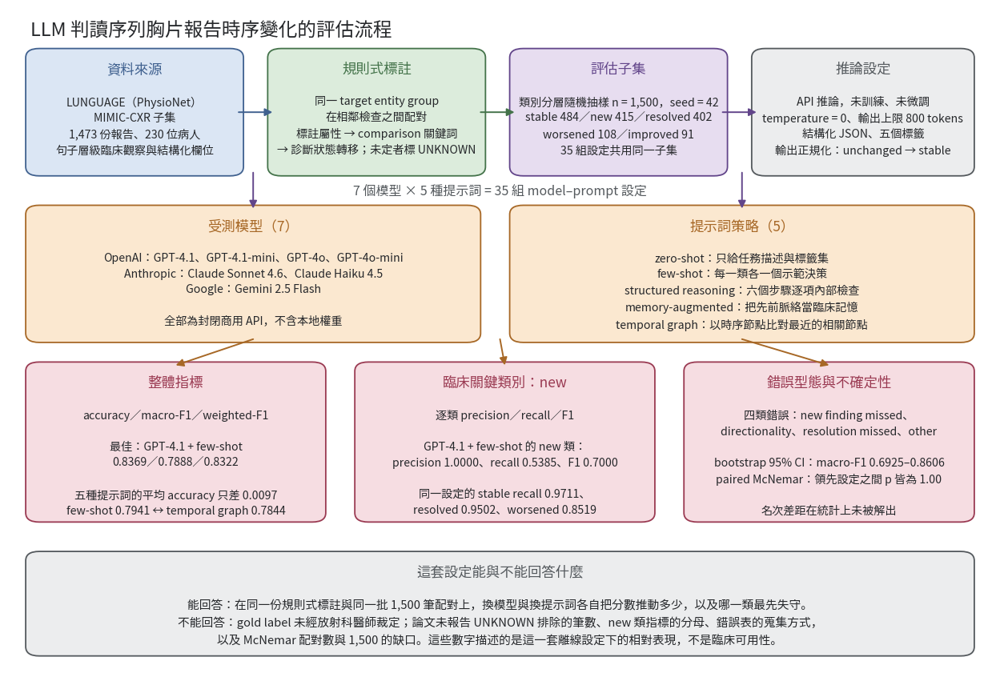

[Home](../) · [AI Papers](./)

# 序列胸片報告的時序判讀：七個 LLM、五種提示詞，分得出「新出現」嗎？

## 來源

- 團隊：Istanbul Medeniyet University, Department of Computer Engineering（İstanbul, Türkiye）；單一作者 Ertürk Erdağı，亦為通訊作者。[(ref: main author block)](https://www.frontiersin.org/journals/digital-health/articles/10.3389/fdgth.2026.1919939/full)
- 論文：*Detecting temporal clinical change in sequential chest radiography reports: a multi-model and multi-prompt evaluation of large language models*，Frontiers in Digital Health 第 8 卷、文章編號 1919939；線上日期 2026-08-20，正式出版 2026-09-04，CC BY 授權。[(ref: main)](https://www.frontiersin.org/journals/digital-health/articles/10.3389/fdgth.2026.1919939/full)
- 識別碼：[DOI: 10.3389/fdgth.2026.1919939](https://doi.org/10.3389/fdgth.2026.1919939)。無 arXiv 預印本。
- 全文：[Frontiers 開放取用 HTML](https://www.frontiersin.org/journals/digital-health/articles/10.3389/fdgth.2026.1919939/full)；[PDF](https://www.frontiersin.org/journals/digital-health/articles/10.3389/fdgth.2026.1919939/pdf)。本文的 §6 Discussion、§7 Conclusion 與參考文獻內容取自 PDF。

**編輯：** Clare

這項研究把「這次和上次相比，某個病灶是新出現、變好、變壞、沒變還是已消失」寫成一個五類分類題，讓七個封閉 API 模型乘五種提示詞策略、共 35 組設定跑同一批 1,500 筆序列胸片報告配對，再看整體分數與臨床上最不能漏的 new 類各自落在哪裡。[(ref: main abstract)](https://www.frontiersin.org/journals/digital-health/articles/10.3389/fdgth.2026.1919939/full#h1)

## 流程

圖：本書庫依論文 §3 至 §5 的資料建構、實驗設定與結果章節繪製的編輯示意圖。上排是資料與推論條件，中排是被交叉組合的兩個變因，下排是三種分開檢驗的輸出；底部一列區分這套設定能與不能回答的問題。[(ref: main §3)](https://www.frontiersin.org/journals/digital-health/articles/10.3389/fdgth.2026.1919939/full#s3) [(ref: main §4)](https://www.frontiersin.org/journals/digital-health/articles/10.3389/fdgth.2026.1919939/full#s4) [(ref: main §5)](https://www.frontiersin.org/journals/digital-health/articles/10.3389/fdgth.2026.1919939/full#s5)

## 背景／問題

放射科報告很少單獨存在。同一位病人的胸片會反覆拍攝，臨床上真正要讀的往往不是「這張片子有沒有肋膜積水」，而是「和上一次比，這個積水是新長出來的、變多了、變少了，還是已經沒有了」。這種比較常被寫在自由文字裡，而且同一個發現在兩份報告中的措辭可以完全不同，比較關係也經常是隱含的，只靠關鍵詞比對抓不到時序變化。[(ref: main §1)](https://www.frontiersin.org/journals/digital-health/articles/10.3389/fdgth.2026.1919939/full#s1)

臨床自然語言處理（clinical natural language processing）在抽取、命名實體辨識與分類上已有不少累積，MIMIC-CXR 這類大型資料集也讓相關研究得以展開，但多數工作停在單份報告層級：判斷這份報告裡有沒有某個發現，而不是判斷相鄰兩份報告之間，某個指定發現屬於 new、improved、worsened、stable 還是 resolved。作者把這個 finding 層級的時序判讀稱為 temporal novelty detection，並指出它相對少被系統性評估。[(ref: main §1)](https://www.frontiersin.org/journals/digital-health/articles/10.3389/fdgth.2026.1919939/full#s1)

文獻回顧補上了第二個動機。大型語言模型（large language model，LLM）在醫療文本處理、資訊抽取與臨床決策支援上都已有應用，但同一批文獻也反覆記錄幻覺與可靠度問題，因此作者主張這類模型需要任務專屬的評估結構，而不是直接放進決策位置；放射學領域既有研究多半仍聚焦單份報告的結構化抽取，跨次檢查的比較性判讀是這篇要補的缺口。[(ref: main §2)](https://www.frontiersin.org/journals/digital-health/articles/10.3389/fdgth.2026.1919939/full#s2)

## 方法摘要

這是一項離線的比較性評估，不含任何訓練或微調。評估資料來自 PhysioNet 上的 LUNGUAGE 基準，它是 MIMIC-CXR 的一個子集，含 1,473 份胸片報告、230 位病人，以及超過 17,000 個經專家確認的實體與 23,000 組關係／屬性配對，涵蓋 18 種關係類型。研究從中以規則推導出五類時序標籤，再抽出類別分層的 1,500 筆做為固定評估子集。[(ref: main §3)](https://www.frontiersin.org/journals/digital-health/articles/10.3389/fdgth.2026.1919939/full#s3) [(ref: lunguage)](https://doi.org/10.13026/pk42-4v91)

受測對象是七個封閉商用模型（OpenAI 的 GPT-4.1、GPT-4.1-mini、GPT-4o、GPT-4o-mini，Anthropic 的 Claude Sonnet 4.6、Claude Haiku 4.5，Google 的 Gemini 2.5 Flash）乘五種提示詞策略（zero-shot、few-shot、structured reasoning、memory-augmented、temporal graph），共 35 組 model–prompt 設定，全部在同一批 1,500 筆上以相同亂數種子 42 執行。評估指標為 accuracy、macro-F1、weighted-F1 與逐類 precision／recall／F1，其中 new 類因臨床重要性被單獨分析；另以 bootstrap 信賴區間與成對 McNemar 檢定處理不確定性。[(ref: main §4)](https://www.frontiersin.org/journals/digital-health/articles/10.3389/fdgth.2026.1919939/full#s4) [(ref: main abstract)](https://www.frontiersin.org/journals/digital-health/articles/10.3389/fdgth.2026.1919939/full#h1)

## 方法詳解

資料建構的單位是「同一個 target entity group 在相鄰兩次檢查之間的一組觀察」。LUNGUAGE 已把報告拆成句子層級的臨床觀察並標記所屬段落（Findings、Impression、History），研究再把每個觀察的結構化欄位序列化成一段緊湊文字，內容包含段落、句子、實體、正規化實體、類別、診斷狀態、確定性、位置、形態、分布、測量、嚴重度、comparison、時間屬性、檢查時間與序列索引。模型看到的就是前後兩筆這樣的序列化觀察。[(ref: main §3)](https://www.frontiersin.org/journals/digital-health/articles/10.3389/fdgth.2026.1919939/full#s3)

五類標籤是規則推導的，依固定優先序決定：先看標註屬性（worsened → WORSENED、improved → IMPROVED、no change → STABLE、onset → NEW）；其次掃 comparison 這個自由文字屬性的關鍵詞（increased／progressed／larger → WORSENED，decreased／smaller／resolved → IMPROVED，unchanged／stable → STABLE，new／interval development → NEW）；再其次看診斷狀態的轉移（positive → negative 判為 RESOLVED，negative → positive 判為 NEW）；三層都判不出來的配對標為 UNKNOWN 並排除。也就是說，這套 gold label 來自標註欄位與關鍵詞規則，不是放射科醫師對每一筆配對重新裁定的共識標籤。[(ref: main §3)](https://www.frontiersin.org/journals/digital-health/articles/10.3389/fdgth.2026.1919939/full#s3)

五種提示詞策略的差別在於給模型多少結構。zero-shot 只給任務描述與標籤集，測的是沒有範例時的理解；few-shot 在任務描述外附上五個示範決策，每一類各一個，用來界定標籤邊界；structured reasoning 要求模型在輸出 JSON 前，先依臨床追蹤步驟在內部逐項檢查六個決策點；memory-augmented 把先前脈絡當作臨床記憶與當前觀察一起給，測的是既有知識對判斷的影響；temporal graph 把觀察表示成時序節點，要求模型拿最後一個節點與前一個臨床相關節點比較。[(ref: main §4)](https://www.frontiersin.org/journals/digital-health/articles/10.3389/fdgth.2026.1919939/full#s4)

推論條件全程固定：在 Google Colab 上透過 API 呼叫，配 NVIDIA A100，資料放 Google Drive，不做訓練也不做微調，temperature 設為 0，輸出上限 800 tokens，要求結構化 JSON，標籤集固定為 New、Improved、Worsened、Stable、Resolved。七個模型在設計上分成高容量模型與輕量模型兩層，作者說明這樣才能同時比較跨供應商差異與成本敏感的使用情境。[(ref: main §3)](https://www.frontiersin.org/journals/digital-health/articles/10.3389/fdgth.2026.1919939/full#s3)

計分前有一道輸出正規化：像 unchanged、no change、same 這類寫法會被歸到 stable 類。作者另外說明 UNKNOWN 回應會在計算指標之前被排除，而 API 端的服務錯誤、額度超限、空白回應、無法解析與逾時則另行監看，以免把技術性失敗混進模型的分類表現。[(ref: main §4)](https://www.frontiersin.org/journals/digital-health/articles/10.3389/fdgth.2026.1919939/full#s4)

統計處理有兩件事：bootstrap 95% 信賴區間用來描述 macro-F1 與 new 類 recall 的不確定性，成對 McNemar 檢定用來比較領先設定之間的差異。論文沒有交代 bootstrap 的重抽樣次數。[(ref: main §5)](https://www.frontiersin.org/journals/digital-health/articles/10.3389/fdgth.2026.1919939/full#s5)

## 資料與實驗

下表完整重製論文 Table 1 的類別分布。這是 1,500 筆固定評估子集的組成，不是 LUNGUAGE 全集。[(ref: main Table 1)](https://www.frontiersin.org/journals/digital-health/articles/10.3389/fdgth.2026.1919939/full#s3)

| 類別 | 樣本數 | 比例（%） |
|---|---:|---:|
| Stable | 484 | 32.25 |
| New | 415 | 27.69 |
| Resolved | 402 | 26.78 |
| Worsened | 108 | 7.23 |
| Improved | 91 | 6.05 |
| 合計 | 1,500 | 100.00 |

下表完整重製論文 Table 3 的 35 組 model–prompt 設定結果。四個欄位分別是整體 accuracy、macro-F1、weighted-F1 與 new 類 recall。[(ref: main Table 3)](https://www.frontiersin.org/journals/digital-health/articles/10.3389/fdgth.2026.1919939/full#s5)

| 模型 | 提示詞 | Accuracy | Macro-F1 | Weighted-F1 | New recall |
|---|---|---:|---:|---:|---:|
| GPT-4.1 | Few-shot | 0.8369 | 0.7888 | 0.8322 | 0.5385 |
| GPT-4.1 | Zero-shot | 0.8357 | 0.7874 | 0.8300 | 0.5200 |
| GPT-4.1 | Structured reasoning | 0.8163 | 0.7729 | 0.8117 | 0.5000 |
| GPT-4.1 | Memory-augmented | 0.8255 | 0.7826 | 0.8209 | 0.5000 |
| GPT-4.1 | Temporal graph | 0.8082 | 0.7545 | 0.7977 | 0.4286 |
| GPT-4.1-mini | Zero-shot | 0.8125 | 0.7704 | 0.8071 | 0.5000 |
| GPT-4.1-mini | Few-shot | 0.8082 | 0.7670 | 0.8055 | 0.5000 |
| GPT-4.1-mini | Structured reasoning | 0.7823 | 0.7495 | 0.7836 | 0.5357 |
| GPT-4.1-mini | Memory-augmented | 0.8121 | 0.7719 | 0.8094 | 0.5185 |
| GPT-4.1-mini | Temporal graph | 0.8188 | 0.7756 | 0.8126 | 0.5000 |
| GPT-4o | Zero-shot | 0.8219 | 0.7685 | 0.8193 | 0.5000 |
| GPT-4o | Few-shot | 0.8231 | 0.7737 | 0.8198 | 0.5000 |
| GPT-4o | Structured reasoning | 0.7931 | 0.7486 | 0.7868 | 0.4643 |
| GPT-4o | Memory-augmented | 0.8188 | 0.7744 | 0.8158 | 0.5000 |
| GPT-4o | Temporal graph | 0.8188 | 0.7604 | 0.8106 | 0.4286 |
| GPT-4o-mini | Zero-shot | 0.7533 | 0.6983 | 0.7630 | 0.3214 |
| GPT-4o-mini | Few-shot | 0.7584 | 0.7012 | 0.7625 | 0.2857 |
| GPT-4o-mini | Structured reasoning | 0.7867 | 0.7515 | 0.7999 | 0.5000 |
| GPT-4o-mini | Memory-augmented | 0.7600 | 0.7236 | 0.7661 | 0.3571 |
| GPT-4o-mini | Temporal graph | 0.7133 | 0.6509 | 0.7149 | 0.3214 |
| Gemini-2.5-flash | Zero-shot | 0.8029 | 0.7679 | 0.8017 | 0.4615 |
| Gemini-2.5-flash | Few-shot | 0.7872 | 0.7410 | 0.7833 | 0.4815 |
| Gemini-2.5-flash | Structured reasoning | 0.7762 | 0.7281 | 0.7763 | 0.4643 |
| Gemini-2.5-flash | Memory-augmented | 0.7770 | 0.7291 | 0.7751 | 0.5000 |
| Gemini-2.5-flash | Temporal graph | 0.8099 | 0.7601 | 0.8083 | 0.5185 |
| Claude Haiku 4.5 | Zero-shot | 0.7733 | 0.6990 | 0.7623 | 0.3929 |
| Claude Haiku 4.5 | Few-shot | 0.7933 | 0.7286 | 0.7864 | 0.5000 |
| Claude Haiku 4.5 | Structured reasoning | 0.7838 | 0.7089 | 0.7698 | 0.3462 |
| Claude Haiku 4.5 | Memory-augmented | 0.7785 | 0.7097 | 0.7674 | 0.4074 |
| Claude Haiku 4.5 | Temporal graph | 0.7600 | 0.6832 | 0.7434 | 0.3571 |
| Claude Sonnet 4.6 | Zero-shot | 0.7586 | 0.6931 | 0.7452 | 0.3333 |
| Claude Sonnet 4.6 | Few-shot | 0.7517 | 0.6860 | 0.7351 | 0.2917 |
| Claude Sonnet 4.6 | Structured reasoning | 0.7586 | 0.6931 | 0.7452 | 0.3333 |
| Claude Sonnet 4.6 | Memory-augmented | 0.7551 | 0.6832 | 0.7429 | 0.3200 |
| Claude Sonnet 4.6 | Temporal graph | 0.7619 | 0.6807 | 0.7476 | 0.3333 |

下表完整重製論文 Table 4 的提示詞策略平均值，每一格是同一策略在七個模型上的平均。[(ref: main Table 4)](https://www.frontiersin.org/journals/digital-health/articles/10.3389/fdgth.2026.1919939/full#s5)

| 提示詞策略 | 平均 Accuracy | 平均 Macro-F1 | 平均 Weighted-F1 | 平均 New recall |
|---|---:|---:|---:|---:|
| Few-shot | 0.7941 | 0.7409 | 0.7893 | 0.4425 |
| Zero-shot | 0.7940 | 0.7407 | 0.7898 | 0.4327 |
| Structured reasoning | 0.7853 | 0.7361 | 0.7819 | 0.4491 |
| Memory-augmented | 0.7896 | 0.7392 | 0.7854 | 0.4433 |
| Temporal graph | 0.7844 | 0.7236 | 0.7764 | 0.4125 |

下表完整重製論文 Table 5 的 new 類前十名設定，依 new recall 由高至低排列。[(ref: main Table 5)](https://www.frontiersin.org/journals/digital-health/articles/10.3389/fdgth.2026.1919939/full#s5)

| 名次 | 模型 | 提示詞 | New precision | New recall | New F1 | Macro-F1 |
|---:|---|---|---:|---:|---:|---:|
| 1 | GPT-4.1 | Few-shot | 1.0000 | 0.5385 | 0.7000 | 0.7888 |
| 2 | GPT-4.1-mini | Structured reasoning | 0.7895 | 0.5357 | 0.6383 | 0.7495 |
| 3 | GPT-4.1 | Zero-shot | 0.9286 | 0.5200 | 0.6667 | 0.7874 |
| 4 | Gemini-2.5-flash | Temporal graph | 0.8750 | 0.5185 | 0.6512 | 0.7601 |
| 5 | GPT-4.1-mini | Memory-augmented | 0.8235 | 0.5185 | 0.6364 | 0.7719 |
| 6 | GPT-4o | Few-shot | 1.0000 | 0.5000 | 0.6667 | 0.7737 |
| 7 | GPT-4o | Zero-shot | 1.0000 | 0.5000 | 0.6667 | 0.7685 |
| 8 | GPT-4o-mini | Structured reasoning | 1.0000 | 0.5000 | 0.6667 | 0.7515 |
| 9 | Claude Haiku 4.5 | Few-shot | 1.0000 | 0.5000 | 0.6667 | 0.7286 |
| 10 | Gemini-2.5-flash | Memory-augmented | 0.9333 | 0.5000 | 0.6512 | 0.7291 |

下表完整重製論文 Table 6 的逐類結果，對象是整體最佳的 GPT-4.1 + few-shot。[(ref: main Table 6)](https://www.frontiersin.org/journals/digital-health/articles/10.3389/fdgth.2026.1919939/full#s5)

| 類別 | Precision | Recall | F1-score |
|---|---:|---:|---:|
| New | 1.0000 | 0.5385 | 0.7000 |
| Improved | 0.6377 | 0.9670 | 0.7686 |
| Worsened | 0.5027 | 0.8519 | 0.6323 |
| Stable | 0.8769 | 0.9711 | 0.9216 |
| Resolved | 0.9095 | 0.9502 | 0.9294 |

下表完整重製論文 Table 8 的錯誤型態分布。四個欄位依序是漏掉新發現、方向判錯、漏掉已消失，以及其他時序錯誤。[(ref: main Table 8)](https://www.frontiersin.org/journals/digital-health/articles/10.3389/fdgth.2026.1919939/full#s5)

| 模型 | 提示詞 | New finding missed | Directionality error | Resolution missed | Other temporal error | 合計 |
|---|---|---:|---:|---:|---:|---:|
| GPT-4.1 | Zero-shot | 12 | 8 | 1 | 2 | 23 |
| GPT-4.1 | Few-shot | 12 | 8 | 2 | 1 | 23 |
| GPT-4.1 | Structured reasoning | 14 | 9 | 1 | 3 | 27 |
| GPT-4.1 | Memory-augmented | 14 | 8 | 1 | 3 | 26 |
| GPT-4.1 | Temporal graph | 16 | 5 | 4 | 3 | 28 |
| GPT-4.1-mini | Zero-shot | 14 | 8 | 2 | 3 | 27 |
| GPT-4.1-mini | Few-shot | 14 | 9 | 2 | 3 | 28 |
| GPT-4.1-mini | Structured reasoning | 13 | 11 | 3 | 5 | 32 |
| GPT-4.1-mini | Memory-augmented | 13 | 8 | 3 | 4 | 28 |
| GPT-4.1-mini | Temporal graph | 14 | 7 | 2 | 4 | 27 |
| GPT-4o | Zero-shot | 14 | 9 | 2 | 1 | 26 |
| GPT-4o | Few-shot | 14 | 9 | 2 | 1 | 26 |
| GPT-4o | Structured reasoning | 15 | 11 | 1 | 3 | 30 |
| GPT-4o | Memory-augmented | 14 | 7 | 2 | 4 | 27 |
| GPT-4o | Temporal graph | 16 | 6 | 4 | 1 | 27 |
| GPT-4o-mini | Zero-shot | 19 | 15 | 1 | 2 | 37 |
| GPT-4o-mini | Few-shot | 20 | 12 | 2 | 2 | 36 |
| GPT-4o-mini | Structured reasoning | 14 | 16 | 1 | 1 | 32 |
| GPT-4o-mini | Memory-augmented | 18 | 14 | 1 | 3 | 36 |
| GPT-4o-mini | Temporal graph | 19 | 16 | 4 | 4 | 43 |
| Gemini-2.5-flash | Zero-shot | 14 | 11 | 1 | 1 | 27 |
| Gemini-2.5-flash | Few-shot | 14 | 11 | 4 | 1 | 30 |
| Gemini-2.5-flash | Structured reasoning | 15 | 12 | 4 | 1 | 32 |
| Gemini-2.5-flash | Memory-augmented | 14 | 13 | 4 | 2 | 33 |
| Gemini-2.5-flash | Temporal graph | 13 | 8 | 3 | 3 | 27 |
| Claude Haiku 4.5 | Zero-shot | 17 | 10 | 6 | 1 | 34 |
| Claude Haiku 4.5 | Few-shot | 14 | 9 | 7 | 1 | 31 |
| Claude Haiku 4.5 | Structured reasoning | 17 | 9 | 5 | 1 | 32 |
| Claude Haiku 4.5 | Memory-augmented | 16 | 10 | 6 | 1 | 33 |
| Claude Haiku 4.5 | Temporal graph | 18 | 9 | 8 | 1 | 36 |
| Claude Sonnet 4.6 | Zero-shot | 16 | 14 | 4 | 1 | 35 |
| Claude Sonnet 4.6 | Few-shot | 17 | 14 | 4 | 1 | 36 |
| Claude Sonnet 4.6 | Structured reasoning | 16 | 14 | 4 | 1 | 35 |
| Claude Sonnet 4.6 | Memory-augmented | 17 | 11 | 5 | 3 | 36 |
| Claude Sonnet 4.6 | Temporal graph | 18 | 9 | 7 | 1 | 35 |

下表完整重製論文 Table 9 的 bootstrap 95% 信賴區間。[(ref: main Table 9)](https://www.frontiersin.org/journals/digital-health/articles/10.3389/fdgth.2026.1919939/full#s5)

| 模型 | 提示詞 | Macro-F1 平均 | Macro-F1 95% CI | New recall 平均 | New recall 95% CI |
|---|---|---:|---|---:|---|
| GPT-4.1 | Zero-shot | 0.7836 | 0.6996–0.8586 | 0.5152 | 0.3156–0.7083 |
| GPT-4.1 | Few-shot | 0.7827 | 0.6925–0.8606 | 0.5384 | 0.3500–0.7242 |
| GPT-4.1 | Memory-augmented | 0.7771 | 0.6996–0.8500 | 0.4993 | 0.3200–0.6765 |
| GPT-4.1-mini | Temporal graph | 0.7722 | 0.6952–0.8515 | 0.5043 | 0.3180–0.6800 |
| GPT-4o | Memory-augmented | 0.7711 | 0.6868–0.8497 | 0.4934 | 0.2916–0.6858 |
| GPT-4o | Few-shot | 0.7665 | 0.6794–0.8443 | 0.5039 | 0.3043–0.6924 |
| GPT-4.1 | Structured reasoning | 0.7658 | 0.6828–0.8411 | 0.5018 | 0.3158–0.6818 |
| GPT-4.1-mini | Memory-augmented | 0.7672 | 0.6803–0.8473 | 0.5143 | 0.3214–0.7038 |
| GPT-4.1-mini | Zero-shot | 0.7639 | 0.6731–0.8428 | 0.5014 | 0.3077–0.6842 |
| GPT-4o | Zero-shot | 0.7651 | 0.6851–0.8405 | 0.4987 | 0.3200–0.6897 |

下表完整重製論文 Table 10 的成對 McNemar 比較，基準設定為 GPT-4.1 + few-shot。[(ref: main Table 10)](https://www.frontiersin.org/journals/digital-health/articles/10.3389/fdgth.2026.1919939/full#s5)

| 對照設定 | n pairs | b | c | p |
|---|---:|---:|---:|---:|
| GPT-4.1 + zero-shot | 1,360 | 0 | 1 | 1.00 |
| GPT-4.1 + memory-augmented | 1,410 | 3 | 4 | 1.00 |
| GPT-4.1-mini + temporal graph | 1,400 | 6 | 6 | 1.00 |
| GPT-4o + memory-augmented | 1,400 | 5 | 6 | 1.00 |
| GPT-4o + few-shot | 1,400 | 2 | 1 | 1.00 |

## 結果

整體最好的設定是 GPT-4.1 搭 few-shot：accuracy 0.8369、macro-F1 0.7888、weighted-F1 0.8322。GPT-4.1 家族在四個指標上普遍領先，最低的是 GPT-4o-mini 搭 temporal graph 的 accuracy 0.7133 與 macro-F1 0.6509。[(ref: main Table 3)](https://www.frontiersin.org/journals/digital-health/articles/10.3389/fdgth.2026.1919939/full#s5)

提示詞策略之間的平均差距比模型之間小得多。五種策略的平均 accuracy 落在 0.7844 到 0.7941，全距只有 0.0097；平均 macro-F1 落在 0.7236 到 0.7409。最簡單的 zero-shot 與 few-shot 反而是平均 macro-F1 最高的兩種（0.7407 與 0.7409），而刻意把時序關係結構化的 temporal graph 平均最低。作者的說法是，把時序關係用圖形或更複雜的表述呈現並沒有改善表現，有時反而讓決策過程變得更複雜。[(ref: main Table 4)](https://www.frontiersin.org/journals/digital-health/articles/10.3389/fdgth.2026.1919939/full#s5) [(ref: pdf §6)](https://www.frontiersin.org/journals/digital-health/articles/10.3389/fdgth.2026.1919939/pdf)

但平均值會蓋掉逐類的差異。在 new 類的平均 recall 上，排第一的是 structured reasoning（0.4491），而不是整體平均最高的 few-shot（0.4425）；temporal graph 在這一欄同樣墊底（0.4125）。也就是說，「哪一種提示詞比較好」的答案會隨著你看哪一個指標而改變。[(ref: main Table 4)](https://www.frontiersin.org/journals/digital-health/articles/10.3389/fdgth.2026.1919939/full#s5)

最值得注意的落差在類別之間。同一組 GPT-4.1 + few-shot 設定下，stable 的 recall 是 0.9711、resolved 是 0.9502、improved 是 0.9670、worsened 是 0.8519，但 new 只有 0.5385。另一方面，new 類的 precision 是 1.0000——這組設定說「這是新出現的」時全部說對，但它有將近一半的新發現沒有講出來。Table 5 的前十名裡有五組 new precision 達到 1.0000，new recall 卻沒有任何一組超過 0.5385。[(ref: main Table 5)](https://www.frontiersin.org/journals/digital-health/articles/10.3389/fdgth.2026.1919939/full#s5) [(ref: main Table 6)](https://www.frontiersin.org/journals/digital-health/articles/10.3389/fdgth.2026.1919939/full#s5)

錯誤型態的分布和上述落差一致。論文把錯誤分成 new finding missed、directionality error、resolution missed 與 other temporal error 四類，並指出 new finding missed 是最主要的型態，各設定介於 12 到 20 之間；directionality error 介於 5 到 16；resolution missed 與 other temporal error 相對少見。Table 7 給的例子也具體：把「心影由 top-normal 變成輕度擴大」判成 worsened 而非 new，或把「持續存在的瀰漫性不透明」判成 stable 而非 worsened。[(ref: main §5)](https://www.frontiersin.org/journals/digital-health/articles/10.3389/fdgth.2026.1919939/full#s5) [(ref: main Table 8)](https://www.frontiersin.org/journals/digital-health/articles/10.3389/fdgth.2026.1919939/full#s5)

不確定性則讓上述名次變得不那麼硬。bootstrap 的 macro-F1 95% 信賴區間普遍寬達 0.15 以上（GPT-4.1 + few-shot 為 0.6925–0.8606），new 類 recall 的區間更寬（0.3500–0.7242）；成對 McNemar 檢定裡，領先的五組對照 p 值四捨五入後全部是 1.00。換句話說，這批資料能支持的是「這幾組設定表現相近、而且 new 類普遍偏弱」，不是「GPT-4.1 + few-shot 顯著優於其他設定」。[(ref: main Table 9)](https://www.frontiersin.org/journals/digital-health/articles/10.3389/fdgth.2026.1919939/full#s5) [(ref: main Table 10)](https://www.frontiersin.org/journals/digital-health/articles/10.3389/fdgth.2026.1919939/full#s5)

作者對臨床位置的結論也跟著保守：模型應被放在 auxiliary second-reader 的位置而不是唯一決策者，輸出當作指引、最終判斷仍需專家評估；而既然漏掉一個發現的代價可能高於誤發一次警示，操作點應該朝提高 new 類 recall 的方向調整。[(ref: pdf §6)](https://www.frontiersin.org/journals/digital-health/articles/10.3389/fdgth.2026.1919939/pdf)

## 限制

- 作者在結論中說明，本研究是用 LUNGUAGE 的特定樣本與標籤結構進行的，而且比較性評估只在類別分層的 n = 1,500 子集上完成；換到其他報告資料集或其他臨床場域，結果可能不同。[(ref: pdf §7)](https://www.frontiersin.org/journals/digital-health/articles/10.3389/fdgth.2026.1919939/pdf)
- 作者也指出，模型回應是以自動化的標籤正規化來評分的，並把「放射科醫師協助的錯誤覆核」列為後續工作。也就是說，gold label 與評分兩端目前都沒有放射科醫師逐筆裁定。[(ref: pdf §7)](https://www.frontiersin.org/journals/digital-health/articles/10.3389/fdgth.2026.1919939/pdf)
- 五類標籤由標註屬性、comparison 關鍵詞與診斷狀態轉移三層規則推導，判不出來的配對標為 UNKNOWN 並排除。這使得「模型答錯」與「規則標錯」在本設計下無法分離。[(ref: main §3)](https://www.frontiersin.org/journals/digital-health/articles/10.3389/fdgth.2026.1919939/full#s3)
- 七個模型都是封閉商用 API，論文記錄的是模型名稱，不是不可變的版本快照。[(ref: main §3)](https://www.frontiersin.org/journals/digital-health/articles/10.3389/fdgth.2026.1919939/full#s3)
- 以下五點是本書庫在核對表格時的觀察，不是論文的陳述。第一，new 類指標的分母無法還原：Table 6 的其他四類 recall 都能由 Table 1 的類別數還原成整數（0.9711 = 470/484、0.9502 = 382/402、0.9670 = 88/91、0.8519 = 92/108），但 new 的 0.5385 乘上 415 等於 223.5；Table 3 印出的 new recall 值（0.5385、0.5357、0.5200、0.4815、0.2857 等）對應的分母多落在 13 到 28 之間。論文說明 UNKNOWN 回應會在計分前排除，但沒有報告排除了多少筆。[(ref: main Table 1)](https://www.frontiersin.org/journals/digital-health/articles/10.3389/fdgth.2026.1919939/full#s3) [(ref: main Table 6)](https://www.frontiersin.org/journals/digital-health/articles/10.3389/fdgth.2026.1919939/full#s5) [(ref: main §4)](https://www.frontiersin.org/journals/digital-health/articles/10.3389/fdgth.2026.1919939/full#s4)
- 第二，Table 8 的錯誤總數（23 到 43）與 Table 3 的準確率不相稱：accuracy 0.7133 到 0.8369 對應到 1,500 筆中約 245 到 430 筆錯分。論文沒有說明這張表列的是全部錯誤還是經人工覆核的樣本。[(ref: main Table 3)](https://www.frontiersin.org/journals/digital-health/articles/10.3389/fdgth.2026.1919939/full#s5) [(ref: main Table 8)](https://www.frontiersin.org/journals/digital-health/articles/10.3389/fdgth.2026.1919939/full#s5)
- 第三，Table 10 的 n pairs 是 1,360 到 1,410，低於 1,500，論文未說明差額來源；同一張表的 discordant 計數（b、c 皆不超過 6）也小於 Table 3 的準確率差距所隱含的量。[(ref: main Table 10)](https://www.frontiersin.org/journals/digital-health/articles/10.3389/fdgth.2026.1919939/full#s5)
- 第四，論文報告了 bootstrap 信賴區間，但沒有寫重抽樣次數。[(ref: main Table 9)](https://www.frontiersin.org/journals/digital-health/articles/10.3389/fdgth.2026.1919939/full#s5)
- 第五，temperature 固定為 0，但論文未說明每一組設定是否重複執行，因此表中的分數無法與執行間變異分開。[(ref: main §3)](https://www.frontiersin.org/journals/digital-health/articles/10.3389/fdgth.2026.1919939/full#s3)

## 與書庫其他文章的關係

RadVLM 的分節評估把單次報告的 Findings 與 Impression 分開計分，本研究則把比較對象換成同一病人的前後兩份報告，兩篇都在問「一個彙總分數蓋掉了哪一段」: [報告讀起來很順，就代表寫對了嗎？RadVLM 的分節評估](2026-09-22-radvlm-section-based-report-evaluation.md)

結核篩檢稽核固定影像、改換提示詞與負類來看結論能否留存，本研究固定報告配對、改換模型與提示詞，兩者都顯示提示詞的主效果小、逐類與操作點的效果大: [稽核胸片結核篩檢的醫療 VLM：換一個評估條件，哪一種結論還站得住？](2026-09-21-cxr-tb-vlm-portability-audit.md)

證據落差盤點指出醫療 LLM 研究的評估設計普遍偏離臨床，本研究正是一個具體案例：整體準確率看起來可用，最關鍵的 new 類 recall 卻只有一半: [醫療 LLM 評估落差：研究更嚴謹，為何證據反而更舊？](2026-09-17-medical-llm-evaluation-gap.md)

MAIRA-2 把前次影像與前次報告當成生成報告的輸入，本研究則只用文字、把前後兩份報告的比較本身當成被評分的任務: [MAIRA-2：胸腔 X 光報告的文字正確，定位也正確嗎？](2026-09-15-maira-2-grounded-reporting.md)

本研究判讀的是同一份報告內部寫錯了什麼，該研究判讀的是前後兩份報告之間變了什麼，兩篇都只給模型報告文字、不給影像: [中文放射科報告的真實錯誤：八個 LLM 與八位人類讀者，誰抓得出來？](2026-09-22-llm-chinese-radiology-report-error-detection.md)

## 實務的啟發

第一，把「時序判讀」當成獨立於「單份報告判讀」的任務來驗收。院內若要用 LLM 做追蹤比對，抽測題庫不能只放單份報告的抽取題；必須包含同一病人的前後配對，而且要照 new／improved／worsened／stable／resolved 分層報告分數。本研究的數字說明，整體 accuracy 0.8369 這種看起來可用的水準，在最不能漏的類別上只剩 0.5385 的 recall。

第二，precision 很高不等於安全。這篇最好的設定在 new 類是零誤報，代價是漏掉將近一半的新發現。在追蹤流程裡，這種行為模式會讓使用者很快建立信任——因為它從不亂喊——卻同時讓漏掉的那一半更難被發現。驗收時應該把 new 類的 recall 與 precision 分開設門檻，而不是只看 F1 或整體準確率。

第三，提示詞可以先試簡單的。本研究裡 zero-shot 與 few-shot 的平均表現不輸給更複雜的 structured reasoning、memory-augmented 與 temporal graph，最複雜的那一種平均最低。這不代表複雜提示詞一定沒用，但它提醒導入時先量測、再加結構，而不是預設「加上推理步驟就會更準」。

最後，規則式 gold label 是這類評估的天花板。當參考標籤本身是由標註欄位與關鍵詞推導出來的，模型的分數就同時包含了模型能力與規則品質；若要把結果當成採購或部署依據，放射科醫師對爭議配對的裁定是必要的下一步，這也是作者自己列出的後續工作。

## References

- `main`：[Detecting temporal clinical change in sequential chest radiography reports 全文](https://www.frontiersin.org/journals/digital-health/articles/10.3389/fdgth.2026.1919939/full)；本文使用 [Abstract](https://www.frontiersin.org/journals/digital-health/articles/10.3389/fdgth.2026.1919939/full#h1)、[§1 Introduction](https://www.frontiersin.org/journals/digital-health/articles/10.3389/fdgth.2026.1919939/full#s1)、[§2 Literature Review](https://www.frontiersin.org/journals/digital-health/articles/10.3389/fdgth.2026.1919939/full#s2)、[§3 Materials and Methods](https://www.frontiersin.org/journals/digital-health/articles/10.3389/fdgth.2026.1919939/full#s3)、[§4 Experimental Setup](https://www.frontiersin.org/journals/digital-health/articles/10.3389/fdgth.2026.1919939/full#s4) 與 [§5 Findings](https://www.frontiersin.org/journals/digital-health/articles/10.3389/fdgth.2026.1919939/full#s5)，其中 Table 1、Table 12 與 Table 13 位於 §3，Table 2 與 Table 14 位於 §4，Table 3 至 Table 10 位於 §5（Frontiers 頁面未提供逐表錨點）。
- `pdf`：[出版社 PDF](https://www.frontiersin.org/journals/digital-health/articles/10.3389/fdgth.2026.1919939/pdf)；§6 Discussion、§7 Conclusion 與參考文獻 22、23 取自此版本。
- `doi`：[10.3389/fdgth.2026.1919939](https://doi.org/10.3389/fdgth.2026.1919939)。
- `lunguage`：論文引用的資料集來源為 [Lunguage（PhysioNet, DOI 10.13026/pk42-4v91）](https://doi.org/10.13026/pk42-4v91) 與其預印本 [arXiv:2505.21190](https://doi.org/10.48550/arXiv.2505.21190)。

[Home](../) · [AI Papers](./)
