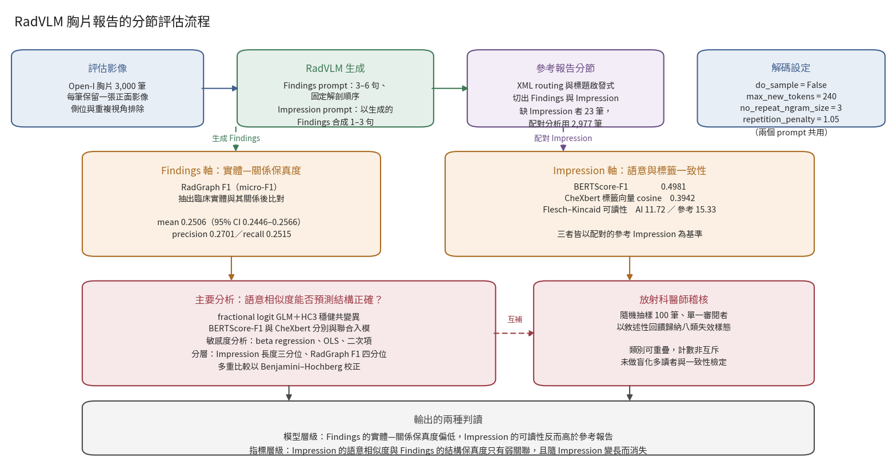

[Home](../) · [AI Papers](./)

# 報告讀起來很順，就代表寫對了嗎？RadVLM 的分節評估

## 來源

- 團隊：Saudi Electronic University, College of Health Sciences, Department of Health Informatics（沙烏地阿拉伯利雅德）；作者為 Saleh Alzughaibi（單一作者）。[(ref: main author block)](https://www.frontiersin.org/journals/digital-health/articles/10.3389/fdgth.2026.1882716/full)
- 論文：*Bridging semantics and clinical fidelity: a section-based assessment of a vision–language model (RadVLM) for chest x-ray report generation*，*Frontiers in Digital Health* 8: 1882716；2026-08-27 線上刊出；CC BY 4.0。[(ref: doi)](https://doi.org/10.3389/fdgth.2026.1882716)
- 識別碼：[DOI: 10.3389/fdgth.2026.1882716](https://doi.org/10.3389/fdgth.2026.1882716)；PMID 42723869；PMCID PMC13558191。
- 全文：[Frontiers 開放取用全文](https://www.frontiersin.org/journals/digital-health/articles/10.3389/fdgth.2026.1882716/full)；[PMC 全文](https://pmc.ncbi.nlm.nih.gov/articles/PMC13558191/)。
- 受測模型：[RadVLM 預印本（arXiv:2502.03333）](https://arxiv.org/abs/2502.03333)。

**編輯：** Clare

這份研究把一份 AI 胸片報告拆成 Findings 與 Impression 兩節分別計分，再問一個少被直接檢驗的問題：Impression 讀起來愈像放射科醫師寫的，Findings 就真的愈接近事實嗎？[(ref: main §1)](https://www.frontiersin.org/journals/digital-health/articles/10.3389/fdgth.2026.1882716/full#s1)

## 流程

圖：本書庫依論文 §2 的 section-aware evaluation framework 繪製的編輯示意圖，數值取自 §3 的主要結果，不含本文額外推論。左右兩軸分別測量結構保真度與語意相似度，下方的迴歸與人工稽核則檢驗這兩軸是否互相對應。[(ref: main §2)](https://www.frontiersin.org/journals/digital-health/articles/10.3389/fdgth.2026.1882716/full#s2) [(ref: main §3)](https://www.frontiersin.org/journals/digital-health/articles/10.3389/fdgth.2026.1882716/full#s3)

## 背景／問題

放射科報告是後續臨床決策的依據，而判讀量與認知負荷讓 discrepancy 率維持在 3–5% 的水準；報告生成模型的賣點正是減輕這一段文書負擔。問題出在怎麼確認它寫得對。作者指出，傳統的文字相似度指標「可以給流暢但引入細微事實錯誤、漏掉限定語、左右顛倒或誤述確定程度的輸出很高的分數」。[(ref: main §1)](https://www.frontiersin.org/journals/digital-health/articles/10.3389/fdgth.2026.1882716/full#s1)

更具體的缺口是：目前不清楚放射科微調過的 VLM 產出的報告，究竟是同時具備「像放射科醫師的文風」與「忠於這次檢查的結構」，還是只做到前者；也不清楚 Impression 層級較高的語意相似度，是否可靠地代表 Findings 層級較高的正確性。一份報告的兩節本來就承擔不同工作——Findings 記錄觀察到的實體與其關係，Impression 做綜合與優先排序——把整份報告當成一段文字計一個分數，會讓這兩件事混在一起。[(ref: main §1)](https://www.frontiersin.org/journals/digital-health/articles/10.3389/fdgth.2026.1882716/full#s1)

研究因此把預先指定的主要假設寫成可證偽的形式：Impression 層級的語意相似度（BERTScore-F1）與 Findings 層級的實體—關係保真度（RadGraph F1）呈正相關。這是一個關於「指標之間」的假設，不是關於模型好壞的假設。[(ref: main §1)](https://www.frontiersin.org/journals/digital-health/articles/10.3389/fdgth.2026.1882716/full#s1)

## 方法摘要

這是一項回溯性的分節評估研究。資料來自 NIH／NLM 的 Open-I 公開庫，內容是印第安納大學醫院系統去識別化的胸片與對應報告，涵蓋正常片與心臟肥大、胸腔積液、肺部陰影、肺塌陷等常見異常，作者描述為「廣泛而未經挑選的常規胸腔影像光譜」。共 3,000 筆檢查進入評估，每筆只保留一張正面影像，側位與重複視角排除；需要配對文字的 Impression 層級分析限縮為 2,977 筆，因為有 23 筆缺少參考 Impression。[(ref: main §2)](https://www.frontiersin.org/journals/digital-health/articles/10.3389/fdgth.2026.1882716/full#s2)

受測對象只有一個模型：RadVLM，一個帶放射科專用 instruction tuning 的對話式 vision-language model。作者選它的理由寫得很明確——instruction tuning 針對胸片，而且訓練來源已公開，因此可以推論資料外洩的可能性。研究沒有設對照模型，作者自己把這列為限制。[(ref: main §2)](https://www.frontiersin.org/journals/digital-health/articles/10.3389/fdgth.2026.1882716/full#s2) [(ref: main §4)](https://www.frontiersin.org/journals/digital-health/articles/10.3389/fdgth.2026.1882716/full#s4)

評估分兩軸進行。Findings 軸用 RadGraph F1 衡量實體與關係層級的保真度；Impression 軸用 BERTScore-F1 衡量語境語意相似度、用 CheXbert 的 14 個觀察標籤向量餘弦相似度衡量標籤一致性、用 Flesch–Kincaid Grade Level 衡量可讀性。兩軸算完之後，再用迴歸檢驗它們之間的關係。[(ref: main §2)](https://www.frontiersin.org/journals/digital-health/articles/10.3389/fdgth.2026.1882716/full#s2)

## 方法詳解

生成端用兩個受限的提示詞，而且是串接的。Findings prompt 要求模型依固定的解剖順序寫 3–6 句；Impression prompt 則以「模型自己剛生成的 Findings」為輸入，要求綜合成 1–3 句。這個串接設計有個直接後果：Impression 的錯誤可能源自影像判讀，也可能源自它所依據的那段生成 Findings，兩者在這個設計下無法分離。論文主文沒有列出提示詞全文，作者說明完整文字放在補充材料。[(ref: main §2)](https://www.frontiersin.org/journals/digital-health/articles/10.3389/fdgth.2026.1882716/full#s2)

解碼設定固定為 `do_sample = False`、`max_new_tokens = 240`、`no_repeat_ngram_size = 3`、`repetition_penalty = 1.05`、`SEED = 0`，也就是確定性解碼，不做多次抽樣。參考報告則以 XML routing 加標題啟發式切出 Findings 與 Impression 兩節，後處理移除模型輸出開頭的對話式開場白。[(ref: main §2)](https://www.frontiersin.org/journals/digital-health/articles/10.3389/fdgth.2026.1882716/full#s2)

主要統計模型把 RadGraph F1 當成落在 0 到 1 之間的比例型結果，用 logit 連結的 fractional logit generalized linear model 建模，共變異數採 heteroskedasticity-consistent HC3 估計；BERTScore-F1 與 CheXbert 餘弦相似度先標準化再入模。敏感度分析包含 beta regression、搭配 HC3 標準誤的 ordinary least squares、加入 BERTScore 二次項的模型，以及依 Impression 長度三分位與 RadGraph F1 四分位的分層分析。多重比較以 Benjamini–Hochberg false discovery rate 校正；Pearson、Spearman 與 Kendall 相關係數以 pairwise-complete 觀測值計算。[(ref: main §2)](https://www.frontiersin.org/journals/digital-health/articles/10.3389/fdgth.2026.1882716/full#s2)

自動指標之外另有一層人工檢視。作者從 3,000 筆中簡單隨機抽出 100 筆，由一位放射科醫師針對臨床合理性、左右一致性與語言品質給敘述性回饋，再把回饋歸納成八個失效類別。作者同時說明這是單一審閱者、沒有盲化的多讀者設計，也沒有做 inter-rater agreement。[(ref: main §2)](https://www.frontiersin.org/journals/digital-health/articles/10.3389/fdgth.2026.1882716/full#s2) [(ref: main §4)](https://www.frontiersin.org/journals/digital-health/articles/10.3389/fdgth.2026.1882716/full#s4)

## 資料與實驗

論文主文沒有列出世代特徵表，下表是本書庫依 §2 的敘述整理的評估設計與分母。三種 Impression 層級指標的分母不同，是因為 CheXbert 餘弦相似度在全部 3,000 筆上計算，而需要配對參考文字的分析限縮到 2,977 筆。[(ref: main §2)](https://www.frontiersin.org/journals/digital-health/articles/10.3389/fdgth.2026.1882716/full#s2) [(ref: main §3)](https://www.frontiersin.org/journals/digital-health/articles/10.3389/fdgth.2026.1882716/full#s3)

| 項目 | 內容 | 分母 |
|---|---|---:|
| 資料來源 | Open-I（NIH／NLM），印第安納大學醫院系統去識別化胸片與報告 | — |
| 納入 | 每筆檢查一張正面影像 | 3,000 |
| 排除 | 側位與重複視角；缺參考 Impression 者僅排除於配對分析 | 23 |
| Findings 軸（RadGraph F1） | 生成 Findings 對參考 Findings | 3,000 |
| Impression 軸（CheXbert 餘弦） | 生成 Impression 對參考 Impression 的 14 標籤向量 | 3,000 |
| Impression 軸（BERTScore-F1） | 需配對參考 Impression | 2,977 |
| 可讀性（Flesch–Kincaid） | 生成與參考 Impression 的配對比較 | 2,977 |
| 放射科醫師稽核 | 簡單隨機抽樣、單一審閱者 | 100 |

下表整理 §3 的主要指標點估計與 95% 信賴區間。Flesch–Kincaid 是年級數，數值愈高代表閱讀難度愈高；其餘三項介於 0 與 1 之間，愈高代表與參考報告愈一致。[(ref: main §3)](https://www.frontiersin.org/journals/digital-health/articles/10.3389/fdgth.2026.1882716/full#s3)

| 指標 | 對象 | 平均 | 95% CI | n |
|---|---|---:|---|---:|
| RadGraph F1（micro-F1） | 生成 Findings | 0.2506 | 0.2446–0.2566 | 3,000 |
| RadGraph precision | 生成 Findings | 0.2701 | 0.2637–0.2764 | 3,000 |
| RadGraph recall | 生成 Findings | 0.2515 | 0.2449–0.2581 | 3,000 |
| BERTScore-F1 | 生成 Impression | 0.4981 | 0.4949–0.5012 | 2,977 |
| CheXbert 餘弦相似度 | 生成 Impression | 0.3942 | 0.3889–0.3994 | 3,000 |
| Flesch–Kincaid Grade Level | 生成 Impression | 11.72 | 11.51–11.94 | 3,000 |
| Flesch–Kincaid Grade Level | 參考 Impression | 15.33 | 15.02–15.64 | 3,000 |
| Flesch–Kincaid 配對差（生成 − 參考） | — | −3.75 | −4.12 至 −3.38 | 2,977 |

下表完整重製論文 Table 1。係數為 logit 尺度，預測變項已標準化；marginal effect 是換算回 RadGraph F1 原尺度的平均邊際效果。[(ref: main Table 1)](https://www.frontiersin.org/journals/digital-health/articles/10.3389/fdgth.2026.1882716/full#s3)

| 模型 | n | 預測變項 | 係數 | 95% CI | p | 平均邊際效果 |
|---|---:|---|---:|---|---|---:|
| 單變項 | 2,977 | BERTScore-F1 | 0.1535 | 0.1237–0.1834 | <0.001 | +0.0329 |
| 單變項 | 3,000 | CheXbert 餘弦相似度 | 0.1143 | 0.0815–0.1472 | <0.001 | +0.0146 |
| 聯合模型 | 2,977 | BERTScore-F1 | 0.1663 | 0.1248–0.2078 | <0.001 | +0.0357 |
| 聯合模型 | 2,977 | CheXbert 餘弦相似度 | −0.0191 | −0.0626–0.0244 | 不顯著 | −0.0025 |

下表完整重製論文 Table 2 的 Impression 長度三分位分層。長度以 Impression 的字數計算，預測變項為 BERTScore-F1。[(ref: main Table 2)](https://www.frontiersin.org/journals/digital-health/articles/10.3389/fdgth.2026.1882716/full#s3)

| 三分位 | 字數中位數 | n | 係數 | 95% CI | p |
|---|---:|---:|---:|---|---:|
| T1（最短） | 56 | 1,001 | 0.160113 | 0.072207–0.248018 | 0.000357 |
| T2（中段） | 73 | 991 | 0.115649 | 0.051041–0.180258 | 0.000451 |
| T3（最長） | 101 | 985 | 0.009516 | −0.049564–0.068596 | 0.752 |

下表完整重製論文 Table 3 的 RadGraph F1 四分位分層，預測變項同為 BERTScore-F1。[(ref: main Table 3)](https://www.frontiersin.org/journals/digital-health/articles/10.3389/fdgth.2026.1882716/full#s3)

| 四分位 | n | 係數 | 95% CI | p |
|---|---:|---:|---|---:|
| Q1（低） | 757 | 0.082823 | −0.031426–0.197071 | 0.155 |
| Q2 | 732 | −0.002791 | −0.024152–0.018571 | 0.798 |
| Q3 | 748 | −0.022436 | −0.038665 至 −0.006207 | 0.0067 |
| Q4（高） | 740 | 0.044382 | 0.011034–0.077730 | 0.0091 |

下表整理論文 Table 4 對應的稽核計數。作者寫明「一份報告可能同時呈現多於一個問題，因此計數並非互斥」，且文中以「大約」描述各類次數。[(ref: main §3)](https://www.frontiersin.org/journals/digital-health/articles/10.3389/fdgth.2026.1882716/full#s3)

| 失效樣態 | 約略次數（n = 100） |
|---|---:|
| 通用或樣板化措辭 | 41 |
| 漏掉細微或邊界性異常 | 23 |
| 實體—關係遺漏 | 19 |
| 過度宣告或不必要的警示 | 12 |
| 語言品質問題（拼字錯誤、句子截斷） | 11 |
| Impression 的優先排序失當 | 9 |
| 左右側不一致 | 6 |
| 確定性或否定語意反轉 | 5 |

## 結果

Findings 層級的保真度偏低，而且分布本身就說明了問題。RadGraph F1 平均 0.2506（95% CI 0.2446–0.2566），precision 0.2701、recall 0.2515，三者水準接近，代表不是單純的「寫太少」或「寫太多」。作者描述每筆分數的分布為「多數案例集中在接近 0 的低 F1 區，隨 F1 升高頻率逐步下降」——也就是說，平均值背後是一大群幾乎對不上參考實體的報告，而不是一群普遍中等的報告。[(ref: main §3)](https://www.frontiersin.org/journals/digital-health/articles/10.3389/fdgth.2026.1882716/full#s3)

Impression 層級的表現看起來好一些：BERTScore-F1 平均 0.4981，CheXbert 餘弦相似度 0.3942。可讀性則出現方向相反的結果——AI 產出的 Impression 平均 Flesch–Kincaid 年級數 11.72，參考 Impression 是 15.33，配對差為 −3.75 個年級（95% CI −4.12 至 −3.38）。AI 的文字比放射科醫師寫的更好讀，但這個「好讀」與它是否寫對是兩件事。[(ref: main §3)](https://www.frontiersin.org/journals/digital-health/articles/10.3389/fdgth.2026.1882716/full#s3)

指標彼此之間的關係，是這篇的核心。兩個 Impression 層級指標之間相關得很緊：BERTScore-F1 與 CheXbert 餘弦相似度的 Pearson r 是 0.670（95% CI 0.651–0.690）。但跨節的相關就弱得多：RadGraph F1 與 BERTScore-F1 只有 r = 0.178（0.143–0.212），與 CheXbert 餘弦相似度只有 r = 0.128（0.093–0.163）。改用秩相關後更低，Spearman ρ = 0.114、Kendall τ = 0.076；調整後的偏相關 r = 0.087，用長度正規化的 BERTScore-F1 則是 r = 0.127。[(ref: main §3)](https://www.frontiersin.org/journals/digital-health/articles/10.3389/fdgth.2026.1882716/full#s3)

迴歸的結論與相關係數一致：方向為正、統計上顯著，但幅度很小。單變項模型中 BERTScore-F1 的係數是 0.1535（95% CI 0.1237–0.1834，p < 0.001），換算回原尺度的平均邊際效果只有 +0.0329；CheXbert 餘弦相似度單獨入模時係數 0.1143（p < 0.001），邊際效果 +0.0146。兩者同時入模時，BERTScore-F1 的係數升到 0.1663 而仍然顯著，CheXbert 的係數則變成 −0.0191（95% CI −0.0626–0.0244）且不顯著——也就是說，CheXbert 的預測力可以被 BERTScore-F1 吸收掉。[(ref: main Table 1)](https://www.frontiersin.org/journals/digital-health/articles/10.3389/fdgth.2026.1882716/full#s3)

分層之後，這個「正向但微弱」的關聯還會消失。依 Impression 長度分三層，最短的一層係數 0.160（95% CI 0.072–0.248，p = 0.000357），中間層 0.116（0.051–0.180，p = 0.000451），最長的一層掉到 0.010（−0.050–0.069，p = 0.752）。Impression 愈長，語意相似度就愈無法指示 Findings 的結構正確性。[(ref: main Table 2)](https://www.frontiersin.org/journals/digital-health/articles/10.3389/fdgth.2026.1882716/full#s3)

依 RadGraph F1 分四層則連方向都不穩定：Q1 為 +0.083（不顯著），Q2 近乎 0，Q3 是 −0.022（95% CI −0.039 至 −0.006，p = 0.0067），Q4 是 +0.044（0.011–0.078，p = 0.0091）。在中高保真度的那一層，語意相似度與結構保真度的關係甚至是負的。[(ref: main Table 3)](https://www.frontiersin.org/journals/digital-health/articles/10.3389/fdgth.2026.1882716/full#s3)

以影響診斷排除極端值後的敏感度分析維持同一個圖像：BERTScore-F1 的係數是 0.1447（95% CI 0.1017–0.1877，HC3）且仍顯著，CheXbert 的係數「維持小而不顯著」。本書庫在核對時注意到，論文這一句列出的 CheXbert 係數 0.0109 落在它同時列出的區間 −0.0562 至 0.0344 之內但不居中，原文未進一步說明，此處照原文轉述。[(ref: main §3)](https://www.frontiersin.org/journals/digital-health/articles/10.3389/fdgth.2026.1882716/full#s3)

人工稽核補上了自動指標看不到的部分。100 筆抽樣中最常見的是通用或樣板化措辭（約 41 筆），其次是漏掉細微或邊界性異常（約 23 筆）與實體—關係遺漏（約 19 筆）。次數較少但臨床後果較重的兩類是左右側不一致（約 6 筆）與確定性／否定語意反轉（約 5 筆）——這兩類正好是流暢度指標最不容易察覺的錯誤，因為把「右側」寫成「左側」或把「沒有氣胸」寫成「有氣胸」，幾乎不影響句子的語意相似度分數。[(ref: main §3)](https://www.frontiersin.org/journals/digital-health/articles/10.3389/fdgth.2026.1882716/full#s3)

作者的總結是，語意相似度「不應被當成結構正確性的代理指標」，而現階段的系統比較適合定位為需要放射科醫師確認的草稿生成輔助。[(ref: main §5)](https://www.frontiersin.org/journals/digital-health/articles/10.3389/fdgth.2026.1882716/full#s5)

## 限制

- 只評估一個放射科微調模型（RadVLM）與一個公開語料（Open-I），分節又依賴 XML 標籤與標題啟發式；作者明說絕對保真度水準與「語意相似度—保真度」關聯強度都可能隨架構、機構與報告風格而異，未經多模型、多資料集複製前不得外推到報告生成模型這一類。[(ref: main §4)](https://www.frontiersin.org/journals/digital-health/articles/10.3389/fdgth.2026.1882716/full#s4)
- 回溯性、以關聯為基礎的設計不支持因果推論。[(ref: main §4)](https://www.frontiersin.org/journals/digital-health/articles/10.3389/fdgth.2026.1882716/full#s4)
- 所有胸片混在一起分析，錯誤沒有依臨床重要性或偵測難度加權；自動指標與質性分類都無法區分會改變處置的錯誤與無關緊要的差異。[(ref: main §4)](https://www.frontiersin.org/journals/digital-health/articles/10.3389/fdgth.2026.1882716/full#s4)
- 放射科醫師稽核只有單一審閱者，沒有盲化多讀者、沒有 inter-rater agreement，也沒有臨床可用性或病人處置影響的測試；作者因此說本研究評估的比較是自動指標的行為，而不是經裁定的臨床正確性。[(ref: main §4)](https://www.frontiersin.org/journals/digital-health/articles/10.3389/fdgth.2026.1882716/full#s4)
- 沒有做擾動式的穩健性測試，也沒有外部語料驗證與前瞻工作流程評估；作者把後兩者列為臨床整合前的必要條件。[(ref: main §4)](https://www.frontiersin.org/journals/digital-health/articles/10.3389/fdgth.2026.1882716/full#s4)
- 論文主文未列出兩個提示詞的全文，指向補充材料；主文也未說明 Impression 長度三分位的字數中位數是取自參考 Impression 還是生成 Impression。以上兩點是本書庫在核對主文時記錄的可重現性缺口，不是作者列出的限制。[(ref: main §2)](https://www.frontiersin.org/journals/digital-health/articles/10.3389/fdgth.2026.1882716/full#s2) [(ref: main Table 2)](https://www.frontiersin.org/journals/digital-health/articles/10.3389/fdgth.2026.1882716/full#s3)
- 論文引用的 RadVLM 是 2025 年 2 月的預印本版本，而該預印本在 arXiv 上另有 2025 年 10 月的後續版本；本文未記載所用檢查點的不可變 revision。這是本書庫比對來源時的觀察。[(ref: main §2)](https://www.frontiersin.org/journals/digital-health/articles/10.3389/fdgth.2026.1882716/full#s2) [(ref: radvlm)](https://arxiv.org/abs/2502.03333)

## 與書庫其他文章的關係

MAIRA-2 提出有定位的報告生成與 RadFact 這類事實層級評分，本篇則反過來量測「語意相似度能不能替代結構保真度」，兩篇合起來說明報告生成的評估為何不能只留一個總分: [MAIRA-2：胸腔 X 光報告的文字正確，定位也正確嗎？](2026-09-15-maira-2-grounded-reporting.md)

CORAL 用概念瓶頸與空間先驗讓報告的每一句都能回推依據，本篇則顯示在沒有這類結構約束時，流暢的 Impression 與正確的 Findings 可以相當程度地脫鉤: [CORAL：先找病灶、再說臨床概念，能讓醫療影像報告更可檢視嗎？](2026-09-17-coral-concept-grounded-report-generation.md)

醫療 LLM 的評估落差研究指出臨床級證據供給偏低，本篇提供一個指標層級的具體案例——自動指標之間的高相關，不代表它們指向同一個臨床事實: [醫療 LLM 評估落差：研究更嚴謹，為何證據反而更舊？](2026-09-17-medical-llm-evaluation-gap.md)

本篇把單次報告拆成 Findings 與 Impression 兩軸評分，該研究則把比較對象換成同一病人的前後兩份報告，兩篇都在追問一個彙總分數蓋掉了哪一段: [序列胸片報告的時序判讀：七個 LLM、五種提示詞，分得出「新出現」嗎？](2026-09-22-llm-temporal-change-cxr-reports.md)

## 實務的啟發

第一，報告生成的驗收要分節分軸，不要只看一個總分。Findings 與 Impression 承擔的工作不同，這份研究顯示兩者的分數在同一批報告上可以往不同方向走：Impression 的可讀性甚至優於放射科醫師的原文，Findings 的實體—關係保真度卻只有 0.25 上下。院內試評時若只報一個彙總的文字相似度，就等於把這個落差平均掉了。

第二，把「哪一種錯誤」放進驗收條件，而不是只看錯誤率。稽核裡最常見的是樣板化措辭，但真正會改變處置的是左右側不一致與否定語意反轉——它們次數少（各約 5% 到 6%），卻剛好是語意相似度指標最不敏感的類型。本書庫建議在院內評估時，把左右側、否定與不確定性描述獨立抽樣檢查，並與整體分數分開報告。

第三，長報告要特別當心。語意相似度與結構保真度的關聯在最短的 Impression 分層仍然成立，到最長的分層就消失了。實務上這代表：愈是內容豐富、寫得愈長的輸出，愈不能靠「讀起來像」來判斷它對不對，也愈需要逐項核對。

最後，這份研究的定位本身就是一個提醒。它只測了一個模型、一個公開語料、一位審閱者，作者自己反覆說明不得外推到報告生成模型這一類。把它當成「RadVLM 不好用」的結論會超出證據；比較穩妥的讀法是，它示範了一種可以在自家資料上重跑的評估設計——分節、雙軸、再檢驗兩軸是否對應。

## References

- `main`：[Bridging semantics and clinical fidelity 全文（Frontiers）](https://www.frontiersin.org/journals/digital-health/articles/10.3389/fdgth.2026.1882716/full)；本文使用 [§1 Introduction](https://www.frontiersin.org/journals/digital-health/articles/10.3389/fdgth.2026.1882716/full#s1)、[§2 Methods](https://www.frontiersin.org/journals/digital-health/articles/10.3389/fdgth.2026.1882716/full#s2)、[§3 Results（含 Table 1、Table 2、Table 3 與 Table 4）](https://www.frontiersin.org/journals/digital-health/articles/10.3389/fdgth.2026.1882716/full#s3)、[§4 Discussion](https://www.frontiersin.org/journals/digital-health/articles/10.3389/fdgth.2026.1882716/full#s4) 與 [§5 Conclusion](https://www.frontiersin.org/journals/digital-health/articles/10.3389/fdgth.2026.1882716/full#s5)。
- `doi`：[10.3389/fdgth.2026.1882716](https://doi.org/10.3389/fdgth.2026.1882716)。
- `pmc`：[PMC13558191 全文鏡像](https://pmc.ncbi.nlm.nih.gov/articles/PMC13558191/)。
- `radvlm`：[RadVLM: A Multitask Conversational Vision-Language Model for Radiology（arXiv:2502.03333）](https://arxiv.org/abs/2502.03333)。

[Home](../) · [AI Papers](./)
