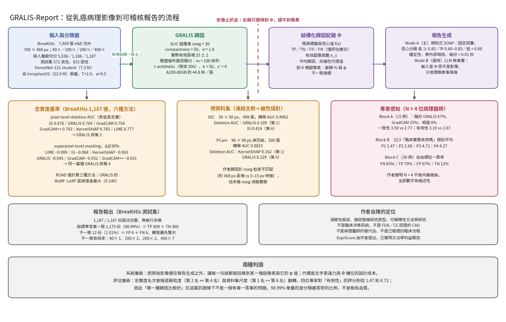

[Home](../) · [AI Papers](./)

# 不讓報告看見影像：乳癌病理的區域級歸因能撐起一份可稽核的報告嗎？

## 來源

- 團隊：Universitas Mercatorum（義大利羅馬）；作者為 Raimondo Fanale（單一作者，亦為通訊作者）。[(ref: main author block)](https://www.frontiersin.org/journals/imaging/articles/10.3389/fimag.2026.1885292/full)
- 論文：*GRALIS-Report: auditable region-level attribution and structured clinical report generation for breast cancer histology*，*Frontiers in Imaging* 5: 1885292；2026-05-19 投稿、2026-07-13 修訂、2026-08-13 接受、2026-09-09 刊出；CC BY。[(ref: main front matter)](https://www.frontiersin.org/journals/imaging/articles/10.3389/fimag.2026.1885292/full)
- 識別碼：[DOI: 10.3389/fimag.2026.1885292](https://doi.org/10.3389/fimag.2026.1885292)。
- 全文：[Frontiers 開放取用全文](https://www.frontiersin.org/journals/imaging/articles/10.3389/fimag.2026.1885292/full)；[PDF 版](https://www.frontiersin.org/journals/imaging/articles/10.3389/fimag.2026.1885292/pdf)。
- 理論部分：作者說明 canonical form、a priori convergence bound 與「locality 與 exact completeness 結構上不相容」三項性質的證明放在另一份 companion preprint（arXiv:2605.05480），本篇「完全是實驗性的」。[(ref: main §1)](https://www.frontiersin.org/journals/imaging/articles/10.3389/fimag.2026.1885292/full#s1)

**編輯：** Clare

這篇論文把一個常被含混處理的問題拆開來問：如果要讓病理 AI 的文字報告可以被逐句回推到證據，那麼「影像」應該在哪一步被擋下來？[(ref: main §1)](https://www.frontiersin.org/journals/imaging/articles/10.3389/fimag.2026.1885292/full#s1)

## 流程

圖：本書庫依論文 §3 的系統描述繪製的編輯示意圖，數值取自 §4 的實驗結果，不含本文額外推論。圖中「影像止於此」的虛線標出這個設計的核心主張：報告生成階段只讀得到結構化歸因紀錄，讀不到像素。[(ref: main §3)](https://www.frontiersin.org/journals/imaging/articles/10.3389/fimag.2026.1885292/full#s3) [(ref: main §4)](https://www.frontiersin.org/journals/imaging/articles/10.3389/fimag.2026.1885292/full#s4)

## 背景／問題

病理影像分類器的準確率早已能報到接近飽和的數字，但作者指出實際的缺口不在準確率：「當模型把一張影像標成惡性時，它並沒有指出它用了哪些組織結構來得到這個結論。」對需要簽名負責的病理醫師而言，一個分數加一張熱力圖並不構成可以覆核的依據。[(ref: main §1)](https://www.frontiersin.org/journals/imaging/articles/10.3389/fimag.2026.1885292/full#s1)

更具體的問題出在「從影像到文字」的那一步。多數多模態報告系統會把影像特徵與文字在某個潛在空間裡融合，融合之後就很難說清楚報告裡的某一句究竟由哪一塊組織支撐。作者因此把系統設計成兩個硬性的架構性質：原始影像永遠不進入報告生成階段，而且不在潛在空間做跨模態融合——進入文字端的只有歸因訊號，不是像素，每一次模態轉換都是明示的、符號化的，而且可以回溯到儲存下來的結構化歸因紀錄。[(ref: main abstract)](https://www.frontiersin.org/journals/imaging/articles/10.3389/fimag.2026.1885292/full)

論文 §1.4 列出四項貢獻：GRALIS-Report 這條可稽核的跨模態歸因管線、GRALIS 這個帶 a priori 收斂控制的聯盟條件歸因法、在 BreaKHis 完整測試集（1,187 張）上的忠實度基準，以及一項專家感知不一致研究。[(ref: main §1)](https://www.frontiersin.org/journals/imaging/articles/10.3389/fimag.2026.1885292/full#s1)

論文同時用一張表把研究定位講死：這是探索性框架、歸因管線的研究原型、可解釋性方法學研究與多模態報告原型；不是臨床決策系統、不是 FDA 或 CE 認證的 CAD、不是病理醫師的替代品、也不是已驗證的臨床流程。[(ref: main Table 2)](https://www.frontiersin.org/journals/imaging/articles/10.3389/fimag.2026.1885292/full#s3)

## 方法摘要

系統分三段。第一段訓練分類器：以 InceptionV3 為 teacher、DenseNet-121 為 student，在 BreaKHis 上做知識蒸餾，切分在病人層級進行。第二段是 GRALIS，把影像轉成一個語意層級的歸因訊號——每一塊超像素一個重要度分數 φᵢ，由聯盟條件的路徑積分算出。第三段把這個結構化訊號轉成 SOAP 格式的研究用報告。[(ref: main abstract)](https://www.frontiersin.org/journals/imaging/articles/10.3389/fimag.2026.1885292/full)

評估分三軸。忠實度軸在 BreaKHis 完整測試集上把 GRALIS 與五種常見歸因法放在同一個分類器上比較；可移轉性軸把主幹凍結後移到兩個外部資料集（IDC 與 PatchCamelyon）重跑同一組指標；人因軸則請四位病理醫師做偏好與品質評分。[(ref: main §3)](https://www.frontiersin.org/journals/imaging/articles/10.3389/fimag.2026.1885292/full#s3) [(ref: main §4)](https://www.frontiersin.org/journals/imaging/articles/10.3389/fimag.2026.1885292/full#s4)

## 方法詳解

**分類器與蒸餾。** Teacher 是 InceptionV3（22,925,857 個參數），student 是 DenseNet-121（7,304,257 個參數）；損失把 student 的交叉熵與對 teacher 的 KL 散度相加，溫度 T = 2.0、蒸餾權重 α = 0.5。最佳化用 Adam（η = 10⁻⁴、β₁ = 0.9、β₂ = 0.999），batch size 32，以驗證 AUC 為準、patience = 10 的早停；輸入縮放到 224 × 224，以 ImageNet 的平均值與標準差正規化，測試集不做增強。[(ref: main §3)](https://www.frontiersin.org/journals/imaging/articles/10.3389/fimag.2026.1885292/full#s3)

**GRALIS 歸因。** 先用 SLIC 把影像切成超像素（nseg = 30、compactness = 50、σ = 1.0），實際得到的有效區塊數是 25 ± 2。接著對每一個排列 τ 與位置 j，把聯盟 Sⱼ = {τ(1), …, τ(j−1)} 設為基線，沿 α 內插的路徑做積分梯度，再把該段的純量歸因平均分配給 τ(j) 這塊超像素裡的所有像素。蒙地卡羅取樣用 m = 100 個排列並搭配 antithetic variates（等效 200 個樣本，作者報告標準差因此下降 29%），積分用中點法 k = 50 步（誤差 O(1/k²)），locality kernel 寬度 σ_LIME = 0.75，基線 x′ = 0。在 A100-80GB 上每張影像約 44.8 秒。[(ref: main §3)](https://www.frontiersin.org/journals/imaging/articles/10.3389/fimag.2026.1885292/full#s3) [(ref: main Table 7)](https://www.frontiersin.org/journals/imaging/articles/10.3389/fimag.2026.1885292/full#s4)

**結構化歸因紀錄 Φ。** 這是唯一進入報告端的東西，內容包括：預測標籤與信心值 f(x)、分類結果（TP／TN／FP／FN，僅在評估模式下可得）、有效超像素數 nₛ、平均歸因與完備性代理值、前 K 塊超像素及其面積百分比與 φ 值，以及不一致旗標。[(ref: main §3)](https://www.frontiersin.org/journals/imaging/articles/10.3389/fimag.2026.1885292/full#s3)

**報告生成。** Mode A 是主要模式：一個規則式模組用固定的確定性詞彙把 Φ 翻成 SOAP 結構，信心分級的門檻是高（f ≥ 0.85）、中（0.60 ≤ f < 0.85）、低（f < 0.60），歸因品質則由平均歸因與完備性代理值導出；整段確定性、可重現、無外部相依。Mode B 是可選的 LLM 敘事層，把 Φ——而不是原始影像——交給語言模型，並以 Mode A 的文字為骨架，限制只能豐富敘事風格。[(ref: main §3)](https://www.frontiersin.org/journals/imaging/articles/10.3389/fimag.2026.1885292/full#s3)

**對照的五種歸因法。** 全部套在同一個 DenseNet-121 上：GradCAM（取最後一層卷積的梯度，雙線性上採樣到 224 × 224）、GradCAM++（平方梯度加逐通道正規化因子）、KernelSHAP（500 個樣本、SLIC n = 30、Shapley kernel）、LIME（1,000 次擾動、SLIC n = 30、局部線性迴歸器）、Integrated Gradients（50 步、基線 x′ = 0）。[(ref: main §3)](https://www.frontiersin.org/journals/imaging/articles/10.3389/fimag.2026.1885292/full#s3)

**指標定義。** Deletion AUC 依歸因由高到低逐步移除像素（比例 0、0.05、…、1.0，以零基線取代），用梯形法算曲線下面積，愈低愈好。ROAD 以 13 個遮蔽步驟分別做 MoRF（先移除最相關）與 LeRF（先移除最不相關）。SAL 是前 20% 歸因遮罩的集中度，CPT 是 1 − Hₙₒᵣₘ 的緊緻度，完備性殘差 Δφ = |Σᵢφᵢ − (f(x) − f(0))| 衡量與 Shapley efficiency 公理的偏離。ExpiScore 在本文用的是簡化版 (SAL + CPT + CSC)/3，與原始論文的完整式不同、數值不可直接比較。[(ref: main §3)](https://www.frontiersin.org/journals/imaging/articles/10.3389/fimag.2026.1885292/full#s3)

**專家研究設計。** 四位病理醫師（P1–P4），分三個 block：Block A 在 15 例上做 GRALIS 與 GradCAM 的盲化偏好與李克特評分（Q1 偏好、Q4 一致性、Q5 有用性），該 15 例由 TP 5、TN 4、FP 3、FN 3 組成；Block B 在同一批 15 例上評 GRALIS-Report 本身，分成歸因圖題組（Q6–Q8）與 SOAP 報告題組（Q9–Q13）；Block C 則在 30 例上請受試者自由圈選區域，用來看標註風格的一致性。作者聲明 N = 4 不足以做共識推論，所有數字都是描述性的。[(ref: main §3)](https://www.frontiersin.org/journals/imaging/articles/10.3389/fimag.2026.1885292/full#s3) [(ref: main §4)](https://www.frontiersin.org/journals/imaging/articles/10.3389/fimag.2026.1885292/full#s4)

## 資料與實驗

下表是本書庫依 §3.1 整理的資料設計。三個資料集的角色不同：BreaKHis 是主資料集，另外兩個只用來測跨資料集的可移轉性，做法是凍結 BreaKHis 訓練出來的主幹、只在目標資料集上訓練一個兩層分類頭。[(ref: main §3)](https://www.frontiersin.org/journals/imaging/articles/10.3389/fimag.2026.1885292/full#s3)

| 資料集 | 內容 | 訓練 | 測試 | 測試組成 |
|---|---|---:|---:|---|
| BreaKHis（主） | H&E 乳房組織，700 × 460 px，40×／100×／200×／400× 四種倍率，8 個亞型（4 良性、4 惡性），共 7,909 張 | 5,536（驗證 1,186） | 1,187 | 良性 372、惡性 815 |
| IDC Breast Cancer | 50 × 50 px 影像塊，凍結主幹＋線性探針 | 800 | 499 | 良性 249、惡性 250 |
| PatchCamelyon（PCam） | 96 × 96 px 淋巴結影像塊，凍結主幹＋線性探針 | 800 | 500 | 良性 250、惡性 250 |

切分在病人層級進行——同一位病人的所有影像只會出現在同一個分區——並依組織亞型與倍率聯合分層。BreaKHis 四種倍率在測試集的張數分別是 40× 285、100× 327、200× 319、400× 256。[(ref: main §3)](https://www.frontiersin.org/journals/imaging/articles/10.3389/fimag.2026.1885292/full#s3) [(ref: main Table 19)](https://www.frontiersin.org/journals/imaging/articles/10.3389/fimag.2026.1885292/full#s4)

下表重製論文 Table 3 的分類器表現。表格說明本身註明這些是「內部基準表現，不應被詮釋為泛化能力或部署就緒的證據」。[(ref: main Table 3)](https://www.frontiersin.org/journals/imaging/articles/10.3389/fimag.2026.1885292/full#s4)

| 模型 | 準確率 | AUC | 敏感度 | 特異度 |
|---|---:|---:|---:|---:|
| InceptionV3（teacher） | 97.1% | 0.9962 | 96.9% | 97.6% |
| DenseNet-121（student） | 99.2% | 0.9989 | 99.4% | 98.7% |

下表重製論文 Table 5 的 pixel-level deletion AUC，六種方法都在同一個 student 上計算，數值愈低代表愈忠實。最右欄是各方法與 GRALIS 的統計檢定結果。[(ref: main Table 5)](https://www.frontiersin.org/journals/imaging/articles/10.3389/fimag.2026.1885292/full#s4)

| 方法 | Deletion AUC（平均 ± 標準差） | 名次 | 對 GRALIS |
|---|---:|---:|---|
| Integrated Gradients | 0.678 ± 0.222 | 1 | p = 2.7 × 10⁻¹³ |
| GRALIS | 0.704 ± 0.331 | 2 | 參考 |
| GradCAM | 0.754 ± 0.313 | 3 | p < 10⁻⁹⁴ |
| GradCAM++ | 0.763 ± 0.296 | 4 | p < 10⁻¹¹⁸ |
| KernelSHAP | 0.765 ± 0.248 | 5 | p < 10⁻³³ |
| LIME | 0.777 ± 0.235 | 6 | p < 10⁻³⁹ |

下表重製論文 Table 10 的 superpixel-level masking，也就是論文自己稱為 granularity-fair 的那一組比較——所有方法都先聚合到超像素再遮蔽，數值愈負代表移除高歸因區塊後信心掉得愈多、愈忠實。[(ref: main Table 10)](https://www.frontiersin.org/journals/imaging/articles/10.3389/fimag.2026.1885292/full#s4)

| 方法 | Δ@10% | Δ@20% | Δ@30% | 名次 | 對 GRALIS |
|---|---:|---:|---:|---:|---|
| LIME | −0.013 ± 0.075 | −0.043 ± 0.141 | −0.089 ± 0.203 | 1 | p < 10⁻⁴² |
| Integrated Gradients | −0.019 ± 0.092 | −0.040 ± 0.132 | −0.064 ± 0.167 | 2 | p < 10⁻⁹ |
| KernelSHAP | −0.013 ± 0.079 | −0.036 ± 0.124 | −0.063 ± 0.165 | 3 | p < 10⁻¹² |
| GRALIS | −0.011 ± 0.074 | −0.026 ± 0.117 | −0.045 ± 0.147 | 4 | 參考 |
| GradCAM | −0.009 ± 0.061 | −0.020 ± 0.095 | −0.032 ± 0.115 | 5 | p = 0.0034 |
| GradCAM++ | −0.009 ± 0.066 | −0.018 ± 0.096 | −0.031 ± 0.115 | 6 | p = 0.0016 |

下表取自論文 Table 4 的主要欄位（原表另有 faithfulness 與對 Integrated Gradients 的相對差欄位，此處從略）。作者在 §2.5 與 §3.5 都聲明 ExpiScore 由自己提出、構成方法學上的利益衝突，因此這組數字被降為補充性質，主要主張以獨立的 deletion AUC 為準。[(ref: main Table 4)](https://www.frontiersin.org/journals/imaging/articles/10.3389/fimag.2026.1885292/full#s4)

| 方法 | SAL | CPT | CSC | ExpiScore | Deletion AUC |
|---|---:|---:|---:|---:|---:|
| LIME | 0.991 ± 0.089 | 0.068 ± 0.035 | 0.347 ± 0.086 | 0.469 ± 0.035 | 0.777 ± 0.235 |
| KernelSHAP | 0.781 ± 0.154 | 0.080 ± 0.035 | 0.289 ± 0.089 | 0.383 ± 0.055 | 0.765 ± 0.248 |
| GRALIS | 0.762 ± 0.109 | 0.018 ± 0.007 | 0.274 ± 0.071 | 0.351 ± 0.040 | 0.704 ± 0.331 |
| GradCAM | 0.690 ± 0.239 | 0.012 ± 0.008 | 0.347 ± 0.111 | 0.350 ± 0.061 | 0.754 ± 0.313 |
| GradCAM++ | 0.523 ± 0.302 | 0.030 ± 0.032 | 0.353 ± 0.103 | 0.302 ± 0.096 | 0.763 ± 0.296 |
| Integrated Gradients | 0.150 ± 0.035 | 0.035 ± 0.006 | 0.266 ± 0.046 | 0.150 ± 0.017 | 0.678 ± 0.222 |

下表合併論文 Table 11 與 Table 12 的跨資料集結果，兩個指標都是愈低愈好。同一個方法在兩個外部資料集上的名次完全相反，是這篇最值得看的一組數字。凍結主幹後的轉移分類器 AUC 為 IDC 0.8962、PCam 0.8815。[(ref: main Table 11)](https://www.frontiersin.org/journals/imaging/articles/10.3389/fimag.2026.1885292/full#s4) [(ref: main Table 12)](https://www.frontiersin.org/journals/imaging/articles/10.3389/fimag.2026.1885292/full#s4)

| 方法 | IDC Deletion AUC | IDC ROAD MoRF | PCam Deletion AUC | PCam ROAD MoRF |
|---|---:|---:|---:|---:|
| GRALIS | **0.1891 ± 0.1624** | **0.1978 ± 0.1370** | 0.2286 ± 0.1674 | 0.1829 ± 0.1415 |
| GradCAM | 0.2287 ± 0.1893 | 0.2283 ± 0.1542 | 0.1745 ± 0.1613 | 0.1393 ± 0.1320 |
| GradCAM++ | 0.2287 ± 0.1920 | 0.2369 ± 0.1555 | 0.1805 ± 0.1660 | 0.1441 ± 0.1358 |
| KernelSHAP | 0.2288 ± 0.1567 | 0.2411 ± 0.1278 | **0.1621 ± 0.1385** | 0.1142 ± 0.1065 |
| LIME | 0.2526 ± 0.1533 | 0.2586 ± 0.1317 | 0.2185 ± 0.1419 | 0.1372 ± 0.1060 |
| Integrated Gradients | 0.4240 ± 0.1733 | 0.2140 ± 0.0699 | 0.1688 ± 0.1281 | **0.0731 ± 0.0565** |

下表重製論文 Table 13 與 Table 14 的報告生成結果與不一致案例的倍率分布。[(ref: main Table 13)](https://www.frontiersin.org/journals/imaging/articles/10.3389/fimag.2026.1885292/full#s4) [(ref: main Table 14)](https://www.frontiersin.org/journals/imaging/articles/10.3389/fimag.2026.1885292/full#s4)

| 項目 | 數量 |
|---|---:|
| 產生的 SOAP 報告（語法完整、無執行失敗） | 1,187 / 1,187 |
| 與標準答案一致（TP + TN） | 1,175（98.99%） |
| TP（惡性判惡性） | 809 |
| TN（良性判良性） | 366 |
| 不一致（FP + FN），觸發優先警示 | 12（1.01%） |
| FP（良性判惡性） | 6 |
| FN（惡性判良性） | 6 |
| 不一致案例分布：40× / 100× / 200× / 400× | 1 / 2 / 2 / 7 |

下表重製論文 Table 15 的 Block A 結果（四位受試者彙總，15 例）。偏好百分比為 Q1，Q4 為一致性、Q5 為有用性，兩者皆為 1–5 李克特量表。[(ref: main Table 15)](https://www.frontiersin.org/journals/imaging/articles/10.3389/fimag.2026.1885292/full#s4)

| AI 結果類型 | 例數 | 偏好 GRALIS | 偏好 GradCAM | 相當 | Q4 GRALIS | Q4 GradCAM | Q5 GRALIS | Q5 GradCAM |
|---|---:|---:|---:|---:|---:|---:|---:|---:|
| TP | 5 | 65% | 20% | 15% | 3.60 | 2.70 | 3.30 | 2.50 |
| FP | 3 | 58% | 42% | 0% | 3.42 | 3.33 | 2.67 | 3.08 |
| TN | 4 | 81% | 12% | 6% | 3.69 | 2.50 | 3.44 | 2.50 |
| FN | 3 | 58% | 33% | 8% | 3.17 | 2.67 | 2.73 | 2.75 |
| 全部 | 15 | 67% | 25% | 8% | 3.50 | 2.77 | 3.10 | 2.67 |

下表重製論文 Table 17 的 Block B 逐題、逐受試者平均分（1–5）。Q6–Q8 評歸因圖，Q9–Q13 評 SOAP 報告，Q13 問的是「在臨床實務上有用嗎」。[(ref: main Table 17)](https://www.frontiersin.org/journals/imaging/articles/10.3389/fimag.2026.1885292/full#s4)

| 題目 | P1 | P2 | P3 | P4 |
|---|---:|---:|---:|---:|
| Q6 | 1.60 | 2.73 | 4.13 | 3.47 |
| Q7 | 1.67 | 2.27 | 4.27 | 3.67 |
| Q8 | 1.67 | 2.13 | 4.60 | 3.93 |
| Q9 | 2.53 | 2.50 | 4.13 | 5.00 |
| Q10 | 1.73 | 2.57 | 4.67 | 4.13 |
| Q11 | 2.13 | 3.14 | 4.67 | 4.47 |
| Q12 | 1.60 | 2.64 | 4.60 | 4.87 |
| Q13 | 1.47 | 2.00 | 4.73 | 4.27 |

## 結果

**分類器。** Student 在 BreaKHis 測試集上的準確率 99.2%、AUC 0.9989，反而高於 teacher 的 97.1% 與 0.9962。論文把這組數字明確框在「內部基準」的範圍內。[(ref: main Table 3)](https://www.frontiersin.org/journals/imaging/articles/10.3389/fimag.2026.1885292/full#s4)

**歸因圖的性質。** 在完整 1,187 張上，有效超像素數 25.1、SAL 0.762 ± 0.109、CPT 0.018 ± 0.007、完備性代理值 0.40。作者把完備性殘差 0.40 ± 0.18 明白寫成刻意的取捨——Integrated Gradients 理論上是 0，GRALIS 用這個偏離換取區域層級的空間連貫性與事前可算的蒙地卡羅樣本數上界。[(ref: main Table 7)](https://www.frontiersin.org/journals/imaging/articles/10.3389/fimag.2026.1885292/full#s4) [(ref: main abstract)](https://www.frontiersin.org/journals/imaging/articles/10.3389/fimag.2026.1885292/full)

**忠實度。** 在 pixel-level deletion AUC 上 GRALIS 排第 2（0.704 ± 0.331），僅次於 Integrated Gradients 的 0.678 ± 0.222，且與其餘四種方法的差距在統計上都非常顯著。ROAD 只對 GRALIS、Integrated Gradients 與 GradCAM 三種方法計算；GRALIS 在 ROAD MoRF 上排 3 之 2，但 MoRF 與 LeRF 的區辨落差最大——0.140，對照 Integrated Gradients 的 0.098 與 GradCAM 的 0.030。作者以此主張 GRALIS 對「相關」與「不相關」區域的分離最強。[(ref: main Table 5)](https://www.frontiersin.org/journals/imaging/articles/10.3389/fimag.2026.1885292/full#s4) [(ref: main §6)](https://www.frontiersin.org/journals/imaging/articles/10.3389/fimag.2026.1885292/full#s6)

本書庫注意到同一篇論文裡有一組方向不同的數字：在論文自己稱為 granularity-fair 的 superpixel-level masking 上，GRALIS 的 Δ@30% 是 −0.045 ± 0.147，排第 4，落在 LIME、Integrated Gradients 與 KernelSHAP 之後。摘要突出的「六法中排第 2」用的是 pixel-level 那一組。這是本書庫在核對表格時的觀察，不是論文的結論。[(ref: main Table 10)](https://www.frontiersin.org/journals/imaging/articles/10.3389/fimag.2026.1885292/full#s4)

**超像素刪除的良惡性不對稱。** 每類 25 例的小規模檢查顯示，遮掉歸因最高的 3 塊超像素時，惡性案例有 96% 出現信心下降（平均 +0.025 ± 0.058），良性案例只有 20%（平均 −0.019 ± 0.080）。也就是說，歸因指向的區域對「惡性」這個判斷確實有因果性的貢獻，對「良性」則幾乎沒有——良性的判斷比較像是全域性的、沒有特定的支撐區塊。[(ref: main Table 8)](https://www.frontiersin.org/journals/imaging/articles/10.3389/fimag.2026.1885292/full#s4)

**跨資料集的名次翻轉。** 移到 IDC（50 × 50 px 影像塊）後，GRALIS 在 Deletion AUC 與 ROAD MoRF 兩項都排第 1（0.1891 與 0.1978），而在 BreaKHis 拿第 1 的 Integrated Gradients 掉到第 6（0.4240）。移到 PatchCamelyon（96 × 96 px 淋巴結影像塊）後又完全反過來：GRALIS 兩項都排第 6。作者把 PCam 的表現歸因於粒度不匹配——nseg = 30 在這個尺寸下產生約 368 像素的區塊，而淋巴結的鑑別特徵大小約在 5–15 像素，SLIC 的 compactness = 50 也不適合以紋理為主的判別；但作者同時明說，要驗證這個解釋需要一次專門的 nseg 消融實驗，本文沒有做。[(ref: main Table 11)](https://www.frontiersin.org/journals/imaging/articles/10.3389/fimag.2026.1885292/full#s4) [(ref: main Table 12)](https://www.frontiersin.org/journals/imaging/articles/10.3389/fimag.2026.1885292/full#s4) [(ref: main §5)](https://www.frontiersin.org/journals/imaging/articles/10.3389/fimag.2026.1885292/full#s5)

**報告生成。** 1,187 張全部產出語法完整的 SOAP 報告，沒有執行失敗，每份生成時間低於 0.01 秒。1,175 份（98.99%）對應到正確的分類預測，12 份（1.01%）不一致並觸發優先警示；論文明說這 12 例是事後用測試標籤回頭找出來的。不一致案例集中在高倍率：400× 佔 7 例，200× 與 100× 各 2 例，40× 1 例。[(ref: main Table 13)](https://www.frontiersin.org/journals/imaging/articles/10.3389/fimag.2026.1885292/full#s4) [(ref: main Table 14)](https://www.frontiersin.org/journals/imaging/articles/10.3389/fimag.2026.1885292/full#s4)

本書庫把倍率的計數換算成比率以便比較：400× 的不一致率約 7/256 ≈ 2.7%，200× 約 2/319 ≈ 0.6%，100× 約 2/327 ≈ 0.6%，40× 約 1/285 ≈ 0.4%。這個換算是本書庫做的，論文只給計數。[(ref: main Table 14)](https://www.frontiersin.org/journals/imaging/articles/10.3389/fimag.2026.1885292/full#s4) [(ref: main Table 19)](https://www.frontiersin.org/journals/imaging/articles/10.3389/fimag.2026.1885292/full#s4)

**專家感知。** Block A 的彙總看起來對 GRALIS 有利：67% 的回應偏好 GRALIS、25% 偏好 GradCAM、8% 認為相當，一致性 3.50 對 2.77、有用性 3.10 對 2.67；在 TN 案例上偏好率最高（81%）。但 Block B 的逐人分數才是作者要講的重點——Q13「在臨床實務上有用嗎」的個別平均分從 1.47 到 4.73，四位受試者幾乎分成兩群：P1 與 P2 在多數題目上給 1.5 到 3 分之間，P3 與 P4 則給 4 到 5 分。作者因此把「感知到的解釋效用可能不構成穩定的 ground truth」當成本研究的方法學發現，並強調這是給 XAI 評估社群的觀察，不是臨床效用的證據。[(ref: main Table 15)](https://www.frontiersin.org/journals/imaging/articles/10.3389/fimag.2026.1885292/full#s4) [(ref: main Table 17)](https://www.frontiersin.org/journals/imaging/articles/10.3389/fimag.2026.1885292/full#s4) [(ref: main abstract)](https://www.frontiersin.org/journals/imaging/articles/10.3389/fimag.2026.1885292/full)

Block C 的自由標註一致性同樣不穩：P1 與 P2 的配對一致率在 FN 案例上是 83%、TP 是 70%（寬鬆標準 90%），但在 TN 案例上只有 12%。各受試者的標註風格也不同，有人習慣圈大範圍、有人偏好多區域或聚焦式。[(ref: main Table 18)](https://www.frontiersin.org/journals/imaging/articles/10.3389/fimag.2026.1885292/full#s4)

**與自家指標的落差。** ExpiScore 的排名與 deletion AUC 的排名幾乎相反：ExpiScore 上 LIME 最高（0.469）、Integrated Gradients 最低（0.150），而 deletion AUC 上正好是 Integrated Gradients 最忠實、LIME 最不忠實。作者已先行聲明 ExpiScore 獎勵的是超像素法本身就具備的性質，並因此把它降為補充指標。本書庫的觀察是：這組對照本身就示範了「集中且好看的歸因圖」與「移除後真的會改變預測的歸因圖」可以是兩件事。[(ref: main Table 4)](https://www.frontiersin.org/journals/imaging/articles/10.3389/fimag.2026.1885292/full#s4) [(ref: main Table 5)](https://www.frontiersin.org/journals/imaging/articles/10.3389/fimag.2026.1885292/full#s4)

## 限制

- 主要結果只在 BreaKHis 上取得；兩個跨資料集評估用的是凍結主幹加上最小線性探針，作者列出多掃描器、多機構的驗證仍待進行。[(ref: main §5)](https://www.frontiersin.org/journals/imaging/articles/10.3389/fimag.2026.1885292/full#s5)
- PCam 上的粒度不匹配是推測而非實測：作者說明 nseg = 30 對淋巴結特徵太粗、compactness = 50 不適合紋理判別，但也明說需要專門的 nseg 消融才能檢驗這個解釋。[(ref: main §5)](https://www.frontiersin.org/journals/imaging/articles/10.3389/fimag.2026.1885292/full#s5)
- PCam 的探針評估一開始用測試分割當驗證，後來以嚴格的 held-out 流程重跑；作者報告對名次的影響可忽略。[(ref: main §5)](https://www.frontiersin.org/journals/imaging/articles/10.3389/fimag.2026.1885292/full#s5)
- 人因評估只有 4 位病理醫師、60 次案例評估，且受試者間變異很大（Q13 個別平均 1.47–4.73）；作者把這一段定位為方法學試點。[(ref: main §5)](https://www.frontiersin.org/journals/imaging/articles/10.3389/fimag.2026.1885292/full#s5)
- 基準覆蓋不完整：ROAD 只對 GRALIS、Integrated Gradients 與 GradCAM 三種方法計算，其餘指標與方法列為後續工作。[(ref: main §5)](https://www.frontiersin.org/journals/imaging/articles/10.3389/fimag.2026.1885292/full#s5)
- ExpiScore 由本文作者共同提出，構成已聲明的方法學利益衝突。[(ref: main §5)](https://www.frontiersin.org/journals/imaging/articles/10.3389/fimag.2026.1885292/full#s5)
- 以下三點是本書庫核對主文時記錄的，不是作者列出的限制。其一，「98.99% 一致」衡量的是分類器答對的比例，不是報告本身的品質；Mode A 的文字由固定詞彙的規則模組產生，只要分類正確就一定寫得對，這個數字不能讀成報告生成的正確率。[(ref: main §3)](https://www.frontiersin.org/journals/imaging/articles/10.3389/fimag.2026.1885292/full#s3) [(ref: main Table 13)](https://www.frontiersin.org/journals/imaging/articles/10.3389/fimag.2026.1885292/full#s4)
- 其二，GRALIS 的 deletion AUC 標準差 0.331 是六種方法裡最大的（Integrated Gradients 0.222、LIME 0.235、KernelSHAP 0.248），平均值排第 2 的同時逐張表現的離散度也最高，論文未就此提出解釋。[(ref: main Table 5)](https://www.frontiersin.org/journals/imaging/articles/10.3389/fimag.2026.1885292/full#s4)
- 其三，student（99.2%）在測試集上高於 teacher（97.1%）近 2 個百分點，論文未討論這個反轉；在只有內部切分、沒有外部臨床驗證的條件下，這類接近飽和的數字本身就不宜當作模型能力的指標。[(ref: main Table 3)](https://www.frontiersin.org/journals/imaging/articles/10.3389/fimag.2026.1885292/full#s4)
- 揭露事項：運算成本由 Intuisco Ltd 透過 RunPod A100-80GB 基礎設施支持，無公部門或慈善資金；倫理審查因使用公開的 BreaKHis 資料集而免除；原始資料採「作者依請求提供」；生成式 AI 用於語言潤稿，科學內容由作者負全責。[(ref: main statements)](https://www.frontiersin.org/journals/imaging/articles/10.3389/fimag.2026.1885292/full)

## 與書庫其他文章的關係

CORAL 讓模型先定位病灶、再說出臨床概念，把依據建在生成流程之內；本篇則把依據留在生成流程之外，讓報告只讀得到結構化的歸因紀錄，兩篇是同一個「可檢視的報告」目標下的兩種架構選擇: [CORAL：先找病灶、再說臨床概念，能讓醫療影像報告更可檢視嗎？](2026-09-17-coral-concept-grounded-report-generation.md)

MedSIGHT 檢驗醫療 VLM 能不能一邊診斷一邊把病灶分割出來，本篇則反過來問：在一個不做跨模態融合的管線裡，區域級歸因能不能獨立撐起文字端的依據: [MedSIGHT：醫療 VLM 能否一邊診斷、一邊把病灶分割出來？](2026-09-17-medsight-grounded-medical-vlm.md)

REG 2025 顯示病理報告生成的榜單分數抓不到數值幻覺，本篇的規則式 SOAP 報告則用「不讓語言模型看到影像」把這類幻覺的來源直接移除，代價是文字表達力: [REG 2025：病理全切片到報告生成，榜單分數抓得到數值幻覺嗎？](2026-09-16-reg-2025-pathology-report-generation.md)

CONCH 以病理圖文預訓練換取零樣本遷移能力，本篇則在凍結主幹的遷移設定下顯示歸因方法的名次會隨影像塊尺度整個翻轉，兩篇一起說明病理模型的「可遷移」要分成表現與解釋兩層來談: [CONCH：病理圖文預訓練如何轉成零樣本分類，評估又有哪些邊界？](2026-09-15-conch-pathology-vlm.md)

RadVLM 的分節評估顯示語意相似度不能代理結構保真度，本篇則顯示歸因的「好看程度」不能代理忠實度，兩篇是同一個問題在文字端與影像端的版本: [報告讀起來很順，就代表寫對了嗎？RadVLM 的分節評估](2026-09-22-radvlm-section-based-report-evaluation.md)

## 實務的啟發

第一，把「誰能看到影像」寫進系統規格，而不是只寫在架構圖上。這篇最可以直接借用的不是 GRALIS 這個演算法，而是那條界線：報告端只收一份欄位固定的結構化紀錄，不收像素。這樣做的好處是每一句話都能指回某一塊超像素與它的分數；代價是文字表達力受限，而且結構化紀錄漏掉的東西，報告就永遠寫不出來。院內若要做類似設計，值得先把「Φ 應該包含哪些欄位」當成規格問題來談。

第二，忠實度指標要挑至少兩種、而且要挑粒度不同的兩種。本篇同時報了 pixel-level 與 superpixel-level 兩組遮蔽實驗，同一個方法在兩組裡分別是第 2 名與第 4 名。只報一組就等於讓評估方法決定結論。同理，跨資料集的名次翻轉也提醒：在自家切片上選定的歸因方法，換一個放大倍率或一種組織就可能不再是最佳選擇。

第三，別把分類正確率包裝成報告品質。98.99% 這個數字來自分類器答對的比例，而規則式報告只要分類正確就必然寫對；真正該被驗收的是「當分類錯的時候，這份報告有沒有讓人看出它錯了」。本篇在這一點上留了設計——FP／FN 會觸發強制警示——但那 12 個案例的警示品質沒有被獨立評分。院內試評時，建議把不一致案例單獨抽樣、單獨評分。

第四，人類評分不等於 ground truth。四位病理醫師對同一批報告的「臨床有用性」平均分從 1.47 到 4.73，Block C 的自由標註在 TN 案例上的一致率只有 12%。作者把這一點寫成方法學發現是誠實的處理方式。實務的含意是：小樣本的專家偏好調查可以用來發現問題，不適合用來下「這個解釋比較好」的結論；要用來支持採購或部署決策，需要更大的受試者數、事先登記的評分準則與一致性檢定。

最後，這篇論文對自己的定位寫得比多數同類研究清楚——探索性框架、研究原型、非臨床決策系統，並主動聲明指標的利益衝突與生成式 AI 的使用。把它當成「一種可以在自家資料上重跑的稽核設計」來讀，比當成一個可採用的產品來讀合適得多。

## References

- `main`：[GRALIS-Report 全文（Frontiers in Imaging）](https://www.frontiersin.org/journals/imaging/articles/10.3389/fimag.2026.1885292/full)；本文使用 [§1 Introduction](https://www.frontiersin.org/journals/imaging/articles/10.3389/fimag.2026.1885292/full#s1)、[§2 Related work](https://www.frontiersin.org/journals/imaging/articles/10.3389/fimag.2026.1885292/full#s2)、[§3 Materials and methods（含 Table 2 與 Table 6）](https://www.frontiersin.org/journals/imaging/articles/10.3389/fimag.2026.1885292/full#s3)、[§4 Results（含 Table 3、Table 4、Table 5、Table 7、Table 8、Table 10、Table 11、Table 12、Table 13、Table 14、Table 15、Table 17、Table 18 與 Table 19）](https://www.frontiersin.org/journals/imaging/articles/10.3389/fimag.2026.1885292/full#s4)、[§5 Discussion](https://www.frontiersin.org/journals/imaging/articles/10.3389/fimag.2026.1885292/full#s5) 與 [§6 Conclusion](https://www.frontiersin.org/journals/imaging/articles/10.3389/fimag.2026.1885292/full#s6)；摘要、作者資訊與各項聲明見[全文頁](https://www.frontiersin.org/journals/imaging/articles/10.3389/fimag.2026.1885292/full)，討論與聲明段落另以 [PDF 版](https://www.frontiersin.org/journals/imaging/articles/10.3389/fimag.2026.1885292/pdf)核對。
- `doi`：[10.3389/fimag.2026.1885292](https://doi.org/10.3389/fimag.2026.1885292)。

[Home](../) · [AI Papers](./)
