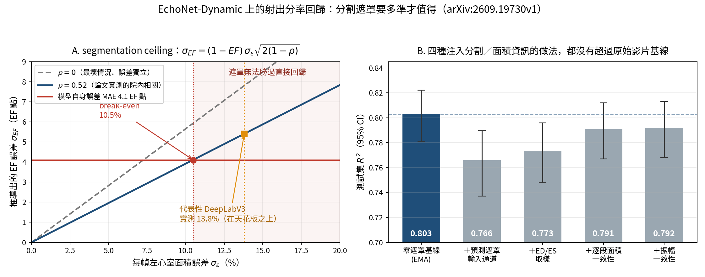

[Home](../) · [AI Papers](./)

# 先把左心室框出來，射出分率就會更準嗎？一條 10.5% 的分割天花板

## 來源

- 團隊：University of Nevada, Las Vegas 資訊工程學系；四位作者 Farshid Farhadi Khouzani（通訊作者）、Paul La Plante、Bryar Mustafa Shareef 與 Laxmi Gewali。[(ref: main author block)](https://arxiv.org/html/2609.19730v1)
- 論文：*The segmentation ceiling: why explicit left-ventricular masks do not improve learned ejection-fraction regression*；arXiv v1 於 2026-09-17 投稿，分類 eess.IV 與 cs.CV；作者註記 15 頁、4 張圖，已投稿 *Computers in Biology and Medicine*。[(ref: abs)](https://arxiv.org/abs/2609.19730)
- 識別碼：[arXiv:2609.19730](https://arxiv.org/abs/2609.19730)；[DOI: 10.48550/arXiv.2609.19730](https://doi.org/10.48550/arXiv.2609.19730)。
- 全文：[arXiv HTML 版](https://arxiv.org/html/2609.19730v1)；[PDF 版](https://arxiv.org/pdf/2609.19730v1)。授權為 arXiv 非專屬散布授權。
- 本文的章節 ref 指向 HTML 版；Table 3 之後的內文與表格數值以 PDF 版為準。

**編輯：** Clare

這篇論文把一個很直覺的做法——「先把左心室分割出來，再拿去估射出分率」——改寫成一條可以計算的門檻：遠罩要多準，才能贏過直接回歸。[(ref: main Abstract)](https://arxiv.org/html/2609.19730v1)

## 流程

圖：本書庫依論文 3.4 節的闉式判準與 Figure 3 重畫的左側曲線（以 ρ = 0.52 與 ρ = 0 兩組參數繪製，並以論文自述的 break-even 10.5% 與 MAE 4.1 EF 點對齊），右側數值則直接取自 Table 2，不含本文額外推論。[(ref: main §3.4)](https://arxiv.org/html/2609.19730v1#S3.SS4) [(ref: main Figure 3)](https://arxiv.org/html/2609.19730v1#S4.F3) [(ref: main Table 2)](https://arxiv.org/html/2609.19730v1#S4.T2)

## 背景／問題

左心室射出分率（left ventricular ejection fraction，LVEF）是臨床最常用的心臟功能量化指標之一，而心臟超音波是主要的取得管道。傳統流程要先找出舒張末期（end-diastolic，ED）與收縮末期（end-systolic，ES）兩幀，手動描出心內膜邊界，再套用 Simpson 雙平面法之類的幾何假設，因此耗時且受讀者差異影響。[(ref: main §1)](https://arxiv.org/html/2609.19730v1#S1)

既然臨床 EF 是從分割出來的體積算的，把分割遠罩交給模型應該有幫助——這是一個廣為接受的直覺。作者指出，這個假設「意外地很少被直接檢驗」，而他們的結論是它不成立。[(ref: main §1)](https://arxiv.org/html/2609.19730v1#S1)

關鍵在於 EF 的定義形式：它是兩個體積的「正規化差值」，而不是單一體積。相減這個動作會放大每一幀的分割誤差，因此遠罩必須準到一定程度，提供的 EF 相關資訊才會超過原始像素本來就包含的那些。[(ref: main §1)](https://arxiv.org/html/2609.19730v1#S1)

論文把自己的定位寫得很明確：相較於先前的分割引導研究，它提供的是一個可計算的 break-even 準確度門檻、一組跨多種注入策略的實證確認，以及一個「真正的瓶頸是泛化而非輸入表示」的辨識。[(ref: main §2.4)](https://arxiv.org/html/2609.19730v1#S2.SS4)

## 方法摘要

實驗分兩條線。第一條是分析：把每幀面積誤差如何傳遞到 EF 誤差寫成一個一階近似的闉式，再把模型自身的誤差當成基準線，交點就是「遠罩開始有用」的門檻，作者稱之為 segmentation ceiling。[(ref: main §3.4)](https://arxiv.org/html/2609.19730v1#S3.SS4)

第二條是實證：在同一個 UniFormer-S 影片主幹上，用四種互相獨立的做法把分割或面積資訊送進模型，都跟一個架構完全相同、第四個輸入通道填零的基線比。[(ref: main §3.5)](https://arxiv.org/html/2609.19730v1#S3.SS5)

另外兩組實驗回答「那真正的瓶頸在哪裡」：一組比較權重平均與強增強對泛化落差的影響，另一組比較兩種不確定性估計方式。[(ref: main §3.6)](https://arxiv.org/html/2609.19730v1#S3.SS6) [(ref: main §3.8)](https://arxiv.org/html/2609.19730v1#S3.SS8)

## 方法詳解

**闉式判準。** EF 定義為 `EF = 1 − V_ES / V_ED`。假設兩幀體積各自帶有乘法性相對誤差、標準差為 σε、病人內相關為 ρ，一階近似給出 `σ_EF = (1 − EF) · σε · √(2(1 − ρ))`。作者實測 DeepLabV3 在 ED／ES 兩幀的誤差相關為 ρ = 0.52；以模型自身的 MAE 4.1 EF 點當作基準，break-even 落在每幀面積誤差約 10.5%，而該分割器實際操作在 13.8%。[(ref: main §3.4)](https://arxiv.org/html/2609.19730v1#S3.SS4) [(ref: main Figure 3)](https://arxiv.org/html/2609.19730v1#S4.F3)

**主幹與輸入。** UniFormer-S（卷積與 transformer 混合架構）以 Kinetics-400 預訓練權重初始化，分類頭換成含 dropout（p = 0.5）的回歸頭，batch normalization 換成 group normalization；異變異數版本的最後一層同時輸出均值與對數變異數。每段取 36 幀、時間間隔 4，由 112 × 112 重取樣為 224 × 224。[(ref: main §3.2)](https://arxiv.org/html/2609.19730v1#S3.SS2) [(ref: main §3.3)](https://arxiv.org/html/2609.19730v1#S3.SS3)

**四種注入做法。** 一是在輸入加一個遠罩通道，逐幀填入 DeepLabV3 的預測遠罩；二是把訓練片段的取樣偏向跨越標註的 ED 與 ES 兩幀，讓體積極值必定出現；三是加一個輔助頭逐段預測左心室面積，以 ED／ES 的專家面積監督，損失為 `L = L_EF + λ_area · L_area + λ_smooth · L_smooth`；四是從預測的面積序列用軟性極值算出第二個 EF 估計值 `EF_area = (softmax_β(a) − softmin_β(a)) / softmax_β(a)`，再要求它與標籤一致（因為面積頭初期不穩定，該項在 warmup 之後才啟用）。[(ref: main §3.5)](https://arxiv.org/html/2609.19730v1#S3.SS5)

**訓練與泛化。** 45 個 epoch，主幹學習率 1 × 10⁻⁵、回歸頭 1 × 10⁻⁴，weight decay 1 × 10⁻⁴，梯度裁剪，cosine 排程加 8 個 epoch warmup；目標函數為 MSE（異變異數版本為 β-NLL）。權重取 decay 0.999 的指數移動平均（EMA），每個 epoch 依驗證 R² 選較佳者；增強含水平翻轉、強度縮放、亮度位移與小角度旋轉，僅於訓練時套用。[(ref: main §3.6)](https://arxiv.org/html/2609.19730v1#S3.SS6)

**評估協定。** 主要比較採用與 R(2+1)D 基線相同的 dense every-start all-clips 協定；指標為 R²、MAE、RMSE，搭配 95% bootstrap 信賴區間，另在臨床門檻上算 AUC。[(ref: main §3.7)](https://arxiv.org/html/2609.19730v1#S3.SS7)

**不確定性。** 對照組是 Monte-Carlo dropout（推論時保持 p = 0.5 的 dropout，T = 20 次隨機前傳）；實驗組是異變異數的 β-NLL 回歸，直接讓模型預測輸入相關的變異數（β = 0.5，對數變異數夾在固定區間以維持數值穩定），並允許以驗證集擬合的單一變異數縮放因子重新校準。[(ref: main §3.8)](https://arxiv.org/html/2609.19730v1#S3.SS8) [(ref: pdf §4.6)](https://arxiv.org/pdf/2609.19730v1)

## 資料與實驗

下表是本書庫依 3.1 節與 3.3 節整理的資料設計。全部實驗都跑在同一個公開資料集上，沒有第二個來源。[(ref: main §3.1)](https://arxiv.org/html/2609.19730v1#S3.SS1)

| 面向 | 內容 |
|---|---|
| 資料集 | EchoNet-Dynamic（史丹福大學醫院，心尖四腔切面超音波影片） |
| 規模 | 10,030 部影片 |
| 切分 | 訓練 7,465／驗證 1,288／測試 1,277（資料集標準切分） |
| 影像規格 | 112 × 112 像素；模型輸入前重取樣為 224 × 224，每段 36 幀、時間間隔 4 |
| 標註 | 臨床量測的 LVEF；加上 ED 與 ES 兩幀的專家心內膜描線 |
| 遠罩來源 | 基線為全零通道；對照為專家 ground-truth 遠罩；實用情境為 DeepLabV3 預測遠罩（Dice 約 0.92） |
| 取用條件 | 公開供非商業研究使用，需依 Stanford Research Use Agreement |

下表重製論文 Table 1，是主要的 EF 回歸結果。[(ref: main Table 1)](https://arxiv.org/html/2609.19730v1#S4.T1)

| 模型 | 驗證 R² | 測試 R²（95% CI） | MAE | RMSE |
|---|---:|---|---:|---:|
| R(2+1)D 基線 | 0.817 | 0.811（0.789–0.830） | 4.01 | 5.32 |
| UniFormer-S + EMA | 0.819 | 0.803（0.781–0.822） | 4.11 | 5.43 |
| UniFormer-S + 面積振幅一致性 | 0.830 | 0.792（0.768–0.813） | 4.24 | 5.58 |
| UniFormer-S + EMA + 增強 | 0.815 | 0.806（0.783–0.826） | 4.08 | 5.39 |

單位：MAE 與 RMSE 為 EF 點（百分點）。[(ref: main §4.1)](https://arxiv.org/html/2609.19730v1#S4.SS1)

下表重製論文 Table 2，是四種注入做法與零遠罩基線的對比；最右一欄是驗證到測試的 R² 落差。[(ref: main Table 2)](https://arxiv.org/html/2609.19730v1#S4.T2)

| 設定 | 驗證 R² | 測試 R²（95% CI） | MAE | 驗證–測試落差 |
|---|---:|---|---:|---:|
| 零遠罩基線（EMA） | 0.819 | 0.803（0.781–0.822） | 4.11 | 0.016 |
| ＋預測遠罩輸入通道 | 0.790 | 0.766（0.737–0.790） | 4.46 | 0.024 |
| ＋跨越 ED／ES 的片段取樣 | 0.799 | 0.773（0.748–0.796） | 4.49 | 0.026 |
| ＋逐段面積一致性 | 0.818 | 0.791（0.767–0.812） | 4.23 | 0.027 |
| ＋振幅一致性 | 0.830 | 0.792（0.768–0.813） | 4.24 | 0.038 |

下表重製論文 Table 3，是 EMA 加增強那一組模型在臨床門檻上的分類 AUC。原表沒有列出信賴區間與各門檻的正例數，本表照原樣保留。[(ref: main Table 3)](https://arxiv.org/html/2609.19730v1#S4.T3)

| EF 門檻 | 驗證 AUC | 測試 AUC |
|---|---:|---:|
| EF < 35 | 0.985 | 0.979 |
| EF < 40 | 0.981 | 0.978 |
| EF < 45 | 0.975 | 0.973 |
| EF < 50 | 0.959 | 0.954 |

## 結果

- **主模型與卷積基線統計上難以區分** — EMA 加增強的測試 R² 是 0.806（0.783–0.826）、MAE 4.08、RMSE 5.39 EF 點；R(2+1)D 基線是 0.811，MAE 4.01、RMSE 5.32，信賴區間重疊。Bland–Altman 的偏移為 +0.34 EF 點，95% 一致性界限為 [−10.2, +10.9]，94.7% 的預測落在界限內。[(ref: main §4.1)](https://arxiv.org/html/2609.19730v1#S4.SS1) [(ref: main Figure 2)](https://arxiv.org/html/2609.19730v1#S4.F2)
- **天花板的數字與實測一致** — 以 ρ = 0.52 帶入，break-even 落在 10.5% 每幀面積誤差，而 DeepLabV3 實測 13.8%，在天花板之上。[(ref: main §4.2)](https://arxiv.org/html/2609.19730v1#S4.SS2)
- **預測遠罩反而拉低表現** — 加了預測遠罩通道的測試 R² 是 0.766（0.737–0.790），低於架構完全相同的零遠罩基線 0.803。預測面積與專家面積的相關高達 r ≈ 0.96，但殘留的約 14% 面積誤差仍足以拖累 EF 估計。[(ref: main §4.2)](https://arxiv.org/html/2609.19730v1#S4.SS2)
- **ground-truth 遠罩的高分來自 label leakage** — 專家描線送進輸入時測試 R² 約 0.97，但那些描線本身就是臨床 EF 標籤的來源，論文直接把它標為標籤洩漏。[(ref: main §4.2)](https://arxiv.org/html/2609.19730v1#S4.SS2)
- **四種做法都沒有贏過基線** — 預測遠罩通道與 ED／ES 取樣明顯落後（0.766 與 0.773），兩種面積一致性目標貼近但仍在基線之下（0.791 與 0.792）；振幅一致性還把驗證到測試的落差擴大到 0.038（基線為 0.016）。[(ref: main §4.3)](https://arxiv.org/html/2609.19730v1#S4.SS3) [(ref: main Table 2)](https://arxiv.org/html/2609.19730v1#S4.T2)
- **真正有效的是泛化手段** — 加上強增強後，訓練到驗證的 R² 落差從 0.116 降到 0.091，驗證到測試的落差從 0.016 降到 0.009，而測試 R² 幾乎不變（0.803 到 0.806，區間重疊）。[(ref: main §4.4)](https://arxiv.org/html/2609.19730v1#S4.SS4)
- **門檻分類的泛化比連續回歸乾淨** — 四個臨床門檻的驗證與測試 AUC 貼得很近（0.985／0.979 到 0.959／0.954）；論文同時註明 EF < 35 的正例數較少，精度相對較低。[(ref: main §4.5)](https://arxiv.org/html/2609.19730v1#S4.SS5) [(ref: main Table 3)](https://arxiv.org/html/2609.19730v1#S4.T3)
- **不確定性：直接預測優於事後 dropout** — Monte-Carlo dropout 的預測標準差與絕對誤差幾乎無關（r ≈ 0）且覆蓋率遠低於名目值；β-NLL 版本的 r = 0.29，原始 μ ± 2σ 區間的實證覆蓋率 74%，套用一個在驗證集擬合的變異數縮放因子後升到 93%。代價是點估計：測試 R² 從 0.803 降到 0.755（0.723–0.782），MAE 從 4.08 升到 4.49。預測的不確定性在低 EF 案例上較大（σ 與 EF 的 r = −0.39）。[(ref: pdf §4.6)](https://arxiv.org/pdf/2609.19730v1) [(ref: pdf Figure 4)](https://arxiv.org/pdf/2609.19730v1)

## 限制

論文自己列出五項限制。第一，所有實驗只用一個機構的資料集（史丹福，2016–2018），而即使在 EchoNet-Dynamic 內部也觀察到世代偏移，因此外部驗證是必要的。第二，只用心尖四腔切面，而臨床 EF 常使用雙平面量測，單切面的天花板未必等於多切面的天花板。第三，闉式分析是一階傳遞並以代表性的 EF 與面積誤差尺度概括；雖然 ED／ES 誤差相關是實測的，仍然把一個隨病人變化的量簡化成代表值，而且推導建立在面積而非體積上（作者認為這是保守的簡化，因為體積加總會進一步放大面積誤差）。第四，結論針對的是一個在 14% 面積誤差附近的代表性分割器，若有分割器明顯跨過 break-even，原則上仍可能有幫助。第五，不確定性估計來自單一片段與單一模型，與誤差的相關也只是中等。[(ref: pdf §5.1)](https://arxiv.org/pdf/2609.19730v1)

作者也把主張的邊界寫明：本文不宣稱新的 state of the art，而是要解釋「為什麼一個自然且被廣泛追求的方向會飽和」，並提供一個可以拿來做決策的設計判準。[(ref: pdf §6)](https://arxiv.org/pdf/2609.19730v1)

以下幾點是本書庫對照全文與表格後的觀察，不是論文的結論：

- **「沒看到改善」與「證實不可能改善」是兩件事** — 四種做法與基線的對比是點估計加重疊的信賴區間，沒有配對顯著性檢定；論證強度主要來自「實測結果與閉式判準一致」，而非統計檢定。這是讀這篇時應該保留的分寸。
- **10.5% 是一個帶參數的數字，不是普適常數** — 它同時取決於 (1 − EF)、實測的 ρ，以及拿來對齊的模型自身誤差。搬到別的指標（如 fractional area change）、別的族群或別的分割器時，這三個都要重新量，不能直接引用 10.5%。
- **作者用來評估 β-NLL 代價的那把尺，同樣適用於主結論** — 論文說 β-NLL 的準確度代價「與 Table 2 各設定之間的差異同量級」。反過來看，Table 2 內部 0.766 到 0.803 的差距也就是這個量級；這讓「四種做法都沒贏」讀起來更像「都落在同一带」，而不是「明顯變差」。
- **門檻表缺了分母與區間** — Table 3 沒有信賴區間，也沒有各門檻的正例數。論文自述 EF < 35 的正例較少，而那恰好是臨床上最想拿來做分流的一格；缺了 n 與 CI，這個數字最難被引用。
- **高分的 ground-truth 遠罩是一個值得記住的反面樣本** — R² 約 0.97 看起來像突破，實際上是把標籤的來源送回輸入。任何把專家描線當輸入的 EF 模型，都應該先排除自己是不是在重現這個結果。
- **論文把不確定性的用途說得很謹慎** — 作者寫明這組不確定性是 informative 而非 sharply discriminative，適合標記「普遍較不可靠」的預測，而不是為個別案例背書。這句話在引用時常被略過，卻直接決定了這種信號能不能進臨床流程。[(ref: pdf §5)](https://arxiv.org/pdf/2609.19730v1)

## 與書庫其他文章的關係

OCT 影像依賴度稽核問的是「影像在最後那個決定裡出了多少力」，本篇問的是「多給一層分割資訊能不能讓結果更準」，兩篇都在拆解一個輸入是否真的被用上: [抽掉影像、留下理由：VLM 在 anti-VEGF 治療決策裡，OCT 到底出了多少力？](2026-09-23-vlm-oct-image-dependence-audit.md)

ModaLens 用交換影像來量測報告條件下的影像敏感度，本篇則把同一類問題換成一個事前可算的門檻，先說明輔助資訊要多準才可能有貢獻: [ModaLens：有報告可讀時，醫療 VLM 還會看影像嗎？](2026-09-17-modalens-image-sensitivity.md)

MedSIGHT 讓同一個模型同時輸出診斷文字與像素級分割，本篇則提醒分割輔助何時划算：兩篇合起來看，grounding 的價值要看任務對分割誤差的放大倍率: [MedSIGHT：醫療 VLM 能否一邊診斷、一邊把病灶分割出來？](2026-09-17-medsight-grounded-medical-vlm.md)

nMAS 的心衆竭特徵工程把射出分率當成上游欄位使用，本篇則處理那個欄位本身的自動量測與其誤差結構: [Tracing the Heart：用多代理管線追蹤心衆竭特徵的證據來源](2026-09-15-tracing-the-heart.md)

ORION-CMR 也用到心室分割，但把它放在產生報告量測值的位置而非回歸模型的輔助輸入，正好是本篇結論的另一面: [報告在病人下檢查台前就寫好：ORION-CMR 把整條心臟 MRI 判讀搬上掃描儀](2026-09-24-orion-cmr-on-scanner-reporting.md)

## 實務的啟發

第一，在加一個輔助輸入之前，先把「這個輔助輸入要多準才會贏」算出來。本篇最可以直接借用的不是結論，而是那個做法：把目標量對輔助量的誤差敏感度寫成一條式子，再跟現有模型的誤差對齊。計算成本幾乎為零，卻能在投入標註之前就告訴你這條路值不值得走。

第二，只要標籤是從某個標註算出來的，把該標註送回輸入就要先假設有洩漏。本篇的 R² 約 0.97 是一個干淨的示範；驗收時值得固定問一句：這個輸入在推論現場拿得到嗎，還是只在有專家標註的資料集裡拿得到。

第三，把「連續指標」與「門檻決策」分開報。同一個模型的 R² 只有 0.806，但在 EF < 40 這種臨床切點上的 AUC 是 0.978，而且驗證與測試幾乎不脱鉤。評估報告若只留一個連續指標，會同時低估臨床可用性與高估連續準確度。
不過需要提醒的是，這些門檻 AUC 來自單一機構的回港資料集，不等於臨床分流成效已經被驗證。

第四，把泛化手段當成第一順位的調參選項。本篇的 EMA 加強增強沒有抬高天花板，卻把驗證到測試的落差從 0.016 壓到 0.009。在院內專案裡，這類改動的實作成本遠低於重新設計輸入管線。

最後，不確定性要讓模型自己預測，而不是事後補上。Monte-Carlo dropout 在這個任務上與誤差幾乎無關，而 β-NLL 只需一個在驗證集擬合的縮放因子就把覆蓋率從 74% 拉到 93%。代價是點估計稍微變差，這個交換在需要可靠度信號的場景裡通常是劃算的。

## References

- `main`：[arXiv HTML 全文](https://arxiv.org/html/2609.19730v1)；本文使用其 [§1 Introduction](https://arxiv.org/html/2609.19730v1#S1)、[§2.4 Position of This Work](https://arxiv.org/html/2609.19730v1#S2.SS4)、[§3.1 Dataset](https://arxiv.org/html/2609.19730v1#S3.SS1)、[§3.2](https://arxiv.org/html/2609.19730v1#S3.SS2)、[§3.3](https://arxiv.org/html/2609.19730v1#S3.SS3)、[§3.4 The Segmentation Ceiling](https://arxiv.org/html/2609.19730v1#S3.SS4)、[§3.5](https://arxiv.org/html/2609.19730v1#S3.SS5)、[§3.6](https://arxiv.org/html/2609.19730v1#S3.SS6)、[§3.7](https://arxiv.org/html/2609.19730v1#S3.SS7)、[§3.8](https://arxiv.org/html/2609.19730v1#S3.SS8)、[§4.1](https://arxiv.org/html/2609.19730v1#S4.SS1)、[§4.2](https://arxiv.org/html/2609.19730v1#S4.SS2)、[§4.3](https://arxiv.org/html/2609.19730v1#S4.SS3)、[§4.4](https://arxiv.org/html/2609.19730v1#S4.SS4)、[§4.5](https://arxiv.org/html/2609.19730v1#S4.SS5)、[Table 1](https://arxiv.org/html/2609.19730v1#S4.T1)、[Table 2](https://arxiv.org/html/2609.19730v1#S4.T2)、[Table 3](https://arxiv.org/html/2609.19730v1#S4.T3)、[Figure 2](https://arxiv.org/html/2609.19730v1#S4.F2) 與 [Figure 3](https://arxiv.org/html/2609.19730v1#S4.F3) 等章節與圖表。
- `pdf`：[arXiv PDF 全文](https://arxiv.org/pdf/2609.19730v1)；本次取用時 HTML 版在 Table 3 之後截斷，因此 §4.6 Predictive Uncertainty、§5 Discussion（含 §5.1 Limitations、§5.2 Future Work）與 §6 Conclusion 的內文、以及 Table 1 至 Table 3 的逐格數值均以 PDF 版核對。
- `abs`：[arXiv 摘要頁](https://arxiv.org/abs/2609.19730)；提供投稿日期、分類、作者與授權資訊。
- `doi`：[10.48550/arXiv.2609.19730](https://doi.org/10.48550/arXiv.2609.19730)。
- `dataset`：[EchoNet-Dynamic 官方釋出頁](https://echonet.github.io/dynamic/)，論文在資料取用聲明中引用。

[Home](../) · [AI Papers](./)
