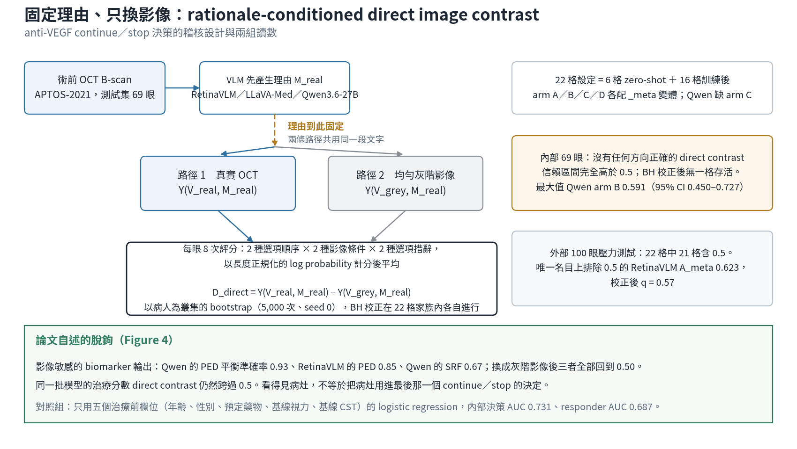

[Home](../) · [AI Papers](./)

# 抽掉影像、留下理由：VLM 在 anti-VEGF 治療決策裡，OCT 到底出了多少力？

## 來源

- 團隊：韓國 Clear Eye Clinic（平澤）、BioNexus Inc.（水原）與 CHA Bundang Medical Center 眼科（城南）；九位作者，Wonbong Jang 與 Gwon Yul Jo 並列第一作者，通訊作者為 Joonhyung Kim。[(ref: main author block)](https://www.mdpi.com/2306-5354/13/8/912)
- 論文：*A Rationale-Conditioned Image-Contrast Audit of OCT Dependence in Vision-Language Models for Anti-VEGF Treatment-Response Prediction*，*Bioengineering* 13(8): 912；2026-07-13 投稿、2026-08-03 修訂、2026-08-11 接受、2026-08-12 刊出；MDPI 開放取用（CC BY）。[(ref: main front matter)](https://www.mdpi.com/2306-5354/13/8/912)
- 識別碼：[DOI: 10.3390/bioengineering13080912](https://doi.org/10.3390/bioengineering13080912)。
- 全文：[MDPI 開放取用全文](https://www.mdpi.com/2306-5354/13/8/912)；[PDF 版](https://www.mdpi.com/2306-5354/13/8/912/pdf)。
- 沒有 arXiv 預印本；本文的章節敘述取自 MDPI 全文頁，各表格數值另以 PDF 版逐格核對。

**編輯：** Clare

這篇論文想回答一個看起來很基本、實際上很少被單獨測量的問題：當一個醫療 VLM 給出「繼續打針」或「停止」的建議時，那個建議裡有多少是來自 OCT 影像本身。[(ref: main Abstract)](https://www.mdpi.com/2306-5354/13/8/912)

## 流程

圖：本書庫依論文 Materials and Methods 的稽核設計與 Figure 1、Figure 4 的說明繪製的編輯示意圖，數值取自 Results 與 Table 1 至 Table 5，不含本文額外推論。[(ref: main Figure 1)](https://www.mdpi.com/2306-5354/13/8/912#bioengineering-13-00912-f001) [(ref: main Figure 4)](https://www.mdpi.com/2306-5354/13/8/912#bioengineering-13-00912-f004)

## 背景／問題

新生血管性 AMD 與 DME 的 anti-VEGF 治療靠連續 OCT 追蹤，而「這一次還要不要打」是門診裡反覆出現的判斷。把這個判斷交給 VLM 的研究已經不少，但論文開頭指出一件事：端到端的判別力並不能說明一個預測是否真的依賴 OCT 影像。[(ref: main Introduction)](https://www.mdpi.com/2306-5354/13/8/912)

作者把話說得更細：單一個判別統計量可能反映真正的影像資訊，也可能反映標籤盛行率、提示詞的構造，或是模型自己生成的那段理由文字裡已經帶著的資訊。先前的 VLM 基準研究已經記錄了「輸出層面表現可接受、但仍有幻覺與不一致」的現象，這使得只看一個 AUC 更不安全。[(ref: main Introduction)](https://www.mdpi.com/2306-5354/13/8/912)

於是問題被改寫成一個可以量測的形式：把模型自己寫出來的理由固定住，只更動影像，看終端那個 continue／stop 的分數會不會跟著動。動了多少，就是這個設定下影像的「直接貢獻」。[(ref: main Abstract)](https://www.mdpi.com/2306-5354/13/8/912)

這個定義同時也界定了它量不到什麼。論文在 Figure 1 的圖說裡直接寫明：這條設計估計的是「以理由為條件的受控直接影像對比」，影像經由理由再影響答案的那條路徑沒有被測量。[(ref: main Figure 1)](https://www.mdpi.com/2306-5354/13/8/912#bioengineering-13-00912-f001)

## 方法摘要

稽核分成三步。第一步，對每一隻眼睛，模型先看真實 OCT、產生一段理由 M_real。第二步，把這段理由原封不動地固定下來，分別在真實 OCT 與一張均勻灰階影像兩種條件下，讓模型對 continue／stop 做一次強制二選一的評分。第三步，兩者相減得到 D_direct。[(ref: main Materials and Methods)](https://www.mdpi.com/2306-5354/13/8/912)

三個 VLM 主幹各自跑 zero-shot 與三種參數高效微調（arm B／C／D），每一種再配一個把病歷欄位前置到提示詞的 _meta 變體；Qwen 沒有 arm C，所以總共是 6 格 zero-shot 加 16 格訓練後，合計 22 格。決策家族與 responder 家族各自是一個 22 格的多重比較家族。[(ref: main Materials and Methods)](https://www.mdpi.com/2306-5354/13/8/912)

除了主要對比，論文另外放了三組診斷性檢查：一個確認終端分數會對注入的文字起反應的 reasoning GATE、一組逐項 biomarker 的讀數，以及一個只用五個治療前欄位的 logistic regression 對照。最後在第二個院所的 100 隻眼上重跑同一組 22 格，作為分布偏移的壓力測試。[(ref: main Figure 2)](https://www.mdpi.com/2306-5354/13/8/912#bioengineering-13-00912-f002) [(ref: main Results)](https://www.mdpi.com/2306-5354/13/8/912)

## 方法詳解

**評分方式。** 終端提示詞後面接一段固定的硬分隔字串 `=== CLINICAL DECISION === Options: [continue, stop] Final Choice:`，模型對 `continue` 與 `stop` 兩個字串的長度正規化 log probability 就是終端分數。每隻眼睛要跑八次評分：2 種答案順序 × 2 種影像條件 × 2 種選項措辭，取平均。[(ref: main Materials and Methods)](https://www.mdpi.com/2306-5354/13/8/912)

**主要估計量。** D_direct = Y(V_real, M_real) − Y(V_grey, M_real)。論文明確把它稱為「以理由為條件的受控直接影像貢獻」，並在 Figure 1 的圖說裡聲明 image → rationale → answer 這條中介路徑不在量測範圍內。[(ref: main Figure 1)](https://www.mdpi.com/2306-5354/13/8/912#bioengineering-13-00912-f001)

**三個主幹。** RetinaVLM-Specialist（repository `RobbieHolland/RetinaVLM`）、LLaVA-Med-v1.5-Mistral-7B（`Microsoft/llava-med-v1.5-mistral-7b`）與 Qwen3.6-27B（`Qwen/Qwen3.6-27B`，以 4-bit QLoRA 調整）。論文同時聲明「原始執行環境沒有保留各權重檔的獨立 checksum」，因此無法確認檢查點的位元級複製。[(ref: main Materials and Methods)](https://www.mdpi.com/2306-5354/13/8/912)

**四個 arm。** Arm A 是 zero-shot；arm B 是以生成理由做監督微調；arm C 是 arm B 再加一個朝向 fluid mask 的 attention-KL 項；arm D 是 arm B 再加合成的 fluid-removal 例子。每個 arm 都有一個 _meta 變體，把年齡、性別、預定藥物、視力與 CST 前置到提示詞。QLoRA 設定是 rank 16、alpha 32、dropout 0.05，訓練三個 epoch，AdamW，學習率 1 × 10⁻⁴。[(ref: main Materials and Methods)](https://www.mdpi.com/2306-5354/13/8/912)

**統計。** AUC 以病人為叢集單位做 bootstrap，5,000 次重抽、seed 0，得到 95% 信賴區間；相對於 AUC 0.5 的雙尾 bootstrap p 值再以 Benjamini–Hochberg 在 22 格家族內校正。論文把這些區間標為 nominal，並定義「區間包含 0.5」要讀成 inconclusive，而不是「沒有判別力」。校準、Brier score、log loss、操作點指標與 selective-risk 分析在鎖定的輸出裡沒有保留，因此沒有報。[(ref: main Materials and Methods)](https://www.mdpi.com/2306-5354/13/8/912)

**三組診斷性檢查。** Reasoning GATE 測的是「在提示詞裡注入一句決策陳述後，終端分數會不會往那個方向移動」，三個主幹的比例都是 1.00；論文同時聲明這只是文字敏感度檢查，不能用來驗證影像到理由的中介。Biomarker 面板量的是模型在 IRF、PED、SRF 三個標籤上的輸出在真實影像與灰階影像之間的差別。Tabular 面板是只用五個治療前欄位的 logistic regression。[(ref: main Results)](https://www.mdpi.com/2306-5354/13/8/912) [(ref: main Figure 2)](https://www.mdpi.com/2306-5354/13/8/912#bioengineering-13-00912-f002)

## 資料與實驗

下表是本書庫依 Materials and Methods 整理的資料設計。內部世代與外部世代的角色完全不同：前者是有標準標籤的主分析，後者是作者明講的探索性分布偏移壓力測試，不是臨床外部驗證。[(ref: main Materials and Methods)](https://www.mdpi.com/2306-5354/13/8/912) [(ref: main Figure 1)](https://www.mdpi.com/2306-5354/13/8/912#bioengineering-13-00912-f001)

| 世代 | 來源 | 影像 | 切分／規模 | 標籤 |
|---|---|---|---|---|
| 內部（主分析） | APTOS-2021 anti-VEGF challenge，治療前後配對的黃斑部 OCT B-scan | Spectralis OCT（Heidelberg Engineering） | 218 隻有 mask 的眼，以病人層級切成訓練 128、驗證 21、測試 69 | 主要：資料集提供的 continue／stop 二元標籤（測試集 44 continue、25 stop）；次要：CST 下降 ≥ 25 μm 或 ΔVA ≥ 0.1 的複合 responder 標籤 |
| 外部（壓力測試） | 第二院所回溯、去識別化世代 | 同為黃斑部 OCT | 100 隻眼 | 同上兩組標籤；疾病與治療組成異質 |

外部世代的組成由論文逐項列出：DME 26、CNVM 25、PCV 18、BRVO 11、NVE 8、CRVO 4、PDR 3、myopic CNV 3、CSC 2；治療為 aflibercept 62、faricimab 20、ranibizumab 15、dexamethasone implant 2、brolucizumab 1。[(ref: main Results)](https://www.mdpi.com/2306-5354/13/8/912)

下表重製論文 Table 1 的六格 zero-shot 結果。真實影像 AUC 是未受控的端到端讀數，direct contrast 才是本文的主要估計量。[(ref: main Table 1)](https://www.mdpi.com/2306-5354/13/8/912#bioengineering-13-00912-t001)

| 主幹 | Arm | n | 真實影像 AUC [95% CI] | Direct-contrast AUC [95% CI] |
|---|---|---:|---|---|
| RetinaVLM | A | 69 | 0.334 [0.202, 0.477] | 0.368 [0.230, 0.518] |
| RetinaVLM | A_meta | 69 | 0.415 [0.267, 0.573] | 0.423 [0.281, 0.574] |
| LLaVA-Med | A | 69 | 0.445 [0.298, 0.590] | 0.452 [0.316, 0.591] |
| LLaVA-Med | A_meta † | 52 | 0.437 [0.264, 0.605] | 0.490 [0.322, 0.659] |
| Qwen3.6-27B | A | 69 | 0.471 [0.333, 0.615] | 0.354 [0.224, 0.493] |
| Qwen3.6-27B | A_meta | 69 | 0.512 [0.358, 0.668] | 0.367 [0.237, 0.502] |

† 完整案例分析，排除 17 筆空輸出。[(ref: main Table 1)](https://www.mdpi.com/2306-5354/13/8/912#bioengineering-13-00912-t001)

下表重製論文 Table 2 的十六格訓練後結果。原表在真實影像 AUC 欄沒有印出信賴區間，本表照原樣保留空白。[(ref: main Table 2)](https://www.mdpi.com/2306-5354/13/8/912#bioengineering-13-00912-t002)

| 主幹 | Arm | n | 真實影像 AUC | Direct-contrast AUC [95% CI] |
|---|---|---:|---:|---|
| RetinaVLM | B | 69 | 0.778 | 0.521 [0.379, 0.659] |
| RetinaVLM | B_meta | 69 | 0.797 | 0.407 [0.275, 0.547] |
| RetinaVLM | C | 69 | 0.768 | 0.520 [0.374, 0.666] |
| RetinaVLM | C_meta | 69 | 0.797 | 0.489 [0.347, 0.637] |
| RetinaVLM | D | 69 | 0.656 | 0.475 [0.329, 0.621] |
| RetinaVLM | D_meta | 69 | 0.764 | 0.359 [0.223, 0.496] |
| LLaVA-Med | B | 69 | 0.691 | 0.343 [0.205, 0.488] |
| LLaVA-Med | B_meta | 69 | 0.744 | 0.422 [0.285, 0.565] |
| LLaVA-Med | C | 69 | 0.691 | 0.407 [0.276, 0.540] |
| LLaVA-Med | C_meta | 69 | 0.691 | 0.450 [0.303, 0.596] |
| LLaVA-Med | D | 69 | 0.744 | 0.397 [0.261, 0.540] |
| LLaVA-Med | D_meta | 69 | 0.744 | 0.456 [0.311, 0.606] |
| Qwen3.6-27B | B | 69 | 0.850 | 0.591 [0.450, 0.727] |
| Qwen3.6-27B | B_meta | 69 | 0.850 | 0.371 [0.233, 0.517] |
| Qwen3.6-27B | D | 69 | 0.797 | 0.482 [0.341, 0.626] |
| Qwen3.6-27B | D_meta | 69 | 0.850 | 0.443 [0.301, 0.583] |

外部世代的逐項 biomarker image-contrast AUC 見下表，取自論文 Table 3 的外部欄位。[(ref: main Table 3)](https://www.mdpi.com/2306-5354/13/8/912#bioengineering-13-00912-t003)

| 主幹 | IRF [95% CI] | SRF [95% CI] | PED [95% CI] |
|---|---|---|---|
| RetinaVLM | 0.59 [0.47, 0.71] | 0.64 [0.53, 0.75] | 0.57 [0.44, 0.69] |
| LLaVA-Med | 0.44 [0.32, 0.55] | 0.51 [0.39, 0.62] | 0.38 [0.25, 0.52] |
| Qwen3.6-27B | 0.63 [0.51, 0.74] | 0.78 [0.69, 0.87] | 0.76 [0.65, 0.86] |

## 結果

- **主要對比全數 inconclusive** — 內部 22 格裡，21 格的 95% 信賴區間包含 AUC 0.5；唯一排除 0.5 的是 Qwen zero-shot 的 0.354 [0.224, 0.493]，方向與假設相反。論文的總結句是：沒有任何方向正確的 direct contrast，其 95% 信賴區間完全高於 0.5。經 Benjamini–Hochberg 校正後，沒有任何方向正確的格子存活。[(ref: main Table 1)](https://www.mdpi.com/2306-5354/13/8/912#bioengineering-13-00912-t001) [(ref: main Table 2)](https://www.mdpi.com/2306-5354/13/8/912#bioengineering-13-00912-t002)
- **訓練後的最大正向估計值** — Qwen arm B 的 0.591 [0.450, 0.727]，區間仍跨過 0.5。[(ref: main Table 2)](https://www.mdpi.com/2306-5354/13/8/912#bioengineering-13-00912-t002)
- **端到端讀數與直接貢獻明顯不同步** — 同一格 Qwen arm B 的真實影像 AUC 是 0.850，但受控後的 direct contrast 只有 0.591；RetinaVLM 訓練後的真實影像 AUC 落在 0.656 到 0.797 之間，direct contrast 卻都貼在 0.5 附近。[(ref: main Table 2)](https://www.mdpi.com/2306-5354/13/8/912#bioengineering-13-00912-t002)
- **biomarker 輸出確實對影像有反應** — 在 arm B 下，Qwen 的 PED 覆蓋率加權平衡準確率是 0.93、RetinaVLM 的 PED 是 0.85、Qwen 的 SRF 是 0.67；LLaVA-Med 在每個標籤上都停在 0.50。換成均勻灰階影像後，這些數值全部掉回 0.50。論文把這一組與治療分數的對照直接命名為 dissociation。[(ref: main Table 3)](https://www.mdpi.com/2306-5354/13/8/912#bioengineering-13-00912-t003) [(ref: main Figure 4)](https://www.mdpi.com/2306-5354/13/8/912#bioengineering-13-00912-f004)
- **tabular 對照** — 只用年齡、性別、預定藥物、基線視力與基線 CST 五個欄位的 logistic regression，內部決策 AUC 0.731 [0.603, 0.846]、responder AUC 0.687 [0.534, 0.820]。論文強調這是 reference 而不是 ceiling。[(ref: main Results)](https://www.mdpi.com/2306-5354/13/8/912)
- **reasoning GATE 通過但意義有限** — 三個主幹的終端分數在注入決策陳述時都 100% 往注入方向移動；論文自己說明這只驗證文字敏感度。[(ref: main Results)](https://www.mdpi.com/2306-5354/13/8/912)
- **外部 100 眼重現同樣的圖像** — 22 格決策讀數中 21 格的區間含 0.5；唯一名目上排除的是 RetinaVLM A_meta 的 0.623 [0.509, 0.733]，校正後 q = 0.57。同址的 tabular 決策 AUC 是 0.611 [0.501, 0.718]、responder AUC 0.719 [0.612, 0.821]，而三個主幹的 responder 讀數分別是 RetinaVLM 0.445 [0.332, 0.565]、LLaVA-Med 0.409 [0.276, 0.548]、Qwen 0.520 [0.396, 0.641]。[(ref: main Table 4)](https://www.mdpi.com/2306-5354/13/8/912#bioengineering-13-00912-t004) [(ref: main Table 5)](https://www.mdpi.com/2306-5354/13/8/912#bioengineering-13-00912-t005)
- **輸出覆蓋率是獨立的問題** — LLaVA-Med 在內部 A_meta 有 17 筆空輸出（n 由 69 降到 52），外部 A_meta 的覆蓋率是 70/100。論文以完整案例分析處理，並把選擇偏誤列為限制。[(ref: main Table 1)](https://www.mdpi.com/2306-5354/13/8/912#bioengineering-13-00912-t001) [(ref: main Table 4)](https://www.mdpi.com/2306-5354/13/8/912#bioengineering-13-00912-t004)

## 限制

論文自己列出的限制相當長，重點包括：內部測試集只有 69 隻眼、第二院所只有 100 隻眼且來自單一機構；只分析了一次訓練實現，bootstrap 區間不含重訓練的變異；沒有預先指定等價界限，也沒有樣本數設計；主要終點沒有經過盲化的視網膜專科醫師重新判定；單一張治療前 B-scan 不等於實際的 anti-VEGF 管理流程；第二院所的疾病與治療組成異質（含 Ozurdex 這類非 anti-VEGF 治療）。[(ref: main Limitations)](https://www.mdpi.com/2306-5354/13/8/912)

方法學上的限制更關鍵。主要對比固定了真實影像下的理由，因此完全略過經由理由的中介效果；論文同時聲明不假設生成的理由忠實反映內部計算。均勻灰階輸入是一個分布外（out-of-distribution）的單一 null，沒有測試其他 in-domain 的替代 null。研究也沒有放入傳統 CNN／ViT、量化 OCT 指標、完整體積、多模態或 oracle-biomarker 等對照。名目信賴區間與家族內 FDR 校正不足以支撐等價結論。此外，fluid mask 沒有 APTOS 的像素級 ground truth、不含 PED、也沒有獨立分級；合成的 fluid-removal 目標不是普遍適用的臨床反事實；歷史軟體版本與硬體識別碼沒有保留。[(ref: main Limitations)](https://www.mdpi.com/2306-5354/13/8/912)

結論段把邊界寫得很直接：這項分析「不能證明模型忽略了 OCT，不能證明影像資訊完全不存在，也不能證明單張影像存在資訊論上的上限」。作者把主要貢獻定位為方法學與警示性的——臨床 VLM 評估應該把端到端表現、以理由為條件的直接影像效果、經由理由的中介效果、輸出覆蓋率、校準與可移轉性分開來談。[(ref: main Conclusions)](https://www.mdpi.com/2306-5354/13/8/912)

以下幾點是本書庫在對照全文與表格後的觀察，不是論文的結論：

- **端到端與受控讀數的落差是這篇最實用的產物** — Qwen arm B 的真實影像 AUC 0.850 與同一格 0.591 的 direct contrast 並列在同一張表上。這組並列不能證明 0.850 不來自影像（中介路徑沒被測），但它確實讓「0.850 代表模型會看片」這句話失去支撐。任何只報端到端 AUC 的醫療 VLM 研究，都缺這一欄。
- **Table 2 的真實影像 AUC 欄沒有信賴區間** — 在 n = 69、44/25 的標籤分布下，0.850 與 0.656 之間能不能區分無從判斷。這一欄的缺漏會影響讀者對 arm 之間差異的解讀。
- **tabular 對照比 direct contrast 的 null 更容易讀** — 訓練後的真實影像 AUC 落在 0.656 到 0.850，而完全不看影像、只用五個治療前欄位的 logistic regression 是 0.731；外部則是 VLM responder 0.409 至 0.520 對上同址 tabular 0.719。論文把 tabular 稱為 reference 而非 ceiling 是謹慎的說法，但在這個樣本數下，這組對照傳達的訊息比一堆跨過 0.5 的區間更直接。
- **影像敏感不等於影像被用上** — 同一個 Qwen 檢查點，PED 標籤的平衡準確率 0.93 會因為換成灰階圖而掉到 0.50，治療分數卻幾乎不動。這是論文 Figure 4 明說的脫鉤，值得單獨記住：模型看得見病灶，與模型把病灶用進最後那個決定，是兩件要分開驗證的事。
- **覆蓋率應該和 AUC 一起報** — LLaVA-Med 內部 A_meta 的 17 筆空輸出（覆蓋率 75%）與外部 A_meta 的 70/100，都被完整案例分析吸收掉了。AUC 在剩下的樣本上算出來，看起來與其他格子可比，實際上不是。
- **「沒找到」不是「不存在」** — 作者自己指出沒有預先指定等價界限也沒有樣本數設計。這代表本文的正確讀法是 inconclusive，而不是 equivalence；把它引用成「VLM 不看影像」會超出資料能支持的範圍。
- **利益揭露值得一併讀** — 九位作者中有五位是 BioNexus Inc. 的員工，研究無外部經費；外部世代經 CHAMC 倫理審查（protocol CHAMC 2026-04-057）並豁免同意，資料僅能向通訊作者申請取得。[(ref: main Statements)](https://www.mdpi.com/2306-5354/13/8/912)

## 與書庫其他文章的關係

ModaLens 固定文字、交換影像來量測報告條件下醫療 VLM 的影像敏感度，本篇則再往前一步，把模型自己生成的理由固定住後才換影像，量的是同一個問題在「理由」這個中介被封住之後還剩下什麼: [ModaLens：有報告可讀時，醫療 VLM 還會看影像嗎？](2026-09-17-modalens-image-sensitivity.md)

胸片結核篩檢稽核固定影像、改換提示詞與負類，本篇固定理由、改換影像，兩篇是「一個分數到底在測什麼」這個問題的兩種拆法: [稽核胸片結核篩檢的醫療 VLM：換一個評估條件，哪一種結論還站得住？](2026-09-21-cxr-tb-vlm-portability-audit.md)

RadVLM 的分節評估顯示語意相似度不能代理結構保真度，本篇顯示影像敏感的 biomarker 輸出不能代理影像對最終決策的貢獻，兩篇都在拆穿「一個高分代理了另一件事」的假設: [報告讀起來很順，就代表寫對了嗎？RadVLM 的分節評估](2026-09-22-radvlm-section-based-report-evaluation.md)

GRALIS-Report 用架構把影像擋在報告生成之外，讓文字只能依賴結構化歸因紀錄；本篇則用稽核手段在既有模型上量測影像實際貢獻了多少，一篇從設計端、一篇從評估端處理同一個「依據從哪裡來」的問題: [不讓報告看見影像：乳癌病理的區域級歸因能撐起一份可稽核的報告嗎？](2026-09-23-gralis-report-histology-attribution.md)

醫療 LLM 評估落差研究指出臨床級證據的供給偏低，本篇提供一個具體案例——一個看起來合格的端到端 AUC，在加上一層受控對比之後就不再能支持原來的結論: [醫療 LLM 評估落差：研究更嚴謹，為何證據反而更舊？](2026-09-17-medical-llm-evaluation-gap.md)

## 實務的啟發

第一，在院內評估醫療 VLM 時，把「端到端 AUC」與「受控直接對比」當成兩欄一起報。這篇最可以直接借用的不是它的結論，而是那張把兩個數字並排的表：0.850 與 0.591 放在一起，讀者才知道前者留下了多少沒解釋的空間。做法本身不貴——同一批樣本多跑一次替換影像的評分即可。

第二，null 條件要挑得更小心。均勻灰階是一個乾淨但分布外的干預，論文自己把它列為限制。若要在院內重跑，值得同時準備 in-domain 的替代 null，例如同一病人的另一時點影像、同一機型的正常眼影像，或加噪後的影像；不同的 null 會問出不同的問題。

第三，把輸出覆蓋率寫進評估表。LLaVA-Med 那 17 筆空輸出如果只以完整案例分析吸收，讀者看到的是一個與其他格子形狀相同、但母體不同的 AUC。覆蓋率、棄答率與缺漏原因應該與判別力指標並列，而不是放在註腳。

第四，準備一個不看影像的對照模型。本篇的 logistic regression 只用五個治療前欄位，卻落在多數 VLM 端到端讀數的同一區間。這類對照的成本極低，卻能立刻回答一個關鍵問題：影像在這個任務上到底值不值得那個算力。

最後，注意「看得見」與「用得上」的距離。Qwen 對 PED 的判讀明顯依賴影像，卻沒有把這個資訊帶到治療建議裡。這代表在驗收一個多模態臨床工具時，「模型能正確描述影像所見」與「模型的建議確實由影像所見驅動」必須分別設關卡；只驗前者，等於驗收了一個可能沒被使用的功能。

## References

- `main`：[Bioengineering 13(8): 912 全文（MDPI 開放取用）](https://www.mdpi.com/2306-5354/13/8/912)；本文使用該頁的 Abstract、Introduction、Materials and Methods、Results、Discussion、Limitations、Conclusions 與各項 Statements 段落，以及 [Table 1](https://www.mdpi.com/2306-5354/13/8/912#bioengineering-13-00912-t001)、[Table 2](https://www.mdpi.com/2306-5354/13/8/912#bioengineering-13-00912-t002)、[Table 3](https://www.mdpi.com/2306-5354/13/8/912#bioengineering-13-00912-t003)、[Table 4](https://www.mdpi.com/2306-5354/13/8/912#bioengineering-13-00912-t004)、[Table 5](https://www.mdpi.com/2306-5354/13/8/912#bioengineering-13-00912-t005)、[Figure 1](https://www.mdpi.com/2306-5354/13/8/912#bioengineering-13-00912-f001)、[Figure 2](https://www.mdpi.com/2306-5354/13/8/912#bioengineering-13-00912-f002) 與 [Figure 4](https://www.mdpi.com/2306-5354/13/8/912#bioengineering-13-00912-f004)；表格數值另以 [PDF 版](https://www.mdpi.com/2306-5354/13/8/912/pdf)逐格核對。MDPI 提供逐表與逐圖錨點，但沒有逐節錨點，因此章節層級的 ref 指向全文頁。
- `doi`：[10.3390/bioengineering13080912](https://doi.org/10.3390/bioengineering13080912)。

[Home](../) · [AI Papers](./)
