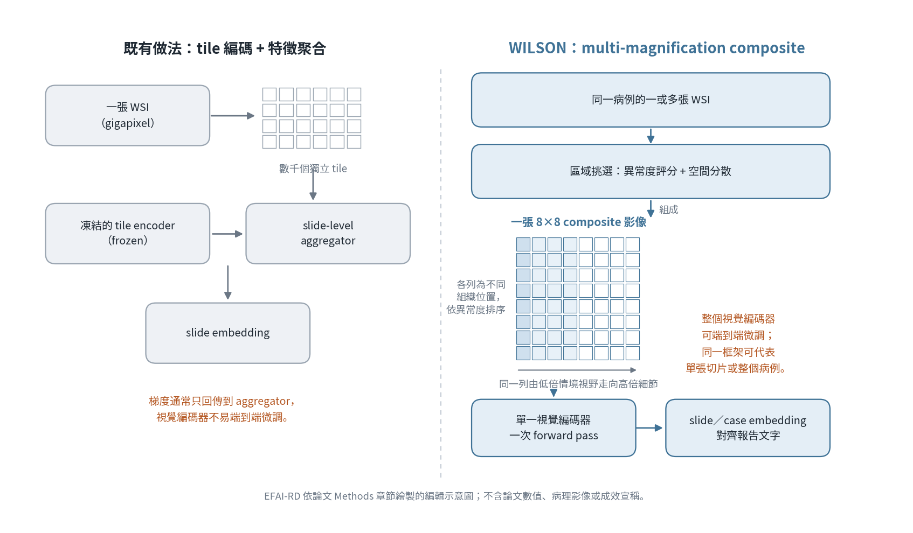

[Home](../) · [AI Papers](./)

# 把一個病例壓成一張圖：WILSON 用 composite 取代數千個 tile，診斷資訊還剩多少？

## 來源

- 團隊：Mayo Clinic（Rochester, MN）KIMIA Lab／Department of AI & Informatics 主導，合作單位包含 Department of Laboratory Medicine and Pathology、Department of Quantitative Health Sciences、Mayo Clinic Comprehensive Cancer Center、Division of Breast and Melanoma Surgical Oncology 與 Department of Oncology；共十六位作者，第一作者 Saghir Alfasly；最後一位作者 H. R. Tizhoosh 是唯一列出聯絡信箱者，也是 arXiv 的投稿者，論文頁未另標示通訊作者。[(ref: main author block)](https://arxiv.org/html/2609.25123v1)
- 論文：*WILSON - a pathology foundation model framework for patient-level analysis and diagnostic text generation*；arXiv 預印本，2026-09-20 送件（v1），全文 56 頁、6 張主圖，附錄另有 11 張圖與 28 張表。[(ref: main)](https://arxiv.org/html/2609.25123v1)
- 識別碼：[arXiv:2609.25123](https://arxiv.org/abs/2609.25123)；[DOI: 10.48550/arXiv.2609.25123](https://doi.org/10.48550/arXiv.2609.25123)。
- 全文：[arXiv HTML 版](https://arxiv.org/html/2609.25123v1)（含章節與表格錨點）；[arXiv 摘要頁](https://arxiv.org/abs/2609.25123)。
- 本文為預印本，尚未經同儕審查。

**編輯：** Clare

這篇論文不比拼更大的模型，而是改掉病理基礎模型的「計算單位」：把一張全切片影像（whole-slide image, WSI）甚至一個病例的多張切片，壓成單一張多倍率的 composite 影像餵給編碼器，再回頭問這樣做會失去多少診斷資訊、換到多少算力與可微調性。[(ref: main §1)](https://arxiv.org/html/2609.25123v1#S1)

## 流程

圖：本書庫依論文 Method 章節繪製的編輯示意圖，不含論文數值、病理影像或成效宣稱。左右兩側的差別在於「送進視覺編碼器的是什麼」：既有做法送進數千個各自獨立的 tile，再由一個聚合器把特徵合起來；WILSON 送進一張已經包含多個位置、多種倍率的 composite 影像。[(ref: main §4 Multi-magnification composite generation)](https://arxiv.org/html/2609.25123v1#S4.SSx4) [(ref: main Fig. 6)](https://arxiv.org/html/2609.25123v1#S4.F6)

## 背景／問題

病理診斷的判讀方式有兩個特徵：一是跨倍率，病理醫師會在低倍找出可疑區域、再切到高倍確認細節；二是跨切片，同一個病例往往有多張玻片，診斷結論是把這些切片一起讀完之後才成立的。[(ref: main §1)](https://arxiv.org/html/2609.25123v1#S1)

目前主流的病理基礎模型卻不是這樣組織的。多數做法先用 tile-level encoder 各自獨立編碼數以千計的小影像塊，再用 multiple-instance learning 之類的聚合方法把這些特徵合成切片層級的表徵。論文指出這條路線有三個代價：計算負擔可觀；影像編碼階段把局部形態與更大範圍的組織脈絡切開；而且把「單張切片」而不是「多切片病例」當成表徵的主要單位。[(ref: main §1)](https://arxiv.org/html/2609.25123v1#S1)

視覺語言模型提供了另一個著力點——用病理報告的診斷語意去約束影像表徵。但論文認為既有管線在這裡也卡住了：因為視覺編碼器與報告文字之間隔了一層聚合階段，兩者無法直接對齊。[(ref: main §1)](https://arxiv.org/html/2609.25123v1#S1)

還有一個實務後果值得注意。由於把梯度傳回數千個 tile 在 WSI 尺度上代價太高，下游調校通常只能在凍結的 tile 特徵之上訓練聚合器，整個視覺主幹無法端到端微調。[(ref: main §2.4)](https://arxiv.org/html/2609.25123v1#S2.SS4)

論文因此提出的問題是：如果把跨倍率、跨切片的資訊先組裝成一張固定尺寸的影像，再讓編碼器一次讀完，這樣的表徵還夠不夠支撐診斷檢索、圖文對齊、報告生成與下游微調。[(ref: main §1)](https://arxiv.org/html/2609.25123v1#S1)

## 方法摘要

WILSON 把每張 WSI 表示成一張 2048×2048 的 composite 影像：8×8 排列的 256×256 tile，每一列是一個組織位置、每一行是該位置的不同倍率。病例層級分析時，同一病例多張切片的區域會被放進同一張 composite。[(ref: main §4 Multi-magnification composite generation)](https://arxiv.org/html/2609.25123v1#S4.SSx4)

訓練資料來自 Mayo Clinic 臨床檔案，經過刻意壓平分布的取樣後得到 189,291 張 WSI（Mayo189K），涵蓋 42 個器官類別；監督訊號來自病理報告本身，由大型語言模型清理並改寫成多個語意相同、用字不同的 caption。[(ref: main §4 Case selection)](https://arxiv.org/html/2609.25123v1#S4.SSx2) [(ref: main §4 Report-derived supervision)](https://arxiv.org/html/2609.25123v1#S4.SSx3)

視覺編碼器是 133.7M 參數的 ConvNeXtV3Extended，一次前向傳遞處理整張 composite。論文訓練了四種視覺語言變體：WILSON-distill（從凍結的 Gemini caption embedding 做 SigLIP 式蒸餾）、WILSON-KW（對受控關鍵詞詞彙做多標籤回歸）、WILSON-CLIP（與 PathologyBERT 聯合訓練的對比對齊，再加一階段監督微調），以及 WILSON-CoCa（在 distill 版編碼器之上接 CoCa 解碼器產生自由文字）。[(ref: main §4 Vision encoder)](https://arxiv.org/html/2609.25123v1#S4.SSx5) [(ref: main §4 Vision-language training)](https://arxiv.org/html/2609.25123v1#S4.SSx7)

評估分成五塊：composite 與 tile 表徵的資訊保真度對照、病例層級零樣本檢索、切片層級零樣本檢索、端到端微調，以及跨模態檢索與報告生成。主要指標是 macro-averaged F1，檢索採 leave-one-patient-out 與 top-5 多數決（MV@5）。[(ref: main §4 Zero-shot retrieval evaluation)](https://arxiv.org/html/2609.25123v1#S4.SSx9)

## 方法詳解

**Composite 怎麼組出來。** 論文把這條管線稱為 COMPOSITE，分三個階段。第一階段每個器官執行一次，從健康切片抽 tile、用 DINO 預訓練的 Vision Transformer 取 CLS embedding，以 MiniBatch k-means 分成 200 群並把群心換成 medoid，建立該器官的正常組織參考。第二階段對病變切片的每個 tile 計算「到 200 個正常原型的最小歐氏距離」作為異常度分數，同時用品質 logits 丟掉 artifact。第三階段不直接取分數最高的前 k 個（那會全部集中在同一處病灶），而是把組織外框切成空間格、每格取分數最高者，再用全域次高者補空格，最後得到每張切片 60 個位置，依異常度輪流分配到 10 張 composite。[(ref: main Fig. 6)](https://arxiv.org/html/2609.25123v1#S4.F6)

同一張 composite 內部，列是依異常度排序的組織位置，行是由 1.25× 情境視野往 5× 與 20× 逐步推進的多尺度細節。論文給的 8×8 範例是八個低倍區域（8 μm/pixel）各自搭配三個中倍（2 μm/pixel）與四個高倍（0.5 μm/pixel）區域。[(ref: main Fig. 6)](https://arxiv.org/html/2609.25123v1#S4.F6)

**訓練資料怎麼挑。** 臨床檔案本身高度不平衡，少數器官與診斷佔掉絕大部分病例。論文從 1,454,318 個病理病例、10,904,856 張 WSI 出發，先用大型語言模型把報告切成器官部位層級的診斷條目，由病理專科醫師以規則對應歸入 42 個器官類別，再用 embedding 分群加專家校正整理出器官別的疾病類別；接著對每個「器官×疾病」類別設 350 張 WSI 的上限，把一千多萬張壓到 189,291 張、涵蓋 838 個器官—疾病組合。論文明說這些疾病類別是為了確保多樣性與合併同義詞，不是病例層級的 ground-truth 標籤。[(ref: main §4 Case selection)](https://arxiv.org/html/2609.25123v1#S4.SSx2)

**監督訊號從報告來。** 每個器官部位的診斷文字由 Gemini 2.5 Pro 抽出，再改寫成三段語意等價但用字不同的 caption，並以 Gemini Embedding 2 轉成固定的文字表徵。另有一組稀疏訊號：以 embedding 檢索加 LLM 驗證，對每張 WSI 指派一個 991 個詞彙的多標籤關鍵詞向量。[(ref: main §4 Report-derived supervision)](https://arxiv.org/html/2609.25123v1#S4.SSx3)

**編碼器的形狀。** ConvNeXt-Base 主幹（87.57M 參數、整體 stride 32）之後接三個 stride-2 下採樣區塊（46.15M 參數），把通道寬度從 1,024 擴到 3,072，同時把 2048×2048 composite 的 64×64 特徵圖縮到 8×8。這 64 個維度 3,072 的空間 token 供報告生成解碼器使用，全域平均後得到 3,072 維的切片表徵——剛好等於 Gemini 文字嵌入的維度，因此不需要跨模態 adapter。整個編碼器 133.7M 參數、單張 composite 2.6 TFLOPs；那三個擴充區塊佔了 34.5% 的參數，卻只佔 0.6% 的計算量，因為它們作用在不大於 32×32 的特徵圖上。[(ref: main §4 Vision encoder)](https://arxiv.org/html/2609.25123v1#S4.SSx5)

**自監督預訓練分兩段。** 從 DINOv3 ConvNeXt-Base 的自然影像權重出發，第一段在 224×224 的組織 tile 上做 20 個 epoch（8 張 H200，總 batch 1,024）；第二段改用把 2.5×、10× 與兩個 20× 視野拼成的 512×512 四格 composite，先端到端訓練，再凍結主幹單獨訓練新增的擴充區塊 3 個 epoch，最後整個網路解凍再微調 5 個 epoch。[(ref: main §4 Self-supervised pretraining)](https://arxiv.org/html/2609.25123v1#S4.SSx6)

**四種視覺語言策略的差別在文字端。** WILSON-distill 用 SigLIP 式的 sigmoid 目標，對齊的是「凍結、預先算好」的 Gemini 報告／caption 嵌入，因此推論時不需要維護文字編碼器；WILSON-KW 直接對 991 維多標籤向量做回歸，訓練語料可以涵蓋沒有 caption 的切片；WILSON-CLIP 是四者中唯一會更新文字編碼器的（PathologyBERT，多正例 InfoNCE），並多一個只微調視覺端的監督階段，因此具備其他三者沒有的直接分類能力；WILSON-CoCa 則在 distill 版編碼器之上訓練 CoCa 解碼器，用 256 個 query 的 attentional pooler 匯總 64 個空間 token，再由解碼器交叉注意後逐 token 產生 caption。[(ref: main §4 Vision-language training)](https://arxiv.org/html/2609.25123v1#S4.SSx7)

**檢索怎麼評。** 零樣本檢索採 leave-one-patient-out：查詢切片的同一病人所有切片都先從檢索庫移除，避免病人層級的資訊洩漏；取 k 個最近鄰後以多數決指派標籤，正文統一報 MV@5 的 macro-averaged F1。由於每張切片會產生 10 張 composite，檢索重跑十次並報平均與標準差——這個標準差衡量的是對 composite 取樣的敏感度，不是跨病人的不確定性。基線模型在相同協定下用官方釋出的 checkpoint 執行，它們作用在凍結的 tile 特徵上，每張切片只有一個確定性的嵌入，因此沒有對應的變異。[(ref: main §4 Zero-shot retrieval evaluation)](https://arxiv.org/html/2609.25123v1#S4.SSx9)

## 資料與實驗

下表整理論文的訓練與切片層級評估資料集。[(ref: main Table 14)](https://arxiv.org/html/2609.25123v1#S6.T14)

| 資料集 | 器官 | 任務 | 類別數 | 病人數 | 切片數 |
|---|---|---|---:|---:|---:|
| Mayo189K | 多器官 | WILSON 訓練 | N/A | 112,296 | 189,291 |
| MayoBreast | 乳房 | 組織型別分類 | 12 | 1,289 | 1,339 |
| MayoSkin | 皮膚 | 組織型別分類 | 20 | 677 | 688 |
| MayoTNBC | 三陰性乳癌 | 微調 | 4／4 | 508 | 508 |
| MayoCaption | 三個器官合併 | 跨模態檢索 | 18 | 397 | 456 |
| MayoDuodenum | 十二指腸 | 跨模態檢索 | 7 | 172 | 198 |
| MayoStomach | 胃 | 跨模態檢索 | 6 | 127 | 148 |
| MayoPancreas | 胰臟 | 跨模態檢索 | 5 | 106 | 110 |
| BCTherapy | 乳癌 | 治療反應預測 | 2 | 160 | 160 |
| TCGA-BRCA | 乳癌 | 組織型別分類 | 7 | 1,018 | 1,087 |
| TCGA-Brain | 腦瘤 | 跨模態檢索 | 6 | 879 | 1,703 |
| TCGA-Kidney | 腎臟 | 跨模態檢索 | 3 | 885 | 927 |
| HistAI | 10 個器官 | 跨模態檢索 | N/A | 48 | 48 |

病例層級的驗證資料集另計。[(ref: main Table 15)](https://arxiv.org/html/2609.25123v1#S6.T15)

| 資料集 | 器官 | 任務 | 類別數 | 病例數 | 切片數 |
|---|---|---|---:|---:|---:|
| MayoCaseBreast | 乳房 | 組織型別分類 | 12 | 494 | 4,361 |
| MayoCaseSkin | 皮膚 | 組織型別分類 | 20 | 500 | 1,280 |
| MayoBreastSubtype | 乳癌 | 分子亞型分類 | 3 | 846 | 2,254 |
| CPTAC-BRCA | 乳癌 | PAM50 亞型分類 | 5 | 198 | 653 |

下表重製論文 Table 1：同樣用凍結的 UNI 基礎模型編碼，比較 composite 與 Yottixel 選 tile 兩種 WSI 表徵的 top-1 macro-F1 檢索表現。[(ref: main Table 1)](https://arxiv.org/html/2609.25123v1#S5.T1)

| 資料集 | 任務 | Yottixel + UNI | Composite + UNI |
|---|---|---:|---:|
| BCTherapy | 治療反應 | 0.51 | 0.56 |
| MayoSkin | 診斷分類 | 0.33 | 0.34 |
| MayoBreast | 診斷分類 | 0.31 | 0.35 |
| TCGA-Kidney | 診斷分類 | 0.89 | 0.88 |

下表重製論文 Table 2：WILSON 在 MayoTNBC 上端到端微調的三種設定。[(ref: main Table 2)](https://arxiv.org/html/2609.25123v1#S5.T2)

| 任務 | 指標 | 預訓練零樣本 | 微調後零樣本 | 微調 + 分類頭 |
|---|---|---:|---:|---:|
| 組織型別 | accuracy | 0.617 | 0.637 | 0.690 |
| 組織型別 | macro-F1 | 0.401 | 0.428 | 0.557 |
| sTILs 分級 | accuracy | 0.412 | 0.432 | 0.541 |
| sTILs 分級 | macro-F1 | 0.425 | 0.456 | 0.531 |

下表依論文 Fig. 2b–f 的正文敘述整理零樣本檢索（MV@5 macro-F1）。病例層級的比較對象是 MOOZY，切片層級是 Prov-GigaPath、TITAN 與 PRISM。[(ref: main §2.2)](https://arxiv.org/html/2609.25123v1#S2.SS2) [(ref: main §2.3)](https://arxiv.org/html/2609.25123v1#S2.SS3)

| 層級 | 基準 | WILSON 最佳變體 | 對照模型 |
|---|---|---|---|
| 病例 | MayoCaseSkin | 0.66（distill） | MOOZY 0.30 |
| 病例 | MayoCaseBreast | 0.52（distill） | MOOZY 0.40 |
| 病例 | MayoBreastSubtype | 0.55（distill） | MOOZY 0.50 |
| 病例 | CPTAC-BRCA（外部） | 0.35（distill） | MOOZY 0.32 |
| 病例 | 四項平均 | 0.52（distill；KW 0.48、CLIP 0.47） | MOOZY 0.38 |
| 切片 | MayoSkin | 0.69（distill） | PRISM 0.63、TITAN 0.58 |
| 切片 | MayoBreast | 0.65（distill） | PRISM 0.66、TITAN 0.64 |
| 切片 | TCGA-BRCA（外部） | 0.46（distill） | PRISM 0.46、TITAN 0.45 |
| 切片 | BCTherapy | 0.65（CLIP） | TITAN 0.62、PRISM 0.50 |
| 切片 | 三項診斷基準平均 | 0.60（distill） | PRISM 0.58、TITAN 0.56 |

下表重製論文 Table 3 的跨模態檢索結果（MayoCaption，456 張切片、16 個診斷標籤）。I2T 為 image-to-text，T2I 為 text-to-image。[(ref: main Table 3)](https://arxiv.org/html/2609.25123v1#S5.T3)

| 方向 | 模型 | R@1 (%) | R@3 (%) | R@5 (%) | R@10 (%) |
|---|---|---:|---:|---:|---:|
| I2T | WILSON | 78.29 | 85.75 | 88.82 | 92.11 |
| I2T | PRISM | 60.09 | 66.45 | 69.74 | 75.66 |
| T2I | WILSON | 81.14 | 94.08 | 96.49 | 98.03 |
| T2I | PRISM | 56.36 | 77.85 | 82.89 | 87.72 |

外部資料集的跨模態檢索分歧較大。下表重製論文 Table 7 與 Table 8 的 R@1 與 R@10。[(ref: main Table 7)](https://arxiv.org/html/2609.25123v1#S5.T7) [(ref: main Table 8)](https://arxiv.org/html/2609.25123v1#S5.T8)

| 資料集 | 方向 | WILSON R@1 (%) | PRISM R@1 (%) | WILSON R@10 (%) | PRISM R@10 (%) |
|---|---|---:|---:|---:|---:|
| TCGA-Brain | I2T | 41.94 | 20.16 | 78.23 | 81.45 |
| TCGA-Brain | T2I | 54.03 | 41.13 | 88.71 | 87.10 |
| TCGA-Kidney | I2T | 82.56 | 63.22 | 96.51 | 100.00 |
| TCGA-Kidney | T2I | 77.91 | 54.02 | 100.00 | 78.16 |

下表重製論文 Table 13 的報告生成品質（僅列主文討論到的指標）。CLIPScore 在各模型自己的對比空間中計算，論文明說不可跨模型比較，故不列入。[(ref: main Table 13)](https://arxiv.org/html/2609.25123v1#S5.T13)

| 指標 | 資料集 | PRISM | PRISM2 | WILSON-CoCa |
|---|---|---:|---:|---:|
| BLEU-4 | Mayo Clinic | 0.0004 | 0.0034 | 0.0155 |
| CIDEr | Mayo Clinic | 0.0022 | 0.0550 | 0.2236 |
| ROUGE-1 | Mayo Clinic | 0.1424 | 0.2307 | 0.3711 |
| ROUGE-L | Mayo Clinic | 0.1189 | 0.1670 | 0.2556 |
| BERTScore-P | Mayo Clinic | 0.8812 | 0.8946 | 0.8627 |
| BERTScore-R | Mayo Clinic | 0.8421 | 0.8560 | 0.8781 |
| BERTScore-F1 | Mayo Clinic | 0.8611 | 0.8745 | 0.8702 |
| ROUGE-1 | TCGA | 0.1825 | 0.2148 | 0.2136 |
| ROUGE-L | TCGA | 0.1497 | 0.1596 | 0.1592 |
| CIDEr | TCGA | 0.0204 | 0.0272 | 0.0903 |

下表重製論文 Table 12 的參數量與計算量，工作量統一設定為每張 WSI 10,000 個 tile。[(ref: main Table 12)](https://arxiv.org/html/2609.25123v1#S5.T12)

| 模型 | 架構 | 總參數 | 每 tile FLOPs | 每 WSI FLOPs |
|---|---|---:|---:|---:|
| Prov-GigaPath | ViT-G/14 (DINOv2) + LongNet | 1,220M | 555.4G | 5.56P |
| PRISM2 | Virchow2 (ViT-H/14) + PerceiverAR | 1,251M | 413.2G | 4.13P |
| PRISM | Virchow (ViT-H/14) + Perceiver | 730.3M | 406.7G | 4.07P |
| TITAN | CONCH v1.5 (ViT-L/16) + slide encoder | 354.6M | 70.0G | 703.19T |
| MOOZY | ViT-S/8 (Lunit DINO) + ViT 6L, 768-d | 85.8M | — | 25.07T |
| WILSON | ConvNeXt-Base + extended head（單次前向） | 133.7M | — | 2.58T |
## 結果

**Composite 沒有明顯犧牲資訊。** 在完全不涉及 WILSON 訓練的對照裡（兩邊都用凍結的 UNI 編碼），composite 與 Yottixel 選 tile 的 top-1 macro-F1 差距全部在 0.05 以內，composite 在四個基準中的三個略勝、在 TCGA-Kidney 略遜（0.88 對 0.89）。論文由此主張：把切片壓成一張 composite，仍保留了下游任務需要的資訊。[(ref: main §2.1)](https://arxiv.org/html/2609.25123v1#S2.SS1) [(ref: main Table 1)](https://arxiv.org/html/2609.25123v1#S5.T1)

**病例層級是差距最大的地方。** WILSON-distill 在三個內部世代都超過專門的病例層級模型 MOOZY，其中 MayoCaseSkin 差距最大（0.66 對 0.30），四項平均為 0.52 對 0.38。但外部的 CPTAC-BRCA 是例外：所有模型的絕對值都較低、跨 composite 的變異也較大，WILSON-distill 的 0.35 對 MOOZY 的 0.32 落在標準差之內，論文明講不應解讀為有意義的分離。這也是唯一一項要在外部世代「只憑形態預測分子分類」的任務。[(ref: main §2.2)](https://arxiv.org/html/2609.25123v1#S2.SS2)

**切片層級是打平而非碾壓。** 三個診斷基準的平均，WILSON-distill 0.60、PRISM 0.58、TITAN 0.56，差距不大。分項則各有勝負：MayoSkin 這個 20 類的皮膚病理任務差距最明顯（0.69 對 PRISM 0.63、TITAN 0.58），MayoBreast 上 PRISM 反而以 0.66 對 0.65 略勝，外部的 TCGA-BRCA 兩者同為 0.46。Prov-GigaPath 在四個基準中的三個表現較低，MayoBreast 與 MayoSkin 僅 0.27 與 0.30。[(ref: main §2.3)](https://arxiv.org/html/2609.25123v1#S2.SS3)

**端到端微調確實換到東西。** 在 508 例三陰性乳癌上，只微調主幹（仍用檢索式評估、不加分類頭）帶來的增益有限；真正的躍升來自主幹與分類頭一起訓練：組織型別 macro-F1 從 0.401 到 0.557（+0.156），sTILs 分級從 0.425 到 0.531（+0.106）。論文把這點視為 composite 架構的實務價值——多數病理研究只有數百例，能否針對院內形態與掃描特性微調，可能比零樣本分數更重要。[(ref: main §2.4)](https://arxiv.org/html/2609.25123v1#S2.SS4)

**跨模態檢索的優勢集中在 R@1。** 十二組「世代 × 方向」的平均 R@1 為 WILSON 75.6%、PRISM 58.1%，差距 17.9 個百分點；但隨著 K 增加，差距收斂到 R@3 的 13.5、R@5 的 11.9 與 R@10 的 8.4 個百分點。論文自己的結論是：WILSON 的主要優勢在於把相關的疾病群「排到第一」，而不是讓它出現在更大的候選集合裡。少數高 K 的情況下 PRISM 反超，例如 TCGA-Kidney 的 I2T 與 TCGA-Brain 的 I2T。[(ref: main §2.5)](https://arxiv.org/html/2609.25123v1#S2.SS5) [(ref: main Table 11)](https://arxiv.org/html/2609.25123v1#S5.T11)

外部世代之間也不一致：TCGA-Kidney 的 I2T R@1 有 82.56%，TCGA-Brain 卻只有 41.94%，到 R@10 才回到 78.23%。論文指出 PRISM 在 TCGA-Brain 上也有相似幅度的下降，因此把膠質瘤亞型之間的跨模態辨識定位成兩個模型共同的困難，而不是單一模型的弱點。[(ref: main §2.5)](https://arxiv.org/html/2609.25123v1#S2.SS5)

**報告生成的領先要分兩層看。** 在內部 1,000 組保留配對上，WILSON-CoCa 的 n-gram 類指標明顯高於兩個基線（ROUGE-1 0.371 對 0.142 與 0.231；CIDEr 0.224 對 0.002 與 0.055）。但 BERTScore 的三個分量說的是另一件事：WILSON-CoCa 的 recall 最高（0.878），precision 最低（0.863），F1 反而低於 PRISM2（0.870 對 0.875）。論文自己解釋這組合對應「描述較長、涵蓋較完整但也加入了參考文本以外的內容」。在外部 TCGA 的 50 組配對上，ROUGE-1 與 ROUGE-L 已經與 PRISM2 在四捨五入範圍內持平（0.214 對 0.215；0.159 對 0.160）。[(ref: main §2.6)](https://arxiv.org/html/2609.25123v1#S2.SS6) [(ref: main Table 13)](https://arxiv.org/html/2609.25123v1#S5.T13)

**算力差距是這篇最乾淨的數字。** 在每張 WSI 10,000 個 tile 的統一工作量下，WILSON 需要 2.58T FLOPs，MOOZY 25.07T、TITAN 703.19T、PRISM 4.07P、PRISM2 4.13P、Prov-GigaPath 5.56P，對應約 10 倍到 2,155 倍的差距；參數量上 WILSON 比除 MOOZY 外的所有基線小 2.7 到 9.4 倍。論文同時提醒，FLOPs 與參數量不直接等於實際執行時間、記憶體或能耗。[(ref: main §2.7)](https://arxiv.org/html/2609.25123v1#S2.SS7) [(ref: main Table 12)](https://arxiv.org/html/2609.25123v1#S5.T12)

論文在 Discussion 把整體定位講得相當克制：這些結果不表示 composite 取代了 tile-based 基礎模型，大規模 tile 聚合在算力充足、以最大化零樣本表現為目標時仍是有力策略；WILSON 應被視為病理基礎模型設計空間裡的另一個點。作者認為真正的訊息是，在不到 20 萬張 WSI 上就能達到可競爭的表現，暗示進展未必只能靠擴大參數與資料，也可以來自更貼近病理診斷結構的表徵設計。[(ref: main §3)](https://arxiv.org/html/2609.25123v1#S3)

## 限制

- 訓練語料只有不到 20 萬張 WSI，且全部來自單一機構。作者說這個規模有一部分是刻意的（目標是做出精簡、可端到端訓練的模型），但也明講：在更大、更多樣的資料上訓練時這個架構會如何表現，目前並不清楚。[(ref: main §3)](https://arxiv.org/html/2609.25123v1#S3)
- 8×8 的多倍率 composite 只是一種實例化，不是最佳解。最有資訊量的區域選法、倍率組合與版面配置可能隨器官、檢體類型與疾病而異；作者把可學習或自適應的 composite 生成列為後續工作。[(ref: main §3)](https://arxiv.org/html/2609.25123v1#S3)
- 報告生成的比較不是架構的對照實驗。WILSON-CoCa 的解碼器與文字端在 Mayo 資料上調整過，PRISM 與 PRISM2 則直接使用釋出的預訓練模型；作者明說內部的 caption 相似度同時反映了架構與對目標報告領域的適應，不應當成純架構比較。外部 TCGA 與 HistAI 的評估配對數分別只有 50 與 48 組。[(ref: main §2.6)](https://arxiv.org/html/2609.25123v1#S2.SS6)
- CLIPScore 只在各模型自己的圖文對比空間中有意義，不能跨模型比較；PRISM2 沒有可接受任意字串的通用文字編碼器，因此沒有這個數字。論文也明確說生成的 caption 是需要病理醫師審閱的草稿。[(ref: main §2.6)](https://arxiv.org/html/2609.25123v1#S2.SS6)
- Mayo Clinic 的 WSI 與病理報告含受保護健康資訊，無法公開；去識別化的衍生資料（composite tile 座標、LLM 生成的 caption 與關鍵詞標註、評估切片識別碼）需依資料使用協議並經機構核准後向通訊作者索取。模型本身要等論文正式發表且通過 Mayo Clinic 倫理辦公室審查後才會釋出。研究經 Mayo Clinic IRB 核准（protocol 25-008701），並豁免知情同意。[(ref: main Data availability)](https://arxiv.org/html/2609.25123v1) [(ref: main §4 Study design and ethics)](https://arxiv.org/html/2609.25123v1#S4.SSx1)
- 本篇是尚未經同儕審查的 arXiv 預印本；上述所有數值都應視為作者自陳的結果。[(ref: main)](https://arxiv.org/abs/2609.25123)
- 以下為本書庫閱讀時記下、供引用前核對的幾點，不是論文的結論。摘要說訓練涵蓋「42 個器官、829 個 diagnostic entities」，Method 則說壓縮後的語料涵蓋「838 個 organ–disease 組合」；兩者不是同一個計數對象，引用時應指明是哪一個。另外，訓練語料是 189,291 張 WSI，但實際渲染出 composite 的語料是 178,088 張，兩者相差約一萬一千張，論文未說明差額的來由。[(ref: main abstract)](https://arxiv.org/abs/2609.25123) [(ref: main §4 Case selection)](https://arxiv.org/html/2609.25123v1#S4.SSx2) [(ref: main §4 Vision-language training)](https://arxiv.org/html/2609.25123v1#S4.SSx7)

## 與書庫其他文章的關係

CONCH 是病理圖文預訓練在 tile 層級的代表作，本篇則把爭論點從「用什麼目標對齊」移到「送進編碼器的視覺單位該是什麼」，兩篇合起來構成病理基礎模型的兩條獨立設計軸: [CONCH：病理圖文預訓練如何轉成零樣本分類，評估又有哪些邊界？](2026-09-15-conch-pathology-vlm.md)

REG 2025 測的是既有管線把全切片寫成完整結構化報告的能力與其評分盲點，本篇則顯示同一條路可以在單次前向傳遞的 composite 上走通，但同時暴露 BERTScore 精確率與召回率反向移動的問題: [REG 2025：病理全切片到報告生成，榜單分數抓得到數值幻覺嗎？](2026-09-16-reg-2025-pathology-report-generation.md)

該研究刻意不讓語言模型看到影像，改用結構化歸因紀錄撐起報告的依據；本篇則反過來把更多影像資訊壓進單一輸入直接餵給生成器，兩篇是「報告的依據要放在流程外還是流程內」的兩種答案: [不讓報告看見影像：乳癌病理的區域級歸因能撐起一份可稽核的報告嗎？](2026-09-23-gralis-report-histology-attribution.md)

概念文整理醫療視覺語言模型從 CLIP 對齊到有定位報告的譜系，本篇提供一個譜系之外的變數：不改對齊目標，只改視覺輸入的組織方式，也能改變模型的能力與成本曲線: [醫療視覺語言模型：從 CLIP 對齊到有定位報告](../ai-basics/medical-vlm.md)

## 實務的啟發

第一，把「表徵單位」列進病理 AI 的選型清單。過去比較基礎模型時常常只看參數量、預訓練資料量與榜單分數，本篇顯示「送進編碼器的是一千個 tile 還是一張 composite」會同時改變算力、可微調性與能不能表示整個病例。院內評估時，這一欄值得跟準確率並列。

第二，效率與準確度的宣稱要分開核對。本篇最乾淨的數字是算力（2.58T 對上 4P 級），最保守的數字是準確度（切片層級三項平均 0.60 對 0.58）。這兩組數字的對照模型不完全相同，也不是同一個實驗，因此不能相乘成「又快又準多少倍」。做技術選型的簡報時，建議把兩者各自標註比較對象與任務。

第三，報告生成的驗收不要只看單一分數。本篇的 WILSON-CoCa 在 ROUGE 與 CIDEr 上明顯領先，BERTScore 的 F1 卻略低於 PRISM2，原因是召回率高而精確率低——白話說就是寫得比較長、涵蓋較全，但也多寫了參考報告沒有的內容。對草稿式報告生成而言，「多寫」與「漏寫」的臨床成本並不對稱，驗收條件應該分別訂出，而不是取一個綜合分數。

第四，外部世代的落差才是可攜性的檢查點。本篇在內部世代表現穩定（MayoCaption I2T R@1 78.29%），到 TCGA-Brain 的 I2T R@1 只剩 41.94%。院內導入評估時，值得直接要求供應商提供「換一個機構、換一種疾病族群」的分項數字，而不是只看平均值。

最後，注意這類方法引入了一種既有管線沒有的不確定性。因為每張切片會生成 10 張 composite、每張的取樣位置不同，檢索結果本身帶有一個標準差；而 tile 聚合基線對同一張切片只會產生一個確定性的嵌入。若要把這類系統放進需要可重現輸出的流程，composite 取樣的隨機性應該被固定或明確納入規格。

## References

- `main`：[WILSON arXiv HTML 全文](https://arxiv.org/html/2609.25123v1)；本文使用 [§1 Main](https://arxiv.org/html/2609.25123v1#S1)、[§2.1](https://arxiv.org/html/2609.25123v1#S2.SS1)、[§2.2](https://arxiv.org/html/2609.25123v1#S2.SS2)、[§2.3](https://arxiv.org/html/2609.25123v1#S2.SS3)、[§2.4](https://arxiv.org/html/2609.25123v1#S2.SS4)、[§2.5](https://arxiv.org/html/2609.25123v1#S2.SS5)、[§2.6](https://arxiv.org/html/2609.25123v1#S2.SS6)、[§2.7](https://arxiv.org/html/2609.25123v1#S2.SS7)、[§3 Discussion](https://arxiv.org/html/2609.25123v1#S3)、[§4 Study design and ethics](https://arxiv.org/html/2609.25123v1#S4.SSx1)、[§4 Case selection](https://arxiv.org/html/2609.25123v1#S4.SSx2)、[§4 Report-derived supervision](https://arxiv.org/html/2609.25123v1#S4.SSx3)、[§4 Multi-magnification composite generation](https://arxiv.org/html/2609.25123v1#S4.SSx4)、[§4 Vision encoder](https://arxiv.org/html/2609.25123v1#S4.SSx5)、[§4 Self-supervised pretraining](https://arxiv.org/html/2609.25123v1#S4.SSx6)、[§4 Vision-language training](https://arxiv.org/html/2609.25123v1#S4.SSx7)、[§4 Zero-shot retrieval evaluation](https://arxiv.org/html/2609.25123v1#S4.SSx9)、[Fig. 6](https://arxiv.org/html/2609.25123v1#S4.F6)、[Table 1](https://arxiv.org/html/2609.25123v1#S5.T1)、[Table 2](https://arxiv.org/html/2609.25123v1#S5.T2)、[Table 3](https://arxiv.org/html/2609.25123v1#S5.T3)、[Table 7](https://arxiv.org/html/2609.25123v1#S5.T7)、[Table 8](https://arxiv.org/html/2609.25123v1#S5.T8)、[Table 11](https://arxiv.org/html/2609.25123v1#S5.T11)、[Table 12](https://arxiv.org/html/2609.25123v1#S5.T12)、[Table 13](https://arxiv.org/html/2609.25123v1#S5.T13)、[Table 14](https://arxiv.org/html/2609.25123v1#S6.T14) 與 [Table 15](https://arxiv.org/html/2609.25123v1#S6.T15)。
- `abs`：[arXiv:2609.25123 摘要頁](https://arxiv.org/abs/2609.25123)。
- `doi`：[10.48550/arXiv.2609.25123](https://doi.org/10.48550/arXiv.2609.25123)。

[Home](../) · [AI Papers](./)
