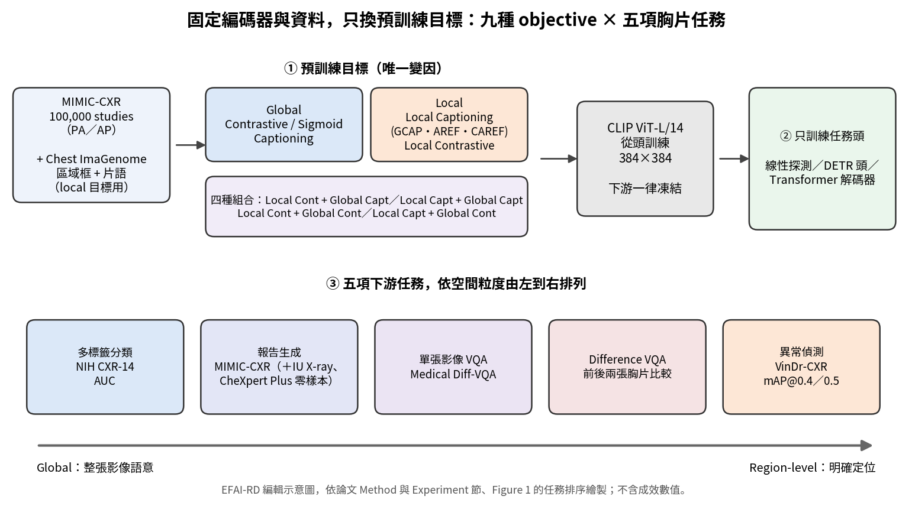

[Home](../) · [AI Papers](./)

# 胸片 VLM 的視覺編碼器該學全域還是局部？九種預訓練目標、五項任務的對照實驗

## 來源

- 團隊：Carnegie Mellon University 與 Makerere University；作者為 Denis Musinguzi、Andrew Katumba 與 Prasenjit Mitra，前兩位為通訊作者。[(ref: main p.1)](https://arxiv.org/pdf/2609.31985v1#page=1)
- 論文：*Does Vision-Language Pretraining Granularity Matter? A Controlled Evaluation of Vision-Language Objectives Across Chest X-Ray Interpretation Tasks*，arXiv v1（cs.CV），2026-09-25；含參考文獻共 8 頁、3 張圖、3 張表。[(ref: main p.1)](https://arxiv.org/pdf/2609.31985v1#page=1)
- 識別碼：[arXiv:2609.31985](https://arxiv.org/abs/2609.31985)；[DOI: 10.48550/arXiv.2609.31985](https://doi.org/10.48550/arXiv.2609.31985)。
- 全文：[arXiv PDF v1](https://arxiv.org/pdf/2609.31985v1)。
- 證據邊界：本文數值以 arXiv v1 PDF 為準；分類與偵測結果只以長條圖呈現，本文表格取自圖上標示的數值；論文所稱收錄完整成對檢定的 technical supplement 未納入本文引述。

**編輯：** Clare

這項研究把胸片視覺編碼器的架構與預訓練資料全部固定，只替換九種 vision-language 預訓練目標，檢驗「預訓練的空間粒度應該配合任務的空間粒度」這個直覺在五項任務上各自成立到什麼程度。[(ref: main Abstract)](https://arxiv.org/pdf/2609.31985v1#page=1)

## 流程

圖：本書庫依論文 Method、Experiment 節與 Figure 1 的任務排序繪製的編輯示意圖，不含成效數值。上排是唯一被改變的預訓練目標，中間的編碼器在下游一律凍結；下排五項任務由左（整張影像語意）到右（明確定位）排列。[(ref: main Figure 1)](https://arxiv.org/pdf/2609.31985v1#page=2) [(ref: main Method)](https://arxiv.org/pdf/2609.31985v1#page=3)

## 背景／問題

醫療 vision-language model（VLM）多半沿用以 contrastive learning 預訓練、再凍結使用的視覺編碼器，同一組表示被拿去做所有胸片任務。作者的主張是，編碼器抽出的表示不夠豐富、不夠貼合任務，是下游成效的主要瓶頸之一，而瓶頸的形狀取決於表示中編碼了多細的空間資訊。[(ref: main Introduction)](https://arxiv.org/pdf/2609.31985v1#page=1)

胸片判讀任務本身對空間粒度的需求差異很大。疾病分類只需要整張影像的高階語意；異常偵測與 phrase grounding 必須對準特定解剖區域；報告生成、視覺問答（VQA）與比較前後兩張影像的 Medical Difference VQA 則介於兩者之間。預訓練目標也沿著同一條軸分布：image-text contrastive 與 image captioning 屬於 global 目標，referring expression、phrase grounding 與 local contrastive 則帶有區域層級的監督。[(ref: main Introduction)](https://arxiv.org/pdf/2609.31985v1#page=1) [(ref: main Figure 1)](https://arxiv.org/pdf/2609.31985v1#page=2)

研究問題因此很具體：local 預訓練目標學到的視覺表示，是否比 global 目標更適合需要空間定位的胸片判讀，而且任務要求的粒度愈細、這個優勢愈大？[(ref: main Introduction)](https://arxiv.org/pdf/2609.31985v1#page=1)

## 方法摘要

這是一項受控比較，不提出新模型。九種預訓練目標共用同一個視覺編碼器 CLIP ViT-L/14、同一份預訓練資料，差別只在對齊目標：三種 global 單一目標（Global Contrastive、Global Sigmoid、Global Captioning）、兩種 local 單一目標（Local Captioning、Local Contrastive），以及四種 local 與 global 的兩兩組合。[(ref: main Method)](https://arxiv.org/pdf/2609.31985v1#page=3)

預訓練用 MIMIC-CXR 的 100,000 筆 study，local 目標另需 Chest ImaGenome 的區域框與報告片語。下游評估時編碼器一律凍結、只訓練任務頭，藉此把預訓練目標之外的因素排除；五項任務依粒度排列為分類、報告生成、單張影像 VQA、Difference VQA 與異常偵測。結果報告三個 seed 的平均與標準差，並以 paired bootstrap resampling 搭配 Benjamini–Hochberg FDR 校正做成對比較。[(ref: main Task Setup)](https://arxiv.org/pdf/2609.31985v1#page=4)

## 方法詳解

**Global 目標。** Global Contrastive 是 CLIP 式的 InfoNCE：同一 mini-batch 中配對的影像與報告嵌入互相拉近、未配對者推開；文字端是 6 層、8 頭、隱藏維度 512 的雙向 Transformer encoder，使用 GPT-2 tokenizer，最大長度 128。Global Sigmoid 改用 SigLIP 的 sigmoid loss，把每一組影像–文字配對當成獨立的二元分類，並以可學習的 bias 與 temperature（初始化為 −10 與 10）處理正負樣本失衡。Global Captioning 則是以影像為條件、自回歸地生成整份報告，解碼器以 cross-attention 讀取 ViT 的視覺嵌入。[(ref: main Global Alignment Objectives)](https://arxiv.org/pdf/2609.31985v1#page=3)

**Local 目標。** 區域由胸部解剖結構定義（例如 mediastinum、left lung），每個區域是一個 bounding box 配一段片語。Local Captioning 以多工方式同時訓練三個任務：Grounded Captioning（GCAP，給框生成片語）、Automatic Referring Expression（AREF，給片語預測框）與 Conditional Automatic Referring Expression（CAREF，給解剖名稱同時生成片語與框），三者都寫成自回歸序列生成並以任務提示詞區分。Local Contrastive 把對比學習從「整張影像對整份報告」下放到「區域對片語」：每段片語與其框內的 ViT patch token 對比，片語與解剖名稱相同的區域視為正樣本。[(ref: main Local Alignment Objectives)](https://arxiv.org/pdf/2609.31985v1#page=3)

**組合目標。** 四種組合都共用一個視覺編碼器，各自保留任務專屬的頭。Local Contrastive + Global Captioning、Local Contrastive + Global Contrastive 與 Local Captioning + Global Contrastive 採交替步驟訓練，讓兩個目標得到相同的更新次數；Local Captioning + Global Captioning 則多加一個生成整份報告的 CAP 任務，四個任務在同一個自回歸框架中等比例抽樣。[(ref: main Combined Local and Global Objectives)](https://arxiv.org/pdf/2609.31985v1#page=3)

**預訓練設定。** MIMIC-CXR 只保留 PA 與 AP 視角，排除缺少 findings 或 impression 的 study，並移除提及前次影像的敘述，篩選後共 242,575 筆 study；訓練集再切成互斥的兩份，100,000 筆用於預訓練、99,341 筆留給下游的報告生成與兩種 VQA。影像縮放到 384 × 384；Chest ImaGenome 中對應多個區域的片語被指派給最具體的單一解剖結構，陰性發現則指派給該病變通常出現的區域。所有編碼器都從頭訓練 50 個 epoch，AdamW、學習率 1 × 10⁻⁴、cosine annealing，取驗證損失最低的 checkpoint。[(ref: main Task Setup)](https://arxiv.org/pdf/2609.31985v1#page=4)

**下游任務頭。** 分類以 linear probing 為主要協定，在凍結特徵上訓練單層線性分類器（BCE、SGD、學習率 0.1、batch 512、30 epoch）。異常偵測在凍結特徵上接 DETR 偵測頭，損失為分類、L1 框回歸與 generalized IoU 的加權和，共 20 個 object query、15 類（14 種病變加背景）。報告生成、VQA 與 Difference VQA 都在凍結特徵上從頭訓練一個 Transformer 解碼器；Difference VQA 把前後兩張影像的特徵串接成同一個 cross-attention 記憶，並加上 frame embedding 標示來源。生成任務以 BLEU、ROUGE、RadGraph-F1 與 BERTScore 評估，分類用 AUC，偵測用 mAP@0.4 與 mAP@0.5。[(ref: main Experiment)](https://arxiv.org/pdf/2609.31985v1#page=4) [(ref: main Medical Difference VQA)](https://arxiv.org/pdf/2609.31985v1#page=5)

## 資料與實驗

下表整理論文使用的資料與角色。報告生成的解碼器只在 MIMIC-CXR 上訓練，IU X-ray 與 CheXpert Plus 只保留正面胸片，屬於零樣本評估。[(ref: main Task Setup)](https://arxiv.org/pdf/2609.31985v1#page=4) [(ref: main Visual Question Answering)](https://arxiv.org/pdf/2609.31985v1#page=5)

| 資料集 | 用途 | 規模與切分（論文所述） | 避免洩漏的處理 |
|---|---|---|---|
| MIMIC-CXR | 預訓練；報告生成訓練與測試 | 篩選後 242,575 筆 study；100,000 筆預訓練、99,341 筆下游訓練 | 兩份訓練子集互斥 |
| Chest ImaGenome | local 目標的區域監督 | 以 MIMIC-CXR 為底的區域框與報告片語 | — |
| NIH CXR-14 | 多標籤分類（linear probing） | 14 類；30,805 位病人的 94,596 張影像；官方切分 | — |
| VinDr-CXR | 異常偵測 | 18,000 張、14 種病變；15,000 訓練、3,000 測試 | — |
| Medical Difference VQA（單張影像子集） | VQA | 202,982 題訓練、25,689 題測試；六類問題 | 只保留影像未用於預訓練的題目 |
| Medical Difference VQA（difference 子集） | 前後兩張胸片比較 | 104,066 題訓練、12,934 題驗證、12,918 題測試 | 測試配對中兩張影像都不在預訓練集 |
| IU X-ray、CheXpert Plus | 報告生成零樣本評估 | 只保留正面胸片 | 解碼器未在其上訓練 |

下表完整重製論文 Table 1 的報告生成結果。所有數值為百分比，以三個 seed 的平均 ± 標準差呈現；IU X-ray 與 CheXpert Plus 為零樣本。[(ref: main Table 1)](https://arxiv.org/pdf/2609.31985v1#page=6)

| 資料集 | Encoder | BLEU-4 | ROUGE-L | RadGraph | BERTScore |
|---|---|---|---|---|---|
| MIMIC-CXR | Global Captioning | 3.08±0.03 | 15.89±0.05 | 16.24±0.09 | 84.68±0.04 |
| MIMIC-CXR | Global Contrastive | 2.92±0.03 | 15.43±0.05 | 15.35±0.09 | 84.58±0.04 |
| MIMIC-CXR | Global Sigmoid | 2.84±0.03 | 15.50±0.05 | 15.22±0.08 | 84.62±0.03 |
| MIMIC-CXR | Local Captioning | 3.12±0.05 | 16.10±0.05 | 16.34±0.09 | 84.73±0.04 |
| MIMIC-CXR | Local Contrastive | 3.16±0.03 | 16.17±0.05 | 16.24±0.08 | 84.86±0.03 |
| MIMIC-CXR | Local Contrastive + Global Captioning | 3.24±0.03 | 16.52±0.03 | 16.76±0.08 | 84.99±0.03 |
| MIMIC-CXR | Local Captioning + Global Captioning | 3.19±0.03 | 16.35±0.05 | 16.48±0.09 | 84.69±0.04 |
| MIMIC-CXR | Local Contrastive + Global Contrastive | 3.07±0.03 | 15.84±0.05 | 16.69±0.08 | 84.61±0.03 |
| MIMIC-CXR | Local Captioning + Global Contrastive | 3.26±0.03 | 16.51±0.05 | 16.59±0.09 | 84.81±0.03 |
| IU X-ray | Global Captioning | 3.06±0.16 | 16.03±0.23 | 32.79±0.46 | 84.90±0.06 |
| IU X-ray | Global Contrastive | 3.12±0.16 | 15.96±0.23 | 30.32±0.42 | 85.43±0.06 |
| IU X-ray | Global Sigmoid | 2.98±0.16 | 15.75±0.24 | 31.93±0.44 | 85.08±0.06 |
| IU X-ray | Local Captioning | 3.21±0.18 | 16.39±0.26 | 29.90±0.39 | 85.69±0.06 |
| IU X-ray | Local Contrastive | 3.15±0.16 | 16.48±0.25 | 30.70±0.41 | 85.47±0.06 |
| IU X-ray | Local Contrastive + Global Captioning | 1.98±0.15 | 15.33±0.24 | 29.59±0.40 | 85.69±0.06 |
| IU X-ray | Local Captioning + Global Captioning | 3.27±0.16 | 16.77±0.25 | 31.07±0.43 | 85.17±0.06 |
| IU X-ray | Local Contrastive + Global Contrastive | 3.09±0.21 | 15.77±0.24 | 30.52±0.41 | 85.46±0.06 |
| IU X-ray | Local Captioning + Global Contrastive | 3.21±0.16 | 16.62±0.25 | 29.38±0.40 | 85.02±0.06 |
| CheXpert Plus | Global Captioning | 2.19±0.22 | 13.65±0.45 | 18.48±0.89 | 83.71±0.12 |
| CheXpert Plus | Global Contrastive | 2.19±0.22 | 12.97±0.44 | 16.62±0.87 | 83.55±0.12 |
| CheXpert Plus | Global Sigmoid | 2.06±0.22 | 13.26±0.44 | 16.01±0.83 | 83.66±0.11 |
| CheXpert Plus | Local Captioning | 2.77±0.33 | 13.61±0.49 | 18.03±0.89 | 83.81±0.12 |
| CheXpert Plus | Local Contrastive | 2.19±0.25 | 14.03±0.44 | 17.82±0.88 | 83.97±0.11 |
| CheXpert Plus | Local Contrastive + Global Captioning | 1.98±0.21 | 13.73±0.43 | 18.15±0.92 | 83.88±0.12 |
| CheXpert Plus | Local Captioning + Global Captioning | 3.01±0.32 | 14.72±0.51 | 19.10±0.86 | 83.81±0.13 |
| CheXpert Plus | Local Contrastive + Global Contrastive | 2.20±0.22 | 14.04±0.44 | 17.85±0.88 | 83.98±0.11 |
| CheXpert Plus | Local Captioning + Global Contrastive | 1.46±0.21 | 10.91±0.43 | 12.33±0.86 | 83.02±0.11 |

下表完整重製論文 Table 2（單張影像 VQA）與 Table 3（Difference VQA）的結果，兩者都在 Medical Difference VQA 測試集上評估，數值為百分比。[(ref: main Table 2)](https://arxiv.org/pdf/2609.31985v1#page=7) [(ref: main Table 3)](https://arxiv.org/pdf/2609.31985v1#page=7)

| 任務 | Encoder | BLEU-4 | ROUGE-L | RadGraph | BERTScore |
|---|---|---|---|---|---|
| 單張影像 VQA | Global Captioning | 24.03±1.00 | 70.12±0.26 | 19.43±0.23 | 95.64±0.04 |
| 單張影像 VQA | Global Contrastive | 20.88±0.73 | 64.72±0.27 | 20.86±0.22 | 95.42±0.04 |
| 單張影像 VQA | Global Sigmoid | 21.57±0.73 | 59.64±0.29 | 21.65±0.23 | 94.89±0.05 |
| 單張影像 VQA | Local Captioning | 26.39±0.86 | 70.08±0.27 | 19.85±0.23 | 95.53±0.05 |
| 單張影像 VQA | Local Contrastive | 28.55±0.96 | 70.92±0.26 | 20.58±0.23 | 95.75±0.04 |
| 單張影像 VQA | Local Contrastive + Global Captioning | 28.53±0.89 | 71.92±0.26 | 20.62±0.23 | 95.62±0.05 |
| 單張影像 VQA | Local Captioning + Global Captioning | 25.79±0.99 | 68.94±0.27 | 20.70±0.23 | 95.63±0.05 |
| 單張影像 VQA | Local Contrastive + Global Contrastive | 25.49±0.98 | 70.28±0.26 | 21.09±0.23 | 95.38±0.05 |
| 單張影像 VQA | Local Captioning + Global Contrastive | 24.05±0.77 | 71.79±0.26 | 22.19±0.24 | 97.10±0.04 |
| Difference VQA | Global Captioning | 46.83±0.40 | 64.30±0.41 | 29.80±0.48 | 93.60±0.06 |
| Difference VQA | Global Contrastive | 44.57±0.45 | 63.80±0.40 | 29.04±0.46 | 93.48±0.06 |
| Difference VQA | Global Sigmoid | 44.90±0.40 | 63.25±0.40 | 29.22±0.47 | 93.53±0.06 |
| Difference VQA | Local Captioning | 43.68±0.38 | 63.93±0.41 | 30.31±0.45 | 93.53±0.06 |
| Difference VQA | Local Contrastive | 46.54±0.39 | 65.30±0.40 | 29.77±0.47 | 93.74±0.06 |
| Difference VQA | Local Contrastive + Global Captioning | 47.96±0.40 | 66.04±0.41 | 28.98±0.48 | 93.79±0.06 |
| Difference VQA | Local Captioning + Global Captioning | 44.91±0.40 | 64.02±0.40 | 26.77±0.45 | 93.49±0.06 |
| Difference VQA | Local Contrastive + Global Contrastive | 47.06±0.40 | 65.79±0.41 | 29.96±0.48 | 93.79±0.06 |
| Difference VQA | Local Captioning + Global Contrastive | 47.37±0.40 | 66.01±0.42 | 29.61±0.47 | 93.72±0.06 |

下表整理論文 Figure 2（NIH CXR-14 分類）與 Figure 3（VinDr-CXR 異常偵測）長條圖上標示的數值。圖上未標示標準差；「Cont」為 Contrastive、「Capt」為 Captioning。[(ref: main Figure 2)](https://arxiv.org/pdf/2609.31985v1#page=5) [(ref: main Figure 3)](https://arxiv.org/pdf/2609.31985v1#page=5)

| Encoder | 分類 AUC | 偵測 mAP@0.4 | 偵測 mAP@0.5 |
|---|---:|---:|---:|
| Global Captioning | 64.5 | 3.82 | 2.17 |
| Global Contrastive | 65.3 | 2.69 | 1.49 |
| Global Sigmoid | 65.0 | 5.02 | 3.66 |
| Local Captioning | 61.1 | 5.64 | 4.51 |
| Local Contrastive | 63.5 | 6.56 | 4.38 |
| Local Cont + Global Capt | 60.4 | 7.34 | 5.44 |
| Local Capt + Global Capt | 59.4 | 5.36 | 4.37 |
| Local Cont + Global Cont | 73.2 | 7.01 | 5.63 |
| Local Capt + Global Cont | 71.2 | 6.44 | 4.62 |

## 結果

- **兩端的任務符合粒度假說** — 在最需要空間定位的 VinDr-CXR 異常偵測上，Local Contrastive（6.56 mAP@0.4）與 Local Captioning（5.64）都高於所有 global 單一目標，其中最好的是 Global Sigmoid（5.02）；在屬於全域任務的 NIH CXR-14 分類上則反過來，Global Contrastive（65.3 AUC）領先單一目標，Global Sigmoid（65.0）與 Global Captioning（64.5）也都高於最好的 local 單一目標 Local Contrastive（63.5）。作者也指出，Local Captioning 在偵測上領先 Global Sigmoid 的幅度不大，而 Global Sigmoid 在偵測上明顯優於 Global Contrastive（2.69）與 Global Captioning（3.82）。[(ref: main Results)](https://arxiv.org/pdf/2609.31985v1#page=5)
- **中間任務上，local 目標在 NLG 指標並不吃虧** — MIMIC-CXR 報告生成中，Local Contrastive 在單一目標裡的 BLEU-4（3.16）與 ROUGE-L（16.17）最高，高於 Global Captioning（3.08 與 15.89），作者表示兩項差異在 paired bootstrap 下都達統計顯著。單張影像 VQA 的差距最大：Local Contrastive 的 BLEU-4 比 Global Sigmoid 高近 7 分（28.55 對 21.57），是全研究任兩個單一目標之間最大的差距。[(ref: main Results)](https://arxiv.org/pdf/2609.31985v1#page=5) [(ref: main Table 2)](https://arxiv.org/pdf/2609.31985v1#page=7)
- **RadGraph 沒有跟著一起動** — 同一批比較在 RadGraph-F1 上的差異普遍很小、方向也不一致；Global Captioning 在報告生成上仍具競爭力，但在 VQA 上並未穩定領先。作者據此認為 local 預訓練的好處較清楚地反映在表面文字品質，而不是臨床實體的正確性。[(ref: main Results)](https://arxiv.org/pdf/2609.31985v1#page=6)
- **captioning 與 contrastive 的優劣會隨粒度反轉** — 在 global 類別內，captioning 在多數任務上勝過 contrastive，MIMIC-CXR 的顯著性檢定顯示 Global Captioning 在所有指標上都顯著優於 Global Contrastive 與 Global Sigmoid；在 local 類別內則反過來，作者指出 Local Contrastive 在多數任務上勝過 Local Captioning。逐欄核對，這個反轉在偵測 mAP@0.4（6.56 對 5.64）、分類（63.5 對 61.1）與兩種 VQA 的 BLEU-4 上成立，但偵測 mAP@0.5（4.38 對 4.51）與 Difference VQA 的 RadGraph（29.77 對 30.31）是 Local Captioning 略高。[(ref: main Results)](https://arxiv.org/pdf/2609.31985v1#page=6)
- **混合 captioning 與 contrastive 的組合最強，但不是處處最強** — 分類上兩種含 Global Contrastive 的組合（73.2 與 71.2 AUC）大幅領先所有單一目標；MIMIC-CXR 報告生成與 Difference VQA 的 BLEU-4／ROUGE-L 由 Local Contrastive + Global Captioning 或 Local Captioning + Global Contrastive 領先。Local Captioning + Global Captioning 的分類 AUC 是九者最低（59.4），MIMIC-CXR RadGraph 也是四種組合中最低（16.48），卻在零樣本的 IU X-ray 與 CheXpert Plus 報告生成中是組合裡最好的，作者解讀為純 captioning 監督最能泛化到分布外資料。[(ref: main Figure 2)](https://arxiv.org/pdf/2609.31985v1#page=5) [(ref: main Mixing captioning and contrastive objectives)](https://arxiv.org/pdf/2609.31985v1#page=7)
- **零樣本資料集上排名並不穩定** — 同一個 Local Contrastive + Global Captioning 在 MIMIC-CXR 的 BLEU-4 是所有編碼器中第二高（3.24），到 IU X-ray 與 CheXpert Plus 都降到 1.98；Local Captioning + Global Contrastive 在 CheXpert Plus 的 BLEU-4 只有 1.46、RadGraph 12.33，是該資料集最低。[(ref: main Table 1)](https://arxiv.org/pdf/2609.31985v1#page=6)

作者的總結是：粒度匹配的假說只得到部分支持，沒有單一目標在所有任務上都最佳，下游成效取決於目標類型、粒度與任務三者的交互作用。[(ref: main Conclusion)](https://arxiv.org/pdf/2609.31985v1#page=7)

## 限制

- 作者明言結論只適用於凍結編碼器的遷移設定；若改為全模型微調，各目標的相對排序可能改變。[(ref: main Limitations)](https://arxiv.org/pdf/2609.31985v1#page=7)
- 只測試單一架構（CLIP ViT-L/14）與單一預訓練規模，中間粒度的任務多數也來自 MIMIC-CXR，分布外的證據有限。[(ref: main Limitations)](https://arxiv.org/pdf/2609.31985v1#page=7)
- local 目標需要成對的區域框與片語，這類密集標註昂貴，多數資料集與影像模態都沒有，限制了 local 預訓練的適用場景。[(ref: main Limitations)](https://arxiv.org/pdf/2609.31985v1#page=7)
- 本書庫補充：絕對數值偏低，比較的是相對排序而非可用性。所有編碼器都從頭訓練、下游只訓練任務頭，NIH CXR-14 的 AUC 落在 59.4 至 73.2、VinDr-CXR 的 mAP@0.4 不超過 7.34；這些數字適合比較預訓練目標，不應解讀為臨床可用的偵測或分類效能。[(ref: main Figure 2)](https://arxiv.org/pdf/2609.31985v1#page=5) [(ref: main Figure 3)](https://arxiv.org/pdf/2609.31985v1#page=5)
- 本書庫補充：分類與偵測只有圖上數值、未附標準差，顯著性檢定的完整結果放在 technical supplement；本文只轉述正文明確指出達顯著的比較。論文實驗節有一處寫作評估「六項」下游任務，但任務描述、結果與結論都是五項，本文依五項處理。[(ref: main Experiment)](https://arxiv.org/pdf/2609.31985v1#page=4)
- 本書庫補充：生成任務的評估全部是自動指標，沒有放射科醫師評讀；作者在結果中也觀察到 NLG 指標與 RadGraph-F1 的方向不一致。[(ref: main Results)](https://arxiv.org/pdf/2609.31985v1#page=6)

## 與書庫其他文章的關係

MAIRA-2 把區域定位直接寫進報告生成的輸出與評分，本研究則把定位訊號放在上游的預訓練目標，檢驗它對凍結編碼器的下游任務各有多少幫助: [MAIRA-2：胸腔 X 光報告的文字正確，定位也正確嗎？](2026-09-15-maira-2-grounded-reporting.md)

本研究的報告生成結果中，BLEU／ROUGE 與 RadGraph-F1 的排序並不一致，正是該研究「語意相似度不能代替臨床保真度」的另一個實例: [報告讀起來很順，就代表寫對了嗎？RadVLM 的分節評估](2026-09-22-radvlm-section-based-report-evaluation.md)

兩篇都在追問胸片視覺編碼器的分數從何而來：該研究改換評估條件、檢驗現成醫療 VLM 的結論是否還站得住，本研究則固定評估條件、只改換預訓練目標: [稽核胸片結核篩檢的醫療 VLM：換一個評估條件，哪一種結論還站得住？](2026-09-21-cxr-tb-vlm-portability-audit.md)

## 實務的啟發

第一，挑選或自訓胸片編碼器時，先講清楚下游任務落在粒度光譜的哪一端。論文的結果顯示，同一個編碼器在偵測上領先、在分類上落後是常態而非例外；只看一個彙總排行榜來選編碼器，很可能選到與目標任務粒度不合的那一個。本書庫的解讀是，若院內需求以病灶定位為主，值得優先評估帶有區域監督的預訓練；若以篩檢分類為主，含 global contrastive 的組合在本研究中表現最好。

第二，評估報告生成時，至少同時看一個 NLG 指標與一個臨床實體指標。本研究中 local 目標在 BLEU-4／ROUGE-L 上的優勢，並沒有穩定轉成 RadGraph-F1 的優勢；只報 BLEU 的比較，可能把「句子寫得像報告」誤讀成「臨床內容寫對了」。

第三，零樣本資料集要當成獨立一軸，而不是附帶的一欄。同一個組合在 MIMIC-CXR 名列前茅、換到 IU X-ray 與 CheXpert Plus 就掉到末段；作為院外部署前的參考，分布外的排名比分布內的第一名更有資訊量。

最後，這項研究的價值在於受控設計，而不是絕對分數。所有編碼器都從頭訓練、下游凍結，分類 AUC 與偵測 mAP 都遠低於實用水準；它回答的是「換哪一種預訓練目標會往哪個方向移動」，不能直接拿來推論某個現成醫療 VLM 在院內的表現。

## References

- `main`：[Does Vision-Language Pretraining Granularity Matter? 論文 PDF v1](https://arxiv.org/pdf/2609.31985v1)；本文使用 [p.1（作者、Abstract、Introduction）](https://arxiv.org/pdf/2609.31985v1#page=1)、[p.2（Introduction、Figure 1）](https://arxiv.org/pdf/2609.31985v1#page=2)、[p.3（Method：Global、Local 與 Combined 目標）](https://arxiv.org/pdf/2609.31985v1#page=3)、[p.4（Experiment、Task Setup、下游任務設定）](https://arxiv.org/pdf/2609.31985v1#page=4)、[p.5（Figure 2、Figure 3、VQA 與 Difference VQA 設定、Results）](https://arxiv.org/pdf/2609.31985v1#page=5)、[p.6（Table 1、Results）](https://arxiv.org/pdf/2609.31985v1#page=6)、[p.7（Table 2、Table 3、Limitations、Conclusion）](https://arxiv.org/pdf/2609.31985v1#page=7)。
- `abstract`：[arXiv:2609.31985](https://arxiv.org/abs/2609.31985)。
- `doi`：[10.48550/arXiv.2609.31985](https://doi.org/10.48550/arXiv.2609.31985)。

[Home](../) · [AI Papers](./)
