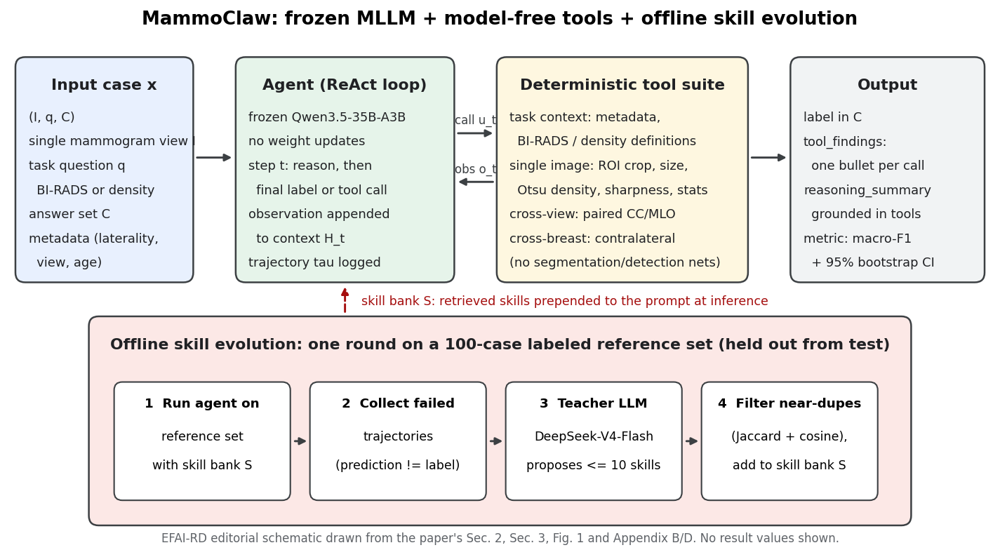

[Home](../) · [AI Papers](./)

# 工具給齊了，凍結的 MLLM 就會讀乳房攝影嗎？MammoClaw 用失敗軌跡演化出的技能補上「怎麼用」

## 來源

- 團隊：單一作者 Krishna Kanth Nakka；論文首頁只列德國巴伐利亞邦慕尼黑與個人電子郵件，未標示所屬機構。[(ref: main p.1)](https://arxiv.org/pdf/2609.31789v1#page=1)
- 論文：*MammoClaw: Towards Skill-Evolving Agent Harness for Breast Cancer Mammography Analysis*，arXiv v1（eess.IV），2026-09-25；含參考文獻與附錄共 27 頁。[(ref: main p.1)](https://arxiv.org/pdf/2609.31789v1#page=1)
- 識別碼：[arXiv:2609.31789](https://arxiv.org/abs/2609.31789)；[DOI: 10.48550/arXiv.2609.31789](https://doi.org/10.48550/arXiv.2609.31789)。
- 全文：[arXiv PDF v1](https://arxiv.org/pdf/2609.31789v1)；作者公開的程式碼頁：[krishnakanthnakka.github.io/mammoclaw](https://krishnakanthnakka.github.io/mammoclaw)。
- 證據邊界：本文數值以 arXiv v1 PDF 為準；Figure 2、Figure 3 的數值取自長條圖上的標示；乳房密度任務在 PDF 中只有組間差值與檢定結果，沒有各組的絕對 macro-F1，本文不補推。

**編輯：** Clare

MammoClaw 讓一個不更新權重的多模態大型語言模型（multimodal large language model，MLLM）在乳房攝影上一邊推理一邊呼叫確定性工具，結果顯示光給工具並不會提升 BI-RADS 判讀的 macro-F1，從失敗軌跡蒸餾出的文字技能才帶來統計顯著的改善，但絕對分數仍然很低。[(ref: main Abstract)](https://arxiv.org/pdf/2609.31789v1#page=1) [(ref: main Table 1)](https://arxiv.org/pdf/2609.31789v1#page=6)

## 流程

圖：本書庫依論文 Section 2、Section 3、Figure 1 與 Appendix B、D 繪製的編輯示意圖，不含成效數值。上排是推論時的 ReAct 迴圈：凍結的 MLLM 每一步決定直接作答或呼叫工具，工具回傳的文字或影像接回 context；下排是離線的技能演化，只用與測試集分開的參考集。[(ref: main Figure 1)](https://arxiv.org/pdf/2609.31789v1#page=3) [(ref: main §2)](https://arxiv.org/pdf/2609.31789v1#page=3) [(ref: main Appendix B)](https://arxiv.org/pdf/2609.31789v1#page=12)

## 背景／問題

經醫療資料微調的 MLLM 已能處理多種醫學影像任務，乳房攝影也包括在內；但這些能力多半來自 supervised fine-tuning 與 reinforcement learning 等後訓練流程，需要大量標註資料、運算資源與專家撰寫的推理軌跡，換一個任務或換一個主幹模型就得重來一次。[(ref: main §1)](https://arxiv.org/pdf/2609.31789v1#page=1)

另一條路是不動權重，讓凍結的通用 MLLM 在推論時以 agent 的方式調用領域工具。作者指出 RadAgent、ClinSeekAgent 等框架已在胸部 CT 與其他臨床場景嘗試這種做法，但就其所知，乳房攝影上幾乎沒有人做過。[(ref: main §1)](https://arxiv.org/pdf/2609.31789v1#page=1) [(ref: main §1, p.2)](https://arxiv.org/pdf/2609.31789v1#page=2)

作者的初步觀察讓問題更具體：把整套工具交給凍結的代理後，BI-RADS macro-F1 從 0.108 變成 0.106，幾乎沒有變化。困難因此不在「有沒有工具」，而在代理何時用、怎麼用工具；研究問題於是成為：能不能把過去失敗的經驗整理成可重複使用的指引，在不更新權重的前提下改善工具使用與判讀。[(ref: main §1, p.2)](https://arxiv.org/pdf/2609.31789v1#page=2)

## 方法摘要

MammoClaw 由三個部分組成。第一是遵循 ReAct 的代理迴圈：凍結的 MLLM（實驗中為 Qwen3.5-35B-A3B）在每一步讀取目前的 context，決定輸出最終答案或呼叫一個工具，工具的觀察結果再接回 context，整段推理與工具互動被記錄成 trajectory。[(ref: main §2.1)](https://arxiv.org/pdf/2609.31789v1#page=3) [(ref: main §2.1, p.4)](https://arxiv.org/pdf/2609.31789v1#page=4)

第二是一組不含任何學習模組的確定性工具，涵蓋任務脈絡（中繼資料、BI-RADS 與密度定義）、單張影像檢視與量測、同側另一投照角度的對照，以及對側乳房的對照，刻意不使用分割或偵測網路。[(ref: main §2.2)](https://arxiv.org/pdf/2609.31789v1#page=4)

第三是離線的 skill evolution：在有標註的參考集上執行代理，蒐集答錯的軌跡，交給 teacher LLM 歸納成可重複使用的文字技能，去重後存入 skill bank；推論時把相關技能放進系統提示詞。技能不是可訓練參數，也不做任何任務專屬的模型更新。[(ref: main §2.3)](https://arxiv.org/pdf/2609.31789v1#page=5)

評估使用 Mammo-Bench 的兩項任務：KAU-BCMD 上的 BI-RADS 判讀與 DMID 上的乳房密度分級，比較 no-tools、tools-only、tools + skills 三種設定，指標為 macro-F1 與 95% bootstrap 信賴區間。[(ref: main §3)](https://arxiv.org/pdf/2609.31789v1#page=5)

## 方法詳解

**代理迴圈。** 一個病例表示為 x = (I, q, C)：I 是乳房攝影影像，q 是任務問題，C 是候選答案集合。推論開始前，retriever 依問題從 skill bank 取出技能，與病例一起放進初始 context。第 t 步時，MLLM 根據前一步的 context 輸出最終預測，或選擇一個工具與其參數（例如 ROI 座標）；工具執行後的觀察被串接到 context，整段 (context, 呼叫, 觀察) 序列就是後續演化要用的 trajectory。[(ref: main §2.1)](https://arxiv.org/pdf/2609.31789v1#page=4)

**工具組。** Appendix D 列出九個工具，各附一筆實際軌跡中的呼叫範例。[(ref: main Appendix D)](https://arxiv.org/pdf/2609.31789v1#page=13) [(ref: main Appendix D, p.14)](https://arxiv.org/pdf/2609.31789v1#page=14) [(ref: main Appendix D, p.15)](https://arxiv.org/pdf/2609.31789v1#page=15)

| 類別 | 工具 | 回傳內容 |
|---|---|---|
| Task context | `inspect_current_example` | 病例中繼資料：來源資料集、左右側、投照角度、年齡、是否有配對影像 |
| Task context | `retrieve_knowledge` | 任務定義；BI-RADS 任務回傳 0 至 6 類（含 4A／4B／4C）的完整定義 |
| Single-image inspection | `inspect_mammogram_roi` | 以 0–1000 正規化座標裁切並放大可疑區域，可選擇增強對比 |
| Single-image measurement | `measure_finding_size` | 在裁切圖上畫出量測寬高的標尺 |
| Single-image density | `estimate_breast_density` | 以 dual Otsu thresholding 估算纖維腺體比例，並附註不可只憑百分比判 A／B／C／D |
| Single-image quality | `measure_image_sharpness` | Laplacian variance 與 Tenengrad 梯度能量的清晰度評分 |
| Single-image texture | `compute_tissue_statistics` | 以 Otsu 去除背景後的強度平均、標準差、entropy 與 skewness |
| Cross-view comparison | `inspect_paired_mammogram_view` | 同側 CC 與 MLO 並排的影像 |
| Cross-breast comparison | `inspect_contralateral_breast` | 同一受檢者、同一投照角度的對側乳房並排影像 |

工具只負責取得證據，不做判讀：影像類工具回傳的是裁切或並排的圖，由 MLLM 自己看圖推理。系統提示詞另外限制 `retrieve_knowledge` 最多呼叫一次、`inspect_mammogram_roi` 最多兩次，要求「呼叫工具前的觀察只能當假設」，並禁止從檔案路徑、資料集名稱或隱藏中繼資料推測答案。[(ref: main Appendix F.1)](https://arxiv.org/pdf/2609.31789v1#page=17) [(ref: main Appendix F.1, p.18)](https://arxiv.org/pdf/2609.31789v1#page=18)

**輸出格式。** 代理最後必須回傳嚴格的 JSON：`label` 必須完全等於某個候選答案；`tool_findings` 依呼叫順序、每次工具呼叫寫一條重點；`reasoning_summary` 用二到五句說明工具結果如何支持答案，且不得引入 `tool_findings` 之外的觀察。[(ref: main Appendix F.1, p.18)](https://arxiv.org/pdf/2609.31789v1#page=18) [(ref: main Appendix F.1, p.19)](https://arxiv.org/pdf/2609.31789v1#page=19)

**技能演化。** 初始 skill bank 為空。在第 r 輪，代理以當下的 skill bank 跑完參考集，預測錯誤的軌跡全部交給 teacher model 一起分析，產生候選技能；經語意相似度過濾掉重複者，其餘加入 skill bank。實作上 teacher 為 DeepSeek-V4-Flash，只演化一輪、每輪最多產生 10 個新技能、每次最多送入 50 條失敗軌跡；去重同時使用技能名稱的 token Jaccard 相似度與全文 embedding 的 cosine 相似度；推論時不另做篩選，與任務相關的技能全部注入 context。兩個模型都透過 OpenRouter 介面呼叫。[(ref: main §2.3)](https://arxiv.org/pdf/2609.31789v1#page=5) [(ref: main Appendix B.2)](https://arxiv.org/pdf/2609.31789v1#page=12)

**Teacher 的提示詞。** teacher 被要求找出跨多個病例的根本失敗原因（證據蒐集、解讀、定位、工具使用、驗證或校準），只在既有技能沒涵蓋時才新增；技能不得寫入個案修正、病人細節、資料集捷徑、診斷閾值或標籤對應。每個技能包含名稱、一句描述、類別，以及「適用時機與步驟」和「anti-pattern」兩段 markdown。[(ref: main Appendix F.2)](https://arxiv.org/pdf/2609.31789v1#page=19) [(ref: main Appendix F.2, p.20)](https://arxiv.org/pdf/2609.31789v1#page=20)

**演化出的技能。** Appendix G 列出 BI-RADS 任務的九個技能，例如 `verify-suspicious-findings-with-multi-view-comparison`（判定可疑前先看配對投照與對側）、`calibrate-birads-using-feature-checklist`（以特徵清單避免直接跳到 1 或 5 類）、`avoid-characterizing-findings-without-tool-confirmation`（呼叫工具前不得斷言「spiculated mass」等描述）與 `use-uncertainty-resolution-sequence`（ROI → 配對投照 → 對側 → 必要時查定義）。作者說明這些技能描述的是推理策略，而不是明確的工具選擇規則。[(ref: main Appendix G)](https://arxiv.org/pdf/2609.31789v1#page=20) [(ref: main Appendix G, p.21)](https://arxiv.org/pdf/2609.31789v1#page=21) [(ref: main Appendix G, p.23)](https://arxiv.org/pdf/2609.31789v1#page=23) [(ref: main Appendix G, p.25)](https://arxiv.org/pdf/2609.31789v1#page=25) [(ref: main Appendix G, p.26)](https://arxiv.org/pdf/2609.31789v1#page=26) [(ref: main §3.1, p.7)](https://arxiv.org/pdf/2609.31789v1#page=7)

## 資料與實驗

兩項任務都依 Mammo-Bench 的協定，把各來源資料集隨機切成 80% 訓練、20% 評估；技能演化用的參考集是從訓練部分隨機抽出的 100 例。KAU-BCMD 提供同側 CC／MLO 配對與對側影像，可以用到全部工具；DMID 只有單一投照，配對與對側工具無從發揮。[(ref: main §3)](https://arxiv.org/pdf/2609.31789v1#page=5) [(ref: main Appendix B.1)](https://arxiv.org/pdf/2609.31789v1#page=12)

| 任務 | 資料集 | 評估集 | 評估集類別分布 | 參考集（100 例）類別分布 | 可用影像 |
|---|---|---|---|---|---|
| BI-RADS 判讀 | KAU-BCMD | 448 例 | 1 類 367、3 類 59、4 類 18、5 類 4；無 0、2、6 類 | 1 類 83、3 類 14、5 類 3 | 同側 CC／MLO 配對＋對側 |
| 乳房密度分級 | DMID | 108 例 | A 18、B 39、C 42、D 9 | A 18、B 39、C 38、D 5 | 僅單一投照 |

統計檢定有兩種：以 McNemar's test 比較成對預測的正確與否，以及以 5,000 次 paired bootstrap 比較 macro-F1；每項任務內的三組兩兩比較都做 Holm–Bonferroni 校正。[(ref: main Appendix C)](https://arxiv.org/pdf/2609.31789v1#page=12)

下表重製論文 Table 1（BI-RADS，KAU-BCMD）。[(ref: main Table 1)](https://arxiv.org/pdf/2609.31789v1#page=6)

| Method | Tools | Skills | Macro-F1 [95% CI] |
|---|---|---|---|
| Baseline | × | × | 0.108 [0.103, 0.113] |
| MammoClaw | ✓ | × | 0.106 [0.093, 0.122] |
| MammoClaw | ✓ | ✓ | 0.148 [0.121, 0.180] |

下表重製論文 Table 2 的成對比較；p 值皆經 Holm 校正，「McNemar (acc.)」比較的是逐例預測的正確與否。[(ref: main Table 2)](https://arxiv.org/pdf/2609.31789v1#page=13)

| Task | Comparison | ΔMacro-F1 | Boot. p (Holm) | McNemar (acc.) p (Holm) |
|---|---|---|---|---|
| BI-RADS | No tools → Tools | −0.002 | 0.70 | 0.0017 |
| BI-RADS | No tools → Skills | +0.040 | < 0.001 | < 0.001 |
| BI-RADS | Tools → Skills | +0.043 | < 0.001 | < 0.001 |
| Density | No tools → Tools | +0.019 | 0.70 | 0.062 |
| Density | No tools → Skills | +0.093 | 0.18 | < 0.001 |
| Density | Tools → Skills | +0.074 | 0.017 | 0.062 |

下表整理 Figure 2 長條圖上標示的 BI-RADS 任務工具呼叫總次數（448 例合計），工具名稱沿用圖上的縮寫標籤。[(ref: main Figure 2)](https://arxiv.org/pdf/2609.31789v1#page=6)

| 工具（圖上標籤） | 無技能 | 有技能 |
|---|---:|---:|
| Inspect ROI | 391 | 584 |
| Paired view | 419 | 457 |
| Current exam | 377 | 448 |
| Contralateral | 276 | 456 |
| Breast mask | 52 | 57 |
| Knowledge | 95 | 3 |
| Image sharp. | 50 | 21 |
| Density | 36 | 1 |

其餘四個標籤（Finding size、Tissue stats、Geometry、Density w/ mask）在兩種設定下都只有 0 至 3 次。下表整理 Figure 3 的每例工具呼叫次數分布（BI-RADS，448 例）。[(ref: main Figure 2)](https://arxiv.org/pdf/2609.31789v1#page=6) [(ref: main Figure 3)](https://arxiv.org/pdf/2609.31789v1#page=7)

| 每例呼叫次數 | 0 | 1 | 2 | 3 | 4 | 5 | 6 | 7 | 8 | 9 |
|---|---:|---:|---:|---:|---:|---:|---:|---:|---:|---:|
| 無技能（例數） | 5 | 11 | 40 | 127 | 171 | 74 | 18 | 2 | 0 | 0 |
| 有技能（例數） | 0 | 1 | 1 | 122 | 139 | 101 | 16 | 60 | 5 | 3 |

## 結果

- **工具本身沒有提升 macro-F1** — 加入工具後，BI-RADS macro-F1 從 0.108 變為 0.106（bootstrap p = 0.70），乳房密度的變化 +0.019 同樣不顯著（p = 0.70）。值得注意的是，BI-RADS 的 McNemar's test 在這組比較上顯著（p = 0.0017），表示加入工具確實改變了逐例預測的對錯，只是沒有轉換成 macro-F1 的改善。[(ref: main §3.1)](https://arxiv.org/pdf/2609.31789v1#page=6) [(ref: main Appendix C)](https://arxiv.org/pdf/2609.31789v1#page=13)
- **技能在 BI-RADS 上帶來顯著改善** — tools + skills 的 BI-RADS macro-F1 為 0.148 [0.121, 0.180]，相對 tools-only 與 no-tools 的 bootstrap 與 McNemar 檢定都達 p < 0.001。作者同時說明，這不代表演化出的技能本身編碼了經臨床驗證的推理。[(ref: main §3.1)](https://arxiv.org/pdf/2609.31789v1#page=6) [(ref: main Appendix C)](https://arxiv.org/pdf/2609.31789v1#page=13)
- **乳房密度的證據較弱** — 技能相對 tools-only 提升 0.074，bootstrap p = 0.017；相對 no-tools 提升 0.093，但 bootstrap p = 0.18 不顯著，只有 McNemar 達 p < 0.001。在只有 108 例、且無法使用配對與對側工具的資料集上，兩種檢定給出的訊號並不一致。[(ref: main Appendix C)](https://arxiv.org/pdf/2609.31789v1#page=13)
- **技能改變了代理怎麼找證據** — 有技能時，ROI 檢視（391 → 584 次）與對側比較（276 → 456 次）明顯增加，`retrieve_knowledge` 的呼叫則從 95 次降到 3 次；作者推測技能提供了代理原本要靠查詢定義取得的部分指引。每例呼叫 7 次以上的病例從 2 例增加到 68 例，呼叫 2 次以下的病例從 56 例降到 2 例。[(ref: main §3.1, p.7)](https://arxiv.org/pdf/2609.31789v1#page=7) [(ref: main Figure 2)](https://arxiv.org/pdf/2609.31789v1#page=6) [(ref: main Figure 3)](https://arxiv.org/pdf/2609.31789v1#page=7)
- **工具用得多不等於判得準** — 作者明言，工具使用量的增加與預測品質之間的關係仍是未解問題；論文沒有分析多呼叫的病例是否就是答對的病例。[(ref: main §3.1, p.7)](https://arxiv.org/pdf/2609.31789v1#page=7)
- **軌跡可以逐步檢視** — Figure 4 與 Figure 5 各展示一筆與標準答案一致的軌跡（BI-RADS 3 與 BI-RADS 4）：代理先以 ROI 定位可疑處，再以配對投照確認不是重疊假影、以對側排除兩側對稱的正常變異，最後才給類別。這兩筆是作者挑選的代表性正確案例，並非錯誤分析。[(ref: main Figure 4)](https://arxiv.org/pdf/2609.31789v1#page=8) [(ref: main Figure 5)](https://arxiv.org/pdf/2609.31789v1#page=17)

作者把這項工作定位為探索性研究，而非完整的解決方案：失敗驅動的技能演化是值得追下去的方向，MammoClaw 則可作為研究乳房攝影專用工具與自我演化代理的測試平台。[(ref: main §4)](https://arxiv.org/pdf/2609.31789v1#page=7) [(ref: main §4, p.9)](https://arxiv.org/pdf/2609.31789v1#page=9)

## 限制

- 作者列出的限制：每項任務只用一個資料集、一個凍結主幹；Qwen3.5-35B-A3B 在 no-tools 設定下表現就不高，可能限制了能觀察到的代理增益。[(ref: main Appendix A)](https://arxiv.org/pdf/2609.31789v1#page=11)
- 作者列出的限制：技能由有標註的參考集產生，沒有經臨床專家獨立驗證；其臨床相關性、穩健性與跨資料集可遷移性都未知。[(ref: main Appendix A)](https://arxiv.org/pdf/2609.31789v1#page=11)
- 作者列出的限制：系統提示詞、工具描述、失敗軌跡數量、teacher LLM、技能驗證與檢索機制都沒有做消融，因此無法區分改善是來自技能內容，還是來自提示詞或工具互動模式的改變；技能演化也只做一輪、參考集只有 100 例。[(ref: main Appendix A)](https://arxiv.org/pdf/2609.31789v1#page=11)
- 本書庫補充：絕對分數可能低於「全部猜最常見類別」的簡單基準。論文沒有說明 macro-F1 是對哪些類別取平均；本書庫依附錄 B.1 的評估集分布試算，若對評估集出現的四個類別平均，永遠回答 BI-RADS 1 的分類器 macro-F1 約為 0.225，若對候選答案的七個類別（0 至 6）平均約為 0.129，兩者都高於 tools + skills 的 0.148。這只是依類別分布的推算，不是論文報告的數字，但足以說明本研究比較的是三種設定之間的相對變化，而不是可用的判讀能力。[(ref: main Appendix B.1)](https://arxiv.org/pdf/2609.31789v1#page=12) [(ref: main Table 1)](https://arxiv.org/pdf/2609.31789v1#page=6)
- 本書庫補充：BI-RADS 參考集只有 1、3、5 類，沒有任何 4 類病例，但評估集有 18 例 4 類，演化出的技能也多處描述 4 類的判定條件；這些內容較可能來自 teacher 模型的既有知識，而不是參考集中的失敗。論文沒有報告各類別的 F1 或混淆矩陣，無法判斷改善集中在哪些類別。[(ref: main Appendix B.1)](https://arxiv.org/pdf/2609.31789v1#page=12) [(ref: main Appendix G, p.23)](https://arxiv.org/pdf/2609.31789v1#page=23)
- 本書庫補充：PDF 內有幾處前後不一致。Table 1 只有標為「(a) BI-RADS」的部分，乳房密度的絕對 macro-F1 沒有出現；正文說 Figure 3 涵蓋 BI-RADS 與乳房密度兩項任務，圖說卻只寫 BI-RADS；Figure 2 出現 Breast mask、Geometry、Density w/ mask 等標籤，Appendix D 的九個工具中沒有對應說明；Figure 1 把代理標為「Frozen Medical MLLM」，實驗使用的 Qwen3.5-35B-A3B 則是通用模型。本文依實驗節與附錄的描述處理。[(ref: main Table 1)](https://arxiv.org/pdf/2609.31789v1#page=6) [(ref: main Figure 3)](https://arxiv.org/pdf/2609.31789v1#page=7) [(ref: main Figure 1)](https://arxiv.org/pdf/2609.31789v1#page=3)

## 與書庫其他文章的關係

MedRAX 把分類、分割、定位等既有的影像模型包成工具交給代理調用，MammoClaw 則刻意只給不含學習模組的確定性工具，並發現光給工具不會提升 macro-F1，兩篇一起說明工具代理的效益同時取決於工具本身與代理怎麼用它: [MedRAX：工具代理如何改善胸腔 X 光問答？](2026-09-15-medrax-chest-xray-agent.md)

AgentRx 顯示增加代理角色與對話不會自動改善 ICU 預測，MammoClaw 在乳房攝影上得到相近的訊號：增加工具本身不會改善 macro-F1，有差別的是從失敗軌跡蒸餾出的使用指引: [AgentRx：多模態 ICU 預測裡，多代理真的比單一代理好嗎？](2026-09-17-agentrx-multimodal-clinical-prediction.md)

VoxelSage 同樣只給代理確定性工具，但沒有做「不給工具」的對照，本篇的 no-tools／tools-only／tools + skills 三組設計正好說明它缺了哪一組實驗: [量測交給程式、LLM 只負責調度：VoxelSage 的肝腫瘤 CT 工具代理，證據停在系統測試與模擬器](2026-10-06-voxelsage-liver-ct-tool-agent.md)

## 實務的啟發

第一，評估工具代理時，「加工具」與「教代理用工具」要拆成兩個實驗。本研究的 tools-only 設定改變了逐例預測（McNemar 顯著），卻沒有改變 macro-F1；如果只比較「有代理」與「沒代理」兩組，會看不出效益究竟來自哪一層。本書庫的解讀是，任何宣稱 agent 提升影像判讀的研究，都值得先找 tools-only 這一組對照。

第二，技能演化這類做法的吸引力在於低成本：不更新權重、只用 100 例參考集、技能是人讀得懂的文字。這也代表技能可以被放射科醫師逐條審閱、修改或刪除，是比微調更容易稽核的調整方式；但本研究沒有做這一步，技能中的 BI-RADS 判定條件是否符合臨床指引，仍須專家逐條確認後才適合沿用。

第三，看到 macro-F1 時，先對照類別分布算一下簡單基準。BI-RADS 評估集有八成以上是 1 類，0.108 到 0.148 的改善在統計上顯著，但仍可能低於全部猜 1 類的分數；在類別極度不平衡的乳房攝影資料上，只報 macro-F1 而不附各類別結果，很難判斷代理是否學會辨識可疑病灶。

最後，可檢視的軌跡是這類框架最實際的產出。強制每次工具呼叫都寫進 `tool_findings`、推理摘要只能引用工具結果，讓錯誤可以追到是哪一步看錯或漏看；若要在院內測試類似流程，本書庫建議先用軌跡做錯誤分析，而不是先追整體分數。

## References

- `main`：[MammoClaw: Towards Skill-Evolving Agent Harness for Breast Cancer Mammography Analysis 論文 PDF v1](https://arxiv.org/pdf/2609.31789v1)；本文使用 [p.1（作者、Abstract、Introduction）](https://arxiv.org/pdf/2609.31789v1#page=1)、[p.2（Introduction、貢獻）](https://arxiv.org/pdf/2609.31789v1#page=2)、[p.3（Figure 1、§2、§2.1）](https://arxiv.org/pdf/2609.31789v1#page=3)、[p.4（§2.1 代理迴圈、§2.2 工具）](https://arxiv.org/pdf/2609.31789v1#page=4)、[p.5（§2.3 技能演化、§3 實作設定）](https://arxiv.org/pdf/2609.31789v1#page=5)、[p.6（Table 1、§3.1、Figure 2）](https://arxiv.org/pdf/2609.31789v1#page=6)、[p.7（§3.1、Figure 3、§4）](https://arxiv.org/pdf/2609.31789v1#page=7)、[p.8（Figure 4）](https://arxiv.org/pdf/2609.31789v1#page=8)、[p.9（§4）](https://arxiv.org/pdf/2609.31789v1#page=9)、[p.11（Appendix A）](https://arxiv.org/pdf/2609.31789v1#page=11)、[p.12（Appendix B、C）](https://arxiv.org/pdf/2609.31789v1#page=12)、[p.13（Appendix C、Table 2、Appendix D）](https://arxiv.org/pdf/2609.31789v1#page=13)、[p.14–15（Appendix D）](https://arxiv.org/pdf/2609.31789v1#page=14)、[p.17（Figure 5、Appendix F.1）](https://arxiv.org/pdf/2609.31789v1#page=17)、[p.18–19（Appendix F.1、F.2）](https://arxiv.org/pdf/2609.31789v1#page=18)、[p.20–26（Appendix F.2、G）](https://arxiv.org/pdf/2609.31789v1#page=20)。
- `abstract`：[arXiv:2609.31789](https://arxiv.org/abs/2609.31789)。
- `doi`：[10.48550/arXiv.2609.31789](https://doi.org/10.48550/arXiv.2609.31789)。
- `code`：[MammoClaw 專案頁](https://krishnakanthnakka.github.io/mammoclaw)。

[Home](../) · [AI Papers](./)
