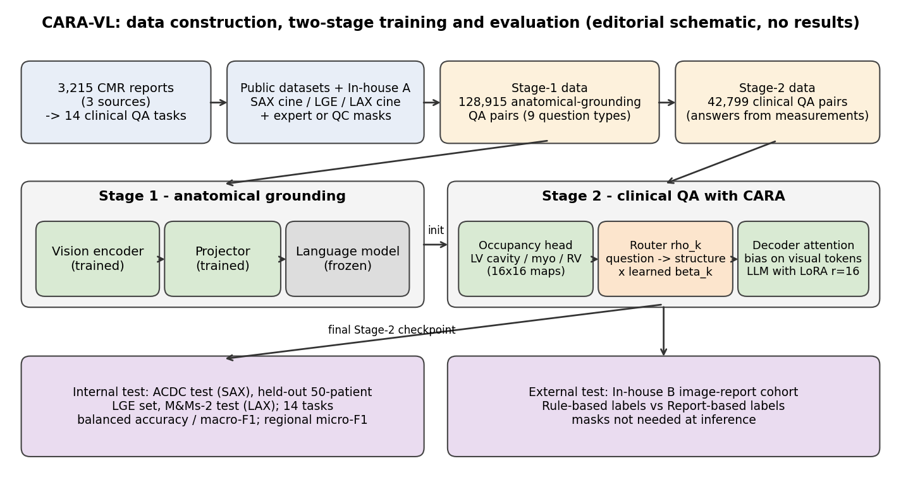

[Home](../) · [AI Papers](./)

# 先教 VLM 看對地方：CARA-VL 用解剖結構導引注意力，心臟 MRI 問答能走多遠？

## 來源

- 團隊：United Imaging Intelligence（Boston, MA），以及 Rutgers University、University of Texas Southwestern Medical Center 與 Duke University；共 11 位作者，第一作者為 Bangwei Guo（Rutgers University），其餘作者包括 Xiao Chen、Boris Mailhe、Jia Yao、Yiqing Wang、Ankush Mukherjee、Yikang Liu、Zheyuan Zhang、Hang Yu、Terrence Chen 與 Shanhui Sun。[(ref: main)](https://arxiv.org/html/2609.39899v1)
- 論文：*Learning Where to Look: Anatomical Grounding and Guided Attention for Cardiac MRI Vision–Language Models*，arXiv v1，2026。[(ref: main)](https://arxiv.org/html/2609.39899v1)
- 識別碼：[arXiv:2609.39899](https://arxiv.org/abs/2609.39899)；[DOI: 10.48550/arXiv.2609.39899](https://doi.org/10.48550/arXiv.2609.39899)。
- 全文：[arXiv HTML v1](https://arxiv.org/html/2609.39899v1)。
- 證據邊界：本文依 arXiv v1 全文第 1 至 4 節與 Table 1–3 撰寫；第 5 節 Discussion（含作者自述的限制）、第 6 節 Conclusion 與附錄未納入本文引述，投稿日期、arXiv 分類與授權條款也未納入。

**編輯：** Clare

這篇論文為心臟 MRI（cardiac magnetic resonance，CMR）建了 128,915 筆解剖定位問答與 42,799 筆臨床問答，並提出 CARA（Cardiac Anatomy-Routed Attention），讓一個 3B 的 vision-language model（VLM）依問題把注意力導向對應的心臟結構，再檢驗這樣做在 14 項 CMR 判讀任務與一個院外世代上能走多遠。[(ref: main Abstract)](https://arxiv.org/html/2609.39899v1#abstract1)

## 流程

圖：本書庫依論文 Figure 1、Figure 2 與第 2、3、4.1 節繪製的編輯示意圖，不含成效數值。上排是資料建構，中排是兩階段訓練；Stage 2 的佔位圖、路由與注意力偏置構成 CARA，推論時不需要輸入遮罩。[(ref: main Figure 1)](https://arxiv.org/html/2609.39899v1#S2.F1) [(ref: main Figure 2)](https://arxiv.org/html/2609.39899v1#S3.F2) [(ref: main §4.1)](https://arxiv.org/html/2609.39899v1#S4.SS1)

## 背景／問題

CMR 可以同時評估心臟的解剖、心室功能與心肌組織特性。臨床醫師判讀時，會先找出相關的心臟結構，再針對每個臨床問題看對應的區域；作者據此主張，心臟 MRI 的 VLM 也應該受解剖結構引導。[(ref: main Abstract)](https://arxiv.org/html/2609.39899v1#abstract1)

問題在於 CMR 專屬的監督訊號很少。作者指出，通用醫療 VLM 在心臟 MRI 上的監督相對有限，在細粒度的 CMR 任務上泛化不佳；缺的是兩樣東西，一是可取得的訓練資料，二是明確的解剖定位。[(ref: main §1)](https://arxiv.org/html/2609.39899v1#S1) 論文因此同時處理資料與模型兩端：先從報告歸納出臨床上真正會被問到的問題、用影像量測自動生成答案，再設計一個讓模型「學會看哪裡」的注意力機制。[(ref: main Abstract)](https://arxiv.org/html/2609.39899v1#abstract1)

## 方法摘要

資料端，作者分析三個來源共 3,215 份去識別化的 CMR 報告，經標準化與頻率分析後選出 14 項可從影像回答的臨床問答任務，涵蓋 short-axis（SAX）cine、late gadolinium enhancement（LGE）與 long-axis（LAX）cine 三種影像。[(ref: main §2.1)](https://arxiv.org/html/2609.39899v1#S2.SS1) 接著以帶有專家或品管後自動遮罩的公開與院內影像，生成兩套問答：Stage-1 的 128,915 筆解剖定位問答，與 Stage-2 的 42,799 筆臨床問答；臨床答案由影像量測、既有的參考容積與 feature-tracking 輸出推得，訓練影像不需要配對報告。[(ref: main §2.3)](https://arxiv.org/html/2609.39899v1#S2.SS3) [(ref: main §2.4)](https://arxiv.org/html/2609.39899v1#S2.SS4)

模型端，CARA-VL 以 Qwen2.5-VL-3B-Instruct 為骨幹。Stage 1 凍結語言模型、只訓練視覺編碼器與投影層，學會辨認與定位心臟結構；Stage 2 以 LoRA 微調做臨床問答，同時訓練一個預測左心室腔、心肌與右心室腔佔位圖的卷積頭，並由 CARA 依問題挑出相關結構的佔位圖，以學到的任務強度加進解碼器的注意力分數。[(ref: main §3)](https://arxiv.org/html/2609.39899v1#S3) [(ref: main §3.3)](https://arxiv.org/html/2609.39899v1#S3.SS3)

評估分兩層：內部用 ACDC 測試集（SAX）、保留的 50 位病人 LGE 資料與 M&Ms-2 測試集（LAX）評 14 項任務；外部用一個影像配報告的院內世代 In-house B，分別以與訓練資料相同量測框架產生的 Rule-based 標籤、與直接從臨床報告擷取的 Report-based 標籤當參考答案。[(ref: main §4.1)](https://arxiv.org/html/2609.39899v1#S4.SS1) [(ref: main Table 2)](https://arxiv.org/html/2609.39899v1#S4.T2)

## 方法詳解

**任務定義。** 14 項任務依影像分組：SAX cine 有 8 項（hypertrophy、hypertrophy 的節段分布、LV size、RV size、ejection fraction、regional wall motion、global radial strain〔GRS〕、global circumferential strain〔GCS〕）；LGE 有 3 項（scar presence、transmurality、extent）；LAX cine 有 3 項（ejection fraction、end-diastolic volume〔EDV〕、global longitudinal strain〔GLS〕）。[(ref: main §2.1)](https://arxiv.org/html/2609.39899v1#S2.SS1)

**影像標準化。** 公開資料來自 ACDC、M&Ms、M&Ms-2、MyoPS 相關世代、EMIDEC、CMR-MULTI 與 Kaggle Data Science Bowl；院內資料分成只有影像、用於訓練的 In-house A，以及影像配報告、只用於外部評估的 In-house B。SAX 重採樣到 1.4 mm、LGE 與 LAX 重採樣到 1.0 mm 的平面解析度，中心裁切成 224 × 224，再放大到 448 × 448 作為模型輸入。[(ref: main §2.2)](https://arxiv.org/html/2609.39899v1#S2.SS2)

**Stage-1 解剖定位資料。** 來源是 878 位 SAX 病人、440 個 LAX 序列與 2,241 張 LGE 切片的專家分割遮罩，在 45,773 張影像上生成 128,915 筆問答（SAX cine 77,482、LAX cine 35,040、LGE 16,393）。問題分九類，涵蓋影像脈絡（切面、心動週期時相）、結構定位（偵測、bounding box、點、標示區域、疤痕 bounding box）與 AHA 心肌節段及空間關係。[(ref: main §2.3)](https://arxiv.org/html/2609.39899v1#S2.SS3)

**Stage-2 臨床問答資料。** 42,799 筆問答中，SAX cine 29,114、LGE 5,645、LAX cine 8,040；所有遮罩都經人工品管，品質不佳或不可靠者排除。[(ref: main §2.4)](https://arxiv.org/html/2609.39899v1#S2.SS4)

**佔位預測。** 視覺編碼器以 14 × 14 patch 切分、再把相鄰 2 × 2 合併，每張影像得到 16 × 16 的視覺 token 網格。一個卷積頭在這個網格上預測三個結構（LV cavity、myocardium、RV cavity）的 soft occupancy map，以遮罩推得的軟目標監督，損失為 positive-class-weighted binary cross-entropy 加 soft Dice。[(ref: main §3.1)](https://arxiv.org/html/2609.39899v1#S3.SS1)

**Anatomy-routed attention。** 路由函數 ρ_k 依任務挑出相關的解剖證據，例如 hypertrophy 類任務導向心肌，LV size 與 EF 任務導向左心室腔。被選中的佔位圖經峰值正規化後乘上每個任務各自學到的純量強度 β_k，作為偏置加到所有解碼器層的 pre-softmax 注意力分數上，而且只加在視覺 token 的位置。推論時，佔位圖由視覺特徵直接預測，不需要輸入遮罩。[(ref: main §3.2)](https://arxiv.org/html/2609.39899v1#S3.SS2)

**兩階段訓練。** Stage 1 在 128,915 筆定位問答上微調視覺編碼器與多模態投影層、凍結語言模型，3 個 epoch、batch 64。Stage 2 在 42,799 筆臨床問答上以 LoRA（rank 16、scaling 32、dropout 0.05）訓練 3 個 epoch、batch 16，並聯合優化佔位頭與各任務的 β_k；總損失為問答損失加 0.5 倍的區域損失。訓練使用四張 NVIDIA B200、AdamW、bfloat16、cosine decay 與 5% warmup，基礎學習率 10⁻⁴、β_k 的學習率 10⁻²；所有評估都用最後的 Stage 2 checkpoint。[(ref: main §3.3)](https://arxiv.org/html/2609.39899v1#S3.SS3) [(ref: main §4.1)](https://arxiv.org/html/2609.39899v1#S4.SS1)

**比較對象。** 四個通用醫療 VLM（LLaVA-Med-7B、MedGemma-4B-it、Huatuo-Vision-7B、Lingshu-7B）一律零樣本評估，不以本研究的 CMR 訓練資料調整；CMR 專用的比較對象有 CMR-CLIP、Shad et al.（2026）與 BAAI Cardiac Agent，其中 BAAI 只評它的 VLM 元件（BAAI-VLM），直接以影像問答、不呼叫外部工具。分類任務報告 balanced accuracy（BA，敏感度與特異度的平均）與 macro-F1，區域任務報告 micro-F1。[(ref: main §4.1)](https://arxiv.org/html/2609.39899v1#S4.SS1)

## 資料與實驗

下表整理論文使用的資料與角色。[(ref: main §2.2)](https://arxiv.org/html/2609.39899v1#S2.SS2) [(ref: main §2.3)](https://arxiv.org/html/2609.39899v1#S2.SS3) [(ref: main §2.4)](https://arxiv.org/html/2609.39899v1#S2.SS4) [(ref: main §4.1)](https://arxiv.org/html/2609.39899v1#S4.SS1)

| 資料 | 角色 | 規模（論文所述） |
|---|---|---|
| CMR 報告（三個來源） | 歸納 14 項臨床問答任務 | 3,215 份去識別化報告 |
| ACDC、M&Ms、M&Ms-2、MyoPS 相關世代、EMIDEC、CMR-MULTI、Kaggle Data Science Bowl；In-house A | 訓練影像與遮罩 | Stage-1 遮罩來源：878 位 SAX 病人、440 個 LAX 序列、2,241 張 LGE 切片 |
| Stage-1 解剖定位問答 | 第一階段訓練 | 128,915 筆／45,773 張影像（SAX 77,482、LAX 35,040、LGE 16,393） |
| Stage-2 臨床問答 | 第二階段訓練 | 42,799 筆（SAX 29,114、LGE 5,645、LAX 8,040） |
| ACDC 測試集、50 位病人 LGE 保留集、M&Ms-2 測試集 | 內部評估（SAX、LGE、LAX） | 14 項任務 |
| In-house B | 院外評估；Rule-based 與 Report-based 兩種參考答案 | 影像配報告的院內世代 |

下表重製論文 Table 1 的 SAX 部分。分類欄為 BA／macro-F1，標 † 的區域任務為 micro-F1，單位皆為 %；Avg. 是六項 SAX 分類任務的平均。[(ref: main Table 1)](https://arxiv.org/html/2609.39899v1#S4.T1)

| Model | Hyper. | LV size | RV size | EF | GRS | GCS | Avg. | Reg. hyper.† | Reg. motion† |
|---|---|---|---|---|---|---|---|---|---|
| LLaVA-Med-7B | 50.0/9.9 | 50.0/24.3 | 50.0/42.4 | 47.5/39.9 | 50.0/41.0 | 50.0/38.8 | 49.6/32.7 | 9.2 | 31.2 |
| MedGemma-4B-it | 56.6/55.7 | 60.7/46.0 | 36.7/35.5 | 50.0/27.8 | 50.0/23.4 | 51.1/39.4 | 50.9/38.0 | 9.2 | 31.9 |
| Huatuo-Vision-7B | 50.0/47.1 | 50.0/24.3 | 50.0/20.9 | 50.0/27.8 | 52.1/35.5 | 59.5/59.5 | 51.9/35.9 | 0.9 | 24.1 |
| Lingshu-7B | 50.0/47.1 | 44.4/27.6 | 50.8/22.7 | 50.0/27.8 | 39.2/39.5 | 45.7/43.5 | 46.7/34.7 | 3.2 | 16.9 |
| CMR-CLIP | 80.0/60.6 | 62.5/47.9 | 39.4/39.7 | 81.4/77.2 | 65.4/57.4 | 80.1/75.6 | 68.1/59.7 | 20.3 | 52.0 |
| Shad et al. (2026) | 42.9/43.6 | 50.0/41.9 | 51.1/44.7 | 50.0/27.8 | 47.7/39.8 | 41.1/37.1 | 47.1/39.2 | 14.6 | 21.9 |
| BAAI-VLM | 49.1/46.7 | 50.0/40.4 | 50.0/42.4 | 64.4/63.2 | 59.3/58.5 | 76.7/77.8 | 58.3/54.8 | 11.3 | 26.6 |
| CARA-VL | 86.7/84.3 | 89.9/88.4 | 86.6/88.8 | 92.1/90.4 | 92.6/92.6 | 96.4/95.7 | 90.7/90.0 | 61.8 | 55.8 |

下表重製論文 Table 1 的 LGE 與 LAX 部分，數值為 BA／macro-F1（%）。[(ref: main Table 1)](https://arxiv.org/html/2609.39899v1#S4.T1)

| Model | LGE Scar | LGE Transmurality | LGE Extent | LAX EF | LAX EDV | LAX GLS |
|---|---|---|---|---|---|---|
| LLaVA-Med-7B | 50.0/21.0 | 50.0/12.2 | 50.0/40.6 | 50.0/36.8 | 50.0/22.0 | 50.0/41.8 |
| MedGemma-4B-it | 56.7/57.0 | 53.9/20.2 | 50.0/40.6 | 48.9/36.3 | 48.3/30.9 | 49.0/47.1 |
| Huatuo-Vision-7B | 57.5/48.3 | 50.0/12.2 | 48.3/26.0 | 50.0/29.5 | 50.0/22.0 | 47.0/38.0 |
| Lingshu-7B | 50.0/21.0 | 50.0/12.2 | 50.0/40.6 | 50.0/29.5 | 50.0/22.0 | 52.8/51.4 |
| CMR-CLIP | 63.1/63.1 | 56.7/53.8 | 51.1/26.5 | 70.0/64.8 | 54.8/31.9 | 68.5/67.6 |
| Shad et al. (2026) | 50.3/44.3 | 50.0/12.2 | 52.4/31.8 | 53.0/41.9 | 48.2/46.2 | 30.5/31.4 |
| BAAI-VLM | 50.1/49.6 | 43.0/39.5 | 33.0/27.4 | 69.3/68.9 | 57.5/58.1 | 55.9/53.2 |
| CARA-VL | 82.9/82.0 | 68.5/71.1 | 82.5/82.3 | 78.1/74.9 | 84.9/81.0 | 77.1/79.6 |

下表重製論文 Table 2 的院外 In-house B 結果中，CARA-VL 與內部最強比較對象 CMR-CLIP 的兩列；其餘六個比較對象的六項分類平均 BA 在兩種參考答案下都落在 47.9 至 52.4 之間。分類欄為 BA／macro-F1，區域欄為 micro-F1（%）。[(ref: main Table 2)](https://arxiv.org/html/2609.39899v1#S4.T2)

| Model | Reference | Hyper. | LV size | RV size | EF | GRS | GCS | Avg. | Reg. hyper. | Reg. motion |
|---|---|---|---|---|---|---|---|---|---|---|
| CMR-CLIP | Rule-based | 85.8/74.2 | 62.5/34.6 | 51.1/46.6 | 76.8/71.7 | 59.8/28.2 | 68.7/39.2 | 67.5/49.1 | 18.9 | 21.2 |
| CMR-CLIP | Report-based | 78.8/78.3 | 63.4/62.9 | 50.9/49.9 | 75.9/64.0 | 60.9/43.3 | 69.4/59.1 | 66.5/59.6 | 57.3 | 54.4 |
| CARA-VL | Rule-based | 87.1/90.7 | 82.5/66.6 | 62.5/59.1 | 73.5/66.3 | 87.3/86.0 | 84.1/65.8 | 79.5/72.4 | 55.1 | 36.7 |
| CARA-VL | Report-based | 69.9/72.7 | 64.0/60.7 | 52.4/46.8 | 72.6/58.2 | 62.7/64.5 | 75.0/77.2 | 66.1/63.4 | 30.9 | 34.5 |

下表重製論文 Table 3 的消融結果：ACDC SAX 臨床問答，Stage-2 訓練後，六項全域分類任務的平均（%）。[(ref: main Table 3)](https://arxiv.org/html/2609.39899v1#S4.T3)

| Model | Stage-1 | CARA | BA | Macro-F1 |
|---|---|---|---|---|
| CARA-VL | ✓ | ✓ | 90.7 | 90.0 |
| w/o Stage-1 | ✗ | ✓ | 88.4 | 87.9 |
| w/o CARA | ✓ | ✗ | 89.1 | 88.6 |

## 結果

- **通用醫療 VLM 在零樣本下接近隨機** — 四個通用醫療 VLM 的 SAX 平均 BA 介於 46.7% 與 51.9%，作者形容為接近二元分類的機率水準。[(ref: main §4.2)](https://arxiv.org/html/2609.39899v1#S4.SS2) 表中許多格的 BA 恰為 50.0，本書庫的解讀是模型在該任務上大多只給同一種答案，而不是部分看懂影像。[(ref: main Table 1)](https://arxiv.org/html/2609.39899v1#S4.T1)
- **內部 14 項任務全數最高** — CARA-VL 在所有 14 項內部任務都取得最高分，SAX 平均 BA 90.7%、macro-F1 90.0%，比 CMR-CLIP 分別高 22.6 與 30.3 個百分點；區域 hypertrophy 的 micro-F1 為 61.8%，最強比較對象為 20.3%。[(ref: main §4.2)](https://arxiv.org/html/2609.39899v1#S4.SS2) 區域 wall motion 的差距小得多（55.8 對 CMR-CLIP 的 52.0），LGE transmurality（68.5/71.1）則是 CARA-VL 內部分類任務中分數最低的一格。[(ref: main Table 1)](https://arxiv.org/html/2609.39899v1#S4.T1)
- **院外結果取決於參考答案怎麼來** — 在 In-house B 以 Rule-based 標籤評分時，CARA-VL 在六項分類中的五項領先，平均 BA／macro-F1 為 79.5%／72.4%，CMR-CLIP 為 67.5%／49.1%；改用 Report-based 標籤時結果較為分歧，CMR-CLIP 在 hypertrophy 與 EF 上較好。[(ref: main §4.2)](https://arxiv.org/html/2609.39899v1#S4.SS2) 逐欄核對，Report-based 下兩者的六項平均 BA 幾乎相同（CARA-VL 66.1、CMR-CLIP 66.5），CARA-VL 只在 macro-F1 上較高（63.4 對 59.6）；兩項區域任務則反過來由 CMR-CLIP 明顯領先（57.3 對 30.9、54.4 對 34.5）。[(ref: main Table 2)](https://arxiv.org/html/2609.39899v1#S4.T2)
- **CARA-VL 自己從內部到院外的落差** — 同一個模型的 SAX 六項平均 BA 從內部的 90.7，降到院外 Rule-based 的 79.5 與 Report-based 的 66.1；RV size 在院外 Report-based 下為 52.4／46.8，接近機率水準。[(ref: main Table 1)](https://arxiv.org/html/2609.39899v1#S4.T1) [(ref: main Table 2)](https://arxiv.org/html/2609.39899v1#S4.T2)
- **兩個元件各自貢獻不大但方向一致** — 移除 Stage-1 解剖定位預訓練，平均 BA／macro-F1 從 90.7／90.0 降到 88.4／87.9；移除 CARA 則降到 89.1／88.6。作者據此認為兩者互補。[(ref: main Table 3)](https://arxiv.org/html/2609.39899v1#S4.T3) [(ref: main §4.3)](https://arxiv.org/html/2609.39899v1#S4.SS3)

## 限制

- 本書庫補充：比較條件並不對等。四個通用醫療 VLM 是零樣本評估，CARA-VL 則在同一套任務定義與答案生成規則下訓練過；內部 22.6 個百分點的差距，混合了「有沒有 CMR 任務訓練」與「架構設計」兩種因素，真正只隔離架構貢獻的是 Table 3 的消融。[(ref: main §4.1)](https://arxiv.org/html/2609.39899v1#S4.SS1) [(ref: main Table 3)](https://arxiv.org/html/2609.39899v1#S4.T3)
- 本書庫補充：消融的幅度小。移除 CARA 只少 1.6 個 BA 百分點、移除 Stage-1 少 2.3 個，且只在 ACDC SAX 上做；本文所讀的正文表格未附信賴區間或多次訓練的變異，這兩個差距是否穩定，無法從表中判斷。[(ref: main Table 3)](https://arxiv.org/html/2609.39899v1#S4.T3)
- 本書庫補充：訓練答案與 Rule-based 參考答案出自同一類量測規則。Stage-2 的答案由量測與 feature-tracking 輸出推得，院外 Rule-based 標籤沿用與訓練資料相同的量測式標註框架，Report-based 標籤則直接從臨床報告擷取；CARA-VL 在 Rule-based 下大幅領先、在以臨床報告為準的 Report-based 下與 CMR-CLIP 平均打平，較保守的讀法是模型學得很好的是這套規則，與臨床醫師實際寫進報告的判斷仍有距離。[(ref: main §2.4)](https://arxiv.org/html/2609.39899v1#S2.SS4) [(ref: main §4.1)](https://arxiv.org/html/2609.39899v1#S4.SS1) [(ref: main Table 2)](https://arxiv.org/html/2609.39899v1#S4.T2)
- 本書庫補充：區域定位在院外反而是弱項。CARA 的設計目標是「看對地方」，但 Report-based 下兩項區域任務的 micro-F1（30.9、34.5）都明顯低於 CMR-CLIP；論文正文未在本文所讀的節次解釋這個反差。[(ref: main Table 2)](https://arxiv.org/html/2609.39899v1#S4.T2)
- 任務形式是分類與區域判斷的問答，不是自由文字報告生成；作者表示會在正式發表後釋出由公開資料衍生的問答資料，院內資料未提到釋出。[(ref: main Abstract)](https://arxiv.org/html/2609.39899v1#abstract1)

## 與書庫其他文章的關係

ORION-CMR 先以基礎模型產生分割與量測、再交給語言模型寫成完整報告，本篇則讓 VLM 直接回答臨床問題、把分割資訊壓成注意力偏置，兩篇代表心臟 MRI 判讀「量測在外」與「解剖先驗在內」兩條路線: [報告在病人下檢查台前就寫好：ORION-CMR 把整條心臟 MRI 判讀搬上掃描儀](2026-09-24-orion-cmr-on-scanner-reporting.md)

分割天花板那篇發現把左心室遮罩當輔助輸入不會讓 EF 回歸更準，本篇的消融則顯示以預測佔位圖導引注意力只帶來 1.6 個 BA 百分點，兩篇都提醒解剖資訊的增益可能遠小於直覺: [先把左心室框出來，射出分率就會更準嗎？一條 10.5% 的分割天花板](2026-09-23-segmentation-ceiling-ef-regression.md)

MedSIGHT 讓醫療 VLM 把像素級分割當成輸出，本篇則把預測的解剖佔位圖留在模型內部、只用來導引注意力，兩者是 grounding 放在輸出端與放在注意力端的對照: [MedSIGHT：醫療 VLM 能否一邊診斷、一邊把病灶分割出來？](2026-09-17-medsight-grounded-medical-vlm.md)

## 實務的啟發

第一，評估現成醫療 VLM 在心臟 MRI 上的能力時，零樣本分數可能只是機率水準。本研究中四個通用醫療 VLM 的多數格 BA 恰為 50.0；導入前若只看總分而不看每類的預測分布，容易把「永遠回答同一類」誤認為「有部分判讀能力」。

第二，院外驗證要準備兩套參考答案。CARA-VL 的院外表現隨參考答案從規則量測換成臨床報告而下降超過 13 個 BA 百分點，排名也從明顯領先變成與 CMR-CLIP 打平。本書庫的解讀是，任何以量測規則自動產生訓練答案的系統，都應在臨床報告標籤上另行驗證，否則看到的可能是對規則的擬合程度。

第三，解剖先驗的價值要用消融來量，而不是用與零樣本模型的差距來量。本研究最具說服力的架構證據是 Table 3 的 1.6 至 2.3 個百分點，而不是 Table 1 的 22.6 個百分點；若院內考慮在 VLM 中加入類似的注意力導引，值得先在自己的資料上重跑「有／無導引」的對照，再決定是否值得多一個佔位預測頭的維護成本。

最後，3B 參數、四張 GPU、各 3 個 epoch 的兩階段訓練，顯示專科 VLM 在資料建得夠細時不一定需要大模型；但這項研究的證據仍停在離線問答基準與單一院外世代，不能推論為臨床判讀效益。

## References

- `main`：[Learning Where to Look: Anatomical Grounding and Guided Attention for Cardiac MRI Vision–Language Models，arXiv HTML v1](https://arxiv.org/html/2609.39899v1)；本文使用 [Abstract](https://arxiv.org/html/2609.39899v1#abstract1)、[§1 Introduction](https://arxiv.org/html/2609.39899v1#S1)、[§2.1 任務定義](https://arxiv.org/html/2609.39899v1#S2.SS1)、[§2.2 影像收集與標準化](https://arxiv.org/html/2609.39899v1#S2.SS2)、[§2.3 Stage-1 資料](https://arxiv.org/html/2609.39899v1#S2.SS3)、[§2.4 Stage-2 資料](https://arxiv.org/html/2609.39899v1#S2.SS4)、[Figure 1](https://arxiv.org/html/2609.39899v1#S2.F1)、[§3 CARA](https://arxiv.org/html/2609.39899v1#S3)、[§3.1 佔位預測](https://arxiv.org/html/2609.39899v1#S3.SS1)、[§3.2 注意力注入](https://arxiv.org/html/2609.39899v1#S3.SS2)、[§3.3 兩階段訓練](https://arxiv.org/html/2609.39899v1#S3.SS3)、[Figure 2](https://arxiv.org/html/2609.39899v1#S3.F2)、[§4.1 實作細節](https://arxiv.org/html/2609.39899v1#S4.SS1)、[§4.2 主要結果](https://arxiv.org/html/2609.39899v1#S4.SS2)、[§4.3 消融](https://arxiv.org/html/2609.39899v1#S4.SS3)、[Table 1](https://arxiv.org/html/2609.39899v1#S4.T1)、[Table 2](https://arxiv.org/html/2609.39899v1#S4.T2)、[Table 3](https://arxiv.org/html/2609.39899v1#S4.T3)。
- `abstract`：[arXiv:2609.39899](https://arxiv.org/abs/2609.39899)。
- `doi`：[10.48550/arXiv.2609.39899](https://doi.org/10.48550/arXiv.2609.39899)。

[Home](../) · [AI Papers](./)
