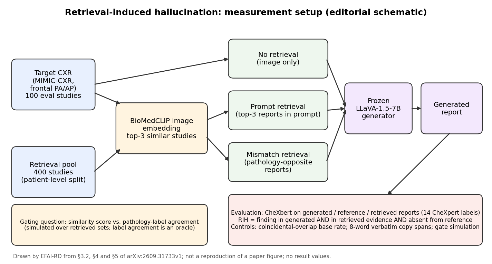

[Home](../) · [AI Papers](./)

# 一篇 pilot 的警訊：相似病例報告進了 prompt，胸片 VLM 會抄進別人的發現

## 來源

- 團隊：University of Lagos、NITHUB（University of Lagos）、Machine Learning Collective、Ahmadu Bello University 與 Federal University of Agriculture, Abeokuta（FUNAAB）；共 4 位作者：Emmanuel Idoko、Abdusshakur Olabisi、Shiloh Oni、Adesola Josiah。[(ref: main)](https://arxiv.org/html/2609.31733v1)
- 論文：*When Retrieval Hurts: Measuring and Explaining Retrieval-Induced Hallucination in Chest X-ray Report Generation*，arXiv v1，2026。[(ref: abstract)](https://arxiv.org/abs/2609.31733)
- 識別碼：[arXiv:2609.31733](https://arxiv.org/abs/2609.31733)；[DOI: 10.48550/arXiv.2609.31733](https://doi.org/10.48550/arXiv.2609.31733)。
- 全文：[arXiv HTML v1](https://arxiv.org/html/2609.31733v1)。
- 研究性質：作者自稱 pilot 而非正式 benchmark；評估集 100 筆檢查、未報告信賴區間；論文提出的防護模組 RGCA 只有規格、沒有實作，gating 結果來自使用真實標籤的模擬。[(ref: main §6)](https://arxiv.org/html/2609.31733v1#S6) [(ref: main §5.4)](https://arxiv.org/html/2609.31733v1#S5.SS4)
- 證據邊界：本文依 arXiv v1 全文第 1 至 8 節與 Table 1–3 撰寫；arXiv 頁面註記全文含 4 張表，HTML 版呈現 3 張，本文只引用這 3 張。HTML 版沒有論文圖，本文的流程圖為本書庫自繪。

**編輯：** Clare

這篇作者自稱為 pilot 的短論文，把 BioMedCLIP 找到的三份相似病例報告直接接進通用 LLaVA-1.5-7B 的 prompt，在 100 筆 MIMIC-CXR 檢查上量到模型會把其他病人的發現甚至整段原文寫進報告；它提出的防護模組沒有實作，所以值得讀的是失效模式的量測方法，不是解法。[(ref: main Abstract)](https://arxiv.org/html/2609.31733v1#abstract1) [(ref: main §6)](https://arxiv.org/html/2609.31733v1#S6)

## 流程

圖：本書庫依論文第 3.2、4、5 節繪製的編輯示意圖，不含成效數值。左側是檢索設定，中間是三種生成條件，下方是評估與 gating 分析；論文提出的 Retrieval-Guided Cross-Attention（RGCA）模組並未實作，因此不在圖中。[(ref: main §3.2)](https://arxiv.org/html/2609.31733v1#S3.SS2) [(ref: main §4)](https://arxiv.org/html/2609.31733v1#S4) [(ref: main §5)](https://arxiv.org/html/2609.31733v1#S5)

## 背景／問題

論文的出發點是一個前提：通用 vision-language model（VLM）缺乏臨床脈絡，而把相似過去檢查的報告放進 prompt，也就是 retrieval-augmented generation（RAG），可以補上這塊。[(ref: main §1)](https://arxiv.org/html/2609.31733v1#S1) 這個前提在論文中沒有外部證據支撐：Related Work 引用的是 RAG 的通用原始論文與 LLaVA-Med、Med-Flamingo、CheXagent 等醫療 VLM，沒有引用任何一篇胸片報告的 RAG 方法或其成效。[(ref: main §2)](https://arxiv.org/html/2609.31733v1#S2) 論文唯一支持「RAG 有幫助」的證據，是它自己的實驗：一個通用、非放射科專用的 LLaVA 生成器，clinical F1 從 0.201 升到 0.402。[(ref: main Table 2)](https://arxiv.org/html/2609.31733v1#S5.T2)

論文真正要問的是反面：檢索來的報告可能提到目標影像上沒有的發現，模型會不會照寫？作者把這種情況稱為 retrieval-induced hallucination（RIH），定義為「出現在生成報告、也出現在至少一份檢索報告、但不在目標參考報告中」的臨床發現。[(ref: main §1)](https://arxiv.org/html/2609.31733v1#S1) [(ref: main §3.1)](https://arxiv.org/html/2609.31733v1#S3.SS1)

因此本篇讀到的是一個失效模式的量測：在一個刻意簡單的 RAG 設定下，錯誤從哪裡來、有多常發生、能不能用相似度擋住。它不回答「胸片報告該不該用 RAG」，也不回答「做得好的 RAG 系統會不會有同樣問題」。

## 方法摘要

研究從 MIMIC-CXR／MIMIC-CXR-JPG 取 500 筆檢查，切成 400 筆檢索池與 100 筆評估集，以病人為單位分割、只用正面 PA／AP 影像。檢索用 BioMedCLIP 的影像嵌入取前三名相似檢查，生成器是凍結的 LLaVA-1.5-7B，沒有任何放射科微調。[(ref: main §4.1)](https://arxiv.org/html/2609.31733v1#S4.SS1) [(ref: main §4.2)](https://arxiv.org/html/2609.31733v1#S4.SS2) [(ref: main §4.3)](https://arxiv.org/html/2609.31733v1#S4.SS3)

每筆評估檢查在三種條件下各生成一份報告：只給影像的 no retrieval、額外附上 top-3 檢索報告的 prompt retrieval，以及刻意附上病理相反報告的 mismatch retrieval。生成、參考與檢索三方的報告都用 CheXbert 標成 14 個 CheXpert 類別後比較。[(ref: main §3.2)](https://arxiv.org/html/2609.31733v1#S3.SS2) [(ref: main §4.3)](https://arxiv.org/html/2609.31733v1#S4.SS3)

主結果之外有四個分析：用沒看過檢索內容的 image-only 報告計算偶然重疊的基準率；在字串層級找逐字抄寫；檢查檢索相似度能否預測傷害；以及模擬不同 gating 訊號的取捨。[(ref: main §5.2)](https://arxiv.org/html/2609.31733v1#S5.SS2) [(ref: main §5.3)](https://arxiv.org/html/2609.31733v1#S5.SS3) [(ref: main §5.4)](https://arxiv.org/html/2609.31733v1#S5.SS4)

## 方法詳解

- **問題定義** — 目標影像 x、參考報告 y_ref、檢索報告集 R(x) = {r_1,…,r_k}；某個臨床發現 p 同時出現在生成報告 y_gen 與至少一份 r_i 中、卻不在 y_ref 中，就記為一次 RIH。[(ref: main §3.1)](https://arxiv.org/html/2609.31733v1#S3.SS1)
- **Baseline RAG 管線** — 論文對管線的描述只有一段：no retrieval 只給影像與報告生成 prompt，prompt retrieval 額外給 top-k 檢索報告，mismatch retrieval 給刻意錯配的報告。[(ref: main §3.2)](https://arxiv.org/html/2609.31733v1#S3.SS2) 檢索索引以檢查為單位，存 study ID、影像路徑、報告全文、findings、impression、標籤與 split，但檢索只用影像—文字嵌入的相似度。[(ref: main §4.1)](https://arxiv.org/html/2609.31733v1#S4.SS1)
- **資料切分與防洩漏** — 400 筆檢索池與 100 筆評估集以病人為單位分開，論文寫兩者分別涵蓋 99 位與 27 位受試者；目標不會檢索到自己或同一病人的其他檢查。種子固定，子集以 SHA-256 做內容定址。[(ref: main §4.2)](https://arxiv.org/html/2609.31733v1#S4.SS2)
- **生成與算力** — 生成器為 llava-hf/llava-1.5-7b-hf，最多 192 個新 token；300 份報告在一張 NVIDIA T4 上約 20 至 40 分鐘。[(ref: main §4.2)](https://arxiv.org/html/2609.31733v1#S4.SS2) [(ref: main §4.3)](https://arxiv.org/html/2609.31733v1#S4.SS3)
- **標註方式** — 三方報告都用同一個 CheXbert 標註、處理否定語句；只有 positive 才算有該發現，uncertain 視為 negative。作者改用同一模型，是因為先前的規則式標註器在兩端用不同詞彙，例如生成的「pulmonary edema」對不上參考端的「Edema」，會被一律算成 hallucination。[(ref: main §4.3)](https://arxiv.org/html/2609.31733v1#S4.SS3)
- **偶然重疊對照（coincidental-overlap control）** — 拿 no retrieval 的報告去比對它「本來會拿到、但沒看到」的檢索證據，算出純屬巧合的重疊率，作為 RIH 的基準線。[(ref: main §5.2)](https://arxiv.org/html/2609.31733v1#S5.SS2)
- **逐字抄寫量測** — 計算含有一段「出現在檢索證據中、卻不在參考報告中」的 8 字連續片段的報告比例。[(ref: main §5.2)](https://arxiv.org/html/2609.31733v1#S5.SS2)
- **RGCA（只有規格，未實作）** — 以影像嵌入與檢索報告嵌入的 cosine 相似度 α_k 等輸入，經 sigmoid gate 決定每份檢索報告對視覺 cross-attention 的影響。作者在第 5.3 節自己否定了以 α_k 為核心的設計，並明言不主張 RGCA 能降低 hallucination。[(ref: main §3.3)](https://arxiv.org/html/2609.31733v1#S3.SS3) [(ref: main §8)](https://arxiv.org/html/2609.31733v1#S8)
- **Gating 模擬（oracle）** — 在已取回的證據集上模擬不同篩選訊號，計算留下的證據含多少參考報告沒有的發現、保留多少參考發現；表現最好的 label agreement 使用真實標籤，推論時拿不到。[(ref: main §5.4)](https://arxiv.org/html/2609.31733v1#S5.SS4)
- **論文未交代** — 檢索報告如何組進 prompt（模板、順序、是否加說明文字）、放入的是全文還是 findings／impression、是否截斷；k 固定為 3，沒有改變 k 的實驗；mismatch 的「病理相反」報告依什麼規則挑選；Table 2 的 Hall.、Omission 與 clinical F1 沒有正式定義，clinical F1 是 micro 還是 macro 平均也未說明；所有比例都沒有信賴區間。[(ref: main §3.2)](https://arxiv.org/html/2609.31733v1#S3.SS2) [(ref: main §4.3)](https://arxiv.org/html/2609.31733v1#S4.SS3) [(ref: main Table 2)](https://arxiv.org/html/2609.31733v1#S5.T2)

## 資料與實驗

下表整理論文使用的資料與元件。[(ref: main §4.1)](https://arxiv.org/html/2609.31733v1#S4.SS1) [(ref: main §4.2)](https://arxiv.org/html/2609.31733v1#S4.SS2) [(ref: main §4.3)](https://arxiv.org/html/2609.31733v1#S4.SS3)

| 項目 | 角色 | 內容（論文所述） |
|---|---|---|
| MIMIC-CXR／MIMIC-CXR-JPG 子集 | 研究資料（PhysioNet 認證取用） | 500 筆檢查，正面 PA／AP、每筆一張影像 |
| 檢索池 | 被檢索的前例報告 | 400 筆檢查，論文寫涵蓋 99 位受試者 |
| 評估集 | 生成與評分對象 | 100 筆檢查，論文寫涵蓋 27 位受試者；與檢索池病人不重疊 |
| BioMedCLIP | 影像嵌入與 top-3 檢索 | 相似度只用影像端 |
| llava-hf/llava-1.5-7b-hf | 報告生成器（凍結、通用） | 三種條件 × 100 筆 = 300 份報告 |
| CheXbert | 三方報告的標註 | 14 個 CheXpert 類別；uncertain 視為 negative |
| 20 筆 pilot | 早期預試 | 用於比較 clinical F1 倍率的穩定性 |

下表重製論文 Table 1：BioMedCLIP top-3 在 100 筆評估檢查上的檢索品質。[(ref: main Table 1)](https://arxiv.org/html/2609.31733v1#S5.T1)

| Metric | Retrieval | Mismatch |
|---|---|---|
| Label Jaccard@3 | 0.267 | 0.050 |
| Label precision@3 | 0.272 | 0.000 |
| Label recall@3 (abnormal targets) | 0.604 | 0.000 |
| ≥1 shared pathology | 0.55 | 0.00 |
| Normal target → normal neighbours | 4/28 | 5/28 |
| Abnormal target → ≥1 match | 55/72 | 0/72 |

下表重製論文 Table 2：三種檢索條件下的生成結果（CheXbert 標註，各 n = 100）。論文只定義了 RIH（retrieval-induced hallucination）與 Copy（生成報告與檢索證據共有任一發現的比例），Hall.、Omission 與 Clinical F1 未給正式定義。[(ref: main Table 2)](https://arxiv.org/html/2609.31733v1#S5.T2)

| Condition | n | Hall. | RIH | Copy | Omission | Clinical F1 |
|---|---|---|---|---|---|---|
| No Retrieval | 100 | 0.32 | 0.00 | 0.00 | 0.80 | 0.201 |
| Prompt Retrieval | 100 | 0.80 | 0.76 | 0.91 | 0.74 | 0.402 |
| Mismatch Retrieval | 100 | 0.98 | 0.98 | 1.00 | 0.78 | 0.043 |

下表重製論文 Table 3：100 筆檢查上的 gating 訊號比較。Kept 為平均保留報告數；Unsup. 為留下的證據中、參考報告沒有的平均發現數；Coverage 為保留的參考發現平均比例；Normal protected 為正常參考報告中、沒有任何異常證據留下的筆數。Label agreement 列使用真實標籤（oracle）。[(ref: main Table 3)](https://arxiv.org/html/2609.31733v1#S5.T3)

| Gating signal | Kept | Unsup. | Coverage | Normal protected |
|---|---|---|---|---|
| No gate (k = 3) | 3.00 | 2.18 | 0.60 | 4/28 |
| Cosine similarity, top-1 | 1.00 | 0.99 | 0.33 | 13/28 |
| Label agreement, J ≥ 0.2 | 1.42 | 0.84 | 0.60 | 28/28 |
| Label agreement, J ≥ 0.4 | 0.92 | 0.35 | 0.47 | 28/28 |
| Label agreement, L_k ⊆ T | 1.28 | 0.00 | 0.27 | 28/28 |

## 結果

下表把論文中 prompt retrieval 相對於 no retrieval 的得失並列；mismatch 是刻意構造的最壞情況，不列入。這只是本論文單一設定下的證據，論文沒有和放射科專用生成器、微調或其他 RAG 設計比較。[(ref: main §5.2)](https://arxiv.org/html/2609.31733v1#S5.SS2) [(ref: main Table 2)](https://arxiv.org/html/2609.31733v1#S5.T2)

| 面向 | No retrieval | Prompt retrieval | 解讀 |
|---|---|---|---|
| Clinical F1 | 0.201 | 0.402 | 得：起點偏低的通用模型翻倍 |
| Omission | 0.80 | 0.74 | 得：漏寫只小幅減少 |
| 找回參考支持、原本漏掉的發現 | — | 55／100 筆 | 得 |
| Hallucination 率（Hall.） | 0.32 | 0.80 | 失 |
| RIH | 0.00 | 0.76 | 失：偶然重疊基準率為 0.18 |
| 含 8 字逐字抄寫片段的報告 | 0% | 95% | 失：抄的是其他病人的內容 |

- **檢索器對正常片特別失準** — 異常目標中 55／72 筆找到相符病理；28 筆正常目標只有 4 筆取回全是正常的鄰居，即 24／28 筆至少帶回一份異常前例。作者的解釋是醫療影像嵌入的相似度主要由解剖結構與攝影條件決定，而不是有沒有病灶；這是作者的推論，論文沒有另做實驗驗證。[(ref: main §5.1)](https://arxiv.org/html/2609.31733v1#S5.SS1) [(ref: main Table 1)](https://arxiv.org/html/2609.31733v1#S5.T1)
- **RIH 不是證據集太大造成的巧合** — 偶然重疊的基準率在兩種證據集上都是 0.18，相對於觀察到的 RIH 0.76 與 0.98，超額分別為 +0.58 與 +0.80。[(ref: main §5.2)](https://arxiv.org/html/2609.31733v1#S5.SS2)
- **模型在抄字** — prompt retrieval 下 95% 的報告含有逐字片段，mismatch 下為 100%；最長逐字片段中位數 17 字、最長 70 字，image-only 報告則一份都沒有。作者列出的例子包括 PICC 導管尖端位置、先前 CT 所見的甲狀腺腫與「右乳缺如」，屬於某位病人專屬的器材、共病與手術史。[(ref: main §5.2)](https://arxiv.org/html/2609.31733v1#S5.SS2)
- **相似度預測不了傷害** — 有發生 RIH 的檢查 top-1 相似度平均 0.9439，沒發生的為 0.9413；依相似度四分位切分，RIH 率為 0.80、0.80、0.60、0.84，沒有單調趨勢。BioMedCLIP 的 top-1 相似度全落在 0.860 到 0.979 之間。[(ref: main §5.3)](https://arxiv.org/html/2609.31733v1#S5.SS3)
- **Gating 只有 oracle 版本有效** — 以真實標籤的 label agreement J ≥ 0.2 篩選，可把無依據發現從 2.18 降到 0.84、coverage 維持 0.60；cosine top-1 則只降到 0.99、coverage 掉到 0.33。改用模型自己的 image-only 報告推估病理時，coverage 掉到 0.16，論文因此沒有可在推論時使用的 gate。[(ref: main §5.4)](https://arxiv.org/html/2609.31733v1#S5.SS4) [(ref: main Table 3)](https://arxiv.org/html/2609.31733v1#S5.T3)

## 限制

- **核心方法未實作（作者自述）** — RGCA 只有規格；作者明言不主張它能降低 hallucination，以相似度為 gate 的設計在 n = 100 下是負面結果。[(ref: main §6)](https://arxiv.org/html/2609.31733v1#S6)
- **Pilot 規模（作者自述）** — 評估集 100 筆、檢索池 400 筆，作者認為檢索品質可能比全量索引悲觀。[(ref: main §6)](https://arxiv.org/html/2609.31733v1#S6)
- **生成器不是放射科模型（作者自述）** — 通用 LLaVA 的 omission 率在各條件都在 0.74 至 0.80，結論關於「通用 VLM 如何整合檢索證據」，不代表自動報告可達的品質。[(ref: main §6)](https://arxiv.org/html/2609.31733v1#S6)
- **指標歸因（作者自述）** — RIH 無法區分「從證據抄來」與「自己生成、碰巧也出現在證據中」；偶然重疊對照只能在群體層級設限。[(ref: main §6)](https://arxiv.org/html/2609.31733v1#S6)
- **本書庫補充：RAG 設定相當陽春** — 只用影像相似度、固定 k = 3、把報告直接接進 prompt，論文也沒有說明 prompt 是否提醒模型檢索報告可能不適用；論文的結論是否適用於有重排序、病理過濾或指令約束的 RAG，無法從本文判斷。[(ref: main §3.2)](https://arxiv.org/html/2609.31733v1#S3.SS2) [(ref: main §4.1)](https://arxiv.org/html/2609.31733v1#S4.SS1)
- **本書庫補充：沒有與既有做法比較** — 沒有放射科專用生成器、沒有其他胸片 RAG 方法，也沒有微調作為對照；「F1 翻倍」只能說明對一個弱起點有幫助。[(ref: main §2)](https://arxiv.org/html/2609.31733v1#S2) [(ref: main Table 2)](https://arxiv.org/html/2609.31733v1#S5.T2)
- **本書庫補充：有效樣本可能比 100 小** — 100 筆評估檢查只來自 27 位受試者，同一病人的多筆檢查並非獨立樣本；四分位比較每格只有約 25 筆，且全文沒有信賴區間。[(ref: main §4.2)](https://arxiv.org/html/2609.31733v1#S4.SS2) [(ref: main §5.3)](https://arxiv.org/html/2609.31733v1#S5.SS3)
- **本書庫補充：一處數字前後不一** — Table 2 中 no retrieval 的 omission 率為 0.80，第 5.4 節寫 0.86；本文以 Table 2 為準。[(ref: main Table 2)](https://arxiv.org/html/2609.31733v1#S5.T2) [(ref: main §5.4)](https://arxiv.org/html/2609.31733v1#S5.SS4)
- **本書庫補充：只用 CheXbert 的 14 類** — 器材位置、手術史等不在 14 類中的內容只由逐字抄寫分析間接捕捉，label 層級的 RIH 可能低估了這類內容的轉移。[(ref: main §4.3)](https://arxiv.org/html/2609.31733v1#S4.SS3) [(ref: main §5.2)](https://arxiv.org/html/2609.31733v1#S5.SS2)

## 與書庫其他文章的關係

MAIRA-2 把前次影像與前次報告當作生成輸入、並以 grounding 與事實層級評分約束輸出，本篇則顯示當附上的是「別人的」前例報告且沒有這類約束時，模型會把對方的發現與文字直接帶進報告: [MAIRA-2：胸腔 X 光報告的文字正確，定位也正確嗎？](2026-09-15-maira-2-grounded-reporting.md)

ModaLens 問「有報告可讀時，醫療 VLM 還看不看影像」，本篇給出同一問題在 RAG 情境下的一個 pilot 觀察：檢索報告一進 prompt，生成內容的來源就大幅從影像轉向文字: [ModaLens：有報告可讀時，醫療 VLM 還會看影像嗎？](2026-09-17-modalens-image-sensitivity.md)

RadVLM 的分節評估顯示流暢的報告不等於臨床忠實，本篇的逐字抄寫分析則指出一種特別難從流暢度察覺的失真：句子本身是真實放射科醫師寫的，只是屬於另一位病人: [報告讀起來很順，就代表寫對了嗎？RadVLM 的分節評估](2026-09-22-radvlm-section-based-report-evaluation.md)

## 實務的啟發

這篇論文的證據停在 100 筆檢查、一個通用生成器與一種陽春的 RAG 設定，核心防護模組也沒有實作；它能提供的是可以借用的量測方法與待驗證的警訊，不是可以採用的解法。

第一，可以借用的是評估設計。如果院內在評估以前例報告輔助寫報告的系統，「無檢索、正常檢索、刻意錯配」三種條件並排，再加上偶然重疊基準率，是一個成本低、能把檢索造成的錯誤和模型本來就會犯的錯分開的做法；但具體的錯誤率要在自己的生成器與檢索設定上重新量。

第二，逐字片段比對是便宜的監控訊號。8 字連續片段比對不需要標註；論文中 image-only 報告為 0%、檢索條件下為 95% 以上，至少說明這個訊號在兩種情況之間分得很開，可以考慮用來抽查生成報告是否照抄檢索來源。

第三，待驗證的警訊是「影像相似度不等於臨床相關」。論文中 24／28 筆正常片帶回異常前例、相似度又擠在 0.86 至 0.98 的窄帶，本書庫的解讀是：只用影像嵌入相似度篩選前例，在這個設定下看不出保護作用。這需要在更大的語料與其他嵌入模型上確認，論文本身沒有做到。

第四，報告中出現另一位病人的器材、共病與手術史，本書庫認為除了正確性問題，也牽涉跨病人的資訊外流；若要建置檢索語料，報告中可識別病人特徵的處理方式應一併考慮。作者另外指出小型、缺乏多樣性的本地語料更容易出現這種配對，這一點同樣只是推論，尚未在不同規模的語料上驗證。[(ref: main §5.2)](https://arxiv.org/html/2609.31733v1#S5.SS2) [(ref: main §7)](https://arxiv.org/html/2609.31733v1#S7)

## References

- `main`：[When Retrieval Hurts: Measuring and Explaining Retrieval-Induced Hallucination in Chest X-ray Report Generation，arXiv HTML v1](https://arxiv.org/html/2609.31733v1)；本文使用 [Abstract](https://arxiv.org/html/2609.31733v1#abstract1)、[§1 Introduction](https://arxiv.org/html/2609.31733v1#S1)、[§2 Related Work](https://arxiv.org/html/2609.31733v1#S2)、[§3.1 Problem Definition](https://arxiv.org/html/2609.31733v1#S3.SS1)、[§3.2 Baseline Pipeline](https://arxiv.org/html/2609.31733v1#S3.SS2)、[§3.3 Retrieval-Guided Cross-Attention](https://arxiv.org/html/2609.31733v1#S3.SS3)、[§4 Experimental Setup](https://arxiv.org/html/2609.31733v1#S4)、[§4.1 Dataset and Retrieval Setup](https://arxiv.org/html/2609.31733v1#S4.SS1)、[§4.2 Compute, splits, and runtime](https://arxiv.org/html/2609.31733v1#S4.SS2)、[§4.3 Generator and Evaluation](https://arxiv.org/html/2609.31733v1#S4.SS3)、[§5 Results](https://arxiv.org/html/2609.31733v1#S5)、[§5.1 Retrieval quality](https://arxiv.org/html/2609.31733v1#S5.SS1)、[§5.2 Generation under the three retrieval conditions](https://arxiv.org/html/2609.31733v1#S5.SS2)、[§5.3 Retrieval similarity does not predict harm](https://arxiv.org/html/2609.31733v1#S5.SS3)、[§5.4 What the gate should condition on](https://arxiv.org/html/2609.31733v1#S5.SS4)、[§6 Limitations](https://arxiv.org/html/2609.31733v1#S6)、[§7 Impact in African and other low-resource clinical contexts](https://arxiv.org/html/2609.31733v1#S7)、[§8 Conclusion](https://arxiv.org/html/2609.31733v1#S8)、[Table 1](https://arxiv.org/html/2609.31733v1#S5.T1)、[Table 2](https://arxiv.org/html/2609.31733v1#S5.T2)、[Table 3](https://arxiv.org/html/2609.31733v1#S5.T3)。
- `abstract`：[arXiv:2609.31733](https://arxiv.org/abs/2609.31733)。
- `doi`：[10.48550/arXiv.2609.31733](https://doi.org/10.48550/arXiv.2609.31733)。

[Home](../) · [AI Papers](./)
