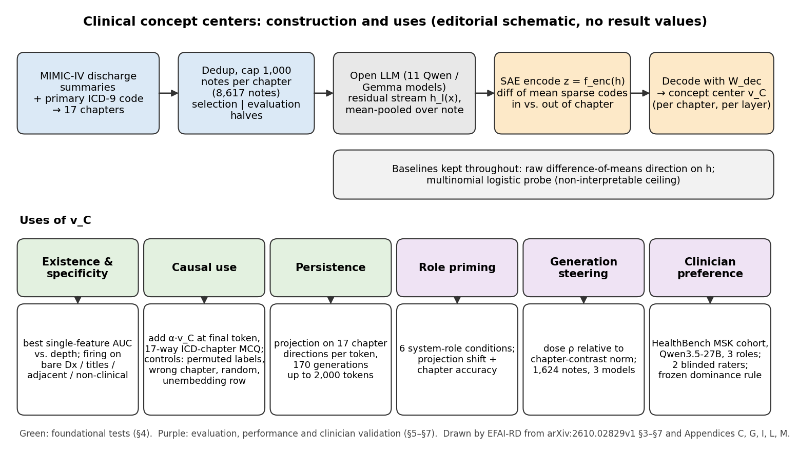

[Home](../) · [AI Papers](./)

# 病歷讀進 LLM 之後，ICD 章節藏在模型的哪裡？Clinical Concept Centers 在 11 個開源模型裡找方向、做介入

## 來源

- 團隊：National University of Singapore、SAP Asia Pte Ltd、Nanyang Technological University 與 Singapore Institute of Technology；共 5 位作者：Aishik Nagar、Abhishek Vaidyanathan、Arun-Kumar Kaliya-Perumal、Elijah Tzen Hsuen Boey、Stefan Winkler（論文未列 Boey 的單位）。[(ref: main)](https://arxiv.org/html/2610.02829v1)
- 論文：*Clinical Concept Centers in LLMs*，arXiv v1，2026。[(ref: abstract)](https://arxiv.org/abs/2610.02829)
- 識別碼：[arXiv:2610.02829](https://arxiv.org/abs/2610.02829)；[DOI: 10.48550/arXiv.2610.02829](https://doi.org/10.48550/arXiv.2610.02829)。
- 全文：[arXiv HTML v1](https://arxiv.org/html/2610.02829v1)。
- 研究性質：完整研究，不是 pilot；核心方法已實作，主要因果結果附 bootstrap 95% 信賴區間與四組對照。臨床醫師驗證規模小：2 位評分者、38 個案例、單一 ICD 章節（肌肉骨骼）與單一模型。[(ref: main Table 1)](https://arxiv.org/html/2610.02829v1#S4.T1) [(ref: main App. M)](https://arxiv.org/html/2610.02829v1#A13)
- 證據邊界：本文依 arXiv v1 全文第 1 至 8 節與附錄 A 至 N 撰寫；論文圖未轉載，流程圖為本書庫自繪。論文所稱的補充材料程式碼沒有公開網址，本文未核對。

**編輯：** Clare

這篇論文用 MIMIC-IV 出院摘要的主要 ICD-9 代碼當標籤，在 11 個開源 Qwen／Gemma 模型的 residual stream 裡為 17 個 ICD 章節各找出一條方向（作者稱為 clinical concept center），再用注入實驗、角色提示與一個小型醫師盲評檢查這些方向是否真的被模型拿來做臨床判斷。[(ref: main Abstract)](https://arxiv.org/abs/2610.02829) [(ref: main §3)](https://arxiv.org/html/2610.02829v1#S3)

## 流程

圖：本書庫依論文第 3 至 7 節與附錄 C、G、I、L、M 繪製的編輯示意圖，不含成效數值。上排是 concept center 的建構，灰框是全程保留的兩個基準；下排綠色為第 4 節的基礎測試，紫色為第 5 至 7 節的評估、效能與醫師驗證。[(ref: main §3)](https://arxiv.org/html/2610.02829v1#S3) [(ref: main §4)](https://arxiv.org/html/2610.02829v1#S4) [(ref: main §7)](https://arxiv.org/html/2610.02829v1#S7)

## 背景／問題

作者指出，目前醫療 LLM 的評估幾乎都在看輸出文字，例如考題答對率或醫師依量表給生成對話評分；而一般領域的 mechanistic interpretability 研究已經發現，模型內部表徵所含的資訊多於它說出來的內容，chain-of-thought 也會漏掉真正驅動答案的特徵。[(ref: main §1)](https://arxiv.org/html/2610.02829v1#S1) 這兩點在論文裡是引用既有文獻支撐的前提；「臨床用途的模型需要在潛在空間做評估」則是作者自己表明的立場，不是論文證明的結論。[(ref: main §1)](https://arxiv.org/html/2610.02829v1#S1)

論文要回答的問題比立場窄得多：開源 LLM 讀一份出院摘要時，內部是否存在可定位、只對對應臨床敘事反應、而且會被模型實際用來做決定的「章節概念」表徵？作者的做法是把 EHR 現成的專家標註拿來當可解釋性研究所需的標籤：病歷是語料，醫療編碼員指派的 ICD 代碼是標籤，不需要另外請人或 LLM 標註。[(ref: main §1)](https://arxiv.org/html/2610.02829v1#S1)

因此這篇讀到的是一套「在模型內部找臨床概念、並用介入檢驗它」的方法，以及它在 17 章分類這個粗粒度任務上的結果；它沒有回答模型的臨床推理是否正確，也沒有在任何臨床流程中驗證可部署性。

## 方法摘要

資料是 MIMIC-IV 出院摘要。每份摘要只取主要 ICD-9 代碼，歸入 17 個 ICD-9-CM 疾病章節；去重並把每章上限設為 1,000 份後共 8,617 份，分成用來估計方向與選超參數的 selection half，以及所有報告數字所用的 evaluation half。[(ref: main §3)](https://arxiv.org/html/2610.02829v1#S3.SS0.SSS0.Px1)

在 11 個開源模型（5 個 Qwen、6 個 Gemma，4B 至 30B，含 base、instruct、醫療微調與 mixture-of-experts 版本）的每一層，取整份病歷 token 的平均 residual stream，用公開的 sparse autoencoder（SAE）編成稀疏碼；某章節內外病歷的平均稀疏碼相減、再用 SAE decoder 解回模型座標，就得到該章節的 concept center。兩個基準全程並列：直接在 residual stream 上算的 raw difference-of-means 方向，以及多類別 logistic probe。[(ref: main §3)](https://arxiv.org/html/2610.02829v1#S3.SS0.SSS0.Px2)

驗證分兩層。第 4 節是基礎測試：方向是否存在、是否專一於臨床敘事、注入後是否改變模型的 17 章選擇題答案、生成長文時是否持續活化。第 5 至 7 節是應用：用角色提示做潛在空間評估、在開放式生成中沿方向引導，以及檢查活化強度能否預測醫師盲評偏好。[(ref: main §4)](https://arxiv.org/html/2610.02829v1#S4) [(ref: main §5)](https://arxiv.org/html/2610.02829v1#S5) [(ref: main §6)](https://arxiv.org/html/2610.02829v1#S6) [(ref: main §7)](https://arxiv.org/html/2610.02829v1#S7)

## 方法詳解

- **標籤設計** — 作者認為 ICD 代碼過細，且一次就診的代碼常含沿用前次或為帳務加上的項目，因此只用主要代碼並歸到章節層級。[(ref: main §3)](https://arxiv.org/html/2610.02829v1#S3.SS0.SSS0.Px1) 各章份數從 Congenital Anomalies 的 78 份到 Circulatory 與 Respiratory 的上限 1,000 份不等；多數類基準為 11.6%，17 選 1 的均勻機率為 5.9%。[(ref: main Table 3)](https://arxiv.org/html/2610.02829v1#A3.T3) [(ref: main App. G)](https://arxiv.org/html/2610.02829v1#A7)
- **Concept center 的計算** — 對章節 C，取 selection half 中章節內與章節外病歷平均稀疏碼之差，乘上 SAE decoder 權重得到 v_C，即把 Marks 與 Tegmark 的 mass-mean 做法搬到 SAE 特徵基底；量測一律用 residual 在 v_C 上的投影。Qwen 用 TopK SAE、Gemma 用 JumpReLU SAE，皆來自公開 SAE 套組；27B 以上模型改用 4,334 份的子集。[(ref: main §3)](https://arxiv.org/html/2610.02829v1#S3.SS0.SSS0.Px2) [(ref: main Table 4)](https://arxiv.org/html/2610.02829v1#A4.T4)
- **為何以平均池化讀取** — 作者的理由是 decoder-only 模型的最後一個 token 編碼的是下一個 token 的預測，而不是輸入的摘要，所以讀取病歷內容時改用全部 token 的平均。[(ref: main §3)](https://arxiv.org/html/2610.02829v1#S3.SS0.SSS0.Px2)
- **專一性測試** — 每章取 selection half 上 AUC 最高的 10 個 SAE 特徵，看它們在五種輸入下有幾個會活化：完整病歷、單獨的診斷名稱、章節標題、相鄰章節的病歷、與醫療無關的句子。[(ref: main §4.2)](https://arxiv.org/html/2610.02829v1#S4.SS2) [(ref: main App. F)](https://arxiv.org/html/2610.02829v1#A6)
- **因果注入** — 在 17 章選擇題中，於最後一個 token 位置的 residual 加上 α·v̂_C，掃描 α ∈ {±1, ±3, ±10, ±30, ±100} 與所有層，在 selection half 選出最佳（層, 強度），只報 held-out 上的效果；指標 ΔP 為正確選項字母機率的變化。[(ref: main §4.3)](https://arxiv.org/html/2610.02829v1#S4.SS3) 分類 prompt 全文、溫度 0.0 與最多 10 個新 token 的解碼設定見附錄 C；病歷全文含 Discharge Diagnosis 段，超過 context 長度時從尾端截斷。[(ref: main App. C)](https://arxiv.org/html/2610.02829v1#A3)
- **四組對照** — permuted-label（打亂章節標籤後重跑同一套找方向流程）、wrong-chapter（注入別章的方向）、random-direction（同層同強度的隨機單位向量，多個種子）、unembedding（直接注入正確選項字母的 unembedding 列）。表中的 chapter-specific 欄是扣掉隨機方向效果後的剩餘值；跨約 1,500 個層×強度組合做 Benjamini-Hochberg 校正。[(ref: main §4.3)](https://arxiv.org/html/2610.02829v1#S4.SS3.SSS0.Px1) [(ref: main App. G)](https://arxiv.org/html/2610.02829v1#A7)
- **生成中的持續性** — 每章 10 份 held-out 病歷、每模型 170 次生成、最長 2,000 token；base 模型續寫病歷，chat 模型則被要求寫臨床評估。逐 token 計算真實章節投影減去 17 章平均（target-chapter dominance）。[(ref: main §4.4)](https://arxiv.org/html/2610.02829v1#S4.SS4) [(ref: main App. I)](https://arxiv.org/html/2610.02829v1#A9)
- **Counterfactual role priming** — 六種系統角色：與真實章節相符的專科、刻意不符的專科、隨機抽的臨床專科、一般醫師、非臨床角色、無角色；同時讀取真實章節方向上的投影與 17 章答題準確度。[(ref: main §5)](https://arxiv.org/html/2610.02829v1#S5) [(ref: main App. J)](https://arxiv.org/html/2610.02829v1#A10)
- **生成引導** — 假設部署時已知科別，於每個生成 token 持續注入真實章節方向；強度以該模型在該層的章節對比範數中位數的比例 ρ 表示，並同時報告有多少答案真的改變（discordant），避免「沒生效」被誤讀成「沒效果」。[(ref: main §6)](https://arxiv.org/html/2610.02829v1#S6) [(ref: main App. L)](https://arxiv.org/html/2610.02829v1#A12)
- **醫師盲評** — 從 HealthBench 篩出對應 Musculoskeletal 章節的對話，由 Qwen3.5-27B 在無角色、相符專科、不符專科三種條件下作答；兩位評分者（一位資深骨科住院醫師、一位醫學生）做三組兩兩比較、可選平手。評分前就以 mean target-chapter dominance 凍結預測：每對中活化較強的回答會被偏好。[(ref: main §7)](https://arxiv.org/html/2610.02829v1#S7) [(ref: main App. M)](https://arxiv.org/html/2610.02829v1#A13)
- **論文未交代** — 第 3 節寫「以病人為單位」切分 selection／evaluation half，但附錄 E 把以病歷為單位的 item split 當主分析、病人層級切分當較嚴格的對照，附錄 G 也寫 note-level split，主分析究竟用哪一種說法不一；附錄 C 的 17 章選項中沒有 Injury 章，附錄 M 卻以「骨折屬於 Injury chapter」排除病例，ICD-9 代碼如何對應到這 17 章沒有說清楚；MIMIC-IV 中以 ICD-10 編碼的病歷如何處理未說明；開放式生成如何判定「生成文字預測到正確章節」沒有描述評分方式；部分 Qwen 模型的 chapter-specific 值是在較早的最佳設定上量的，與表中列的層不同；醫師研究依活化差距中位數分層的分析不在附錄 M 列出的事前分析計畫中。[(ref: main §3)](https://arxiv.org/html/2610.02829v1#S3.SS0.SSS0.Px1) [(ref: main App. E)](https://arxiv.org/html/2610.02829v1#A5) [(ref: main App. G)](https://arxiv.org/html/2610.02829v1#A7) [(ref: main App. C)](https://arxiv.org/html/2610.02829v1#A3) [(ref: main §6)](https://arxiv.org/html/2610.02829v1#S6) [(ref: main App. M)](https://arxiv.org/html/2610.02829v1#A13)

## 資料與實驗

下表整理論文使用的資料、模型與評估元件。[(ref: main §3)](https://arxiv.org/html/2610.02829v1#S3.SS0.SSS0.Px1) [(ref: main Table 4)](https://arxiv.org/html/2610.02829v1#A4.T4) [(ref: main App. M)](https://arxiv.org/html/2610.02829v1#A13)

| 項目 | 角色 | 內容（論文所述） |
|---|---|---|
| MIMIC-IV 出院摘要 | 找方向與評估的語料（PhysioNet 認證取用） | 8,617 份；只用主要 ICD-9 代碼，歸入 17 章，每章上限 1,000 份 |
| selection／evaluation half | 方向估計與超參數選擇／所有報告數字 | 27B 以上模型用 4,334 份子集 |
| Qwen 家族 5 個模型 | 受測模型 | Qwen3-8B-Base、Qwen3.5-9B-Base、Qwen3.5-27B、Qwen3-30B-A3B-Base、II-Medical-8B |
| Gemma 家族 6 個模型 | 受測模型 | Gemma-3-4B-pt／-it、Gemma-3-27B-pt／-it、MedGemma-4B-it、MedGemma-27B-text-it |
| 公開 SAE 套組 | 稀疏特徵字典 | Qwen：TopK，65,536 至 131,072 個特徵；Gemma：JumpReLU，16,384 個特徵；MedGemma 借用 Gemma-3 母模型的字典 |
| II-Medical-8B 自訓 SAE | 字典獨立性檢查 | 第 24 層、65,536 個特徵，explained variance 97.4% |
| 病人提問語料 | 跨文體轉移測試 | 不重新擬合，直接套用出院摘要上的方向 |
| HealthBench 肌肉骨骼子集 | 醫師盲評 | 約 100 段對話篩選後 41 案，排除 3 案後 38 案、228 個兩兩判斷 |

下表重製論文 Table 1：在 selection half 選出的設定下，held-out half 上的正確選項機率變化 ΔP，附 bootstrap 95% CI（5,000 次重抽）；chapter-specific 為扣除同層同強度隨機方向效果後的值。[(ref: main Table 1)](https://arxiv.org/html/2610.02829v1#S4.T1)

| Model | Layer | Strength | ΔP | 95% CI | Baseline P | Chapter-specific |
|---|---|---|---|---|---|---|
| Qwen3-8B-Base | 23 | +30 | +0.0685 | [+0.0652, +0.0719] | 0.376 | +0.044 (4 seeds) |
| Qwen3.5-9B-Base | 19 | +10 | +0.0515 | [+0.0475, +0.0555] | 0.465 | +0.033 (3 seeds) |
| Qwen3-30B-A3B-Base | 32 | +3 | +0.0692 | [+0.0645, +0.0739] | 0.422 | +0.094 (3 seeds) |
| Qwen3.5-27B | 54 | +30 | +0.0406 | [+0.0364, +0.0447] | 0.581 | +0.057 (3 seeds) |
| II-Medical-8B | 24 | +100 | +0.0780 | [+0.0695, +0.0867] | 0.111 | +0.064 (4 seeds) |
| Gemma-3-4B-pt | 8 | +100 | +0.0058 | [+0.0053, +0.0062] | 0.099 | +0.041 (3 seeds) |
| Gemma-3-4B-it | 8 | +100 | +0.0154 | [+0.0115, +0.0194] | 0.443 | +0.011 (3 seeds) |
| MedGemma-4B-it | 6 | +100 | +0.0057 | [+0.0030, +0.0084] | 0.483 | −0.003 (3 seeds) |
| Gemma-3-27B-pt | 5 | +100 | +0.0015 | [−0.0005, +0.0036] | 0.321 | +0.033 (3 seeds) |
| Gemma-3-27B-it | 2 | +100 | +0.0014 | [−0.0005, +0.0036] | 0.553 | +0.000 (3 seeds) |
| MedGemma-27B-text-it | 11 | +100 | +0.0193 | [+0.0154, +0.0231] | 0.496 | +0.025 (3 seeds) |

下表重製論文 Table 10：開放式生成時持續注入真實章節方向的效果（每模型 1,624 份 held-out 病歷）。ΔFrac. 為生成診斷命中正確章節比例的變化，Discordant 為答案有改變的份數。[(ref: main Table 10)](https://arxiv.org/html/2610.02829v1#A12.T10)

| Model | ρ | ΔFrac. | p | Discordant | Ordering |
|---|---|---|---|---|---|
| Qwen3-8B-Base | 0.55–1.77 | +0.0111 | 0.047 | 74 | true > rand > wrong |
| Qwen3.5-9B-Base | 0.55–1.77 | +0.0234 | 0.001 | 136 | true > rand > wrong |
| Gemma-3-4B-it | 0.55 | +0.0123 | 0.080 | 118 | true > rand > wrong |

下表重製論文 Table 2：醫師偏好與活化強度預測的一致率（%，括號內為 p 值）。Gap 為活化差距中位數；Top half／Top quarter 為活化差距較大的一半與四分之一配對。[(ref: main Table 2)](https://arxiv.org/html/2610.02829v1#S7.T2)

| Pairs | Preferred | Gap | All | Top half | Top quarter |
|---|---|---|---|---|---|
| All | — | .058 | 55.7 (.13) | 66.0 (.002) | 76.0 (3×10⁻⁴) |
| No role vs. adv. | no role 50–20 | .082 | 64.3 (.022) | 77.8 (.001) | — |
| Adv. vs. aligned | aligned 36–24 | .057 | 53.3 (.70) | 66.7 (.099) | — |
| Aligned vs. no role | no role 41–23 | .048 | 48.4 (.90) | 54.5 (.73) | — |

## 結果

- **方向在每個受測模型都找得到** — 各模型最佳深度的單一 SAE 特徵 one-vs-rest AUC，Qwen 家族為 0.80–0.92、Gemma 家族為 0.70–0.90；logistic probe 的 macro AUC 上限在 11 個模型中有 10 個落在 0.90–0.93。可分性幾乎不隨深度變化。病人層級切分下 held-out AUC 仍高於 0.877，in-sample 與 held-out 的差距都低於 0.009。[(ref: main §4.1)](https://arxiv.org/html/2610.02829v1#S4.SS1) [(ref: main Table 5)](https://arxiv.org/html/2610.02829v1#A5.T5)
- **方向不是字典的產物** — 在 II-Medical-8B 上另訓一個 SAE，得到的章節方向與借用的母模型字典方向 cosine 平均 +0.835，17 章全為正值（+0.784 至 +0.865）。[(ref: main App. E)](https://arxiv.org/html/2610.02829v1#A5)
- **特徵吃的是臨床敘事，不只是病名** — 每章前 10 個特徵在完整病歷上全數活化（依設計），在單獨的診斷名稱上降到 2.0–2.7 個、章節標題 1.3–2.9 個、相鄰章節病歷 0.3–0.6 個、非醫療句子最多 0.016 個（Qwen 家族）。[(ref: main §4.2)](https://arxiv.org/html/2610.02829v1#S4.SS2) [(ref: main Table 6)](https://arxiv.org/html/2610.02829v1#A6.T6)
- **注入會改變答案，而且不是任何擾動都行** — held-out ΔP 在 11 個模型都是正值，Qwen 的 CI 都不含 0；兩個 Gemma-3-27B 的 CI 跨 0。匹配強度的隨機方向在 pretrained Gemma 上反而有害（4B −0.035、27B −0.032），負向注入會降低正確答案機率，章節方向與答案字母的 unembedding 列近乎正交（Qwen3-8B-Base 第 23 層 cosine +0.003），注入該列也重現不了效果。[(ref: main §4.3)](https://arxiv.org/html/2610.02829v1#S4.SS3) [(ref: main App. G)](https://arxiv.org/html/2610.02829v1#A7)
- **讀得出來的層不等於推得動的層** — Qwen 模型的最佳介入層落在約 60–85% 深度，與 AUC 最高的層都不重合；在 Qwen3-8B-Base 上，有效頻帶的行為擺幅為 0.283，AUC 最高附近的層只有 0.022。[(ref: main §4.3)](https://arxiv.org/html/2610.02829v1#S4.SS3) [(ref: main App. G)](https://arxiv.org/html/2610.02829v1#A7)
- **生成長文時方向持續活化** — target-chapter dominance 在每個模型、每個生成位置都是正值，Qwen3.5-27B 從第 100 到第 2,000 個 token 的 effect size 維持在約 0.5。[(ref: main §4.4)](https://arxiv.org/html/2610.02829v1#S4.SS4)
- **相符專科角色有幫助，不符角色幾乎無害** — 10 個模型上相符專科相對不符專科的投影 paired t 為 +2.90 至 +9.53，答題準確度比無角色高 +2.94 至 +11.18 個百分點；Qwen 模型上不符專科與無角色的準確度差在 0.3 個百分點以內。隨機抽的臨床專科在 Qwen3-8B-Base 上對投影沒有影響（p = 0.83）。[(ref: main §5.1)](https://arxiv.org/html/2610.02829v1#S5.SS1) [(ref: main Table 8)](https://arxiv.org/html/2610.02829v1#A10.T8)
- **一個「說不出來」的醫療微調模型** — II-Medical-8B 在選擇題上約 98% 回答同一個字母、準確率 6.2%，但內部章節分離是全文最強；在有效層注入章節方向，正確答案機率從 0.062 升到 0.135。[(ref: main App. J)](https://arxiv.org/html/2610.02829v1#A10)
- **生成引導的增益小** — 三個模型每 100 例多答對 1.1 至 2.3 例，Fisher 合併 p = 0.00046；個別看，Gemma-3-4B-it 的 p 為 0.080。[(ref: main §6)](https://arxiv.org/html/2610.02829v1#S6) [(ref: main Table 10)](https://arxiv.org/html/2610.02829v1#A12.T10)
- **醫師偏好** — 全部配對的一致率 55.7%（p = 0.13），未達顯著；活化差距最大的一半配對為 66.0%、最大的四分之一為 76.0%（50 對中 38 對）。兩位評分者 Cohen's kappa 0.43。角色本身並不保證品質：無角色在兩組比較中都勝出（50–20、41–23）。[(ref: main §7)](https://arxiv.org/html/2610.02829v1#S7) [(ref: main App. M)](https://arxiv.org/html/2610.02829v1#A13)

## 限制

- **字典借用（作者自述）** — MedGemma 兩個模型用的是 Gemma-3 母模型的 SAE，作者說 MedGemma-4B-it 的專一性數值反映的可能是量測工具而不是模型本身。[(ref: main Table 1)](https://arxiv.org/html/2610.02829v1#S4.T1) [(ref: main App. G)](https://arxiv.org/html/2610.02829v1#A7)
- **SAE 的數值限制（作者自述）** — Gemma 的 JumpReLU 字典在較深層會產生非有限值，曲線因此提早結束，只有 Gemma-3-27B-pt 的字典到最後一層都正常。[(ref: main Figure 1)](https://arxiv.org/html/2610.02829v1#S4.F1)
- **標籤雜訊（作者自述）** — ICD 代碼本身含沿用與帳務性質的項目，作者以只取主要代碼、歸到章節層級來降低影響，但沒有量化殘餘雜訊。[(ref: main §3)](https://arxiv.org/html/2610.02829v1#S3.SS0.SSS0.Px1)
- **Chat template 會稀釋訊號（作者自述）** — 同一個 Qwen3.5-27B，拿掉 chat template 後角色效應大 3.5 倍；只讀最後位置的評估會低估角色的影響。[(ref: main App. J)](https://arxiv.org/html/2610.02829v1#A10.SS0.SSS0.Px1)
- **本書庫補充：任務本身偏「讀答案」** — 分類 prompt 放入的病歷全文含 Discharge Diagnosis 段，17 章選擇題某種程度上可以靠找到診斷名稱完成；專一性測試顯示特徵不只靠病名，但論文沒有做移除診斷段的對照，因果注入的效果有多少來自臨床推理、多少來自定位診斷文字，無法從本文判斷。[(ref: main App. C)](https://arxiv.org/html/2610.02829v1#A3) [(ref: main §4.2)](https://arxiv.org/html/2610.02829v1#S4.SS2)
- **本書庫補充：效果量偏小** — 四個基準正常的 Qwen 模型 ΔP 為 +0.041 至 +0.069（作者換算為相對 +7% 至 +18%），生成引導每 100 例多 1.1 至 2.3 例；Gemma 家族的 ΔP 最高只有 +0.0193，兩個 Gemma-3-27B 模型的 CI 跨 0。[(ref: main App. G)](https://arxiv.org/html/2610.02829v1#A7) [(ref: main Table 1)](https://arxiv.org/html/2610.02829v1#S4.T1)
- **本書庫補充：醫師驗證的設計很窄** — 兩位評分者資歷差距大（資深住院醫師與醫學生）、只有 38 案、只看肌肉骨骼一章與 Qwen3.5-27B 一個模型；全部配對的一致率未達顯著，顯著結果來自依活化差距分層後的子集，而這個分層不在事前列出的分析計畫中。[(ref: main App. M)](https://arxiv.org/html/2610.02829v1#A13)
- **本書庫補充：章節定義與切分方式前後不一** — 見方法詳解末條；兩處不一致都影響讀者如何解讀 held-out 數字與「章節」標籤的意義。[(ref: main §3)](https://arxiv.org/html/2610.02829v1#S3.SS0.SSS0.Px1) [(ref: main App. C)](https://arxiv.org/html/2610.02829v1#A3) [(ref: main App. M)](https://arxiv.org/html/2610.02829v1#A13)
- **本書庫補充：粒度停在章節** — 17 個器官系統層級的概念離臨床決策所需的診斷粒度很遠；論文也沒有和其他改善臨床表現的做法（例如微調或檢索）比較成本與效益。[(ref: main §3)](https://arxiv.org/html/2610.02829v1#S3.SS0.SSS0.Px1)
- **本書庫補充：單一資料來源** — 方向估計與主要評估都來自 MIMIC-IV 這一個資料庫的出院摘要；跨文體轉移只在 Qwen 家族的病人提問語料上測過，保留 45–86% 的超出機率可分性。[(ref: main Table 7)](https://arxiv.org/html/2610.02829v1#A8.T7)

## 與書庫其他文章的關係

MedicalBench 讓 LLM 從出院摘要判斷 ICD-10 概念並在輸出中指出證據句，本篇則用同一類 ICD 標註去模型內部找章節表徵，兩篇分別從輸出端與潛在空間檢查模型讀懂了病歷的哪一層: [MedicalBench：讓 LLM 指出病歷證據，隱性概念抽取真的更準嗎？](2026-09-17-medicalbench-concept-extraction.md)

ModaLens 以交換影像、觀察答案變不變來推斷模型實際用了哪些輸入，本篇則直接在 residual stream 注入方向、配合隨機與 unembedding 對照，檢驗某個內部表徵是否被模型拿來作答: [ModaLens：有報告可讀時，醫療 VLM 還會看影像嗎？](2026-09-17-modalens-image-sensitivity.md)

醫療 LLM 評估落差那篇從文獻層級指出評估多停在輸出與舊模型，本篇提出另一個評估面向：讀模型內部的概念活化，但它的醫師驗證只有 2 位評分者與 38 案，還不足以支撐取代輸出端評估: [醫療 LLM 評估落差：研究更嚴謹，為何證據反而更舊？](2026-09-17-medical-llm-evaluation-gap.md)

## 實務的啟發

- **可借用的量測設計** — 用 EHR 現成的專家編碼當可解釋性標籤，以及「selection half 選設定、held-out 報數字、再配 permuted-label／wrong-chapter／random／unembedding 四組對照」的介入流程，可以直接拿來檢查自家模型對某類臨床概念是否有可定位、可介入的內部表徵。
- **評估時多看一層** — 論文顯示可分性高的層不一定是介入有效的層，chat template 也會稀釋最後位置的訊號；在模型內部做任何探測或監控時，只讀單一層或最後一個 token 可能得到假陰性。
- **待驗證的方向** — 以活化強度挑選回答、或在已知科別時沿方向引導生成，在本文只有小幅增益與小規模醫師驗證支持，屬於值得在更多章節、更多評分者與更細診斷粒度上重做的假說，不是可以上線的做法。
- **角色提示要小心** — 醫師盲評中，加了相符專科角色的回答反而不如無角色，評分者的意見指向角色會讓模型編造生命徵象或專業背景；在臨床應用中加 persona 之前，值得先量它對編造與校準的影響。[(ref: main App. M)](https://arxiv.org/html/2610.02829v1#A13)

## References

- main — *Clinical Concept Centers in LLMs*，arXiv:2610.02829v1，https://arxiv.org/html/2610.02829v1
  - 文中深鏈：[§1](https://arxiv.org/html/2610.02829v1#S1)、[§3 Data and labels](https://arxiv.org/html/2610.02829v1#S3.SS0.SSS0.Px1)、[§3 Constructing a concept center](https://arxiv.org/html/2610.02829v1#S3.SS0.SSS0.Px2)、[§4](https://arxiv.org/html/2610.02829v1#S4)、[§4.1](https://arxiv.org/html/2610.02829v1#S4.SS1)、[Figure 1](https://arxiv.org/html/2610.02829v1#S4.F1)、[§4.2](https://arxiv.org/html/2610.02829v1#S4.SS2)、[§4.3](https://arxiv.org/html/2610.02829v1#S4.SS3)、[§4.3 controls](https://arxiv.org/html/2610.02829v1#S4.SS3.SSS0.Px1)、[Table 1](https://arxiv.org/html/2610.02829v1#S4.T1)、[§4.4](https://arxiv.org/html/2610.02829v1#S4.SS4)、[§5](https://arxiv.org/html/2610.02829v1#S5)、[§5.1](https://arxiv.org/html/2610.02829v1#S5.SS1)、[§6](https://arxiv.org/html/2610.02829v1#S6)、[§7](https://arxiv.org/html/2610.02829v1#S7)、[Table 2](https://arxiv.org/html/2610.02829v1#S7.T2)、[App. C](https://arxiv.org/html/2610.02829v1#A3)、[Table 3](https://arxiv.org/html/2610.02829v1#A3.T3)、[Table 4](https://arxiv.org/html/2610.02829v1#A4.T4)、[App. E](https://arxiv.org/html/2610.02829v1#A5)、[Table 5](https://arxiv.org/html/2610.02829v1#A5.T5)、[App. F](https://arxiv.org/html/2610.02829v1#A6)、[Table 6](https://arxiv.org/html/2610.02829v1#A6.T6)、[App. G](https://arxiv.org/html/2610.02829v1#A7)、[Table 7](https://arxiv.org/html/2610.02829v1#A8.T7)、[App. I](https://arxiv.org/html/2610.02829v1#A9)、[App. J](https://arxiv.org/html/2610.02829v1#A10)、[App. J measurement caveat](https://arxiv.org/html/2610.02829v1#A10.SS0.SSS0.Px1)、[Table 8](https://arxiv.org/html/2610.02829v1#A10.T8)、[App. L](https://arxiv.org/html/2610.02829v1#A12)、[Table 10](https://arxiv.org/html/2610.02829v1#A12.T10)、[App. M](https://arxiv.org/html/2610.02829v1#A13)
- abstract — arXiv 摘要頁，https://arxiv.org/abs/2610.02829
- DOI — https://doi.org/10.48550/arXiv.2610.02829

[Home](../) · [AI Papers](./)
