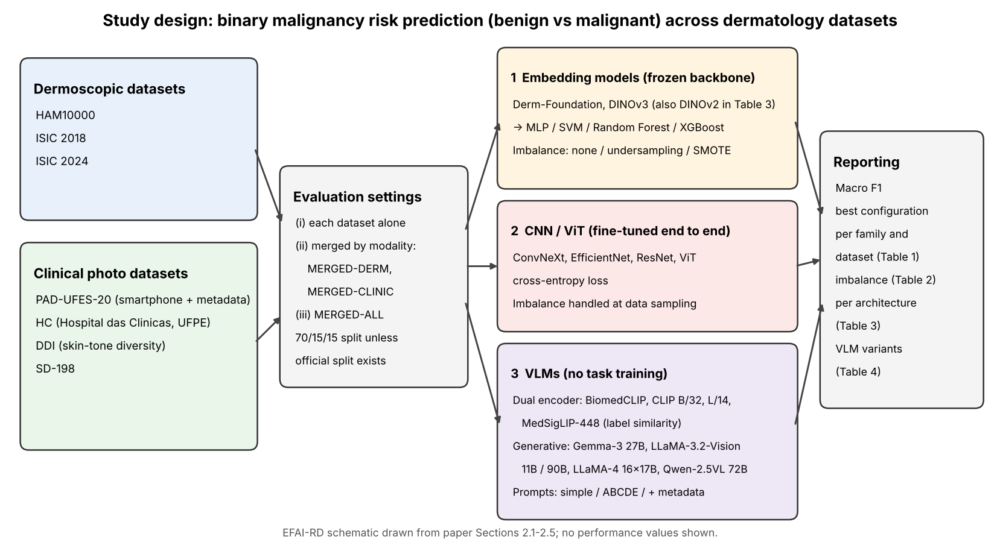

[Home](../) · [AI Papers](./)

# 皮膚病灶良惡性分類：零樣本 VLM、微調 CNN 與凍結特徵，在十個資料設定下差多少？

## 來源

- 團隊：Centro de Informática, Universidade Federal de Pernambuco（UFPE，巴西）與 Hospital das Clinicas, Ebserh, UFPE；共 11 位作者：Emanoel dos Santos、Kelvin Cunha、Rodrigo Mota、Fabio Papais、Thales Bezerra、Natalia Lopes、Erico Medeiros、Shirley Cruz、Jessica Araujo、Paulo Borba、Tsang Ing Ren（Shirley Cruz 與 Jessica Araujo 隸屬 Hospital das Clinicas，其餘隸屬 Centro de Informática）。[(ref: main)](https://arxiv.org/html/2610.03193v1)
- 論文：*Bridging Research and Practice: A Systematic Evaluation of Generalist and Dermatology-Specific Models in Clinical Skin Lesion Classification*，arXiv v1，2026；arXiv 頁面註記為 MICCAI 2026 接受論文、10 頁、1 張圖、3 張表。[(ref: abstract)](https://arxiv.org/abs/2610.03193)
- 識別碼：[arXiv:2610.03193](https://arxiv.org/abs/2610.03193)；[DOI: 10.48550/arXiv.2610.03193](https://doi.org/10.48550/arXiv.2610.03193)。
- 全文：[arXiv HTML v1](https://arxiv.org/html/2610.03193v1)；作者公開的程式碼：[TIC-13/derm-bench](https://github.com/TIC-13/derm-bench)。
- 研究性質：完整的基準比較研究，不提出新方法；VLM 全部以不做任務訓練的方式評估，其餘兩類模型則在各資料集上訓練。全文沒有信賴區間、標準差或重複實驗。[(ref: main §2.2)](https://arxiv.org/html/2610.03193v1#S2.SS2) [(ref: main §3)](https://arxiv.org/html/2610.03193v1#S3)
- 證據邊界：本文依 arXiv v1 全文第 1 至 4 節與 Table 1–4 撰寫；arXiv 頁面註記 3 張表，HTML 版呈現 4 張，本文引用 HTML 版的 4 張。各資料集測試集筆數不在論文中，本文引用作者程式碼庫 README 的數字並標明出處。論文 Figure 1 為病灶照片，本文未轉載；流程圖為本書庫自繪。

**編輯：** Clare

這篇 MICCAI 2026 論文在七個公開皮膚鏡與臨床照片資料集及三個合併集上比較三類模型，零樣本 VLM 在十個資料設定的最佳 Macro F1 平均為 0.6587，明顯低於微調 CNN／ViT 的 0.8659 與凍結特徵加分類器的 0.8874；但這是「不訓練的 VLM 對上有訓練的模型」，且各設定沒有不確定性估計，讀它時要看清比較條件。[(ref: main Table 1)](https://arxiv.org/html/2610.03193v1#S3.T1)

## 流程

圖：本書庫依論文第 2.1 至 2.5 節繪製的研究設計示意圖，不含成效數值。左側是資料，中間是三種評估設定與三類模型，右側是論文 Table 1–4 的回報方式。[(ref: main §2)](https://arxiv.org/html/2610.03193v1#S2)

## 背景／問題

作者的出發點是：大型基礎模型與 vision-language model（VLM）的廣泛預訓練，被認為可能比傳統的任務專用卷積網路有更好的泛化與脈絡推理，因此在皮膚科任務上愈來愈常被採用，有時只做很少的領域調整。[(ref: main §1)](https://arxiv.org/html/2610.03193v1#S1) 論文引用 MedGemma 技術報告與一篇皮膚科基礎模型基準作為這股熱潮的背景，但「VLM 在皮膚科泛化較好」本身是作者要檢驗的對象，不是論文提供證據支持的事實。

作者要問的是反面：在策劃好的基準上表現好，不保證換了模態、資料集或族群還可靠；新一代大型架構到底有沒有在皮膚科勝過專用模型，或是帶來新的失效。[(ref: main §1)](https://arxiv.org/html/2610.03193v1#S1)

需要先說清楚的是，摘要與引言都提到分布偏移與跨資料集測試，但論文實際回報的四張表都是在同一資料集（或同一合併集）內切分訓練與測試，沒有「在 A 訓練、在 B 測試」的結果。[(ref: main Abstract)](https://arxiv.org/html/2610.03193v1#abstract1) [(ref: main §3)](https://arxiv.org/html/2610.03193v1#S3) 因此本篇能回答的是「在各自資料上，三類模型的分數差多少」，不是「模型換到別家資料後還剩多少」。

## 方法摘要

任務是單張皮膚病灶影像的二元惡性風險預測（良性 0、惡性 1）。資料涵蓋三個皮膚鏡資料集（HAM10000、ISIC 2018、ISIC 2024）與四個臨床照片資料集（PAD-UFES-20、HC、DDI、SD-198），另外組成 MERGED-DERM、MERGED-CLINIC 與 MERGED-ALL 三個合併集。[(ref: main §2.1)](https://arxiv.org/html/2610.03193v1#S2.SS1) [(ref: main §2.4)](https://arxiv.org/html/2610.03193v1#S2.SS4)

比較的三類模型是：以 Derm-Foundation、DINOv3 等凍結骨幹抽特徵，再訓練 MLP、SVM、Random Forest 或 XGBoost 的 embedding 模型；端到端微調的 ConvNeXt、EfficientNet、ResNet 與 ViT；以及不做任務訓練、只用提示詞或圖文相似度判斷的 VLM。[(ref: main §2.2)](https://arxiv.org/html/2610.03193v1#S2.SS2)

評估以 Macro F1 為主，每個模型家族在每個資料設定取表現最好的組態後比較；另外比較三種類別不平衡處理、架構層級的平均，以及 VLM 的四種推論方式。[(ref: main §2.5)](https://arxiv.org/html/2610.03193v1#S2.SS5) [(ref: main §3)](https://arxiv.org/html/2610.03193v1#S3)

## 方法詳解

- **資料切分** — 各模型使用相同的訓練／測試切分，原始資料集有官方切分時沿用，否則採 70/15/15；影像只做標準化的縮放與正規化，作者表示沒有跨資料集的測試資料洩漏。合併集是在影像層級合併、保留原始標籤。[(ref: main §2.1)](https://arxiv.org/html/2610.03193v1#S2.SS1)
- **Embedding 模型** — 骨幹凍結，對所有樣本計算影像嵌入，再訓練下游分類器（MLP、SVM、Random Forest、XGBoost）。作者的用意是把表徵學習與分類分開，讓不同骨幹可以一致比較。[(ref: main §2.2)](https://arxiv.org/html/2610.03193v1#S2.SS2)
- **CNN／ViT** — ConvNeXt、EfficientNet、ResNet、ViT 在各資料集上以 cross-entropy 端到端微調。[(ref: main §2.2)](https://arxiv.org/html/2610.03193v1#S2.SS2)
- **VLM 的四種推論方式** — Simple prompt：system prompt 設定模型為皮膚科專家，只能輸出單一標籤。ABCDE-guided prompt：在 system prompt 加入 ABCDE 準則與「ugly duckling」徵象的檢查清單，要求模型默默套用。Metadata-augmented prompt：資料集有結構化病人資料時一併提供。Dual-encoder：影像與兩個類別標籤分別編碼，以相似度選類別，不生成文字。[(ref: main §2.3)](https://arxiv.org/html/2610.03193v1#S2.SS3)
- **受測 VLM** — Dual-encoder 為 BiomedCLIP、CLIP ViT-B/32、CLIP ViT-L/14、MedSigLIP-448；生成式為 Gemma-3 27B、LLaMA-3.2-Vision 11B 與 90B、LLaMA-4（16×17B）、Qwen-2.5VL 72B。[(ref: main §2.2)](https://arxiv.org/html/2610.03193v1#S2.SS2)
- **類別不平衡** — 比較不處理、random undersampling 與 SMOTE oversampling；embedding 管線在訓練分類器時處理，CNN／ViT 在資料抽樣階段處理。[(ref: main §2.5)](https://arxiv.org/html/2610.03193v1#S2.SS5)
- **指標與彙總** — 作者表示因類別不平衡、以及偽陽性與偽陰性在惡性預測中都重要，以 F1 為主要討論指標；Table 1–3 標為 Macro F1，Table 4 只標 F1。每個家族在每個資料設定取「最佳組態」進入家族比較。[(ref: main §2.5)](https://arxiv.org/html/2610.03193v1#S2.SS5) [(ref: main Table 4)](https://arxiv.org/html/2610.03193v1#S3.T4)
- **論文未交代** — CNN／ViT 與 MLP 的學習率、訓練輪數、輸入解析度與資料增強；提示詞全文、VLM 輸出如何解析成標籤、無效輸出如何計分；metadata 提示用了哪些病人欄位；「最佳組態」是依驗證集還是測試集挑選；各資料集與合併集的測試筆數；Table 1 中 DDI、HAM10000、SD-198 與三個合併集的 VLM 數值來自哪個模型與哪種推論方式（Table 4 只涵蓋四個有 metadata 的資料集）；Table 3 的「平均」實際如何計算（見「限制」）；第 3.3 節說 DINO 架構經 fine-tuning 再提升，但正文沒有對應的實驗設定。[(ref: main §2)](https://arxiv.org/html/2610.03193v1#S2) [(ref: main §3.3)](https://arxiv.org/html/2610.03193v1#S3.SS3) 作者的程式碼庫 README 列出各資料集的切分筆數，並自述部分管線需使用者自行補上資料格式轉換、VLM 專案的部分 import 路徑可能需要調整。[(ref: code)](https://github.com/TIC-13/derm-bench)

## 資料與實驗

下表整理七個公開資料集。模態與用途依論文第 2.4 節；測試筆數不在論文中，取自作者程式碼庫 README。[(ref: main §2.4)](https://arxiv.org/html/2610.03193v1#S2.SS4) [(ref: code)](https://github.com/TIC-13/derm-bench)

| 資料集 | 模態（論文分類） | 論文描述的特點 | README：使用影像數 | README：測試筆數 |
|---|---|---|---|---|
| HAM10000 | 皮膚鏡 | 皮膚鏡基準 | 10,015 | 1,251 |
| ISIC 2018 | 皮膚鏡 | 皮膚鏡基準 | 11,720 | 1,512 |
| ISIC 2024 | 皮膚鏡 | 皮膚鏡基準 | 1,000（原始 401,059） | 150 |
| PAD-UFES-20 | 臨床照片 | 智慧型手機影像，附結構化病人資料 | 2,298 | 288 |
| HC | 臨床照片 | 真實臨床條件下的異質拍攝 | 2,507（原始 5,918） | 377 |
| DDI | 臨床照片 | 為膚色多樣性與公平性評估設計 | 371（原始 656） | 27 |
| SD-198 | 臨床照片 | 涵蓋多種皮膚疾病 | 552（原始 6,583） | 83 |

README 另外說明：使用影像數少於原始總數，是因為缺少標籤或（ISIC 2024）類別極度不平衡；HAM10000 因等同於 ISIC 2018 的訓練集而未放入合併集；SD-198 在 README 的資料集清單標為 dermoscopic，但被併入 MERGED-CLINIC。[(ref: code)](https://github.com/TIC-13/derm-bench)

下表重製論文 Table 1：各模型家族在每個資料設定的最佳 Macro F1。[(ref: main Table 1)](https://arxiv.org/html/2610.03193v1#S3.T1)

| Dataset | VLM | CNN/ViT | Embeddings |
|---|---|---|---|
| PAD | 0.7671 | 0.9162 | 0.9343 |
| HC | 0.6123 | 0.8281 | 0.8760 |
| ISIC18 | 0.6026 | 0.8509 | 0.8738 |
| ISIC24 | 0.7048 | 0.8444 | 0.8333 |
| DDI | 0.6667 | 0.9112 | 0.8712 |
| HAM10000 | 0.5622 | 0.8859 | 0.9043 |
| SD-198 | 0.8426 | 0.8552 | 0.9638 |
| MERGED-ALL | 0.6114 | 0.8664 | 0.8783 |
| MERGED-CLINIC | 0.6375 | 0.8624 | 0.8888 |
| MERGED-DERM | 0.5794 | 0.8384 | 0.8503 |
| Average F1 | 0.6587 | 0.8659 | 0.8874 |

下表重製論文 Table 3：各架構在三類評估設定的「Average Macro Best F1」。論文說這是各資料集最佳 F1 的平均，但數值與此說法不一致，見「限制」。[(ref: main Table 3)](https://arxiv.org/html/2610.03193v1#S3.T3)

| Architecture | Dermoscopic | Clinical | Merged-All |
|---|---|---|---|
| Derm-Foundation | 0.8308 | 0.8872 | 0.8714 |
| DINOv3 ViT-7B/16 | 0.8503 | 0.8888 | 0.8783 |
| DINOv2 Giant | 0.8383 | 0.8479 | 0.8641 |
| ConvNeXt (best) | 0.8373 | 0.8624 | 0.8619 |
| EfficientNet (best) | 0.8171 | 0.8218 | - |
| Best VLM (prompt-based) | 0.5794 | 0.6723 | 0.6114 |

下表重製論文 Table 4：四個有病人 metadata 的資料集上，各 VLM 推論方式的 F1。[(ref: main Table 4)](https://arxiv.org/html/2610.03193v1#S3.T4)

| Setting | Model | HC | PAD | ISIC18 | ISIC24 |
|---|---|---|---|---|---|
| Dual Encoder | BiomedCLIP | 0.3362 | 0.3951 | 0.3375 | 0.3041 |
| Dual Encoder | CLIP-B/32 | 0.5882 | 0.4866 | 0.5185 | 0.5382 |
| Dual Encoder | CLIP-L/14 | 0.3191 | 0.4866 | 0.1740 | 0.6116 |
| Dual Encoder | MedSigLIP | 0.5686 | 0.6387 | 0.4815 | 0.4755 |
| Prompt + ABCDE | Gemma-3 27B | 0.5313 | 0.5504 | 0.2040 | 0.7048 |
| Prompt + ABCDE | LLaMA-3.2V 11B | 0.3087 | 0.4090 | 0.1367 | 0.2823 |
| Prompt + ABCDE | LLaMA-3.2V 90B | 0.4962 | 0.5217 | 0.3725 | 0.5980 |
| Prompt + ABCDE | LLaMA-4 16×17B | 0.6123 | 0.6476 | 0.1632 | 0.4494 |
| Prompt + ABCDE | Qwen-2.5VL 72B | 0.5175 | 0.6213 | 0.4243 | 0.6088 |
| Prompt + Metadata | Gemma-3 27B | 0.4693 | 0.7381 | 0.3203 | 0.6127 |
| Prompt + Metadata | LLaMA-3.2V 11B | 0.4756 | 0.4290 | 0.2010 | 0.2823 |
| Prompt + Metadata | LLaMA-3.2V 90B | 0.3003 | 0.4398 | 0.2174 | 0.3650 |
| Prompt + Metadata | LLaMA-4 16×17B | 0.3099 | 0.4141 | 0.2482 | 0.4168 |
| Prompt + Metadata | Qwen-2.5VL 72B | 0.4693 | 0.7671 | 0.6026 | 0.5507 |
| Prompt (Simple) | Gemma-3 27B | 0.4930 | 0.5685 | 0.3716 | 0.6451 |
| Prompt (Simple) | LLaMA-3.2V 11B | 0.5357 | 0.6835 | 0.5524 | 0.4744 |
| Prompt (Simple) | LLaMA-3.2V 90B | 0.4356 | 0.3662 | 0.4197 | 0.4457 |
| Prompt (Simple) | LLaMA-4 16×17B | 0.3454 | 0.3483 | 0.3093 | 0.3967 |
| Prompt (Simple) | Qwen-2.5VL 72B | 0.4872 | 0.5035 | 0.5680 | 0.5644 |

類別不平衡處理（論文 Table 2，embedding 模型）的十個設定平均為：不處理 0.8816、undersampling 0.8586、SMOTE 0.8698。[(ref: main Table 2)](https://arxiv.org/html/2610.03193v1#S3.T2)

## 結果

- **VLM 在十個設定都排最後** — Table 1 每一列中 VLM 的最佳分數都是三類最低；平均 0.6587，對上 CNN／ViT 0.8659 與 embedding 0.8874。Embedding 在 10 個設定中有 8 個最高，ISIC24 與 DDI 則是 CNN／ViT 較高。[(ref: main Table 1)](https://arxiv.org/html/2610.03193v1#S3.T1) 正文把 embedding 平均寫成 88.6%，與 Table 1 的 0.8874 有些微出入，本文以表格為準。[(ref: main §3.1)](https://arxiv.org/html/2610.03193v1#S3.SS1)
- **差距最小的是 SD-198** — VLM 0.8426 對 CNN／ViT 0.8552，但 embedding 達 0.9638；差距最大的是 HAM10000，VLM 0.5622 對 embedding 0.9043。[(ref: main Table 1)](https://arxiv.org/html/2610.03193v1#S3.T1) 依程式碼庫 README，SD-198 的測試集只有 83 筆。[(ref: code)](https://github.com/TIC-13/derm-bench)
- **合併資料沒有改變排序** — 三個合併集上排序仍是 embedding、CNN／ViT、VLM，作者據此認為資料多樣性本身補不了架構與任務的不對齊。[(ref: main §3.1)](https://arxiv.org/html/2610.03193v1#S3.SS1)
- **不處理不平衡反而平均最好** — 不處理的平均 0.8816 最高；undersampling 在 DDI 由 0.8224 升到 0.8712，SMOTE 則讓 ISIC24 由 0.8313 降到 0.7955、SD-198 由 0.9638 降到 0.9396。作者提醒重抽樣可能在不經意間改變對惡性病例的敏感度，部署前要逐一驗證。[(ref: main §3.2)](https://arxiv.org/html/2610.03193v1#S3.SS2) [(ref: main Table 2)](https://arxiv.org/html/2610.03193v1#S3.T2)
- **通用自監督特徵追得上皮膚科專用特徵** — Table 3 中 DINOv3 ViT-7B/16 在三類設定都等於或高於 Derm-Foundation（0.8503 對 0.8308、0.8888 對 0.8872、0.8783 對 0.8714）。作者的解讀是差異主要來自表徵品質，而非模型規模。[(ref: main Table 3)](https://arxiv.org/html/2610.03193v1#S3.T3) [(ref: main §3.3)](https://arxiv.org/html/2610.03193v1#S3.SS3)
- **生物醫學預訓練的 dual-encoder 不一定比較好** — BiomedCLIP 在四個資料集都低於 MedSigLIP 與 CLIP-B/32；CLIP-L/14 的分數則在 0.1740 到 0.6116 之間大幅擺盪。作者的整體解讀是 dual-encoder 比生成式提示穩定，判別式的圖文對齊對提示設計較不敏感。[(ref: main Table 4)](https://arxiv.org/html/2610.03193v1#S3.T4) [(ref: main §3.4)](https://arxiv.org/html/2610.03193v1#S3.SS4)
- **提示詞與 metadata 的效果因模型而異** — ABCDE 提示讓 Gemma-3 27B 在 ISIC24 達到 0.7048，卻在 ISIC18 只有 0.2040；加入 metadata 讓 Qwen-2.5VL 72B 在 PAD 由 0.5035 升到 0.7671，但 LLaMA-4 在 HC 由 ABCDE 的 0.6123 降到 0.3099。作者的結論是改善「不一致且高度依模型而定」。[(ref: main Table 4)](https://arxiv.org/html/2610.03193v1#S3.T4) [(ref: main §3.4)](https://arxiv.org/html/2610.03193v1#S3.SS4)
- **錯誤案例的形態重疊** — 質性分析中，部分良性病灶有不規則邊界、顏色不均與部分不對稱，部分惡性病灶反而對稱、顏色變化少；作者認為只看影像的二元判斷本身就有模糊的決策邊界。[(ref: main §3.5)](https://arxiv.org/html/2610.03193v1#S3.SS5) [(ref: main Figure 1)](https://arxiv.org/html/2610.03193v1#S3.F1)

## 限制

- **只看影像的二元標籤本身有天花板（作者自述）** — 臨床判斷還會用到年齡、部位、病灶變化、症狀與病史，缺少這些資訊可能解釋高容量模型仍有的錯誤。[(ref: main §3.5)](https://arxiv.org/html/2610.03193v1#S3.SS5)
- **VLM 結果反映的是未做任務調整（作者自述）** — 作者明言這些結果不代表 VLM 的內在限制，而是凸顯任務專用調整與適當訓練的重要。[(ref: main §3.4)](https://arxiv.org/html/2610.03193v1#S3.SS4)
- **本書庫補充：比較條件不對稱** — VLM 完全沒有用到訓練集，另外兩類則在每個資料集上訓練並挑最佳組態；Table 1 的差距是「零樣本對上有監督訓練」的差距，不能直接讀成 VLM 架構不適合皮膚科。論文沒有對 VLM 做微調或少樣本的對照。[(ref: main §2.2)](https://arxiv.org/html/2610.03193v1#S2.SS2)
- **本書庫補充：沒有跨資料集測試** — 摘要與引言提到分布偏移與跨資料集測試，但四張表都是同資料集內切分；「換到別家資料還剩多少」這個問題，本論文沒有回答。[(ref: main Abstract)](https://arxiv.org/html/2610.03193v1#abstract1) [(ref: main §1)](https://arxiv.org/html/2610.03193v1#S1)
- **本書庫補充：沒有不確定性，部分測試集很小** — 全文沒有信賴區間或重複實驗；依程式碼庫 README，DDI 測試集 27 筆、SD-198 83 筆、ISIC 2024 150 筆，這些設定上幾個百分點的差異不宜解讀。DDI 是論文中負責膚色公平性的資料集，但論文沒有依膚色分組回報結果。[(ref: main §2.4)](https://arxiv.org/html/2610.03193v1#S2.SS4) [(ref: code)](https://github.com/TIC-13/derm-bench)
- **本書庫補充：「最佳組態」的挑選方式未說明** — 每個家族在每個設定取最高分，若是在測試集上挑選，Table 1 對 embedding 與 CNN／ViT（組態較多）會偏樂觀。[(ref: main §2.5)](https://arxiv.org/html/2610.03193v1#S2.SS5)
- **本書庫補充：Table 3 與其說明不一致** — 論文說 Table 3 是各類別資料集最佳 F1 的平均，但 DINOv3 一列的三個數值恰好等於 Table 1 中 MERGED-DERM、MERGED-CLINIC、MERGED-ALL 的 embedding 分數；Best VLM 的皮膚鏡欄 0.5794 也等於 MERGED-DERM 的單一數值，而依 Table 1 四個皮膚鏡設定的 VLM 平均應為 0.6123。正文說 EfficientNet 在臨床資料集最穩健，但它在 Table 3 臨床欄是非 VLM 架構中最低的 0.8218。本文照錄原表，不自行重算。[(ref: main Table 3)](https://arxiv.org/html/2610.03193v1#S3.T3) [(ref: main §3.3)](https://arxiv.org/html/2610.03193v1#S3.SS3) [(ref: main Table 1)](https://arxiv.org/html/2610.03193v1#S3.T1)
- **本書庫補充：資料集之間並非完全獨立** — 依程式碼庫 README，HAM10000 等同於 ISIC 2018 的訓練集，因此 Table 1 中這兩列不是兩個獨立樣本；SD-198 的模態在論文與 README 之間標示不一。[(ref: code)](https://github.com/TIC-13/derm-bench)

## 與書庫其他文章的關係

膀胱鏡研究把通用多模態 LLM 搭配提示詞與棄答門檻用在單一內視鏡任務上，本篇則在七個皮膚科資料集上把同類零樣本 VLM 與有訓練的專用模型並排，顯示沒有任務調整時差距有多大: [膀胱鏡影像交給通用多模態 LLM：提示詞與棄答門檻能換到多少可靠度？](2026-09-21-mllm-cystoscopy-bladder-triage.md)

胸片結核篩檢稽核用換評估條件的方式檢驗 MedSigLIP 等醫療 VLM 的結論是否站得住，本篇同樣評估了 MedSigLIP，但比較的是同資料集內三類模型的分數，沒有做跨資料集測試: [稽核胸片結核篩檢的醫療 VLM：換一個評估條件，哪一種結論還站得住？](2026-09-21-cxr-tb-vlm-portability-audit.md)

跨基準盤點顯示醫療 VLM 在多套問答基準上的進展，本篇提供一個對照點：在皮膚病灶良惡性這種單一分類任務上，零樣本 VLM 仍落後有訓練的影像模型二十多個 F1 點: [醫療 VLM 走了多遠？七套基準下的模型規模、領域微調與推理落差](2026-09-15-medical-vlm-benchmark.md)

## 實務的啟發

這篇論文的證據是同資料集內、沒有不確定性估計的單次比較，且 VLM 與其他模型的訓練條件不對等；它能支持的是「零樣本 VLM 不能直接拿來做皮膚病灶良惡性分類」這個警訊，不能支持「VLM 不適合皮膚科」或「某個骨幹最好」這類結論。

第一，評估 VLM 時要把對照組設對。如果要回答「VLM 能不能取代專用分類器」，至少需要一組在同樣訓練資料上微調或少樣本調整過的 VLM；本篇只回答了「完全不訓練時差多少」。本書庫認為，這個差距可以當作導入零樣本 VLM 前的保守下限參考，但具體數字要在自己的資料上重新量。

第二，凍結特徵加簡單分類器是值得先試的基準線。論文中 DINOv3 這類通用自監督特徵在三類設定上不輸皮膚科專用的 Derm-Foundation，而這類管線不需要端到端微調；這是單一研究、單次切分的觀察，Table 3 的計算方式也有疑點，需要在其他資料與跨院測試中確認。[(ref: main Table 3)](https://arxiv.org/html/2610.03193v1#S3.T3)

第三，讀皮膚科 AI 的分數時，先看測試集大小與資料集是否獨立。像 DDI 27 筆這種規模，F1 的波動可能比模型之間的差距還大；HAM10000 與 ISIC 2018 的重疊也提醒，多個資料集的平均不一定等於多個獨立驗證。[(ref: code)](https://github.com/TIC-13/derm-bench)

第四，提示詞與病人資料對生成式 VLM 的效果高度依模型而定。如果仍要用 VLM 做輔助判讀，提示詞版本、輸入欄位與模型版本都應視為系統設定的一部分，換一個就重新驗證，而不是把某一組提示詞的改善當成通則。[(ref: main Table 4)](https://arxiv.org/html/2610.03193v1#S3.T4)

## References

- `main`：[Bridging Research and Practice: A Systematic Evaluation of Generalist and Dermatology-Specific Models in Clinical Skin Lesion Classification，arXiv HTML v1](https://arxiv.org/html/2610.03193v1)；本文使用 [Abstract](https://arxiv.org/html/2610.03193v1#abstract1)、[§1 Introduction](https://arxiv.org/html/2610.03193v1#S1)、[§2 Methodology](https://arxiv.org/html/2610.03193v1#S2)、[§2.1 Problem Formulation](https://arxiv.org/html/2610.03193v1#S2.SS1)、[§2.2 Model Families](https://arxiv.org/html/2610.03193v1#S2.SS2)、[§2.3 VLMs variations](https://arxiv.org/html/2610.03193v1#S2.SS3)、[§2.4 Datasets](https://arxiv.org/html/2610.03193v1#S2.SS4)、[§2.5 Class Imbalance and metrics](https://arxiv.org/html/2610.03193v1#S2.SS5)、[§3 Results](https://arxiv.org/html/2610.03193v1#S3)、[§3.1 Overall Performance Across Datasets](https://arxiv.org/html/2610.03193v1#S3.SS1)、[§3.2 Impact of Class Imbalance](https://arxiv.org/html/2610.03193v1#S3.SS2)、[§3.3 Architectures validation](https://arxiv.org/html/2610.03193v1#S3.SS3)、[§3.4 VLMs Variations](https://arxiv.org/html/2610.03193v1#S3.SS4)、[§3.5 Qualitative Analysis](https://arxiv.org/html/2610.03193v1#S3.SS5)、[Table 1](https://arxiv.org/html/2610.03193v1#S3.T1)、[Table 2](https://arxiv.org/html/2610.03193v1#S3.T2)、[Table 3](https://arxiv.org/html/2610.03193v1#S3.T3)、[Table 4](https://arxiv.org/html/2610.03193v1#S3.T4)、[Figure 1](https://arxiv.org/html/2610.03193v1#S3.F1)。
- `abstract`：[arXiv:2610.03193](https://arxiv.org/abs/2610.03193)。
- `doi`：[10.48550/arXiv.2610.03193](https://doi.org/10.48550/arXiv.2610.03193)。
- `code`：[TIC-13/derm-bench（作者公開的程式碼庫，README 的資料集切分與已知限制）](https://github.com/TIC-13/derm-bench)。

[Home](../) · [AI Papers](./)
