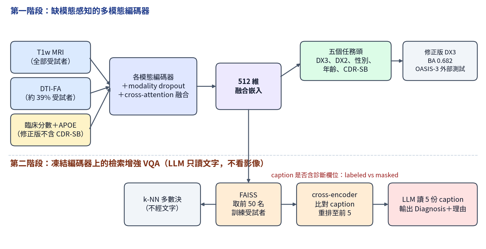

[Home](../) · [AI Papers](./)

# 阿茲海默症分期的 VLM：caption 拿掉診斷欄位後，MEMOIR-VLM 的 LLM 還贏得過 k-NN 嗎？

## 來源

- 團隊：Imaging Genetics Center, Mark and Mary Stevens Neuroimaging and Informatics Institute, Keck School of Medicine, University of Southern California；作者 Sohail Haresh Gidwani、Tamoghna Chattopadhyay（通訊作者）、Sophia I. Thomopoulos、Paul M. Thompson，代表 Alzheimer's Disease Neuroimaging Initiative（ADNI）發表。[(ref: main)](https://www.frontiersin.org/journals/computational-neuroscience/articles/10.3389/fncom.2026.1902258/full)
- 論文：*MEMOIR-VLM—a multimodal vision-language model for Alzheimer's disease classification and question answering*，Frontiers in Computational Neuroscience 20:1902258，2026 年 10 月 1 日刊出（2026-06-07 收稿、2026-08-27 接受），CC BY 授權。[(ref: main)](https://www.frontiersin.org/journals/computational-neuroscience/articles/10.3389/fncom.2026.1902258/full)
- 識別碼：[DOI: 10.3389/fncom.2026.1902258](https://doi.org/10.3389/fncom.2026.1902258)。
- 全文：[Frontiers 全文 HTML](https://www.frontiersin.org/journals/computational-neuroscience/articles/10.3389/fncom.2026.1902258/full)；資料為公開的 [ADNI](https://adni.loni.usc.edu) 與 OASIS-3。作者表示模型權重放在 Hugging Face Model Hub，但正文沒有給出模型頁或程式碼庫網址。[(ref: main §3.6)](https://www.frontiersin.org/journals/computational-neuroscience/articles/10.3389/fncom.2026.1902258/full#s3)
- 研究性質：完整研究，非 pilot；編碼器與檢索增強 VQA 兩個階段都已實作並報數，含 474 人內部測試與 1,048 人外部測試。模型只訓練一次，信賴區間只反映測試集抽樣變異，不含訓練種子變異（作者自述）。[(ref: main §4.11)](https://www.frontiersin.org/journals/computational-neuroscience/articles/10.3389/fncom.2026.1902258/full#s4) [(ref: main §6)](https://www.frontiersin.org/journals/computational-neuroscience/articles/10.3389/fncom.2026.1902258/full#s6)
- 證據邊界：本文依 Frontiers 全文 HTML 第 1 至 7 節與 Table 2–21、Figure 2–4 撰寫；論文的補充材料（含提示詞全文與輸出範例）未納入本文引述。流程圖為本書庫依論文第 3 節自繪。

**編輯：** Clare

這篇論文把 T1w MRI、DTI-FA 與臨床分數接成一個可缺模態的編碼器，再在上面疊一層檢索增強 VQA；最值得讀的是作者自己拆掉的兩個洩漏：把 CDR-SB 從輸入移除後三分類 balanced accuracy 由 0.707 降到 0.682，把檢索 caption 裡的診斷欄位遮住後，沒有任何 LLM 超過純檢索 k-NN 多數決的 0.673。[(ref: main Table 10)](https://www.frontiersin.org/journals/computational-neuroscience/articles/10.3389/fncom.2026.1902258/full#T10) [(ref: main §4.5)](https://www.frontiersin.org/journals/computational-neuroscience/articles/10.3389/fncom.2026.1902258/full#s4)

## 流程

圖：本書庫依論文第 3.1 至 3.4 節繪製的兩階段示意圖。右上方的 0.682 是論文 Table 10 修正版模型的三分類 balanced accuracy；下方 k-NN 與 LLM 兩條路徑的比較見「結果」。[(ref: main §3)](https://www.frontiersin.org/journals/computational-neuroscience/articles/10.3389/fncom.2026.1902258/full#s3) [(ref: main Figure 3)](https://www.frontiersin.org/journals/computational-neuroscience/articles/10.3389/fncom.2026.1902258/full#F3)

## 背景／問題

作者的出發點有兩個。其一，他們認為多數阿茲海默症（Alzheimer's disease, AD）深度學習研究是單一模態分類、沒有自然語言互動，並在 Table 1 列出 MedBLIP、ADLIP、VisTA、REMEMBER、BRAINS 五個相關系統，說明沒有一個同時具備缺模態處理、多任務預測、自然語言輸出與病例檢索。[(ref: main §1)](https://www.frontiersin.org/journals/computational-neuroscience/articles/10.3389/fncom.2026.1902258/full#s1) [(ref: main Table 1)](https://www.frontiersin.org/journals/computational-neuroscience/articles/10.3389/fncom.2026.1902258/full#T1) 這是作者對文獻的定位，作者也明說貢獻在「能力的整合」而非方法上的新發明。

其二是缺資料：DTI 掃描時間長、對動作敏感，常不在常規流程中；認知量表的完成度也不一。以生成模型補出缺的影像會帶來幻覺風險，只用完整資料的受試者又會縮小樣本，作者因此希望一組權重就能處理任何可用的模態組合。[(ref: main §1)](https://www.frontiersin.org/journals/computational-neuroscience/articles/10.3389/fncom.2026.1902258/full#s1)

讀這篇時要帶著的問題是：在 ADNI 這種診斷本身部分由認知評估決定的資料上，影像與 LLM 各自到底貢獻了多少？作者在第 6 節也承認，只要輸入含 MMSE、ADAS 等認知分數，模型就拿得到診斷的代理資訊。[(ref: main §6)](https://www.frontiersin.org/journals/computational-neuroscience/articles/10.3389/fncom.2026.1902258/full#s6)

## 方法摘要

第一階段是缺模態感知的多模態編碼器：T1w MRI 與 DTI-FA 各用一個 3D ResNet-18，臨床分數用 MLP，三者各輸出 512 維嵌入，經 8-head cross-attention 融合。訓練時以固定機率隨機遮掉模態（modality dropout），讓同一組權重能處理七種非空模態組合。先以 CLIP 式 InfoNCE 做跨模態對比預訓練，再以多任務目標微調，同時預測三分類診斷（CN／MCI／Dementia，DX3）、CN 對 Dementia 二分類（DX2）、性別、年齡與 CDR-SB。[(ref: main §3.2)](https://www.frontiersin.org/journals/computational-neuroscience/articles/10.3389/fncom.2026.1902258/full#s3) [(ref: main Figure 2)](https://www.frontiersin.org/journals/computational-neuroscience/articles/10.3389/fncom.2026.1902258/full#F2)

第二階段凍結編碼器，做檢索增強的 VQA：用融合嵌入在 1,889 名訓練受試者中找最相似的人，cross-encoder 依 caption 文字重排後取前 5 名，把這 5 份 caption 交給 Mistral-7B-Instruct-v0.3 輸出診斷與理由。LLM 從頭到尾不讀影像，只讀文字。[(ref: main §3.4)](https://www.frontiersin.org/journals/computational-neuroscience/articles/10.3389/fncom.2026.1902258/full#s3)

評估包含三組對照：七種模態組合的推論時遮罩消融、caption 含不含診斷欄位（labeled／masked）兩種設定，以及兩層 MLP、AutoGluon 等只用臨床分數的基準線；另在 OASIS-3 做不重新訓練的外部測試。[(ref: main §3.5)](https://www.frontiersin.org/journals/computational-neuroscience/articles/10.3389/fncom.2026.1902258/full#s3) [(ref: main §4.10)](https://www.frontiersin.org/journals/computational-neuroscience/articles/10.3389/fncom.2026.1902258/full#s4)

## 方法詳解

- **影像前處理** — T1w 做 bias field correction、去顱骨、以 9 自由度轉換對齊到內部模板，重取樣為 2 mm 等向（91 × 109 × 91），強度正規化到 [0, 1]；DTI 依 ADNI 調和流程處理，以 FSL DTIFIT 擬合後取 FA，並對齊到 ENIGMA TBSS 模板。[(ref: main §2.3–2.4)](https://www.frontiersin.org/journals/computational-neuroscience/articles/10.3389/fncom.2026.1902258/full#s2)
- **臨床輸入與 CDR-SB 洩漏** — 原始版本把 CDR-SB 同時當輸入與回歸目標；修正版移除輸入中的 CDR-SB，臨床輸入改為 ADAS-11、ADAS-13、MMSE、MoCA 與 APOE 基因型，CDR-SB 只保留為預測目標。個別缺值的分數以族群平均補值，影像模態則靠遮罩而不補值。[(ref: main §2.2)](https://www.frontiersin.org/journals/computational-neuroscience/articles/10.3389/fncom.2026.1902258/full#s2) [(ref: main §3.5.2)](https://www.frontiersin.org/journals/computational-neuroscience/articles/10.3389/fncom.2026.1902258/full#s3) [(ref: main Table 10)](https://www.frontiersin.org/journals/computational-neuroscience/articles/10.3389/fncom.2026.1902258/full#T10)
- **Modality dropout** — 訓練時 T1w、DTI-FA、臨床分數分別以 10%、30%、5% 的機率被遮掉；推論時遮罩直接反映該受試者實際有的模態。[(ref: main Table 7)](https://www.frontiersin.org/journals/computational-neuroscience/articles/10.3389/fncom.2026.1902258/full#T7)
- **訓練設定** — 兩階段都用 AdamW（weight decay 0.01）、batch size 16、cosine annealing；對比預訓練 learning rate 1 × 10⁻⁴、30 epoch；多任務微調時 backbone 1 × 10⁻⁵、任務頭 5 × 10⁻⁴，訓練 30 epoch 取第 5 epoch 的 checkpoint。DX3 與 DX2 用 Focal Loss（γ = 2，權重 3.0 與 1.0），性別用 cross-entropy（1.0），年齡與 CDR-SB 用正規化後的 Smooth L1（各 0.5）。[(ref: main Table 5)](https://www.frontiersin.org/journals/computational-neuroscience/articles/10.3389/fncom.2026.1902258/full#T5) [(ref: main Table 6)](https://www.frontiersin.org/journals/computational-neuroscience/articles/10.3389/fncom.2026.1902258/full#T6)
- **文字編碼器與 caption** — all-MiniLM-L6-v2 先在 26,889 句（1,889 句真實 caption 加 25,000 句合成）上做 masked language modeling，再凍結主幹、只訓練 384 → 512 的投影層，以 symmetric InfoNCE 對齊到融合嵌入。每位受試者的 caption 包含年齡、性別、診斷、MMSE、CDR-SB、ADAS 等分數、APOE 與可用的影像模態。[(ref: main §3.4.2)](https://www.frontiersin.org/journals/computational-neuroscience/articles/10.3389/fncom.2026.1902258/full#s3) [(ref: main Table 8)](https://www.frontiersin.org/journals/computational-neuroscience/articles/10.3389/fncom.2026.1902258/full#T8)
- **檢索與重排** — FAISS IndexFlatIP 以融合嵌入的 cosine 相似度取前 50 名；cross-encoder（ms-marco-MiniLM-L-6-v2）對前 20 名以 caption 兩兩評分，取前 5 名給 LLM。索引只含訓練受試者，測試者不會取回自己。[(ref: main §3.4.3)](https://www.frontiersin.org/journals/computational-neuroscience/articles/10.3389/fncom.2026.1902258/full#s3)
- **LLM 生成與解析** — Mistral-7B-Instruct-v0.3 以 4-bit NF4 量化載入；診斷提示詞要求輸出「Diagnosis: <CN|MCI|Dementia>」加一句理由，另有開放式的 captioning 提示詞。解析先用 regex 找固定格式，失敗時改用關鍵字首次出現，搜尋順序隨機化以避免類別位置偏誤。另以 Gemma 4 26B MoE 與 MedGemma 1.5 4B 作為替換的 LLM。[(ref: main §3.4.4)](https://www.frontiersin.org/journals/computational-neuroscience/articles/10.3389/fncom.2026.1902258/full#s3) [(ref: main Table 11)](https://www.frontiersin.org/journals/computational-neuroscience/articles/10.3389/fncom.2026.1902258/full#T11)
- **Labeled 與 masked caption** — 作者指出 caption 含診斷欄位時，標籤有兩條路可以直達答案：cross-encoder 依診斷字串重排、LLM 直接抄多數標籤。兩種設定使用完全相同的 FAISS 檢索，只差 caption 文字；masked 設定遮住所有 caption 的診斷欄位，作者稱之為貼近實際部署的設定。[(ref: main §3.4.5)](https://www.frontiersin.org/journals/computational-neuroscience/articles/10.3389/fncom.2026.1902258/full#s3)
- **統計** — 模態組合之間的配對差異以分層配對 bootstrap（10,000 次）算 95% CI，並以 McNemar exact test 檢定；比較 A（臨床 vs. DTI-FA＋臨床）為預先指定、不校正，B–E 以 Holm–Bonferroni 校正。[(ref: main §3.5.5)](https://www.frontiersin.org/journals/computational-neuroscience/articles/10.3389/fncom.2026.1902258/full#s3)
- **論文未交代** — 提示詞全文只在補充材料；模型權重與程式碼沒有網址；Table 4 寫臨床編碼器吃「6 個連續特徵」、Figure 2 與 Table 4 寫六個任務頭，但正文寫四個連續分數與五個任務頭；第 3.2.1 節把 amyloid status 列為不放入輸入的目標變數，Table 18 標題也寫「n = 100 for amyloid」，但第 6 節說目前沒有 amyloid 預測任務，全文也沒有 amyloid 結果；masked 設定只說遮住診斷欄位，沒有說明 caption 中的 CDR-SB 等分數是否保留；第 3.5.2 節描述的三組子集分析與「從頭只用影像訓練」的編碼器，正文沒有對應的結果表；第 4.10 節列出 Llama-3.2-3B 純文字基準線，但沒有報數；masked 設定的 LLM 結果只以內文數字呈現，沒有表格與各類別細項。[(ref: main Table 4)](https://www.frontiersin.org/journals/computational-neuroscience/articles/10.3389/fncom.2026.1902258/full#T4) [(ref: main §3.2)](https://www.frontiersin.org/journals/computational-neuroscience/articles/10.3389/fncom.2026.1902258/full#s3) [(ref: main Table 18)](https://www.frontiersin.org/journals/computational-neuroscience/articles/10.3389/fncom.2026.1902258/full#T18) [(ref: main §4.10)](https://www.frontiersin.org/journals/computational-neuroscience/articles/10.3389/fncom.2026.1902258/full#s4) [(ref: main §6)](https://www.frontiersin.org/journals/computational-neuroscience/articles/10.3389/fncom.2026.1902258/full#s6)

## 資料與實驗

ADNI 以受試者為單位、依診斷分層切成 80/20，每人只取最近一次掃描；OASIS-3 完全不參與訓練。[(ref: main §2.1–2.2)](https://www.frontiersin.org/journals/computational-neuroscience/articles/10.3389/fncom.2026.1902258/full#s2) [(ref: main Table 3)](https://www.frontiersin.org/journals/computational-neuroscience/articles/10.3389/fncom.2026.1902258/full#T3) [(ref: main §4.9)](https://www.frontiersin.org/journals/computational-neuroscience/articles/10.3389/fncom.2026.1902258/full#s4)

| 資料 | 受試者數 | 類別組成 | 有 DTI-FA | 用途 |
|---|---|---|---|---|
| ADNI 訓練集 | 1,889 | CN 669、MCI 650、Dementia 570 | 751（39.8%） | 預訓練、微調、檢索索引 |
| ADNI 測試集 | 474 | CN 168、MCI 163、Dementia 143 | 179（37.8%） | 內部測試；VQA 另取 150 人（每類 50） |
| OASIS-3 | 1,048 | CN 751、impaired 297 | 0 | 不重新訓練的外部測試 |

測試集平均年齡 75.5 ± 7.8 歲、男性 54.9%；訓練集 MMSE、ADAS-11、ADAS-13、APOE 的完整率約 89–92%，MoCA 為 63.9%。[(ref: main Table 2)](https://www.frontiersin.org/journals/computational-neuroscience/articles/10.3389/fncom.2026.1902258/full#T2) [(ref: main §2.2)](https://www.frontiersin.org/journals/computational-neuroscience/articles/10.3389/fncom.2026.1902258/full#s2)

下表重製論文 Table 10：原始版本（CDR-SB 同時是輸入）與修正版本的比較。[(ref: main Table 10)](https://www.frontiersin.org/journals/computational-neuroscience/articles/10.3389/fncom.2026.1902258/full#T10)

| Task (metric) | Corrected | Original (leaky) |
|---|---|---|
| DX3 balanced accuracy | 0.682 | 0.707 |
| DX3 macro-F1 | 0.681 | 0.703 |
| DX2 balanced accuracy | 0.913 | 0.933 |
| Sex accuracy | 0.555 | 0.575 |
| Age MAE (years) | 5.96 | 6.31 |
| CDR-SB MAE | 1.11 | 0.97† |

†原始版本的 CDR-SB 同時出現在輸入中，有目標洩漏。

下表重製論文 Table 21a 的三分類部分：修正版本的配對 balanced accuracy 差異（B 減 A，正值有利於第二個設定）。[(ref: main Table 21a)](https://www.frontiersin.org/journals/computational-neuroscience/articles/10.3389/fncom.2026.1902258/full#T21)

| Comparison | A Bal Acc | B Bal Acc | Difference (95% CI) | McNemar p | Holm p |
|---|---|---|---|---|---|
| A Clin vs. DTI+Clin | 0.666 | 0.701 | +0.034 [+0.009, +0.060] | 0.012 | - |
| B Clin vs. Full | 0.666 | 0.682 | +0.016 [−0.031, +0.062] | 0.498 | 1.00 |
| C Clin vs. T1+Clin | 0.666 | 0.683 | +0.016 [−0.028, +0.062] | 0.488 | 1.00 |
| D Full vs. MLP | 0.682 | 0.705 | +0.023 [−0.023, +0.068] | 0.379 | 1.00 |
| E Full vs. AutoGluon | 0.682 | 0.699 | +0.016 [−0.031, +0.064] | 0.549 | 1.00 |

下表整理 150 人 VQA 集上的診斷準確率。Labeled 欄重製自論文 Table 17 與 Table 19；masked 欄論文沒有表格，數值取自第 4.5 節內文。[(ref: main Table 17)](https://www.frontiersin.org/journals/computational-neuroscience/articles/10.3389/fncom.2026.1902258/full#T17) [(ref: main Table 19)](https://www.frontiersin.org/journals/computational-neuroscience/articles/10.3389/fncom.2026.1902258/full#T19) [(ref: main §4.5)](https://www.frontiersin.org/journals/computational-neuroscience/articles/10.3389/fncom.2026.1902258/full#s4)

| 方法 | Labeled caption | Masked caption |
|---|---|---|
| 融合嵌入 k-NN 多數決（不經 caption） | 0.673 | 0.673 |
| 經 cross-encoder 重排後的多數決 | 0.927（Table 17） | 論文未報 |
| Mistral 7B | 0.947 | 0.473 |
| Gemma 4 26B MoE | 0.927 | 0.653 |
| MedGemma 1.5 4B | 0.507 | 0.413 |

作為對照，修正版編碼器在全部 474 名測試者上的三分類 balanced accuracy 為 0.682；k-NN 的 0.673 則是在 150 人 VQA 集上算的，兩者分母不同。[(ref: main §4.5)](https://www.frontiersin.org/journals/computational-neuroscience/articles/10.3389/fncom.2026.1902258/full#s4)

## 結果

- **修正洩漏後的編碼器** — 移除 CDR-SB 輸入後，DX3 balanced accuracy 0.682（macro-F1 0.681），DX2 0.913，年齡 MAE 5.96 年；CDR-SB MAE 由 0.97 升到 1.11，作者解釋為原本的數字受益於目標出現在輸入中。[(ref: main Table 10)](https://www.frontiersin.org/journals/computational-neuroscience/articles/10.3389/fncom.2026.1902258/full#T10) [(ref: main §4.1)](https://www.frontiersin.org/journals/computational-neuroscience/articles/10.3389/fncom.2026.1902258/full#s4)
- **MCI 最難分** — 三分類混淆矩陣中 MCI recall 0.55，有 24.5% 被判為 CN、20.2% 被判為 Dementia；CN 與 Dementia 之間互相誤判只有 3 人（0.6%）。這組數字來自 Table 13，Table 13 的整體分數與 Table 12a 的原始版本一致（見「限制」）。[(ref: main Table 13a)](https://www.frontiersin.org/journals/computational-neuroscience/articles/10.3389/fncom.2026.1902258/full#T13) [(ref: main Table 13b)](https://www.frontiersin.org/journals/computational-neuroscience/articles/10.3389/fncom.2026.1902258/full#T23)
- **修正後，影像對三分類只有 DTI-FA 一項顯著** — 臨床分數單獨為 0.666，加 DTI-FA 到 0.701（+0.034，95% CI +0.009 至 +0.060，McNemar p = 0.012）；只看 179 名有 DTI 的受試者差異為 +0.071（95% CI +0.002 至 +0.141）。加 T1w 或三者全用相對於臨床分數的差異，CI 都跨過 0；DX2 的所有比較也都跨過 0。[(ref: main Table 21a)](https://www.frontiersin.org/journals/computational-neuroscience/articles/10.3389/fncom.2026.1902258/full#T21) [(ref: main Table 21b)](https://www.frontiersin.org/journals/computational-neuroscience/articles/10.3389/fncom.2026.1902258/full#T26)
- **簡單基準線沒有輸** — 只用同一組臨床特徵的兩層 MLP 在 DX3 為 0.705、AutoGluon 為 0.699，數值上都不低於完整模型的 0.682，差異 CI 跨過 0；作者的結論是兩者在統計上無法區分。[(ref: main Table 21a)](https://www.frontiersin.org/journals/computational-neuroscience/articles/10.3389/fncom.2026.1902258/full#T21) [(ref: main §4.11)](https://www.frontiersin.org/journals/computational-neuroscience/articles/10.3389/fncom.2026.1902258/full#s4)
- **影像確實有用的是年齡** — 只用影像比只用臨床分數的年齡 MAE 低 0.63 年（95% CI +0.14 至 +1.11，Wilcoxon p = 0.005）。[(ref: main §4.11)](https://www.frontiersin.org/journals/computational-neuroscience/articles/10.3389/fncom.2026.1902258/full#s4)
- **94.7% 是標籤外露，不是診斷能力** — caption 含診斷欄位時，Mistral 7B 的 VQA 準確率為 0.947；遮住後降到 0.473，最好的 Gemma 4 26B 為 0.653，沒有任何 LLM 超過不經文字的 k-NN 多數決 0.673。作者指出 Mistral 7B 與 MedGemma 都傾向把受試者判為有認知障礙，遮住後 Mistral 對 150 人只判了 1 人為 CN。[(ref: main §4.5)](https://www.frontiersin.org/journals/computational-neuroscience/articles/10.3389/fncom.2026.1902258/full#s4)
- **洩漏有兩條路，而且集中在 MCI** — caption 含診斷時，cross-encoder 會把診斷相同的鄰居排在前面，連不經 LLM 的重排多數決都升到 0.927（Table 17）；在 labeled 設定下 MCI 反而是 VQA 最好的一類（0.98），但它是編碼器 recall 最低（0.55）、嵌入檢索最差（@5 為 0.571）的一類。作者據此認為標籤洩漏正好作用在編碼器最弱的地方。[(ref: main Table 17)](https://www.frontiersin.org/journals/computational-neuroscience/articles/10.3389/fncom.2026.1902258/full#T17) [(ref: main Table 16b)](https://www.frontiersin.org/journals/computational-neuroscience/articles/10.3389/fncom.2026.1902258/full#T25) [(ref: main §4.5)](https://www.frontiersin.org/journals/computational-neuroscience/articles/10.3389/fncom.2026.1902258/full#s4)
- **LLM 排名反轉** — labeled 設定下 Mistral 7B 在所有設定都最好；masked 設定下它成為較弱的之一、Gemma 4 26B 最強。作者因此不以診斷表現推薦 Mistral，只以格式遵循（約 100% 可解析，MedGemma 為 66.7%）、文字品質與約 4.5 GB 的記憶體需求作為選它當介面層的理由。[(ref: main §4.7)](https://www.frontiersin.org/journals/computational-neuroscience/articles/10.3389/fncom.2026.1902258/full#s4) [(ref: main Table 19)](https://www.frontiersin.org/journals/computational-neuroscience/articles/10.3389/fncom.2026.1902258/full#T19)
- **文字品質** — Mistral 7B 以前 10 名為脈絡，在 150 人上的 VQA 摘要 BERTScore 0.894、SBERT cosine 0.811，BLEU 只有 0.066；參考文字是由 metadata 組出的結構化 caption。[(ref: main Table 20)](https://www.frontiersin.org/journals/computational-neuroscience/articles/10.3389/fncom.2026.1902258/full#T20)
- **OASIS-3 外部測試** — 不重新訓練、遮掉 DTI 分支，CN 對 impaired 的 balanced accuracy 0.787、AUC 0.889；三分類降到 0.524，年齡 MAE 升到 8.43 年。作者解釋 OASIS-3 的 MCI 很少、年齡分布較年輕。[(ref: main §4.9)](https://www.frontiersin.org/journals/computational-neuroscience/articles/10.3389/fncom.2026.1902258/full#s4)

## 限制

- **認知分數本身就是診斷的代理（作者自述）** — 移除 CDR-SB 後，MMSE、ADAS-11、ADAS-13、MoCA 仍與診斷標籤相關，而 ADNI 的診斷部分來自認知評估；作者明言不宣稱模型抽出了認知評估之外的診斷訊號，並認為需要以 amyloid／tau PET 等獨立生物標記做監督才能驗證影像的獨立價值。[(ref: main §6)](https://www.frontiersin.org/journals/computational-neuroscience/articles/10.3389/fncom.2026.1902258/full#s6)
- **影像編碼器可能訓練不足（作者自述）** — 從結構 MRI 判斷性別通常很容易，但本模型修正版只有 0.555；作者把這視為影像路徑表徵品質的上限訊號。[(ref: main §5)](https://www.frontiersin.org/journals/computational-neuroscience/articles/10.3389/fncom.2026.1902258/full#s5) [(ref: main §6)](https://www.frontiersin.org/journals/computational-neuroscience/articles/10.3389/fncom.2026.1902258/full#s6)
- **族群與外部驗證範圍（作者自述）** — ADNI 與 OASIS-3 都是北美研究世代、採標準化收案流程；外部測試能說明跨站點、跨掃描儀的可攜性，不能說明對不同族群與常規臨床資料的泛化。[(ref: main §6)](https://www.frontiersin.org/journals/computational-neuroscience/articles/10.3389/fncom.2026.1902258/full#s6)
- **生成文字沒有防護（作者自述）** — 除了結構化提示詞外沒有幻覺防護，masked 設定下 LLM 明顯高估失智程度，作者認為就算只用來產生摘要，臨床使用前也需要校準或棄答機制。[(ref: main §6)](https://www.frontiersin.org/journals/computational-neuroscience/articles/10.3389/fncom.2026.1902258/full#s6)
- **本書庫補充：多張表仍是洩漏版本的數字** — Table 12a、12b 的 0.707、0.933、6.31 等數值與 Table 10 的原始（leaky）欄相同，第 4.1 節也寫這張表的模型「with CDR-SB in training data」；Table 13 的各類 recall（0.71、0.55、0.86）平均也正好是 0.707；Table 14、15 的完整設定數值同樣如此，第 4.3 節開頭「臨床分數 0.700 接近完整 0.707」的論述也是原始版本的結果。修正版的模態比較只有 Table 21a 的五個設定，沒有完整的七種組合表。本文的資料表以 Table 10 與 Table 21a 為準。[(ref: main Table 12a)](https://www.frontiersin.org/journals/computational-neuroscience/articles/10.3389/fncom.2026.1902258/full#T12) [(ref: main Table 14a)](https://www.frontiersin.org/journals/computational-neuroscience/articles/10.3389/fncom.2026.1902258/full#T14) [(ref: main §4.3)](https://www.frontiersin.org/journals/computational-neuroscience/articles/10.3389/fncom.2026.1902258/full#s4)
- **本書庫補充：論文對「影像有沒有幫助診斷」前後說法不一** — 第 4.3 節與第 5 節說加 DTI-FA 的提升不超過簡單臨床基準線，因此「不宣稱」影像改善診斷；第 6 節則說影像在認知之上「加了統計上可量測的訊號」（+0.034）。兩者都引用同一組數字，差別在比較對象：前者對 MLP 基準線、後者對自身的臨床單模態設定。[(ref: main §4.3)](https://www.frontiersin.org/journals/computational-neuroscience/articles/10.3389/fncom.2026.1902258/full#s4) [(ref: main §5)](https://www.frontiersin.org/journals/computational-neuroscience/articles/10.3389/fncom.2026.1902258/full#s5) [(ref: main §6)](https://www.frontiersin.org/journals/computational-neuroscience/articles/10.3389/fncom.2026.1902258/full#s6)
- **本書庫補充：同一數字在不同處不一致** — 經重排的多數決在 Table 17 為 0.927、第 4.5 節內文為 0.907；完整設定的 FAISS @5 檢索準確率在 Table 16a 為 0.675、在 Table 18 為 0.730；第 6 節仍把 masked caption 寫成「未來應評估」的變體，但第 4.5 節已報了 masked 結果。本文照錄並標明出處，不自行調和。[(ref: main Table 16a)](https://www.frontiersin.org/journals/computational-neuroscience/articles/10.3389/fncom.2026.1902258/full#T16) [(ref: main Table 18)](https://www.frontiersin.org/journals/computational-neuroscience/articles/10.3389/fncom.2026.1902258/full#T18) [(ref: main §6)](https://www.frontiersin.org/journals/computational-neuroscience/articles/10.3389/fncom.2026.1902258/full#s6)
- **本書庫補充：masked 不等於沒有代理資訊** — 論文的 caption 格式包含 CDR-SB、MMSE 等分數，masked 設定只說遮住診斷欄位；若這些分數仍在 caption 中，LLM 與 cross-encoder 讀到的仍是強烈的診斷代理。論文沒有對此做額外遮罩或說明。[(ref: main §3.4.2)](https://www.frontiersin.org/journals/computational-neuroscience/articles/10.3389/fncom.2026.1902258/full#s3) [(ref: main §3.4.5)](https://www.frontiersin.org/journals/computational-neuroscience/articles/10.3389/fncom.2026.1902258/full#s3)

## 與書庫其他文章的關係

胸片 RAG 的 pilot 觀察到檢索來的前例報告會被 VLM 抄進生成內容，本篇在阿茲海默症 VQA 上量到同一類問題的完整版本：檢索 caption 帶著診斷欄位時，cross-encoder 與 LLM 都會直接沿用標籤，遮住之後 LLM 就不再超過 k-NN: [一篇 pilot 的警訊：相似病例報告進了 prompt，胸片 VLM 會抄進別人的發現](2026-10-02-rag-induced-hallucination-cxr-report.md)

ModaLens 以交換影像量測醫療 VLM 在有報告可讀時還看不看影像，本篇用模態遮罩消融回答類似的問題：輸入含認知分數時，T1w MRI 對三分類診斷的增益在統計上無法與零區分: [ModaLens：有報告可讀時，醫療 VLM 還會看影像嗎？](2026-09-17-modalens-image-sensitivity.md)

OCT 稽核在固定理由後替換影像，量 VLM 決策裡影像還剩多少直接貢獻，本篇則在多模態編碼器內以遮罩與配對 bootstrap 量影像對診斷與年齡的增益，兩者都顯示影像的貢獻要用受控對照才看得清楚: [抽掉影像、留下理由：VLM 在 anti-VEGF 治療決策裡，OCT 到底出了多少力？](2026-09-23-vlm-oct-image-dependence-audit.md)

## 實務的啟發

這是一篇方法完整、作者主動揭露洩漏的研究，但模型只訓練一次、驗證都在北美研究世代，且多張表仍是洩漏版本的數字；它能支持的是幾個可以借用的檢查方法，不能支持「這套 VLM 可以用於阿茲海默症分期」。

第一，評估檢索增強的醫療 VLM 時，先檢查參考資料裡有沒有答案。本篇的 0.947 在遮住 caption 的診斷欄位後降到 0.473，而 cross-encoder 光靠比對診斷字串就把多數決推到 0.927。本書庫認為，凡是檢索庫的文字含有標籤或強代理（例如診斷、嚴重度分數）的系統，都應該報一組遮罩後的結果，並和不經 LLM 的 k-NN 基準線並列。[(ref: main §4.5)](https://www.frontiersin.org/journals/computational-neuroscience/articles/10.3389/fncom.2026.1902258/full#s4)

第二，多模態模型要和「只用最便宜那個模態的簡單模型」比。本篇只用臨床分數的兩層 MLP 數值上不輸完整模型；如果要主張影像有加值，對照組應該是這種基準線，而不只是自己模型關掉影像分支。[(ref: main Table 21a)](https://www.frontiersin.org/journals/computational-neuroscience/articles/10.3389/fncom.2026.1902258/full#T21)

第三，檢查輸入裡有沒有和標籤同源的變數。CDR-SB 是 ADNI 診斷的組成之一，把它放進輸入就讓三分類多了 2.5 個百分點；其餘認知分數也是代理，作者自己也這樣說。在院內資料上複製這類模型時，值得先列出每個輸入欄位和標籤的產生方式。[(ref: main Table 10)](https://www.frontiersin.org/journals/computational-neuroscience/articles/10.3389/fncom.2026.1902258/full#T10) [(ref: main §6)](https://www.frontiersin.org/journals/computational-neuroscience/articles/10.3389/fncom.2026.1902258/full#s6)

第四，缺模態設計的價值要在外部資料上看。OASIS-3 沒有 DTI，同一組權重在 CN 對 impaired 仍有 0.787，但三分類與年齡明顯變差；這說明 modality dropout 讓模型「能跑」，不代表每個任務都能轉移，而且這仍是單一外部研究世代的結果。[(ref: main §4.9)](https://www.frontiersin.org/journals/computational-neuroscience/articles/10.3389/fncom.2026.1902258/full#s4)

## References

- `main`：[MEMOIR-VLM—a multimodal vision-language model for Alzheimer's disease classification and question answering，Frontiers in Computational Neuroscience 全文 HTML](https://www.frontiersin.org/journals/computational-neuroscience/articles/10.3389/fncom.2026.1902258/full)；本文使用 [§1 Introduction](https://www.frontiersin.org/journals/computational-neuroscience/articles/10.3389/fncom.2026.1902258/full#s1)、[§2 Imaging data and preprocessing](https://www.frontiersin.org/journals/computational-neuroscience/articles/10.3389/fncom.2026.1902258/full#s2)、[§3 Models and experiments](https://www.frontiersin.org/journals/computational-neuroscience/articles/10.3389/fncom.2026.1902258/full#s3)、[§4 Results](https://www.frontiersin.org/journals/computational-neuroscience/articles/10.3389/fncom.2026.1902258/full#s4)、[§5 Discussion](https://www.frontiersin.org/journals/computational-neuroscience/articles/10.3389/fncom.2026.1902258/full#s5)、[§6 Limitations and future directions](https://www.frontiersin.org/journals/computational-neuroscience/articles/10.3389/fncom.2026.1902258/full#s6)、[Table 1](https://www.frontiersin.org/journals/computational-neuroscience/articles/10.3389/fncom.2026.1902258/full#T1)、[Table 2](https://www.frontiersin.org/journals/computational-neuroscience/articles/10.3389/fncom.2026.1902258/full#T2)、[Table 3](https://www.frontiersin.org/journals/computational-neuroscience/articles/10.3389/fncom.2026.1902258/full#T3)、[Table 4](https://www.frontiersin.org/journals/computational-neuroscience/articles/10.3389/fncom.2026.1902258/full#T4)、[Table 5](https://www.frontiersin.org/journals/computational-neuroscience/articles/10.3389/fncom.2026.1902258/full#T5)、[Table 6](https://www.frontiersin.org/journals/computational-neuroscience/articles/10.3389/fncom.2026.1902258/full#T6)、[Table 7](https://www.frontiersin.org/journals/computational-neuroscience/articles/10.3389/fncom.2026.1902258/full#T7)、[Table 8](https://www.frontiersin.org/journals/computational-neuroscience/articles/10.3389/fncom.2026.1902258/full#T8)、[Table 10](https://www.frontiersin.org/journals/computational-neuroscience/articles/10.3389/fncom.2026.1902258/full#T10)、[Table 11](https://www.frontiersin.org/journals/computational-neuroscience/articles/10.3389/fncom.2026.1902258/full#T11)、[Table 12a](https://www.frontiersin.org/journals/computational-neuroscience/articles/10.3389/fncom.2026.1902258/full#T12)、[Table 13a](https://www.frontiersin.org/journals/computational-neuroscience/articles/10.3389/fncom.2026.1902258/full#T13)、[Table 13b](https://www.frontiersin.org/journals/computational-neuroscience/articles/10.3389/fncom.2026.1902258/full#T23)、[Table 14a](https://www.frontiersin.org/journals/computational-neuroscience/articles/10.3389/fncom.2026.1902258/full#T14)、[Table 16a](https://www.frontiersin.org/journals/computational-neuroscience/articles/10.3389/fncom.2026.1902258/full#T16)、[Table 16b](https://www.frontiersin.org/journals/computational-neuroscience/articles/10.3389/fncom.2026.1902258/full#T25)、[Table 17](https://www.frontiersin.org/journals/computational-neuroscience/articles/10.3389/fncom.2026.1902258/full#T17)、[Table 18](https://www.frontiersin.org/journals/computational-neuroscience/articles/10.3389/fncom.2026.1902258/full#T18)、[Table 19](https://www.frontiersin.org/journals/computational-neuroscience/articles/10.3389/fncom.2026.1902258/full#T19)、[Table 20](https://www.frontiersin.org/journals/computational-neuroscience/articles/10.3389/fncom.2026.1902258/full#T20)、[Table 21a](https://www.frontiersin.org/journals/computational-neuroscience/articles/10.3389/fncom.2026.1902258/full#T21)、[Table 21b](https://www.frontiersin.org/journals/computational-neuroscience/articles/10.3389/fncom.2026.1902258/full#T26)、[Figure 2](https://www.frontiersin.org/journals/computational-neuroscience/articles/10.3389/fncom.2026.1902258/full#F2)、[Figure 3](https://www.frontiersin.org/journals/computational-neuroscience/articles/10.3389/fncom.2026.1902258/full#F3)。
- `doi`：[10.3389/fncom.2026.1902258](https://doi.org/10.3389/fncom.2026.1902258)。
- `data`：[ADNI（論文資料可得性聲明所列網址）](https://adni.loni.usc.edu)。

[Home](../) · [AI Papers](./)
