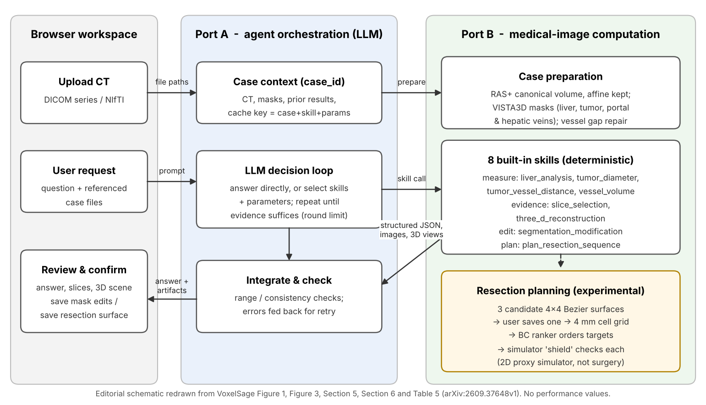

[Home](../) · [AI Papers](./)

# 量測交給程式、LLM 只負責調度：VoxelSage 的肝腫瘤 CT 工具代理，證據停在系統測試與模擬器

## 來源

- 團隊：Binghong Qian、Xuanhe Liu、Yifan Xing、Wenjie Deng、Jian Wu、Haochao Ying，皆屬浙江大學（Zhejiang University）。[(ref: main p.1)](https://arxiv.org/pdf/2609.37648v1#page=1)
- 論文：*VoxelSage: Tool-Augmented 3D CT Analysis and Simulator-Shielded Sequential Resection Planning for Liver Tumors*，arXiv v1（cs.CV），2026-09-29；作者定位為技術報告，含參考文獻與附錄共 21 頁。[(ref: main p.1)](https://arxiv.org/pdf/2609.37648v1#page=1)
- 識別碼：[arXiv:2609.37648](https://arxiv.org/abs/2609.37648)；[DOI: 10.48550/arXiv.2609.37648](https://doi.org/10.48550/arXiv.2609.37648)。
- 全文：[arXiv PDF v1](https://arxiv.org/pdf/2609.37648v1)；論文列出的公開程式碼：[github.com/ZJUMAI/VoxelSage](https://github.com/ZJUMAI/VoxelSage)。[(ref: main p.1)](https://arxiv.org/pdf/2609.37648v1#page=1)
- 研究性質：系統整合的技術報告，核心系統與規劃器都已實作並公開程式碼；但沒有臨床評估。摘要裡的手術時間與失血改善全部來自自建的二維代理模擬器；LLM 調度的評估使用參考遮罩（排除分割誤差）、63 個病例、沒有信賴區間；也沒有與既有 CT 代理或「不給工具的 LLM」比較。[(ref: main §7)](https://arxiv.org/pdf/2609.37648v1#page=11) [(ref: main §7.3)](https://arxiv.org/pdf/2609.37648v1#page=14)
- 證據邊界：本文數值以 arXiv v1 PDF 為準；Figure 9 的信賴區間只引用正文寫出的數字，不從圖上讀值。

**編輯：** Clare

VoxelSage 把肝腫瘤 CT 的分割、體積與距離量測、影像證據和切除順序規劃都交給確定性程式執行，LLM 只負責理解問題與挑選工具；系統層級的功能測試全數通過，但摘要中「模擬手術時間減少 2.59%、模擬失血減少 38.89%」來自二維代理模擬器，作者也明言這不代表臨床成效或安全性。[(ref: main Abstract)](https://arxiv.org/pdf/2609.37648v1#page=1)

## 流程

圖：本書庫依論文 Figure 1、Figure 3、Section 5、Section 6 與 Table 5 重繪的編輯示意圖，不含成效數值。Port A 與 Port B 分開部署：凡涉及影像幾何的數字都在 Port B 計算，LLM 拿到的是附帶遮罩與座標資訊的結構化結果；切除規劃以虛線框標示，因為它的學習元件只在二維模擬器中評估。[(ref: main Figure 1)](https://arxiv.org/pdf/2609.37648v1#page=2) [(ref: main Figure 3)](https://arxiv.org/pdf/2609.37648v1#page=6) [(ref: main Table 5)](https://arxiv.org/pdf/2609.37648v1#page=19)

## 背景／問題

肝腫瘤的術前評估需要從同一個三維 CT 得到分割、以毫米計的量測、可檢視的影像證據與切除規劃，並讓這些結果都能追回同一個病例與座標系。作者指出既有工具各管一段：VISTA3D、TotalSegmentator、BiomedParse 負責分割，CT-CLIP 做影像與文字對齊，CT-Agent、3DMedAgent 以工具代理處理 CT 問答，但沒有一套以病例為中心、把前處理、量測、證據、修正與規劃串起來的流程。[(ref: main §1)](https://arxiv.org/pdf/2609.37648v1#page=1)

論文的另一個前提是「語言模型無法可靠地從 CT 算出物理量測」，所以量測要從 LLM 手上拿走。這是作者的設計動機，論文沒有引用文獻佐證，也沒有做「LLM 直接回答量測問題」的對照實驗；本文把它當成設計選擇，而不是已被證明的事實。[(ref: main Abstract)](https://arxiv.org/pdf/2609.37648v1#page=1) [(ref: main §2.2)](https://arxiv.org/pdf/2609.37648v1#page=3)

在切除規劃上，作者引用的系統性回顧指出三維肝臟重建多用於複雜或大範圍切除，證據也多半是非隨機研究；VoxelSage 的規劃器不模擬肝功能、分段灌流、組織變形或術後結果，也不替臨床決策排序治療選項。[(ref: main §2.3)](https://arxiv.org/pdf/2609.37648v1#page=3)

## 方法摘要

VoxelSage 是一個瀏覽器加兩個服務的系統。Port A 維護病例脈絡，把可用技能清單、對話歷史與病例資料交給 LLM（論文寫為 Qwen，實驗用 Qwen3.8-Flash），由 LLM 決定直接回答，或選擇技能並產生參數；Port B 執行病例前處理與八個內建技能，回傳 JSON、影像與三維場景。[(ref: main §3.1)](https://arxiv.org/pdf/2609.37648v1#page=3) [(ref: main §4.3)](https://arxiv.org/pdf/2609.37648v1#page=5) [(ref: main §7.3, p.15)](https://arxiv.org/pdf/2609.37648v1#page=15)

八個技能分成四類：四個量測技能從遮罩與 affine 矩陣計算體積、直徑與腫瘤到血管距離；兩個證據技能產生排序過的軸切面疊圖與三維重建；一個互動修正技能讓使用者編輯遮罩；一個規劃技能在使用者確認的切除面上規劃切割順序。[(ref: main §5)](https://arxiv.org/pdf/2609.37648v1#page=6) [(ref: main Table 5)](https://arxiv.org/pdf/2609.37648v1#page=19)

切除規劃先產生三個以 4 × 4 控制點定義的 bicubic Bézier 切除面候選，使用者調整並儲存後，系統把切除面切成約 4 mm 的格子，由 behaviour cloning 訓練的排序器決定下一個要切的目標，再由模擬器 rollout 組成的 shield 依序檢查，第一個不超出模擬失血預算的候選才被執行。[(ref: main §6)](https://arxiv.org/pdf/2609.37648v1#page=8) [(ref: main §6.4)](https://arxiv.org/pdf/2609.37648v1#page=9)

評估分三條線：Port B 的功能與座標正確性（合成 phantom 與 3 個公開病例）、規劃器在二維模擬器上的對照實驗（256 個場景），以及 Port A 的 LLM 調度能力（63 個病例的問答任務）。[(ref: main §7)](https://arxiv.org/pdf/2609.37648v1#page=11)

## 方法詳解

**病例脈絡與快取。** 上傳的 DICOM 或 NIfTI 通過檢查後取得唯一的 case UUID，病例脈絡記錄原始影像、前處理產生的遮罩、過去的計算結果與檔案狀態。技能結果以「case UUID、技能名稱、輸入參數」三者為鍵存入快取，三者完全相同時才重複使用。[(ref: main §4.1)](https://arxiv.org/pdf/2609.37648v1#page=4)

**LLM 決策迴圈。** LLM 每一輪先判斷手上的證據是否足以回答；不足時選擇技能並產生參數，Port A 先查快取，沒有才送往 Port B，彼此獨立的技能可平行執行。結果回來後，Port A 做數值範圍與一致性檢查，失敗時把錯誤訊息與修正方向放回 context 讓 LLM 重試。系統說明與 Figure 1 寫迴圈上限為六輪；Port A 評估實驗則設為每個請求最多四輪、180 秒。[(ref: main §3.2)](https://arxiv.org/pdf/2609.37648v1#page=4) [(ref: main §4.3)](https://arxiv.org/pdf/2609.37648v1#page=5) [(ref: main §4.4)](https://arxiv.org/pdf/2609.37648v1#page=5) [(ref: main §7.3, p.15)](https://arxiv.org/pdf/2609.37648v1#page=15)

**病例前處理。** 影像轉成 canonical RAS+ 方向並保留 4 × 4 affine 矩陣；另存一份窗位 40 HU、窗寬 400 HU 的 8-bit 腹部窗影像，同時保留未開窗的 HU 值。分割預設使用 VISTA3D 產生肝臟、肝腫瘤、門靜脈與肝靜脈遮罩，TotalSegmentator 為替代選項。後處理把腫瘤遮罩拆成三維連通元件，並對血管骨架上不超過 4 mm 的斷點嘗試補接，補接後的遮罩另存一份，不覆寫原始遮罩。[(ref: main §5.1)](https://arxiv.org/pdf/2609.37648v1#page=6)

**量測技能。** 體積由遮罩體素數乘以 affine 前三行三列的行列式絕對值得到；直徑在 affine 轉換後的物理座標中取最大成對距離，小於門檻的元件標記為過小、不給數值；腫瘤到血管的距離以考慮各軸體素間距的 Euclidean distance transform 計算，重疊時回報 0。作者強調這些是從遮罩推導的可重現量測，不是獨立的診斷結論。[(ref: main §5.2)](https://arxiv.org/pdf/2609.37648v1#page=7)

**證據與修正技能。** `slice_selection` 依器官多樣性、器官覆蓋、病灶、切面位置與影像 entropy 給軸切面打分，預設回傳前三張並附輪廓疊圖；`segmentation_modification` 讓使用者用正負點提示逐張修正，可選擇以 MedSAM2 傳播到鄰近切面，儲存前其他技能仍讀原始遮罩，儲存時保留 `.bak` 備份。三維重建以 Marching Cubes 從遮罩產生網格，在 Three.js 場景中呈現。[(ref: main §5.3)](https://arxiv.org/pdf/2609.37648v1#page=7) [(ref: main §5.4)](https://arxiv.org/pdf/2609.37648v1#page=7) [(ref: main §5.5)](https://arxiv.org/pdf/2609.37648v1#page=7)

**切除面與安全邊界。** 切除面是 16 個控制點定義的 bicubic Bézier patch。系統沿腫瘤邊界取樣，計算各點到切除面的切線校正距離，取最小值 d_min；預設目標邊界為 5 mm，d_min ≥ 4.95 mm 才接受。作者明言這是工程參數，不是臨床建議；候選產生與篩選規則同樣是工程 heuristic，不是經臨床驗證的手術準則。[(ref: main §6.1)](https://arxiv.org/pdf/2609.37648v1#page=8) [(ref: main §6.2)](https://arxiv.org/pdf/2609.37648v1#page=9) [(ref: main §6.3)](https://arxiv.org/pdf/2609.37648v1#page=9)

**二維模擬器。** 使用者確認的切除面被投影到固定的 30 × 40 格、每格 4 mm × 4 mm 的平面上。每一步切割依文獻中的 CUSA 切肝速度 2.3 cm²/min 計為 4.17 秒；採 15 分鐘夾閉、5 分鐘放開的循環，夾閉時失血為 0，放開期間依暴露而未封閉的血管面積計算失血率，上限以 70 kg 名目體重的肝血流估算。作者說明格子大小、體重、暴露尺度與封閉時間都是凍結的工程選擇，失血量只適合模擬器內部比較，不是病人層級的估計；模擬器也不含血管分支、組織變形、灌流、器械可達性與生理反應。[(ref: main §6.4)](https://arxiv.org/pdf/2609.37648v1#page=9)

**學習的排序器與 shield。** 每個狀態最多產生 K = 6 個候選目標（必含基準 serpentine 掃描的下一格）。teacher 對每個候選在複製的環境中跑完整個回合，選出能完成且不超出失血預算、時間與失血最少者作為標籤；排序器是三層 dilated convolution 加候選 MLP，用 448 個訓練場景中的 171,401 個狀態、1,017,114 個候選做 behaviour cloning。上線時排序器給出順序，shield 依序以模擬器 rollout 檢查，第一個通過者即執行，全部不通過就終止，不改用未驗證的替代方案。失血預算為 serpentine 基準失血加上 16.071 mL 的固定 margin（訓練集 C0 平均失血的 5%）。[(ref: main §6.4, p.10)](https://arxiv.org/pdf/2609.37648v1#page=10) [(ref: main §6.4, p.11)](https://arxiv.org/pdf/2609.37648v1#page=11) [(ref: main Table 7)](https://arxiv.org/pdf/2609.37648v1#page=20)

下表重製論文 Table 1 的控制器定義；所有控制器共用同一個凍結模擬器、候選產生器與夾閉排程。[(ref: main Table 1)](https://arxiv.org/pdf/2609.37648v1#page=10)

| ID | Target ordering | Exact-rollout use | Experimental role |
|---|---|---|---|
| C0 | Direct deterministic serpentine order | None | Primary reference |
| C1 | Serpentine candidate receives highest priority | Exact admissibility control | Framework control; required to match C0 |
| C2 | Myopic action time, action blood, transfer length, then fixed ties | Exact admissibility control | Non-learned comparator |
| C3 | Corrected depth-one teacher minimizing full-episode time, then blood | All candidates, intrinsic to its objective | Computational teacher reference |
| C4 | Frozen behaviour-cloned macro-target ranker | Lazy exact, in rank order | Primary learned controller |
| C5 | Same frozen ranker as C4 | None | Diagnostic shield ablation |

- **論文未交代** — Port A 給 LLM 的系統提示詞與技能描述全文；論文只列出 manifest 的縮略範例。[(ref: main Appendix A.2)](https://arxiv.org/pdf/2609.37648v1#page=18)
- **論文未交代** — 63 個 Port A 評估病例與 DeepTumorVQA 題目是如何從資料集中挑出的。[(ref: main §7.3)](https://arxiv.org/pdf/2609.37648v1#page=14)
- **論文未交代** — VISTA3D 在本研究 CT 上的分割準確度；作者以「本研究的貢獻是系統整合」為由沒有重做分割評估，所有下游量測的正確性都以遮罩為前提。[(ref: main §7.1)](https://arxiv.org/pdf/2609.37648v1#page=12)
- **論文未交代** — 模擬器的時間與失血參數與真實手術的校準關係；作者明確說明失血是未經校準的環境量。[(ref: main Figure 9)](https://arxiv.org/pdf/2609.37648v1#page=13)

## 資料與實驗

三條評估線使用不同資料，彼此不共用病例。[(ref: main §7)](https://arxiv.org/pdf/2609.37648v1#page=11) [(ref: main §7.1)](https://arxiv.org/pdf/2609.37648v1#page=12) [(ref: main §7.2)](https://arxiv.org/pdf/2609.37648v1#page=12) [(ref: main §7.3)](https://arxiv.org/pdf/2609.37648v1#page=14)

| 評估線 | 資料 | 規模 | 主要問題 |
|---|---|---|---|
| Port B 座標正確性 | 合成 NIfTI phantom（非醫療資料） | 24 個 phantom、216 項檢查 | 座標與單位處理是否正確 |
| Port B 功能矩陣 | TCIA Colorectal-Liver-Metastases v2（197 位受試者，CC BY 4.0）中預先指定的 3 個病例，使用其參考遮罩 | 3 例 × 8 個技能 | 每個技能能否在真實 CT 上跑通 |
| 規劃器對照 | 自建二維模擬場景，分成 policy training 448、internal development 64、tuning 64、validation 128、one-shot test 128、stress 128；凍結後另產生 256 個確認場景 | 256 個確認場景；延遲測試 64 個；敏感度每條件 128 個 | 學習的排序是否比基準省時、少失血 |
| Port A 調度 | AbdomenAtlas1.0Mini 的 CT，搭配 AbdomenAtlas3.0Mini 參考遮罩與 DeepTumorVQA 題目 | 63 個病例；154 題任務、63 組雙病例比較、137 題不存在病例、137 題重複提問 | LLM 是否選對技能、不捏造數字、會重用結果 |

下表重製論文 Table 2（Port B 技能驗證）；時間是共用伺服器上的描述性量測。[(ref: main Table 2)](https://arxiv.org/pdf/2609.37648v1#page=13)

| Skill | Cases passed | Required output or state verified | Median s (range) |
|---|---|---|---|
| Liver analysis | 3/3 | Structured volume, diameter, distance, and report | 5.906 (5.441–6.468) |
| Tumour diameter | 3/3 | Per-lesion diameter, method, and voxel count | 0.197 (0.180–0.305) |
| Tumour–vessel distance | 3/3 | Hepatic and portal distance, contact, and mask variant | 5.913 (5.621–24.756) |
| Vessel volume | 3/3 | Volume in mm³/cm³, voxel count, and mask variant | 0.202 (0.193–0.388) |
| Slice selection | 3/3 | Three raw/overlay pairs with artifact hashes | 3.509 (3.153–24.126) |
| 3D reconstruction | 3/3 | HTML, scene JSON, anatomy list, and candidate surface | 33.368 (29.835–74.109) |
| Segmentation editing | 3/3 | Edited-mask hash, backup, and stale-scene invalidation | 3.578 (2.763–4.743) |
| Resection sequence | 3/3 | Saved surface, legal-start preview, and nearest traversal | 23.920 (5.047–68.636) |

下表重製論文 Table 3（規劃器敏感度測試）；C4 fail 表示未完成覆蓋即終止，overrun 表示該回合失血超出該條件的預算。[(ref: main Table 3)](https://arxiv.org/pdf/2609.37648v1#page=14)

| Condition | C4 complete/fail | Overrun C4/C5 |
|---|---|---|
| S0: 15/5, p = 1.00 | 128/0 | 0/14 |
| S1: 12/5, p = 1.00 | 128/0 | 0/10 |
| S2: 10/5, p = 1.00 | 128/0 | 0/12 |
| S3: 15/5, p = 0.50 | 128/0 | 0/11 |
| S4: 15/5, p = 0.25 | 128/0 | 0/8 |

Port A 實驗的評分規則：病灶有無與數量要求完全一致；肝臟體積容許誤差為 max(1 mL, 0.02 V_ref)，病灶總體積為 max(0.1 mL, 0.05 V_ref)；最大三維直徑以 PyRadiomics 計算參考值，容許 0.01 mm。作者說明這些門檻是實驗上的一致性標準，不是臨床可接受的誤差。[(ref: main §7.3, p.15)](https://arxiv.org/pdf/2609.37648v1#page=15)

下表重製論文 Table 4（Port A 四項實驗）。[(ref: main Table 4)](https://arxiv.org/pdf/2609.37648v1#page=16)

| Experiment | Metric | Result |
|---|---|---|
| Task Execution | Lesion-existence accuracy | 44/44 (100%) |
| Task Execution | Lesion-counting accuracy | 30/34 (88.2%) |
| Task Execution | Liver-volume accuracy | 22/24 (91.7%) |
| Task Execution | Total-lesion-volume accuracy | 27/27 (100%) |
| Task Execution | Maximum three-dimensional lesion-diameter accuracy | 25/25 (100%) |
| Multi-Case Management | Correct identification of the case with the larger liver volume | 59/63 (93.7%) |
| Evidence Faithfulness | Responses without invented measurements | 137/137 (100%) |
| Cache Efficiency | Repeated queries without additional tool calls | 130/137 (94.9%) |
| Cache Efficiency | Median response time: initial → repeated query | 8.16 → 2.56 s |
| Cache Efficiency | Reduction in median response time | 68.6% |
| Cache Efficiency | Answer accuracy under the batch's original scoring criteria | 122/137 (89.1%) |

論文的註記說明：27 題病灶總體積題只來自 15 個不同病例；Cache Efficiency 使用原始 VQA 的直徑參考答案，與 Task Execution 的結果不可直接比較。[(ref: main Table 4)](https://arxiv.org/pdf/2609.37648v1#page=16)

## 結果

- **座標與單位處理** — 24 個合成 phantom 的 216 項檢查中，186 項數值比較全部落在 0.01 的容許誤差內，30 項空遮罩或低於門檻的情況都回傳預期的結構化結果。作者說明這驗證的是 phantom 上的座標處理，不是臨床影像的量測準確度。[(ref: main §7.1)](https://arxiv.org/pdf/2609.37648v1#page=12)
- **Port B 在 3 個真實病例上跑通** — 66 項紀錄檢查全部通過，涵蓋八個技能 × 三個病例的 24 條路徑；冷啟動的病例前處理中位數 43.3 秒（43.1–65.0 秒），快取重用在一位小數精度下為 0.0 秒。九項預先指定的防呆檢查（缺檔、雜湊不符、格子尺寸不符、非法起點等）都產生預期的拒絕結果。[(ref: main §7.1)](https://arxiv.org/pdf/2609.37648v1#page=12)
- **真實 CT 到規劃器的銜接沒有完成驗證** — 作者說明，存檔的三病例 bridge 使用的是舊版目標設定，不能算是目前 core-only adapter 的驗證，在病人資料上的驗證「仍待完成」；目前只有人工構造的切除面測試。[(ref: main §7.1)](https://arxiv.org/pdf/2609.37648v1#page=12)
- **模擬器內的主要結果** — 256 個確認場景中，C4 相對 serpentine 基準 C0 把平均模擬時間從 34.274 分鐘降到 33.388 分鐘，配對差 −0.886 分鐘（95% CI [−0.947, −0.826]），252 勝、3 平、1 負；平均模擬失血差 −116.995 mL（95% CI [−135.484, −99.784]），沒有任何回合超出預算。C4 比非學習的 C2 快 3.736 分鐘（95% CI [−4.094, −3.389]）；完整搜尋的 teacher C3 為 33.178 分鐘，比 C4 再少 0.210 分鐘，C4 保留了 teacher 相對 C0 改善量的 80.9%。[(ref: main §7.2, p.13)](https://arxiv.org/pdf/2609.37648v1#page=13) [(ref: main §7.2, p.14)](https://arxiv.org/pdf/2609.37648v1#page=14)
- **shield 的作用** — 拿掉 shield 的 C5 在 24/256 個場景超出失血預算，C4 為 0/256；shield 只在 97,320 次決策中的 92 次（0.0945%）改變了排序器的首選。排序器 98.97% 的時候選的就是 serpentine 的下一格，差異只出現在剩下約 1% 的決策。[(ref: main §6.4, p.11)](https://arxiv.org/pdf/2609.37648v1#page=11) [(ref: main §7.2, p.14)](https://arxiv.org/pdf/2609.37648v1#page=14)
- **計算成本** — 64 個場景、各跑三次的 CPU 測試中，C4 的每回合規劃時間中位數 21.21 秒，C3 為 46.85 秒，少 54.7%；這比較的是控制器的運算時間，不是模擬手術時間。[(ref: main §7.2, p.14)](https://arxiv.org/pdf/2609.37648v1#page=14)
- **LLM 調度** — Table 4 中病灶有無、總體積與最大直徑全對，病灶計數 30/34、肝臟體積 22/24；137 題不存在病例的提問沒有一題捏造數字；重複提問時 94.9% 不再呼叫工具，回應時間中位數從 8.16 秒降到 2.56 秒。這些結果都沒有附信賴區間。[(ref: main Table 4)](https://arxiv.org/pdf/2609.37648v1#page=16)

作者的結論是：這些結果建立的是工作流程整合與可重現的模擬器實驗，而不是臨床準確度、效益、安全性或病人層級的失血預測。[(ref: main §8)](https://arxiv.org/pdf/2609.37648v1#page=15)

## 限制

- 作者列出的限制：只用大腸直腸癌肝轉移的 CT 評估，影像分析介面也不使用腫瘤來源資訊，因此不能推論到原發性肝癌或其他來源的腫瘤。[(ref: main §1, p.2)](https://arxiv.org/pdf/2609.37648v1#page=2)
- 作者列出的限制：Port A 實驗使用參考遮罩，因此不評估自動分割錯誤下的表現；Evidence Faithfulness 只測「病例不存在」，沒有測病例存在但遮罩缺漏或工具結果不完整的情況；評分門檻是實驗標準，不是臨床可接受誤差。[(ref: main §7.3, p.15)](https://arxiv.org/pdf/2609.37648v1#page=15)
- 作者列出的限制：系統只在少數公開病例上做過實驗室工程展示，學習元件是在二維代理任務而非真實手術動態上訓練；臨床效用需要在具代表性的世代與真實工作流程中，以適當的結果指標與不確定性估計做外部評估。[(ref: main §8)](https://arxiv.org/pdf/2609.37648v1#page=15)
- 本書庫補充：摘要中的 2.59% 時間與 38.89% 失血改善，是模擬器內相對自訂 serpentine 基準的差異；模擬器的失血公式與參數由作者設定，論文沒有任何與真實術中資料的對照。
- 本書庫補充：論文沒有把 VoxelSage 與 CT-Agent、3DMedAgent 等既有 CT 代理比較，也沒有「同一個 LLM 不給工具」的對照組，因此無法判斷 Port A 的表現有多少來自雙 port 設計本身。規劃器只與作者自訂的基準（C0、C2）和自身的 teacher（C3）比較，沒有與文獻中的切除規劃方法比較。[(ref: main Table 1)](https://arxiv.org/pdf/2609.37648v1#page=10) [(ref: main §2.2)](https://arxiv.org/pdf/2609.37648v1#page=3)
- 本書庫補充：Port A 評估只有 63 個病例、各子任務 24 至 44 題，Port B 真實病例只有 3 例，都沒有信賴區間；只有模擬器實驗有 bootstrap 信賴區間。
- 本書庫補充：迴圈上限在系統說明與 Figure 1 為六輪，在 Port A 實驗設定為四輪；論文沒有說明兩者的關係，本文依各自的段落引用。[(ref: main §3.2)](https://arxiv.org/pdf/2609.37648v1#page=4) [(ref: main §7.3, p.15)](https://arxiv.org/pdf/2609.37648v1#page=15)

## 與書庫其他文章的關係

MedRAX 把分類、分割、定位等學習模型包成工具交給胸片代理呼叫，VoxelSage 則把幾何量測寫成確定性技能並與 LLM 部署在不同服務，兩篇可對照「工具是模型」與「工具是程式」兩種工具代理的設計取捨: [MedRAX：工具代理如何改善胸腔 X 光問答？](2026-09-15-medrax-chest-xray-agent.md)

MammoClaw 同樣只給代理確定性工具，並做了「不給工具」的對照、發現光給工具不會提升 macro-F1，VoxelSage 缺少這一組對照，兩篇並讀可看出評估工具代理時應該拆開哪些實驗: [工具給齊了，凍結的 MLLM 就會讀乳房攝影嗎？MammoClaw 用失敗軌跡演化出的技能補上「怎麼用」](2026-10-01-mammoclaw-skill-evolving-mammography-agent.md)

本篇的工具是回傳實際量測的確定性程式且缺少不給工具的對照，該研究的工具則是回傳預測值的學習模型，並以隨機打分工具做了對照，兩篇並讀可看出「工具本身貢獻多少」該怎麼拆: [病歷不出院，只放出一個打分器：LLM 代理靠它找血球計數生物標記，外部驗證只在部分世代站得住](2026-10-07-gat-scorer-cbc-biomarker-agent.md)

## 實務的啟發

本篇的定位是可借用的系統設計與量測方法，不是已驗證的術前規劃工具。

第一，「LLM 不碰數字」是值得借用的架構原則。VoxelSage 讓所有體積、直徑、距離都由 Port B 依遮罩與 affine 計算，回傳時附上遮罩版本與量測方法，快取以病例、技能與參數三者為鍵；這讓每個數字都能追回來源。但這個設計是否真的比讓 LLM 直接看圖作答更可靠，論文沒有做對照，院內若要採用同樣架構，第一個實驗就應該是同一個 LLM 有工具與無工具的比較。

第二，Evidence Faithfulness 的測法可以直接借用到其他代理評估：拿不存在的病例 ID 去問，看系統會不會回傳 null 而不是編造數字。不過 137 題全對只涵蓋「病例不存在」這一種失效，遮罩缺漏、工具回傳部分結果等更常見的情境仍待驗證。

第三，模擬器實驗的寫法值得參考，結論則不宜外推。論文預先切分六組場景、凍結後才開確認集、用配對 bootstrap 報信賴區間，也誠實標出 shield 只改變 0.0945% 的決策、排序器近 99% 時候與基準相同；但所有時間與失血數字都只在作者自訂的二維模擬器內有意義，不能當作手術時間或出血量的改善證據。

最後，這類系統要接近臨床，至少還缺三件事：真實 CT 經自動分割後的端到端量測誤差、與既有 CT 代理及外科醫師規劃的比較，以及原發性肝癌等其他族群的外部驗證。

## References

- `main`：[VoxelSage: Tool-Augmented 3D CT Analysis and Simulator-Shielded Sequential Resection Planning for Liver Tumors 論文 PDF v1](https://arxiv.org/pdf/2609.37648v1)；本文使用 [p.1（作者、Abstract、§1）](https://arxiv.org/pdf/2609.37648v1#page=1)、[p.2（Figure 1、貢獻、評估範圍）](https://arxiv.org/pdf/2609.37648v1#page=2)、[p.3（§2.2–§2.4、§3.1）](https://arxiv.org/pdf/2609.37648v1#page=3)、[p.4（§3.2、§4.1）](https://arxiv.org/pdf/2609.37648v1#page=4)、[p.5（§4.3、§4.4）](https://arxiv.org/pdf/2609.37648v1#page=5)、[p.6（§5、§5.1、Figure 3）](https://arxiv.org/pdf/2609.37648v1#page=6)、[p.7（§5.2–§5.5）](https://arxiv.org/pdf/2609.37648v1#page=7)、[p.8（§6、§6.1）](https://arxiv.org/pdf/2609.37648v1#page=8)、[p.9（§6.2–§6.4、模擬器）](https://arxiv.org/pdf/2609.37648v1#page=9)、[p.10（Table 1、排序器）](https://arxiv.org/pdf/2609.37648v1#page=10)、[p.11（Figure 8、shield、§7）](https://arxiv.org/pdf/2609.37648v1#page=11)、[p.12（§7.1、§7.2）](https://arxiv.org/pdf/2609.37648v1#page=12)、[p.13（Table 2、Figure 9、主要結果）](https://arxiv.org/pdf/2609.37648v1#page=13)、[p.14（Table 3、shield 消融、延遲、§7.3）](https://arxiv.org/pdf/2609.37648v1#page=14)、[p.15（§7.3 評分與限制、§8）](https://arxiv.org/pdf/2609.37648v1#page=15)、[p.16（Table 4）](https://arxiv.org/pdf/2609.37648v1#page=16)、[p.18–19（Appendix A、Table 5）](https://arxiv.org/pdf/2609.37648v1#page=18)、[p.20（Appendix B、Table 7）](https://arxiv.org/pdf/2609.37648v1#page=20)。
- `abstract`：[arXiv:2609.37648](https://arxiv.org/abs/2609.37648)。
- `doi`：[10.48550/arXiv.2609.37648](https://doi.org/10.48550/arXiv.2609.37648)。
- `code`：[VoxelSage GitHub 倉庫（論文列出）](https://github.com/ZJUMAI/VoxelSage)。

[Home](../) · [AI Papers](./)
