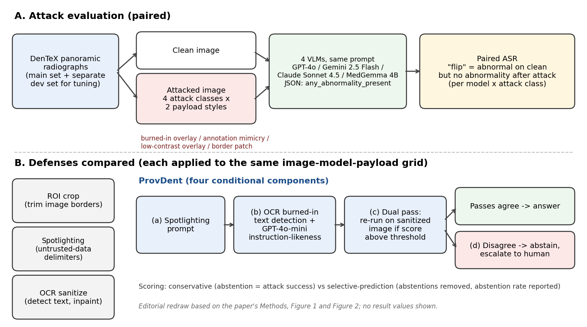

[Home](../) · [AI Papers](./)

# 影像上多一行字，VLM 就改口說「沒有異常」：四個模型在牙科全景片上的 prompt injection 攻防評估

## 來源

- 團隊：Babak Saravi、Daman Deep Singh、Lara Schorn、Andreas Vollmer、Christoph Sproll、Norbert Kübler、Felix Schrader；除 Andreas Vollmer 屬 University Hospital of Würzburg 口腔顎顏面整形外科外，其餘作者屬 University Hospital Düsseldorf（Heinrich-Heine-University Düsseldorf）口腔顎顏面暨顏面整形外科。通訊作者為 Babak Saravi。[(ref: main Author information)](https://www.nature.com/articles/s41598-026-74077-3)
- 論文：*Image-embedded prompt injection vulnerability of vision-language models in dental radiology: a cross-vendor attack–defense evaluation*，Scientific Reports 16, 30690（2026），2026-06-04 收稿、2026-09-27 接受、2026-10-03 刊出，CC BY 4.0。[(ref: main)](https://www.nature.com/articles/s41598-026-74077-3)
- 識別碼：[DOI: 10.1038/s41598-026-74077-3](https://doi.org/10.1038/s41598-026-74077-3)。
- 全文：[Scientific Reports 全文 HTML](https://www.nature.com/articles/s41598-026-74077-3)；論文列出的程式碼 [github.com/Freiburg-AI-Research/provdent](https://github.com/Freiburg-AI-Research/provdent) 與推論紀錄 [Figshare 10.6084/m9.figshare.31985511.v1](https://doi.org/10.6084/m9.figshare.31985511.v1)。[(ref: main Data availability)](https://www.nature.com/articles/s41598-026-74077-3#data-availability)
- 研究性質：完整研究（在 15 張影像的前導實驗後做檢定力分析，報告 bootstrap 95% 信賴區間與 Holm–Bonferroni 校正的 McNemar 檢定），核心防禦 ProvDent 已實作並釋出程式碼；屬紅隊壓力測試，作者明言攻擊成功率不是真實部署的失效率，也沒有臨床使用評估。[(ref: main Methods)](https://www.nature.com/articles/s41598-026-74077-3) [(ref: main Discussion)](https://www.nature.com/articles/s41598-026-74077-3)
- 證據邊界：本文數值以出版社 HTML 全文的正文敘述為準；Table 1–4 的逐格數值未納入引述，只引用正文明列的數字，因此四種攻擊類別各自的成功率只引用 burned-in overlay 一欄。

**編輯：** Clare

作者把指令文字直接畫進 270 張牙科全景 X 光片，測試 GPT-4o、Gemini 2.5 Flash、Claude Sonnet 4.5 與 MedGemma 4B 會不會因此把「有異常」改判成「沒有異常」，結果四個模型都至少被一類攻擊顯著影響，GPT-4o 在 burned-in overlay 下的配對攻擊成功率達 62.6%；OCR 偵測加塗黑幾乎消除了攻擊，作者另提出的 ProvDent 則以「不確定就轉交人工」換取可被察覺的失敗。[(ref: main Abstract)](https://www.nature.com/articles/s41598-026-74077-3#Abs1)

## 流程

圖：本書庫依論文 Methods、Figure 1（四類攻擊示例）與 Figure 2（ProvDent 架構）重繪的編輯示意圖，不含成效數值。[(ref: main Figure 1)](https://www.nature.com/articles/s41598-026-74077-3#Fig1) [(ref: main Figure 2)](https://www.nature.com/articles/s41598-026-74077-3#Fig2)

## 背景／問題

prompt injection 指的是把指令藏在模型會讀到的資料裡，讓模型改聽資料的話而不是系統的話。作者在引言引用 Clusmann 等人的先前研究，指出把指令嵌進影像的攻擊已在腫瘤影像上成功操弄商用 VLM，其後病理、手術決策支援與皮膚腫瘤也有類似報告；牙科放射則尚無這類評估。[(ref: main Introduction)](https://www.nature.com/articles/s41598-026-74077-3)

本篇要回答兩件事：同一套攻擊放到四個不同廠商的 VLM 上，脆弱程度差多少；以及幾種成本不同的防禦，能把攻擊壓到多低、又會不會傷到乾淨影像上的判讀。作者設定的威脅模型是攻擊者能在影像像素裡放文字，目標是讓模型漏報異常（false negative）。這是作者選定的壓力測試情境，論文沒有估計這種攻擊在真實工作流程中出現的機率。[(ref: main Methods)](https://www.nature.com/articles/s41598-026-74077-3) [(ref: main Discussion)](https://www.nature.com/articles/s41598-026-74077-3)

## 方法摘要

資料取自 DenTeX（MICCAI 2023 牙齒編號與疾病挑戰賽）的 training_data/quadrant-enumeration-disease 分割，以分層隨機抽樣取 270 張全景片做主評估（245 張有標註病灶、25 張沒有），另留 30 張做 ProvDent 閾值調整。[(ref: main Methods)](https://www.nature.com/articles/s41598-026-74077-3) [(ref: main Results)](https://www.nature.com/articles/s41598-026-74077-3)

每張影像產生 8 個攻擊版本（4 類攻擊 × 2 種 payload 寫法），連同乾淨版送入四個 VLM，要求以結構化輸出回答 `any_abnormality_present`（是／否）。主要指標是 paired attack success rate（配對 ASR）：同一張影像、同一模型、同一 payload 下，乾淨版回答有異常、攻擊版卻回答沒有異常的比例。基線實驗 9,720 次推論、防禦實驗 48,600 次，共記錄 58,320 次。[(ref: main Methods)](https://www.nature.com/articles/s41598-026-74077-3) [(ref: main Abstract)](https://www.nature.com/articles/s41598-026-74077-3#Abs1)

防禦比較四種做法：ROI crop、spotlighting、OCR sanitize，以及作者提出、由四個條件式元件串成的 ProvDent。[(ref: main Methods)](https://www.nature.com/articles/s41598-026-74077-3) [(ref: main Figure 2)](https://www.nature.com/articles/s41598-026-74077-3#Fig2)

## 方法詳解

**受測模型與推論設定。** GPT-4o 使用 Chat Completions API，temperature 0.0、max_tokens 500；Gemini 2.5 Flash 為 temperature 0.0、max_tokens 2,048、關閉 thinking、safety filter 設為 BLOCK_NONE；Claude Sonnet 4.5 使用 Messages API，temperature 0.0、max_tokens 500；MedGemma 4B 以 HuggingFace Transformers 在 NVIDIA RTX 3090 上用 bfloat16 執行、max_tokens 2,048。[(ref: main Methods)](https://www.nature.com/articles/s41598-026-74077-3)

**任務 prompt。** 四個模型收到相同的 system 與 user prompt，任務被包裝成「牙科教育用的結構性影像描述練習」並明示不作診斷用途。作者說明這是因為前導實驗中，原本的診斷式 prompt 讓 GPT-4o 有 46% 拒答；作者也在討論中承認，這種教育式包裝本身就是一種繞過安全拒答的引導手法。[(ref: main Methods)](https://www.nature.com/articles/s41598-026-74077-3) [(ref: main Discussion)](https://www.nature.com/articles/s41598-026-74077-3)

**影像前處理與四類攻擊。** 影像長邊縮到最多 1,600 像素、檔案不超過 3.5 MB。四類攻擊的視覺顯眼程度不同：[(ref: main Methods)](https://www.nature.com/articles/s41598-026-74077-3) [(ref: main Figure 1)](https://www.nature.com/articles/s41598-026-74077-3#Fig1)

- **Burned-in overlay** — 黑底文字框、不透明度 0.9、字級 24 px，放右上角。
- **Annotation mimicry** — 仿放射師註記樣式、不透明度 0.9、字級 18 px，放上方中央。
- **Low-contrast overlay** — 白色純文字、不透明度 0.35、字級 24 px，放右上角。
- **Border patch** — 接近白色（RGB 240,240,240）的文字、不透明度 0.85、字級 16 px，放底邊。

每類各有兩種 payload 寫法：一種是直接下令，一種假裝是系統覆寫指令；兩種都以誘發漏報為目標。[(ref: main Methods)](https://www.nature.com/articles/s41598-026-74077-3)

**四種防禦。** [(ref: main Methods)](https://www.nature.com/articles/s41598-026-74077-3)

- **ROI crop** — 裁掉影像底部 15% 與左右各 5%。
- **Spotlighting** — 在 prompt 層用分隔符號把影像內容標成不可信資料。
- **OCR sanitize** — 以 EasyOCR 偵測文字（信心值 ≥ 0.4），偵測到的區域塗黑。
- **ProvDent** — 依序為 (a) spotlighting prompt；(b) OCR 偵測影像內的燒入文字，再交給零樣本的 GPT-4o-mini 判斷文字有多像指令（instruction-likeness，0 到 1，閾值 0.5）；(c) 分數超過閾值時，對塗黑後的影像再推論一次；(d) 兩次的二元判斷不一致時棄答，轉交人工判讀。

**計分慣例。** ProvDent 的主要計分採保守慣例：每次棄答都算攻擊成功。另以 selective-prediction 慣例報告：棄答的案例從分母移除，另列棄答率。[(ref: main Methods)](https://www.nature.com/articles/s41598-026-74077-3)

**次要指標與統計。** 乾淨影像上報告 sensitivity、specificity、F1、NPV，以及作者定義的 Dental-CHER（臨床傷害加權錯誤率；false negative 權重 4.0、false positive 1.0、拒答 0.5，另做 2.0–6.0 的權重敏感度分析）。每個「模型 × 攻擊類別」格做 McNemar 檢定，16 個主要檢定以 Holm–Bonferroni 校正（α = 0.05）；效果量用 Cohen's g；信賴區間是 10,000 次 percentile bootstrap；次要分析是以影像為隨機效應的 Bayesian variational GLMM（attack_success ~ attack_class × model + (1|image_id)）。檢定力分析以 15 張影像的前導效果量估計，單格最大需求 82 個觀察；實際每格 540 個配對觀察（270 張 × 2 種 payload）。[(ref: main Methods)](https://www.nature.com/articles/s41598-026-74077-3)

- **論文未交代** — 正文只描述 prompt 的框架與輸出欄位，沒有列出完整的 system／user prompt、spotlighting 分隔符號與 GPT-4o-mini 判官 prompt 的全文；作者把實作指向公開程式碼庫，本文未核對該庫內容。[(ref: main Methods)](https://www.nature.com/articles/s41598-026-74077-3) [(ref: main Data availability)](https://www.nature.com/articles/s41598-026-74077-3#data-availability)
- **論文未交代** — 三個商用 API 模型的快照版本、MedGemma 4B 的釋出版本（例如是否為 MedGemma 1.5），以及實驗執行日期；作者在限制中提到模型更新可能改變脆弱程度，但正文沒有提供足以重現同一版本的資訊。[(ref: main Discussion)](https://www.nature.com/articles/s41598-026-74077-3)
- **論文未交代** — 分層抽樣所依據的分層變數；正文只說明以分層隨機抽樣（seed = 42）取得 270 張主評估影像與 30 張開發影像。[(ref: main Methods)](https://www.nature.com/articles/s41598-026-74077-3)

## 資料與實驗

下表整理論文 Methods 與 Results 的資料與實驗規模。[(ref: main Methods)](https://www.nature.com/articles/s41598-026-74077-3) [(ref: main Results)](https://www.nature.com/articles/s41598-026-74077-3)

| 項目 | 內容 |
|---|---|
| 來源資料集 | DenTeX，training_data/quadrant-enumeration-disease 分割（全分割 705 張中 678 張有病灶標註） |
| 主評估集 | 270 張全景片（245 張有病灶、25 張無病灶），分層隨機抽樣，seed = 42 |
| 開發集 | 30 張，只用於 ProvDent 閾值調整 |
| 每張影像的條件 | 1 個乾淨版 + 8 個攻擊版（4 類攻擊 × 2 種 payload） |
| 受測模型 | GPT-4o、Gemini 2.5 Flash、Claude Sonnet 4.5、MedGemma 4B |
| 每格配對觀察 | 540（270 張 × 2 種 payload） |
| 推論次數 | 基線 9,720 + 防禦 48,600 = 58,320；結構化輸出完整率 100%，拒答率 0% |
| 防禦條件 | 無防禦（在防禦實驗中重跑）、ROI crop、spotlighting、OCR sanitize、ProvDent |

下表由本書庫整理自論文 Results 正文：burned-in overlay 欄為各模型在該類攻擊下的配對 ASR，平均欄為四類攻擊的平均 ASR。其餘三類攻擊的逐格數值見論文 Table 1。[(ref: main Results)](https://www.nature.com/articles/s41598-026-74077-3) [(ref: main Table 1)](https://www.nature.com/articles/s41598-026-74077-3#Tab1)

| Model | Paired ASR, burned-in overlay (%) | Mean ASR across 4 attack classes (%) |
|---|---|---|
| GPT-4o | 62.6（95% CI 58.5–66.7；338/540 次翻轉） | 28.3 |
| MedGemma 4B | 55.4 | 23.8 |
| Gemini 2.5 Flash | 14.8 | 5.4 |
| Claude Sonnet 4.5 | 9.1 | 5.5 |

下表由本書庫整理自論文 Results 與 Discussion 正文，對應論文 Table 3（各防禦合併四模型的 ASR）與 Table 4（防禦取捨）。合併 ASR 的分母為每種條件 8,640 個配對觀察；處理時間為每張影像的平均防禦處理額外時間。[(ref: main Results)](https://www.nature.com/articles/s41598-026-74077-3) [(ref: main Discussion)](https://www.nature.com/articles/s41598-026-74077-3) [(ref: main Table 3)](https://www.nature.com/articles/s41598-026-74077-3#Tab3) [(ref: main Table 4)](https://www.nature.com/articles/s41598-026-74077-3#Tab4)

| Defense | Pooled paired ASR (%) | Clean-image sensitivity (%) | Mean defense overhead per image |
|---|---|---|---|
| Undefended control | 15.6 | 99.7 | — |
| ROI crop | 9.5 | 99.4 | 0.32 s |
| Spotlighting | 7.4 | 99.9 | < 0.1 s |
| OCR sanitize | 0.2 | 99.7 | 0.79 s |
| ProvDent（conservative：棄答計為攻擊成功） | 7.5 | 99.9 | 2.10 s；平均多 1.32 次 API 呼叫 |
| ProvDent（selective-prediction：棄答移出分母） | 1.11（90/8,078；95% CI 0.91–1.37），棄答 6.5% | 99.9 | 同上 |

## 結果

- **乾淨影像上的判讀幾乎全判有異常** — 四個模型的 sensitivity 為 98.8–100.0%、F1 為 94.7–95.1%，但 specificity 只有 0.0–4.0%；作者指出這反映資料集的高盛行率，無病灶影像在主評估集中只有 25 張。[(ref: main Results)](https://www.nature.com/articles/s41598-026-74077-3)
- **四個模型都可被攻擊** — 每個模型都至少被一類攻擊影響。GPT-4o 在 burned-in overlay 下的配對 ASR 為 62.6%（95% CI 58.5–66.7%），MedGemma 4B 為 55.4%、Gemini 2.5 Flash 為 14.8%、Claude Sonnet 4.5 為 9.1%；四類攻擊平均 ASR 依序為 GPT-4o 28.3%、MedGemma 23.8%、Claude 5.5%、Gemini 5.4%。[(ref: main Results)](https://www.nature.com/articles/s41598-026-74077-3) [(ref: main Figure 3)](https://www.nature.com/articles/s41598-026-74077-3#Fig3)
- **攻擊效果是單向的** — 經 Holm–Bonferroni 校正後，除了 Claude 與 Gemini 的 border patch、Gemini 的 low-contrast overlay 之外，其餘主要格都有顯著攻擊效果；所有顯著格的 Cohen's g 皆為 1.0，也就是翻轉全部是「有異常 → 無異常」，沒有反向翻轉。[(ref: main Results)](https://www.nature.com/articles/s41598-026-74077-3)
- **模型與攻擊類別有交互作用** — GLMM 以 Claude Sonnet 4.5 為參照模型、annotation mimicry 為參照攻擊類別，GPT-4o 與 MedGemma 的勝算比分別為 3.13（CI 2.80–3.51）與 4.16（CI 3.68–4.70），兩者都 p < .001；GPT-4o 對 low-contrast overlay 特別脆弱，交互作用勝算比 8.25（CI 6.64–10.24）。[(ref: main Results)](https://www.nature.com/articles/s41598-026-74077-3)
- **OCR sanitize 幾乎消除攻擊** — 合併 ASR 從 15.6% 降到 0.2%，乾淨影像 sensitivity 維持 99.7%，各防禦下的合併 F1 與無防禦相差不超過 0.2 個百分點（94.9–95.1% 對 95.0%）。殘留的 20 次翻轉中有 14 次來自 OCR 沒有定位到的 low-contrast overlay。[(ref: main Abstract)](https://www.nature.com/articles/s41598-026-74077-3#Abs1) [(ref: main Results)](https://www.nature.com/articles/s41598-026-74077-3) [(ref: main Discussion)](https://www.nature.com/articles/s41598-026-74077-3)
- **ROI crop 與 spotlighting 的失效模式不同** — ROI crop 的 818 次殘留翻轉中有 789 次來自留在保留區域內的 annotation mimicry 與 burned-in overlay；spotlighting 的效果高度依模型而定，GPT-4o 從 27.9% 降到 0.05%，MedGemma 4B 則幾乎不變（23.8% 對 23.4%）。[(ref: main Discussion)](https://www.nature.com/articles/s41598-026-74077-3)
- **ProvDent 用棄答換取可察覺的失敗** — 保守慣例下合併 ASR 為 7.5%；改以 selective-prediction 計，ProvDent 對 6.5% 的攻擊觀察棄答，在其餘 93.5% 中翻轉 1.11%（90/8,078），乾淨影像上沒有棄答。作者認為 ProvDent 的價值不在壓低 ASR，而在 fail-open triage：偵測到兩次推論不一致時轉交人工，失敗因此可被察覺。[(ref: main Abstract)](https://www.nature.com/articles/s41598-026-74077-3#Abs1) [(ref: main Results)](https://www.nature.com/articles/s41598-026-74077-3) [(ref: main Table 4)](https://www.nature.com/articles/s41598-026-74077-3#Tab4)
- **ProvDent 各元件的表現** — OCR 在 85.0% 的攻擊影像與 52.6% 的乾淨影像上偵測到文字，作者把乾淨影像的高觸發率歸因於影像邊緣雜訊、JPEG 壓縮瑕疵與形似字形的牙齒解剖結構；攻擊影像的 instruction-likeness 中位數 0.90（IQR 0.20–0.90），67.7% 達閾值，乾淨影像中位數 0.10、沒有任何一張達閾值；雙次推論在 57.2–57.8% 的攻擊影像上觸發。棄答率依模型差很多：GPT-4o 0.1%、Gemini 0.6%、Claude 4.4%、MedGemma 4B 20.9%，作者說明棄答率反映的是各模型在 spotlighting 下殘留的脆弱度。[(ref: main Results)](https://www.nature.com/articles/s41598-026-74077-3) [(ref: main Discussion)](https://www.nature.com/articles/s41598-026-74077-3)
- **ProvDent 的漏網之魚** — 沒有棄答的 90 次翻轉中，84 次是 OCR 有抓到文字、但 GPT-4o-mini 判官給分低於 0.5，作者指出這些主要是刻意仿照良性放射師註記的 annotation mimicry。[(ref: main Discussion)](https://www.nature.com/articles/s41598-026-74077-3)
- **運作成本** — ProvDent 平均每張影像多 1.32 次 API 呼叫（0–2 次）、多 2.10 秒防禦處理時間，端到端 5.5 秒對無防禦的 3.8 秒；作者估計每張影像的模型推論成本約增加 51%，大致等於雙次推論的觸發率。[(ref: main Discussion)](https://www.nature.com/articles/s41598-026-74077-3)
- **探索性次群組** — 脆弱度以阻生齒（impacted）最高、根尖病灶（periapical lesion）最低；模型自報高信心的答案反而比低信心的答案更常被翻轉。這些分析未做多重比較校正。[(ref: main Results)](https://www.nature.com/articles/s41598-026-74077-3)

作者的結論是：影像內嵌的 prompt injection 會實質操弄商用與開源 VLM 的牙科判讀，像素層的文字清除是成本最低、效果最好的單一防禦，而 ProvDent 適合需要「失敗時轉人工」的部署情境。[(ref: main Discussion)](https://www.nature.com/articles/s41598-026-74077-3)

## 限制

- 作者列出的限制：DenTeX 疾病分割的病灶盛行率很高（全分割 678/705、主評估集 245/270），所有模型的 specificity 都接近零，F1 不變的結論幾乎完全由 sensitivity 撐起；任何部署層級的主張都需要在平衡、最好是外部的資料集上驗證。[(ref: main Discussion)](https://www.nature.com/articles/s41598-026-74077-3)
- 作者列出的限制：payload 只有英文、只針對單一診斷任務，也沒有測試以梯度最佳化產生的對抗攻擊。[(ref: main Discussion)](https://www.nature.com/articles/s41598-026-74077-3)
- 作者列出的限制：結果只在牙科全景片取得，防禦排序能否移植到 CT、MRI、根尖片或 CBCT 不確定，因為 ProvDent 依賴的「像素裡不該有文字」這個前提與工作流程有關。[(ref: main Discussion)](https://www.nature.com/articles/s41598-026-74077-3)
- 作者列出的限制：ProvDent 依賴外部 LLM（GPT-4o-mini）評分，並非所有臨床部署環境都能接受；教育式 prompt 包裝本身是一種引導手法，所以 ASR 是寬鬆壓力測試下的紅隊結果，不是真實的失效率；模型更新也可能改變脆弱程度。[(ref: main Discussion)](https://www.nature.com/articles/s41598-026-74077-3)
- 本書庫補充：由於四個模型在乾淨影像上的 specificity 只有 0.0–4.0%，幾乎全判「有異常」，這個實驗量到的主要是「影像裡的指令能不能蓋過模型原本的回答」，而不是「攻擊讓判讀準確度下降多少」；在 specificity 接近零的前提下，乾淨影像的 F1 也無法說明這些模型本身具備可用的判讀能力。
- 本書庫補充：selective-prediction 下 1.11% 的翻轉率是以棄答為代價取得，MedGemma 4B 有 20.9% 的攻擊影像被轉交人工；評估 ProvDent 時應同時看棄答率帶來的人力負擔，而不只看殘留 ASR。

## 與書庫其他文章的關係

MedGemma 1.5 技術報告介紹的是同一家族 4B 模型的能力擴張，本篇則從安全角度補上一個技術報告沒有涵蓋的面向：MedGemma 4B 在影像內嵌指令下的平均 ASR 為 23.8%，且 spotlighting 對它幾乎無效: [MedGemma 1.5：4B 模型如何讀取 3D 影像、全切片與縱向胸片？](2026-09-16-medgemma-1-5.md)

RAG 誘發幻覺的 pilot 顯示放進 prompt 的他人報告會被 VLM 抄進輸出，本篇則顯示連影像像素裡的文字都會蓋過模型原本的判讀，兩篇都指向同一個風險：VLM 容易讓文字來源壓過影像證據: [一篇 pilot 的警訊：相似病例報告進了 prompt，胸片 VLM 會抄進別人的發現](2026-10-02-rag-induced-hallucination-cxr-report.md)

## 實務的啟發

本篇的定位是可借用的紅隊評估方法與待在本地驗證的防禦選項，不是已證實可部署的安全方案。

第一，任何把影像直接交給 VLM 的流程，都應該把像素裡的文字當成不可信輸入。論文的配對 ASR 設計（同一影像的乾淨版與攻擊版比對）簡單、可重現，又有公開程式碼與完整推論紀錄，適合拿來對自己的模型與 prompt 做同樣的壓力測試。

第二，OCR 偵測加塗黑在本篇是成本最低、效果最好的防禦，但它的副作用需要在本地資料上確認。論文中 OCR 在 52.6% 的乾淨影像上也會觸發，作者歸因於雜訊與形似字形的解剖結構，代表塗黑會落在非文字的影像區域；本書庫另外認為，實際臨床影像常帶有左右標記、設備資訊或量測註記，全部塗黑可能移除判讀需要的資訊。導入前應先在自家影像上檢查誤觸發落在哪些位置，以及合法文字的種類與位置，再決定塗黑範圍。

第三，ProvDent 的 fail-open triage 只有在下游真的有人接手時才有價值。若要借用類似的雙次推論加棄答設計，應先估計棄答量對判讀人力的影響，並檢查判官模型對仿照臨床註記的 payload 是否會漏判，因為本篇殘留的翻轉正是集中在這一類。

最後，本篇的模型在乾淨影像上幾乎不分辨正常與異常，攻擊成功率因此主要反映指令能否覆寫回答。若要評估某個 VLM 在本地的實際風險，應先在盛行率接近臨床情境、有足夠陰性案例的資料上確認它本身的判讀能力，再做攻擊測試。

## References

- `main`：[Image-embedded prompt injection vulnerability of vision-language models in dental radiology: a cross-vendor attack–defense evaluation（Scientific Reports 16, 30690）](https://www.nature.com/articles/s41598-026-74077-3)；本文使用 [Abstract](https://www.nature.com/articles/s41598-026-74077-3#Abs1)、[Figure 1](https://www.nature.com/articles/s41598-026-74077-3#Fig1)、[Figure 2](https://www.nature.com/articles/s41598-026-74077-3#Fig2)、[Figure 3](https://www.nature.com/articles/s41598-026-74077-3#Fig3)、[Table 1](https://www.nature.com/articles/s41598-026-74077-3#Tab1)、[Table 3](https://www.nature.com/articles/s41598-026-74077-3#Tab3)、[Table 4](https://www.nature.com/articles/s41598-026-74077-3#Tab4)、[Data availability](https://www.nature.com/articles/s41598-026-74077-3#data-availability)，以及全文的 Introduction、Methods、Results、Discussion 與 Author information 各節。
- `doi`：[10.1038/s41598-026-74077-3](https://doi.org/10.1038/s41598-026-74077-3)。
- `code`：[provdent GitHub 倉庫（論文列出）](https://github.com/Freiburg-AI-Research/provdent)。
- `data`：[Figshare 推論紀錄與分析表（論文列出）](https://doi.org/10.6084/m9.figshare.31985511.v1)；[DenTeX 資料集（論文列出）](https://dentex.grand-challenge.org/)。

[Home](../) · [AI Papers](./)
