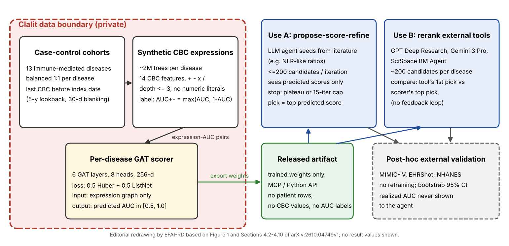

[Home](../) · [AI Papers](./)

# 病歷不出院，只放出一個打分器：LLM 代理靠它找血球計數生物標記，外部驗證只在部分世代站得住

## 來源

- 團隊：Seffi Cohen、Liat Antwarg Friedman、Amir Anisman、Ruth Johnson、Michelle M. Li、Ayush Noori、Ben Reis、Ran Balicer、Noa Dagan、Marinka Zitnik；單位為 Harvard Medical School Department of Biomedical Informatics、Clalit Research Institute（Clalit Health Services）、Ben-Gurion University of the Negev，以及兩者合作的 Berkowitz Family Living Laboratory。通訊作者為 Seffi Cohen；Noa Dagan 與 Marinka Zitnik 為共同指導作者。[(ref: main p.1)](https://arxiv.org/pdf/2610.04749v1#page=1)
- 論文：*Agentic discovery of blood biomarkers from distilled private health records*，arXiv v1（cs.AI），2026-10-03。[(ref: main p.1)](https://arxiv.org/pdf/2610.04749v1#page=1)
- 識別碼：[arXiv:2610.04749](https://arxiv.org/abs/2610.04749)；[DOI: 10.48550/arXiv.2610.04749](https://doi.org/10.48550/arXiv.2610.04749)。
- 全文：[arXiv PDF v1](https://arxiv.org/pdf/2610.04749v1)；論文列出的公開程式碼與權重：[github.com/SeffiCohen/gat_agent_tool](https://github.com/SeffiCohen/gat_agent_tool)。[(ref: main Code availability)](https://arxiv.org/pdf/2610.04749v1#page=21)
- 研究性質：完整研究，核心方法已實作並釋出權重與程式碼；訓練世代為 Clalit 的回溯性病歷，外部驗證使用 MIMIC-IV、EHRShot、NHANES 三個公開或受控存取世代，報告 bootstrap 95% 信賴區間與配對檢定。沒有前瞻性或臨床使用評估；隱私主張以論證為主，論文沒有做實證的 membership-inference 稽核。[(ref: main §4.9)](https://arxiv.org/pdf/2610.04749v1#page=18) [(ref: main §4.13)](https://arxiv.org/pdf/2610.04749v1#page=20)
- 證據邊界：本文數值以 arXiv v1 PDF 為準；Supplementary Data 1 的逐疾病文獻判定不納入引述，只引用正文 Table 9 的彙總數字。

**編輯：** Clare

作者在 Clalit 的病歷邊界內，用約 200 萬個合成血球計數（complete blood count，CBC）算式對 13 種免疫相關疾病的 AUC 訓練出圖注意力網路打分器，只把權重釋出給外部 LLM 代理使用；代理找到的算式在 MIMIC-IV 上普遍勝過起點，但在 EHRShot 與 NHANES 上時好時壞，作者因此把它定位為假說排序工具，而不是篩檢工具。[(ref: main Abstract)](https://arxiv.org/pdf/2610.04749v1#page=1) [(ref: main §2.2)](https://arxiv.org/pdf/2610.04749v1#page=5)

## 流程

圖：本書庫依論文 Figure 1 與 §4.2–§4.10 重繪的編輯示意圖，不含成效數值。打分器只看算式的樹狀結構，不接觸任何病人層級資料；外部驗證的實際 AUC 在選定算式之後才計算，代理在搜尋過程中看不到。[(ref: main Figure 1)](https://arxiv.org/pdf/2610.04749v1#page=2) [(ref: main §4.5)](https://arxiv.org/pdf/2610.04749v1#page=16) [(ref: main §4.6)](https://arxiv.org/pdf/2610.04749v1#page=17)

## 背景／問題

嗜中性球與淋巴球比值（neutrophil-to-lymphocyte ratio，NLR）、紅血球分布寬度（RDW）這類由 CBC 組成的簡單指標，因為便宜、可解釋、各醫療體系都測得到，一直是生物標記研究的熱門題材；作者估計以 14 個 CBC 欄位與四則運算組成、深度不超過三層的算式有約 2.6 × 10¹³ 種，無法逐一檢驗。[(ref: main §1)](https://arxiv.org/pdf/2610.04749v1#page=1) [(ref: main §4.3)](https://arxiv.org/pdf/2610.04749v1#page=15)

論文的出發點是：LLM 代理能從文獻提出候選算式，但最適合檢驗候選的資料是封閉在院內的病歷，前沿模型通常無法部署進受保護的研究環境；聯邦學習（federated learning）則是為協同訓練模型而設計，不是為了讓外部模型反覆送出候選並即時得到回饋。[(ref: main §1)](https://arxiv.org/pdf/2610.04749v1#page=1) 摘要中「前沿語言模型代理擅長發現」這句是作者的前提，論文沒有提供證據；本文能確認的是論文自己的實驗：把打分器換成隨機分數之後，代理迴圈的增益消失（見結果）。[(ref: main Abstract)](https://arxiv.org/pdf/2610.04749v1#page=1) [(ref: main §2.6)](https://arxiv.org/pdf/2610.04749v1#page=9)

## 方法摘要

方法分兩段。第一段在 Clalit Health Services 的資料邊界內完成：該體系的門診會員名冊有 5,437,870 人，作者為 13 種免疫相關疾病各抽出 1:1 病例對照世代，每個疾病隨機產生約 200 萬個 CBC 算式，用每個算式在世代裡區分病例與對照的 AUC 當標籤，訓練一個預測 AUC 的圖注意力網路（graph attention network，GAT）。[(ref: main p.2)](https://arxiv.org/pdf/2610.04749v1#page=2) [(ref: main §2.1)](https://arxiv.org/pdf/2610.04749v1#page=3)

第二段在邊界外：只把訓練好的權重透過 Model Context Protocol（MCP）介面釋出，外部代理送入疾病代碼與算式，拿回 [0.5, 1.0] 之間的預測 AUC。[(ref: main §4.5)](https://arxiv.org/pdf/2610.04749v1#page=16)

評估分成兩種用法：一是讓 LLM 研究代理（論文寫為 Opus 4.7 DeepResearch）以預測分數為唯一回饋，反覆提出並修正算式；二是不讓打分器參與生成，只替 GPT Deep Research、Gemini 3 Pro、SciSpace BM Agent 三個工具各自產生的約 200 個候選重新排序。兩種用法選出的算式都在 MIMIC-IV、EHRShot、NHANES 上不重新訓練、直接計算 AUC。[(ref: main §2.2)](https://arxiv.org/pdf/2610.04749v1#page=3) [(ref: main §2.3)](https://arxiv.org/pdf/2610.04749v1#page=6)

## 方法詳解

**世代與 CBC 輸入。** 病例的 index date 是最早的診斷紀錄，往前留 30 天空窗以避開與診斷同時抽的血；CBC 取 index date 前五年內最後一次檢驗。對照從無該診斷的病人抽樣，index date 依病例的 index date 分布指派，以降低年代與季節偏差；病例對照平衡在世代建立後才進行。13 種疾病以 ICD 代碼定義。[(ref: main §4.2)](https://arxiv.org/pdf/2610.04749v1#page=14) [(ref: main §4.2, p.15)](https://arxiv.org/pdf/2610.04749v1#page=15)

**算式空間。** 葉節點來自 14 個 CBC 欄位（HB、HCT、RBC、WBC、PLT、MCV、MCH、MCHC、RDW，以及嗜中性球、淋巴球、單核球、嗜酸性球、嗜鹼性球的百分比），內部節點是 +、−、×、÷，最大深度三層，禁止數字常數，等價的交換律形式會去重。深度一、二、三層的算式總數分別為 784、約 2.55 × 10⁶、約 2.6 × 10¹³，因此每個疾病的約 200 萬個訓練算式按深度分層抽樣（約 5%、25%、70%），再以 80/20 切成訓練與驗證。[(ref: main §4.3)](https://arxiv.org/pdf/2610.04749v1#page=15)

**標籤定義。** 每個算式的標籤是方向不拘的 AUC：AUC±(e) = max{AUC(e), 1 − AUC(e)}，正相關與負相關都對應到同一個分數，範圍限定在 [0.5, 1.0]。[(ref: main §4.3)](https://arxiv.org/pdf/2610.04749v1#page=16)

**GAT 打分器。** 算式樹被轉成圖，運算子與 CBC 欄位是節點。編碼器有六層 graph-attention、八個 attention head、256 維隱藏狀態、dropout 0.1，接 attention-weighted global readout。損失函數是 Huber loss 與 α-ListNet listwise ranking loss 各占一半（β = 0.5，Huber 門檻 γ = 1），兼顧預測值與排序。超參數只在類風濕性關節炎上最佳化，之後 13 個疾病共用同一組設定；以驗證集損失最小選模型。[(ref: main §4.4)](https://arxiv.org/pdf/2610.04749v1#page=16)

**MCP 介面。** 介面提供唯讀的 metadata 呼叫（疾病清單、合法 CBC 欄位、運算子、深度上限、checkpoint 資訊）與打分呼叫（單一或批次算式，無法解析時回傳 null），不接受病人層級欄位，也不回傳病人資料。[(ref: main §4.5)](https://arxiv.org/pdf/2610.04749v1#page=16)

**propose-score-refine 迴圈。** 代理先檢閱公開文獻，為每個疾病整理 NLR、PLR、MLR、RDW 指數等種子比值；之後每輪提出最多 200 個算式，濾掉無效與重複者後送打分器。下一輪的 prompt 只含目前預測分數最高的算式與少量近期候選，不含 Clalit 的 AUC、外部 AUC、信賴區間或病例數。停止條件設定為連續五輪預測分數沒有嚴格進步，或達到 15 輪上限；被選出的算式是整個執行過程中預測分數最高的合法算式。[(ref: main §4.6)](https://arxiv.org/pdf/2610.04749v1#page=17)

**外部工具重排序。** 三個工具使用以 GAAPO（Genetic Algorithm Applied to Prompt Optimization）最佳化後凍結的同一份任務 prompt，各為每個疾病產生 168–229 個候選。比較對象是同一份候選清單裡「工具自己列出的第一個算式」與「打分器排第一的算式」，配對差 Δ 以兩者的外部 AUC 相減。[(ref: main §2.3)](https://arxiv.org/pdf/2610.04749v1#page=6) [(ref: main §4.10)](https://arxiv.org/pdf/2610.04749v1#page=18)

**對照組與稽核。** 隨機打分對照把 GAT 換成從 U[0.5, 1.0] 抽分數的工具，其餘流程不變。單一 CBC 欄位基準則在 Clalit 的保留開發集上，取 14 個欄位中 AUC 最高者，與工具候選、打分器候選比較。Shapley 歸因把每個被選出的算式在 MIMIC-IV 上的預測拆回各 CBC 欄位，再以多代理文獻檢閱判定每個貢獻方向為 Expected、Surprising 或 Unclear，引用文獻經過逐筆識別碼回查。[(ref: main §4.8)](https://arxiv.org/pdf/2610.04749v1#page=18) [(ref: main §4.11)](https://arxiv.org/pdf/2610.04749v1#page=19) [(ref: main §4.12)](https://arxiv.org/pdf/2610.04749v1#page=19)

- **論文未交代** — 代理迴圈與三個外部工具所用的任務 prompt 全文，以及 GAAPO 最佳化的設定；論文只描述 prompt 的內容範圍。[(ref: main §4.6)](https://arxiv.org/pdf/2610.04749v1#page=17) [(ref: main §4.10)](https://arxiv.org/pdf/2610.04749v1#page=18)
- **論文未交代** — GAT 訓練的 optimizer、學習率排程、batch size 與 epoch 上限的具體數值；論文只說明 13 個疾病共用同一組設定，各疾病實際訓練的 epoch 數列在 Table 2。[(ref: main §4.4)](https://arxiv.org/pdf/2610.04749v1#page=16) [(ref: main Table 2)](https://arxiv.org/pdf/2610.04749v1#page=5)
- **論文未交代** — 對照組的抽樣比例與年齡、性別分布；作者只說明算式與標籤都不含人口學變項，並承認多個紅血球指標本身與年齡相關、可能殘留年齡干擾。[(ref: main §3)](https://arxiv.org/pdf/2610.04749v1#page=13)
- **論文未交代** — 一致性稽核的實作細節：作者自述深度上限只寫在 prompt 裡、沒有程式檢查，13 個被選出的算式中有 5 個超過三層，打分器對它們的分數屬於訓練範圍外的外插；停止條件也被代理寬鬆執行，實際輪數介於 5 到 15。[(ref: main §4.6)](https://arxiv.org/pdf/2610.04749v1#page=17)

## 資料與實驗

下表重製論文 Table 1。Clalit 欄為 1:1 平衡後的總人數（括號內為病例數）；外部世代欄為前處理後總人數（括號內為陽性數）。NHANES 標 † 的三個疾病只有粗略的自填問卷標籤，不進主要分析，只作敏感度分析；其餘八個疾病在 NHANES 沒有可對應的題目。[(ref: main Table 1)](https://arxiv.org/pdf/2610.04749v1#page=4)

| ICD | Disease | n Clalit | n MIMIC | n EHRShot | n NHANES |
|---|---|---|---|---|---|
| 242 | Hyperthyroidism | 6,138 (3,069) | 73,171 (233) | 3,308 (51) | 49,510 (4,808)† |
| 250 | Type 1 Diabetes (T1D) | 25,314 (12,657) | 72,140 (306) | 3,186 (88) | 52,231 (6,057)† |
| 277 | Familial Mediterranean Fever (FMF) | 9,533 (4,766) | 29,929 (0) | 2,568 (3) | n.a. |
| 340 | Multiple Sclerosis (MS) | 5,960 (2,980) | 72,712 (126) | 2,815 (14) | n.a. |
| 555 | Crohn's Disease | 20,513 (10,256) | 71,091 (243) | 2,591 (30) | n.a. |
| 556 | Ulcerative Colitis | 20,385 (10,192) | 69,635 (210) | 2,490 (47) | n.a. |
| 696 | Psoriasis | 111,835 (55,917) | 73,585 (313) | 2,859 (69) | 16,997 (464) |
| 714 | Rheumatoid Arthritis (RA) | 61,188 (30,594) | 71,878 (463) | 2,769 (93) | 38,887 (2,655) |
| 2452 | Hashimoto Thyroiditis | 54,382 (27,191) | 75,883 (94) | 3,327 (24) | 49,510 (4,808)† |
| 5790 | Celiac Disease | 8,341 (4,170) | 70,115 (100) | 2,935 (59) | n.a. |
| 7100 | Systemic Lupus Erythematosus (SLE) | 6,024 (3,012) | 69,662 (138) | 2,635 (118) | n.a. |
| 7101 | Systemic Sclerosis (SSc) | 2,390 (1,195) | 68,113 (38) | 2,708 (20) | n.a. |
| 7102 | Sjögren's Syndrome | 4,128 (2,064) | 72,990 (82) | 2,901 (36) | n.a. |

三個外部世代的性質差異很大：MIMIC-IV 是加護病房住院病人，EHRShot 是 Stanford 的門診病人，NHANES 是美國的橫斷面調查。外部驗證的信賴區間以 500 次 percentile bootstrap 估計。[(ref: main §2.2)](https://arxiv.org/pdf/2610.04749v1#page=4) [(ref: main §4.9)](https://arxiv.org/pdf/2610.04749v1#page=18)

下表重製論文 Table 6（代理迴圈的逐疾病結果）。Starting expr 與 Discovered 欄為起點算式與被選出算式的外部 AUC，除 FMF 外都在 MIMIC-IV 上計算；Audit class 是作者的事後稽核分類，代表搜尋深度與「是否勝過三個外部工具的最佳候選」，不代表是否勝過起點。[(ref: main Table 6)](https://arxiv.org/pdf/2610.04749v1#page=8) [(ref: main §4.7)](https://arxiv.org/pdf/2610.04749v1#page=18)

| ICD | Disease | Iters | Starting expr | Discovered | Δ AUC pp | Audit class |
|---|---|---|---|---|---|---|
| 242 | Hyperthyroidism | 10 | 0.527 | 0.602 | +7.40 | TOPUP_NEEDED |
| 250 | Type 1 Diabetes | 6 | 0.529 | 0.568 | +3.87 | TOPUP_NEEDED |
| 277 | Familial Mediterranean Fever | 5 | 0.684 | 0.729 | +4.48† | TOPUP_NEEDED |
| 340 | Multiple Sclerosis | 6 | 0.545 | 0.570 | +2.47 | TOPUP_NEEDED |
| 555 | Crohn's Disease | 5 | 0.535 | 0.570 | +3.49 | TOPUP_NEEDED |
| 556 | Ulcerative Colitis | 15 | 0.532 | 0.572 | +3.97 | AUDIT_OK |
| 696 | Psoriasis | 7 | 0.515 | 0.597 | +8.14 | TOPUP_NEEDED |
| 714 | Rheumatoid Arthritis | 10 | 0.503 | 0.615 | +11.15 | TOPUP_NEEDED |
| 2452 | Hashimoto Thyroiditis | 6 | 0.564 | 0.606 | +4.18 | TERMINATE_EARLY |
| 5790 | Celiac Disease | 7 | 0.538 | 0.557 | +1.89 | TOPUP_NEEDED |
| 7100 | Systemic Lupus Erythematosus | 7 | 0.516 | 0.676 | +15.92 | TERMINATE_LATE |
| 7101 | Systemic Sclerosis | 9 | 0.554 | 0.588 | +3.35 | TOPUP_NEEDED |
| 7102 | Sjögren's Syndrome | 8 | 0.541 | 0.596 | +5.58 | TOPUP_NEEDED |

† FMF 只能在 EHRShot 上評估，而 EHRShot 只有 3 個陽性病例，作者說明這一格不是穩定估計。[(ref: main §2.5)](https://arxiv.org/pdf/2610.04749v1#page=7)

下表重製論文 Table 5 的部分欄位：同一個 Clalit 保留開發集上，單一 CBC 欄位的最佳 AUC（14 選 1）、三個工具各自前五個候選的最佳 AUC，以及打分器挑選的 25 個候選的最佳 AUC。作者提醒每欄都是在報告它的同一個資料切分上取最大值，絕對數值偏樂觀，且候選池越大越樂觀。[(ref: main Table 5)](https://arxiv.org/pdf/2610.04749v1#page=8) [(ref: main §4.11)](https://arxiv.org/pdf/2610.04749v1#page=19)

| Disease | Best single CBC feature | GPT Deep Research | Gemini 3 Pro | SciSpace BM Agent | Scorer-ranked | Δ AUC pp (scorer − single) |
|---|---|---|---|---|---|---|
| Hyperthyroidism | 0.584 | 0.552 | 0.535 | 0.584 | 0.587 | +0.25 |
| Type 1 Diabetes | 0.594 | n.a. | 0.576 | 0.597 | 0.609 | +1.44 |
| Familial Mediterranean Fever | 0.619 | 0.586 | 0.586 | 0.599 | 0.635 | +1.65 |
| Multiple Sclerosis | 0.560 | 0.584 | 0.576 | 0.576 | 0.587 | +2.64 |
| Crohn's Disease | 0.608 | 0.631 | 0.631 | 0.615 | 0.645 | +3.69 |
| Ulcerative Colitis | 0.642 | 0.664 | 0.664 | 0.664 | 0.685 | +4.26 |
| Psoriasis | 0.536 | 0.519 | 0.522 | 0.520 | 0.558 | +2.23 |
| Rheumatoid Arthritis | 0.615 | n.a. | 0.599 | 0.588 | 0.643 | +2.78 |
| Hashimoto Thyroiditis | 0.612 | 0.543 | 0.550 | 0.544 | 0.632 | +2.02 |
| Celiac Disease | 0.663 | 0.588 | 0.570 | 0.570 | 0.671 | +0.87 |
| Systemic Lupus Erythematosus | 0.681 | 0.575 | 0.587 | 0.564 | 0.707 | +2.55 |
| Systemic Sclerosis | 0.698 | 0.735 | 0.640 | 0.677 | 0.754 | +5.62 |
| Sjögren's Syndrome | 0.656 | 0.545 | 0.545 | 0.595 | 0.723 | +6.74 |

下表由本書庫整理自論文 §2.3 正文，是外部工具重排序的彙總（勝率為打分器挑的算式外部 AUC 高於工具第一個算式的比例；p 為配對 Wilcoxon signed-rank 檢定）。[(ref: main §2.3)](https://arxiv.org/pdf/2610.04749v1#page=6)

| Panel | Comparisons | Scorer wins | Median Δ AUC pp | p |
|---|---|---|---|---|
| Primary（三世代合計） | 81 | 67.9% [57.1%, 77.1%]（55/81） | +1.50 | 4.0 × 10⁻⁵ |
| MIMIC-IV | 36 | 86.1% | +3.67 | 1.9 × 10⁻⁵ |
| EHRShot | 39 | 48.7% | 0.00 | 0.92 |
| NHANES（verified diagnosis：psoriasis、RA） | 6 | 83.3% | +3.83 | 0.063 |
| NHANES 敏感度分析（自填問卷標籤） | 9 | 9/9 | +8.94 | 未與主要分析合併檢定 |

## 結果

- **打分器能重現 Clalit 內的排序** — 在每個疾病保留的合成算式驗證集上，預測 AUC 與真實 AUC 的 Spearman 相關中位數約 0.93（多發性硬化 0.801 到橋本氏甲狀腺炎 0.986），MAE 最高 0.0186，NDCG@5000 介於 0.984 與 0.999。這衡量的是打分器模仿 Clalit 標籤的能力，不是外部泛化。[(ref: main §2.1)](https://arxiv.org/pdf/2610.04749v1#page=3) [(ref: main Table 2)](https://arxiv.org/pdf/2610.04749v1#page=5)
- **代理迴圈的事後增益** — 13 個疾病被選出的算式相對起點，外部 AUC 增益中位數 +4.18 AUC pp（celiac +1.89 到 SLE +15.92）；排除不穩定的 FMF 後中位數 +4.08、平均 +5.95。起點越接近隨機（RA、SLE）增益越大，起點已有訊號的疾病空間較小；中位數 5 輪即取得 95% 的預測分數增益。[(ref: main §2.5)](https://arxiv.org/pdf/2610.04749v1#page=7) [(ref: main §2.5, p.8)](https://arxiv.org/pdf/2610.04749v1#page=8)
- **隨機打分對照讓增益消失** — 把 GAT 換成隨機分數後，13 個疾病的平均事後增益從 +5.84 降到 +0.07 AUC pp（中位數從 +4.18 降到 −0.62），只有 4/13 為正值，GAT 組為 13/13；這四個正值的信賴區間都與各自起點重疊。作者也指出兩組的起點算式在 8/13 個疾病不同，起點並未配對。[(ref: main §2.6)](https://arxiv.org/pdf/2610.04749v1#page=9) [(ref: main Table 8)](https://arxiv.org/pdf/2610.04749v1#page=10)
- **外部驗證依世代而異** — MIMIC-IV 上 12/12 個可評估疾病的點估計不低於起點，其中 6/12 的信賴區間下界高於起點點估計；EHRShot 上只有 7/12 點估計較高、1/12 通過信賴區間標準；NHANES 上 RA 從 0.522 升到 0.640 且信賴區間分開，psoriasis 則從 0.592 降到 0.570。[(ref: main §2.2)](https://arxiv.org/pdf/2610.04749v1#page=4) [(ref: main §2.2, p.5)](https://arxiv.org/pdf/2610.04749v1#page=5) [(ref: main Table 3)](https://arxiv.org/pdf/2610.04749v1#page=5)
- **篩檢尾端的富集不穩定** — 以偏離世代中位數的程度排序病人，在前 1% 的 27 個可評估世代-疾病格中，只有 15 格高於隨機篩檢、9 格完全沒有富集；最高是橋本氏甲狀腺炎在 MIMIC-IV 的 6.38 倍。作者把這個指標定位為篩檢尾端的診斷，不是可部署的篩檢表現。[(ref: main §2.2, p.5)](https://arxiv.org/pdf/2610.04749v1#page=5) [(ref: main Table 4)](https://arxiv.org/pdf/2610.04749v1#page=7)
- **重排序的效果集中在 MIMIC-IV** — 主要分析 81 組比較中打分器勝 67.9%，但優勢由 MIMIC-IV 撐起（86.1%），EHRShot 沒有可偵測的效果（48.7%，p = 0.92），NHANES 只有 6 組、未達顯著。三個工具各 27 組比較，方向一致：GPT Deep Research 74.1%、Gemini 3 Pro 66.7%、SciSpace BM Agent 63.0%。作者沒有檢查這些工具是否在預訓練時看過外部世代。[(ref: main §2.3)](https://arxiv.org/pdf/2610.04749v1#page=6)
- **單一 CBC 欄位是更難的對照** — 在 Clalit 開發集上，最佳單一欄位在 8/13 個疾病勝過三個工具前五個候選中的最佳者；打分器挑的候選則在 13/13 個疾病勝過最佳單一欄位，平均 +2.83 AUC pp，作者估計其中約 +0.26 AUC pp 可歸因於候選池較大，甲狀腺機能亢進的差距與這個選擇偏差無法區分。[(ref: main §2.4)](https://arxiv.org/pdf/2610.04749v1#page=7) [(ref: main §3, p.14)](https://arxiv.org/pdf/2610.04749v1#page=14)
- **對最強外部工具候選全數落敗** — 事後稽核把代理找到的算式與三個工具約 200 個候選中外部 AUC 最高者比較：在找得到比較檔的 10 個執行中，代理的算式全部較低；另外 3 個「通過」是因為稽核程式找不到比較檔而預設通過。[(ref: main §4.7)](https://arxiv.org/pdf/2610.04749v1#page=18)
- **Shapley 歸因** — 12 個算式共 64 個欄位貢獻中，41 個方向與文獻一致（Expected）、21 個 Surprising、2 個 Unclear；一致的多數集中在發炎性貧血的軸線（RDW 升高、血紅素下降提高預測風險）。SLE 算式的 6 個成分全部 Expected，ulcerative colitis 則有 5/6 為 Surprising。[(ref: main §2.7)](https://arxiv.org/pdf/2610.04749v1#page=11) [(ref: main Table 9)](https://arxiv.org/pdf/2610.04749v1#page=11)

作者的結論是：私有世代可以轉成不含病人層級資料的公開打分器，適用的層級是排序、分流與假說產生；代理迴圈的增益屬於「受選擇影響的驗證收益」，不代表可以信任無人監督的代理產出可部署的生物標記。[(ref: main §3)](https://arxiv.org/pdf/2610.04749v1#page=13) [(ref: main §3, p.14)](https://arxiv.org/pdf/2610.04749v1#page=14)

## 限制

- 作者列出的限制：外部遷移依世代而定，結果應視為排序的證據，而非獨立的篩檢依據；EHRShot 的世代約為 MIMIC-IV 的 1/25，每個疾病的陽性病例中位數只有 47 例，可能無力偵測小幅差異。[(ref: main §1, p.3)](https://arxiv.org/pdf/2610.04749v1#page=3) [(ref: main §3)](https://arxiv.org/pdf/2610.04749v1#page=13)
- 作者列出的限制：深度上限未以程式強制，5 個被選出的算式超出打分器的訓練語法，預測分數屬外插；其中包含預測與外部 AUC 差距最大（systemic sclerosis，+14.8 AUC pp）與唯一負差（psoriasis，−4.9 AUC pp）的案例。作者建議任何部署都要在驗證層強制深度限制。[(ref: main §4.6)](https://arxiv.org/pdf/2610.04749v1#page=17)
- 作者列出的限制：Shapley 歸因在 MIMIC-IV 的加護病房病人上估計，與發現算式的 Clalit 門診世代不同，貢獻可能反映急性程度、用藥（例如 methotrexate 造成的大球性變化）或年齡，而非疾病本身；Expected／Surprising 的判定無法區分新關聯與這類干擾。[(ref: main §4.12)](https://arxiv.org/pdf/2610.04749v1#page=20)
- 作者列出的限制：隨機打分對照的起點算式與主組在 8/13 個疾病不同；單一欄位基準表的每欄都在報告它的同一切分上選出，數值偏樂觀。[(ref: main Table 8)](https://arxiv.org/pdf/2610.04749v1#page=10) [(ref: main §2.4, p.7)](https://arxiv.org/pdf/2610.04749v1#page=7)
- 本書庫補充：隱私段落的論證是「訓練資料只有算式與世代層級 AUC，沒有病人層級內容」，作者認為因此不需要做 membership-inference 或資料萃取的實證稽核；論文沒有提供這類實驗，讀者應把「權重不洩漏資訊」視為作者的論證。[(ref: main §4.13)](https://arxiv.org/pdf/2610.04749v1#page=20)
- 本書庫補充：論文內有兩處數字不一致。Table 6 列出 FMF 的起點與發現算式 AUC（0.684、0.729），Table 7 卻因陽性只有 3 例而標為 n.a.；Table 1 把橋本氏甲狀腺炎標為 2452，§4.2 的 ICD 定義則寫 245.2。本文依各自表格引用。[(ref: main Table 6)](https://arxiv.org/pdf/2610.04749v1#page=8) [(ref: main Table 7)](https://arxiv.org/pdf/2610.04749v1#page=9) [(ref: main §4.2)](https://arxiv.org/pdf/2610.04749v1#page=14)
- 本書庫補充：被選出的算式 AUC 多落在 0.55–0.68，即使在表現最好的 MIMIC-IV 上也遠不到單獨用於診斷的程度；這與作者自己的定位一致，但摘要中「中位數改善 4.18 AUC pp」若不配合起點接近隨機的事實閱讀，容易被高估。[(ref: main Table 7)](https://arxiv.org/pdf/2610.04749v1#page=9)

## 與書庫其他文章的關係

nMAS 讓多代理在病歷內做可追溯的心衰竭特徵工程，本篇則把病歷留在院內、只把「哪個算式有訊號」蒸餾成打分器交給院外代理，兩篇可對照病歷特徵發現的兩種資料治理設計: [Tracing the Heart：證據可追溯的心衰竭特徵工程管線（nMAS）](2026-09-15-tracing-the-heart.md)

VoxelSage 的工具是回傳實際量測的確定性程式且缺少不給工具的對照，本篇的工具則是回傳預測值的學習模型，並以隨機打分工具做了對照，兩篇並讀可看出評估工具代理時「工具本身貢獻多少」該怎麼拆: [量測交給程式、LLM 只負責調度：VoxelSage 的肝腫瘤 CT 工具代理，證據停在系統測試與模擬器](2026-10-06-voxelsage-liver-ct-tool-agent.md)

## 實務的啟發

本篇的定位是可借用的資料治理設計與評估方法，不是已驗證的生物標記或篩檢工具。

第一，「把病歷蒸餾成打分器再放出去」是值得院內評估的合作模式。它讓外部 LLM 或合作單位能對院內資料提出假說並得到回饋，而不需要移動病人資料；但論文的隱私保證建立在論證而非攻擊實驗上，院內若要沿用，資安與倫理審查應要求補做 membership-inference 或模型萃取測試，並確認世代層級 AUC 本身是否被視為可公開的統計量。

第二，論文的對照設計可以直接借用到其他代理研究：隨機分數工具的對照拆開了「工具帶來的訊號」與「代理自己的文獻知識」，單一欄位基準與「最強外部候選」的比較則提醒，拿接近隨機的起點當對照會讓增益看起來很大。評估任何代理搜尋系統時，這三種對照都值得同時報告。

第三，外部驗證的落差是這篇最該帶走的警訊。同一個算式在加護病房世代有效、在門診世代沒效，代表院內打分器學到的訊號會帶著原始世代的病例定義與照護情境；若要在台灣的院所複製，打分器應以本地世代訓練，並在至少一個不同照護層級的世代驗證。

最後，代理迴圈的實作細節會直接影響結論：深度上限只寫在 prompt 而未以程式檢查、停止規則被代理寬鬆執行，都讓部分分數變成外插。把這類規則放進程式驗證層，是任何代理搜尋系統上線前的基本功。

## References

- `main`：[Agentic discovery of blood biomarkers from distilled private health records 論文 PDF v1](https://arxiv.org/pdf/2610.04749v1)；本文使用 [p.1（作者、Abstract、§1）](https://arxiv.org/pdf/2610.04749v1#page=1)、[p.2（Figure 1、§1 續）](https://arxiv.org/pdf/2610.04749v1#page=2)、[p.3（§1 結尾、§2.1、§2.2 開頭）](https://arxiv.org/pdf/2610.04749v1#page=3)、[p.4（Table 1、Figure 2、§2.2 外部驗證）](https://arxiv.org/pdf/2610.04749v1#page=4)、[p.5（Table 2、Table 3、§2.2 結果、precision-at-K）](https://arxiv.org/pdf/2610.04749v1#page=5)、[p.6（§2.3、§2.4 開頭）](https://arxiv.org/pdf/2610.04749v1#page=6)、[p.7（§2.4 續、Table 4、§2.5）](https://arxiv.org/pdf/2610.04749v1#page=7)、[p.8（Table 5、Table 6、迭代分析）](https://arxiv.org/pdf/2610.04749v1#page=8)、[p.9（Table 7、Figure 3、§2.6）](https://arxiv.org/pdf/2610.04749v1#page=9)、[p.10（Figure 4、Table 8）](https://arxiv.org/pdf/2610.04749v1#page=10)、[p.11（§2.7、Table 9）](https://arxiv.org/pdf/2610.04749v1#page=11)、[p.13（§3 Discussion）](https://arxiv.org/pdf/2610.04749v1#page=13)、[p.14（§3 續、§4.1、§4.2）](https://arxiv.org/pdf/2610.04749v1#page=14)、[p.15（§4.2 續、§4.3、Figure 6）](https://arxiv.org/pdf/2610.04749v1#page=15)、[p.16（AUC± 定義、§4.4、§4.5 開頭）](https://arxiv.org/pdf/2610.04749v1#page=16)、[p.17（§4.5 續、§4.6）](https://arxiv.org/pdf/2610.04749v1#page=17)、[p.18（§4.7–§4.10）](https://arxiv.org/pdf/2610.04749v1#page=18)、[p.19（§4.11、§4.12）](https://arxiv.org/pdf/2610.04749v1#page=19)、[p.20（§4.12 續、§4.13）](https://arxiv.org/pdf/2610.04749v1#page=20)、[p.21（Code availability）](https://arxiv.org/pdf/2610.04749v1#page=21)。
- `abstract`：[arXiv:2610.04749](https://arxiv.org/abs/2610.04749)。
- `doi`：[10.48550/arXiv.2610.04749](https://doi.org/10.48550/arXiv.2610.04749)。
- `code`：[gat_agent_tool GitHub 倉庫（論文列出）](https://github.com/SeffiCohen/gat_agent_tool)。

[Home](../) · [AI Papers](./)
